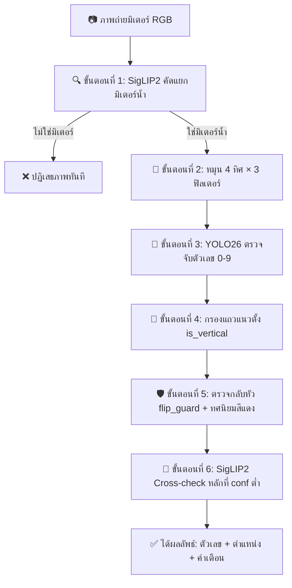

# 📖 คู่มือการสร้างระบบอ่านเลขมิเตอร์น้ำอัตโนมัติ (Step-by-Step Guide)

คู่มือนี้จะพาคุณสร้างระบบ **Automated Water Meter Reader** ตั้งแต่บรรทัดแรกจนเสร็จสมบูรณ์ ด้วย **Python 3.11, YOLO26, SigLIP2, OpenCV และ FastAPI** จัดการสภาพแวดล้อมด้วย **uv** และเขียนในรูปแบบ **Pure Functional Pipeline** ที่กระชับและเข้าใจง่าย

---

## 🎯 ภาพรวมสถาปัตยกรรม (System Architecture)



---

## 🛠️ ขั้นตอนที่ 0: ติดตั้งสภาพแวดล้อมด้วย `uv` (Python 3.11)

> [!IMPORTANT]
> ระบบนี้แนะนำให้ใช้ **Python 3.11** (รองรับ Python 3.10 – 3.12) และใช้เครื่องมือ **uv** ในการสร้าง Virtual Environment เพื่อความรวดเร็วและแม่นยำ

### 1. สร้าง Virtual Environment ด้วย Python 3.11
```bash
# สร้าง virtual environment เจาะจงเวอร์ชัน Python 3.11
uv venv --python 3.11
```

เปิดใช้งาน virtual environment:
* **Windows (PowerShell):** `.venv\Scripts\Activate.ps1`
* **Windows (Command Prompt):** `.venv\Scripts\activate.bat`
* **macOS / Linux:** `source .venv/bin/activate`

---

### 2. สร้างไฟล์ `requirements.txt` และติดตั้ง Packages
```text
fastapi>=0.115.0
uvicorn[standard]>=0.34.0
python-multipart>=0.0.20
ultralytics>=8.3.0
transformers>=4.48.0
torch>=2.4.0
torchvision>=0.19.0
opencv-python-headless>=4.10.0
numpy>=1.26.0
pillow>=10.4.0
gradio>=5.0.0
httpx>=0.28.0
```

ติดตั้งด้วยคำสั่ง:
```bash
uv pip install -r requirements.txt
```

---

## ⚙️ ขั้นตอนที่ 1: กำหนดค่าคงที่ (Constants)

เปิดไฟล์ `main.py` เริ่มต้นด้วยการนำเข้าไลบรารีและตั้งค่าพารามิเตอร์ทั้งหมดไว้ที่ส่วนบนสุด เพื่อให้ปรับแต่งได้จากที่เดียว

```python
from __future__ import annotations

import io
from time import perf_counter
from typing import Any

import cv2
import numpy as np
import torch
from fastapi import FastAPI, File, HTTPException, UploadFile
from fastapi.middleware.cors import CORSMiddleware
from PIL import Image
from starlette.concurrency import run_in_threadpool
import uvicorn

# ---------------------------------------------------------
# 1. Device & YOLO Settings
# ---------------------------------------------------------
DEVICE = "cuda" if torch.cuda.is_available() else "cpu"
YOLO_MODEL = "weights/MeterOCR.pt"
YOLO_IMGSZ = 960
YOLO_CONF = 0.35
CONF_RELIABLE = 0.60
EXPECTED_MIN_DIGITS = 4
EXPECTED_MAX_DIGITS = 9

# ---------------------------------------------------------
# 2. Search Space (การค้นหามุมและฟิลเตอร์)
# ---------------------------------------------------------
ROTATION_ANGLES = (0, 90, 180, 270)
PREP_LIST = ("orig", "clahe", "histeq")
CLAHE_CLIP = 2.0
CLAHE_GRID = (8, 8)

# ---------------------------------------------------------
# 3. Safety Guards (ตัวตรวจจับความปลอดภัย)
# ---------------------------------------------------------
ORIENT_MARGIN = 0.12
FLIP_GUARD_CONF = 0.60
FLIP_MAP = {0: 0, 1: 1, 2: 5, 5: 2, 6: 9, 8: 8, 9: 6}
ALIGN_MAX_SPREAD = 0.10
RED_THRESH = 0.08
RED_DOMINANCE = 2.0
MIN_CROP_PX = 4

# ---------------------------------------------------------
# 4. Zero-Shot Verification (SigLIP2)
# ---------------------------------------------------------
SIGLIP_MODEL = "google/siglip2-base-patch16-224"
METER_LABELS = (
    "water meter",
    "electricity meter",
    "gas meter",
    "not a meter",
)
METER_VERIFY_CONF = 0.50
```

> [!TIP]
> `FLIP_MAP` คือตารางตัวเลขที่มีลักษณะสมมาตรเมื่อหมุน 180° เช่น $6 \leftrightarrow 9$, $2 \leftrightarrow 5$, และ $0, 1, 8$ ที่คงรูปเดิม

---

## 🧠 ขั้นตอนที่ 2: โหลดโมเดลแบบ Lazy Loading

เพื่อไม่ให้เปลือง RAM และเปิดแอปได้ทันที เราจะโหลดโมเดลเมื่อมี Request แรกเข้ามาเท่านั้น

```python
_yolo = None
_siglip = None


def get_yolo() -> Any:
    """โหลดโมเดล YOLO เมื่อเรียกใช้ครั้งแรก พร้อม warm-up 1 ครั้ง"""
    global _yolo
    if _yolo is None:
        from ultralytics import YOLO
        _yolo = YOLO(YOLO_MODEL)
        _yolo.predict(np.zeros((640, 640, 3), dtype=np.uint8), verbose=False)
    return _yolo


def get_siglip() -> tuple[Any, Any]:
    """โหลดโมเดล SigLIP2 (Processor + Model) เมื่อเรียกใช้ครั้งแรก"""
    global _siglip
    if _siglip is None:
        from transformers import AutoModel, AutoProcessor
        processor = AutoProcessor.from_pretrained(SIGLIP_MODEL)
        model = AutoModel.from_pretrained(SIGLIP_MODEL).to(DEVICE).eval()
        _siglip = (processor, model)
    return _siglip
```

---

## 🎨 ขั้นตอนที่ 3: ฟังก์ชันจัดการภาพและพิกัดเรขาคณิต (Image & Geometry)

ในการอ่านมิเตอร์จริง ภาพมักจะ **ตะแคง, เลขจาง, หรือมีแสงสะท้อน** เราจึงต้องมีเครื่องมือจัดการภาพ:

### 3.1 การหมุนภาพและปรับคอนทราสต์
```python
def rotate_image(img_bgr: np.ndarray, angle: int) -> np.ndarray:
    """หมุนภาพตามเข็มนาฬิกา 90°, 180°, 270°"""
    if angle == 90:
        return cv2.rotate(img_bgr, cv2.ROTATE_90_CLOCKWISE)
    if angle == 180:
        return cv2.rotate(img_bgr, cv2.ROTATE_180)
    if angle == 270:
        return cv2.rotate(img_bgr, cv2.ROTATE_90_COUNTERCLOCKWISE)
    return img_bgr


def apply_prep(img_bgr: np.ndarray, prep: str) -> np.ndarray:
    """ปรับคอนทราสต์: CLAHE (บนช่อง L) หรือ HistEq (บนช่อง Y)"""
    if prep == "clahe":
        lab = cv2.cvtColor(img_bgr, cv2.COLOR_BGR2LAB)
        l, a, b = cv2.split(lab)
        l_clahe = cv2.createCLAHE(CLAHE_CLIP, CLAHE_GRID).apply(l)
        return cv2.cvtColor(cv2.merge([l_clahe, a, b]), cv2.COLOR_LAB2BGR)

    if prep == "histeq":
        ycrcb = cv2.cvtColor(img_bgr, cv2.COLOR_BGR2YCrCb)
        y, cr, cb = cv2.split(ycrcb)
        y_eq = cv2.equalizeHist(y)
        return cv2.cvtColor(cv2.merge([y_eq, cr, cb]), cv2.COLOR_YCrCb2BGR)

    return img_bgr
```

### 3.2 การแปลงพิกัดจุดเรขาคณิตย้อนกลับ (`remap_point` & `remap_bbox`)
เมื่อตรวจจับตัวเลขบนภาพที่หมุนแล้ว เราแปลงพิกัดกลับมาที่ภาพต้นฉบับทีละจุด $(x, y)$:

```python
def remap_point(x: float, y: float, angle: int, w: int, h: int) -> tuple[float, float]:
    """แปลงจุด (x, y) จากภาพที่หมุนแล้ว กลับสู่พิกัดภาพเดิม"""
    if angle == 90:
        return y, h - x      # หมุนขวา 90° -> x=y, y=h-x
    if angle == 180:
        return w - x, h - y  # กลับหัว 180° -> x=w-x, y=h-y
    if angle == 270:
        return w - y, x      # หมุนซ้าย 90° -> x=w-y, y=x
    return x, y


def remap_bbox(bbox: list[float], angle: int, w: int, h: int) -> list[float]:
    """แปลงกล่อง [x1, y1, x2, y2] กลับเป็นพิกัดภาพเดิม"""
    x1, y1, x2, y2 = bbox
    p1_x, p1_y = remap_point(x1, y1, angle, w, h)
    p2_x, p2_y = remap_point(x2, y2, angle, w, h)
    return [
        min(p1_x, p2_x),
        min(p1_y, p2_y),
        max(p1_x, p2_x),
        max(p1_y, p2_y),
    ]
```

### 3.3 การตัดกล่องซ้อน (NMS/Dedup) และการตรวจจับสีแดง
```python
def iou(box1: list[float], box2: list[float]) -> float:
    """คำนวณพื้นที่ทับซ้อน (Intersection over Union)"""
    x1, y1 = max(box1[0], box2[0]), max(box1[1], box2[1])
    x2, y2 = min(box1[2], box2[2]), min(box1[3], box2[3])

    intersection = max(0, x2 - x1) * max(0, y2 - y1)
    area1 = (box1[2] - box1[0]) * (box1[3] - box1[1])
    area2 = (box2[2] - box2[0]) * (box2[3] - box2[1])
    union = area1 + area2 - intersection

    return (intersection / union) if union > 0 else 0.0


def dedup_detections(dets: list[dict[str, Any]], thresh: float = 0.45) -> list[dict[str, Any]]:
    """ตัดกล่องที่ซ้อนทับกันออก เหลือเฉพาะตัวที่มั่นใจสูงสุด"""
    kept: list[dict[str, Any]] = []
    for d in sorted(dets, key=lambda x: x["confidence"], reverse=True):
        if not any(iou(d["bbox"], k["bbox"]) > thresh for k in kept):
            kept.append(d)
    return sorted(kept, key=lambda x: x["center_x"])


def red_ratio(img_bgr: np.ndarray, bbox: list[float]) -> float:
    """คำนวณสัดส่วนสีแดงในกล่องตัวเลข (หลักทศนิยมสีแดงต้องอยู่ขวาสุดเสมอ)"""
    x1, y1, x2, y2 = [int(v) for v in bbox]
    pad_x = max(1, int((x2 - x1) * 0.15))
    pad_y = max(1, int((y2 - y1) * 0.15))

    crop = img_bgr[
        max(0, y1 + pad_y): min(img_bgr.shape[0], y2 - pad_y),
        max(0, x1 + pad_x): min(img_bgr.shape[1], x2 - pad_x),
    ]
    if crop.size == 0:
        return 0.0

    hsv = cv2.cvtColor(crop, cv2.COLOR_BGR2HSV)
    mask1 = cv2.inRange(hsv, (0, 40, 40), (12, 255, 255))
    mask2 = cv2.inRange(hsv, (165, 40, 40), (180, 255, 255))
    red_mask = mask1 | mask2

    return float(np.mean(red_mask > 0))
```

---

## 🔍 ขั้นตอนที่ 4: การตรวจจับและค้นหามุมที่ดีที่สุด (Detection Engine)

### 4.1 ตรวจจับตัวเลขและกรองคอลัมน์แนวตั้ง (`is_vertical`)
```python
def detect_digits(img_bgr: np.ndarray) -> list[dict[str, Any]]:
    """ใช้ YOLO ตรวจจับตัวเลข 0-9 และเรียงจากซ้ายไปขวา"""
    res = get_yolo().predict(
        img_bgr,
        imgsz=YOLO_IMGSZ,
        conf=YOLO_CONF,
        device=DEVICE,
        verbose=False,
    )

    boxes = []
    for b in res[0].boxes:
        x1, y1, x2, y2 = b.xyxy[0].tolist()
        boxes.append({
            "digit": int(b.cls[0].item()),
            "confidence": float(b.conf[0].item()),
            "bbox": [x1, y1, x2, y2],
            "center_x": (x1 + x2) / 2.0,
            "center_y": (y1 + y2) / 2.0,
        })

    return sorted(boxes, key=lambda d: d["center_x"])


def is_vertical(dets: list[dict[str, Any]], img_w: int, img_h: int) -> dict[str, Any]:
    """ตรวจว่ากล่องเรียงตัวเป็นแนวตั้งหรือไม่ (แนวนอน width_span ต้องมากกว่า height_span)"""
    if len(dets) < 2:
        return {"vertical": False}

    xs = [d["center_x"] / img_w for d in dets]
    ys = [d["center_y"] / img_h for d in dets]

    width_span = max(xs) - min(xs)   # ระยะกว้างแนวนอน
    height_span = max(ys) - min(ys)  # ระยะสูงแนวตั้ง

    # ถ้าความสูงมากกว่าความกว้าง แสดงว่าเป็นคอลัมน์แนวตั้ง (เช่น วันที่/เลขรุ่น)
    is_vert = (height_span >= width_span * 0.8) or (width_span <= 0.05 and height_span >= 0.08)
    return {"vertical": is_vert}
```

### 4.2 ค้นหา 4 ทิศ × 3 ฟิลเตอร์ (`detect_digits_best`)
```python
def eval_orientation(bgr_img: np.ndarray, angle: int, prep: str) -> dict[str, Any]:
    """ประเมินคะแนนของ 1 มุม × 1 ฟิลเตอร์"""
    rot = rotate_image(bgr_img, angle)
    proc = apply_prep(rot, prep)
    dets = dedup_detections(detect_digits(proc))

    rh, rw = rot.shape[:2]
    vert = is_vertical(dets, rw, rh)
    n = len(dets)

    if not dets or vert["vertical"] or not (EXPECTED_MIN_DIGITS <= n <= EXPECTED_MAX_DIGITS):
        return {
            "score": 0.0,
            "dets": dets,
            "prep": prep,
            "vert": vert,
        }

    mean_conf = float(np.mean([d["confidence"] for d in dets]))
    score = mean_conf * n

    # กฎสีแดง: หลักทศนิยมสีแดงต้องอยู่ขวาสุดเสมอ
    r_first = red_ratio(proc, dets[0]["bbox"])
    r_last = red_ratio(proc, dets[-1]["bbox"])

    if r_first > RED_THRESH and r_first > r_last * RED_DOMINANCE:
        score *= 0.5   # แดงอยู่ซ้าย -> ภาพน่าจะกลับหัว (ตัดคะแนน)
    elif r_last > RED_THRESH and r_last > r_first * RED_DOMINANCE:
        score *= 1.05  # แดงอยู่ขวา -> ทิศทางถูกต้อง (เพิ่มคะแนน)

    return {
        "score": score,
        "dets": dets,
        "prep": prep,
        "vert": vert,
    }


def detect_digits_best(rgb_img: np.ndarray) -> tuple[list[dict[str, Any]], dict[str, Any] | None]:
    """ทดลอง 4 ทิศ × 3 ฟิลเตอร์ (12 รูปแบบ) แล้วเลือกชุดที่คะแนนสูงสุด"""
    h, w = rgb_img.shape[:2]
    bgr = cv2.cvtColor(rgb_img, cv2.COLOR_RGB2BGR)

    candidates = {}
    for angle in ROTATION_ANGLES:
        best_in_angle = max(
            [eval_orientation(bgr, angle, prep) for prep in PREP_LIST],
            key=lambda c: c["score"],
        )
        candidates[angle] = best_in_angle

    cand0 = candidates[0]
    best_angle, best_cand = max(
        candidates.items(),
        key=lambda item: item[1]["score"],
    )

    # Margin Rule: มุมอื่นต้องชนะมุม 0° เกินกำหนด จึงยอมสลับมุม (กันพลิกฉิวเฉียด)
    if (
        best_angle != 0
        and cand0["dets"]
        and not cand0["vert"]["vertical"]
        and (best_cand["score"] - cand0["score"] < ORIENT_MARGIN)
    ):
        best_angle, best_cand = 0, cand0

    best_dets = best_cand["dets"]
    best_meta = None

    if best_dets:
        best_meta = {
            "angle": best_angle,
            "prep": best_cand["prep"],
            "clahe": best_cand["prep"] == "clahe",
        }
        for d in best_dets:
            d["bbox"] = remap_bbox(d["bbox"], best_angle, w, h)
            d["center_x"] = (d["bbox"][0] + d["bbox"][2]) / 2.0
            d["center_y"] = (d["bbox"][1] + d["bbox"][3]) / 2.0

    return best_dets, best_meta
```

---

## 🛡️ ขั้นตอนที่ 5: ระบบตรวจสอบความปลอดภัย (Safety Guards)

### 5.1 ยืนยันว่าเป็นมิเตอร์น้ำด้วย SigLIP2
```python
@torch.inference_mode()
def check_water_meter(rgb_img: np.ndarray) -> dict[str, Any]:
    """SigLIP2 Zero-shot Classifier ตรวจสอบว่าเป็นภาพมิเตอร์น้ำจริง"""
    processor, model = get_siglip()

    inputs = processor(
        text=list(METER_LABELS),
        images=Image.fromarray(rgb_img),
        padding="max_length",
        return_tensors="pt",
    ).to(DEVICE)

    outputs = model(**inputs)
    probs = torch.softmax(outputs.logits_per_image, dim=1)[0].cpu().numpy()
    pred_idx = int(np.argmax(probs))
    pred_label = METER_LABELS[pred_idx]

    return {
        "verified": pred_label == "water meter" and float(probs[0]) >= METER_VERIFY_CONF,
        "predicted_class": pred_label,
        "confidence": float(probs[0]),
    }
```

### 5.2 ตรวจสอบการกลับหัว 180° (`flip_guard`) และ Cross-check
```python
def flip_guard(rgb_img: np.ndarray, digits: list[dict[str, Any]], meta: dict[str, Any] | None) -> dict[str, Any]:
    """ตรวจสอบภาพกลับหัวแบบกระจกสะท้อน (Mirror Check เช่น 6<->9, 2<->5)"""
    if not digits or not meta:
        return {
            "warned": False,
            "anti_reading": "",
            "anti_confidence": 0.0,
        }

    anti_angle = (meta["angle"] + 180) % 360
    rot_bgr = rotate_image(cv2.cvtColor(rgb_img, cv2.COLOR_RGB2BGR), anti_angle)
    anti_dets = dedup_detections(detect_digits(apply_prep(rot_bgr, meta["prep"])))

    if not anti_dets:
        return {
            "warned": False,
            "anti_reading": "",
            "anti_confidence": 0.0,
        }

    anti_reading = "".join(str(d["digit"]) for d in anti_dets)
    mean_conf = float(np.mean([d["confidence"] for d in anti_dets]))

    # เปรียบเทียบเลขหัว-ท้ายกับตาราง FLIP_MAP
    digits_rev = [d["digit"] for d in reversed(digits)]
    anti_vals = [d["digit"] for d in anti_dets]

    consistent = (
        len(anti_vals) == len(digits_rev)
        and all(
            FLIP_MAP.get(orig) == anti
            for orig, anti in zip(digits_rev, anti_vals)
            if orig in FLIP_MAP
        )
    )

    return {
        "warned": bool(mean_conf >= FLIP_GUARD_CONF and not consistent),
        "anti_reading": anti_reading,
        "anti_confidence": round(mean_conf, 4),
    }


@torch.inference_mode()
def cross_check_digits(rgb_img: np.ndarray, digits: list[dict[str, Any]], h: int, w: int, angle: int = 0) -> list[dict[str, Any]]:
    """SigLIP2 ตรวจทานเฉพาะหลักที่ YOLO มั่นใจต่ำ (< 0.60)"""
    low_conf = [d for d in digits if d["confidence"] < CONF_RELIABLE]
    if not low_conf:
        return []

    processor, model = get_siglip()
    labels = [str(i) for i in range(10)]
    mismatches = []

    for d in low_conf:
        x1, y1, x2, y2 = [int(v) for v in d["bbox"]]
        crop = rgb_img[max(0, y1): min(h, y2), max(0, x1): min(w, x2)]

        if crop.shape[0] < MIN_CROP_PX or crop.shape[1] < MIN_CROP_PX:
            continue

        if angle != 0:
            crop_bgr = cv2.cvtColor(crop, cv2.COLOR_RGB2BGR)
            crop = cv2.cvtColor(rotate_image(crop_bgr, angle), cv2.COLOR_BGR2RGB)

        inputs = processor(
            text=labels,
            images=Image.fromarray(crop),
            padding="max_length",
            return_tensors="pt",
        ).to(DEVICE)

        outputs = model(**inputs)
        probs = torch.softmax(outputs.logits_per_image, dim=1)[0].cpu().numpy()
        pred = int(np.argmax(probs))

        if pred != d["digit"]:
            mismatches.append({
                "position": d["position"],
                "yolo_digit": d["digit"],
                "siglip_digit": pred,
                "siglip_confidence": float(probs[pred]),
            })

    return mismatches
```

---

## 🚀 ขั้นตอนที่ 6: ประกอบ Pipeline หลัก และ FastAPI Endpoint

```python
def read_meter(rgb_img: np.ndarray) -> dict[str, Any]:
    """ไปป์ไลน์หลัก: รับภาพ RGB -> ประมวลผล -> ส่งออกผลลัพธ์ที่สะอาดและกะทัดรัด"""
    t0 = perf_counter()
    h, w = rgb_img.shape[:2]

    # 1. ตรวจสอบว่าใช่มิเตอร์น้ำจริงไหม
    meter = check_water_meter(rgb_img)
    if not meter["verified"]:
        return {
            "reading": "",
            "digits": [],
            "meter_check": meter,
            "processing": None,
            "warnings": [f"ภาพนี้ไม่ใช่มิเตอร์น้ำ ({meter['predicted_class']})"],
            "elapsed_ms": round((perf_counter() - t0) * 1000, 1),
        }

    # 2. ค้นหาตัวเลขและมุมที่ดีที่สุด
    dets, meta = detect_digits_best(rgb_img)
    if not dets:
        return {
            "reading": "",
            "digits": [],
            "meter_check": meter,
            "processing": meta,
            "warnings": ["ตรวจไม่พบตัวเลข"],
            "elapsed_ms": round((perf_counter() - t0) * 1000, 1),
        }

    digits = [{
        "position": i,
        "digit": d["digit"],
        "confidence": round(d["confidence"], 4),
        "bbox": d["bbox"],
        "reliable": d["confidence"] >= CONF_RELIABLE,
    } for i, d in enumerate(dets, 1)]
    mean_conf = float(np.mean([d["confidence"] for d in digits]))

    # 3. ตรวจสอบว่าไม่ใช่คอลัมน์แนวตั้ง (เช่น วันที่)
    if meta and meta["angle"] == 0 and is_vertical(dets, w, h)["vertical"]:
        return {
            "reading": "",
            "digits": [],
            "meter_check": meter,
            "processing": meta,
            "warnings": ["กล่องเรียงแนวตั้ง — ไม่ใช่ค่ามิเตอร์"],
            "elapsed_ms": round((perf_counter() - t0) * 1000, 1),
        }

    # 4. ตรวจสอบความถูกต้องและสร้างคำเตือน
    flip = flip_guard(rgb_img, digits, meta)

    align_vals = [
        (d["bbox"][0] + d["bbox"][2]) / (2 * w)
        if meta and meta["angle"] in (90, 270)
        else (d["bbox"][1] + d["bbox"][3]) / (2 * h)
        for d in digits
    ]
    align_ok = float(np.std(align_vals)) <= ALIGN_MAX_SPREAD

    mismatches = cross_check_digits(
        rgb_img,
        digits,
        h,
        w,
        meta["angle"] if meta else 0,
    )

    warns = [
        msg
        for cond, msg in [
            (
                not (EXPECTED_MIN_DIGITS <= len(digits) <= EXPECTED_MAX_DIGITS),
                f"จำนวนหลัก {len(digits)} นอกช่วง {EXPECTED_MIN_DIGITS}-{EXPECTED_MAX_DIGITS}",
            ),
            (digits[0]["digit"] == 0, "หลักแรกเป็น 0 — อาจเกินมา 1 หลัก"),
            (mean_conf < CONF_RELIABLE, f"mean conf ต่ำ {mean_conf:.2f} — ภาพอาจเบลอ/เอียง"),
            (
                flip["warned"],
                f"อาจกลับหัว! หมุน 180° ได้ {flip['anti_reading']} ({flip['anti_confidence']:.2f}) — ตรวจภาพก่อนบันทึก",
            ),
            (not align_ok, "กล่องไม่เรียงแนว — อาจเป็นป้าย/วันที่"),
        ]
        if cond
    ]

    warns += [
        f"หลักที่ {d['position']} ({d['digit']}) conf ต่ำ {d['confidence']:.2f} — ควรตรวจด้วยตา"
        for d in digits
        if not d["reliable"]
    ]

    warns += [
        f"หลักที่ {m['position']}: YOLO {m['yolo_digit']} vs SigLIP {m['siglip_digit']} ({m['siglip_confidence']:.2f})"
        for m in mismatches
    ]

    return {
        "reading": "".join(str(d["digit"]) for d in digits),
        "digits": digits,
        "mean_confidence": round(mean_conf, 4),
        "meter_check": meter,
        "processing": {"best": meta},
        "warnings": warns,
        "elapsed_ms": round((perf_counter() - t0) * 1000, 1),
    }


# ---------------------------------------------------------
# FastAPI Web Service
# ---------------------------------------------------------
app = FastAPI(
    title="Meter Reader API",
    version="1.1",
    description="API อ่านเลขมิเตอร์น้ำอัตโนมัติ (Intuitive Functional Pipeline)",
)
app.add_middleware(
    CORSMiddleware,
    allow_origins=["*"],
    allow_methods=["*"],
    allow_headers=["*"],
)
ALLOWED_TYPES = {"image/jpeg", "image/png", "image/webp", "image/bmp"}


@app.get("/api/health")
def health() -> dict[str, Any]:
    return {
        "status": "ok",
        "device": DEVICE,
        "yolo_loaded": _yolo is not None,
        "siglip_loaded": _siglip is not None,
    }


@app.post("/api/read-meter")
async def read_meter_endpoint(file: UploadFile = File(...)) -> dict[str, Any]:
    if file.content_type not in ALLOWED_TYPES:
        raise HTTPException(status_code=415, detail="ชนิดไฟล์ไม่รองรับ")

    data = await file.read()
    try:
        img = Image.open(io.BytesIO(data))
        img.load()
        arr = np.asarray(img.convert("RGB"))
    except Exception:
        raise HTTPException(status_code=422, detail="อ่านไฟล์ภาพไม่ได้")

    return await run_in_threadpool(read_meter, arr)


if __name__ == "__main__":
    uvicorn.run("main:app", host="127.0.0.1", port=8000, reload=True)
```

---

## 🧪 ขั้นตอนที่ 7: การรันและทดสอบด้วย `uv`

### 1. รัน FastAPI Backend:
```bash
uv run python main.py
```
เปิดทดสอบ API Docs แบบ Interactive ได้ที่ [http://127.0.0.1:8000/docs](http://127.0.0.1:8000/docs)

### 2. รัน Gradio Frontend:
```bash
uv run python gradio_app.py
```
เปิดเบราว์เซอร์ที่ [http://127.0.0.1:7860](http://127.0.0.1:7860) แล้วอัปโหลดภาพมิเตอร์น้ำเพื่อทดสอบการอ่านค่าและตรวจจับตัวเลขได้ทันที 🎉
