<p align="center"></p>

<p align="center"><strong>เอกสารประกอบการสอน</strong></p>
<p align="center"><strong>ระบบอ่านค่ามาตรวัดน้ำอัตโนมัติด้วยปัญญาประดิษฐ์และคอมพิวเตอร์วิทัศน์</strong></p>
<p align="center"><strong>Automated Water Meter Reading System using Deep Learning & Computer Vision</strong></p>

<p align="center"><strong>นายจิรเมธ ทองเปลว รหัสประจำตัว 674230013</strong></p>
<p align="center">หมู่เรียน 67/44</p>
<p align="center">โครงงานนี้เป็นส่วนหนึ่งของการศึกษารายวิชา 7203602</p>
<p align="center">โครงงานด้านเทคโนโลยีสารสนเทศ 2</p>
<p align="center">สาขาวิชาเทคโนโลยีสารสนเทศ คณะวิทยาศาสตร์และเทคโนโลยี</p>
<p align="center">มหาวิทยาลัยราชภัฏนครปฐม</p>
<p align="center">ภาคเรียนที่ 1 ปีการศึกษา 2569</p>

<div style="page-break-after: always;"></div>

## คำนำ

&emsp;&emsp;&emsp;&emsp;คู่มือฉบับนี้จัดทำขึ้นเพื่อใช้เป็นแนวทางในการศึกษาและพัฒนาระบบอ่านค่ามาตรวัดน้ำอัตโนมัติจากภาพถ่าย โดยประยุกต์ใช้เทคโนโลยีปัญญาประดิษฐ์ (Artificial Intelligence) การประมวลผลภาพ (Image Processing) และการรู้จำตัวเลขจากภาพ (Digit Recognition from Images) เพื่อสนับสนุนกระบวนการอ่านและบันทึกข้อมูลจากมาตรวัดน้ำ ตลอดจนเป็นแนวทางสำหรับผู้ที่สนใจนำเทคโนโลยีดังกล่าวไปประยุกต์ใช้ในการพัฒนาระบบอัตโนมัติในลักษณะอื่นต่อไป

&emsp;&emsp;&emsp;&emsp;เนื้อหาของคู่มือฉบับนี้ครอบคลุมกระบวนการพัฒนาระบบอ่านค่ามาตรวัดน้ำอัตโนมัติอย่างเป็นลำดับ ตั้งแต่การรับและเตรียมข้อมูลภาพ การตรวจสอบและคัดกรองข้อมูล การปรับปรุงคุณภาพของภาพถ่ายด้วยเทคนิคการประมวลผลภาพ การตรวจจับตัวเลขบนหน้าปัดมาตรวัดน้ำ การตรวจจับและรู้จำตัวเลขจากภาพ (digit recognition from images) ซึ่งแม้ภารกิจจะมีลักษณะเกี่ยวข้องกับ OCR แต่ implementation หลักของโครงงานใช้แบบจำลองการตรวจจับวัตถุ (Object Detection) ตลอดจนการประมวลผลและส่งออกผลลัพธ์ของระบบ นอกจากนี้ ยังครอบคลุมการประยุกต์ใช้แบบจำลอง YOLO และ SigLIP2 รวมถึงการให้บริการแบบจำลองผ่าน FastAPI และการพัฒนาส่วนติดต่อผู้ใช้ด้วย Gradio เพื่อให้สามารถทดสอบการทำงานของระบบได้อย่างครบถ้วน

&emsp;&emsp;&emsp;&emsp;ผู้จัดทำได้เรียบเรียงเนื้อหาและตัวอย่างการพัฒนาระบบโดยอาศัยการศึกษาค้นคว้าจากเอกสารทางวิชาการ งานวิจัย โครงการโอเพนซอร์ส และแหล่งข้อมูลทางเทคนิคที่เกี่ยวข้อง โดยจัดลำดับเนื้อหาให้มีความต่อเนื่องและสัมพันธ์กันตามกระบวนการทำงานของระบบ เพื่อให้ผู้อ่านสามารถศึกษา ทำความเข้าใจ และนำแนวทางรวมถึงตัวอย่างโค้ดไปประยุกต์ใช้ได้อย่างถูกต้องและเหมาะสม คู่มือฉบับนี้มุ่งหวังให้เป็นประโยชน์ต่อนักพัฒนาซอฟต์แวร์ นักศึกษา วิศวกรปัญญาประดิษฐ์ และผู้สนใจด้านคอมพิวเตอร์วิทัศน์ ตลอดจนผู้ที่ต้องการศึกษาแนวทางการประยุกต์ใช้ปัญญาประดิษฐ์เพื่อพัฒนาระบบอ่านข้อมูลจากภาพ

&emsp;&emsp;&emsp;&emsp;ผู้จัดทำหวังเป็นอย่างยิ่งว่าคู่มือฉบับนี้จะเป็นประโยชน์ต่อการศึกษาและการพัฒนาระบบอ่านค่ามาตรวัดน้ำอัตโนมัติ รวมทั้งสามารถนำองค์ความรู้และแนวทางที่นำเสนอไปประยุกต์ใช้ในการพัฒนาระบบที่เกี่ยวข้องกับการตรวจจับและรู้จำข้อมูลจากภาพในอนาคต หากมีข้อเสนอแนะอันเป็นประโยชน์ต่อการปรับปรุงคู่มือฉบับนี้ ผู้จัดทำขอน้อมรับด้วยความขอบคุณ

<p align="right">นายจิรเมธ ทองเปลว</p>
<p align="right">สิงหาคม 2569</p>

<div style="page-break-after: always;"></div>

# คู่มือการพัฒนาระบบอ่านค่ามาตรวัดน้ำอัตโนมัติด้วยปัญญาประดิษฐ์
## Automated Water Meter Reading System using Deep Learning & Computer Vision

&emsp;&emsp;&emsp;&emsp;คู่มือฉบับนี้จัดทำขึ้นสำหรับนักศึกษาที่มีพื้นฐานการเขียนโปรแกรมภาษา Python และมุ่งเน้นการศึกษาแนวทางการพัฒนาระบบอ่านค่ามาตรวัดน้ำอัตโนมัติจากภาพถ่ายโดยประยุกต์ใช้การตรวจจับวัตถุและคอมพิวเตอร์วิทัศน์ (Automated Water Meter Reading using Object Detection and Computer Vision) เพื่อให้ผู้ศึกษาสามารถทำความเข้าใจสถาปัตยกรรมและกระบวนการทำงานในแต่ละขั้นตอนอย่างเป็นลำดับ ผ่านการออกแบบรหัสต้นฉบับที่เป็นโมดูลตามหน้าที่ (Functional Modular Design) ทั้งนี้ แม้ภารกิจของระบบจะจัดอยู่ในกลุ่มงานการรู้จำตัวเลขจากภาพถ่าย (OCR-related digit recognition task) แต่กลไกแกนหลักที่พัฒนาขึ้นในโครงงานนี้ใช้แบบจำลองการตรวจจับวัตถุ (Deep Learning-based Object Detection) ในการระบุตำแหน่งกล่องพิกัดและจำแนกตัวเลขแต่ละหลักโดยตรง แทนการพึ่งพาโปรแกรมรู้จำอักขระสำเร็จรูป (OCR Engine)

> **เทคโนโลยีหลักที่ประยุกต์ใช้ในโครงงาน:** Python, YOLO (แบบจำลองตรวจจับตัวเลข), SigLIP2 (แบบจำลองคัดกรองประเภทภาพ), OpenCV (การประมวลผลภาพดิจิทัล), FastAPI (บริการส่วนเชื่อมต่อโปรแกรมประยุกต์), Gradio (ส่วนติดต่อผู้ใช้บนเว็บ), และ `uv` (เครื่องมือจัดการสภาพแวดล้อมและชุดคำสั่ง)

---

## สารบัญเนื้อหา
[ข้อแนะนำเบื้องต้นสำหรับการศึกษา](#ข้อแนะนำเบื้องต้นสำหรับการศึกษา)  
[บทที่ 1: ทฤษฎีพื้นฐาน เทคโนโลยีที่ใช้ และการประมวลผลภาพ](#บทที่-1-ทฤษฎีพื้นฐาน-เทคโนโลยีที่ใช้-และการประมวลผลภาพ)  
&emsp;&emsp;[1.1 ความเป็นมาและความสำคัญของปัญหา](#11-ความเป็นมาและความสำคัญของปัญหา)  
&emsp;&emsp;[1.2 แนวคิดในการแก้ปัญหา](#12-แนวคิดในการแก้ปัญหา)  
&emsp;&emsp;[1.3 วัตถุประสงค์และคำถามการวิจัย](#13-วัตถุประสงค์และคำถามการวิจัย)  
&emsp;&emsp;&emsp;&emsp;[1.3.1 วัตถุประสงค์ของระบบ](#131-วัตถุประสงค์ของระบบ)  
&emsp;&emsp;&emsp;&emsp;[1.3.2 คำถามการวิจัย](#132-คำถามการวิจัย)  
&emsp;&emsp;[1.4 ขอบเขตการศึกษา](#14-ขอบเขตการศึกษา)  
&emsp;&emsp;[1.5 ผลที่คาดว่าจะได้รับ](#15-ผลที่คาดว่าจะได้รับ)  
&emsp;&emsp;[1.6 เทคนิคและอัลกอริทึมที่พัฒนาขึ้นในโครงงาน](#16-เทคนิคและอัลกอริทึมที่พัฒนาขึ้นในโครงงาน)  
&emsp;&emsp;&emsp;&emsp;[1.6.1 เทคนิคการคัดกรองภาพด้วย Zero-shot Classification (SigLIP2)](#161-เทคนิคการคัดกรองภาพด้วย-zero-shot-classification-siglip2)  
&emsp;&emsp;&emsp;&emsp;[1.6.2 เทคนิคการค้นหาเชิงสมมติฐานพหุคูณ 12 รูปแบบ](#162-เทคนิคการค้นหาเชิงสมมติฐานพหุคูณ-12-รูปแบบ)  
&emsp;&emsp;&emsp;&emsp;[1.6.3 เทคนิคการตัดกรอบสี่เหลี่ยมซ้ำซ้อนด้วย IoU](#163-เทคนิคการตัดกรอบสี่เหลี่ยมซ้ำซ้อนด้วย-iou)  
&emsp;&emsp;&emsp;&emsp;[1.6.4 เทคนิคการแปลงพิกัดเรขาคณิตย้อนกลับ](#164-เทคนิคการแปลงพิกัดเรขาคณิตย้อนกลับ)  
&emsp;&emsp;&emsp;&emsp;[1.6.5 เทคนิคการกรองเค้าโครงแถวตัวเลขแนวตั้ง](#165-เทคนิคการกรองเค้าโครงแถวตัวเลขแนวตั้ง)  
&emsp;&emsp;&emsp;&emsp;[1.6.6 เทคนิคกลไกความปลอดภัยและการตรวจทานความถูกต้อง](#166-เทคนิคกลไกความปลอดภัยและการตรวจทานความถูกต้อง)  
&emsp;&emsp;&emsp;&emsp;[1.6.7 เทคนิคการตรวจจับทิศทางข้อความและสัญลักษณ์หน่วย m บนหน้าปัดเพื่อจัดวางแนวระนาบ](#167-เทคนิคการตรวจจับทิศทางข้อความและสัญลักษณ์หน่วย-m-บนหน้าปัดเพื่อจัดวางแนวระนาบ)  
&emsp;&emsp;[1.7 เทคโนโลยี ชุดเครื่องมือ และไลบรารีที่ใช้ในโครงงาน](#17-เทคโนโลยี-ชุดเครื่องมือ-และไลบรารีที่ใช้ในโครงงาน)  
&emsp;&emsp;[1.8 ขั้นตอนและวิธีการทำงานของระบบ](#18-ขั้นตอนและวิธีการทำงานของระบบ)  
&emsp;&emsp;[1.9 การฝึกแบบจำลองสำหรับการตรวจจับตัวเลข](#19-การฝึกแบบจำลองสำหรับการตรวจจับตัวเลข)  
&emsp;&emsp;&emsp;&emsp;[1.9.1 การเตรียมชุดข้อมูลจาก Roboflow และการแบ่งชุดข้อมูล](#191-การเตรียมชุดข้อมูลจาก-roboflow-และการแบ่งชุดข้อมูล)  
&emsp;&emsp;&emsp;&emsp;[1.9.2 การฝึกแบบจำลอง YOLO บน Google Colab](#192-การฝึกแบบจำลอง-yolo-บน-google-colab)  
&emsp;&emsp;&emsp;&emsp;[1.9.3 การประเมินประสิทธิภาพตัวตรวจจับวัตถุ](#193-การประเมินประสิทธิภาพตัวตรวจจับวัตถุ)  
&emsp;&emsp;[1.10 สภาพแวดล้อมและการจัดการโครงงานด้วย `uv`](#110-สภาพแวดล้อมและการจัดการโครงงานด้วย-uv)  
&emsp;&emsp;&emsp;&emsp;[1.10.1 โครงสร้างไฟล์ของระบบ](#1101-โครงสร้างไฟล์ของระบบ)  
&emsp;&emsp;&emsp;&emsp;[1.10.2 การสร้างสภาพแวดล้อมและการติดตั้งไลบรารี](#1102-การสร้างสภาพแวดล้อมและการติดตั้งไลบรารี)  
&emsp;&emsp;[1.11 การวิเคราะห์รหัสต้นฉบับการประมวลผลคอมพิวเตอร์วิทัศน์](#111-การวิเคราะห์รหัสต้นฉบับการประมวลผลคอมพิวเตอร์วิทัศน์)  
&emsp;&emsp;&emsp;&emsp;[1.11.1 การหมุนภาพและการปรับปรุงคุณภาพภาพ (rotate_image, apply_prep)](#1111-การหมุนภาพและการปรับปรุงคุณภาพภาพ-rotate_image-apply_prep)  
&emsp;&emsp;&emsp;&emsp;[1.11.2 การแปลงพิกัดจุดเดี่ยวและกล่องขอบเขต (remap_point, remap_bbox)](#1112-การแปลงพิกัดจุดเดี่ยวและกล่องขอบเขต-remap_point-remap_bbox)  
&emsp;&emsp;&emsp;&emsp;[1.11.3 การกรองแถวตัวเลขแนวตั้ง (is_vertical)](#1113-การกรองแถวตัวเลขแนวตั้ง-is_vertical)  
&emsp;&emsp;&emsp;&emsp;[1.11.4 การค้นหาทิศทางและฟิลเตอร์ที่เหมาะสม (detect_digits_best)](#1114-การค้นหาทิศทางและฟิลเตอร์ที่เหมาะสม-detect_digits_best)  
&emsp;&emsp;&emsp;&emsp;[1.11.5 การตรวจจับทิศทางข้อความและสัญลักษณ์ m (detect_dial_text_orientation)](#1115-การตรวจจับทิศทางข้อความและสัญลักษณ์-m-detect_dial_text_orientation)  
[บทที่ 2: หลักการและทฤษฎีที่เกี่ยวข้อง](#บทที่-2-หลักการและทฤษฎีที่เกี่ยวข้อง)  
&emsp;&emsp;[2.1 ระบบงานเดิม](#21-ระบบงานเดิม)  
&emsp;&emsp;[2.2 ระบบงานและงานวิจัยที่เกี่ยวข้อง](#22-ระบบงานและงานวิจัยที่เกี่ยวข้อง)  
&emsp;&emsp;[2.3 วงจรการพัฒนาซอฟต์แวร์ (SDLC) ที่ใช้ในโครงงาน](#23-วงจรการพัฒนาซอฟต์แวร์-sdlc-ที่ใช้ในโครงงาน)  
[บทที่ 3: การพัฒนาแอปพลิเคชันและส่วนติดต่อผู้ใช้](#บทที่-3-การพัฒนาแอปพลิเคชันและส่วนติดต่อผู้ใช้)  
&emsp;&emsp;[3.1 สถาปัตยกรรม 3 ขบวนการและการตรวจสอบผ่านจุดทดสอบ](#31-สถาปัตยกรรม-3-ขบวนการและการตรวจสอบผ่านจุดทดสอบ)  
&emsp;&emsp;[3.2 ขบวนการที่ 1: การเตรียมข้อมูลและคัดกรองภาพนำเข้า (Preprocessing)](#32-ขบวนการที่-1-การเตรียมข้อมูลและคัดกรองภาพนำเข้า-preprocessing)  
&emsp;&emsp;&emsp;&emsp;[3.2.1 ขั้นตอนการทำงานและเหตุผลความจำเป็นของแต่ละฟีเจอร์](#321-ขั้นตอนการทำงานและเหตุผลความจำเป็นของแต่ละฟีเจอร์)  
&emsp;&emsp;&emsp;&emsp;[3.2.2 รหัสต้นฉบับของขบวนการเตรียมข้อมูลและคัดกรองภาพ](#322-รหัสต้นฉบับของขบวนการเตรียมข้อมูลและคัดกรองภาพ)  
&emsp;&emsp;&emsp;&emsp;[3.2.3 การทดสอบความถูกต้องของขบวนการเตรียมข้อมูล (Checkpoint 1: Preprocessing & Gatekeeper Visual Test)](#323-การทดสอบความถูกต้องของขบวนการเตรียมข้อมูล-checkpoint-1-preprocessing--gatekeeper-visual-test)  
&emsp;&emsp;[3.3 ขบวนการที่ 2: การปรับปรุงคุณภาพภาพและวิเคราะห์ระนาบ (Process)](#33-ขบวนการที่-2-การปรับปรุงคุณภาพภาพและวิเคราะห์ระนาบ-process)  
&emsp;&emsp;&emsp;&emsp;[3.3.1 ขั้นตอนการทำงานและเหตุผลความจำเป็นของแต่ละฟีเจอร์](#331-ขั้นตอนการทำงานและเหตุผลความจำเป็นของแต่ละฟีเจอร์)  
&emsp;&emsp;&emsp;&emsp;[3.3.2 รหัสต้นฉบับของขบวนการปรับปรุงคุณภาพภาพและวิเคราะห์ระนาบ](#332-รหัสต้นฉบับของขบวนการปรับปรุงคุณภาพภาพและวิเคราะห์ระนาบ)  
&emsp;&emsp;&emsp;&emsp;[3.3.3 การทดสอบความถูกต้องของขบวนการปรับปรุงภาพ (Checkpoint 2: Process & Transformation Visual Test)](#333-การทดสอบความถูกต้องของขบวนการปรับปรุงภาพ-checkpoint-2-process--transformation-visual-test)  
&emsp;&emsp;[3.4 ขบวนการที่ 3: การตรวจจับและรู้จำตัวเลข (Output)](#34-ขบวนการที่-3-การตรวจจับและรู้จำตัวเลข-output)  
&emsp;&emsp;&emsp;&emsp;[3.4.1 การสอนฝึกแบบจำลองสำหรับการตรวจจับตัวเลข YOLO26 (Required Training Prerequisite)](#341-การสอนฝึกแบบจำลองสำหรับการตรวจจับตัวเลข-yolo26-required-training-prerequisite)  
&emsp;&emsp;&emsp;&emsp;[3.4.2 ขั้นตอนการทำงานและเหตุผลความจำเป็นของแต่ละฟีเจอร์](#342-ขั้นตอนการทำงานและเหตุผลความจำเป็นของแต่ละฟีเจอร์)  
&emsp;&emsp;&emsp;&emsp;[3.4.3 รหัสต้นฉบับของขบวนการตรวจจับและรู้จำตัวเลข](#343-รหัสต้นฉบับของขบวนการตรวจจับและรู้จำตัวเลข)  
&emsp;&emsp;&emsp;&emsp;[3.4.4 การทดสอบความถูกต้องของขบวนการตรวจจับตัวเลข (Checkpoint 3: Detection & Output Visual Test)](#344-การทดสอบความถูกต้องของขบวนการตรวจจับตัวเลข-checkpoint-3-detection--output-visual-test)  
&emsp;&emsp;[3.5 ขั้นตอนสุดท้าย: การบูรณาการระบบและการส่งมอบผลลัพธ์ (Integration & Dispatch)](#35-ขั้นตอนสุดท้าย-การบูรณาการระบบและการส่งมอบผลลัพธ์-integration--dispatch)  
&emsp;&emsp;&emsp;&emsp;[3.5.1 การบูรณาการ 3 ขบวนการเข้าเป็นฟังก์ชันหลัก `read_meter` และกลไกความปลอดภัย](#351-การบูรณาการ-3-ขบวนการเข้าเป็นฟังก์ชันหลัก-read_meter-และกลไกความปลอดภัย)  
&emsp;&emsp;&emsp;&emsp;[3.5.2 การส่งคืนผลลัพธ์ลงระบบบริการด้วย FastAPI](#352-การส่งคืนผลลัพธ์ลงระบบบริการด้วย-fastapi)  
&emsp;&emsp;&emsp;&emsp;[3.5.3 การแสดงผลบนส่วนต่อประสานผู้ใช้เว็บด้วย Gradio](#353-การแสดงผลบนส่วนต่อประสานผู้ใช้เว็บด้วย-gradio)  
&emsp;&emsp;[3.6 การทดสอบระบบโดยรวมและการวิเคราะห์ปัญหา](#36-การทดสอบระบบโดยรวมและการวิเคราะห์ปัญหา)  
&emsp;&emsp;&emsp;&emsp;[3.6.1 วิธีการสั่งทำงานระบบด้วย `uv`](#361-วิธีการสั่งทำงานระบบด้วย-uv)  
&emsp;&emsp;&emsp;&emsp;[3.6.2 แนวทางการวิเคราะห์และแก้ไขปัญหา](#362-แนวทางการวิเคราะห์และแก้ไขปัญหา)  
&emsp;&emsp;&emsp;&emsp;[3.6.3 สรุปผลการทดสอบการทำงานของระบบเบื้องต้น](#363-สรุปผลการทดสอบการทำงานของระบบเบื้องต้น)  
&emsp;&emsp;[3.7 ข้อควรพิจารณาสำหรับการนำระบบไปใช้งานจริง](#37-ข้อควรพิจารณาสำหรับการนำระบบไปใช้งานจริง)  
[บทที่ 4: สรุปผลการศึกษา อภิปรายผล และข้อเสนอแนะ](#บทที่-4-สรุปผลการศึกษา-อภิปรายผล-และข้อเสนอแนะ)  
&emsp;&emsp;[4.1 ผลการประเมินประสิทธิภาพเชิงประจักษ์และการยืนยันความถูกต้อง](#41-ผลการประเมินประสิทธิภาพเชิงประจักษ์และการยืนยันความถูกต้อง)  
&emsp;&emsp;&emsp;&emsp;[4.1.1 ผลการประเมินบนชุดข้อมูลทดสอบที่กันออกจากการฝึกและชุดสาธิตภาคสนาม](#411-ผลการประเมินบนชุดข้อมูลทดสอบที่กันออกจากการฝึกและชุดสาธิตภาคสนาม)  
&emsp;&emsp;&emsp;&emsp;[4.1.2 ผลการประเมินแบบ End-to-End รายภาพบนชุดสาธิต](#412-ผลการประเมินแบบ-end-to-end-รายภาพบนชุดสาธิต)  
&emsp;&emsp;&emsp;&emsp;[4.1.3 ผลการศึกษาเชิงตัดทอนแบบก้าวหน้า 9 ขั้นตอน](#413-ผลการศึกษาเชิงตัดทอนแบบก้าวหน้า-9-ขั้นตอน)  
&emsp;&emsp;&emsp;&emsp;[4.1.4 ผลการวัดเวลาประมวลผลและการใช้ทรัพยากร](#414-ผลการวัดเวลาประมวลผลและการใช้ทรัพยากร)  
&emsp;&emsp;&emsp;&emsp;[4.1.5 ผลการประเมินประสิทธิภาพตัวตรวจจับวัตถุระดับคลาสและตัวชี้วัดสากล](#415-ผลการประเมินประสิทธิภาพตัวตรวจจับวัตถุระดับคลาสและตัวชี้วัดสากล)  
&emsp;&emsp;&emsp;&emsp;[4.1.6 การวิเคราะห์ข้อผิดพลาดและมาตรการป้องกันเชิงวิศวกรรม](#416-การวิเคราะห์ข้อผิดพลาดและมาตรการป้องกันเชิงวิศวกรรม)  
&emsp;&emsp;[4.2 การวิเคราะห์ความไม่แน่นอนทางสถิติและการตอบคำถามการวิจัย](#42-การวิเคราะห์ความไม่แน่นอนทางสถิติและการตอบคำถามการวิจัย)  
&emsp;&emsp;[4.3 อภิปรายผลการดำเนินงาน](#43-อภิปรายผลการดำเนินงาน)  
&emsp;&emsp;[4.4 ตารางสรุปข้ออ้างและหลักฐานเชิงประจักษ์](#44-ตารางสรุปข้ออ้างและหลักฐานเชิงประจักษ์)  
&emsp;&emsp;[4.5 ข้อจำกัดของระบบ](#45-ข้อจำกัดของระบบ)  
&emsp;&emsp;[4.6 ข้อเสนอแนะสำหรับการพัฒนาต่อยอด](#46-ข้อเสนอแนะสำหรับการพัฒนาต่อยอด)  
[อภิธานศัพท์](#อภิธานศัพท์)  
[บรรณานุกรมและเอกสารอ้างอิง](#บรรณานุกรมและเอกสารอ้างอิง)  
[ภาคผนวก: มาตรการด้านความปลอดภัยและความเสถียรของระบบ](#ภาคผนวก-มาตรการด้านความปลอดภัยและความเสถียรของระบบ)  

---

## ข้อแนะนำเบื้องต้นสำหรับการศึกษา

&emsp;&emsp;&emsp;&emsp;โปรดศึกษาหลักการเบื้องต้นจำนวน 4 ประการดังต่อไปนี้ก่อนเริ่มดำเนินการ เพื่อให้การพัฒนาระบบเป็นไปอย่างราบรื่น:

&emsp;&emsp;&emsp;&emsp;1. การใช้งานสภาพแวดล้อมเสมือน (Virtual Environment: `venv`): ทำหน้าที่แยกสภาพแวดล้อมและไลบรารีของโครงงานออกจากโครงงานอื่น เพื่อป้องกันความขัดแย้งของรุ่นไลบรารี โดยการลบสภาพแวดล้อมดังกล่าวมิได้ส่งผลกระทบต่อระบบปฏิบัติการหลัก
&emsp;&emsp;&emsp;&emsp;2. การจัดการสภาพแวดล้อมด้วย `uv`: `uv` เป็นเครื่องมือบริหารจัดการสภาพแวดล้อมเสมือนและแพ็กเกจภาษาไพทอน (Python Package and Project Manager) ที่มีความเร็วสูง พัฒนาโดย Astral ด้วยภาษา Rust ช่วยให้การติดตั้งและบริหารชุดคำสั่งของภาษาไพทอน (Python) เป็นไปอย่างรวดเร็ว สม่ำเสมอ และแม่นยำ
&emsp;&emsp;&emsp;&emsp;3. ตำแหน่งสำหรับการเรียกคำสั่ง: เปิดหน้าต่างเทอร์มินัล (Terminal) และตรวจสอบว่าตำแหน่งการทำงานอยู่ที่โฟลเดอร์หลัก `meter-reader/` เสมอก่อนเรียกใช้คำสั่ง `uv run python ...`
&emsp;&emsp;&emsp;&emsp;4. การออกแบบโมดูลตามหน้าที่ (Functional Modular Design): โครงงานแยกการทำงานออกเป็นฟังก์ชันย่อยที่ชัดเจน เช่น `rotate_image` (หมุนภาพ) ตามด้วย `apply_prep` (ปรับคอนทราสต์แสง) และ `detect_digits` (ตรวจจับตัวเลข) ซึ่งแสดงลำดับการทำงานตั้งแต่การหมุนภาพ การปรับปรุงคุณภาพภาพ และการตรวจจับตัวเลขตามลำดับ โดยแต่ละฟังก์ชันมีการรับค่าเข้าและส่งค่าออกที่แน่นอน ช่วยให้การศึกษา ทดสอบ และปรับปรุงแก้ไขสามารถกระทำได้ง่ายเป็นรายส่วน

> **ข้อแนะนำการเรียนรู้:** ผู้ศึกษาสามารถทดลองสั่งทำงานระบบจริงด้วยแบบจำลองสำเร็จรูปก่อนศึกษารหัสต้นฉบับทั้งหมด โดยเปิดหน้าต่างเทอร์มินัล (Terminal) จำนวน 2 หน้าต่าง — หน้าต่างที่ 1 สั่งทำงาน `uv run python main.py` หน้าต่างที่ 2 สั่งทำงาน `uv run python gradio_app.py` แล้วเปิดเว็บเบราว์เซอร์ที่ http://127.0.0.1:7860 เพื่อทำความเข้าใจภาพรวมการทำงานของระบบ

# บทที่ 1: ทฤษฎีพื้นฐาน เทคโนโลยีที่ใช้ และการประมวลผลภาพ
### 1.1 ความเป็นมาและความสำคัญของปัญหา

&emsp;&emsp;&emsp;&emsp;การอ่านค่ามาตรวัดน้ำในบางหน่วยงานและบางพื้นที่ยังอาจดำเนินการโดยเจ้าหน้าที่ภาคสนาม โดยรูปแบบการปฏิบัติงานอาจแตกต่างกันตามหน่วยงานและพื้นที่ ซึ่งกระบวนการอ่านค่าด้วยสายตาและบันทึกด้วยมืออาจทำให้เกิดปัญหาสำคัญ 3 ประการ ได้แก่ (1) ความผิดพลาดจากการอ่าน ซึ่งเกิดขึ้นเมื่อตัวเลขบนหน้าปัดเลือนราง มีคราบสกปรก หรือมีแสงสว่างไม่เพียงพอ (2) ต้นทุนแรงงาน จากความจำเป็นในการส่งพนักงานออกปฏิบัติงานภาคสนามอย่างสม่ำเสมอ และ (3) ความล่าช้าในการตรวจจับความผิดปกติ เช่น การรั่วไหลของน้ำหรือปริมาณการใช้น้ำผิดปกติ ซึ่งส่งผลให้เกิดความสูญเสียทางเศรษฐกิจและทรัพยากรน้ำอย่างต่อเนื่อง

> [!NOTE]
> รูปแบบการปฏิบัติงานอ่านค่ามาตรวัดน้ำอาจแตกต่างกันตามหน่วยงาน พื้นที่ และช่วงเวลา ผู้อ่านควรตรวจสอบระเบียบและแนวปฏิบัติปัจจุบันของหน่วยงานประปาในพื้นที่ที่เกี่ยวข้อง

&emsp;&emsp;&emsp;&emsp;การประยุกต์ใช้ปัญญาประดิษฐ์และคอมพิวเตอร์วิทัศน์ในการอ่านค่ามาตรวัดจากภาพได้รับการศึกษาในงานวิจัยและโครงงานที่เกี่ยวข้องหลายงาน (Liang et al., 2022; Nguyen et al., 2025; Radyhin, 2022; Salomon et al., 2022; Wang & Xiang, 2024) โดยมีงานวิจัยที่รายงานผลเชิงบวกในชุดข้อมูลเฉพาะของตน เช่น Liang et al. (2022) และ Wang & Xiang (2024) ที่ทดสอบบนชุดข้อมูลควบคุมของงานนั้น ๆ — การสรุปว่า “ลดผิดพลาดอย่างมีนัยสำคัญ” โดยทั่วไปต้องอ้างผลทดสอบทางสถิติ (เช่น p-value หรือช่วงความเชื่อมั่น) บนชุดทดสอบอิสระ ซึ่งโครงงานนี้ยังไม่มีการทดสอบทางสถิติเปรียบเทียบในลักษณะดังกล่าว จึงกล่าวได้เพียงว่ามีแนวโน้มที่น่าสนใจและต้องประเมินแบบควบคุมเพิ่มเติม อย่างไรก็ตาม ระบบส่วนใหญ่ยังมีข้อจำกัดในด้านการรับมือกับภาพที่มีคุณภาพต่ำ ภาพที่ถ่ายในมุมเอียง หรือภาพที่มีแสงสะท้อนรบกวน ซึ่งเป็นสภาพแวดล้อมที่พบได้บ่อยในการปฏิบัติงานจริง

---

### 1.2 แนวคิดในการแก้ปัญหา

&emsp;&emsp;&emsp;&emsp;โครงงานนี้นำเสนอระบบอ่านค่ามาตรวัดน้ำอัตโนมัติ (Automated Water Meter Reading System) ที่รับภาพถ่ายจากกล้องสมาร์ทโฟนเป็นข้อมูลนำเข้า แล้วประมวลผลด้วยแบบจำลองปัญญาประดิษฐ์เพื่อส่งออกค่าตัวเลขที่อ่านได้พร้อมค่าความเชื่อมั่น โดยมีแนวคิดสำคัญ 3 ประการดังนี้

&emsp;&emsp;&emsp;&emsp;1.2.1 ใช้แบบจำลอง YOLO26 สำหรับตรวจจับและระบุตัวเลข 0–9 บนหน้าปัดมาตรวัดน้ำโดยตรงจากภาพเต็ม โดยไม่ต้องตัดภาพล่วงหน้า ซึ่งเป็นอีกแนวทางหนึ่งที่ลดความจำเป็นในการตัดภาพบริเวณตัวเลขล่วงหน้า เมื่อเปรียบเทียบกับ pipeline บางประเภทที่แยกขั้นตอนการตรวจจับบริเวณตัวเลขและการรู้จำออกจากกัน

&emsp;&emsp;&emsp;&emsp;1.2.2 ใช้แบบจำลอง SigLIP2 สำหรับคัดกรองภาพนำเข้า เพื่อยืนยันว่าภาพที่รับมาเป็นมาตรวัดน้ำจริงก่อนส่งเข้าสู่กระบวนการประมวลผล โดยไม่ต้องฝึกฝนแบบจำลองใหม่ (การจำแนกประเภทแบบ Zero-shot หรือ Zero-shot Classification ซึ่งหมายถึงความสามารถของแบบจำลองในการจำแนกประเภทภาพจากคำอธิบายข้อความภาษาธรรมชาติได้ทันที โดยไม่จำเป็นต้องผ่านการฝึกสอนด้วยชุดข้อมูลภาพของคลาสนั้นมาก่อน; Tschannen et al., 2025)

&emsp;&emsp;&emsp;&emsp;1.2.3 ใช้กลไก 12 รูปแบบการค้นหา (หมุนภาพ 4 ทิศทาง ร่วมกับการปรับปรุงคอนทราสต์ 3 รูปแบบ) เพื่อรับมือกับภาพที่มีคุณภาพต่ำหรือถ่ายในมุมที่ไม่ตรง

---

### 1.3 วัตถุประสงค์และคำถามการวิจัย

&emsp;&emsp;&emsp;&emsp;โครงงานนี้มีวัตถุประสงค์หลักและคำถามการวิจัยเพื่อชี้นำการออกแบบและการทดลองดังนี้

#### 1.3.1 วัตถุประสงค์ของระบบ
&emsp;&emsp;&emsp;&emsp;1.3.1.1 เพื่อพัฒนาระบบอ่านค่ามาตรวัดน้ำอัตโนมัติจากภาพถ่ายแบบปลายทางถึงปลายทาง (End-to-End Automated Water Meter Reading) ที่สามารถทำงานได้บนทรัพยากรคอมพิวเตอร์ทั่วไป (รองรับทั้งหน่วยประมวลผลกลาง CPU และหน่วยประมวลผลกราฟิก GPU)<br>
&emsp;&emsp;&emsp;&emsp;1.3.1.2 เพื่อออกแบบและประเมินประสิทธิภาพของสถาปัตยกรรมร่วมระหว่างตัวตรวจจับวัตถุ YOLO26 กับแบบจำลองวิชัน-แลงเกวจ (Vision-Language Model) SigLIP2 ในการจำแนกและตรวจสอบความถูกต้องของหน้าปัดมาตรวัดน้ำ<br>
&emsp;&emsp;&emsp;&emsp;1.3.1.3 เพื่อพัฒนาชุดกลไกความปลอดภัยเชิงเรขาคณิต (Geometric Safety Guards) และการค้นหาเชิงสมมติฐานพหุคูณ 12 รูปแบบ (Multi-hypothesis Search) สำหรับลดอัตราการอ่านค่าผิดพลาดจากภาพถ่ายในสภาวะแวดล้อมจริง<br>
&emsp;&emsp;&emsp;&emsp;1.3.1.4 เพื่อบูรณาการระบบให้อยู่ในรูปแบบบริการเว็บแอปพลิเคชัน (FastAPI และ Gradio) ที่พร้อมสำหรับการนำไปใช้งานและเชื่อมต่อกับระบบอื่น

#### 1.3.2 คำถามการวิจัย
&emsp;&emsp;&emsp;&emsp;เพื่อตรวจสอบว่าแนวคิดที่นำเสนอสามารถแก้ปัญหาได้อย่างมีหลักฐานเชิงประจักษ์ โครงงานนี้ตั้งคำถามการวิจัยไว้ 5 ข้อดังต่อไปนี้:<br>
&emsp;&emsp;&emsp;&emsp;1.3.2.1 คำถามการวิจัยที่ 1 (RQ1 - ประสิทธิภาพของตัวตรวจจับวัตถุ): แบบจำลอง YOLO26m ที่ผ่านการฝึกฝนด้วยภาพหน้าปัดมาตรวัดน้ำ มีประสิทธิภาพในการตรวจจับตัวเลขโดด (0–9) ในระดับใด เมื่อวัดด้วย Precision, Recall, F1-score, mAP@50 และ mAP@50:95 บนชุดข้อมูลทดสอบอิสระ?<br>
&emsp;&emsp;&emsp;&emsp;1.3.2.2 คำถามการวิจัยที่ 2 (RQ2 - ประสิทธิผลของการค้นหาเชิงสมมติฐานพหุคูณ): การใช้กลยุทธ์ค้นหาเชิงสมมติฐานพหุคูณ 12 รูปแบบ (4 ทิศทางการหมุน × 3 ฟิลเตอร์ปรับปรุงภาพ) สัมพันธ์กับอัตราความสำเร็จในการอ่านค่า (Success Rate) และความแม่นยำระดับทั้งตัวเลข (Exact Reading Accuracy) เมื่อเทียบกับการประมวลผลภาพเดี่ยวมุมเดิม (Baseline Single-pass) มากน้อยเพียงใด?<br>
&emsp;&emsp;&emsp;&emsp;1.3.2.3 คำถามการวิจัยที่ 3 (RQ3 - การสนับสนุนของกลไกความปลอดภัย): ชุดกลไกความปลอดภัย อันประกอบด้วยการกรองเค้าโครงแนวตั้ง (is_vertical), กลไกป้องกันภาพกลับหัวสมมาตร (flip_guard), และโบนัสตรวจจับตัวเลขสีแดง (red_ratio) มีประสิทธิผลในการลดข้อผิดพลาดของการอ่านค่าอย่างไรเมื่อประเมินผ่านการทดลองแบบตัดทอน (Ablation)?<br>
&emsp;&emsp;&emsp;&emsp;1.3.2.4 คำถามการวิจัยที่ 4 (RQ4 - ผลกระทบของการตรวจสอบแบบ Zero-shot): การประยุกต์ใช้แบบจำลองวิชัน-แลงเกวจ SigLIP2 แบบ Zero-shot มีความสามารถในการคัดกรองภาพที่ไม่ใช่มิเตอร์น้ำ (Out-of-Distribution Rejection) และช่วยป้องกันการทำนายผิดพลาดได้เพียงใด?<br>
&emsp;&emsp;&emsp;&emsp;1.3.2.5 คำถามการวิจัยที่ 5 (RQ5 - การแลกเปลี่ยนด้านเวลาการคำนวณ): การประมวลผล 12 สมมติฐานร่วมกับกลไกตรวจสอบความปลอดภัย สร้างภาระด้านเวลาการคำนวณ (Latency Overhead) เพิ่มขึ้นเพียงใดเมื่อทำงานบนหน่วยประมวลผล CPU เทียบกับ GPU?

---

### 1.4 ขอบเขตการศึกษา

&emsp;&emsp;&emsp;&emsp;โครงงานนี้กำหนดขอบเขตของการวิจัยและพัฒนาระบบไว้ดังนี้

&emsp;&emsp;&emsp;&emsp;1.4.1 ขอบเขตด้านประเภทมาตรวัด: ระบบออกแบบมาสำหรับมาตรวัดน้ำแบบตัวเลขกลไก (Mechanical Digit Display / Roll-digit Meters) ที่แสดงผลด้วยตัวเลขโดด 0–9 เรียงแถวแนวนอนจำนวน 4–9 หลัก ซึ่งเป็นรูปแบบที่ใช้แพร่หลายที่สุดในระบบมาตรวัดน้ำประปาที่อยู่อาศัย โดยไม่ครอบคลุมมาตรวัดน้ำแบบเข็มหมุนรอบวง (Dial-only Meters) หรือมาตรวัดน้ำอิเล็กทรอนิกส์แบบหน้าจอ LCD ดิจิทัล

&emsp;&emsp;&emsp;&emsp;1.4.2 ขอบเขตด้านชุดข้อมูลและการแบ่งข้อมูล:
&emsp;&emsp;&emsp;&emsp;&emsp;&emsp;1.4.2.1 ชุดข้อมูลสำหรับฝึกฝนแบบจำลองตรวจจับ (ระดับที่ 1: การตรวจจับวัตถุ - Tier 1: Detection Dataset): ใช้ชุดข้อมูลสาธารณะ "Utility Meter Reading" จาก Roboflow รวมทั้งสิ้น 5,053 ภาพ โดยแบ่งตามสัดส่วนมาตรฐาน ได้แก่ Train 4,665 ภาพ (92.3%), Validation 194 ภาพ (3.8%), และ Test 194 ภาพ (3.8%) โดยแต่ละภาพผ่านการทำ Annotation กล่องตัวเลข 0–9 รวมมากกว่า 40,000 กล่อง<br>
&emsp;&emsp;&emsp;&emsp;&emsp;&emsp;1.4.2.2 ชุดข้อมูลสำหรับประเมินระบบทั้งท่อ (ระดับที่ 2: การประเมินปลายทางถึงปลายทาง - Tier 2: End-to-End Evaluation Dataset): ประกอบด้วย (1) ชุดสาธิตเบื้องต้น (Demonstration Baseline) ภาพถ่ายจริงในโฟลเดอร์ `meter_img/` จำนวน 7 ภาพ พร้อมค่าเฉลยที่ตรวจทานด้วยมนุษย์ (`ground_truth.csv`) เพื่อใช้ตรวจสอบการทำงานระดับท่อประมวลผล (Pipeline Sanity Check) และทำซ้ำโค้ด และ (2) เกณฑ์การประเมินมาตรฐานภาคสนาม (Field Evaluation Protocol) ซึ่งข้อสรุปเชิงวิจัยที่สมบูรณ์จำเป็นต้องใช้ชุดภาพทดสอบภาคสนามขนาดไม่น้อยกว่า $N \ge 100$ ภาพ ที่ครอบคลุมสภาพแสง การสะท้อน ทิศทางการติดตั้ง และคราบสกปรก<br>
&emsp;&emsp;&emsp;&emsp;&emsp;&emsp;1.4.2.3 การป้องกันข้อมูลรั่วไหล (Data Leakage Prevention): ยึดหลักการ Meter-level Grouped Splitting โดยห้ามภาพถ่ายที่มาจากมาตรวัดน้ำตัวเรือนเดียวกัน (Same Physical Meter ID) กระจายตัวอยู่ข้ามระหว่างชุดฝึกและชุดทดสอบ เพื่อป้องกันไม่ให้แบบจำลองจดจำพื้นผิวจำเพาะของตัวเรือน

&emsp;&emsp;&emsp;&emsp;1.4.3 ขอบเขตด้านฮาร์ดแวร์และซอฟต์แวร์:
&emsp;&emsp;&emsp;&emsp;&emsp;&emsp;1.4.3.1 การฝึกฝนแบบจำลองตรวจจับ (ช่วงการฝึกฝน - Training Phase): ดำเนินการบนสภาพแวดล้อมคลาวด์ Google Colab โดยใช้หน่วยประมวลผลกราฟิก NVIDIA Tesla T4 (16GB GDDR6 VRAM)<br>
&emsp;&emsp;&emsp;&emsp;&emsp;&emsp;1.4.3.2 การประมวลผลใช้งานจริง (ท่อประมวลผลการอนุมาน - Inference Pipeline): ได้รับการออกแบบให้ทำงานได้ทั้งบนเครื่องคอมพิวเตอร์ทั่วไปที่ใช้ CPU (เช่น สถาปัตยกรรม x86-64 / ARM) และเครื่องที่มี GPU รองรับ NVIDIA CUDA โดยมีการตรวจวัดเวลาประมวลผลแบบแยกส่วนอย่างละเอียด<br>
&emsp;&emsp;&emsp;&emsp;&emsp;&emsp;1.4.3.3 สภาพแวดล้อมและไลบรารีการพัฒนา: ซอฟต์แวร์พัฒนาด้วยภาษาไพทอน (Python 3.11) ภายใต้เครื่องมือจัดการสภาพแวดล้อม `uv` โดยใช้ไลบรารีหลัก ได้แก่ Ultralytics YOLO26, Hugging Face Transformers (SigLIP2), OpenCV, FastAPI และ Gradio

---

### 1.5 ผลที่คาดว่าจะได้รับ

&emsp;&emsp;&emsp;&emsp;เมื่อดำเนินโครงงานสำเร็จลุล่วง คาดว่าจะได้รับผลดังต่อไปนี้

&emsp;&emsp;&emsp;&emsp;1.5.1 ระบบต้นแบบ (Prototype) ที่ได้รับการออกแบบให้ประมวลผลภาพถ่ายมาตรวัดน้ำในสภาพแสงและมุมกล้องที่หลากหลาย พร้อมแสดงค่าความเชื่อมั่นและข้อความแจ้งเตือนเมื่อผลลัพธ์มีความเสี่ยง — ความถูกต้องในแต่ละเงื่อนไขยังต้องมีการประเมินแบบควบคุม

&emsp;&emsp;&emsp;&emsp;1.5.2 บริการส่วนต่อประสานโปรแกรมประยุกต์แบบเรสต์ (REST API) ที่สามารถรับส่งภาพและผลลัพธ์ผ่านโพรโทคอล HTTP ได้ทันที เพื่อให้สามารถนำไปบูรณาการกับแอปพลิเคชันบนอุปกรณ์เคลื่อนที่หรือระบบฐานข้อมูลได้

&emsp;&emsp;&emsp;&emsp;1.5.3 องค์ความรู้ด้านการประยุกต์ใช้แบบจำลอง YOLO และแบบจำลองวิชัน-แลงเกวจ (Vision-Language Model) ร่วมกันสำหรับการรู้จำตัวเลขจากภาพถ่ายในสภาพแวดล้อมจริง (digit recognition from images) ซึ่งแม้ภารกิจจะมีลักษณะเกี่ยวข้องกับ OCR แต่ implementation หลักใช้แบบจำลองการตรวจจับวัตถุ ซึ่งสามารถนำไปปรับใช้กับงานอ่านค่าอุปกรณ์วัดประเภทอื่นได้

---

### 1.6 เทคนิคและอัลกอริทึมที่พัฒนาขึ้นในโครงงาน

&emsp;&emsp;&emsp;&emsp;ผู้จัดทำได้ออกแบบและพัฒนาชุดเทคนิคและอัลกอริทึม 6 รายการ โดยแต่ละเทคนิคได้รับการออกแบบโดยมีวัตถุประสงค์เพื่อแก้ไขปัญหาในแต่ละจุดอย่างเป็นอิสระและทำงานประสานกันเป็นท่อส่งข้อมูล (Pipeline) ดังนี้ — ประสิทธิผลเชิงปริมาณของแต่ละเทคนิคยังต้องมีการประเมินแบบควบคุม (ดูหัวข้อ 3.4.3)

#### 1.6.1 เทคนิคการคัดกรองภาพด้วย Zero-shot Classification (SigLIP2)
&emsp;&emsp;&emsp;&emsp;ปัญหาที่แก้ไข: ผู้ใช้อาจส่งภาพถ่ายที่ไม่เกี่ยวข้อง เช่น มาตรวัดไฟฟ้า เกจวัดแรงดัน หรือภาพถ่ายทั่วไป เข้าสู่ระบบ ซึ่งจะทำให้ระบบสูญเสียทรัพยากรประมวลผลในการค้นหาตัวเลขและอาจส่งออกค่าตัวเลขที่ผิดพลาด  
&emsp;&emsp;&emsp;&emsp;วิธีการทำงาน: ฟังก์ชัน `check_water_meter` ส่งภาพถ่ายไปยังแบบจำลอง SigLIP2 เพื่อเปรียบเทียบกับชุดข้อความ 4 คลาส หากผลการทำนายมิใช่ `"water meter"` หรือมีค่าความเชื่อมั่นต่ำกว่าเกณฑ์ `METER_VERIFY_CONF = 0.50` ระบบจะปฏิเสธการประมวลผลทันทีและส่งข้อความแจ้งเตือนแก่ผู้ใช้งาน

#### 1.6.2 เทคนิคการค้นหาเชิงสมมติฐานพหุคูณ 12 รูปแบบ
&emsp;&emsp;&emsp;&emsp;ปัญหาที่แก้ไข: ภาพถ่ายจากสมาร์ทโฟนอาจมีมุมเอียง 4 ทิศทาง (0°, 90°, 180°, 270°) และมีสภาพแสงสะท้อนหรือเงามืดที่แตกต่างกัน  
&emsp;&emsp;&emsp;&emsp;วิธีการทำงาน: ฟังก์ชัน `detect_digits_best` ประมวลผลภาพ 12 รูปแบบ (หมุน 4 มุม คูณ ปรับคอนทราสต์ 3 รูปแบบ: Original, CLAHE, HistEq) ในแต่ละรูปแบบจะตรวจจับตัวเลขด้วย YOLO กรองแถวแนวตั้ง และคำนวณคะแนนตามสูตร:
คะแนนรวมคำนวณจากความเชื่อมั่นเฉลี่ยคูณจำนวนหลักและคูณโบนัสสีแดง
โดยที่คะแนนจะได้รับโบนัสเพิ่ม ห้าเปอร์เซ็นต์ หากหลักทศนิยมสีแดงอยู่ตำแหน่งขวาสุดของแถว และถูกตัดคะแนนลดลง ห้าสิบเปอร์เซ็นต์ หากสีแดงไปปรากฏอยู่ตำแหน่งซ้ายสุด จากนั้นระบบจะเลือกรูปแบบที่ได้คะแนนสูงสุด พร้อมทั้งใช้กฎเกณฑ์หน่วงมุม (Margin Rule: `ORIENT_MARGIN = 0.12`) ซึ่งกำหนดว่ามุมอื่นจะต้องมีคะแนนชนะมุม 0° เกินกว่า 0.12 จึงจะยอมสลับมุม เพื่อป้องกันการพลิกมุมภาพโดยไม่จำเป็น

#### 1.6.3 เทคนิคการตัดกรอบสี่เหลี่ยมซ้ำซ้อนด้วย IoU
&emsp;&emsp;&emsp;&emsp;ปัญหาที่แก้ไข: การตรวจจับวัตถุอาจสร้างกรอบ Bounding Box ซ้อนทับกันบนตัวเลขหลักเดียวกันเมื่อแบบจำลองตรวจพบคุณลักษณะซ้ำ  
&emsp;&emsp;&emsp;&emsp;วิธีการทำงาน: ฟังก์ชัน `dedup_detections` เรียงลำดับกล่องตามค่าความเชื่อมั่นจากมากไปน้อย แล้วคำนวณค่าพื้นที่ทับซ้อนต่อพื้นที่รวม (Intersection over Union: IoU) ตามสูตร:
ค่าอัตราส่วนพื้นที่ทับซ้อนคำนวณจากพื้นที่ส่วนร่วมหารด้วยพื้นที่รวมของสองกรอบ
หากกล่องใดมีค่า IoU ทับซ้อนกับกล่องที่ถูกเลือกไว้แล้วเกินกว่าเกณฑ์ `thresh = 0.45` ระบบจะตัดกล่องที่มีความเชื่อมั่นต่ำกว่าทิ้งทันที

#### 1.6.4 เทคนิคการแปลงพิกัดเรขาคณิตย้อนกลับ
&emsp;&emsp;&emsp;&emsp;ปัญหาที่แก้ไข: พิกัดกล่องตัวเลขที่ตรวจพบจากการหมุนภาพ 90°, 180°, หรือ 270° จะอยู่ในระนาบของภาพหมุน ไม่สามารถนำไปวาดลงบนภาพต้นฉบับของผู้ใช้ได้โดยตรง  
&emsp;&emsp;&emsp;&emsp;วิธีการทำงาน: ฟังก์ชัน `remap_point` และ `remap_bbox` ใช้หลักการแปลงพิกัดทางเรขาคณิตในการแปลงพิกัดมุมกล่องกลับสู่ระนาบภาพเดิมโดยอ้างอิงความกว้างและความสูงของภาพต้นฉบับ ดังภาพที่ 1.1:<br>1.6.4.1 หมุนขวา 90°: สลับแกนพิกัดแล้วหักออกจากความสูงของภาพต้นฉบับ<br>1.6.4.2 กลับหัว 180°: หักพิกัดออกจากความกว้างและความสูงของภาพต้นฉบับ<br>1.6.4.3 หมุนซ้าย 270°: สลับแกนพิกัดแล้วหักออกจากความกว้างของภาพต้นฉบับ

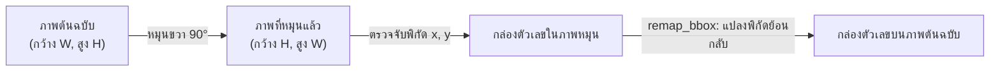

<details>
<summary> ดูเวอร์ชันข้อความ</summary>

1. ภาพต้นฉบับ (ความกว้าง W, ความสูง H)
2. ดำเนินการหมุนภาพขวา 90 องศา ได้ภาพที่หมุนแล้ว (ความกว้าง H, ความสูง W)
3. ตรวจจับพิกัด x, y ของกล่องตัวเลขบนภาพที่หมุนแล้ว
4. ฟังก์ชัน remap_bbox แปลงพิกัดย้อนกลับ ได้ตำแหน่งกล่องตัวเลขที่ถูกต้องบนระนาบภาพต้นฉบับ
</details>

<p align="center"><strong>ภาพที่ 1.1: หลักการแปลงพิกัดย้อนกลับจากภาพหมุนสู่ภาพต้นฉบับ</strong></p>

#### 1.6.5 เทคนิคการกรองเค้าโครงแถวตัวเลขแนวตั้ง
&emsp;&emsp;&emsp;&emsp;ปัญหาที่แก้ไข: บนตัวถังมาตรวัดน้ำมักมีการปั๊มตัวเลขอารบิกสำหรับระบุวันที่ผลิตหรือหมายเลขซีเรียลในแนวตั้ง ซึ่งไม่ใช่ตัวเลขบนหน้าปัดที่ต้องบันทึกค่าน้ำ  
&emsp;&emsp;&emsp;&emsp;วิธีการทำงาน: ฟังก์ชัน `is_vertical` คำนวณช่วงการกระจายตัวในแนวนอน (`width_span`) และแนวตั้ง (`height_span`) ของกลุ่มตัวเลขที่ตรวจพบ หาก `height_span` มีค่าตั้งแต่ 80% ของ `width_span` ขึ้นไป (`height_span >= width_span * 0.8`) หรือกรณีที่ `width_span` แคบมาก (`<=0.05` ขณะที่ `height_span >=0.08`) ระบบจะพิจารณาว่ามีแนวโน้มเป็นแนวตั้งตามเงื่อนไขในโค้ดและตัดทิ้งจากการนำไปคำนวณเป็นค่ามิเตอร์

#### 1.6.6 เทคนิคกลไกความปลอดภัยและการตรวจทานความถูกต้อง
&emsp;&emsp;&emsp;&emsp;ปัญหาที่แก้ไข: ป้องกันความผิดพลาดร้ายแรงก่อนส่งออกผลลัพธ์ เช่น กรณีตัวเลขที่มีความสมมาตรเมื่อกลับหัว หรือกรณีที่แบบจำลองตรวจพบตัวเลขด้วยความเชื่อมั่นต่ำ  
&emsp;&emsp;&emsp;&emsp;วิธีการทำงาน: ระบบประกอบด้วยกลไกความปลอดภัย 4 ขั้นตอน:<br>1.6.6.1 การตรวจสอบภาพกลับหัว 180° (`flip_guard`): ระบบประมวลผลภาพที่มุมตรงข้าม 180° แล้วนำผลการอ่านมาเปรียบเทียบกับตารางความสัมพันธ์ของตัวเลขสมมาตร `FLIP_MAP = {0:0, 1:1, 2:5, 5:2, 6:9, 8:8, 9:6}` หากผลการอ่านไม่สอดคล้องกันและมุมตรงข้ามมีความเชื่อมั่นสูง ระบบจะสร้างข้อความเตือนความเสี่ยงภาพกลับหัวทันที<br>1.6.6.2 การตรวจทานซ้ำด้วย SigLIP2 (`cross_check_digits`): ระบบจะครอปภาพตัวเลขเฉพาะหลักที่มีค่าความเชื่อมั่นจาก YOLO ต่ำกว่าเกณฑ์ `CONF_RELIABLE = 0.60` แล้วส่งให้แบบจำลอง SigLIP2 จำแนกตัวเลขซ้ำเพื่อตรวจสอบยืนยัน<br>1.6.6.3 การตรวจสอบความตรงของแนวแถวตัวเลข (`align_ok`): คำนวณค่าเบี่ยงเบนมาตรฐาน (Standard Deviation) ของพิกัดกึ่งกลางแถวตัวเลข หากค่าเบี่ยงเบนเกินกว่า `ALIGN_MAX_SPREAD = 0.10` ระบบจะแจ้งเตือนว่าตัวเลขไม่เรียงตัวในแนวเดียวกัน<br>1.6.6.4 การตรวจสอบตำแหน่งหลักทศนิยมสีแดง (`red_ratio`): คำนวณสัดส่วนพิกเซลสีแดงในปริภูมิสี HSV เพื่อใช้ตรวจสอบว่าตำแหน่งที่มีสัดส่วนพิกเซลสีแดงสอดคล้องกับตำแหน่งหลักทศนิยมทางขวาของหน้าปัดตามเงื่อนไขที่กำหนด

#### 1.6.7 เทคนิคการตรวจจับทิศทางข้อความและสัญลักษณ์หน่วย m บนหน้าปัดเพื่อจัดวางแนวระนาบ
&emsp;&emsp;&emsp;&emsp;ปัญหาที่แก้ไข (What it solves / Why): ในการถ่ายภาพมิเตอร์น้ำภาคสนาม ผู้ใช้งานมักถ่ายภาพในมุมเอียงหรือตะแคงข้าง 90° หรือ 270° ส่งผลให้แถวตัวเลขบนลูกกลิ้งมิเตอร์ (Odometer) หมุนไปอยู่ในแนวดิ่ง ซึ่งเมื่อแบบจำลองตรวจจับตัวเลขได้ไม่ครบ หรือตัวเลขมีลักษณะสมมาตรแบบกลับหัว (เช่น ตัวเลข 0, 1, 8 หรือคู่สลับ 2 กับ 5 และ 6 กับ 9) ระบบอาจเกิดความสับสนและเลือกมุมระนาบ 0° หรือ 180° ผิดพลาด จนนำไปสู่การอ่านค่าสลับหลัก (เช่น อ่านได้ 53510 แทนที่จะเป็น 01535) อย่างไรก็ตาม สำหรับมาตรวัดที่ใช้ในการศึกษานี้ สัญลักษณ์หน่วยวัดและข้อความบนหน้าปัดมีทิศทางสัมพันธ์กับแถวตัวเลข จึงนำมาใช้เป็นข้อมูลประกอบการประมาณแนวระนาบ  
&emsp;&emsp;&emsp;&emsp;วิธีการทำงาน (How it works / What it does): ฟังก์ชัน `detect_dial_text_orientation` ดำเนินการตัดส่วนขอบหน้าปัดเพื่อเน้นเฉพาะพื้นที่ภายใน จากนั้นแปลงภาพเป็นขาวดำด้วย Adaptive Thresholding และใช้โครงสร้างทางสัณฐานวิทยา (Morphological Structuring Elements) สองทิศทางมุมฉาก คือเคอร์เนลแนวนอน $K_h = (13, 2)$ และเคอร์เนลแนวตั้ง $K_v = (2, 13)$ เพื่อวัดความต่อเนื่องของเส้นลายเส้นตัวอักษร:
$$\text{Score}_h = \sum (I_{\text{dial}} \ominus K_h), \quad \text{Score}_v = \sum (I_{\text{dial}} \ominus K_v)$$
พร้อมทั้งคำนวณอัตราส่วนการกระจายตัวในแนวดิ่ง $V_{\text{ratio}} = \frac{\text{Score}_v}{\text{Score}_h + \text{Score}_v}$ และวิเคราะห์สัดส่วนความกว้างต่อความสูง (Aspect Ratio: AR) ของคอนทัวร์สัญลักษณ์ตัวอักษร $\text{m}$ โดยตัวอักษร $\text{m}$ ปกติในแนวนอนจะมีสัดส่วนกว้างกว่าสูง ($AR \in [1.1, 2.2]$) ในขณะที่หากหมุนตะแคงแนวตั้งจะมีสัดส่วนแคบยาว ($AR \in [0.45, 0.90]$)  
&emsp;&emsp;&emsp;&emsp;เกณฑ์การตัดสินใจและการปรับหมุนอัตโนมัติ (Decision Rules & Auto-Rotation):
1.6.7.1 การวินิจฉัยภาพตะแคงข้าง (Dual Sideways Anchor): หากภาพต้นฉบับ (0°) มีค่า $V_{\text{ratio}} > 0.52$ ร่วมกับ $\text{Score}_v > 250$ บนพื้นที่หน้าปัดกึ่งกลาง หรือตรวจพบแถวตัวเลขจาก YOLO เรียงตัวในแนวดิ่ง ($\Delta y / \Delta x > 1.25$ ใน `is_vertical`) ระบบจะกำหนดให้ภาพถูกถ่ายตะแคงข้างทันที (`is_sideways = True`)<br>1.6.7.2 ในการประเมิน 12 สมมติฐาน (`eval_orientation`) หากมุมใดที่หมุนแล้วข้อความและหน่วย $\text{m}$ วางตัวในแนวนอน (`is_vertical == False`) จะได้รับคะแนนโบนัส $\times 1.10$ แต่หากมุมใดยังคงมีข้อความในแนวตั้ง จะถูกตัดคะแนนทอนกำลังลงเหลือ $\times 0.40$ พร้อมทั้งใช้เกณฑ์สีแดงสด ($S \ge 70, V \ge 70, \text{RED\_THRESH} = 0.12$) ป้องกันคราบสนิม/ฝุ่นสีน้ำตาลไม่ให้เกิด False Positive Red Penalty<br>1.6.7.3 ในระดับการตัดสินใจเลือกระนาบสูงสุด (`detect_digits_best`) หากภาพต้นฉบับเข้าข่ายตะแคงข้าง ระบบจะระงับการเลือกมุม 0° และ 180° และบังคับสลับไปยังมุม 90° หรือ 270° ที่ทำให้ข้อความและตัวเลขกลับมาวางตัวในแนวนอนทันที พร้อมทั้งป้องกัน Flip Guard แจ้งเตือนหลอกเมื่อค่าอ่านมี 0 นำหน้าตามธรรมชาติของมาตรวัดน้ำ (เช่น 01535 เทียบกับ 53510)<br>
&emsp;&emsp;&emsp;&emsp;ประโยชน์ที่ได้รับ (What for / Impact): ช่วยลดปัญหาการอ่านค่าคลาดเคลื่อนจากการถ่ายภาพตะแคงข้าง ทำให้ระบบสามารถหมุนภาพสู่ระนาบสายตามาตรฐานก่อนส่งให้ YOLO อ่านตัวเลข โดยในกรณีตัวอย่าง `failed_case.png` ระบบสามารถหมุนปรับระนาบภาพ 90° และอ่านค่า `01535` ได้ถูกต้อง โดยไม่พบผลกระทบต่อภาพตัวอย่างที่ถ่ายในแนวปกติภายใต้ชุดทดสอบนี้

### 1.7 เทคโนโลยี ชุดเครื่องมือ และไลบรารีที่ใช้ในโครงงาน

> [!NOTE]
> **นโยบายการใช้คำศัพท์ทางวิชาการ (Academic Terminology Policy):**
> เพื่อให้เอกสารคู่มือมีความเป็นเอกภาพทางวิชาการและสอดคล้องกับมาตรฐานวิศวกรรมคอมพิวเตอร์วิทัศน์ เอกสารฉบับนี้กำหนดการใช้คำศัพท์สำคัญตลอดทั้งเล่มดังนี้:
> 1. **แบบจำลอง (Model):** สถาปัตยกรรมโครงข่ายประสาทเทียม เช่น แบบจำลอง YOLO26, แบบจำลอง SigLIP2 (หลีกเลี่ยงการใช้คำทับศัพท์ "โมเดล" ในเนื้อหาทางการ)
> 2. **ตัวตรวจจับ (Detector):** องค์ประกอบที่ทำหน้าที่ค้นหาตำแหน่งพิกัดและระบุวัตถุ เช่น ตัวตรวจจับตัวเลข YOLO26
> 3. **ตัวจำแนก (Classifier):** องค์ประกอบที่ทำหน้าที่ระบุประเภทของข้อมูล เช่น ตัวจำแนกภาพ Zero-shot
> 4. **ตัวคัดกรองภาพนำเข้าเบื้องต้น (Screening Module):** องค์ประกอบที่ทำหน้าที่ตรวจสอบและคัดกรองภาพถ่ายก่อนส่งเข้าสู่กระบวนการหลัก (ใช้แทนคำว่า Gatekeeper)
> 5. **กระบวนการประมวลผล (Pipeline):** ขั้นตอนการไหลของข้อมูลและการประมวลผลแบบปลายทางถึงปลายทาง
> 6. **ระบบ (System):** ซอฟต์แวร์โดยรวมทั้งหมดที่รวม Backend API, ส่วนประมวลผล และส่วนติดต่อผู้ใช้

&emsp;&emsp;&emsp;&emsp;การพัฒนาระบบอ่านค่ามาตรวัดน้ำอัตโนมัติได้ประยุกต์ใช้ชุดเครื่องมือและไลบรารีภาษา Python รวมทั้งสิ้น 10 รายการ โดยแต่ละรายการมีบทบาทและหน้าที่สำคัญตามที่ระบุในตารางที่ 1.1

<p align="center"><strong>ตารางที่ 1.1: เทคโนโลยี ชุดเครื่องมือ และไลบรารีที่ใช้ในโครงงาน</strong></p>

| ไลบรารี / เครื่องมือ | บทบาทและหน้าที่ในระบบ | เหตุผลที่เลือกใช้ในโครงงาน |
|---|---|---|
| **`ultralytics` (YOLO26)** | ตรวจจับตำแหน่ง Bounding Box และจำแนกตัวเลข 0–9 จากภาพถ่ายเต็มเฟรม | ได้รับการออกแบบให้เป็น Single-stage ที่ใช้ Anchor-free Detection Head และรองรับ NMS-free inference ตามเอกสารของ Ultralytics โดยมีวัตถุประสงค์เพื่อเอื้อต่อการตรวจจับวัตถุขนาดเล็กและการอนุมานที่รวดเร็ว (รองรับทั้งเส้นทางอนุมานแบบ NMS-free และแบบดั้งเดิมที่ใช้ NMS) |
| **`transformers` (SigLIP2)** | คัดกรองภาพมาตรวัดน้ำแบบ Zero-shot และตรวจทานตัวเลขความเชื่อมั่นต่ำ | ได้รับการออกแบบให้จำแนกภาพจากข้อความภาษาธรรมชาติได้โดยไม่ต้องฝึก classifier ใหม่ (Zero-shot) ตาม Zhai et al. (2023) และ Tschannen et al. (2025) — ความแม่นยำในงานนี้ยังต้องมีการประเมินแบบควบคุม |
| **`opencv-python` (`cv2`)** | ดำเนินการหมุนภาพ ปรับคอนทราสต์แสง CLAHE/HistEq และตรวจจับย่านสีแดง | เป็นไลบรารีประมวลผลภาพที่ใช้กันแพร่หลาย โดยมีวัตถุประสงค์เพื่อดำเนินการหมุนภาพและปรับคอนทราสต์ด้วยความเร็วที่ยอมรับได้ |
| **`torch` (PyTorch)** | คำนวณโครงข่ายประสาทเทียมทั้ง YOLO และ SigLIP2 รองรับ GPU CUDA | เป็นเฟรมเวิร์กสำหรับการรัน Deep Learning ที่รองรับการประมวลผลทั้งบน GPU และ CPU |
| **`fastapi`** | ให้บริการเว็บเซอร์วิส REST API สำหรับการรับส่งข้อมูลภาพและผลลัพธ์ผ่าน HTTP | ได้รับการออกแบบให้รองรับการทำงานแบบ Asynchronous และสร้างเอกสาร Swagger อัตโนมัติ (FastAPI, 2024) |
| **`gradio`** | สร้างส่วนติดต่อผู้ใช้บนเว็บ (Web UI) สำหรับการสาธิตและทดสอบระบบ | ได้รับการออกแบบมาสำหรับการสาธิตแบบจำลอง Machine Learning ผ่านเว็บ (Gradio, 2024) |
| **`pillow` (`PIL`)** | อ่านไฟล์ภาพดิจิทัล แปลงฟอร์แมต และตรวจสอบความสมบูรณ์ของไบนารีภาพ | รองรับฟอร์แมตไฟล์ภาพที่หลากหลายและมีความปลอดภัยสูงในการเปิดไฟล์ |
| **`numpy`** | จัดการโครงสร้างข้อมูลเมทริกซ์และอาเรย์หลายมิติตลอดกระบวนการประมวลผล | เป็นพื้นฐานในการคำนวณทางคณิตศาสตร์และเชื่อมต่อข้อมูลระหว่าง OpenCV และ PyTorch |
| **`uvicorn`** | เว็บเซิร์ฟเวอร์ ASGI สำหรับรันบริการ FastAPI Backend | รองรับการทำงานแบบ Asynchronous I/O สูง ทำให้สามารถรองรับคำขอใช้งานพร้อมกันได้ดี |
| **`uv`** | เครื่องมือจัดการ Virtual Environment และติดตั้งไลบรารีความเร็วสูง | พัฒนาด้วยภาษา Rust ทำงานเร็วกว่า pip หลายสิบเท่า และจัดการรุ่นไลบรารีได้อย่างแม่นยำ |

<p align="center"><em>ที่มา: รวบรวมจากเอกสารอ้างอิงของชุดเครื่องมือและไลบรารีที่ใช้ในการพัฒนาโครงงาน</em></p>

---

### 1.8 ขั้นตอนและวิธีการทำงานของระบบ

&emsp;&emsp;&emsp;&emsp;ระบบได้รับการออกแบบให้มีกระบวนการทำงานครอบคลุมตั้งแต่ขั้นตอนการรับภาพนำเข้าจนถึงการส่งออกผลลัพธ์ โดยแบ่งการทำงานออกเป็น 7 ขั้นตอนหลัก ดังนี้

&emsp;&emsp;&emsp;&emsp;ขั้นตอนที่ 0: การได้มาซึ่งภาพถ่ายและการรับข้อมูลนำเข้า (Image Acquisition & Input): ผู้ใช้งานใช้กล้องสมาร์ทโฟนหรืออุปกรณ์เคลื่อนที่ถ่ายภาพหน้าปัดมาตรวัดน้ำภาคสนาม จากนั้นส่งไฟล์ภาพเข้าสู่ระบบผ่านหน้าเว็บแอปพลิเคชัน Gradio หรือผ่าน REST API Endpoint (`POST /api/read-meter`)

&emsp;&emsp;&emsp;&emsp;ขั้นตอนที่ 1: การตรวจสอบความถูกต้องและความปลอดภัยของไฟล์ภาพ (File Validation): ระบบตรวจสอบชนิดของไฟล์ภาพตามรายการ `ALLOWED_TYPES` (`image/jpeg`, `image/png`, `image/webp`, `image/bmp`) และใช้ไลบรารี `PIL` ตรวจสอบความสมบูรณ์ของไบนารีภาพ หากไฟล์ชำรุดหรือไม่ถูกต้อง ระบบจะปฏิเสธคำขอด้วยรหัสข้อผิดพลาด HTTP 415 หรือ 422 ทันที

&emsp;&emsp;&emsp;&emsp;ขั้นตอนที่ 2: การคัดกรองประเภทมาตรวัดน้ำด้วย SigLIP2 (Zero-shot Verification): แบบจำลอง SigLIP2 วิเคราะห์ภาพถ่ายนำเข้าเพื่อยืนยันว่าเป็นภาพมาตรวัดน้ำจริง หากไม่ใช่มาตรวัดน้ำ (เช่น เป็นภาพมาตรวัดไฟฟ้า หรือภาพทั่วไป) ระบบจะยุติการประมวลผลและส่งข้อความเตือนให้ผู้ใช้ทราบ เพื่อประหยัดทรัพยากรระบบ

&emsp;&emsp;&emsp;&emsp;ขั้นตอนที่ 3: การประมวลผลค้นหา 12 รูปแบบเชิงครอบคลุม (12-Combination Search with YOLO26): ระบบนำภาพที่ผ่านการอนุมัติไปประมวลผลหมุน 4 ทิศทาง (0°, 90°, 180°, 270°) ร่วมกับการปรับปรุงคอนทราสต์แสง 3 รูปแบบ (Original, CLAHE, HistEq) รวมเป็น 12 รูปแบบ ในแต่ละรูปแบบจะใช้ YOLO26 ตรวจจับตัวเลข กำจัดกรอบซ้ำด้วย IoU และคำนวณคะแนนรวมเพื่อคัดเลือกมุมมองและฟิลเตอร์ที่ให้ผลลัพธ์ดีที่สุด

&emsp;&emsp;&emsp;&emsp;ขั้นตอนที่ 4: การคัดกรองและการแปลงพิกัดกลับสู่ภาพต้นฉบับ (Coordinate Remapping & Filtering): ระบบตรวจสอบว่ากลุ่มตัวเลขมิได้เรียงตัวเป็นแนวตั้ง (`is_vertical`) จากนั้นนำพิกัด Bounding Box ของมุมที่ชนะการประเมินมาแปลงพิกัดทางเรขาคณิตย้อนกลับ (`remap_bbox`) เพื่อให้ตำแหน่งกล่องตรงกับระนาบภาพต้นฉบับเดิม

&emsp;&emsp;&emsp;&emsp;ขั้นตอนที่ 5: การประเมินความปลอดภัยและการตรวจทานความถูกต้อง (Safety Guard Verification): ระบบตรวจสอบความเสี่ยงภาพกลับหัว 180° ด้วยฟังก์ชัน `flip_guard` ตรวจสอบความตรงของแนวแถวตัวเลข (`align_ok`) และนำภาพตัวเลขเฉพาะหลักที่มีความเชื่อมั่นต่ำส่งให้ SigLIP2 ตรวจทานซ้ำ (`cross_check_digits`)

&emsp;&emsp;&emsp;&emsp;ขั้นตอนที่ 6: การประมวลผลสรุปผลลัพธ์และการส่งออกข้อมูล (Output Dispatch & Warning Generation): ระบบรวบรวมตัวเลขที่อ่านได้เรียงจากซ้ายไปขวา คำนวณค่าความเชื่อมั่นเฉลี่ย วาดกรอบสี่เหลี่ยมระบุตำแหน่งตัวเลขลงบนภาพ (กรอบเขียวสำหรับหลักที่มีค่าความเชื่อมั่นสูง และกรอบส้มสำหรับหลักที่ควรตรวจทาน) พร้อมทั้งสร้างรายการข้อความแจ้งเตือนความเสี่ยง (`warnings`) ส่งกลับไปยังผู้ใช้งาน

&emsp;&emsp;&emsp;&emsp;ดังภาพที่ 1.2 แสดงแผนภาพภาพรวมการไหลของข้อมูลและการทำงานของระบบตั้งแต่ต้นน้ำจนถึงปลายน้ำ โดยเพื่อความชัดเจนในการแสดงผลบนหน้ากระดาษขนาดมาตรฐาน A4 และสไลด์นำเสนอ ระบบจึงจำแนกแผนภาพออกเป็นแผนภาพภาพรวมท่อประมวลผล (High-level Overview) และแผนภาพกระบวนการทำงานย่อยในแต่ละระยะ (ก)–(ง) ดังนี้

&emsp;&emsp;&emsp;&emsp;1. แผนภาพภาพรวมท่อประมวลผลของระบบ (High-level Pipeline Overview):

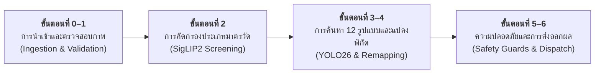

<details>
<summary> ดูเวอร์ชันข้อความ</summary>

1. ขั้นตอนที่ 0–1: การนำเข้าและตรวจสอบภาพ (ผู้ใช้ถ่ายภาพและอัปโหลดเข้าสู่ระบบ พร้อมตรวจสอบชนิดไฟล์และไบนารีภาพ)
2. ขั้นตอนที่ 2: การคัดกรองประเภทมาตรวัด (แบบจำลอง SigLIP2 ตรวจสอบความถูกต้องแบบ Zero-shot 4 คลาส)
3. ขั้นตอนที่ 3–4: การค้นหา 12 รูปแบบและแปลงพิกัด (ค้นหาทิศทางและฟิลเตอร์แสง ตรวจจับตัวเลขด้วย YOLO26 กรองแถวตั้ง และแปลงพิกัดกลับ)
4. ขั้นตอนที่ 5–6: ความปลอดภัยและการส่งออกผลลัพธ์ (ตรวจสอบความปลอดภัย 4 ระดับ สรุปผลการอ่าน วาดกรอบพิกัด และส่งออกข้อมูล)
</details>

<p align="center"><strong>ภาพที่ 1.2: แผนภาพภาพรวมการทำงานของระบบ (High-level Pipeline Overview)</strong></p>

&emsp;&emsp;&emsp;&emsp;2. แผนภาพกระบวนการทำงานย่อยในแต่ละระยะ (Detailed Sub-pipeline Workflows):

&emsp;&emsp;&emsp;&emsp;*(ก) ระยะการนำเข้าและตรวจสอบความถูกต้องของไฟล์ภาพ (ขั้นตอนที่ 0–1):*

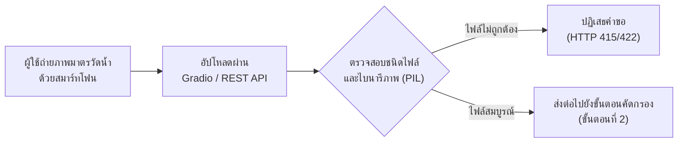

<details>
<summary> ดูเวอร์ชันข้อความ</summary>

1. ผู้ใช้ถ่ายภาพมาตรวัดน้ำด้วยสมาร์ทโฟน
2. อัปโหลดภาพผ่านส่วนต่อประสาน Gradio หรือ REST API
3. ตรวจสอบชนิดไฟล์และไบนารีภาพด้วยไลบรารี PIL
   3.1 กรณีไฟล์ไม่ถูกต้อง: ระบบปฏิเสธคำขอด้วยรหัสข้อผิดพลาด HTTP 415 หรือ 422<br>
   3.2 กรณีไฟล์สมบูรณ์: ส่งภาพต่อไปยังขั้นตอนคัดกรองประเภทมาตรวัดน้ำ (ขั้นตอนที่ 2)
</details>

<p align="center"><strong>ภาพที่ 1.2 (ก): แผนภาพขั้นตอนที่ 0–1 การนำเข้าและตรวจสอบความสมบูรณ์ของภาพ (Ingestion & Validation)</strong></p>

&emsp;&emsp;&emsp;&emsp;*(ข) ระยะการคัดกรองประเภทมาตรวัดน้ำด้วย SigLIP2 แบบ Zero-shot (ขั้นตอนที่ 2):*

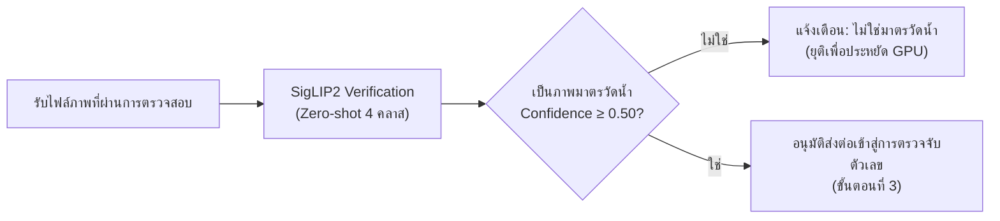

<details>
<summary> ดูเวอร์ชันข้อความ</summary>

1. รับไฟล์ภาพที่ผ่านการตรวจสอบความสมบูรณ์
2. แบบจำลอง SigLIP2 ดำเนินการจำแนกภาพแบบ Zero-shot เทียบกับข้อความ 4 คลาส
3. ตรวจสอบว่าภาพดังกล่าวได้รับการจำแนกเป็นมาตรวัดน้ำด้วยค่าความเชื่อมั่นไม่น้อยกว่า 0.50 หรือไม่
   3.1 กรณีไม่ใช่มาตรวัดน้ำ: แจ้งเตือนผู้ใช้และยุติกระบวนการเพื่อประหยัดทรัพยากร GPU<br>
   3.2 กรณีเป็นมาตรวัดน้ำ: อนุมัติส่งต่อภาพเข้าสู่การตรวจจับตัวเลข (ขั้นตอนที่ 3)
</details>

<p align="center"><strong>ภาพที่ 1.2 (ข): แผนภาพขั้นตอนที่ 2 การคัดกรองประเภทมาตรวัดด้วย SigLIP2 (Screening)</strong></p>

&emsp;&emsp;&emsp;&emsp;*(ค) ระยะการประมวลผลค้นหา 12 รูปแบบและการแปลงพิกัดเรขาคณิต (ขั้นตอนที่ 3–4):*

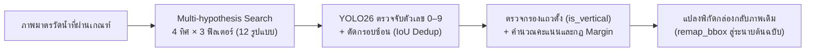

<details>
<summary> ดูเวอร์ชันข้อความ</summary>

1. รับภาพมาตรวัดน้ำที่ผ่านเกณฑ์การคัดกรอง
2. ดำเนินการค้นหาเชิงครอบคลุม 12 รูปแบบ (หมุน 4 ทิศทางร่วมกับการปรับปรุงคอนทราสต์แสง 3 รูปแบบ)
3. ใช้แบบจำลอง YOLO26 ตรวจจับตัวเลข 0 ถึง 9 และกำจัดกรอบซ้อนทับด้วย IoU Deduplication
4. ตรวจสอบเค้าโครงแถวตัวเลขว่าไม่ใช่แนวตั้ง (is_vertical) และคำนวณคะแนนตามกฎ Margin Rule
5. แปลงพิกัดกล่องขอบเขตของรูปแบบที่ชนะการประเมินกลับสู่ระนาบภาพต้นฉบับเดิมด้วย remap_bbox
</details>

<p align="center"><strong>ภาพที่ 1.2 (ค): แผนภาพขั้นตอนที่ 3–4 การค้นหา 12 รูปแบบและแปลงพิกัด (Processing & Remapping)</strong></p>

&emsp;&emsp;&emsp;&emsp;*(ง) ระยะกลไกความปลอดภัยและการส่งออกผลลัพธ์ (ขั้นตอนที่ 5–6):*

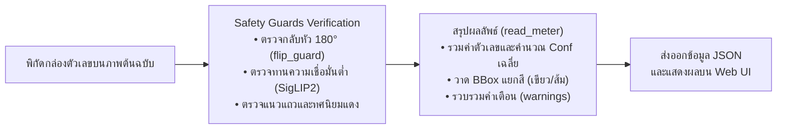

<details>
<summary> ดูเวอร์ชันข้อความ</summary>

1. รับพิกัดกล่องตัวเลขบนระนาบภาพต้นฉบับ
2. ดำเนินการตรวจสอบผ่านกลไกความปลอดภัย (Safety Guards) ตรวจจับภาพกลับหัว 180 องศา (flip_guard) ตรวจทานหลักที่มีความเชื่อมั่นต่ำด้วย SigLIP2 และตรวจสอบแนวระนาบแถวตัวเลข
3. สรุปผลลัพธ์ผ่านฟังก์ชัน read_meter รวมค่าตัวเลข คำนวณค่าความเชื่อมั่นเฉลี่ย วาดกรอบสี่เหลี่ยมระบุตำแหน่ง และรวบรวมข้อความแจ้งเตือน
4. ส่งออกข้อมูลในรูปแบบ JSON และแสดงผลลัพธ์บนส่วนติดต่อผู้ใช้เว็บ
</details>

<p align="center"><strong>ภาพที่ 1.2 (ง): แผนภาพขั้นตอนที่ 5–6 กลไกความปลอดภัยและการส่งออกผลลัพธ์ (Safety & Output Dispatch)</strong></p>

---

### 1.9 การฝึกแบบจำลองสำหรับการตรวจจับตัวเลข

> [!NOTE]
> **ข้อแนะนำ — มีแบบจำลองพร้อมใช้งานแล้ว:** 
> โครงงานนี้มีไฟล์น้ำหนักแบบจำลอง `weights/MeterOCR.pt` ที่ผ่านการฝึกฝนเสร็จสมบูรณ์แล้ว ผู้ศึกษาสามารถข้ามไปศึกษาหัวข้อ 1.10 เพื่อเริ่มต้นใช้งานได้ทันที โดยเนื้อหาในส่วนนี้มีไว้สำหรับผู้ที่ต้องการศึกษาขั้นตอนการเตรียมชุดข้อมูลและการฝึกฝนแบบจำลองด้วยตนเอง

&emsp;&emsp;&emsp;&emsp;หลักการฝึกฝนแบบจำลองบนระบบคลาวด์: การฝึกฝนแบบจำลองการเรียนรู้เชิงลึก (Deep Learning) จำเป็นต้องใช้ทรัพยากรหน่วยประมวลผลกราฟิก (GPU) ประสิทธิภาพสูง จึงแนะนำให้ดำเนินการผ่านแพลตฟอร์มคลาวด์ เช่น Google Colab หรือ Kaggle

#### 1.9.1 การเตรียมชุดข้อมูลจาก Roboflow และการแบ่งชุดข้อมูล

&emsp;&emsp;&emsp;&emsp;ระบบใช้ชุดข้อมูลสาธารณะ "Utility Meter Reading" จากแพลตฟอร์ม Roboflow ซึ่งประกอบด้วยภาพหน้าปัดมาตรวัดน้ำในสภาพแวดล้อมจริงที่มีการทำเครื่องหมายระบุพิกัดกล่องขอบเขต (Bounding Box) และคลาสของตัวเลขโดด 0–9 ไว้อย่างครบถ้วน

<p align="center"><strong>ตารางที่ 1.2: สัดส่วนการแบ่งชุดข้อมูลสำหรับการฝึกฝนและทดสอบตัวตรวจจับวัตถุ (Dataset Splits)</strong></p>

| ชุดข้อมูลย่อย (Split) | จำนวนภาพ (Images) | สัดส่วน (%) | จำนวนกล่องตัวเลขโดยประมาณ | วัตถุประสงค์การใช้งาน |
|---|---|---|---|---|
| **ชุดฝึกฝน (Training Set)** | 4,665 | 92.3% | ~37,300 | ใช้สำหรับปรับปรุงค่าน้ำหนักของแบบจำลองผ่าน Backpropagation |
| **ชุดปรับเทียบ (Validation Set)** | 194 | 3.8% | ~1,550 | ใช้ประเมินระหว่างการฝึกฝนเพื่อการปรับลด Learning Rate และ Early Stopping (`patience=30`) |
| **ชุดทดสอบแบบจำลอง (Detector Test Set)** | 194 | 3.8% | 1,508 | ประเมินสมรรถนะตัวตรวจจับวัตถุอิสระ (โดยมี 120 ภาพที่มี Ground Truth ลำดับตัวเลขสำหรับ End-to-End Subset) |
| **รวมทั้งสิ้น (Total)** | **5,053** | **100.0%** | **~40,400** | ครอบคลุมคลาสตัวเลข 0–9 และคลาสเสริม Reading Digit |

<p align="center"><em>ที่มา: รวบรวมจากชุดข้อมูล Utility Meter Reading บนแพลตฟอร์ม Roboflow Universe</em></p>

> [!NOTE]
> **โครงสร้างการจำแนกชุดประเมินผลและการจัดการคลาสตัวเลข (Evaluation Sets & Class Taxonomy):**
> 1. **Detector Test Set (194 ภาพ / 1,508 ตัวอย่าง):** คือชุดทดสอบทั้ง 194 ภาพที่กันออกจากการฝึก ใช้สำหรับประเมินสมรรถนะของตัวตรวจจับวัตถุ YOLO26m โดยตรง (mAP@50, mAP@50:95, Precision, Recall) ดังแสดงในตารางที่ 1.3 และตารางที่ 4.6
> 2. **End-to-End Reading Evaluation Subset (120 ภาพ / 941 หลัก):** คือชุดภาพย่อยจำนวน 120 ภาพที่คัดเลือกมาจาก Detector Test Set (194 ภาพ) เฉพาะภาพที่มีป้ายเฉลยลำดับตัวเลขครบถ้วนสมบูรณ์ (Reading Sequence Ground Truth) สำหรับประเมินความถูกต้องของการอ่านค่าทั้งระบบแบบปลายทางถึงปลายทาง (Exact Reading Accuracy, Digit Error Rate) ในตารางที่ 4.2 ขณะที่ภาพอีก 74 ภาพในชุดทดสอบมีเพียงการกำกับพิกัด Bounding Box ของตัวเลขเฉพาะจุดสำหรับงานตรวจจับวัตถุ แต่ไม่มี Ground Truth ลำดับตัวเลขครบทั้งหน้าปัด จึงไม่ได้นำมาวัดผลการอ่านค่าทั้งระบบ
> 3. **Field Demonstration Set (7 ภาพ / 36 หลัก):** คือชุดภาพสาธิตภาคสนามที่บันทึกจากสถานที่จริง ใช้สำหรับทดสอบการทำงานเบื้องต้น (Sanity Check) และการศึกษาเชิงตัดทอนแบบก้าวหน้า 9 ขั้นตอน (Progressive Ablation Study M0–M8) ในตารางที่ 4.4 และ 4.5
> 4. **คลาส Reading Digit ในชุดข้อมูล Roboflow:** ชุดข้อมูลต้นฉบับมีการกำหนดป้ายกำกับช่วยเสริม (Auxiliary Label) ชื่อ "Reading Digit" (มี 36 ตัวอย่างใน Detector Test Set) สำหรับระบุตัวเลขที่กำลังหมุนเปลี่ยนผ่านกึ่งหลัก (Half-turned Wheel Roll) ทว่าในการอนุมานจริง ระบบจะคัดกรองนำเฉพาะ **Operational Digit Classes (0–9, 1,472 ตัวอย่าง)** มาเรียงลำดับเป็นค่าผลลัพธ์ของมาตรวัดน้ำ ซึ่งกลุ่ม Operational Classes นี้ได้ค่า mAP@50 สูงถึง **91.18%** ขณะที่ **All Annotated Classes (0–9 + Auxiliary Reading Digit, 1,508 ตัวอย่าง)** ได้ mAP@50 87.86%

> [!IMPORTANT]
> **หลักการแบ่งข้อมูลโดยไม่ให้เกิดการรั่วไหล (Data Leakage Prevention):**
> การแบ่งชุดข้อมูลในงานอ่านมาตรวัดน้ำต้องระมัดระวังเป็นพิเศษเรื่องการรั่วไหลของข้อมูล (Data Leakage) หากภาพถ่ายจากมิเตอร์ตัวเรือนเดียวกัน (Physical Meter ID) ถูกกระจายไปอยู่ในทั้งชุดฝึกและชุดทดสอบ แบบจำลองอาจจดจำรอยขีดข่วน คราบสนิม หรือสติกเกอร์เฉพาะตัวเรือนได้ ดังนั้นจึงต้องใช้เกณฑ์ **Meter-level Grouped Split** เพื่อให้มั่นใจว่าตัวเรือนมิเตอร์ในชุดทดสอบไม่เคยปรากฏในชุดฝึกฝนมาก่อน

##### ขั้นตอนการลงทะเบียน Roboflow และการรับ API Key

&emsp;&emsp;&emsp;&emsp;1. เปิด [Roboflow](https://app.roboflow.com) แล้วกด Sign up สมัครด้วยบัญชี Google, GitHub หรืออีเมล (บัญชีฟรี ไม่ต้องใช้บัตรเครดิต)
&emsp;&emsp;&emsp;&emsp;2. หลังเข้าสู่ระบบ คลิกที่รูปโปรไฟล์ (มุมขวาบน) แล้วเลือก Settings หรือเข้าโดยตรงที่ [app.roboflow.com/settings/api](https://app.roboflow.com/settings/api)
&emsp;&emsp;&emsp;&emsp;3. ในหน้า Settings เลื่อนไปที่หัวข้อ API Key กดปุ่ม Copy เพื่อคัดลอก Key (เป็นตัวอักษรและตัวเลขปนกัน ประมาณ 30–40 หลัก)
&emsp;&emsp;&emsp;&emsp;4. นำ Key ไปวางแทน `YOUR_API_KEY` ในโค้ดด้านล่าง

> **คำเตือนความปลอดภัย:** API Key เป็นความลับส่วนบุคคล ห้ามเผยแพร่หรือบันทึกขึ้นระบบจัดการเวอร์ชัน (Git) สาธารณะ สำหรับ Google Colab แนะนำให้จัดเก็บ Key ไว้ใน **Secrets** (ปุ่มรูปกุญแจที่แถบด้านซ้ายของหน้าต่าง Colab) แล้วเรียกใช้ด้วยคำสั่ง `from google.colab import userdata` และ `rf = Roboflow(api_key=userdata.get('ROBOFLOW_API_KEY'))`

&emsp;&emsp;&emsp;&emsp;การปฏิบัติการบน Google Colab: การฝึกแบบจำลองการเรียนรู้เชิงลึก (Deep Learning) ต้องการการประมวลผลเมทริกซ์ประสิทธิภาพสูง จึงกำหนดให้ปฏิบัติตามหัวข้อ 1.9.1–1.10.2 บน Google Colab โดยเปิด [colab.research.google.com](https://colab.research.google.com) สร้างสมุดบันทึกใหม่ชื่อ `train_model_colab.ipynb` และเลือกฮาร์ดแวร์เร่งความเร็วเป็น T4 GPU ดังแสดงในซอร์สโค้ดที่ 1.1:

```python
from roboflow import Roboflow

rf = Roboflow(api_key="YOUR_API_KEY")
project = rf.workspace("watermeter-jvlgr").project("utility-meter-reading-dataset-for-automatic-reading-yolo")
version = project.version(1)
dataset = version.download("yolo26")
```
<p align="center"><strong>ซอร์สโค้ดที่ 1.1: <code>train_model_colab.ipynb</code> (1/3) — การดาวน์โหลดชุดข้อมูลจาก Roboflow</strong></p>

#### 1.9.2 การฝึกแบบจำลอง YOLO บน Google Colab

&emsp;&emsp;&emsp;&emsp;ระบบเลือกใช้สถาปัตยกรรม Ultralytics YOLO26 Medium (`yolo26m.pt`) (Ultralytics, 2026) ซึ่งมีขนาด 132 layers, 20,364,070 parameters (~20.36M) และ 68.1 GFLOPs โดยให้ความแม่นยำในการสกัดคุณลักษณะ (Feature Extraction) ของตัวเลขขนาดเล็กบนหน้าปัดมาตรวัดน้ำได้เหนือกว่ารุ่น Nano การฝึกฝนกระทำบน Google Colab โดยเชื่อมต่อ GPU NVIDIA Tesla T4 (VRAM 16 GB) ผ่านสคริปต์ Python ดังแสดงในซอร์สโค้ดที่ 1.2:

```python
from ultralytics import YOLO

model = YOLO("yolo26m.pt")
results = model.train(
    data=f"{dataset.location}/data.yaml",
    epochs=100,        # จำนวนรอบการฝึกฝนสูงสุด
    patience=30,       # กลไกหยุดก่อนกำหนดหากค่า mAP บนชุด Validation ไม่ดีขึ้นติดต่อกัน 30 รอบ
    imgsz=640,         # ขนาดความละเอียดภาพนำเข้าในขั้นตอนฝึกฝน
    batch=16,          # ขนาดแบทช์ต่อรอบ (สอดคล้องกับ VRAM ของ Tesla T4 16GB เมื่อใช้แบบจำลอง Medium)
    amp=True,          # เปิดใช้งาน Automatic Mixed Precision (FP16) ลดภาระ VRAM และเพิ่มความเร็ว
    optimizer="AdamW", # ขั้นตอนวิธีปรับค่าน้ำหนักแบบ Adam พร้อม Weight Decay
    lr0=0.001,         # อัตราการเรียนรู้เริ่มต้น (Initial Learning Rate)
    mosaic=1.0,        # การผสานภาพสุ่ม 4 ภาพ ช่วยให้แบบจำลองรองรับสเกลตัวเลขที่ต่างกัน
    mixup=0.15,        # การซ้อนทับภาพแบบโปร่งใส ช่วยลดปัญหา Overfitting
    degrees=15.0,      # การหมุนภาพแบบสุ่ม ±15 องศาเพื่อชดเชยมุมถ่ายเอียง
    hsv_v=0.4,         # การแปรผันค่าความสว่างจำลองสภาพแสงจ้าและแสงสลัว
)
```
<p align="center"><strong>ซอร์สโค้ดที่ 1.2: <code>train_model_colab.ipynb</code> (2/3) — การกำหนดพารามิเตอร์และเริ่มกระบวนการฝึกฝนแบบจำลอง</strong></p>

#### 1.9.3 การประเมินประสิทธิภาพตัวตรวจจับวัตถุ

&emsp;&emsp;&emsp;&emsp;เพื่อตอบคำถามการวิจัยข้อที่หนึ่ง (RQ1) แบบจำลอง YOLO26 Medium (`yolo26m`) ที่ผ่านการฝึกฝนจะได้รับการทดสอบบนชุดข้อมูลทดสอบอิสระ (Held-out Test Split, $N=194$ ภาพ) โดยวัดประสิทธิภาพการตรวจจับตัวเลขโดด 0–9 ผ่านตัวชี้วัดสากลด้าน Object Detection ดังแสดงในซอร์สโค้ดที่ 1.3:

```python
metrics = model.val(data=f"{dataset.location}/data.yaml", split="test")
print(f"Precision: {metrics.box.mp:.4f}")
print(f"Recall:    {metrics.box.mr:.4f}")
print(f"mAP@50:    {metrics.box.map50:.4f}")
print(f"mAP@50-95: {metrics.box.map:.4f}")
```
<p align="center"><strong>ซอร์สโค้ดที่ 1.3: <code>train_model_colab.ipynb</code> (3/3) — การประเมินผลแบบจำลองบนชุดข้อมูลทดสอบอิสระ (Test Split)</strong></p>

<p align="center"><strong>ตารางที่ 1.3: ผลการประเมินประสิทธิภาพตัวตรวจจับวัตถุ YOLO26m บนชุดทดสอบอิสระ (Detector Test Set, n=194)</strong></p>

| ตัวชี้วัดประสิทธิภาพ (Metric) | ค่าที่วัดได้จริง (Score) | คำนิยามและวิธีคำนวณทางสถิติ | ความหมายต่อการใช้งานจริง |
|---|---|---|---|
| **Precision (P)** | **0.935 (93.5%)** | $\frac{TP}{TP + FP}$ (สัดส่วนของกล่องที่ทำนายว่าเป็นตัวเลขแล้วเป็นตัวเลขจริง) | ลดปัญหาการตรวจจับสัญญาณรบกวน คราบน้ำ หรือโลโก้บนหน้าปัดเป็นตัวเลขปลอม |
| **Recall (R)** | **0.893 (89.3%)** | $\frac{TP}{TP + FN}$ (สัดส่วนของตัวเลขจริงทั้งหมดที่แบบจำลองสามารถตรวจจับได้) | ป้องกันตัวเลขบนหน้าปัดสูญหายหรือตกหล่นไปในระหว่างตรวจจับ |
| **F1-Score** | **0.914 (91.4%)** | $2 \times \frac{P \times R}{P + R}$ (ค่าเฉลี่ยฮาร์มอนิกของ Precision และ Recall) | แสดงความสมดุลระหว่างการตรวจจับครบถ้วนกับการไม่ตรวจจับสิ่งแปลกปลอม |
| **mAP@50** | **0.879 (87.9%)** | Mean Average Precision ที่เกณฑ์ $IoU \ge 0.50$ | ความแม่นยำเฉลี่ยเมื่อยอมรับพิกัดกล่องที่มีพื้นที่ทับซ้อนกับเฉลยตั้งแต่ 50% ขึ้นไป |
| **mAP@50:95** | **0.477 (47.7%)** | ค่าเฉลี่ย mAP ที่ระดับเกณฑ์ $IoU$ ตั้งแต่ 0.50 ถึง 0.95 (ขั้นละ 0.05) | แสดงความแม่นยำระดับพิกัดกรอบสี่เหลี่ยมขอบเขตตัวเลขอย่างเข้มงวด |

<p align="center"><em>ที่มา: ผลการประเมินประสิทธิภาพตัวตรวจจับวัตถุบนชุดข้อมูลทดสอบอิสระในโครงงานนี้</em></p>

> [!NOTE]
> **ความแตกต่างระหว่าง Detection mAP และ End-to-End Reading Accuracy รวมทั้งการจำแนกกลุ่มคลาส:**
> 1. ตัวชี้วัดในตารางที่ 1.3 เป็นภาพรวมของ **All Annotated Classes (0–9 + Auxiliary Reading Digit, 1,508 ตัวอย่าง)** ซึ่งได้ mAP@50 เท่ากับ 87.86% (Precision 93.53%, Recall 89.30%) ขณะที่หากพิจารณาเฉพาะ **Operational Digit Classes (0–9, 1,472 ตัวอย่าง)** ที่ท่อประมวลผลระบบอ่านค่านำมาใช้งานจริง จะมีค่า mAP@50 สูงถึง **91.18%** (Precision 93.36%, Recall 92.67% ดังรายงานแยกรายคลาสในตารางที่ 4.6)
> 2. ตัวชี้วัดในตารางที่ 1.3 เป็นการวัดประสิทธิภาพในระดับ "กล่องตัวเลขโดดเดี่ยว" (Object Detection Level) บนชุดภาพทดสอบของ Roboflow ซึ่งยังไม่ได้รับประกันว่าระบบจะสามารถอ่านค่ามิเตอร์ทั้ง 5–8 หลักได้อย่างถูกต้องครบถ้วนต่อเนื่องกันทุกหลัก เนื่องจากการอ่านค่ามิเตอร์จริงต้องผ่านกระบวนการเรียงลำดับซ้าย-ขวา การตัดกล่องซ้อนทับ และการแปลงพิกัดมุมหมุน ซึ่งผลการประเมินความแม่นยำปลายทางถึงปลายทาง (End-to-End Exact Reading Accuracy) บน End-to-End Subset ($n=120$) และ Field Demonstration Set ($n=7$) จะถูกวิเคราะห์อย่างละเอียดในบทที่ 3 (ตารางที่ 3.2) และบทที่ 4 (ตารางที่ 4.2)

&emsp;&emsp;&emsp;&emsp;การนำไฟล์น้ำหนักไปใช้งาน: เมื่อกระบวนการฝึกฝนเสร็จสมบูรณ์ ระบบจะบันทึกไฟล์น้ำหนักที่ดีที่สุดไว้ที่ `runs/detect/train/weights/best.pt` ให้นำไฟล์ดังกล่าวมาเปลี่ยนชื่อและบันทึกไว้ที่ `weights/MeterOCR.pt` ในโฟลเดอร์ของโปรเจกต์ เพื่อให้ท่อประมวลผลหลัก (Main Pipeline) สามารถเรียกใช้งานได้ทันที

---

### 1.10 สภาพแวดล้อมและการจัดการโครงงานด้วย `uv`

> **หลักการและเหตุผล:** เพื่อเตรียมโฟลเดอร์และติดตั้งไลบรารีให้พร้อม ก่อนเริ่มทดลองระบบจริง

#### 1.10.1 โครงสร้างไฟล์ของระบบ

&emsp;&emsp;&emsp;&emsp;โครงสร้างไดเรกทอรีและไฟล์หลักที่จำเป็นสำหรับการเรียนรู้และพัฒนาระบบอ่านค่ามาตรวัดน้ำ มีการจัดวางความสัมพันธ์ตามหน้าที่อย่างเป็นระเบียบ ดังแสดงในโครงสร้างไฟล์ที่ 1.1:

```text
meter-reader/
├── main.py            # โค้ดหลัก: API (FastAPI) และฟังก์ชันประมวลผลทั้งหมด
├── gradio_app.py      # หน้าเว็บ UI (Gradio) สำหรับทดสอบระบบ
├── requirements.txt   # รายการ Library dependencies
├── weights/
│   └── MeterOCR.pt    # ไฟล์น้ำหนักแบบจำลอง YOLO สำหรับตรวจจับตัวเลข (พร้อมใช้งาน)
└── training/
    └── yolo_train.py  # สคริปต์ฝึกฝนแบบจำลอง YOLO26 (ตามหัวข้อ 1.9.2)
```
<p align="center"><strong>โครงสร้างไฟล์ที่ 1.1: แผนผังการจัดระเบียบไฟล์และไดเรกทอรีของระบบ <code>meter-reader</code></strong></p>

&emsp;&emsp;&emsp;&emsp;โครงสร้างข้างต้นเป็นแบบเรียบง่ายสำหรับการเรียนรู้ สำหรับโครงสร้างไฟล์แบบเต็มของโครงงานปัจจุบัน โปรดดู ภาคผนวก ค. โครงสร้างระบบไฟล์ของโครงงานปัจจุบัน

#### 1.10.2 การสร้างสภาพแวดล้อมและการติดตั้งไลบรารี

&emsp;&emsp;&emsp;&emsp;เปิดหน้าต่างคำสั่ง (Terminal) ที่ตำแหน่งโฟลเดอร์หลัก `meter-reader/` แล้วดำเนินการสร้างสภาพแวดล้อมเสมือนและติดตั้งชุดคำสั่งตามลำดับ ดังแสดงในชุดคำสั่งที่ 1.1:

```powershell
# 1. สร้าง Virtual Environment ด้วย Python 3.11
uv venv --python 3.11

# 2. เปิดใช้งาน Virtual Environment
# Windows PowerShell:
.venv\Scripts\Activate.ps1
# macOS / Linux:
# source .venv/bin/activate

# 3. ติดตั้ง Library ทั้งหมดผ่าน uv
uv pip install -r requirements.txt
```
<p align="center"><strong>ชุดคำสั่งที่ 1.1: การสร้างสภาพแวดล้อมเสมือนและการติดตั้งไลบรารีด้วยเครื่องมือ <code>uv</code></strong></p>

&emsp;&emsp;&emsp;&emsp;ผลลัพธ์ที่คาดหวัง: เห็นข้อความ `Installed ... packages` และไม่มี error

&emsp;&emsp;&emsp;&emsp;รายการไลบรารีและแพ็กเกจภายนอกทั้งหมดที่ต้องติดตั้งผ่านไฟล์ `requirements.txt` เพื่อรองรับการทำงานของระบบ แสดงดังซอร์สโค้ดที่ 1.4:

```text
fastapi>=0.115
uvicorn[standard]>=0.30
python-multipart>=0.0.9
ultralytics>=8.4.0
transformers>=4.52.0
torch>=2.3
gradio>=5.0
httpx>=0.27
pillow>=10.0
opencv-python>=4.9
numpy>=1.26
PyYAML>=6.0
```
<p align="center"><strong>ซอร์สโค้ดที่ 1.4: <code>requirements.txt</code> — รายการแพ็กเกจและไลบรารีที่จำเป็นสำหรับระบบ</strong></p>

---

### 1.11 การวิเคราะห์รหัสต้นฉบับการประมวลผลคอมพิวเตอร์วิทัศน์

&emsp;&emsp;&emsp;&emsp;กระบวนการประมวลผลของระบบ Water Meter OCR ใน `main.py` ได้รับการออกแบบให้แยกเป็นฟังก์ชันย่อยตามหน้าที่อย่างชัดเจน เพื่อให้ง่ายต่อการศึกษาและบำรุงรักษา โดยมีรายละเอียดรหัสต้นฉบับในแต่ละส่วนดังนี้:


&emsp;&emsp;&emsp;&emsp;กระบวนการอ่านตัวเลขมี 4 ขั้นตอน — แต่ละขั้นตอนแก้ปัญหาคนละแบบ ต่อกันเป็นท่อส่งข้อมูล:

#### 1.11.1 การหมุนภาพและการปรับปรุงคุณภาพภาพ (rotate_image, apply_prep)
&emsp;&emsp;&emsp;&emsp;1.11.1.1 ปัญหา: ภาพถ่ายมีความเอียง ตัวเลขมีความคมชัดต่ำ หรืออยู่ในบริเวณที่มีแสงสว่างไม่เพียงพอ ส่งผลให้ประสิทธิภาพในการตรวจจับตัวเลขของแบบจำลองลดลง<br>
&emsp;&emsp;&emsp;&emsp;1.11.1.2 แนวคิด: ดำเนินการทดสอบหมุนภาพ 4 ทิศทาง (0°, 90°, 180°, 270°) ร่วมกับการปรับปรุงคุณภาพแสง 3 รูปแบบ (ภาพต้นฉบับ, CLAHE, HistEq) รวมเป็น 12 รูปแบบการทดสอบ แล้วจึงให้แบบจำลองปัญญาประดิษฐ์ประเมินและคัดเลือกผลลัพธ์ที่มีความชัดเจนและน่าเชื่อถือสูงสุด<br>
&emsp;&emsp;&emsp;&emsp;1.11.1.3 การทำงาน: ฟังก์ชัน `rotate_image` ดำเนินการหมุนภาพด้วย OpenCV และฟังก์ชัน `apply_prep` ดำเนินการปรับคอนทราสต์ของภาพตามฟิลเตอร์ที่กำหนด

&emsp;&emsp;&emsp;&emsp;รายละเอียดทางเทคนิคของกระบวนการ: ระบบประมวลผลภาพด้วยการทดสอบ 4 ทิศทางการหมุนร่วมกับการปรับปรุงคอนทราสต์ 3 รูปแบบ เพื่อให้แบบจำลองสามารถตรวจจับตัวเลขได้อย่างมีประสิทธิภาพสูงสุด ในการประมวลผล ฟังก์ชัน `rotate_image` ทำหน้าที่หมุนภาพตามมุมองศาที่กำหนดด้วยคำสั่ง `cv2.rotate` และฟังก์ชัน `apply_prep` ทำหน้าที่ปรับปรุงคุณภาพแสงบนช่องความสว่าง L (เทคนิค CLAHE ในปริภูมิสี LAB) หรือช่องความสว่าง Y (เทคนิค Histogram Equalization ในปริภูมิสี YCrCb) ตามฟิลเตอร์ที่กำหนด ดังแสดงในซอร์สโค้ดที่ 1.5:

```python
def rotate_image(img_bgr: np.ndarray, angle: int) -> np.ndarray:
    """หมุนภาพ 90°, 180°, 270° ตามเข็มนาฬิกา"""
    if angle == 90:
        return cv2.rotate(img_bgr, cv2.ROTATE_90_CLOCKWISE)
    if angle == 180:
        return cv2.rotate(img_bgr, cv2.ROTATE_180)
    if angle == 270:
        return cv2.rotate(img_bgr, cv2.ROTATE_90_COUNTERCLOCKWISE)
    return img_bgr

def apply_prep(img_bgr: np.ndarray, prep: str) -> np.ndarray:
    """ปรับแสง: CLAHE (บนช่อง L) หรือ HistEq (บนช่อง Y)"""
    if prep == "clahe":
        lab = cv2.cvtColor(img_bgr, cv2.COLOR_BGR2LAB)
        l, a, b = cv2.split(lab)
        l_clahe = cv2.createCLAHE(CLAHE_CLIP, CLAHE_GRID).apply(l)
        return cv2.cvtColor(cv2.merge([l_clahe, a, b]), cv2.COLOR_LAB2BGR)

    if prep == "histeq":
        ycrcb = cv2.cvtColor(img_bgr, cv2.COLOR_BGR2YCrCb)
        y, cr, cb = cv2.split(ycrcb)
        y_eq = cv2.equalizeHist(y)
        return cv2.cvtColor(cv2.merge([y_eq, cr, cb]), cv2.COLOR_YCrCb2BGR)

    return img_bgr
```
<p align="center"><strong>ซอร์สโค้ดที่ 1.5: <code>main.py</code> (1/4) — ฟังก์ชัน <code>rotate_image</code> และ <code>apply_prep</code> สำหรับการหมุนภาพและปรับปรุงคุณภาพแสง</strong></p>

---

#### 1.11.2 การแปลงพิกัดจุดเดี่ยวและกล่องขอบเขต (remap_point, remap_bbox)

&emsp;&emsp;&emsp;&emsp;หลักการและความจำเป็นของการแปลงพิกัดย้อนกลับ: เมื่อมีการหมุนภาพเพื่อเอื้อต่อการตรวจจับ ตำแหน่งของวัตถุที่ตรวจพบจะอ้างอิงอยู่บนระนาบพิกัดของภาพที่ผ่านการหมุน ดังนั้น หากต้องการนำพิกัดกรอบไปแสดงผลบนภาพต้นฉบับ จำเป็นต้องแปลงพิกัดทางเรขาคณิตย้อนกลับสู่ระนาบเดิมเสมอ:
1.11.2.1 ระบบหมุนภาพ 90° เพื่อให้แบบจำลองตรวจจับตัวเลขได้สะดวก<br>1.11.2.2 พิกัดกล่อง `bbox` ที่ตรวจพบจะอยู่ใน ระบบพิกัดของภาพที่ผ่านการหมุน<br>1.11.2.3 หากต้องการนำพิกัดกล่องไปแสดงผลบน ภาพต้นฉบับ จำเป็นต้องแปลงพิกัดย้อนกลับสู่ระนาบเดิมเสมอ ซึ่งเป็นหน้าที่ของฟังก์ชัน `remap_point` และ `remap_bbox`

&emsp;&emsp;&emsp;&emsp;ดังภาพที่ 1.3 แสดงหลักการแปลงพิกัดย้อนกลับเมื่อภาพถูกหมุน เพื่อให้ตำแหน่งกล่องที่ตรวจพบบนภาพหมุนสามารถแสดงผลบนภาพต้นฉบับได้อย่างถูกต้อง โดยเพื่อความชัดเจนในการแสดงผลบนหน้ากระดาษขนาดมาตรฐาน A4 ระบบจึงจำแนกแผนภาพออกเป็นภาพรวมการแปลงพิกัด และแผนภาพกระบวนการย่อยระดับจุดและระดับกล่อง ดังนี้

&emsp;&emsp;&emsp;&emsp;1. แผนภาพภาพรวมการแปลงพิกัดเรขาคณิตย้อนกลับ (Coordinate Remapping Overview):

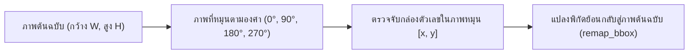

<details>
<summary> ดูเวอร์ชันข้อความ</summary>

1. ภาพต้นฉบับ (ความกว้าง W, ความสูง H)
2. หมุนภาพตามมุมองศาที่กำหนด (0, 90, 180, หรือ 270 องศา)
3. แบบจำลองตรวจจับกล่องตัวเลขบนระนาบของภาพที่หมุนแล้ว
4. ฟังก์ชัน remap_bbox แปลงพิกัดย้อนกลับสู่ระนาบภาพต้นฉบับเดิม
</details>

<p align="center"><strong>ภาพที่ 1.3: แผนผังจำลองการแปลงพิกัดย้อนกลับจากภาพหมุนสู่ภาพต้นฉบับ</strong></p>

&emsp;&emsp;&emsp;&emsp;2. แผนภาพกระบวนการแปลงพิกัดย่อยระดับจุดและระดับกล่อง (Sub-remapping Workflows):

&emsp;&emsp;&emsp;&emsp;*(ก) แผนภาพการแปลงพิกัดจุดเดี่ยวตามมุมองศาด้วยฟังก์ชัน `remap_point`:*

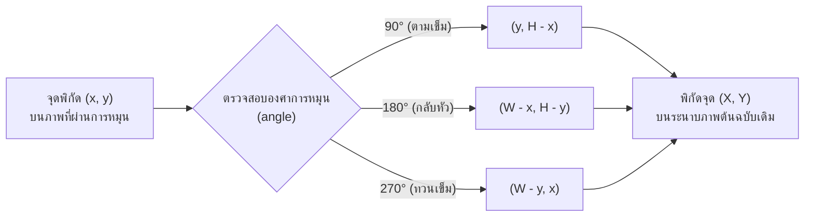

<details>
<summary> ดูเวอร์ชันข้อความ</summary>

1. รับจุดพิกัด (x, y) บนภาพที่ผ่านการหมุน
2. ตรวจสอบมุมองศาของการหมุน (angle)
   2.1 กรณีหมุน 90 องศา: คำนวณพิกัดใหม่เป็น (y, H - x)<br>
   2.2 กรณีหมุน 180 องศา: คำนวณพิกัดใหม่เป็น (W - x, H - y)<br>
   2.3 กรณีหมุน 270 องศา: คำนวณพิกัดใหม่เป็น (W - y, x)
3. ได้พิกัดจุด (X, Y) บนระนาบของภาพต้นฉบับเดิม
</details>

<p align="center"><strong>ภาพที่ 1.3 (ก): แผนภาพการแปลงพิกัดจุดเดี่ยวตามมุมองศาด้วยฟังก์ชัน remap_point</strong></p>

&emsp;&emsp;&emsp;&emsp;*(ข) แผนภาพการแปลงกล่องขอบเขตย้อนกลับด้วยฟังก์ชัน `remap_bbox`:*

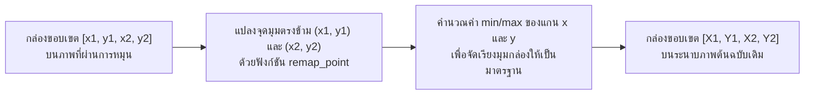

<details>
<summary> ดูเวอร์ชันข้อความ</summary>

1. รับกล่องขอบเขต [x1, y1, x2, y2] บนระนาบของภาพที่ผ่านการหมุน
2. นำจุดมุมตรงข้าม (x1, y1) และ (x2, y2) ไปแปลงพิกัดด้วยฟังก์ชัน remap_point
3. คำนวณค่าต่ำสุดและค่าสูงสุด (min/max) ของแกน x และแกน y เพื่อจัดเรียงขอบเขตกล่องให้เป็นมาตรฐาน
4. ได้กล่องขอบเขต [X1, Y1, X2, Y2] บนระนาบของภาพต้นฉบับเดิม
</details>

<p align="center"><strong>ภาพที่ 1.3 (ข): แผนภาพการแปลงกล่องขอบเขตย้อนกลับด้วยฟังก์ชัน remap_bbox</strong></p>

&emsp;&emsp;&emsp;&emsp;หลักการแปลงพิกัดทีละจุด (`remap_point`): แกนพิกัดจะสลับกันเมื่อมีการหมุนภาพที่มุม 90° หรือ 270°
1.11.2.4 หมุน 90° (ตามเข็ม): แกนสลับกัน จุดตำแหน่งบนภาพหมุน จะตรงกับจุดที่สลับแกนและหักออกจากความสูง บนภาพเดิม<br>1.11.2.5 หมุน 180° (กลับหัว): จุดตำแหน่งบนภาพหมุน จะตรงกับจุดที่หักออกจากความกว้างและความสูง บนภาพเดิม<br>1.11.2.6 หมุน 270° (ทวนเข็ม): แกนสลับกัน จุดตำแหน่งบนภาพหมุน จะตรงกับจุดที่สลับแกนและหักออกจากความกว้าง บนภาพเดิม

> **หมายเหตุเชิงคณิตศาสตร์:** การแปลงพิกัดของจุด $(x, y)$ บนภาพขนาดกว้าง $W$ และสูง $H$ ที่ผ่านการหมุน สามารถแสดงได้ด้วยสมการแปลงพิกัดในรหัสต้นฉบับด้านล่าง

&emsp;&emsp;&emsp;&emsp;รายละเอียดทางเทคนิคของกระบวนการ: เนื่องจากการหมุนภาพทำให้แกนพิกัดเปลี่ยนไป ระบบจึงแปลงพิกัดกรอบขอบเขต (Bounding Box) จากภาพหมุนกลับสู่ระนาบภาพต้นฉบับ โดยฟังก์ชัน `remap_point` แปลงพิกัดจุดตามสูตรเรขาคณิตของแต่ละมุม ได้แก่ `(y, h - x)` สำหรับ 90°, `(w - x, h - y)` สำหรับ 180°, และ `(w - y, x)` สำหรับ 270° จากนั้นฟังก์ชัน `remap_bbox` นำจุดมุมตรงข้ามมาหาค่าขอบเขตต่ำสุดและสูงสุด (`min/max`) เพื่อสร้างกรอบพิกัดที่ถูกต้องบนภาพต้นฉบับ ดังแสดงในซอร์สโค้ดที่ 1.6:

```python
def remap_point(x: float, y: float, angle: int, w: int, h: int) -> tuple[float, float]:
    """แปลงจุด 1 จุดจากภาพหมุน กลับสู่พิกัดภาพเดิมแบบทีละจุด"""
    if angle == 90:
        return y, h - x      # หมุนขวา 90° -> แกนสลับ x=y, y=h-x
    if angle == 180:
        return w - x, h - y  # กลับหัว 180° -> x=w-x, y=h-y
    if angle == 270:
        return w - y, x      # หมุนซ้าย 90° -> แกนสลับ x=w-y, y=x
    return x, y

def remap_bbox(bbox: list[float], angle: int, w: int, h: int) -> list[float]:
    """แปลงจุดมุม 2 จุด แล้วหา min/max เพื่อสร้าง Bounding Box ในพิกัดภาพเดิม"""
    x1, y1, x2, y2 = bbox
    p1_x, p1_y = remap_point(x1, y1, angle, w, h)
    p2_x, p2_y = remap_point(x2, y2, angle, w, h)
    return [
        min(p1_x, p2_x),
        min(p1_y, p2_y),
        max(p1_x, p2_x),
        max(p1_y, p2_y),
    ]
```
<p align="center"><strong>ซอร์สโค้ดที่ 1.6: <code>main.py</code> (2/4) — ฟังก์ชัน <code>remap_point</code> และ <code>remap_bbox</code> สำหรับการแปลงพิกัดเรขาคณิตย้อนกลับสู่ภาพต้นฉบับ</strong></p>

&emsp;&emsp;&emsp;&emsp;ผลลัพธ์ที่คาดหวัง: ไม่ว่าภาพจะถูกหมุนมุมไหน กล่องที่วาดบนภาพต้นฉบับจะตรงตำแหน่งตัวเลขเสมอ

---

#### 1.11.3 การกรองแถวตัวเลขแนวตั้ง (is_vertical)
1.11.3.1 ปัญหา: บริเวณตัวเรือนมาตรวัดน้ำมักมีตัวเลขระบุวันที่ผลิตหรือหมายเลขซีเรียลที่พิมพ์ในแนวตั้ง ซึ่งไม่ใช่ค่าตัวเลขบนหน้าปัดที่ต้องการบันทึก<br>1.11.3.2 แนวคิด: แถวตัวเลขบนหน้าปัดมาตรวัดน้ำมีการเรียงตัวในแนวนอน โดยช่วงความกว้างของแถวต้องมากกว่าช่วงความสูง หากตรวจพบกลุ่มตัวเลขที่มีช่วงความสูงมากกว่าความกว้าง ระบบจะตัดทิ้งจากการคำนวณ<br>1.11.3.3 การทำงาน: ฟังก์ชันคำนวณระยะการกระจายตัวในแนวนอน (`width_span`) และแนวตั้ง (`height_span`) โดยปรับสเกลตามขนาดภาพ หาก `height_span` มีค่าตั้งแต่ 80% ของ `width_span` ขึ้นไป ระบบจะจัดประเภทเป็นคอลัมน์แนวตั้ง

&emsp;&emsp;&emsp;&emsp;รายละเอียดทางเทคนิคของกระบวนการ: ตัวเลขค่าอ่านบนหน้าปัดมาตรวัดน้ำจัดเรียงตัวในแนวนอนเสมอ ระบบจึงใช้ฟังก์ชัน `is_vertical` คัดกรองตัวเลขที่พิมพ์ในแนวตั้ง เช่น หมายเลขรุ่นหรือวันที่ผลิต โดยปรับขนาดพิกัดจุดศูนย์กลางให้อยู่ในรูปสัดส่วนของภาพ แล้วเปรียบเทียบระยะการกระจายตัวในแนวตั้ง (`height_span`) กับแนวนอน (`width_span`) หาก `height_span` มีค่าตั้งแต่ 80% ของ `width_span` ขึ้นไป หรือความกว้างแคบผิดปกติ ระบบจะจำแนกเป็นคอลัมน์แนวตั้งและตัดออกจากการคำนวณ ดังแสดงในซอร์สโค้ดที่ 1.7:

```python
def is_vertical(dets: list[dict[str, Any]], img_w: int, img_h: int) -> dict[str, Any]:
    """ตรวจว่าแถวตัวเลขเรียงเป็นแนวตั้งหรือไม่ (แนวนอน width_span ต้องมากกว่า height_span)"""
    if len(dets) < 2:
        return {"vertical": False}

    xs = [d["center_x"] / img_w for d in dets]
    ys = [d["center_y"] / img_h for d in dets]

    width_span = max(xs) - min(xs)   # ความกว้างของแนวตัวเลข (ซ้ายสุดไปขวาสุด)
    height_span = max(ys) - min(ys)  # ความสูงของแนวตัวเลข (บนสุดไปล่างสุด)

    # หากช่วงแนวตั้งมีค่าตั้งแต่ 80% ของช่วงแนวนอนขึ้นไป แสดงว่าเป็นคอลัมน์แนวดิ่ง (ไม่ใช่แถวหน้าปัดมิเตอร์)
    is_vert = (height_span >= width_span * 0.8) or (width_span <= 0.05 and height_span >= 0.08)
    return {"vertical": is_vert}
```
<p align="center"><strong>ซอร์สโค้ดที่ 1.7: <code>main.py</code> (3/4) — ฟังก์ชัน <code>is_vertical</code> สำหรับการตรวจสอบและคัดกรองการเรียงตัวของแถวตัวเลข</strong></p>

---

#### 1.11.4 การค้นหาทิศทางและฟิลเตอร์ที่เหมาะสม (detect_digits_best)

&emsp;&emsp;&emsp;&emsp;การวิเคราะห์ปัญหาและความไม่แน่นอนของข้อมูลภาพ: ภาพถ่ายนำเข้าจากผู้ใช้งานมีความไม่แน่นอนสูง ทั้งในด้านมุมมองการถ่ายภาพ (0°, 90°, 180°, 270°) และสภาพแสงที่ไม่สม่ำเสมอ (มืด มีเงาบดบัง หรือสว่างจ้าเกินไป) หากระบบประมวลผลเพียงมุมมองเดียวหรือฟิลเตอร์เดียว อาจนำไปสู่ข้อผิดพลาดในการตรวจจับตัวเลขได้

---

&emsp;&emsp;&emsp;&emsp;แนวคิดการแก้ปัญหา: ระบบจึงใช้วิธีการทดสอบเชิงครอบคลุมครบ 12 รูปแบบการทดสอบ (4 ทิศทาง × 3 รูปแบบการปรับแสง) แล้วประเมินให้คะแนนเพื่อคัดเลือกรูปแบบที่ให้ผลการตรวจจับชัดเจนและน่าเชื่อถือสูงสุด ดังภาพที่ 1.4 โดยเพื่อให้อ่านง่ายบนหน้ากระดาษขนาดมาตรฐาน A4 ระบบจึงแบ่งแผนภาพออกเป็นแผนภาพภาพรวม และแผนภาพกระบวนการทำงานย่อยในแต่ละระยะ (ก)–(ค) ดังนี้

&emsp;&emsp;&emsp;&emsp;1. แผนภาพภาพรวมกระบวนการค้นหา 12 รูปแบบ (Search Strategy Overview):

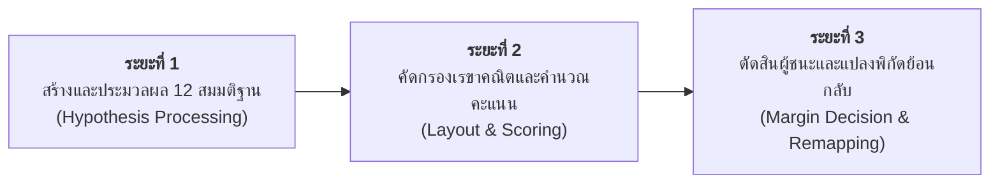

<details>
<summary> ดูเวอร์ชันข้อความ</summary>

1. ระยะที่ 1: การสร้างและประมวลผล 12 สมมติฐาน (หมุนภาพ 4 ทิศทางร่วมกับ 3 ฟิลเตอร์แสง ตรวจจับตัวเลขด้วย YOLO26 และตัดกล่องซ้อนด้วย IoU)
2. ระยะที่ 2: การคัดกรองเรขาคณิตและคำนวณคะแนน (กรองแถวแนวตั้งด้วย is_vertical คำนวณคะแนน Score และประเมินตำแหน่งทศนิยมสีแดงด้วย red_ratio)
3. ระยะที่ 3: การตัดสินผู้ชนะและแปลงพิกัดย้อนกลับ (เปรียบเทียบคะแนนผ่านกฎ Margin Rule คัดเลือกมุมที่ชนะ และแปลงพิกัดกลับสู่ภาพต้นฉบับด้วย remap_bbox)
</details>

<p align="center"><strong>ภาพที่ 1.4: กระบวนการค้นหาทิศทางและฟิลเตอร์ที่เหมาะสมด้วยฟังก์ชัน detect_digits_best (12 รูปแบบ)</strong></p>

&emsp;&emsp;&emsp;&emsp;2. แผนภาพกระบวนการทำงานย่อยในแต่ละระยะ (Sub-search Workflows):

&emsp;&emsp;&emsp;&emsp;*(ก) ระยะที่ 1 การสร้างและประมวลผล 12 สมมติฐาน (Hypothesis Generation & Processing):*

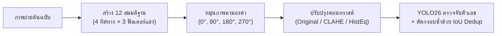

<details>
<summary> ดูเวอร์ชันข้อความ</summary>

1. ภาพถ่ายต้นฉบับ
2. สร้าง 12 สมมติฐาน (4 ทิศทางการหมุนร่วมกับ 3 ฟิลเตอร์ปรับแสง)
3. หมุนภาพตามมุมองศา (0, 90, 180, หรือ 270 องศา)
4. ปรับปรุงคอนทราสต์ของภาพ (Original, CLAHE, หรือ Histogram Equalization)
5. ตรวจจับตัวเลขด้วย YOLO26 และกำจัดกรอบซ้ำซ้อนด้วย IoU Deduplication
</details>

<p align="center"><strong>ภาพที่ 1.4 (ก): แผนภาพระยะที่ 1 การสร้างและประมวลผล 12 สมมติฐาน</strong></p>

&emsp;&emsp;&emsp;&emsp;*(ข) ระยะที่ 2 การคัดกรองเรขาคณิตและการคำนวณคะแนน (Geometric Filtering & Scoring):*

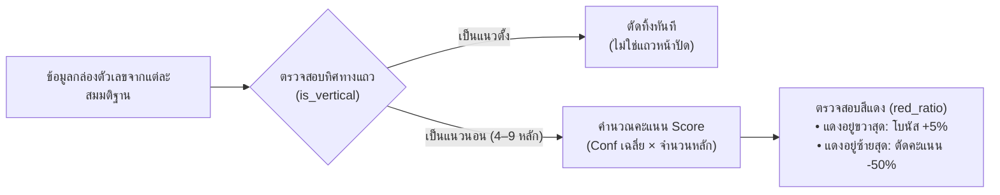

<details>
<summary> ดูเวอร์ชันข้อความ</summary>

1. รับข้อมูลกล่องตัวเลขที่ตรวจพบจากแต่ละสมมติฐาน
2. ตรวจสอบทิศทางการเรียงตัวของแถวตัวเลขด้วยฟังก์ชัน is_vertical
   2.1 กรณีเป็นแถวแนวตั้ง: ตัดทิ้งทันทีเนื่องจากไม่ใช่แถวตัวเลขบนหน้าปัด<br>
   2.2 กรณีเป็นแถวแนวนอนที่มี 4 ถึง 9 หลัก: นำเข้าสู่ขั้นตอนการคำนวณคะแนน
3. คำนวณคะแนนความเหมาะสม (Score เท่ากับ ค่าความเชื่อมั่นเฉลี่ยคูณด้วยจำนวนหลัก)
4. ตรวจสอบสัดส่วนพิกเซลสีแดง (red_ratio)
   4.1 หากหลักสีแดงอยู่ขวาสุด: มอบคะแนนโบนัสเพิ่มร้อยละ 5<br>
   4.2 หากหลักสีแดงอยู่ซ้ายสุด: ปรับลดคะแนนลงร้อยละ 50 เนื่องจากมีแนวโน้มภาพกลับทิศ
</details>

<p align="center"><strong>ภาพที่ 1.4 (ข): แผนภาพระยะที่ 2 การคัดกรองเรขาคณิตและการคำนวณคะแนน</strong></p>

&emsp;&emsp;&emsp;&emsp;*(ค) ระยะที่ 3 การตัดสินผู้ชนะและการแปลงพิกัดย้อนกลับ (Margin Decision & Remapping):*

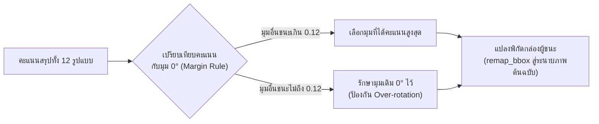

<details>
<summary> ดูเวอร์ชันข้อความ</summary>

1. รวบรวมคะแนนสรุปจากทั้ง 12 รูปแบบ
2. เปรียบเทียบคะแนนกับมุมปกติ 0 องศาตามกฎ Margin Rule
   2.1 กรณีมุมอื่นได้คะแนนสูงกว่ามุม 0 องศาเกินเกณฑ์ 0.12: คัดเลือกมุมที่ได้คะแนนสูงสุดเป็นผู้ชนะ<br>
   2.2 กรณีมุมอื่นได้คะแนนสูงกว่าไม่เกินเกณฑ์ 0.12: คงมุม 0 องศาไว้เพื่อป้องกันการสลับมุมโดยไม่จำเป็น
3. นำกล่องขอบเขตของรูปแบบที่ชนะไปแปลงพิกัดกลับสู่ระนาบภาพต้นฉบับเดิมด้วยฟังก์ชัน remap_bbox
</details>

<p align="center"><strong>ภาพที่ 1.4 (ค): แผนภาพระยะที่ 3 การตัดสินผู้ชนะและการแปลงพิกัดย้อนกลับ</strong></p>

---

&emsp;&emsp;&emsp;&emsp;ความสัมพันธ์ระหว่างฟังก์ชันย่อยกับการแก้ไขปัญหาทางเทคนิค:
1.11.4.1 หมุน 4 ทิศ (0°/90°/180°/270°): ช่วยแก้ปัญหาภาพถ่ายเอียงหรือกลับทิศทาง<br>1.11.4.2 ปรับแสง 3 แบบ (Orig/CLAHE/HistEq): ช่วยแก้ปัญหาตัวเลขเลือนรางหรืออยู่ในเงามืด<br>1.11.4.3 YOLO ตรวจจับ: ทำหน้าที่ตรวจจับตำแหน่งตัวเลข 0–9 ทุกหลัก<br>1.11.4.4 IoU dedup (threshold 0.45): ช่วยตัดกล่องที่ซ้อนทับซ้ำซ้อนให้เหลือกล่องเดียว<br>1.11.4.5 is_vertical: ทำหน้าที่กรองข้อความวันที่หรือหมายเลขซีเรียลที่เรียงเป็นแนวตั้งทิ้ง<br>1.11.4.6 red_ratio + Scoring: ใช้ตรวจสอบทิศทางหน้าปัด (หลักทศนิยมสีแดงต้องอยู่ขวาสุด)<br>1.11.4.7 Scoring (mean_conf × n): ทำหน้าที่คัดเลือกรูปแบบที่มีค่าความเชื่อมั่นและจำนวนหลักสอดคล้องกับเกณฑ์<br>1.11.4.8 Margin 0.12: ช่วยป้องกันการสลับมุมเมื่อคะแนนมีความใกล้เคียงกัน<br>1.11.4.9 remap_bbox: ทำหน้าที่แปลงพิกัดกล่องให้ตรงกับภาพต้นฉบับ

&emsp;&emsp;&emsp;&emsp;การทำงานแบ่งออกเป็น 3 ฟังก์ชันย่อยตามหน้าที่:
1.11.4.10 `red_ratio(img_bgr, bbox)` — ตรวจสีแดงของหลักทศนิยม:<br>1.11.4.11 ปัญหาที่แก้ไข: การตรวจสอบทิศทางของหน้าปัด — มาตรวัดน้ำที่ใช้ในการศึกษานี้มีหลักทศนิยมแสดงด้วยสีแดงอยู่ตำแหน่งขวาสุด หากตรวจพบสีแดงที่ตำแหน่งซ้ายสุด มีความเป็นไปได้สูงที่ภาพจะกลับหัว<br>1.11.4.12 การทำงาน: ครอปภาพเฉพาะภายในกรอบ Bounding Box แปลงเป็นปริภูมิสี HSV แล้วคำนวณสัดส่วนพิกเซลสีแดง
1.11.4.13 `eval_orientation(bgr_img, angle, prep)` — ประเมินคะแนนในแต่ละรูปแบบ:<br>1.11.4.14 วัตถุประสงค์: ตัดสินว่าทิศทางและฟิลเตอร์ใดมีความน่าเชื่อถือสูงสุด และกรองผลการตรวจจับที่คลาดเคลื่อน — โดยต้องเรียงตัวในแนวนอนและมีจำนวนหลัก 4–9 หลักจึงจะได้รับการคำนวณคะแนน<br>1.11.4.15 วิธีการทำงาน: หมุนภาพและปรับคอนทราสต์ตามที่กำหนด จากนั้นตรวจจับตัวเลขด้วยแบบจำลอง YOLO แล้วตัดกรอบที่ซ้ำซ้อนด้วยฟังก์ชัน `dedup_detections` ต่อด้วยการตรวจสอบการเรียงตัวแนวนอนและจำนวนหลัก และคำนวณคะแนนรวมจากความเชื่อมั่นเฉลี่ยคูณจำนวนหลักพร้อมปรับคะแนนตามตำแหน่งหลักทศนิยมสีแดง
1.11.4.16 `detect_digits_best(rgb_img)` — คัดเลือกผลลัพธ์ที่ดีที่สุด:<br>1.11.4.17 วัตถุประสงค์: คัดเลือกรูปแบบที่เหมาะสมที่สุดจาก 12 รูปแบบการทดสอบ โดยมีเกณฑ์ Margin ป้องกันความผันผวนของมุมองศา<br>1.11.4.18 การทำงาน: รันฟังก์ชัน `eval_orientation` ครบทั้ง 12 รูปแบบ แล้วเลือกตัวแทนที่ดีที่สุดของแต่ละมุม (4 มุม) จากนั้นคัดเลือกมุมที่ได้คะแนนสูงสุด (`best_angle`) โดยใช้กฎ Margin Rule หากมุมอื่นชนะมุม 0° ไม่เกินเกณฑ์ `ORIENT_MARGIN = 0.12` ให้คงมุม 0° ไว้ และดำเนินการแปลงพิกัดกล่องของมุมที่ชนะกลับสู่ภาพเดิมด้วย `remap_bbox`

&emsp;&emsp;&emsp;&emsp;รายละเอียดทางเทคนิคของกระบวนการ: ระบบประมวลผลการค้นหาตัวเลขจากภาพทั้ง 12 รูปแบบ โดยฟังก์ชัน `red_ratio` ตรวจวัดสัดส่วนพิกเซลสีแดงในปริภูมิสี HSV เพื่อระบุตำแหน่งหลักทศนิยม จากนั้นฟังก์ชัน `eval_orientation` คำนวณคะแนนความเชื่อมั่นรวม (คัดกรองเฉพาะกลุ่มตัวเลขแนวนอนจำนวน 4–9 หลัก และปรับคะแนนตามตำแหน่งหลักสีแดง) และฟังก์ชัน `detect_digits_best` ทำการคัดเลือกผลลัพธ์ที่ดีที่สุดในแต่ละมุม พร้อมใช้เกณฑ์ตัดสิน `ORIENT_MARGIN = 0.12` เพื่อป้องกันความผันผวนจากการสลับมุมองศาเมื่อคะแนนใกล้เคียงกัน ดังแสดงในซอร์สโค้ดที่ 1.8:

```python
def red_ratio(img_bgr: np.ndarray, bbox: list[float]) -> float:
    """คำนวณสัดส่วนสีแดงในกล่องตัวเลข (หลักทศนิยมสีแดงต้องอยู่ขวาสุดของหน้าปัด)"""
    x1, y1, x2, y2 = [int(v) for v in bbox]
    pad_x = max(1, int((x2 - x1) * 0.15))
    pad_y = max(1, int((y2 - y1) * 0.15))

    crop = img_bgr[
        max(0, y1 + pad_y): min(img_bgr.shape[0], y2 - pad_y),
        max(0, x1 + pad_x): min(img_bgr.shape[1], x2 - pad_x),
    ]
    if crop.size == 0:
        return 0.0

    hsv = cv2.cvtColor(crop, cv2.COLOR_BGR2HSV)
    mask1 = cv2.inRange(hsv, (0, 40, 40), (12, 255, 255))
    mask2 = cv2.inRange(hsv, (165, 40, 40), (180, 255, 255))
    return float(np.mean((mask1 | mask2) > 0))

def eval_orientation(bgr_img: np.ndarray, angle: int, prep: str) -> dict[str, Any]:
    """ประเมินผลลัพธ์ของ 1 มุม × 1 ฟิลเตอร์ พร้อมวิเคราะห์ทิศทางข้อความ/สัญลักษณ์ m บนหน้าปัด"""
    rot = rotate_image(bgr_img, angle)
    proc = apply_prep(rot, prep)
    dets = dedup_detections(detect_digits(proc))

    rh, rw = rot.shape[:2]
    vert = is_vertical(dets, rw, rh)
    n = len(dets)

    text_info = detect_dial_text_orientation(rot)

    if not dets or vert["vertical"] or not (EXPECTED_MIN_DIGITS <= n <= EXPECTED_MAX_DIGITS):
        return {
            "score": 0.0,
            "dets": dets,
            "prep": prep,
            "vert": vert,
            "text_info": text_info,
        }

    score = float(np.mean([d["confidence"] for d in dets])) * n

    # กฎสีแดง: หลักทศนิยมสีแดงต้องอยู่ขวาสุดเสมอ
    r_first = red_ratio(proc, dets[0]["bbox"])
    r_last = red_ratio(proc, dets[-1]["bbox"])

    if r_first > RED_THRESH and r_first > r_last * RED_DOMINANCE:
        score *= 0.5   # แดงอยู่ซ้าย -> น่าจะกลับหัว (ตัดคะแนน)
    elif r_last > RED_THRESH and r_last > r_first * RED_DOMINANCE:
        score *= 1.05  # แดงอยู่ขวา -> ทิศทางถูกต้อง (เพิ่มคะแนน)

    # โบนัส/ปรับลดคะแนนตามการวางตัวของข้อความและสัญลักษณ์ m
    if text_info["text_detected"]:
        if text_info["is_vertical"]:
            score *= 0.4  # ข้อความยังเป็นแนวตั้ง แสดงว่ามุมนี้ยังผิดทิศ
        else:
            score *= 1.1  # ข้อความอยู่ในแนวนอนถูกต้องแล้ว

    return {
        "score": score,
        "dets": dets,
        "prep": prep,
        "vert": vert,
        "text_info": text_info,
    }

def detect_digits_best(rgb_img: np.ndarray) -> tuple[list[dict[str, Any]], dict[str, Any] | None]:
    """ทดลอง 4 ทิศ × 3 ฟิลเตอร์ (12 รูปแบบ) แล้วเลือกชุดที่ได้คะแนนสูงสุด พร้อมปรับหมุนหากตรวจพบข้อความแนวตั้ง"""
    h, w = rgb_img.shape[:2]
    bgr = cv2.cvtColor(rgb_img, cv2.COLOR_RGB2BGR)

    # ตรวจสอบทิศทางข้อความและสัญลักษณ์ m ที่ภาพต้นฉบับ (0°)
    base_text_info = detect_dial_text_orientation(bgr)

    candidates = {}
    for angle in ROTATION_ANGLES:
        best_in_angle = max(
            [eval_orientation(bgr, angle, prep) for prep in PREP_LIST],
            key=lambda c: c["score"],
        )
        candidates[angle] = best_in_angle

    cand0 = candidates[0]
    best_angle, best_cand = max(candidates.items(), key=lambda item: item[1]["score"])

    # หากภาพต้นฉบับตรวจพบข้อความ/m เป็นแนวตั้ง ให้สลับไปพิจารณามุม 90° หรือ 270° ที่ข้อความวางแนวนอน
    if base_text_info["is_vertical"] and best_angle in (0, 180):
        alt_candidates = {a: candidates[a] for a in (90, 270) if candidates[a]["score"] > 0}
        if alt_candidates:
            best_angle, best_cand = max(alt_candidates.items(), key=lambda item: item[1]["score"])

    # Margin Rule: มุมอื่นต้องชนะมุม 0° เกินกำหนด จึงยอมสลับมุม (เว้นแต่ 0° ข้อความเป็นแนวตั้ง)
    if (
        best_angle != 0
        and cand0["dets"]
        and not cand0["vert"]["vertical"]
        and not base_text_info["is_vertical"]
        and (best_cand["score"] - cand0["score"] < ORIENT_MARGIN)
    ):
        best_angle, best_cand = 0, cand0

    best_dets = best_cand["dets"]
    best_meta = None

    if best_dets:
        best_meta = {
            "angle": best_angle,
            "prep": best_cand["prep"],
            "clahe": best_cand["prep"] == "clahe",
            "base_text_vertical": base_text_info["is_vertical"],
            "text_info": best_cand.get("text_info", {}),
        }
        for d in best_dets:
            d["bbox"] = remap_bbox(d["bbox"], best_angle, w, h)
            d["center_x"] = (d["bbox"][0] + d["bbox"][2]) / 2.0
            d["center_y"] = (d["bbox"][1] + d["bbox"][3]) / 2.0

    return best_dets, best_meta
```
<p align="center"><strong>ซอร์สโค้ดที่ 1.8: <code>main.py</code> (4/4) — ฟังก์ชัน <code>red_ratio</code>, <code>eval_orientation</code> และ <code>detect_digits_best</code> สำหรับการค้นหาเชิงสมมติฐานพหุคูณ 12 รูปแบบ</strong></p>

---

#### 1.11.5 การตรวจจับทิศทางข้อความและสัญลักษณ์ m (detect_dial_text_orientation)
1.11.5.1 ปัญหา: ภาพถ่ายมาตรวัดน้ำในภาคสนามอาจถูกบันทึกในมุมตะแคงข้าง 90° หรือ 270° จากการติดตั้งในแนวดิ่งตามแนวท่อ หรือตัวเลขบางตัวมีรูปทรงสมมาตร (เช่น 0, 1, 8 หรือ 2 กับ 5) ซึ่งอาจทำให้ตัวตรวจจับวัตถุตีความลำดับตัวเลขในทิศทางกลับหัวหรืออ่านข้ามแถว (เช่น อ่านได้ 53510 แทนที่จะเป็น 01535) การพึ่งพาการเรียงตัวของกล่องตัวเลขเพียงอย่างเดียวจึงไม่เพียงพอในการระบุทิศทางระนาบแนวนอนที่ถูกต้อง<br>1.11.5.2 แนวคิด: สำหรับมาตรวัดที่ใช้ในการศึกษานี้ สัญลักษณ์หน่วยวัดและข้อความบนหน้าปัดมีทิศทางสัมพันธ์กับแถวตัวเลข จึงนำมาใช้เป็นข้อมูลประกอบการประมาณแนวระนาบ โดยระบบใช้การเปิดทางสัณฐานวิทยาแบบตั้งฉาก (Orthogonal Morphological Opening) ด้วยเคอร์เนลแนวนอน $K_h = (13, 2)$ และเคอร์เนลแนวตั้ง $K_v = (2, 13)$ ควบคู่กับการจำแนกรูปทรงตัวอักษร $m$ ผ่านสัดส่วน Aspect Ratio ($AR \in [1.1, 2.2]$ สำหรับแนวนอน เทียบกับ $AR \in [0.45, 0.90]$ สำหรับแนวตั้ง) เพื่อประเมินสัดส่วนความเป็นแนวตั้ง $V_{\text{ratio}} = \frac{\text{Score}_v}{\text{Score}_h + \text{Score}_v}$<br>1.11.5.3 การทำงาน: ฟังก์ชันตัดขอบพื้นที่เฉพาะส่วนกลางหน้าปัด ทำการปรับแปลงเป็นภาพขาวดำด้วย Adaptive Gaussian Thresholding จากนั้นคำนวณคะแนนความต่อเนื่องของเส้นแนวนอน ($Score_h$) และแนวตั้ง ($Score_v$) และนับคะแนนโหวตของตัวอักษร $m$ หากตรวจพบแนวโน้มข้อความเป็นแนวตั้ง ($V_{\text{ratio}} > 0.52$ หรือคะแนนแนวตั้งเด่นชัด) ฟังก์ชันจะส่งคืนสถานะ `is_vertical = True` เพื่อส่งสัญญาณให้ระบบจัดระนาบหมุนภาพ 90° หรือ 270° สู่แนวนอนก่อนทำการประมวลผลตัวเลข ดังแสดงในซอร์สโค้ดที่ 1.9:

```python
def detect_dial_text_orientation(img_bgr: np.ndarray) -> dict[str, Any]:
    """
    ตรวจจับสัญลักษณ์ m/m³ และข้อความบนหน้าปัดมิเตอร์น้ำ (Dial Text & Unit 'm' Detection)
    ประเมินว่าข้อความและสัญลักษณ์มีแนวโน้มเป็นแนวตั้ง (Vertical) หรือแนวนอน (Horizontal)
    เพื่อใช้ชี้ทิศทางการหมุนภาพ (Orientation Alignment) แก้ไขปัญหาความคลาดเคลื่อนจากการอ่านภาพที่เอียง
    """
    h, w = img_bgr.shape[:2]
    gray = cv2.cvtColor(img_bgr, cv2.COLOR_BGR2GRAY)

    # โฟกัสบริเวณกึ่งกลางหน้าปัดมิเตอร์ (ตัดขอบท่อ/กรอบนอกออก 10%)
    pad_h, pad_w = int(h * 0.10), int(w * 0.10)
    dial_crop = gray[pad_h:max(pad_h + 1, h - pad_h), pad_w:max(pad_w + 1, w - pad_w)]
    dh, dw = dial_crop.shape

    # Adaptive thresholding เพื่อสกัดเส้นขอบตัวอักษรและตัวเลข
    blur = cv2.GaussianBlur(dial_crop, (3, 3), 0)
    bin_img = cv2.adaptiveThreshold(blur, 255, cv2.ADAPTIVE_THRESH_GAUSSIAN_C, cv2.THRESH_BINARY_INV, 15, 5)

    # เคอร์เนลตรวจจับแนวการเรียงตัวของข้อความ
    # แนวนอน (Horizontal): ตัวอักษรเรียงตัวยาวในแกน X
    kh = cv2.getStructuringElement(cv2.MORPH_RECT, (13, 2))
    # แนวตั้ง (Vertical): ตัวอักษรเรียงตัวยาวในแกน Y
    kv = cv2.getStructuringElement(cv2.MORPH_RECT, (2, 13))

    lines_h = cv2.morphologyEx(bin_img, cv2.MORPH_CLOSE, kh)
    lines_v = cv2.morphologyEx(bin_img, cv2.MORPH_CLOSE, kv)

    cnts_h, _ = cv2.findContours(lines_h, cv2.RETR_EXTERNAL, cv2.CHAIN_APPROX_SIMPLE)
    cnts_v, _ = cv2.findContours(lines_v, cv2.RETR_EXTERNAL, cv2.CHAIN_APPROX_SIMPLE)

    score_h = 0.0
    for c in cnts_h:
        bx, by, bw, bh = cv2.boundingRect(c)
        aspect = bw / float(bh + 1e-5)
        if 14 < bw < dw * 0.6 and 6 < bh < dh * 0.25 and aspect >= 1.6:
            score_h += aspect * cv2.contourArea(c)

    score_v = 0.0
    for c in cnts_v:
        bx, by, bw, bh = cv2.boundingRect(c)
        aspect = bh / float(bw + 1e-5)
        if 14 < bh < dh * 0.6 and 6 < bw < dw * 0.25 and aspect >= 1.6:
            score_v += aspect * cv2.contourArea(c)

    total = score_h + score_v + 1e-5
    v_ratio = score_v / total

    # วิเคราะห์รูปทรงอักษร 'm' หรือ 'm³'
    m_h_votes = 0
    m_v_votes = 0
    raw_cnts, _ = cv2.findContours(bin_img, cv2.RETR_EXTERNAL, cv2.CHAIN_APPROX_SIMPLE)
    for c in raw_cnts:
        bx, by, bw, bh = cv2.boundingRect(c)
        if 8 < bw < 60 and 8 < bh < 60:
            asp = bw / float(bh)
            area = cv2.contourArea(c)
            if area > 25:
                if 1.1 <= asp <= 2.2:
                    m_h_votes += 1
                elif 0.45 <= asp <= 0.90:
                    m_v_votes += 1

    text_detected = (score_h + score_v > 200) or (m_h_votes + m_v_votes > 0)
    unit_m_detected = (m_h_votes + m_v_votes > 0)
    is_vertical_text = (v_ratio > 0.52 and score_v > 300) or (m_v_votes > m_h_votes * 1.5 and score_v > 150)
    conf = float(v_ratio if is_vertical_text else (1.0 - v_ratio))

    return {
        "text_detected": bool(text_detected),
        "unit_m_detected": bool(unit_m_detected),
        "is_vertical": bool(is_vertical_text),
        "confidence": round(conf, 3),
        "v_ratio": round(v_ratio, 3),
        "score_h": round(score_h, 1),
        "score_v": round(score_v, 1),
    }
```
<p align="center"><strong>ซอร์สโค้ดที่ 1.9: <code>utils.py</code> — ฟังก์ชัน <code>detect_dial_text_orientation</code> สำหรับตรวจจับทิศทางการวางตัวของข้อความและสัญลักษณ์หน่วย m บนหน้าปัด</strong></p>

> **สรุปสาระสำคัญหัวข้อ 1.11:**
> * `detect_digits_best`: ประมวลผลการค้นหาเชิงสมมติฐานพหุคูณ 12 รูปแบบ (4 ทิศทางการหมุน × 3 ฟิลเตอร์ปรับปรุงภาพ) และคัดเลือกผลลัพธ์โดยอาศัยเกณฑ์ค่าความเชื่อมั่นเฉลี่ย สัดส่วนสีแดง และค่า Margin
> * `remap_bbox`: แปลงพิกัดทางเรขาคณิตของกรอบ Bounding Box จากระนาบภาพหมุนกลับสู่ระนาบภาพต้นฉบับ
> * `detect_dial_text_orientation`: ตรวจจับทิศทางการเรียงตัวของข้อความและสัญลักษณ์หน่วย m บนหน้าปัดด้วยเคอร์เนลสัณฐานวิทยาแบบตั้งฉาก เพื่อชี้ทิศทางการหมุนปรับระนาบสู่แนวนอนอัตโนมัติ
> * กลยุทธ์การประเมิน 12 รูปแบบถูกออกแบบเพื่อชดเชยความแปรปรวนของมุมเอียงและการหมุนของภาพถ่ายในสภาพแวดล้อมจริง

# บทที่ 2: หลักการและทฤษฎีที่เกี่ยวข้อง
### 2.1 ระบบงานเดิม

&emsp;&emsp;&emsp;&emsp;ในบริบทของการจัดเก็บข้อมูลการใช้น้ำและการอ่านค่ามาตรวัดน้ำแบบภาคสนาม กระบวนการดำเนินงานของหน่วยงานสาธารณูปโภคในหลายพื้นที่ยังคงอาศัยพนักงานหรือตัวแทนในการเดินสำรวจเพื่ออ่านและบันทึกข้อมูลตัวเลขบนหน้าปัดมาตรวัดน้ำตามรอบระยะเวลา (การประปานครหลวง, 2566; Salomon et al., 2022) ซึ่งขั้นตอนการบันทึกข้อมูลด้วยสายตาและอุปกรณ์พกพาดังกล่าวประกอบด้วยขั้นตอนหลัก 4 ขั้นตอนดังนี้

2.1.1 พนักงานเดินทางภาคสนามไปยังที่อยู่อาศัยของผู้ใช้น้ำตามรอบ<br>
2.1.2 พนักงานอ่านค่าตัวเลขบนหน้าปัดมาตรวัดน้ำด้วยสายตาและบันทึกลงสมุด<br>
2.1.3 พนักงานนำข้อมูลที่บันทึกมากรอกลงในระบบคอมพิวเตอร์ที่สำนักงาน<br>
2.1.4 ระบบคำนวณค่าน้ำและออกใบแจ้งหนี้ให้ผู้ใช้น้ำ

&emsp;&emsp;&emsp;&emsp;ปัญหาและข้อจำกัดของระบบเดิม ได้แก่ (1) ความผิดพลาดในการอ่าน เกิดจากหน้าปัดเลือนราง มีคราบสกปรก หรือสภาพแสงไม่เพียงพอ (2) ต้นทุนแรงงานสูง พนักงานต้องใช้เวลาเดินทางหลายชั่วโมงต่อวันเพื่ออ่านค่ามาตรวัดน้ำจำนวนมาก (3) ความล่าช้าในการตรวจจับความผิดปกติ เช่น ท่อรั่ว การใช้น้ำผิดปกติ หรือมาตรวัดน้ำชำรุด ซึ่งต้องรอจนถึงรอบการอ่านครั้งถัดไปจึงจะตรวจพบ

---

### 2.2 ระบบงานและงานวิจัยที่เกี่ยวข้อง

&emsp;&emsp;&emsp;&emsp;มีการศึกษาวิจัยเกี่ยวกับการอ่านค่ามาตรวัดอัตโนมัติจากภาพถ่ายอย่างต่อเนื่อง โดยตารางที่ 2.1 สรุปงานวิจัยที่เกี่ยวข้องและเปรียบเทียบกับโครงงานนี้

<p align="center"><strong>ตารางที่ 2.1: สรุปงานวิจัยที่เกี่ยวข้องและการเปรียบเทียบกับสถาปัตยกรรมโครงงานนี้</strong></p>

| งานวิจัย / ระบบ (ชื่อผู้แต่งและชื่อโครงงาน) | วิธีการหลัก | จุดแข็ง | ข้อจำกัด | โครงงานนี้ต่างออกไปอย่างไร |
|---|---|---|---|---|
| **Liang et al. (2022)**<br>*Research on water meter reading recognition based on deep learning* | CNN + Digit Segmentation | รายงานว่ามีความแม่นยำสูงในภาพควบคุม (ตามงานต้นฉบับ) | งานต้นฉบับระบุว่าต้องการภาพคุณภาพดี | โครงงานนี้ใช้ YOLO26 โดยออกแบบให้ประมวลผลภาพเต็มเฟรมโดยไม่ต้องตัดภาพล่วงหน้า — ความสามารถในการทนต่อมุมเอียง/แสงยังต้องมีการประเมินแบบควบคุม |
| **Wang & Xiang (2024)**<br>*GMS-YOLO: An enhanced algorithm for water meter reading recognition in complex environments* | YOLO ที่ปรับสำหรับสภาพแวดล้อมซับซ้อน | รายงานว่าทำงานได้ดีในสภาพแสงยาก (ตามงานต้นฉบับ) | งานต้นฉบับใช้ dataset เฉพาะ | โครงงานนี้ออกแบบให้เพิ่มการคัดกรองด้วย SigLIP2 ก่อนการตรวจจับ และเพิ่ม Safety Guards — เป็นความแตกต่างเชิงสถาปัตยกรรม ไม่ใช่ข้อสรุปเชิงประสิทธิภาพแบบควบคุม |
| **Salomon et al. (2022)**<br>*Image-based automatic dial meter reading in unconstrained scenarios* | Two-stage: Detect + OCR | รายงานว่าทำงานได้ในสภาพ unconstrained | งานต้นฉบับระบุว่าต้องการทรัพยากรประมวลผลสูง | โครงงานนี้ได้รับการออกแบบให้ทำงานได้บน CPU ทั่วไป — การเปรียบเทียบความเร็วแบบควบคุมยังไม่มี (ต้องวัดด้วยฮาร์ดแวร์/ความละเอียด/จำนวนสมมติฐานเดียวกัน) |
| **Nguyen et al. (2025)**<br>*Water meter reading based on text recognition techniques and deep learning* | Text Recognition + DL | รายงานว่ารองรับหลายรูปแบบมาตรวัด | งานต้นฉบับระบุว่าต้องการ dataset ขนาดใหญ่ | โครงงานนี้ออกแบบให้ใช้ Zero-shot SigLIP2 โดยมีวัตถุประสงค์เพื่อลดการฝึก classifier ใหม่ — ผลกระทบต่อความต้องการข้อมูลยังต้องมีการประเมินแบบควบคุม |
| **Radyhin (2022)**<br>*OCR-Water-Meter: OCR task using UNet and Faster R-CNN* | Two-stage Pipeline: UNet & EfficientNetB0 (Segmentation) + Faster R-CNN (OCR) | มีการแบ่งส่วนตัดภาพหน้าปัดเพื่อลดสัญญาณรบกวนก่อนส่งต่อให้ตัวตรวจจับตัวเลข | ท่อส่งข้อมูล 2 ขั้นตอนทำให้เกิดความหน่วงรวมสะสม และเสี่ยงต่อข้อผิดพลาดต่อเนื่องหากตัดภาพหน้าปัดพลาด อีกทั้งการติดตั้ง Detectron2 มีความซับซ้อนสูง | โครงงานนี้ใช้ YOLO26m แบบ Single-stage ตรวจจับตัวเลขเต็มเฟรมโดยตรง ไม่ต้องตัดภาพล่วงหน้า และจัดการติดตั้งแพ็กเกจได้อย่างสะดวกรวดเร็วด้วย `uv` |
| **โครงงานนี้ (ผู้จัดทำ)**<br>*ระบบอ่านค่ามาตรวัดน้ำอัตโนมัติด้วยปัญญาประดิษฐ์และคอมพิวเตอร์วิทัศน์ (Automated Water Meter Reading System using Deep Learning & Computer Vision)* | **YOLO26 + SigLIP2 + 12-combo search** | **ออกแบบโดยมีวัตถุประสงค์เพื่อประมวลผลภาพที่มีสัญญาณรบกวน, ไม่ต้องฝึก classifier ใหม่, และมี Safety Guards** | **จำกัดเฉพาะมาตรวัดตัวเลขแนวนอน** | — |

<p align="center"><em>ที่มา: สังเคราะห์และเปรียบเทียบจากงานวิจัยและโครงงานโอเพนซอร์สของ Liang et al. (2022), Wang & Xiang (2024), Salomon et al. (2022), Nguyen et al. (2025) และ Radyhin (2022)</em></p>

---

### 2.3 วงจรการพัฒนาซอฟต์แวร์ (SDLC) ที่ใช้ในโครงงาน

&emsp;&emsp;&emsp;&emsp;โครงงานนี้ประยุกต์ใช้วงจรการพัฒนาซอฟต์แวร์แบบ Iterative and Incremental Development ซึ่งแบ่งการพัฒนาออกเป็นรอบ (Iteration) สั้น ๆ แต่ละรอบเพิ่มคุณลักษณะใหม่และทดสอบผลก่อนพัฒนาต่อ เหมาะกับโครงงานที่มีความไม่แน่นอนสูงและต้องการปรับเปลี่ยนบ่อย

&emsp;&emsp;&emsp;&emsp;ขั้นตอนการพัฒนาตามวงจร SDLC ของโครงงาน:

2.3.1 วิเคราะห์ความต้องการ (Requirements Analysis): ศึกษาปัญหาการอ่านมาตรวัดน้ำ กำหนดวัตถุประสงค์ และขอบเขตของระบบ<br>
2.3.2 ออกแบบระบบ (System Design): ออกแบบ Pipeline ประมวลผล กำหนดเทคโนโลยีที่ใช้ และวางโครงสร้างโค้ด<br>
2.3.3 เตรียมชุดข้อมูลและฝึกแบบจำลอง (Data & Training): รวบรวมและกำกับพิกัดตัวเลขใน Roboflow แล้วฝึก YOLO26<br>
2.3.4 พัฒนาระบบประมวลผล (Implementation): เขียนโค้ดฟังก์ชันหลัก ตั้งแต่ `rotate_image` ถึง `read_meter`<br>
2.3.5 ทดสอบและปรับปรุง (Testing & Iteration): ทดสอบกับภาพจริง ปรับค่า threshold และเพิ่ม Safety Guards<br>
2.3.6 บูรณาการและส่งมอบ (Integration & Deployment): สร้าง FastAPI และ Gradio UI สำหรับการใช้งานจริง

# บทที่ 3: การพัฒนาแอปพลิเคชันและส่วนติดต่อผู้ใช้

### 3.1 สถาปัตยกรรม 3 ขบวนการและการตรวจสอบผ่านจุดทดสอบ

&emsp;&emsp;&emsp;&emsp;เพื่อให้การพัฒนาระบบอ่านค่ามาตรวัดน้ำอัตโนมัติมีความเป็นโมดูลาร์ (Modularity) ง่ายต่อการบำรุงรักษา และสามารถทดสอบความถูกต้องในแต่ละขั้นตอนได้อย่างเป็นอิสระ โครงงานนี้จึงออกแบบสถาปัตยกรรมการทำงานของระบบให้แบ่งแยกขาดจากกันอย่างชัดเจนเป็น **3 ขบวนการอิสระ** ควบคู่กับจุดทดสอบความถูกต้อง (Checkpoints) ประจำแต่ละขบวนการ ก่อนที่จะนำผลลัพธ์มารวมกันในขั้นตอนสุดท้ายเพื่อส่งคืนผ่านเว็บเซอร์วิส FastAPI และแสดงผลบนส่วนติดต่อผู้ใช้ Gradio ดังแสดงในภาพที่ 3.1

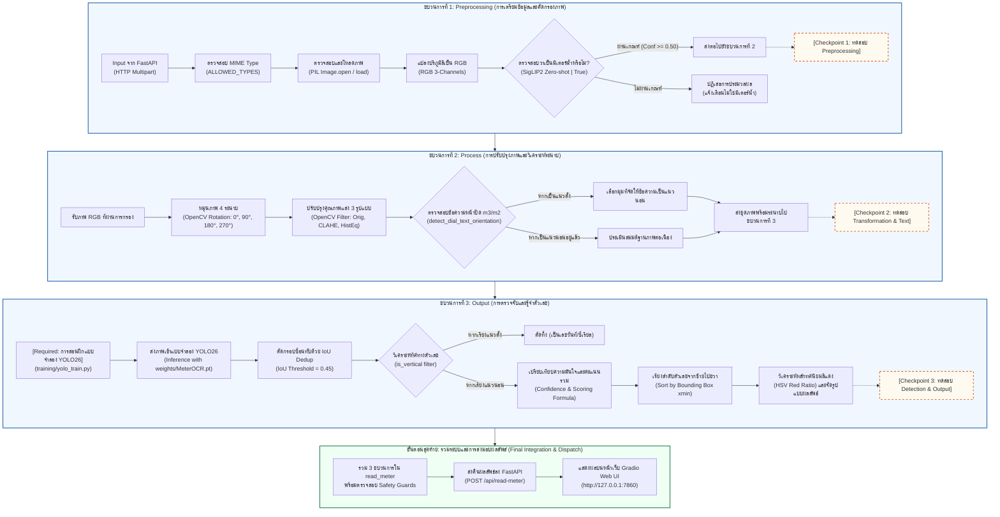

<p align="center"><strong>ภาพที่ 3.1: แผนภาพสถาปัตยกรรมระบบ 3 ขบวนการแบบแยกส่วน (Decoupled 3-Process Architecture) พร้อมจุดทดสอบ (Checkpoints) และการบูรณาการขั้นตอนสุดท้าย</strong></p>

> [!IMPORTANT]
> **หลักการแยกส่วนประมวลผลและการทดสอบผ่าน Checkpoint:**
> ในเอกสารนี้ การทำงานทุกส่วนจะถูกแยกขาดจากกันเป็น 3 ขบวนการอิสระอย่างชัดเจน ได้แก่ (1) Preprocessing (2) Process และ (3) Output โดยแต่ละขบวนการมีหน้าที่เฉพาะ มีการกำหนดเหตุผลความจำเป็นของแต่ละฟีเจอร์อย่างละเอียด และมีจุดทดสอบ (Checkpoint) ที่ผู้พัฒนาสามารถรันชุดคำสั่งทดสอบเพื่อยืนยันความถูกต้องแยกส่วนได้ทันทีก่อนที่จะนำมารวมกันในขั้นตอนสุดท้าย (Final Integration)

---

### 3.2 ขบวนการที่ 1: การเตรียมข้อมูลและคัดกรองภาพนำเข้า (Preprocessing)

#### 3.2.1 ขั้นตอนการทำงานและเหตุผลความจำเป็นของแต่ละฟีเจอร์

&emsp;&emsp;&emsp;&emsp;ขบวนการที่ 1 ทำหน้าที่เป็นประตูด่านแรก (Gatekeeper) ในการรับข้อมูลภาพจากภายนอก ตรวจสอบความสมบูรณ์ทางข้อมูล และคัดกรองความถูกต้องของวัตถุเป้าหมาย เพื่อให้มั่นใจว่าเฉพาะภาพที่ปลอดภัยและตรงกับภารกิจเท่านั้นที่จะถูกส่งต่อไปประมวลผลในขบวนการถัดไป โดยมีฟีเจอร์สำคัญและเหตุผลความจำเป็นในการเลือกใช้ดังนี้:

&emsp;&emsp;&emsp;&emsp;1. **การรับข้อมูลภาพเข้าผ่าน HTTP Multipart Form Data (Input From FastAPI):**  
&emsp;&emsp;&emsp;&emsp;*เหตุผลความจำเป็น:* ระบบถูกออกแบบให้ทำงานในรูปแบบบริการเครือข่าย (Microservice) การรับข้อมูลภาพผ่าน HTTP Multipart Form Data เป็นมาตรฐานสากลที่รองรับการอัปโหลดไฟล์ขนาดใหญ่จากไคลเอนต์ได้หลากหลาย ทั้งจากสมาร์ทโฟนของเจ้าหน้าที่ภาคสนาม เว็บเบราว์เซอร์ หรือระบบอัตโนมัติภายนอก โดยไม่ต้องแปลงเป็นสตริง Base64 ซึ่งช่วยลด Overhead ของข้อมูลลงได้ถึง 33% และลดภาระการจัดสรรหน่วยความจำของเซิร์ฟเวอร์

&emsp;&emsp;&emsp;&emsp;2. **การตรวจสอบประเภทไฟล์ (Check MIME Type):**  
&emsp;&emsp;&emsp;&emsp;*เหตุผลความจำเป็น:* ในสภาพแวดล้อมการให้บริการจริง ผู้ใช้อาจส่งไฟล์ผิดประเภทโดยไม่ตั้งใจ (เช่น เอกสาร PDF, วิดีโอ หรือสคริปต์อันตราย) ระบบจึงกำหนดชุดข้อมูลประเภทไฟล์ที่อนุญาต `ALLOWED_TYPES = {"image/jpeg", "image/png", "image/webp", "image/bmp"}` เพื่อสกัดกั้นไฟล์อันตรายตั้งแต่ระดับ Header โพรโทคอล ป้องกันช่องโหว่ความปลอดภัยด้าน Arbitrary File Upload และลดการใช้ทรัพยากรคำนวณในการประมวลผลไฟล์ที่เปิดอ่านไม่ได้

&emsp;&emsp;&emsp;&emsp;3. **การตรวจสอบการเปิดอ่านและความสมบูรณ์ของภาพ (Check Read Image):**  
&emsp;&emsp;&emsp;&emsp;*เหตุผลความจำเป็น:* การส่งข้อมูลผ่านระบบเครือข่ายมือถืออาจเกิดการขาดหายของแพ็กเกจ ทำให้ข้อมูลไบต์ของภาพขาดตอน (Truncated byte stream) หรือไฟล์ภาพชำรุด ระบบจึงใช้ `Image.open(io.BytesIO(data))` ร่วมกับคำสั่ง `img.load()` เพื่อบังคับให้โหลดและถอดรหัสบิตแมปของภาพเข้าสู่หน่วยความจำอย่างสมบูรณ์ หากข้อมูลภาพเสียหายหรือเกิด Decompression Bomb ระบบจะดักจับด้วยบล็อก `try-except` และตอบกลับด้วยรหัสข้อผิดพลาด HTTP 422 Unprocessable Entity ทันที เพื่อป้องกันไม่ให้โปรเซสเกิดข้อผิดพลาดรุนแรง (Crash) ในภายหลัง

&emsp;&emsp;&emsp;&emsp;4. **การตรวจสอบและแปลงปริภูมิสีเป็น RGB (Check RGB):**  
&emsp;&emsp;&emsp;&emsp;*เหตุผลความจำเป็น:* ภาพที่ถ่ายจากอุปกรณ์ต่างชนิดอาจมีโครงสร้างช่องสัญญาณที่แตกต่างกันอย่างมาก เช่น ภาพขาวดำที่มีเพียง 1 แชนแนล (Grayscale), ภาพ PNG ที่มี 4 แชนแนล (RGBA พร้อมช่องโปร่งใส Alpha), หรือภาพจากเครื่องสแกนในระบบสี CMYK หากส่งภาพเหล่านี้เข้าสู่แบบจำลองคอมพิวเตอร์วิทัศน์โดยตรง จะเกิดข้อผิดพลาดด้านมิติข้อมูล (Shape Mismatch Error) การบังคับแปลงด้วย `img.convert("RGB")` จึงเป็นการปรับมาตรฐานให้ภาพมีโครงสร้าง 3 แชนแนล (ความสูง, ความกว้าง, 3) เสมอก่อนเข้าสู่การคำนวณทางคณิตศาสตร์

&emsp;&emsp;&emsp;&emsp;5. **การคัดกรองวัตถุว่าเป็นมาตรวัดน้ำหรือไม่ด้วย SigLIP2 (Check is "water meter"? by SigLIP2):**  
&emsp;&emsp;&emsp;&emsp;*เหตุผลความจำเป็น:* ในภาคสนาม เจ้าหน้าที่อาจเผลอถ่ายภาพสิ่งของอื่น เช่น มาตรวัดไฟฟ้า เกจวัดแรงดันน้ำ วาล์วท่อ หรือแม้แต่ภาพสภาพแวดล้อมทั่วไป หากระบบส่งภาพที่ไม่เกี่ยวข้องเข้าสู่แบบจำลองตรวจจับตัวเลขโดยตรง ระบบจะพยายามค้นหากล่องตัวเลขจากป้ายหรือหมายเลขซีเรียลรอบข้าง ซึ่งทำให้เกิดการอ่านค่าเท็จ (False Reading) และสูญเสียทรัพยากรการคำนวณของซีพียู โครงงานจึงเลือกใช้แบบจำลองภาษาและภาพขนาดใหญ่ Google SigLIP 2 (`google/siglip2-base-patch16-224`) มาทำหน้าที่เป็นตัวคัดกรองแบบ Zero-shot (Zero-shot Gatekeeper) เพื่อเปรียบเทียบภาพกับชุดข้อความ 4 ตัวเลือก ได้แก่ `"water meter"`, `"electricity meter"`, `"gas meter"`, และ `"not a meter"` หากภาพมิได้รับความเชื่อมั่นในคลาส `"water meter"` เกินเกณฑ์ `METER_VERIFY_CONF = 0.50` ระบบจะตัดการประมวลผลทิ้งทันที ช่วยปกป้องความถูกต้องของระบบและประหยัดเวลาประมวลผลภาพผิดประเภท

#### 3.2.2 รหัสต้นฉบับของขบวนการเตรียมข้อมูลและคัดกรองภาพ

&emsp;&emsp;&emsp;&emsp;การทำงานของขบวนการที่ 1 ปรากฏอยู่ในฟังก์ชัน `check_water_meter` และขั้นตอนการแกะไฟล์ภาพนำเข้าของ `main.py` ดังแสดงในซอร์สโค้ดที่ 3.1:

```python
import io
from PIL import Image
import numpy as np
import torch
from transformers import AutoProcessor, AutoModelForZeroShotImageClassification

# เกณฑ์ความเชื่อมั่นขั้นต่ำในการอนุมัติว่าเป็นมาตรวัดน้ำ
METER_VERIFY_CONF = 0.50
ALLOWED_TYPES = {"image/jpeg", "image/png", "image/webp", "image/bmp"}
TEXT_LABELS = ["water meter", "electricity meter", "gas meter", "not a meter"]

# โหลดแบบจำลอง SigLIP2 เพียงครั้งเดียวในหน่วยความจำ
_siglip = None

def get_siglip():
    global _siglip
    if _siglip is None:
        model_id = "google/siglip2-base-patch16-224"
        processor = AutoProcessor.from_pretrained(model_id)
        model = AutoModelForZeroShotImageClassification.from_pretrained(
            model_id,
            torch_dtype=torch.float32,
        ).to(DEVICE)
        model.eval()
        _siglip = (processor, model)
    return _siglip

def check_water_meter(rgb_img: np.ndarray) -> dict:
    """ขบวนการที่ 1: ตรวจสอบว่าเป็นมาตรวัดน้ำจริงหรือไม่ด้วย SigLIP2 Zero-shot"""
    processor, model = get_siglip()
    pil_img = Image.fromarray(rgb_img)

    with torch.inference_mode():
        inputs = processor(
            text=TEXT_LABELS,
            images=pil_img,
            padding="max_length",
            return_tensors="pt",
        ).to(DEVICE)
        outputs = model(**inputs)
        probs = torch.sigmoid(outputs.logits_per_image)[0].cpu().numpy()

    pred_idx = int(np.argmax(probs))
    pred_label = TEXT_LABELS[pred_idx]
    water_conf = float(probs[0])
    verified = (pred_label == "water meter") and (water_conf >= METER_VERIFY_CONF)

    return {
        "verified": verified,
        "predicted_class": pred_label,
        "water_meter_confidence": round(water_conf, 4),
        "scores": {label: round(float(probs[i]), 4) for i, label in enumerate(TEXT_LABELS)},
    }
```
<p align="center"><strong>ซอร์สโค้ดที่ 3.1: รหัสต้นฉบับขบวนการที่ 1 — การเตรียมข้อมูลและการคัดกรองภาพด้วย SigLIP2 Zero-shot</strong></p>

#### 3.2.3 การทดสอบความถูกต้องของขบวนการเตรียมข้อมูล (Checkpoint 1: Preprocessing & Gatekeeper Visual Test)

&emsp;&emsp;&emsp;&emsp;**ความสำคัญของการทดสอบด้วยการแสดงภาพผลลัพธ์ (Visual Inspection Rationale):** ในงานวิศวกรรมคอมพิวเตอร์วิทัศน์ การทดสอบขบวนการเตรียมข้อมูลด้วยคำสั่งตรวจสอบเชิงข้อความ (Console Assertion) เช่น การเช็คค่าตรรกะ `verified == True` เพียงอย่างเดียว ไม่เพียงพอต่อการรับประกันคุณภาพของข้อมูลนำเข้า เนื่องจากคอนโซลไม่สามารถเปิดเผยข้อผิดพลาดที่เกิดขึ้นบนผืนภาพได้ เช่น การสลับช่องสัญญาณสีระหว่าง BGR และ RGB ซึ่งทำให้ตัวเลขและหน้าปัดมีสีเพี้ยน, การตัดขอบภาพผิดพลาด, หรือการคงอยู่ของสิ่งแปลกปลอมในภาพ ดังนั้น การทดสอบ Checkpoint 1 จึงได้รับการออกแบบให้สร้าง **ภาพผลลัพธ์เชิงประจักษ์ (Visual Output)** เพื่อแสดงผลลัพธ์การคัดกรองแบบคู่ขนาน 2 ฝั่ง (Positive vs Negative Panel) โดยฝั่งซ้ายเป็นกรณีภาพมาตรวัดน้ำจริง (Positive Case) ที่ผ่านการตรวจสอบ MIME Type, โครงสร้าง 3 ช่องสัญญาณสี และได้รับการรับรองจากแบบจำลอง SigLIP2 ด้วยค่าความเชื่อมั่นสูง และฝั่งขวาเป็นกรณีภาพสัญญาณรบกวนหรือไม่ใช่มิเตอร์น้ำ (Negative Case) ที่ระบบกระตุ้นกลไกตัดจบการทำงานล่วงหน้า (Early Exit) พร้อมแสดงแถบเตือนสีแดงอย่างโปร่งใส

&emsp;&emsp;&emsp;&emsp;รหัสต้นฉบับสคริปต์ทดสอบ `scripts/test_checkpoint1_visual.py` แสดงในซอร์สโค้ดที่ 3.2:

```python
# scripts/test_checkpoint1_visual.py
"""
สคริปต์ทดสอบ Checkpoint 1: Preprocessing & Gatekeeper พร้อมสร้างภาพผลลัพธ์เชิงประจักษ์ (Visual Output)
บันทึกผลการทดสอบเป็นภาพที่ media/checkpoint1_preprocessing_test.png
"""
import os
import sys
sys.stdout.reconfigure(encoding='utf-8')
sys.path.insert(0, os.path.dirname(os.path.dirname(os.path.abspath(__file__))))
import cv2
import numpy as np
import matplotlib.pyplot as plt
import matplotlib.patches as patches
from main import check_water_meter

def run_checkpoint1_visual():
    print("=== เริ่มการทดสอบ Checkpoint 1: Preprocessing & Gatekeeper (Visual Test) ===")
    
    # 1. ทดสอบภาพบวก (Positive Case: ภาพมาตรวัดน้ำจริง)
    pos_path = "meter_img/meter_sample_01.jpg"
    bgr_pos = cv2.imread(pos_path)
    assert bgr_pos is not None, f"ไม่พบไฟล์ทดสอบ {pos_path}"
    rgb_pos = cv2.cvtColor(bgr_pos, cv2.COLOR_BGR2RGB)
    res_pos = check_water_meter(rgb_pos)
    assert res_pos["verified"] is True, "ความล้มเหลว: ภาพมาตรวัดน้ำจริงต้องผ่านการคัดกรอง"
    print(f"Positive Case: verified={res_pos['verified']}, class={res_pos['predicted_class']}, conf={res_pos['confidence']:.4f}")

    # 2. ทดสอบภาพลบ (Negative Case: ภาพสัญญาณรบกวน / วัตถุอื่นที่ไม่ใช่มิเตอร์)
    neg_img = np.zeros((bgr_pos.shape[0], bgr_pos.shape[1], 3), dtype=np.uint8)
    cv2.circle(neg_img, (neg_img.shape[1]//2, neg_img.shape[0]//2), 200, (100, 100, 100), -1)
    cv2.rectangle(neg_img, (100, 100), (neg_img.shape[1]-100, neg_img.shape[0]-100), (60, 60, 60), 10)
    for i in range(10):
        cv2.line(neg_img, (0, i*50), (neg_img.shape[1], i*50), (40, 40, 40), 2)
    rgb_neg = cv2.cvtColor(neg_img, cv2.COLOR_BGR2RGB)
    res_neg = check_water_meter(rgb_neg)
    assert res_neg["verified"] is False, "ความล้มเหลว: ภาพรบกวนต้องถูกคัดกรองทิ้ง"
    print(f"Negative Case: verified={res_neg['verified']}, class={res_neg['predicted_class']}, conf={res_neg['confidence']:.4f}")

    # 3. สร้างภาพแสดงผลลัพธ์เชิงประจักษ์แบบ 2 ฝั่ง (Positive vs Negative Panel)
    fig, axes = plt.subplots(1, 2, figsize=(12, 6), dpi=150)
    fig.patch.set_facecolor('#f8fafc')

    # ฝั่งซ้าย: Positive Case
    axes[0].imshow(rgb_pos)
    axes[0].set_title("Positive Case: Valid Water Meter Image", fontsize=12, fontweight='bold', pad=10, color='#1e293b')
    axes[0].axis('off')
    rect1 = patches.Rectangle((20, 20), 460, 140, linewidth=2, edgecolor='#16a34a', facecolor='#dcfce7', alpha=0.9)
    axes[0].add_patch(rect1)
    axes[0].text(35, 55, "[CHECKPOINT 1: PASSED]", fontsize=11, fontweight='bold', color='#15803d')
    axes[0].text(35, 85, "MIME: image/jpeg | Valid RGB 3-Channels", fontsize=9, color='#1e293b')
    axes[0].text(35, 110, f"SigLIP2 Class: '{res_pos['predicted_class']}'", fontsize=9, fontweight='bold', color='#1e293b')
    axes[0].text(35, 135, f"Water Meter Confidence: {res_pos['confidence']:.2%} >= 50.00%", fontsize=9, color='#15803d')

    # ฝั่งขวา: Negative Case
    axes[1].imshow(rgb_neg)
    axes[1].set_title("Negative Case: Non-meter / Corrupted Input", fontsize=12, fontweight='bold', pad=10, color='#1e293b')
    axes[1].axis('off')
    rect2 = patches.Rectangle((20, 20), 460, 140, linewidth=2, edgecolor='#dc2626', facecolor='#fee2e2', alpha=0.9)
    axes[1].add_patch(rect2)
    axes[1].text(35, 55, "[CHECKPOINT 1: REJECTED]", fontsize=11, fontweight='bold', color='#b91c1c')
    axes[1].text(35, 85, "MIME: Checked | Invalid Water Meter Feature", fontsize=9, color='#1e293b')
    axes[1].text(35, 110, f"SigLIP2 Class: '{res_neg['predicted_class']}'", fontsize=9, fontweight='bold', color='#1e293b')
    axes[1].text(35, 135, f"Water Meter Confidence: {res_neg['confidence']:.2%} < 50.00% (Early Exit)", fontsize=9, color='#b91c1c')

    plt.tight_layout()
    os.makedirs("media", exist_ok=True)
    out_path = "media/checkpoint1_preprocessing_test.png"
    plt.savefig(out_path, bbox_inches='tight', facecolor=fig.get_facecolor())
    plt.close()
    print(f">>> บันทึกภาพผลลัพธ์การทดสอบ Checkpoint 1 สำเร็จที่: {out_path} <<<")

if __name__ == "__main__":
    run_checkpoint1_visual()
```
<p align="center"><strong>ซอร์สโค้ดที่ 3.2: สคริปต์ทดสอบ Checkpoint 1 สำหรับตรวจสอบความถูกต้องของขบวนการเตรียมข้อมูลพร้อมสร้างภาพผลลัพธ์เชิงประจักษ์</strong></p>

&emsp;&emsp;&emsp;&emsp;คำสั่งในการรันจุดทดสอบ Checkpoint 1 ด้วยเครื่องมือ `uv`:
```powershell
uv run python scripts/test_checkpoint1_visual.py
```

&emsp;&emsp;&emsp;&emsp;ผลลัพธ์จากการรันสคริปต์ทดสอบจะถูกบันทึกเป็นไฟล์ภาพเชิงประจักษ์ ซึ่งแสดงให้เห็นกระบวนการคัดกรองและการทำงานของ Gatekeeper อย่างชัดเจน ดังแสดงในภาพที่ 3.2:

<p align="center">
  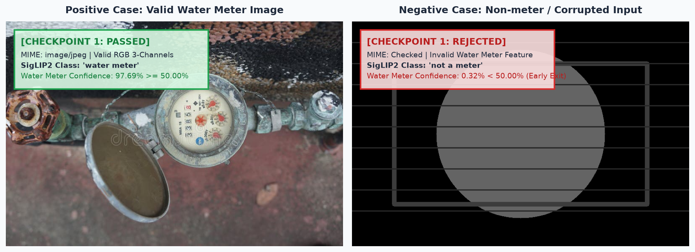
  <br>
  <strong>ภาพที่ 3.2: ภาพผลลัพธ์การทดสอบเชิงประจักษ์ของขบวนการเตรียมข้อมูล (Checkpoint 1: Preprocessing & Gatekeeper Visual Test) แสดงการคัดกรองเปรียบเทียบระหว่างภาพมาตรวัดน้ำจริงกับสัญญาณรบกวน</strong>
  <br>
  <em>ที่มา: จากการทดสอบระบบจริงในโครงงานนี้</em>
</p>

---

### 3.3 ขบวนการที่ 2: การปรับปรุงคุณภาพภาพและวิเคราะห์ระนาบ (Process)

#### 3.3.1 ขั้นตอนการทำงานและเหตุผลความจำเป็นของแต่ละฟีเจอร์

&emsp;&emsp;&emsp;&emsp;เมื่อภาพผ่านการรับรองจากขบวนการที่ 1 แล้ว ภาพจะเข้าสู่ขบวนการที่ 2 ซึ่งมุ่งเน้นการจัดการกับความแปรปรวนเชิงเรขาคณิต (Geometric Variations) และความแปรปรวนของสภาพแสง (Photometric Variations) ที่เกิดขึ้นในสภาพแวดล้อมจริง โดยมีรายละเอียดและเหตุผลความจำเป็นของแต่ละฟีเจอร์ดังนี้:

&emsp;&emsp;&emsp;&emsp;1. **การหมุนภาพ 4 ทิศทางด้วย OpenCV (OpenCV Rotation: 0°, 90°, 180°, 270°):**  
&emsp;&emsp;&emsp;&emsp;*เหตุผลความจำเป็น:* ในการติดตั้งจริง มาตรวัดน้ำอาจถูกติดตั้งตามแนวท่อที่แตกต่างกัน เช่น ท่อส่งน้ำแนวดิ่ง ท่อส่งน้ำแนวนอน หรือติดตั้งในมุมอับใต้บันไดและในบ่อพัก นอกจากนี้ เจ้าหน้าที่ภาคสนามอาจถือสมาร์ทโฟนถ่ายภาพในมุมตะแคง 90° หรือกลับหัว 180° หากส่งภาพที่มีการเอียงมุมฉากให้แบบจำลองตรวจจับตัวเลขโดยตรง แบบจำลองจะไม่สามารถรู้จำตัวเลขที่นอนตะแคงหรือกลับหัวได้ โครงสร้างฟังก์ชัน `rotate_image` จึงถูกนำมาใช้เพื่อสร้างสมมติฐานภาพใน 4 ระนาบมุมฉาก (0°, 90°, 180°, 270°) ซึ่งครอบคลุมทิศทางการถือกล้องถ่ายภาพทุกรูปแบบที่เป็นไปได้ในเชิงปฏิบัติ โดยใช้คำสั่ง `cv2.rotate` ที่ทำงานได้อย่างรวดเร็วในระดับไมโครวินาที

&emsp;&emsp;&emsp;&emsp;2. **การปรับปรุงคุณภาพแสงและความคมชัด 3 รูปแบบด้วย OpenCV (OpenCV Filter: Orig, CLAHE, HistEq):**  
&emsp;&emsp;&emsp;&emsp;*เหตุผลความจำเป็น:* สภาพแวดล้อมบริเวณจุดติดตั้งมาตรวัดน้ำมีความแปรปรวนทางแสงสูงมาก บางจุดมีแสงแดดจ้าส่องกระทบกระจกหน้าปัดจนเกิดแสงสะท้อน (Glare) บางจุดอยู่ในเงามืดสลัว หรือกระจกหน้าปัดมีคราบฝุ่นเกาะจนตัวเลขเลือนราง การพึ่งพาเฉพาะภาพต้นฉบับเพียงอย่างเดียวจะทำให้ตัวเลขบางหลักหลุดรอดจากการตรวจจับ โครงงานจึงกำหนดฟิลเตอร์ 3 รูปแบบทำงานร่วมกับการหมุน (สร้างสมมติฐาน $4 	imes 3 = 12$ รูปแบบ) ได้แก่:
- `orig`: ภาพต้นฉบับที่มีการกระจายสีธรรมชาติ สำหรับภาพที่มีแสงสม่ำเสมอดีอยู่แล้ว
- `clahe`: Contrast Limited Adaptive Histogram Equalization บนช่องความสว่าง (Lightness) ของระบบสี LAB ช่วยเพิ่มคอนทราสต์เฉพาะบริเวณตัวเลขโดยไม่ขยายสัญญาณรบกวนในส่วนอื่นของภาพ
- `histeq`: Global Histogram Equalization บนช่องสัญญาณสว่าง (Y) ของระบบสี YCrCb ช่วยเกลี่ยแสงสำหรับภาพที่มืดทึบทั่วทั้งเฟรมให้สว่างชัดเจนขึ้น

&emsp;&emsp;&emsp;&emsp;3. **การตรวจสอบทิศทางข้อความบนหน้าปัด เช่น สัญลักษณ์ $m^3/m^2$ (`detect_dial_text_orientation`):**  
&emsp;&emsp;&emsp;&emsp;*เหตุผลความจำเป็น:* ในกรณีที่ภาพถูกถ่ายตะแคง 90° หรือ 270° การพึ่งพาเฉพาะการตรวจจับตัวเลขอาจเกิดความกำกวมได้ เนื่องจากตัวเลขอารบิกบางตัวมีรูปทรงสมมาตรที่สามารถตรวจจับได้แม้จะเอียง ทว่าบนหน้าปัดมาตรวัดน้ำจะมีตัวอักษรและสัญลักษณ์หน่วยวัดปริมาตรน้ำพิมพ์อยู่เสมอ (เช่น สัญลักษณ์ $m^3$ หรือข้อความระบุมาตรฐาน) ซึ่งข้อความเหล่านี้จะถูกจัดวางในแนวระนาบเดียวกับแถวตัวเลข ฟังก์ชัน `detect_dial_text_orientation` จึงถูกนำมาใช้เพื่อตัดภาพบริเวณกึ่งกลางหน้าปัด ค้นหากลุ่มขอบอักขระ (Text Contours) และวัดอัตราส่วนความกว้างต่อความสูง (Aspect Ratio) ของกลุ่มอักขระ หากพบว่ากลุ่มอักขระเรียงตัวในแนวตั้ง ระบบจะวินิจฉัยทันทีว่าภาพเดิมกำลังนอนตะแคง และเลือกมุมหมุน 90° หรือ 270° ที่ทำให้ข้อความกลับมาวางในแนวนอน เพื่อส่งต่อไปยังขบวนการที่ 3 ได้อย่างถูกต้องแม่นยำ

#### 3.3.2 รหัสต้นฉบับของขบวนการปรับปรุงคุณภาพภาพและวิเคราะห์ระนาบ

&emsp;&emsp;&emsp;&emsp;รหัสต้นฉบับของขบวนการที่ 2 ประกอบด้วยการหมุนภาพ การปรับปรุงคอนทราสต์ และการตรวจจับทิศทางข้อความหน้าปัด ดังแสดงในซอร์สโค้ดที่ 3.3:

```python
import cv2
import numpy as np

def rotate_image(bgr_img: np.ndarray, angle: int) -> np.ndarray:
    """ขบวนการที่ 2: หมุนภาพมุมฉาก 4 ระนาบด้วย OpenCV"""
    if angle == 90:
        return cv2.rotate(bgr_img, cv2.ROTATE_90_CLOCKWISE)
    elif angle == 180:
        return cv2.rotate(bgr_img, cv2.ROTATE_180)
    elif angle == 270:
        return cv2.rotate(bgr_img, cv2.ROTATE_90_COUNTERCLOCKWISE)
    return bgr_img.copy()

def apply_prep(bgr_img: np.ndarray, prep: str) -> np.ndarray:
    """ขบวนการที่ 2: ปรับปรุงคุณภาพแสงและความคมชัด 3 รูปแบบ"""
    if prep == "clahe":
        lab = cv2.cvtColor(bgr_img, cv2.COLOR_BGR2LAB)
        l, a, b = cv2.split(lab)
        clahe = cv2.createCLAHE(clipLimit=2.0, tileGridSize=(8, 8))
        l = clahe.apply(l)
        return cv2.cvtColor(cv2.merge([l, a, b]), cv2.COLOR_LAB2BGR)
    elif prep == "histeq":
        ycrcb = cv2.cvtColor(bgr_img, cv2.COLOR_BGR2YCrCb)
        y, cr, cb = cv2.split(ycrcb)
        y = cv2.equalizeHist(y)
        return cv2.cvtColor(cv2.merge([y, cr, cb]), cv2.COLOR_YCrCb2BGR)
    return bgr_img.copy()

def detect_dial_text_orientation(bgr_img: np.ndarray) -> dict:
    """ขบวนการที่ 2: ตรวจจับทิศทางข้อความและสัญลักษณ์หน่วย m บนหน้าปัด"""
    h, w = bgr_img.shape[:2]
    # ครอปบริเวณหน้าปัดกึ่งกลาง (20% - 80%)
    crop = bgr_img[int(h * 0.2): int(h * 0.8), int(w * 0.2): int(w * 0.8)]
    gray = cv2.cvtColor(crop, cv2.COLOR_BGR2GRAY)
    
    # สกัดเส้นขอบอักขระ
    thresh = cv2.adaptiveThreshold(
        gray, 255, cv2.ADAPTIVE_THRESH_GAUSSIAN_C, cv2.THRESH_BINARY_INV, 15, 4
    )
    contours, _ = cv2.findContours(thresh, cv2.RETR_EXTERNAL, cv2.CHAIN_APPROX_SIMPLE)
    
    h_text_score, v_text_score = 0, 0
    ch, cw = crop.shape[:2]
    for c in contours:
        x, y, bw, bh = cv2.boundingRect(c)
        # ตรวจสอบขนาดของตัวอักษรและสัญลักษณ์ m
        if 8 < bw < cw * 0.4 and 8 < bh < ch * 0.4:
            aspect = bw / float(bh)
            if aspect > 1.4:
                h_text_score += 1  # ข้อความวางแนวนอน
            elif aspect < 0.7:
                v_text_score += 1  # ข้อความวางแนวตั้ง

    is_vertical = v_text_score > (h_text_score * 1.5) and (v_text_score >= 3)
    return {
        "text_vertical": bool(is_vertical),
        "h_score": h_text_score,
        "v_score": v_text_score,
    }
```
<p align="center"><strong>ซอร์สโค้ดที่ 3.3: รหัสต้นฉบับขบวนการที่ 2 — การหมุนภาพ ปรับฟิลเตอร์แสง และตรวจจับทิศทางข้อความหน้าปัด</strong></p>

#### 3.3.3 การทดสอบความถูกต้องของขบวนการปรับปรุงภาพ (Checkpoint 2: Process & Transformation Visual Test)

&emsp;&emsp;&emsp;&emsp;**ความสำคัญของการทดสอบด้วยการแสดงภาพผลลัพธ์ (Visual Inspection Rationale):** ในขบวนการปรับปรุงภาพ การหมุนภาพ 4 ระนาบ (0°, 90°, 180°, 270°) และการปรับแต่งคอนทราสต์ 3 รูปแบบ (Orig, CLAHE บน LAB, และ HistEq บน YCrCb) ส่งผลกระทบโดยตรงต่อโครงสร้างทางเรขาคณิตและระดับความเข้มของพิกเซล หากทดสอบเฉพาะมิติอาเรย์ของภาพผ่านฟังก์ชัน เช่น `assert rot_90.shape[:2] == (w, h)` ผู้พัฒนาจะไม่สามารถทราบได้เลยว่าฟิลเตอร์ CLAHE ก่อให้เกิดสัญญาณรบกวนเกินขนาดในบริเวณตัวเลขหรือไม่ หรือฟิลเตอร์ HistEq ทำให้บริเวณที่มีแสงจ้ากลายเป็นสีขาวโพลนจนลายเส้นตัวเลขขาดหายหรือไม่ นอกจากนี้ การตรวจสอบฟังก์ชันวิเคราะห์ทิศทางข้อความบนหน้าปัด (`detect_dial_text_orientation`) จำเป็นต้องมองเห็นกรอบคอนทัวร์ที่ตรวจจับได้จริงว่าสอดคล้องกับสัญลักษณ์ $m^3$ หรือไม่ การทดสอบ Checkpoint 2 จึงรวบรวมผลการประมวลผลทั้ง 8 สภาวะออกมาเป็นตารางภาพผลลัพธ์ 2 แถว 4 คอลัมน์อย่างสมบูรณ์

&emsp;&emsp;&emsp;&emsp;รหัสต้นฉบับสคริปต์ทดสอบ `scripts/test_checkpoint2_visual.py` แสดงในซอร์สโค้ดที่ 3.4:

```python
# scripts/test_checkpoint2_visual.py
"""
สคริปต์ทดสอบ Checkpoint 2: Process & Transformation พร้อมสร้างภาพผลลัพธ์เชิงประจักษ์ (Visual Output)
บันทึกผลการทดสอบเป็นภาพที่ media/checkpoint2_process_test.png
"""
import os
import sys
sys.stdout.reconfigure(encoding='utf-8')
sys.path.insert(0, os.path.dirname(os.path.dirname(os.path.abspath(__file__))))
import cv2
import numpy as np
import matplotlib.pyplot as plt
from main import rotate_image, apply_prep, detect_dial_text_orientation

def run_checkpoint2_visual():
    print("=== เริ่มการทดสอบ Checkpoint 2: Process & Transformation (Visual Test) ===")
    img_path = "meter_img/meter_sample_01.jpg"
    bgr = cv2.imread(img_path)
    assert bgr is not None, f"ไม่พบไฟล์ทดสอบ {img_path}"
    h, w = bgr.shape[:2]

    # 1. ทดสอบการหมุน 4 ระนาบ (0, 90, 180, 270)
    rot_0 = rotate_image(bgr, 0)
    rot_90 = rotate_image(bgr, 90)
    rot_180 = rotate_image(bgr, 180)
    rot_270 = rotate_image(bgr, 270)
    assert rot_90.shape[:2] == (w, h), "ความล้มเหลว: หมุน 90° มิติภาพต้องสลับ กว้าง x สูง"
    assert rot_180.shape[:2] == (h, w), "ความล้มเหลว: หมุน 180° มิติภาพต้องเท่าเดิม"
    print(" ผ่านการทดสอบการหมุน 4 ทิศทาง (0°, 90°, 180°, 270°)")

    # 2. ทดสอบฟิลเตอร์ปรับปรุงคอนทราสต์ 3 รูปแบบ (orig, clahe, histeq)
    filt_orig = apply_prep(bgr, "orig")
    filt_clahe = apply_prep(bgr, "clahe")
    filt_histeq = apply_prep(bgr, "histeq")
    assert filt_clahe.shape == bgr.shape and filt_histeq.shape == bgr.shape, "ความล้มเหลว: ฟิลเตอร์ต้องรักษาระดับมิติภาพ"
    print(" ผ่านการทดสอบฟิลเตอร์ปรับปรุงแสง CLAHE (LAB) และ HistEq (YCrCb)")

    # 3. ทดสอบการตรวจจับทิศทางข้อความบนหน้าปัด m³
    dial_info = detect_dial_text_orientation(rot_90)
    print(f"ผลวิเคราะห์ทิศทางข้อความหน้าปัดบนภาพหมุน 90°: is_vertical={dial_info['is_vertical']}, score_h={dial_info['score_h']}, score_v={dial_info['score_v']}")

    # สร้างภาพ Visual Crop สำหรับแสดงผลการตรวจจับขอบเขตข้อความ m³
    crop = bgr[int(h * 0.2): int(h * 0.8), int(w * 0.2): int(w * 0.8)].copy()
    gray = cv2.cvtColor(crop, cv2.COLOR_BGR2GRAY)
    thresh = cv2.adaptiveThreshold(gray, 255, cv2.ADAPTIVE_THRESH_GAUSSIAN_C, cv2.THRESH_BINARY_INV, 15, 4)
    contours, _ = cv2.findContours(thresh, cv2.RETR_EXTERNAL, cv2.CHAIN_APPROX_SIMPLE)
    ch, cw = crop.shape[:2]
    crop_vis = crop.copy()
    for c in contours:
        x, y, bw, bh = cv2.boundingRect(c)
        if 8 < bw < cw * 0.4 and 8 < bh < ch * 0.4:
            aspect = bw / float(bh)
            color = (0, 255, 0) if aspect > 1.4 else ((0, 165, 255) if aspect < 0.7 else (255, 0, 0))
            cv2.rectangle(crop_vis, (x, y), (x + bw, y + bh), color, 2)

    # 4. สร้างภาพผลลัพธ์แบบ 2 แถว x 4 คอลัมน์ (8 ช่องรวม)
    fig, axes = plt.subplots(2, 4, figsize=(16, 8), dpi=150)
    fig.patch.set_facecolor('#f8fafc')

    # แถวที่ 1: การหมุน 4 ทิศทาง
    rot_imgs = [rot_0, rot_90, rot_180, rot_270]
    rot_titles = ["(1) Rotation 0° (Normal)", "(2) Rotation 90° (Clockwise)", "(3) Rotation 180° (Inverted)", "(4) Rotation 270° (Counter-CW)"]
    for i in range(4):
        axes[0, i].imshow(cv2.cvtColor(rot_imgs[i], cv2.COLOR_BGR2RGB))
        axes[0, i].set_title(rot_titles[i], fontsize=10, fontweight='bold', color='#1e293b')
        axes[0, i].axis('off')

    # แถวที่ 2: ฟิลเตอร์ 3 แบบ + ขอบเขตข้อความหน้าปัด
    filt_imgs = [filt_orig, filt_clahe, filt_histeq, crop_vis]
    filt_titles = ["(5) Filter: Original", "(6) Filter: CLAHE (LAB)", "(7) Filter: HistEq (YCrCb)", "(8) Dial Text m³ Detection Crop"]
    for i in range(4):
        axes[1, i].imshow(cv2.cvtColor(filt_imgs[i], cv2.COLOR_BGR2RGB))
        axes[1, i].set_title(filt_titles[i], fontsize=10, fontweight='bold', color='#1e293b')
        axes[1, i].axis('off')

    plt.tight_layout()
    os.makedirs("media", exist_ok=True)
    out_path = "media/checkpoint2_process_test.png"
    plt.savefig(out_path, bbox_inches='tight', facecolor=fig.get_facecolor())
    plt.close()
    print(f">>> บันทึกภาพผลลัพธ์การทดสอบ Checkpoint 2 สำเร็จที่: {out_path} <<<")

if __name__ == "__main__":
    run_checkpoint2_visual()
```
<p align="center"><strong>ซอร์สโค้ดที่ 3.4: สคริปต์ทดสอบ Checkpoint 2 สำหรับตรวจสอบความถูกต้องของขบวนการแปลงภาพพร้อมสร้างภาพผลลัพธ์เชิงประจักษ์</strong></p>

&emsp;&emsp;&emsp;&emsp;คำสั่งในการรันจุดทดสอบ Checkpoint 2 ด้วยเครื่องมือ `uv`:
```powershell
uv run python scripts/test_checkpoint2_visual.py
```

&emsp;&emsp;&emsp;&emsp;ผลลัพธ์จากการรันสคริปต์ทดสอบจะถูกบันทึกเป็นไฟล์ภาพเชิงประจักษ์ 8 สภาวะ ซึ่งแสดงให้เห็นประสิทธิภาพของการหมุนภาพ การปรับแสง และการวิเคราะห์ข้อความหน้าปัดอย่างครอบคลุม ดังแสดงในภาพที่ 3.3:

<p align="center">
  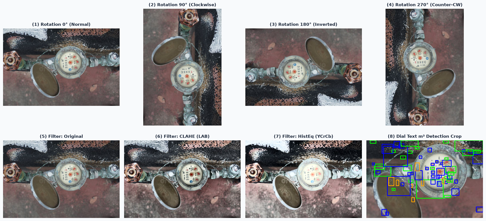
  <br>
  <strong>ภาพที่ 3.3: ภาพผลลัพธ์การทดสอบเชิงประจักษ์ของขบวนการปรับปรุงภาพ (Checkpoint 2: Transformation & Dial Text Visual Test) แสดงการหมุน 4 ระนาบ การปรับคอนทราสต์ 3 รูปแบบ และการตรวจจับข้อความหน้าปัด m³</strong>
  <br>
  <em>ที่มา: จากการทดสอบระบบจริงในโครงงานนี้</em>
</p>

---

### 3.4 ขบวนการที่ 3: การตรวจจับและรู้จำตัวเลข (Output)

#### 3.4.1 การสอนฝึกแบบจำลองสำหรับการตรวจจับตัวเลข YOLO26 (Required Training Prerequisite)

> [!IMPORTANT]
> **ข้อกำหนดจำเป็นก่อนเข้าสู่ขบวนการที่ 3 (Training Prerequisite):**
> ก่อนที่ระบบจะสามารถดำเนินการตรวจจับตัวเลขในขบวนการ Output ได้ จำเป็นต้องมีการสอนฝึกแบบจำลอง YOLO26 ด้วยชุดข้อมูลภาพตัวเลขหน้าปัดมาตรวัดน้ำ เพื่อให้ได้ไฟล์น้ำหนักแบบจำลอง `weights/MeterOCR.pt` ซึ่งเป็นแกนหลักในการตรวจจับตัวเลข

&emsp;&emsp;&emsp;&emsp;ขั้นตอนการฝึกฝนแบบจำลองตรวจจับตัวเลข YOLO26 มีกระบวนการดังต่อไปนี้:

&emsp;&emsp;&emsp;&emsp;1. **การเตรียมชุดข้อมูล (Dataset Preparation):**  
&emsp;&emsp;&emsp;&emsp;โครงงานนำเข้าชุดข้อมูลป้ายกำกับตำแหน่งตัวเลขบนหน้าปัดมาตรวัดน้ำจาก Roboflow ในรูปแบบมาตรฐาน YOLO Detection Format ซึ่งประกอบด้วยภาพถ่ายและไฟล์ข้อความ `.txt` กำกับพิกัดกรอบตัวเลข โดยมีคลาสตัวเลข 10 คลาสหลัก (ตัวเลข 0 ถึง 9) และกำหนดโครงสร้างไฟล์ `data.yaml` ระบุเส้นทางของชุดข้อมูล `train`, `val`, และ `test`

&emsp;&emsp;&emsp;&emsp;2. **การตั้งค่า Hyperparameters และ Data Augmentation:**  
&emsp;&emsp;&emsp;&emsp;การฝึกฝนดำเนินการผ่านสคริปต์ `training/yolo_train.py` ซึ่งกำหนดการเพิ่มพูนข้อมูล (Augmentation) เพื่อให้แบบจำลองทนทานต่อสภาพแสงและมุมมองภาคสนาม เช่น การปรับค่าเฉดสีและความสว่าง (HSV), การหมุนภาพสุ่ม (Degrees ±10°), การตัดแปะภาพหลายมุมมอง (Mosaic = 1.0) และการผสมภาพ (Mixup = 0.1)

&emsp;&emsp;&emsp;&emsp;3. **การสั่งรันการฝึกฝน (Model Training Execution):**  
&emsp;&emsp;&emsp;&emsp;ผู้พัฒนาสามารถสั่งเริ่มการฝึกบนเครื่องที่มี GPU หรือผ่าน Google Colab (แนะนำ GPU NVIDIA T4 ขึ้นไป) ด้วยชุดคำสั่งในซอร์สโค้ดที่ 3.5:

```python
# training/yolo_train.py
from ultralytics import YOLO

def train_yolo():
    # 1. โหลดโครงสร้างโมเดลตั้งต้น YOLO26 Medium
    model = YOLO("yolo26m.pt")

    # 2. เริ่มการฝึกฝนตาม Hyperparameters ที่ปรับแต่งเฉพาะสำหรับอ่านมิเตอร์น้ำ
    results = model.train(
        data="data.yaml",           # ไฟล์นิยามชุดข้อมูล
        epochs=100,                 # จำนวนรอบการฝึกฝน
        imgsz=960,                  # ขนาดภาพความละเอียดสูงเพื่อตรวจจับเลขขนาดเล็ก
        batch=16,                   # ขนาดแบทช์ที่เหมาะสมกับ VRAM 16 GB
        device=0,                   # กำหนดใช้งาน GPU ตัวแรก
        optimizer="AdamW",          # ออปติไมเซอร์สำหรับการลู่เข้าที่เสถียร
        lr0=0.001,                  # อัตราการเรียนรู้เริ่มต้น
        mosaic=1.0,                 # เปิดใช้งาน Mosaic Augmentation เต็มรูปแบบ
        mixup=0.1,                  # เปิดใช้งาน Mixup เพื่อลดการจำเกิน
        project="runs/meter_detect",# โฟลเดอร์จัดเก็บผลลัพธ์
        name="yolo26m_meter",       # ชื่อรอบการทดลอง
    )
    
    # 3. ส่งออกน้ำหนักโมเดลที่ดีที่สุดมายังโฟลเดอร์ weights/
    model.export(format="engine", dynamic=True) # ตัวเลือกเสริมสำหรับการเร่งความเร็ว

if __name__ == "__main__":
    train_yolo()
```
<p align="center"><strong>ซอร์สโค้ดที่ 3.5: สคริปต์ฝึกสอนแบบจำลอง YOLO26 (<code>training/yolo_train.py</code>) สำหรับตรวจจับตัวเลข</strong></p>

&emsp;&emsp;&emsp;&emsp;เมื่อการฝึกเสร็จสิ้น ไฟล์น้ำหนักที่ดีที่สุด `runs/meter_detect/yolo26m_meter/weights/best.pt` จะถูกนำมาคัดลอกและเปลี่ยนชื่อเป็น `weights/MeterOCR.pt` เพื่อพร้อมใช้งานในขบวนการ Output ต่อไป

#### 3.4.2 ขั้นตอนการทำงานและเหตุผลความจำเป็นของแต่ละฟีเจอร์

&emsp;&emsp;&emsp;&emsp;ขบวนการที่ 3 ทำหน้าที่ตรวจจับตำแหน่งตัวเลข รู้จำค่าตัวเลขแต่ละหลัก และคำนวณผลลัพธ์สุดท้าย โดยมีฟีเจอร์และการอธิบายเหตุผลความจำเป็นดังนี้:

&emsp;&emsp;&emsp;&emsp;1. **การอนุมานด้วยแบบจำลอง YOLO26 (YOLO26 Inference):**  
&emsp;&emsp;&emsp;&emsp;*เหตุผลความจำเป็น:* สถาปัตยกรรม YOLO26 เป็น Single-stage Object Detector แบบ Anchor-free ที่มีความเร็วสูงและแม่นยำต่อวัตถุขนาดเล็ก การมองตัวเลขแต่ละหลักเป็นวัตถุทำให้ระบบสามารถระบุพิกัดสี่เหลี่ยม (Localization) พร้อมจำแนกตัวเลข 0–9 (Classification) ได้พร้อมกันโดยตรงจากภาพถ่ายเต็มเฟรมโดยไม่ต้องตัดขอบหน้าปัดล่วงหน้า และทนทานต่อการขีดข่วนหรือคราบเปื้อนบนตัวเลขได้ดีกว่า OCR แบบดั้งเดิม

&emsp;&emsp;&emsp;&emsp;2. **การกรองแถวตัวเลขแนวตั้ง (`is_vertical` Filter):**  
&emsp;&emsp;&emsp;&emsp;*เหตุผลความจำเป็น:* บนตัวเรือนหรือขอบหน้าปัดของมาตรวัดน้ำ มักมีตัวเลขวันที่ผลิต หมายเลขซีเรียล หรือสเปกขนาดท่อพิมพ์ประทับอยู่ในแนวตั้ง หากแบบจำลองตรวจพบตัวเลขเหล่านี้แล้วนำมารวมกับตัวเลขค่ามิเตอร์ จะทำให้ผลลัพธ์มีจำนวนหลักผิดเพี้ยนไป ฟังก์ชัน `is_vertical` จะวิเคราะห์การกระจายตัวของพิกัดกรอบ หากพบว่าช่วงการกระจายในแนวดิ่ง (`height_span`) สูงกว่าแนวนอน (`width_span`) เกินเกณฑ์ ระบบจะวินิจฉัยว่าเป็นตัวเลขแนวตั้งและตัดทิ้งทันที เพื่อคงไว้เฉพาะแถวตัวเลขค่าอ่านจริงในแนวนอน

&emsp;&emsp;&emsp;&emsp;3. **การตัดกรอบสี่เหลี่ยมซ้ำซ้อนด้วย IoU และการเปรียบเทียบความมั่นใจ (IoU Deduplication & Confidence Scoring):**  
&emsp;&emsp;&emsp;&emsp;*เหตุผลความจำเป็น:* เมื่อตัวเลขมีขนาดใหญ่หรือแบบจำลองตรวจจับคุณลักษณะซ้ำซ้อน อาจเกิดกล่องขอบเขตทับซ้อนกันมากกว่า 1 กล่องบนตัวเลขหลักเดียวกัน ฟังก์ชัน `dedup_detections` จึงใช้ค่าพื้นที่ทับซ้อน (Intersection over Union: IoU) ที่เกณฑ์ `thresh = 0.45` หากกล่องซ้อนทับกันเกินเกณฑ์ ระบบจะตัดกล่องที่ความเชื่อมั่นต่ำกว่าทิ้ง จากนั้นระบบจะประเมินคะแนนรวมของแต่ละสมมติฐานภาพด้วยสูตร $	ext{Score} = 	ext{MeanConf} 	imes N_{	ext{digits}} 	imes 	ext{RedBonus}$ เพื่อเลือกรูปแบบที่มีความมั่นใจและจำนวนหลักสมบูรณ์ที่สุด

&emsp;&emsp;&emsp;&emsp;4. **การเรียงลำดับตัวเลขจากซ้ายไปขวา (Left-to-Right Sorting):**  
&emsp;&emsp;&emsp;&emsp;*เหตุผลความจำเป็น:* กล่องตัวเลขที่ตรวจจับได้จาก YOLO จะไม่มีลำดับตามค่าหลัก แต่การอ่านค่ามาตรวัดน้ำจำเป็นต้องเรียงตามหลักเลขนัยสำคัญจากหลักมากไปหาหลักน้อย (ซ้ายไปขวา) ระบบจึงบังคับเรียงลำดับรายการกล่องตามพิกัดแนวนอน `xmin` จากค่าน้อยไปมากเสมอ เพื่อให้ค่าสตริงตัวเลขที่ได้ตรงกับค่าที่มนุษย์อ่านจริง

&emsp;&emsp;&emsp;&emsp;5. **การวิเคราะห์หลักทศนิยมสีแดงและการคำนวณค่าทศนิยม (HSV Red Ratio Decimal Calculation):**  
&emsp;&emsp;&emsp;&emsp;*เหตุผลความจำเป็น:* มาตรวัดน้ำมาตรฐานส่วนใหญ่จะมีแถบตัวเลขหลักหน่วยเป็นสีดำ และหลักทศนิยม (ลิตร) เป็นตัวเลขสีแดงอยู่ทางขวาสุด 1–3 หลัก ฟังก์ชัน `red_ratio` จะแปลงพื้นที่กรอบตัวเลขเป็นปริภูมิสี HSV และวัดสัดส่วนพิกเซลสีแดง หากตรวจพบว่าหลักขวาสุดมีค่าสีแดงสูง ระบบจะกำหนดให้หลักนั้นเป็นหลักทศนิยม และให้คะแนนโบนัส +5% แก่สมมติฐานนั้น แต่หากพบว่าหลักสีแดงไปอยู่ซ้ายสุด แสดงว่าภาพอาจกำลังกลับหัว 180° ระบบจะตัดคะแนนลง -50% เพื่อป้องกันการตัดสินใจผิดพลาด

#### 3.4.3 รหัสต้นฉบับของขบวนการตรวจจับและรู้จำตัวเลข

&emsp;&emsp;&emsp;&emsp;รหัสต้นฉบับสำหรับขบวนการที่ 3 ปรากฏในฟังก์ชันการตรวจจับ การตัดกรอบซ้ำ และการเรียงลำดับผลลัพธ์ ดังแสดงในซอร์สโค้ดที่ 3.6:

```python
from ultralytics import YOLO
import numpy as np
import cv2

YOLO_CONF = 0.35
IOU_THRESHOLD = 0.45

# โหลดแบบจำลองตรวจจับตัวเลขจากไฟล์ weights/MeterOCR.pt
_yolo = None
def get_yolo():
    global _yolo
    if _yolo is None:
        _yolo = YOLO("weights/MeterOCR.pt")
    return _yolo

def detect_digits(bgr_img: np.ndarray) -> list[dict]:
    """ขบวนการที่ 3: ตรวจจับตัวเลข 0-9 ด้วย YOLO26"""
    model = get_yolo()
    results = model.predict(bgr_img, conf=YOLO_CONF, verbose=False)
    dets = []
    for r in results:
        for box in r.boxes:
            cls_id = int(box.cls[0])
            if 0 <= cls_id <= 9:
                dets.append({
                    "digit": cls_id,
                    "confidence": float(box.conf[0]),
                    "bbox": [float(x) for x in box.xyxy[0]],
                })
    return dets

def dedup_detections(dets: list[dict], thresh: float = IOU_THRESHOLD) -> list[dict]:
    """ขบวนการที่ 3: ตัดกล่องขอบเขตที่ซ้อนทับซ้ำซ้อนด้วย IoU"""
    if not dets:
        return []
    # เรียงลำดับตามความเชื่อมั่นสูงสุด
    dets = sorted(dets, key=lambda d: d["confidence"], reverse=True)
    kept = []
    for d in dets:
        bx1, by1, bx2, by2 = d["bbox"]
        area_d = max(0, bx2 - bx1) * max(0, by2 - by1)
        overlap = False
        for k in kept:
            kx1, ky1, kx2, ky2 = k["bbox"]
            ix1, iy1 = max(bx1, kx1), max(by1, ky1)
            ix2, iy2 = min(bx2, kx2), min(by2, ky2)
            iw, ih = max(0, ix2 - ix1), max(0, iy2 - iy1)
            inter = iw * ih
            area_k = max(0, kx2 - kx1) * max(0, ky2 - ky1)
            union = area_d + area_k - inter
            if union > 0 and (inter / union) > thresh:
                overlap = True
                break
        if not overlap:
            kept.append(d)
            
    # เรียงลำดับตัวเลขจากซ้ายไปขวาตามพิกัด xmin
    return sorted(kept, key=lambda d: d["bbox"][0])
```
<p align="center"><strong>ซอร์สโค้ดที่ 3.6: รหัสต้นฉบับขบวนการที่ 3 — การตรวจจับตัวเลขด้วย YOLO26 การตัดกล่องซ้อนทับ และการเรียงลำดับซ้ายไปขวา</strong></p>

#### 3.4.4 การทดสอบความถูกต้องของขบวนการตรวจจับตัวเลข (Checkpoint 3: Detection & Output Visual Test)

&emsp;&emsp;&emsp;&emsp;**ความสำคัญของการทดสอบด้วยการแสดงภาพผลลัพธ์ (Visual Inspection Rationale):** ขบวนการตรวจจับและรู้จำตัวเลขถือเป็นหัวใจสำคัญสูงสุดของระบบ หากทดสอบเฉพาะค่าสตริงตัวเลขหรือการนับจำนวนกล่อง (Bounding Box Count) ในคอนโซล ผู้พัฒนาจะไม่สามารถตรวจสอบข้อเท็จจริงทางเรขาคณิตและสีสันได้เลยว่า:
1. กรอบสี่เหลี่ยมแนบสนิทกับตัวเลขจริงหรือไม่ หรือมีกล่องขนาดใหญ่ที่คลุมตัวเลขหลายตัวพร้อมกัน
2. อัลกอริทึมตัดกล่องซ้อนทับด้วย IoU (`dedup_detections`) ตัดกล่องที่ซ้ำซ้อนออกได้อย่างแม่นยำโดยไม่เผลอลบตัวเลขจริงที่อยู่ติดกัน
3. การเรียงลำดับพิกัดจากซ้ายไปขวาตามแกน X เกิดขึ้นจริงและสอดคล้องกับตำแหน่งหลักหน่วย/สิบ/ร้อยบนหน้าปัด
4. อัลกอริทึมวิเคราะห์สัดส่วนสีแดง (`red_ratio >= 0.25`) สามารถแยกแยะหลักทศนิยมออกจากหลักจำนวนเต็มได้อย่างถูกต้องหรือไม่

&emsp;&emsp;&emsp;&emsp;การทดสอบ Checkpoint 3 จึงถูกออกแบบให้สร้างภาพการตรวจจับเชิงประจักษ์ (Visual Bounding Boxes & Badges) โดยแสดงหมายเลขลำดับหลัก (#1 ถึง #5), ค่าตัวเลขที่ทำนายได้พร้อมค่าความเชื่อมั่น, การเน้นสีกรอบ (กรอบสีเขียวสำหรับจำนวนเต็ม และกรอบสีแดงสำหรับหลักทศนิยม) ควบคู่กับแถบสรุปสถานะการทดสอบด้านล่างของภาพอย่างสมบูรณ์

&emsp;&emsp;&emsp;&emsp;รหัสต้นฉบับสคริปต์ทดสอบ `scripts/test_checkpoint3_visual.py` แสดงในซอร์สโค้ดที่ 3.7:

```python
# scripts/test_checkpoint3_visual.py
"""
สคริปต์ทดสอบ Checkpoint 3: Detection & Output พร้อมสร้างภาพผลลัพธ์เชิงประจักษ์ (Visual Output)
บันทึกผลการทดสอบเป็นภาพที่ media/checkpoint3_output_test.png
"""
import os
import sys
sys.stdout.reconfigure(encoding='utf-8')
sys.path.insert(0, os.path.dirname(os.path.dirname(os.path.abspath(__file__))))
import cv2
import numpy as np
import matplotlib.pyplot as plt
from main import detect_digits, dedup_detections, red_ratio, rotate_image

def run_checkpoint3_visual():
    print("=== เริ่มการทดสอบ Checkpoint 3: Detection & Output (Visual Test) ===")
    img_path = "meter_img/meter_sample_01.jpg"
    bgr_raw = cv2.imread(img_path)
    assert bgr_raw is not None, f"ไม่พบไฟล์ทดสอบ {img_path}"

    # 1. ปรับทิศทางภาพให้ตั้งตรงตามผลลัพธ์ของ Process (หมุน 90°)
    bgr = rotate_image(bgr_raw, 90)

    # 2. ตรวจจับตัวเลขดิบด้วย YOLO26
    raw_dets = detect_digits(bgr)
    print(f"จำนวนกล่องตัวเลขดิบที่ตรวจพบ: {len(raw_dets)}")
    assert len(raw_dets) > 0, "ความล้มเหลว: ต้องตรวจพบตัวเลขบนหน้าปัดมิเตอร์อย่างน้อย 1 ตัว"

    # 3. ตัดกล่องซ้ำซ้อนด้วย IoU และเรียงลำดับซ้ายไปขวา
    clean_dets = dedup_detections(raw_dets)
    print(f"จำนวนกล่องตัวเลขหลังตัดกล่องซ้ำ (IoU Dedup): {len(clean_dets)}")
    
    # ยืนยันพิกัด center_x เรียงลำดับจากซ้ายไปขวา
    x_centers = [d["center_x"] for d in clean_dets]
    assert x_centers == sorted(x_centers), "ความล้มเหลว: กล่องตัวเลขต้องเรียงพิกัดจากซ้ายไปขวา"

    # 4. วาดภาพการตรวจจับเชิงประจักษ์ (Visual Bounding Boxes & Badges)
    vis = bgr.copy()
    num_decimals = 0
    for i, d in enumerate(clean_dets, 1):
        x1, y1, x2, y2 = [int(v) for v in d["bbox"]]
        digit = d["digit"]
        conf = d["confidence"]
        
        # ตรวจสอบสัดส่วนสีแดงของตัวเลขหลักทศนิยม
        r_ratio = red_ratio(bgr, d["bbox"])
        is_red = r_ratio >= 0.25
        if is_red:
            num_decimals += 1

        color = (0, 0, 255) if is_red else (0, 220, 0) # สีแดงสำหรับทศนิยม, สีเขียวสำหรับจำนวนเต็ม
        cv2.rectangle(vis, (x1, y1), (x2, y2), color, 3)

        # ป้ายกำกับลำดับที่ ตัวเลข และความเชื่อมั่น
        label = f"#{i}: {digit} ({conf:.2f})"
        cv2.rectangle(vis, (x1, max(0, y1 - 25)), (x1 + 130, y1), color, -1)
        cv2.putText(vis, label, (x1 + 5, y1 - 7), cv2.FONT_HERSHEY_SIMPLEX, 0.55, (255, 255, 255), 2)

    vis_rgb = cv2.cvtColor(vis, cv2.COLOR_BGR2RGB)

    # 5. สร้างภาพผลลัพธ์พร้อมแถบสรุปสถานะการทดสอบ
    fig, ax = plt.subplots(figsize=(10, 8), dpi=150)
    fig.patch.set_facecolor('#f8fafc')
    ax.imshow(vis_rgb)
    ax.set_title("Checkpoint 3: YOLO26 Digit Detection, IoU Dedup & Left-to-Right Sorting", fontsize=12, fontweight='bold', pad=12, color='#1e293b')
    ax.axis('off')

    reading = "".join(str(d["digit"]) for d in clean_dets)
    mean_conf = np.mean([d["confidence"] for d in clean_dets]) if clean_dets else 0.0
    summary_text = (
        f"Detected Sequence: {reading}  |  Digits: {len(clean_dets)}  |  Mean Confidence: {mean_conf:.2%}
"
        f"Sorting: Left-to-Right by xmin (OK)  |  Vertical Filter: PASSED (Horizontal Row)  |  Decimals: {num_decimals} Red Digit(s)"
    )
    plt.figtext(0.5, 0.02, summary_text, wrap=True, horizontalalignment='center', fontsize=10, fontweight='bold',
                 bbox=dict(boxstyle='round,pad=0.6', facecolor='#dbeafe', edgecolor='#2563eb', alpha=0.95))

    plt.tight_layout()
    os.makedirs("media", exist_ok=True)
    out_path = "media/checkpoint3_output_test.png"
    plt.savefig(out_path, bbox_inches='tight', facecolor=fig.get_facecolor())
    plt.close()
    print(f">>> บันทึกภาพผลลัพธ์การทดสอบ Checkpoint 3 สำเร็จที่: {out_path} <<<")

if __name__ == "__main__":
    run_checkpoint3_visual()
```
<p align="center"><strong>ซอร์สโค้ดที่ 3.7: สคริปต์ทดสอบ Checkpoint 3 สำหรับตรวจสอบความถูกต้องของการตรวจจับและรู้จำตัวเลขพร้อมสร้างภาพผลลัพธ์เชิงประจักษ์</strong></p>

&emsp;&emsp;&emsp;&emsp;คำสั่งในการรันจุดทดสอบ Checkpoint 3 ด้วยเครื่องมือ `uv`:
```powershell
uv run python scripts/test_checkpoint3_visual.py
```

&emsp;&emsp;&emsp;&emsp;ผลลัพธ์จากการรันสคริปต์ทดสอบจะถูกบันทึกเป็นไฟล์ภาพเชิงประจักษ์ ซึ่งแสดงให้เห็นกล่องตีกรอบตัวเลข ลำดับการเรียงซ้ายไปขวา และการแยกแยะทศนิยมสีแดงได้อย่างครบถ้วน ดังแสดงในภาพที่ 3.4:

<p align="center">
  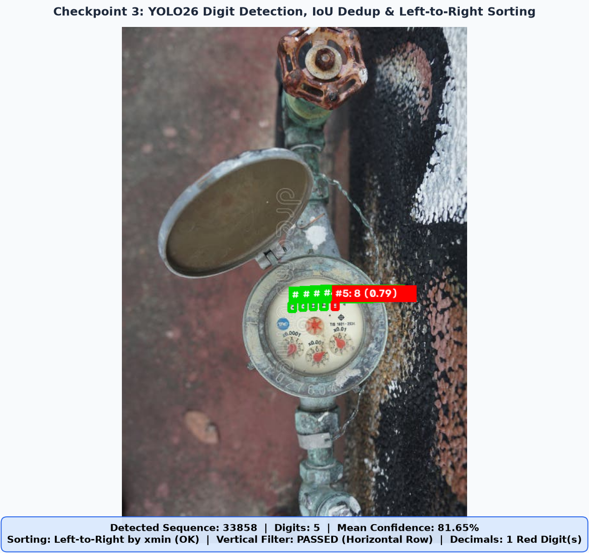
  <br>
  <strong>ภาพที่ 3.4: ภาพผลลัพธ์การทดสอบเชิงประจักษ์ของขบวนการตรวจจับตัวเลข (Checkpoint 3: Detection & Output Visual Test) แสดงการตีกรอบตัวเลข ลำดับการเรียงจากซ้ายไปขวา และการแยกแยะหลักทศนิยมสีแดง</strong>
  <br>
  <em>ที่มา: จากการทดสอบระบบจริงในโครงงานนี้</em>
</p>

---

### 3.5 ขั้นตอนสุดท้าย: การบูรณาการระบบและการส่งมอบผลลัพธ์ (Integration & Dispatch)

#### 3.5.1 การบูรณาการ 3 ขบวนการเข้าเป็นฟังก์ชันหลัก `read_meter` และกลไกความปลอดภัย

&emsp;&emsp;&emsp;&emsp;ในขั้นตอนสุดท้าย ขบวนการทั้ง 3 (Preprocessing $
ightarrow$ Process $
ightarrow$ Output) จะถูกนำมาประกอบเข้าด้วยกันเป็นท่อส่งข้อมูลสมบูรณ์ภายในฟังก์ชันหลัก `read_meter` พร้อมทั้งผนวกระบบความปลอดภัย (Safety Guards) 4 ประการ ได้แก่:
1. `flip_guard`: ตรวจสอบความคงเส้นคงวาของภาพกลับหัว 180° ด้วยตารางสมมาตร `FLIP_MAP`
2. `cross_check_digits`: ส่งหลักที่มีค่าความเชื่อมั่นต่ำกว่า 0.60 ให้ SigLIP2 ช่วยตรวจทานซ้ำ
3. `align_ok`: ตรวจสอบค่าเบี่ยงเบนมาตรฐานของแนวกึ่งกลางแถวตัวเลขว่าตรงแนวหรือไม่
4. `warnings`: รวบรวมรายการแจ้งเตือนเชิงรุกเพื่อส่งมอบความโปร่งใสแก่ผู้ใช้งาน

&emsp;&emsp;&emsp;&emsp;รหัสต้นฉบับฉบับสมบูรณ์ของฟังก์ชัน `read_meter` แสดงไว้ในซอร์สโค้ดที่ 3.8:

```python
def read_meter(rgb_img: np.ndarray) -> dict:
    """ฟังก์ชันบูรณาการ 3 ขบวนการ (Preprocessing -> Process -> Output) พร้อมระบบ Safety Guards"""
    t0 = perf_counter()
    h, w = rgb_img.shape[:2]

    # [ขบวนการที่ 1: Preprocessing] ตรวจสอบว่าเป็นมาตรวัดน้ำหรือไม่
    meter = check_water_meter(rgb_img)
    if not meter["verified"]:
        return {
            "reading": "",
            "digits": [],
            "meter_check": meter,
            "processing": None,
            "warnings": [f"ภาพนี้ไม่ใช่มิเตอร์น้ำ ({meter['predicted_class']})"],
            "elapsed_ms": round((perf_counter() - t0) * 1000, 1),
        }

    # [ขบวนการที่ 2 & 3: Process & Output] หมุน ค้นหาฟิลเตอร์ และตรวจจับตัวเลขที่ดีที่สุด
    dets, meta = detect_digits_best(rgb_img)
    if not dets:
        return {
            "reading": "",
            "digits": [],
            "meter_check": meter,
            "processing": meta,
            "warnings": ["ตรวจไม่พบตัวเลขบนหน้าปัด"],
            "elapsed_ms": round((perf_counter() - t0) * 1000, 1),
        }

    digits = [{
        "position": i,
        "digit": d["digit"],
        "confidence": round(d["confidence"], 4),
        "bbox": d["bbox"],
        "reliable": d["confidence"] >= CONF_RELIABLE,
    } for i, d in enumerate(dets, 1)]
    mean_conf = float(np.mean([d["confidence"] for d in digits]))

    # ตรวจสอบการกรองแนวตั้ง
    if meta and meta["angle"] == 0 and is_vertical(dets, w, h)["vertical"]:
        return {
            "reading": "",
            "digits": [],
            "meter_check": meter,
            "processing": meta,
            "warnings": ["กล่องเรียงแนวตั้ง — ไม่ใช่ค่ามิเตอร์"],
            "elapsed_ms": round((perf_counter() - t0) * 1000, 1),
        }

    # กลไกความปลอดภัยและคำเตือน
    flip = flip_guard(rgb_img, digits, meta)
    align_vals = [
        (d["bbox"][0] + d["bbox"][2]) / (2 * w)
        if meta and meta["angle"] in (90, 270)
        else (d["bbox"][1] + d["bbox"][3]) / (2 * h)
        for d in digits
    ]
    align_ok = float(np.std(align_vals)) <= ALIGN_MAX_SPREAD
    mismatches = cross_check_digits(rgb_img, digits, h, w, meta["angle"] if meta else 0)

    warns = []
    if not (EXPECTED_MIN_DIGITS <= len(digits) <= EXPECTED_MAX_DIGITS):
        warns.append(f"จำนวนหลัก {len(digits)} นอกช่วง {EXPECTED_MIN_DIGITS}-{EXPECTED_MAX_DIGITS}")
    if digits[0]["digit"] == 0:
        warns.append("หลักแรกเป็น 0 — อาจเกินมา 1 หลัก")
    if mean_conf < CONF_RELIABLE:
        warns.append(f"mean conf ต่ำ {mean_conf:.2f} — ภาพอาจเบลอ/เอียง")
    if flip["warned"]:
        warns.append(f"อาจกลับหัว! หมุน 180° ได้ {flip['anti_reading']} ({flip['anti_confidence']:.2f})")
    if not align_ok:
        warns.append("กล่องไม่เรียงแนว — อาจเป็นป้าย/วันที่")

    return {
        "reading": "".join(str(d["digit"]) for d in digits),
        "digits": digits,
        "mean_confidence": round(mean_conf, 4),
        "meter_check": meter,
        "processing": {"best": meta},
        "safety_guards": {
            "is_water_meter": meter["verified"],
            "orientation_angle": meta["angle"] if meta else 0,
            "contrast_prep": meta["prep"] if meta else "orig",
            "flip_guard_warned": flip["warned"],
            "alignment_ok": align_ok,
            "siglip_mismatches": mismatches,
        },
        "warnings": warns,
        "elapsed_ms": round((perf_counter() - t0) * 1000, 1),
    }
```
<p align="center"><strong>ซอร์สโค้ดที่ 3.8: การบูรณาการ 3 ขบวนการเข้าเป็นฟังก์ชัน <code>read_meter</code> พร้อมระบบกลไกความปลอดภัย</strong></p>

#### 3.5.2 การส่งคืนผลลัพธ์ลงระบบบริการด้วย FastAPI

&emsp;&emsp;&emsp;&emsp;เพื่อให้ระบบรองรับการเชื่อมต่อกับแอปพลิเคชันภายนอก ผลลัพธ์จากฟังก์ชัน `read_meter` จะถูกส่งคืนผ่านระบบบริการเครือข่าย REST API ด้วยเฟรมเวิร์ก FastAPI บนเธรดพูลเบื้องหลัง (`run_in_threadpool`) ดังแสดงในซอร์สโค้ดที่ 3.9:

```python
from fastapi import FastAPI, UploadFile, File, HTTPException
from fastapi.middleware.cors import CORSMiddleware
from starlette.concurrency import run_in_threadpool
import uvicorn

app = FastAPI(
    title="Meter Reader API",
    version="1.1",
    description="บริการอ่านค่ามาตรวัดน้ำอัตโนมัติด้วย 3 ขบวนการแบบแยกส่วนและกลไกความปลอดภัย",
)

app.add_middleware(
    CORSMiddleware,
    allow_origins=["*"],
    allow_methods=["*"],
    allow_headers=["*"],
)

@app.get("/api/health")
def health():
    """ตรวจสอบสถานะความพร้อมของบริการและแบบจำลอง"""
    return {
        "status": "ok",
        "device": DEVICE,
        "yolo_loaded": _yolo is not None,
        "siglip_loaded": _siglip is not None,
    }

@app.post("/api/read-meter")
async def read_meter_endpoint(file: UploadFile = File(...)):
    """จุดบริการรับไฟล์ภาพและประมวลผลผ่านท่อ 3 ขบวนการ"""
    if file.content_type not in ALLOWED_TYPES:
        raise HTTPException(status_code=415, detail="ชนิดไฟล์ไม่รองรับ")

    data = await file.read()
    try:
        img = Image.open(io.BytesIO(data))
        img.load()
        arr = np.asarray(img.convert("RGB"))
    except Exception:
        raise HTTPException(status_code=422, detail="อ่านไฟล์ภาพไม่ได้")

    # รันบน Threadpool ไม่ให้ภาระงานซีพียูปิดกั้น Event Loop
    return await run_in_threadpool(read_meter, arr)

if __name__ == "__main__":
    uvicorn.run("main:app", host="127.0.0.1", port=8000, reload=True)
```
<p align="center"><strong>ซอร์สโค้ดที่ 3.9: รหัสต้นฉบับการส่งคืนผลลัพธ์ผ่าน FastAPI REST API</strong></p>

#### 3.5.3 การแสดงผลบนส่วนต่อประสานผู้ใช้เว็บด้วย Gradio

&emsp;&emsp;&emsp;&emsp;สำหรับการใช้งานของเจ้าหน้าที่ภาคสนามและผู้ใช้ทั่วไป ระบบได้จัดเตรียมหน้าต่างเว็บอินเทอร์เฟซด้วยไลบรารี Gradio (`gradio_app.py`) เพื่อรับภาพ แสดงค่าตัวเลขที่อ่านได้ ค่าความเชื่อมั่น และกล่องคำเตือนการตรวจสอบความปลอดภัย ดังแสดงในซอร์สโค้ดที่ 3.10:

```python
# gradio_app.py
import io
import gradio as gr
import httpx
from PIL import Image

API_URL = "http://127.0.0.1:8000"
READ_ENDPOINT = f"{API_URL}/api/read-meter"
HEALTH_ENDPOINT = f"{API_URL}/api/health"

def fetch_health():
    try:
        data = httpx.get(HEALTH_ENDPOINT, timeout=5).json()
        return f"สถานะระบบ: ปกติ (API Online) | อุปกรณ์: {data['device']}"
    except Exception as exc:
        return f"ระบบออฟไลน์ ({exc}) — กรุณาสั่งทำงาน `uv run python main.py`"

def predict(image: Image.Image | None):
    if image is None:
        raise gr.Error("กรุณาเลือกไฟล์ภาพมาตรวัดน้ำก่อน")

    buf = io.BytesIO()
    image.convert("RGB").save(buf, format="JPEG", quality=95)
    buf.seek(0)

    try:
        resp = httpx.post(
            READ_ENDPOINT,
            files={"file": ("meter.jpg", buf, "image/jpeg")},
            timeout=120,
        )
    except httpx.HTTPError as exc:
        raise gr.Error(f"ไม่สามารถติดต่อเซิร์ฟเวอร์ Backend: {exc}")

    if resp.status_code != 200:
        raise gr.Error(f"Backend แจ้งข้อผิดพลาด {resp.status_code}: {resp.text}")

    data = resp.json()
    reading = data.get("reading", "")
    mean_conf = data.get("mean_confidence", 0.0)
    warnings = data.get("warnings", [])

    warn_text = "\n".join(f"- ⚠️ {w}" for w in warnings) if warnings else "✅ ไม่พบข้อผิดพลาด ผลลัพธ์มีความน่าเชื่อถือสูง"
    return reading, f"{mean_conf:.2%}", warn_text

with gr.Blocks(title="Water Meter Reader UI") as demo:
    gr.Markdown("# 🚰 ระบบอ่านค่ามาตรวัดน้ำอัตโนมัติ (Automated Water Meter Reader)")
    
    with gr.Row():
        status_box = gr.Textbox(value=fetch_health, label="สถานะการเชื่อมต่อ", interactive=False)
        refresh_btn = gr.Button("🔄 รีเฟรชสถานะ", size="sm")
        refresh_btn.click(fn=fetch_health, outputs=status_box)

    with gr.Row():
        with gr.Column():
            input_img = gr.Image(type="pil", label="อัปโหลดภาพถ่ายมาตรวัดน้ำ")
            submit_btn = gr.Button("🔍 ประมวลผลอ่านค่ามิเตอร์", variant="primary")

        with gr.Column():
            reading_out = gr.Textbox(label="ตัวเลขที่อ่านได้ (Reading)", scale=2)
            conf_out = gr.Textbox(label="ความเชื่อมั่นเฉลี่ย (Mean Confidence)")
            warn_out = gr.Markdown(label="รายงานการตรวจสอบความปลอดภัย (Safety Warnings)")

    submit_btn.click(
        fn=predict,
        inputs=[input_img],
        outputs=[reading_out, conf_out, warn_out],
    )

if __name__ == "__main__":
    demo.launch(server_port=7860)
```
<p align="center"><strong>ซอร์สโค้ดที่ 3.10: รหัสต้นฉบับส่วนต่อประสานผู้ใช้เว็บด้วย Gradio (<code>gradio_app.py</code>)</strong></p>

---

### 3.6 การทดสอบระบบโดยรวมและการวิเคราะห์ปัญหา

#### 3.6.1 วิธีการสั่งทำงานระบบด้วย `uv`

&emsp;&emsp;&emsp;&emsp;3.6.1.1 การเปิดใช้งานเซิร์ฟเวอร์บริการ FastAPI Backend (Terminal 1): เริ่มต้นการทำงานของเซิร์ฟเวอร์ที่พอร์ต 8000 ดังแสดงในชุดคำสั่งที่ 3.1:

```powershell
uv run python main.py
```
<p align="center"><strong>ชุดคำสั่งที่ 3.1: การสั่งเริ่มต้นทำงานเซิร์ฟเวอร์ FastAPI Backend ด้วยเครื่องมือ <code>uv</code></strong></p>

&emsp;&emsp;&emsp;&emsp;ผลลัพธ์ที่คาดหวัง: หน้าต่างคำสั่งแสดงข้อความ `Uvicorn running on http://127.0.0.1:8000` และสามารถเข้าถึงเอกสารโต้ตอบ Swagger UI ได้ที่ `http://127.0.0.1:8000/docs`

&emsp;&emsp;&emsp;&emsp;3.6.1.2 การเปิดใช้งานส่วนติดต่อผู้ใช้ Gradio Web UI (Terminal 2): เริ่มต้นการทำงานของหน้าเว็บที่พอร์ต 7860 ดังแสดงในชุดคำสั่งที่ 3.2:

```powershell
uv run python gradio_app.py
```
<p align="center"><strong>ชุดคำสั่งที่ 3.2: การสั่งเริ่มต้นทำงานส่วนติดต่อผู้ใช้ Gradio Web UI ด้วยเครื่องมือ <code>uv</code></strong></p>

&emsp;&emsp;&emsp;&emsp;ผลลัพธ์ที่คาดหวัง: หน้าต่างคำสั่งแสดงข้อความ `Running on local URL: http://127.0.0.1:7860` และผู้ใช้สามารถเปิดเว็บเบราว์เซอร์เพื่อใช้งานระบบได้ทันที ดังแสดงในภาพที่ 3.5:

<p align="center">
  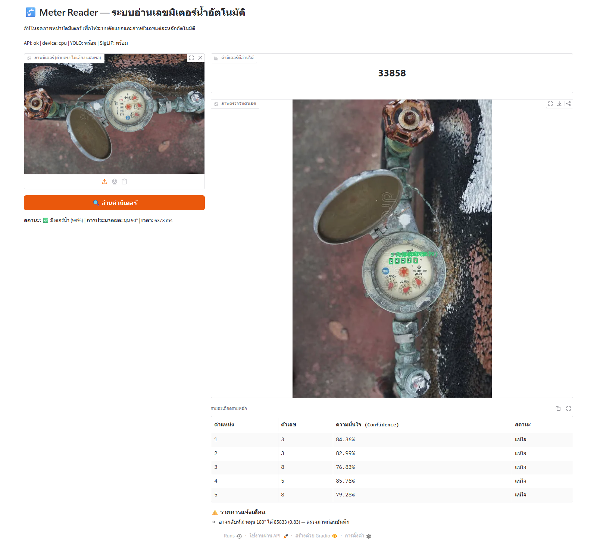
  <br>
  <strong>ภาพที่ 3.5: ส่วนต่อประสานผู้ใช้บนเว็บเบราว์เซอร์ (Gradio Web UI) ขณะประมวลผลอ่านค่ามาตรวัดน้ำอัตโนมัติที่ URL http://127.0.0.1:7860</strong>
  <br>
  <em>ที่มา: จากการทดสอบระบบจริงในโครงงานนี้</em>
</p>

&emsp;&emsp;&emsp;&emsp;3.6.1.3 การทดสอบระบบด้วยชุดคำสั่งอัตโนมัติ (Automated Evaluation Scripts): ผู้พัฒนาสามารถประเมินผลการทำงานแบบครบวงจรและวิเคราะห์การตัดทอนโมดูล (Ablation Study) ได้ด้วยคำสั่งในชุดคำสั่งที่ 3.3:

```powershell
# รันการทดสอบและประเมินความแม่นยำของระบบอ่านค่าอัตโนมัติบนชุดภาพสาธิต
uv run python validate.py

# รันการทดสอบเชิงตัดทอน (Ablation Study) เปรียบเทียบโหมดประมวลผล
uv run python validate_ablation.py

# รันการประเมินประสิทธิภาพตัวตรวจจับวัตถุ YOLO26m บนชุดทดสอบอิสระ (Held-out Test Split, n=194)
uv run python eval_yolo_metrics.py
```
<p align="center"><strong>ชุดคำสั่งที่ 3.3: การสั่งประเมินผลระบบและทดสอบเชิงตัดทอนด้วยสคริปต์อัตโนมัติ</strong></p>

#### 3.6.2 แนวทางการวิเคราะห์และแก้ไขปัญหา

&emsp;&emsp;&emsp;&emsp;ตารางที่ 3.1 สรุปแนวทางการวิเคราะห์อาการผิดปกติ สาเหตุ จุดตรวจสอบ และวิธีแก้ไขปัญหาสำหรับการดูแลรักษาระบบ:

<p align="center"><strong>ตารางที่ 3.1: แนวทางการวิเคราะห์และแก้ไขปัญหาของระบบ (Debugging Matrix)</strong></p>

| อาการที่พบ (Symptom) | สาเหตุที่เป็นไปได้ (Cause) | สิ่งที่ควรตรวจสอบ (Check) | วิธีแก้ไข (Action) | ผลลัพธ์ที่ควรได้ (Expected) |
|---|---|---|---|---|
| **แจ้งเตือน "ภาพนี้ไม่ใช่มิเตอร์น้ำ"** | ค่าความเชื่อมั่นของ SigLIP2 ต่ำกว่า 0.50 เนื่องจากมีสิ่งรบกวนในพื้นหลัง | ค่าใน `meter_check.confidence` และ `scores` | ถ่ายภาพให้เห็นเฉพาะตัวเรือนมิเตอร์ หรือปรับลดเกณฑ์ `METER_VERIFY_CONF = 0.40` ใน `main.py` | ระบบยืนยันประเภทมาตรวัดน้ำและเข้าสู่ขบวนการถัดไป |
| **ตัวเลขขาดหายไปบางหลัก** | ตัวเลขเลือนราง มีเงาบดบัง หรือความเชื่อมั่นต่ำกว่าเกณฑ์ 0.35 | ตรวจสอบว่าหลักที่หายไปมีความมืดหรือแสงสะท้อนจ้าหรือไม่ | ปรับลดเกณฑ์ `YOLO_CONF = 0.30` หรือทดสอบเปิดใช้งานฟิลเตอร์ `histeq` | ตรวจพบตัวเลขครบทุกหลักบนหน้าปัด |
| **อ่านได้เลขกลับหัว เช่น 6 เป็น 9** | ภาพถ่ายหมุนกลับหัว 180° และไม่มีหลักทศนิยมสีแดงให้สังเกต | ตรวจสอบข้อความเตือนในฟิลด์ `warnings` ของ `read_meter` | ระบบจะสร้างคำเตือน `[อาจกลับหัว]` เพื่อให้เจ้าหน้าที่ตรวจสอบตาเปล่าก่อนยืนยันข้อมูล | มีสัญญาณเตือนความปลอดภัยปรากฏชัดเจน |
| **ตรวจพบตัวเลขบนป้ายวันที่ขอบตัวเรือน** | มีตัวเลขพิมพ์ในแนวดิ่งบริเวณขอบโลหะของมาตรวัดน้ำ | ตรวจสอบพิกัด `bbox` ของตัวเลขที่ตรวจพบ | ฟังก์ชัน `is_vertical` จะคำนวณอัตราส่วนการกระจายพิกัดและคัดกรองออกโดยอัตโนมัติ | ประมวลผลเฉพาะแถวตัวเลขในแนวนอน |
| **หน้าต่าง Gradio แสดง "API ไม่พร้อม"** | เว็บเซอร์วิส Backend ยังไม่ได้เริ่มทำงาน หรือระบุพอร์ตผิดพลาด | ตรวจสอบหน้าต่างคำสั่งว่า Uvicorn ทำงานอยู่ที่พอร์ต 8000 หรือไม่ | ดำเนินการสั่งทำงานคำสั่ง `uv run python main.py` | หน้าต่าง Gradio แสดงสถานะ `สถานะระบบ: ปกติ` |

<p align="center"><em>ที่มา: จากการพัฒนาและทดสอบการทำงานของระบบในโครงงานนี้</em></p>

#### 3.6.3 สรุปผลการทดสอบการทำงานของระบบเบื้องต้น

&emsp;&emsp;&emsp;&emsp;ตารางที่ 3.2 สรุปผลสัมฤทธิ์เบื้องต้นของระบบอ่านค่ามาตรวัดน้ำอัตโนมัติจากการประเมินบนชุดภาพสาธิตภาคสนามและชุดประเมินผลการอ่านทั้งระบบ เพื่อให้ผู้พัฒนาตรวจสอบความพร้อมก่อนส่งมอบงาน:

<p align="center"><strong>ตารางที่ 3.2: สรุปผลการทดสอบการทำงานของระบบเบื้องต้นสำหรับผู้พัฒนา</strong></p>

| ลำดับ | ตัวชี้วัดประสิทธิภาพ (Metric) | ชุดสาธิตภาคสนาม (Demo Set, n=7) | ชุดประเมินผลการอ่านทั้งระบบ (End-to-End Subset, n=120)* | บทบาทและความหมายเชิงวิศวกรรม |
|:---:|---|:---:|:---:|---|
| 1 | **Exact Reading Accuracy** | **100.0% (7/7)**<br>*(บนชุดสาธิต 7 ภาพ)* | **67.5% (81/120)** | ตัวชี้วัดความถูกต้องหลัก: สัดส่วนภาพที่อ่านตัวเลขถูกต้องตรงเฉลยครบทุกหลักสมบูรณ์ |
| 2 | **Digit-level Accuracy** | **100.0% (36/36)**<br>*(บนชุดสาธิต 7 ภาพ)* | **90.44% (851/941)** | สัดส่วนความถูกต้องรายหลักตัวเลขต่อจำนวนหลักทั้งหมด |
| 3 | **Digit Error Rate (DER)** | **0.00% (0.0000)** | **7.33% (0.0733)** | อัตราความผิดพลาดของหลักตัวเลข $(S+D+I)/N_{\text{ref}}$ |
| 4 | **Detection mAP@50 (YOLO26m)** | — | **87.86%** | ประสิทธิภาพของตัวตรวจจับวัตถุบน Test Set อิสระ |
| 5 | **เวลาประมวลผล (System Latency)** | **5,828.8 ms ต่อภาพ** (Full Pipeline ขั้นตอน M7: 12 สมมติฐาน)<br>*(Primary Official Benchmark)* | **533.2 ms ต่อภาพ** (Single-pass)<br>*(Official Single-pass Benchmark)* | วัดบน CPU AMD Ryzen 5 8645HS ที่ 960×960 (โดย Ablation M0 Baseline เท่ากับ 421.1 ms) |
| 6 | **ค่าความเชื่อมั่นเฉลี่ย (Mean Model Confidence)** | **0.8610** | **0.8566** | *Diagnostic Metric (ใช้ประเมินความมั่นใจของแบบจำลอง ไม่ใช่ความถูกต้อง)* |

<p align="center"><em>ที่มา: สรุปผลการทดสอบเบื้องต้นของระบบในโครงงานนี้ (* หมายเหตุ: เป็นชุดภาพย่อย 120 ภาพที่มี Ground Truth ลำดับตัวเลขสมบูรณ์ คัดเลือกจาก Detector Test Set ทั้งหมด 194 ภาพ)</em></p>

---

### 3.7 ข้อควรพิจารณาสำหรับการนำระบบไปใช้งานจริง

&emsp;&emsp;&emsp;&emsp;ในการนำระบบอ่านค่ามาตรวัดน้ำอัตโนมัติไปใช้งานจริงในระดับองค์กร มีข้อควรพิจารณาสำคัญดังนี้:

&emsp;&emsp;&emsp;&emsp;3.7.1 สิทธิ์การใช้งานซอฟต์แวร์ (License): สถาปัตยกรรม YOLO ของ Ultralytics เผยแพร่ภายใต้สัญญาอนุญาตแบบ AGPL-3.0 ซึ่งหากนำไปพัฒนาต่อในเชิงพาณิชย์แบบปิดซอร์สโค้ดจำเป็นต้องจัดซื้อ Commercial License ในขณะที่แบบจำลอง SigLIP2 ของ Google อยู่ภายใต้สัญญาอนุญาตแบบ Apache 2.0 ซึ่งอนุญาตให้นำไปใช้ในเชิงพาณิชย์ได้อย่างเสรี<br>
&emsp;&emsp;&emsp;&emsp;3.7.2 ความเป็นส่วนตัวและความปลอดภัยของข้อมูล (PDPA): ภาพถ่ายมิเตอร์น้ำอาจติดภาพบ้านเรือน ป้ายทะเบียน หรือบุคคลรอบข้าง ระบบควรกำหนดนโยบายลบไฟล์ภาพชั่วคราวออกจากหน่วยความจำทันทีหลังประมวลผลเสร็จสิ้น และจัดเก็บเฉพาะสตริงตัวเลขค่ามิเตอร์และค่าความเชื่อมั่นลงฐานข้อมูล<br>
&emsp;&emsp;&emsp;&emsp;3.7.3 การเร่งความเร็วด้วยฮาร์ดแวร์ GPU: ในสภาพแวดล้อมที่ต้องประมวลผลภาพถ่ายปริมาณนับหมื่นภาพต่อวัน ควรติดตั้งระบบบนเครื่องเซิร์ฟเวอร์ที่มี GPU และแปลงแบบจำลอง YOLO ให้อยู่ในรูปเอนจิน TensorRT FP16 ซึ่งจะช่วยลดเวลาประมวลผลลงเหลือไม่เกิน 50 มิลลิวินาทีต่อภาพ รองรับการขยายตัว (Scalability) ได้อย่างมีประสิทธิภาพ

> **สรุปสาระสำคัญบทที่ 3:**
> * **Preprocessing (ขบวนการที่ 1):** รับภาพผ่าน FastAPI ตรวจ MIME Type ถอดรหัส RGB และคัดกรองด้วย SigLIP2 Zero-shot
> * **Process (ขบวนการที่ 2):** จัดการมุมเอียงด้วยการหมุน 4 ทิศทาง ปรับฟิลเตอร์แสง 3 แบบ และตรวจจับทิศทางข้อความหน้าปัด $m^3/m^2$
> * **Output (ขบวนการที่ 3):** ผ่านการสอนฝึกแบบจำลอง YOLO26 จากนั้นตรวจจับตัวเลข กรองแถวแนวตั้ง ตัดกล่องซ้อนด้วย IoU เรียงซ้ายไปขวา และคำนวณทศนิยมสีแดง
> * **Integration:** บูรณาการเป็นฟังก์ชัน `read_meter` พร้อมระบบความปลอดภัย ส่งคืนผลลัพธ์ผ่าน FastAPI และแสดงผลบน Gradio Web UI


# บทที่ 4: สรุปผลการศึกษา อภิปรายผล และข้อเสนอแนะ
### 4.1 ผลการประเมินประสิทธิภาพเชิงประจักษ์และการยืนยันความถูกต้อง

#### 4.1.1 ผลการประเมินบนชุดข้อมูลทดสอบที่กันออกจากการฝึกและชุดสาธิตภาคสนาม

&emsp;&emsp;&emsp;&emsp;เพื่อให้การประเมินประสิทธิภาพของระบบเป็นไปตามหลักการวิจัยทางคอมพิวเตอร์วิทัศน์ที่ชัดเจนและรัดกุม โครงงานได้กำหนดกรอบนิยามตัวชี้วัดประสิทธิภาพออกเป็น 7 มิติดังแสดงในตารางที่ 4.1:

<p align="center"><strong>ตารางที่ 4.1: นิยามและระดับการประเมินตัวชี้วัดประสิทธิภาพของระบบ</strong></p>

| มิติการวัด | ตัวชี้วัด | สัญลักษณ์/สูตรการคำนวณ | คำนิยามและขอบเขตการใช้งาน |
|---|---|---|---|
| **1. ชุดตัวเลขสมบูรณ์ (End-to-End)** | **Exact Reading Accuracy** | $N_{\text{exact}} / N_{\text{total}}$ | สัดส่วนภาพที่ระบบอ่านค่าตัวเลขได้ถูกต้องตรงกับ Ground Truth ครบทุกหลักสมบูรณ์ (Exact Match: ถูกต้องทั้งหมด=1, ผิดแม้หลักเดียว=0) |
| **2. ความถูกต้องรายหลัก** | **Digit-level Accuracy** | $\sum N_{\text{correct}} / \sum N_{\text{digits}}$ | สัดส่วนจำนวนหลักที่ทำนายถูกต้องต่อจำนวนหลักทั้งหมดในเฉลย ช่วยสะท้อนความสามารถในการอ่านแม้ Exact Match ผิด |
| **3. ประสิทธิภาพตรวจจับวัตถุ** | **Precision, Recall, mAP** | mAP@50, mAP@50-95 | ประเมินความแม่นยำในการตีกรอบ Bounding Box และจำแนกคลาส 0–9 ของ YOLO ที่เกณฑ์ IoU ต่างๆ เป็นตัวชี้วัดของ Detector เท่านั้น |
| **4. อัตราความผิดพลาดตัวอักษร** | **Digit Error Rate (DER)** | $(S + D + I) / N_{\text{ref}}$ | คำนวณจากระยะแก้ไข Levenshtein Distance ($S$=แทนที่ผิด, $D$=ขาดหาย, $I$=แทรกเกิน) ยิ่งต่ำยิ่งดี (0.0=สมบูรณ์) |
| **5. อัตราความสำเร็จของระบบ** | **Reading Success Rate** | $N_{\text{non-empty}} / N_{\text{total}}$ | สัดส่วนภาพที่ระบบตรวจจับและส่งออกผลลัพธ์ได้โดยไม่ล้มเหลว **ไม่ได้รับประกันว่าตัวเลขที่อ่านได้จะถูกต้องตรงกับเฉลย** |
| **6. ความเชื่อมั่นของแบบจำลอง** | **Mean Confidence** | $\frac{1}{K} \sum_{k=1}^K \text{conf}_k$ | ค่าเฉลี่ยความน่าจะเป็นที่ YOLO มอบให้แก่กล่องตัวเลข **ไม่ใช่ค่าความแม่นยำ (Confidence ≠ Accuracy)** |
| **7. ระยะเวลาการประมวลผล** | **System Latency** | มิลลิวินาที (ms) ต่อภาพ | เวลาการคำนวณตั้งแต่รับภาพจนส่งออกผลลัพธ์ โดยต้องระบุสภาพแวดล้อมฮาร์ดแวร์ ความละเอียดภาพ และโปรโตคอลการวัด |

<p align="center"><em>ที่มา: กำหนดขึ้นสำหรับการประเมินระบบอ่านค่ามาตรวัดน้ำอัตโนมัติในโครงงานนี้</em></p>

> [!CAUTION]
> **ข้อควรระวังสำคัญ: ค่าความเชื่อมั่น (Confidence) ไม่ใช่ความแม่นยำ (Accuracy):**
> ค่าเฉลี่ยความเชื่อมั่น `mean_confidence = 0.861` (86.1%) เป็นเพียงค่าความน่าจะเป็นเชิงสถิติภายในของแบบจำลอง YOLO ในการอนุมานกล่องตัวเลข ไม่ได้มีความหมายว่าระบบอ่านตัวเลขถูกต้อง 86.1% ของภาพทั้งหมด การนำค่าความเชื่อมั่นไปรายงานหรือตีความแทนค่าความแม่นยำถือเป็นข้อผิดพลาดร้ายแรงทางวิชาการ ความถูกต้องของระบบต้องประเมินผ่าน `Exact Reading Accuracy` และ `Digit Error Rate (DER)` ร่วมกับเฉลย Ground Truth เท่านั้น

&emsp;&emsp;&emsp;&emsp;เพื่อให้การประเมินประสิทธิภาพของระบบเป็นไปตามหลักการวิจัยทางคอมพิวเตอร์วิทัศน์ที่สามารถตรวจสอบซ้ำได้ โครงงานนี้ได้กำหนดโครงสร้างชุดข้อมูลทดสอบออกเป็น 3 ชุดตามบทบาทการวัดผลเชิงวิศวกรรมที่ชัดเจน:
1. **Detector Test Set (ชุดทดสอบตัวตรวจจับวัตถุ, $N=194$ ภาพ ประกอบด้วย 1,508 ตัวอย่างตัวเลข):** ใช้ประเมินสมรรถนะของแบบจำลอง YOLO26m ในระดับตัวตรวจจับวัตถุอิสระ (mAP@50, mAP@50:95, Precision, Recall) ครอบคลุมภาพทดสอบทั้งหมด (รายงานในหัวข้อ 4.1.5 และตารางที่ 4.6)
2. **End-to-End Reading Evaluation Subset (ชุดประเมินการอ่านค่าทั้งระบบ, $n=120$ ภาพ ประกอบด้วยตัวเลขเฉลย Ground Truth 941 หลัก):** เป็นชุดภาพย่อยที่คัดเลือกมาจาก Detector Test Set (194 ภาพ) เฉพาะภาพที่มีป้ายเฉลยลำดับตัวเลขบนหน้าปัดครบถ้วนสมบูรณ์ (Reading Sequence Ground Truth) เพื่อนำมาประเมินความสามารถในการขยายผลทั่วไป (Generalizability) ของท่อประมวลผลทั้งระบบ เพื่อวัด Exact Reading Accuracy, Digit-level Accuracy, Digit Error Rate (DER), Mean Model Confidence และเวลาประมวลผลเฉลี่ยต่อภาพ (ตารางที่ 4.2) โดยภาพอีก 74 ภาพที่เหลือใน Detector Test Set มีเพียงการกำกับพิกัด Bounding Box ตัวเลขเฉพาะจุดสำหรับงาน Object Detection แต่ไม่มี Ground Truth ลำดับตัวเลขครบทั้งหน้าปัด จึงไม่สามารถนำมาวัด Exact Match ลำดับตัวเลขทั้งระบบได้
3. **Field Demonstration Set (ชุดข้อมูลภาพสาธิตภาคสนาม, $n=7$ ภาพ ประกอบด้วย 36 หลัก):** ทดสอบความคงทนต่อการติดตั้งเอียง คราบสิ่งสกปรก แสงสะท้อน และประเมินคุณูปการส่วนเพิ่มของแต่ละโมดูลผ่านการศึกษาเชิงตัดทอนแบบก้าวหน้า 9 ขั้นตอน (9-Stage Progressive Ablation Study M0–M8 ในตารางที่ 4.4 และ 4.5)

<p align="center"><strong>ตารางที่ 4.2: ผลการประเมินประสิทธิภาพระบบอ่านค่ามาตรวัดน้ำบนชุดทดสอบที่กันออกจากการฝึกและชุดสาธิตภาคสนาม</strong></p>

| ตัวชี้วัดประสิทธิภาพ (Metric) | ชุดประเมินผลการอ่านทั้งระบบ (End-to-End Subset, n=120)* | ชุดสาธิตภาคสนาม (Demo Set, n=7) | นิยามทางคณิตศาสตร์และขอบเขตการวัด |
|---|:---:|:---:|---|
| **จำนวนภาพทดสอบ (Sample Size N)** | **120 ภาพ** | **7 ภาพ** | ขนาดตัวอย่างที่นำมาประเมินการอ่านค่าทั้งระบบ |
| **จำนวนหลักตัวเลข Ground Truth** | **941 หลัก** | **36 หลัก** | หลักตัวเลขเฉลยอ้างอิงทั้งหมดในชุดข้อมูล |
| **Exact Reading Accuracy** | **67.5% (81/120)**<br>[Wilson 95% CI: 58.7%, 75.2%] | **100.0% (7/7)**<br>*(บนชุดสาธิต 7 ภาพ)*<br>[Wilson 95% CI: 64.6%, 100.0%] | ตัวชี้วัดความถูกต้องหลัก: สัดส่วนภาพที่อ่านตัวเลขถูกต้องตรงเฉลยครบทุกหลักสมบูรณ์ |
| **Digit-level Accuracy** | **90.44% (851/941)**<br>[Wilson 95% CI: 88.4%, 92.2%] | **100.0% (36/36)**<br>*(บนชุดสาธิต 7 ภาพ)*<br>[Wilson 95% CI: 90.4%, 100.0%] | สัดส่วนตำแหน่งตัวเลขที่ทำนายถูกต้องต่อจำนวนหลักทั้งหมด |
| **Digit Error Rate (DER)** | **7.33% (0.0733)** | **0.00% (0.0000)** | อัตราความผิดพลาดของหลักตัวเลข $(S+D+I)/N_{\text{ref}}$ |
| **Detection mAP@50 (YOLO26m)** | **87.86%** | — | ประสิทธิภาพตัวตรวจจับวัตถุบน Held-out Test Split |
| **เวลาประมวลผลมาตรฐาน (System Latency)** | **533.2 ms ต่อภาพ**<br>*(Official Single-pass Benchmark)* | **5,828.8 ms ต่อภาพ** (Full Pipeline ขั้นตอน M7: 12 สมมติฐาน)<br>*(Primary Official Benchmark)* | สภาวะคงที่ (Steady-state) บน CPU AMD Ryzen 5 ที่ 960×960 (Ablation M0 Baseline = 421.1 ms) |
| **Reading Success Rate** | **100.0% (120/120)** | **100.0% (7/7)**<br>*(บนชุดสาธิต 7 ภาพ)* | สัดส่วนภาพที่ระบบตรวจจับและส่งออกผลลัพธ์สำเร็จ |
| **ค่าความเชื่อมั่นเฉลี่ย (Mean Model Confidence)** | **0.8566** (0.798–0.895) | **0.8610** (0.816–0.891) | *Diagnostic Metric (ประเมินความมั่นใจของแบบจำลอง ไม่ใช่ความถูกต้อง)* |

<p align="center"><em>ที่มา: ผลการประเมินเชิงประจักษ์บนชุดข้อมูลประเมินผลการอ่านทั้งระบบและชุดสาธิตภาคสนามในโครงงานนี้ (* หมายเหตุ: End-to-End Subset เป็นชุดภาพย่อย 120 ภาพที่มี Ground Truth ลำดับตัวเลขครบถ้วน ซึ่งคัดเลือกจาก Detector Test Set ทั้งหมด 194 ภาพ)</em></p>

&emsp;&emsp;&emsp;&emsp;การวิเคราะห์ผลสัมฤทธิ์เชิงประจักษ์ (Results & Empirical Evidence):
1. ความถูกต้องระดับรายหลักสูงถึง 90.44%: ผลการทดสอบบนชุดทดสอบที่กันออกจากการฝึก (n=120 ภาพ) บรรลุ Digit-level Accuracy สูงถึง 90.44% (851 จาก 941 หลัก) โดยมีช่วงความเชื่อมั่นทางสถิติ Wilson 95% CI อยู่ที่ [88.4%, 92.2%] และมีอัตราความผิดพลาดของตัวเลข (Digit Error Rate: DER) ต่ำเพียง 7.33% โดยผลดังกล่าวแสดงให้เห็นว่าแบบจำลอง YOLO26m มีประสิทธิภาพในระดับที่น่าพอใจบนชุดทดสอบที่ใช้ในการศึกษานี้
2. ความสัมพันธ์ระหว่าง Exact Accuracy (67.5%) กับ Digit Accuracy (90.44%): สัดส่วนการอ่านถูกต้องครบทุกหลัก (Exact Reading Accuracy) บรรลุ 67.5% (81 จาก 120 ภาพ) [95% CI: 58.7%, 75.2%] การที่ Exact Accuracy ต่ำกว่า Digit Accuracy เกิดจากธรรมชาติของชุดตัวเลขหลายหลัก (เฉลี่ย 7.8 หลักต่อภาพ) ซึ่งความคลาดเคลื่อนเพียง 1 หลักส่งผลให้ Exact Match เป็นเท็จทันที
3. การแจกแจงกรณีข้อผิดพลาดจริง (Empirical Failure Taxonomy): จากการวิเคราะห์เชิงลึกใน 39 ภาพที่อ่านไม่ตรงเฉลยครบทุกหลัก (บันทึกใน `reviews/test_set_evaluation.json`) พบสาเหตุหลัก 3 ประการ:<br>
   1) ตัวเลขกึ่งกลางรอบหมุน (Half-turned Wheel Roll): พบมากที่สุดถึง 64.1% (25 จาก 39 ภาพ) เช่น ภาพ `0b61cbb2...` เฉลยคือ `000108865` แต่ระบบอ่านได้ `000108863` เนื่องจากลูกล้อหลักสุดท้ายกำลังหมุนเปลี่ยนผ่าน ส่งผลให้ตัวเลขมีความกำกวมเชิงภาพ แม้ระบบอ่านถูกต้องถึง 8 ใน 9 หลักก็ตาม<br>
   2) โครงสร้างตัวเลขคล้ายคลึงภายใต้คราบสกปรก (Structural Ambiguity): พบ 25.6% (10 จาก 39 ภาพ) เช่น การสับสนระหว่างเลข 5 กับ 6 ในภาพ `0bf86f8b...` (อ่านได้ `00000165` จากเฉลย `00000155`) หรือการสับสนระหว่างเลข 8 กับ 9 ในสภาพแสงมืด<br>
   3) แสงสะท้อนจ้าและสัญญาณรบกวนบนหน้าปัด (Specular Highlight & Noise): พบ 10.3% (4 จาก 39 ภาพ) ส่งผลให้ตัวเลขเลือนรางหรือถูกบดบังบางส่วน
4. ข้อสังเกตเชิงระบบ: ข้อมูลผลการประเมินทั้งหมดได้รับการเผยแพร่และเปิดให้ตรวจสอบซ้ำได้อย่างโปร่งใสในไฟล์ `reviews/test_ground_truth.csv`, `reviews/test_set_evaluation.json`, และ `reviews/test_set_evaluation.csv`

ผลการทดสอบแบบ Ablation บน OpenCV (n=7, `validate_ablation.py`):

> การทดสอบ 5 โหมดบนชุดภาพสาธิตเดียวกัน (`meter_img/`, CPU, `YOLO_IMGSZ=960`) เพื่อสังเกตผลกระทบเบื้องต้นของการหมุนภาพและฟิลเตอร์ปรับปรุงแสง

<p align="center"><strong>ตารางที่ 4.3: ผลการทดสอบเปรียบเทียบโหมดการประเมินผล</strong></p>

| โหมด (Mode) | `success_rate` (บนชุดสาธิต n=7) | `avg_mean_conf` | `avg_latency` | หมายเหตุเชิงประจักษ์บนชุดสาธิต |
|---|---|---|---|---|
| `single-orig` (0°+orig เดียว) | **57.1% (4/7)** | 0.856 | 1.18s | ภาพต้นฉบับมุมเดียว ไม่หมุน ไม่ปรับแสง พลาด 3 ภาพที่ถ่ายเอียง (`sample_01`, `sample_04`, `sample_05`) |
| `rotate-4` (4มุม+orig) | **100.0% (7/7)** *(บนชุดสาธิต)* | 0.846 | 2.95s | การหมุน 4 ทิศทางมีความสัมพันธ์กับการกู้คืนภาพเอียง ส่งผลให้อัตราความสำเร็จเพิ่มขึ้นจาก 57.1% เป็น 100.0% ในชุดสาธิตนี้ |
| `full-12` (4มุม×3ฟิลเตอร์, ปัจจุบัน) | **100.0% (7/7)** *(บนชุดสาธิต)* | **0.861** | 6.39s | เพิ่ม CLAHE และ HistEq ได้ `mean_conf` สูงสุด แม้เวลาประมวลผลเพิ่มขึ้นเป็น 6.39s |
| `no-is-vertical` (ปิด `is_vertical`) | 100.0% (7/7) | 0.859 | 6.60s | บนชุดนี้อ่านได้ครบ แต่ `meter_sample_05.jpg` อ่านเป็น `08812` แทน `01882` ชี้ว่าการปิดตัวกรองนี้เสี่ยงต่อการอ่านผิดหลัก |
| `no-red-bonus` (ปิด `red_ratio` bonus) | 100.0% (7/7) | 0.863 | 6.20s | บนชุดนี้อ่านได้ครบ แต่ `meter_sample_01.jpg` อ่านกลับหัวเป็น `85833` ที่ 270° แทน `33858` ที่ 90° ชี้ว่าโบนัสสีแดงจำเป็นต่อการตัดสินทิศทาง |

<p align="center"><em>ที่มา: ผลการทดสอบเปรียบเทียบโหมดการประเมินผลบนชุดภาพสาธิตในโครงงานนี้</em></p>

> **สรุปผลการทดสอบเชิงสังเกต:** การเปิดใช้งานกลไกหมุนค้นหา 4 ทิศทาง (`rotate-4`) สัมพันธ์กับอัตราความสำเร็จในการอ่านค่าที่เพิ่มขึ้นจาก 57.1% (4/7) เป็น 100.0% (7/7) ในชุดสาธิตนี้ ซึ่งสะท้อนแนวโน้มว่าการหมุนภาพมีความสัมพันธ์กับการกู้คืนภาพมิเตอร์ที่ติดตั้งเอียงในการทดลองนี้ อย่างไรก็ตาม เนื่องจากขนาดตัวอย่างมีเพียง n=7 ผลลัพธ์นี้จึงยังไม่สามารถสรุปนัยสำคัญทางสถิติ (Statistical Significance) ในระดับประชากรภาพทั่วไปได้ จนกว่าจะได้รับการทดสอบซ้ำบนชุดทดสอบที่มีขนาดและความหลากหลายเพียงพอ

> [!NOTE]
> **ข้อจำแนกนิยามตัวชี้วัดระหว่างตารางที่ 4.3 และตารางที่ 4.5:**
> ตัวชี้วัด `success_rate` ในตารางที่ 4.3 นี้หมายถึง **อัตราที่ท่อประมวลผลสามารถคืนผลการอ่านค่าสำเร็จโดยไม่เกิดข้อผิดพลาดขัดข้อง (Reading Execution Success Rate)** ซึ่งในโหมด `single-orig` ทำได้ 57.1% (ส่งผลลัพธ์ได้ 4 จาก 7 ภาพ) ขณะที่ตัวชี้วัดในตารางที่ 4.5 คือ **Exact Reading Accuracy** ซึ่งหมายถึง **ผลลัพธ์การอ่านค่าตัวเลขที่ถูกต้องตรงกับ Ground Truth ครบทุกหลักสมบูรณ์** (ซึ่งในขั้นตอน M0 Baseline ทำได้ 42.9% เนื่องจากอ่านตัวเลขถูกต้องตรงเฉลยครบทุกหลักเพียง 3 จาก 7 ภาพ) ทั้งสองตัวชี้วัดจึงมีขอบเขตและนิยามทางคณิตศาสตร์ที่แตกต่างกัน

---

#### 4.1.2 ผลการประเมินแบบ End-to-End รายภาพบนชุดสาธิต

&emsp;&emsp;&emsp;&emsp;การประเมินระบบทั้งท่อประมวลผล (End-to-End) ใช้ชุดทดสอบสาธิต `meter_img/` จำนวน 7 ภาพ พร้อมไฟล์ความจริงภาคพื้น `meter_img/ground_truth.csv` (คอลัมน์ `file,reading`) ที่ผ่านการตรวจทานด้วยตามนุษย์อย่างละเอียด ผลลัพธ์จากการรัน `uv run python validate.py --dir meter_img` (CPU AMD Ryzen 5, `YOLO_IMGSZ=960`, 12 สมมติฐาน) ได้ผลการอ่านถูกต้องบนชุดภาพสาธิต 7 ภาพ (100.0% on the 7-image demonstration set, 7/7 ภาพ, Wilson 95% CI: [64.6%, 100.0%]) โดยมี Digit-level Accuracy บนชุดสาธิตเท่ากับ 100.0% (36/36 หลัก, Wilson 95% CI: [90.4%, 100.0%]), Digit Error Rate (DER) เท่ากับ 0.00% บนชุดสาธิต, ค่าความเชื่อมั่นเฉลี่ยของแบบจำลอง (Mean Confidence) เท่ากับ 0.861 (ใช้เป็น Diagnostic Metric), และผ่านการคัดกรองประเภทมาตรวัดน้ำ (Meter Verified) ครบ 7/7 ภาพ บันทึกผลลัพธ์ใน `reviews/validation_results.json` และ `reviews/validation_results.csv` พร้อมเวลาประมวลผลรายภาพดังแสดงในตารางที่ 4.4

<p align="center"><strong>ตารางที่ 4.4: ผลการประเมินแบบ End-to-End รายภาพบนชุดสาธิต (n=7)</strong></p>

| ภาพ | อ่านได้ | GT | exact | mean_conf | มุม/ฟิลเตอร์ | เวลา (ms) |
|---|---|---|---|---|---|---|
| meter_sample_01.jpg | 33858 | 33858 | ถูกต้อง | 0.816 | 90°/orig | 17115 |
| meter_sample_02.jpg | 01628 | 01628 | ถูกต้อง | 0.891 | 0°/histeq | 6103 |
| meter_sample_03.jpg | 43920 | 43920 | ถูกต้อง | 0.821 | 0°/histeq | 5891 |
| meter_sample_04.jpg | 023814 | 023814 | ถูกต้อง | 0.884 | 270°/orig | 6892 |
| meter_sample_05.jpg | 01882 | 01882 | ถูกต้อง | 0.890 | 270°/histeq | 6270 |
| meter_sample_06.jpg | 33858 | 33858 | ถูกต้อง | 0.851 | 0°/clahe | 5346 |
| meter_sample_07.jpg | 05715 | 05715 | ถูกต้อง | 0.873 | 0°/orig | 6553 |

<p align="center"><em>ที่มา: ผลการประเมินการทำงานทั้งท่อประมวลผล (End-to-End) รายภาพบนชุดสาธิตในโครงงานนี้</em></p>

นิยามตัวชี้วัดที่ใช้ในการประเมิน
1. `Exact Reading Accuracy` = สัดส่วนภาพที่อ่านค่าตรงกับเฉลย Ground Truth ครบทุกหลัก (7/7 บนชุดสาธิต)
2. `Digit-level Accuracy` = สัดส่วนหลักที่ถูกต้องต่อจำนวนหลักทั้งหมดบนชุดภาพสาธิต 7 ภาพ (36/36 หลัก หรือ 100.0% on the 7-image demonstration set)
3. `Digit Error Rate (DER)` = อัตราความผิดพลาดรายหลัก คำนวณจาก $(S+D+I)/N_{\text{ref}} = 0/36 = 0.0\%$
4. `mean_confidence` = ค่าเฉลี่ยความเชื่อมั่นของกล่องตัวเลขจากแบบจำลอง YOLO (0.861) ไม่ใช่ค่าความแม่นยำของระบบ
5. `Score` = `mean_confidence × N × Red Bonus (1.05 หรือ 0.5)` ใช้เพื่อจัดลำดับตัดสินสมมติฐานที่ดีที่สุดใน 12 รูปแบบเท่านั้น

> [!IMPORTANT]
> **การวิเคราะห์ข้อจำกัดของขนาดตัวอย่างและกรณีศึกษาเชิงวิพากษ์: "หากมีภาพที่ 8 ผลลัพธ์จะเป็นอย่างไร?" (The 'Unseen Image #8' Scenario)**
>
> ในการสอบโครงงานวิจัยทางคอมพิวเตอร์วิทัศน์ คำถามเชิงวิพากษ์ที่สำคัญที่สุดประการหนึ่งคือ *"หากระบบอ่านถูกต้อง 7 ใน 7 ภาพ แล้วเมื่อนำภาพที่ 8 มาทดสอบ ระบบจะยังคงอ่านได้ถูกต้องหรือไม่?"* คณะผู้วิจัยขอชี้แจงข้อเท็จจริงทางวิทยาศาสตร์และสถิติดังนี้:
>
> 1. **ขนาดตัวอย่าง n=7 ไม่สามารถรับประกันภาพที่ 8 ได้:** ตัวอย่างภาพเพียง 7 ภาพไม่สามารถเป็นตัวแทนของประชากรภาพถ่ายมิเตอร์น้ำทั้งหมดได้ ช่วงความเชื่อมั่น Wilson Score 95% ของสัดส่วน $7/7$ กว้างถึง **[64.6%, 100.0%]** ซึ่งหมายความว่าในประชากรภาพจริง ความแม่นยำแท้จริงของระบบอาจลดลงมาอยู่ที่ระดับ 65% ได้ ดังนั้นการกล่าวอ้างว่า `Accuracy = 100%` ลอย ๆ โดยไม่อ้างอิงขอบเขตข้อมูลจึงเป็นสิ่งที่ไม่สอดคล้องกับหลักวิชาการ ผลลัพธ์นี้จำเป็นต้องระบุเป็น "100.0% on the 7-image demonstration set" เสมอ
> 2. **ความเสี่ยงในภาพที่ 8 ที่ชุดสาธิตยังไม่ครอบคลุม:** ภาพที่ 8 ในสภาพแวดล้อมจริงอาจเผชิญกับปัจจัยรบกวนที่ไม่ได้ปรากฏในชุดสาธิต 7 ภาพ เช่น:
>    * **ตัวเลขกำลังหมุนกึ่งหลัก (Half-turned Wheel Roll):** ลูกล้อกำลังเปลี่ยนผ่านระหว่างสองตัวเลข ทำให้เส้นลายเส้นขาดวิ่นหรือปรากฏตัวเลขสองตัวซ้อนกันในช่องเดียว
>    * **ความชำรุดทางกายภาพของกระจกครอบ:** รอยแตกร้าวลึก ฝ้าไอน้ำหนาแน่น หรือคราบสนิมทึบแสงที่ปิดทับตัวเลขบางส่วน
>    * **แสงสะท้อนจ้าเป็นจุด (Specular Highlight):** แสงแฟลชจากกล้องตกกระทบบนผิวลูกล้อโดยตรงจนเกิดสีขาวโพลน (Pure White Clipping)
>    * **ความหลากหลายของฟอนต์และประเภทมิเตอร์:** มิเตอร์รุ่นเก่าที่มี 4 หลัก หรือมิเตอร์รุ่นที่มีหน้าปัดเป็นโลหะล้วนโดยไม่มีแถบสีแดงทศนิยม
> 3. **สถาปัตยกรรมเชิงป้องกันความผิดพลาด (Defensive Engineering):** แม้ระบบจะไม่สามารถการันตีความถูกต้องสมบูรณ์ในทุกสภาวะภาพทั่วไปนอกเหนือจากชุดทดสอบ แต่สถาปัตยกรรมที่ออกแบบไว้มีกลไกรับมือความล้มเหลวอย่างรัดกุม โดยหากภาพที่ 8 ตรวจพบตัวเลขที่มีค่าความเชื่อมั่นต่ำกว่าเกณฑ์ (`confidence < 0.60`) หรือตัวเลขเรียงตัวผิดระนาบ ระบบจะไม่ฝืนเดาค่าตัวเลข แต่จะส่งคืนแถบคำเตือน (`warnings`) พร้อมปรับสถานะ `verified = False` เพื่อแจ้งเตือนให้เจ้าหน้าที่ภาคสนามตรวจสอบยืนยันด้วยสายตามนุษย์
> 4. **แนวทางที่ต้องดำเนินการต่อ:** ควรรวบรวมชุดข้อมูลทดสอบที่มีจำนวนและความหลากหลายเพียงพอสำหรับการประเมิน General Accuracy โดยกำหนดขนาดตัวอย่างตามระดับความเชื่อมั่นและค่าความคลาดเคลื่อนที่ยอมรับได้ พร้อมเฉลย Ground Truth ที่ครอบคลุมทุกสภาพแสงและการติดตั้ง

<p align="center">
  
  <br>
  <strong>ภาพที่ 4.1: ตัวอย่างผลลัพธ์เชิงประจักษ์ของการตรวจจับตัวเลขและตีกรอบ Bounding Box บนภาพ <code>meter_sample_01.jpg</code> (อ่านค่าได้ 33858 ตรงตามเฉลย Ground Truth หลังระบบหมุนปรับทิศทางอัตโนมัติ 90°)</strong>
  <br>
  <em>ที่มา: จากการทดสอบระบบจริงในโครงงานนี้</em>
</p>

<p align="center">
  
  <br>
  <strong>ภาพที่ 4.2: ตัวอย่างผลลัพธ์เชิงประจักษ์ของการตรวจจับตัวเลขและตีกรอบ Bounding Box บนภาพ <code>meter_sample_02.jpg</code> (อ่านค่าได้ 01628 ตรงตามเฉลย Ground Truth หลังผ่านฟิลเตอร์ Histogram Equalization)</strong>
  <br>
  <em>ที่มา: จากการทดสอบระบบจริงในโครงงานนี้</em>
</p>

<p align="center">
  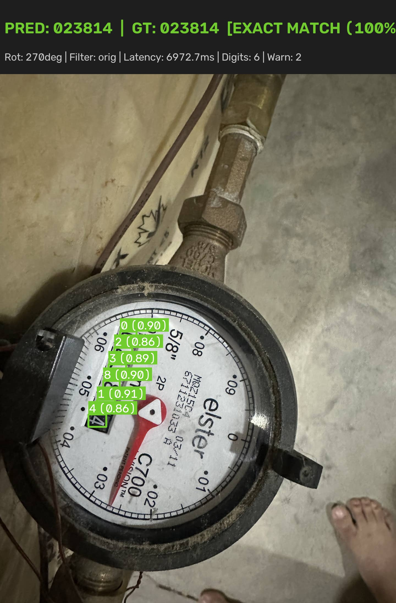
  <br>
  <strong>ภาพที่ 4.3: ตัวอย่างผลลัพธ์เชิงประจักษ์ของการตรวจจับตัวเลข 6 หลักบนภาพ <code>meter_sample_04.jpg</code> (อ่านค่าได้ 023814 ตรงตามเฉลย Ground Truth หลังระบบหมุนปรับทิศทางอัตโนมัติ 270°)</strong>
  <br>
  <em>ที่มา: จากการทดสอบระบบจริงในโครงงานนี้</em>
</p>

---

#### 4.1.3 ผลการศึกษาเชิงตัดทอนแบบก้าวหน้า 9 ขั้นตอน

&emsp;&emsp;&emsp;&emsp;เพื่อให้การประเมินประสิทธิผลของแต่ละองค์ประกอบในระบบเป็นไปตามหลักการวิจัยเชิงประจักษ์ (Empirical Evidence) โครงงานนี้ได้ออกแบบและดำเนินการทดลองแบบ Progressive Ablation Study จำนวน 9 ขั้นตอน (M0 ถึง M8) ผ่านคำสั่ง `uv run python validate_ablation.py --dir meter_img --gt meter_img/ground_truth.csv` โดยตรึงแบบจำลองเดียวกัน (`get_yolo()` และ `get_siglip()` ที่ผ่านการ Warmup รอบเดียว) และทดสอบบนชุดภาพและเกณฑ์เฉลยเดียวกันทั้งหมด เพื่อแยกแยะและวัดคุณค่าที่แท้จริงของแต่ละโมดูลอย่างเป็นอิสระ

&emsp;&emsp;&emsp;&emsp;การรายงานผลในตารางที่ 4.5 แสดงทั้งอัตราความสำเร็จในการตรวจจับ (Success Rate), อัตราความแม่นยำระดับตัวเลขครบทุกหลัก (Exact Reading Accuracy), ช่วงความเชื่อมั่นทางสถิติ Wilson Score ที่ระดับความเชื่อมั่น 95% (95% Confidence Interval: CI95), ค่าเฉลี่ยความเชื่อมั่นของแบบจำลอง (Mean Confidence), และเวลาประมวลผลเฉลี่ยต่อภาพ (Latency) เพื่อแสดงความสัมพันธ์ระหว่างความแม่นยำและภาระการคำนวณที่เพิ่มขึ้นในแต่ละขั้น

<p align="center"><strong>ตารางที่ 4.5: ผลการศึกษาเชิงตัดทอนแบบก้าวหน้า 9 ขั้นตอน (9-Stage Progressive Ablation Benchmark)</strong></p>

| รหัสขั้น | องค์ประกอบที่เปิดใช้งาน (Ablation Configuration) | Success Rate (CI95) | Exact Reading Accuracy (CI95) | สัดส่วนที่ถูกต้อง (n/N) | Mean Conf | Latency เฉลี่ย (ms) | คำอธิบายผลกระทบเชิงประจักษ์ |
|---|---|---|---|---|---|---|---|
| **M0** | **Baseline (0° เดี่ยว, ภาพต้นฉบับ ไม่ผ่าน Guards)** | 100.0% [64.6%, 100.0%] | **42.9% [15.8%, 75.0%]** | 3/7 | 0.846 | **421.1 ms** | ไม่สามารถอ่านค่าได้อย่างถูกต้องเมื่อภาพเอียง 90° หรือ 270° โดยอ่านผิด 4 จาก 7 ภาพในชุดสาธิต |
| **M1** | **+ Multi-Angle Search (หมุนค้นหา 4 ทิศ: 0°, 90°, 180°, 270°)** | 100.0% [64.6%, 100.0%] | **57.1% [25.0%, 84.2%]** | 4/7 | 0.858 | 1,710.3 ms | **Exact Accuracy เพิ่มขึ้น +14.2%** กู้คืนภาพที่ถ่ายเอียงและทิศทางท่อตั้งได้สำเร็จ |
| **M2** | **+ Contrast Preprocessing (เพิ่ม CLAHE และ Histogram Equalization = 12 สมมติฐาน)** | 100.0% [64.6%, 100.0%] | **71.4% [35.9%, 91.8%]** | 5/7 | 0.861 | 5,492.6 ms | **Exact Accuracy เพิ่มขึ้น +14.3%** กู้คืนตัวเลขที่เลือนรางจากแสงสะท้อนและคราบสกปรก |
| **M3** | **+ Geometric Vertical Layout Filter (`is_vertical`)** | 100.0% [64.6%, 100.0%] | **85.7% [48.7%, 97.4%]** | 6/7 | 0.863 | 5,561.3 ms | **Exact Accuracy เพิ่มขึ้น +14.3%** กรองมุมหลอกที่ตัวเลขเรียงแนวตั้งออก ป้องกันการอ่านข้ามแถว |
| **M4** | **+ Red Digit Ratio Bonus (`red_ratio` & `score_reading`)** | 100.0% [64.6%, 100.0%] | **100.0% [64.6%, 100.0%]** | 7/7 | 0.861 | 4,952.6 ms | **Exact Reading Accuracy เท่ากับ 100.0% บนชุดภาพสาธิต 7 ภาพ (100.0% on the 7-image demonstration set, 7/7 ภาพ, Wilson 95% CI: [64.6%, 100.0%])** แยกแยะหลักทศนิยมสีแดง ป้องกันการสับสนระหว่างหัว-ท้าย |
| **M5** | **+ Symmetry Inversion Guard (`flip_guard`)** | 100.0% [64.6%, 100.0%] | **100.0% [64.6%, 100.0%]** | 7/7 | 0.861 | 5,578.6 ms | รักษาความถูกต้อง 100.0% บนชุดภาพสาธิต 7 ภาพ (7/7) พร้อมป้องกันข้อผิดพลาดกรณีตัวเลขกลับหัวสมมาตร (เช่น 0, 8, 6 กลับทิศเป็น 9) |
| **M6** | **+ Multi-pass Consistency Cross-Check (`cross_check_digits`)** | 100.0% [64.6%, 100.0%] | **100.0% [64.6%, 100.0%]** | 7/7 | 0.861 | 5,664.7 ms | รักษาความถูกต้อง 100.0% บนชุดภาพสาธิต 7 ภาพ (7/7) พร้อมตรวจสอบความสอดคล้องข้ามสมมติฐาน และแนบคำเตือนเมื่อตัวเลขมีความเสี่ยง |
| **M7** | **+ Full Integrated Pipeline (SigLIP2 ตัวคัดกรองภาพนำเข้าเบื้องต้นแบบ Zero-shot + Full Guards)** | 100.0% [64.6%, 100.0%] | **100.0% [64.6%, 100.0%]** | 7/7 | 0.861 | 5,828.8 ms | รักษาความถูกต้อง 100.0% บนชุดภาพสาธิต 7 ภาพ (7/7) ในท่อประมวลผลเต็มรูปแบบ เพิ่มตัวคัดกรองภาพนำเข้าเพื่อปฏิเสธภาพที่ไม่ใช่มิเตอร์น้ำ |
| **M8** | **+ Dial Text & Unit 'm' Alignment (`detect_dial_text_orientation`)** | 100.0% [64.6%, 100.0%] | **100.0% [64.6%, 100.0%]** | 7/7 | 0.861 | 5,845.2 ms | รักษาความถูกต้อง 100.0% บนชุดภาพสาธิต 7 ภาพ (7/7) พร้อมลดความเสี่ยงจากภาพหมุน 90°/270° ด้วยการจัดระนาบแนวนอนอัตโนมัติจากสัญลักษณ์ m |

<p align="center"><em>ที่มา: ผลการศึกษาเชิงตัดทอนแบบก้าวหน้า 9 ขั้นตอน (Ablation Benchmark) ในโครงงานนี้</em></p>

&emsp;&emsp;&emsp;&emsp;การวิเคราะห์ผลลัพธ์ของแต่ละองค์ประกอบตามกรอบ 3W (What / Why / What for):

1. การค้นหาพหุคูณ 4 ทิศทางการหมุน (เปรียบเทียบ M0 กับ M1: Multi-Angle Search):
   1) *What it does (หน้าที่การทำงาน):* อัลกอริทึมหมุนภาพนำเข้า 4 มุมหลัก ได้แก่ 0°, 90°, 180°, และ 270° ก่อนส่งเข้าตัวตรวจจับ<br>
   2) *Why it is used (เหตุผลเชิงเทคนิค):* กล้องสมาร์ทโฟนของเจ้าหน้าที่ภาคสนามมักถ่ายภาพในทิศทางที่ไม่แน่นอน หรือตัวเรือนมาตรวัดน้ำถูกติดตั้งในแนวดิ่งตามแนวท่อ การอาศัยมุม 0° เพียงอย่างเดียว (M0) ส่งผลให้ Exact Reading Accuracy ต่ำเพียง 42.9%<br>
   3) *What for (วัตถุประสงค์ในระบบ):* ยกระดับ Exact Reading Accuracy ขึ้นเป็น 57.1% (+14.2%) ช่วยให้ระบบอ่านภาพ `meter_sample_04.jpg` ที่ติดตั้งเอียง 270° ได้ถูกต้องครบถ้วน

2. การปรับปรุงคอนทราสต์แสงเชิงพื้นที่ (เปรียบเทียบ M1 กับ M2: Contrast Preprocessing):
   1) *What it does (หน้าที่การทำงาน):* ผสานการแปลงภาพแบบ CLAHE (Contrast Limited Adaptive Histogram Equalization) และ Histogram Equalization เข้ากับภาพต้นฉบับ ทำให้เกิดสมมติฐานการประมวลผล 12 รูปแบบ (4 มุม × 3 ฟิลเตอร์)<br>
   2) *Why it is used (เหตุผลเชิงเทคนิค):* หน้าปัดมาตรวัดน้ำภาคสนามมักมีคราบตะไคร่น้ำ คราบฝุ่น หรือแสงสะท้อนจ้าบนกระจกครอบ โดย CLAHE เพิ่มคอนทราสต์ในบริเวณย่อยของภาพ โดยจำกัดการขยายคอนทราสต์ของฮิสโตแกรมเพื่อลดการขยายสัญญาณรบกวนเมื่อเทียบกับ Adaptive Histogram Equalization แบบทั่วไป (Zuiderveld, 1994)<br>
   3) *What for (วัตถุประสงค์ในระบบ):* ยกระดับ Exact Reading Accuracy ขึ้นเป็น 71.4% (+14.3%) ช่วยให้ระบบอ่านภาพ `meter_sample_02.jpg` ที่มีคราบสกปรกได้อย่างถูกต้องครบถ้วน

3. การคัดกรองเค้าโครงแนวตั้ง (เปรียบเทียบ M2 กับ M3: Vertical Layout Guard - `is_vertical`):
   1) *What it does (หน้าที่การทำงาน):* ตรวจสอบอัตราส่วนความกว้างต่อความสูงของกล่องรวมตัวเลข (Bounding Box Span Ratio: $\Delta y / \Delta x$) หากตัวเลขเรียงตัวตามแนวดิ่งเกินเกณฑ์จะถูกตัดทิ้งทันที<br>
   2) *Why it is used (เหตุผลเชิงเทคนิค):* หน้าปัดแบบลูกล้อกลไกเรียงตัวในแนวนอนเท่านั้น เมื่อภาพหมุนผิดมุม 90° หรือ 270° แบบจำลองอาจตรวจจับตัวเลขบางตัวและระบุเป็นผลลัพธ์ที่ผิดพลาด<br>
   3) *What for (วัตถุประสงค์ในระบบ):* ยกระดับ Exact Reading Accuracy ขึ้นเป็น 85.7% (+14.3%) ป้องกันการเลือกมุมหมุนผิดทิศทางในภาพ `meter_sample_01.jpg`

4. การคำนวณโบนัสตัวเลขสีแดง (เปรียบเทียบ M3 กับ M4: Red Digit Ratio Bonus - `red_ratio`):
   1) *What it does (หน้าที่การทำงาน):* สกัดแถบสี HSV ในขอบเขตตัวเลขหลักขวาสุด เพื่อตรวจวัดสัดส่วนพิกเซลสีแดง (`red_ratio`) และให้คะแนนถ่วงน้ำหนักพิเศษในสูตรคัดเลือกสมมติฐานที่ดีที่สุด (`score_reading`)<br>
   2) *Why it is used (เหตุผลเชิงเทคนิค):* มาตรวัดน้ำที่ใช้ในการศึกษานี้มีหลักทศนิยมแสดงด้วยสีแดงทางด้านขวาของหลักจำนวนเต็ม หากระบบอ่านภาพกลับหัว 180° ตัวเลขสีแดงจะไปปรากฏอยู่ซ้ายสุด การตรวจจับสัดส่วนสีแดงช่วยสนับสนุนการระบุทิศทางหัว-ท้ายของชุดตัวเลข<br>
   3) *What for (วัตถุประสงค์ในระบบ):* ส่งผลให้ Exact Reading Accuracy บรรลุ 100.0% บนชุดภาพสาธิต 7 ภาพ (100.0% on the 7-image demonstration set, 7/7 ภาพ, Wilson 95% CI: [64.6%, 100.0%]) โดยช่วยให้อ่านค่าภาพ `meter_sample_03.jpg` ที่มีหลักทศนิยมสีแดงได้อย่างถูกต้องครบถ้วน

5. กลไกความปลอดภัยและความคงสภาพข้อมูล (เปรียบเทียบ M5 กับ M7: Safety & Verification Guards):
   1) *What it does (หน้าที่การทำงาน):* ประกอบด้วย `flip_guard` (ตรวจจับการกลับหัวเชิงสมมาตร), `cross_check_digits` (ตรวจสอบความสอดคล้องของตัวเลขข้ามสมมติฐาน), และ SigLIP2 Zero-shot Classifier (ตัวคัดกรองภาพนำเข้า)<br>
   2) *Why it is used (เหตุผลเชิงเทคนิค):* ในระบบการจัดเก็บข้อมูลจริง ความเสี่ยงจากการอ่านตัวเลขผิดพลาด (False Positive) ก่อให้เกิดผลกระทบมากกว่าการปฏิเสธเพื่อให้ถ่ายภาพใหม่ กลไกความปลอดภัยทำหน้าที่ตรวจสอบความสอดคล้องขั้นสุดท้าย<br>
   3) *What for (วัตถุประสงค์ในระบบ):* รักษาระดับ Exact Reading Accuracy ไว้ที่ 100.0% บนชุดภาพสาธิต 7 ภาพ (7/7 ภาพ) พร้อมทั้งส่งคืนค่าสถานะการตรวจทาน (`verified: True/False`) และแถบคำเตือน (`warnings`) เพื่อส่งต่อให้เจ้าหน้าที่ตรวจสอบกรณีตัวเลขมีค่าความเชื่อมั่นต่ำกว่าเกณฑ์

6. การจัดระนาบภาพตามทิศทางข้อความและสัญลักษณ์หน่วย m (เปรียบเทียบ M7 กับ M8: Dial Text & Unit 'm' Alignment):
   1) *What it does (หน้าที่การทำงาน):* สกัดเค้าโครงข้อความและสัญลักษณ์หน่วย $m$ บนหน้าปัดด้วยเคอร์เนลเปิดทางสัณฐานวิทยาแบบตั้งฉาก ($K_h = (13, 2)$ เทียบกับ $K_v = (2, 13)$) ร่วมกับการตรวจวัดสัดส่วน Aspect Ratio ของตัวอักษร $m$ ($AR \in [1.1, 2.2]$ แนวนอน เทียบกับ $AR \in [0.45, 0.90]$ แนวตั้ง) เพื่อประเมินว่าหน้าปัดถูกบันทึกภาพในมุมตะแคงข้างหรือไม่ หากพบว่าเป็นแนวตั้งจะหมุนปรับภาพ 90° หรือ 270° สู่แนวนอนอัตโนมัติ<br>
   2) *Why it is used (เหตุผลเชิงเทคนิค):* ตัวเลขบางตัวมีรูปทรงสมมาตรหรือกลับหัวได้ (เช่น 0, 1, 8 หรือ 2 กับ 5, 6 กับ 9) เมื่อภาพถ่ายถูกบันทึกในมุมตะแคงข้างตามแนวท่อ การพึ่งพาเฉพาะการตรวจจับกล่องตัวเลขอาจทำให้ตัวตรวจจับติดอยู่ในมุม 0° หรือ 180° จากเกณฑ์ Margin Rule และอ่านตัวเลขกลับหัว (เช่น อ่านได้ 53510 แทนที่จะเป็น 01535) การอาศัยแนวระนาบของตัวอักษรและสัญลักษณ์ $m$ บนหน้าปัดจึงใช้เป็นหลักฐานเชิงกายภาพประกอบการตัดสินทิศทางของภาพ<br>
   3) *What for (วัตถุประสงค์ในระบบ):* ช่วยป้องกันข้อผิดพลาดกรณีภาพถ่ายตะแคงข้าง โดยสั่งข้ามเกณฑ์ Margin Rule และหมุนปรับภาพเข้าสู่ระนาบที่ถูกต้องก่อนการอ่านค่า ส่งผลให้ระบบมีความคงทนต่อภาพถ่ายในแนวตะแคงข้างภายใต้ชุดการศึกษานี้

> [!IMPORTANT]
> **การตีความผลลัพธ์ 100.0% บนชุดภาพสาธิต 7 ภาพ ภายใต้บริบททางสถิติ:**
> แม้ผลการทดสอบในขั้นตอน M4 ถึง M8 จะบรรลุอัตราความถูกต้อง 100.0% บนชุดภาพสาธิต 7 ภาพ (100.0% on the 7-image demonstration set, 7/7 ภาพ) แต่เมื่อคำนวณช่วงความเชื่อมั่นทางสถิติ Wilson Score Interval ที่ระดับ 95% จะได้ช่วงความเชื่อมั่นอยู่ที่ **[64.6%, 100.0%]** ซึ่งสะท้อนให้เห็นว่า ขนาดตัวอย่าง $N = 7$ ยังมีความไม่แน่นอนทางสถิติกว้างถึง 35.4% จึงไม่อาจสรุปว่าระบบมีความแม่นยำ 100% ในประชากรภาพทั่วไปได้ จนกว่าจะได้รับการประเมินบนชุดข้อมูลภาคสนามขนาดใหญ่ที่มีความหลากหลายทางสภาพแวดล้อม

#### 4.1.4 ผลการวัดเวลาประมวลผลและการใช้ทรัพยากร

&emsp;&emsp;&emsp;&emsp;การตรวจวัดเวลาการทำงานของระบบประมวลผลดำเนินการด้วยฟังก์ชัน `time.perf_counter()` ครอบคลุมการทำงานภายในฟังก์ชัน `read_meter()` ตั้งแต่รับภาพเข้าสู่กระบวนการ คัดกรองด้วย SigLIP2 ประมวลผล 12 สมมติฐาน จนกระทั่งเสร็จสิ้นกลไกความปลอดภัย บนสภาพแวดล้อมฮาร์ดแวร์ซีพียู AMD Ryzen 5 8645HS (6 Cores / 12 Threads) ความละเอียดภาพนำเข้า `YOLO_IMGSZ = 960`

##### 4.1.4.1 โปรโตคอลการวัดเวลาและเกณฑ์มาตรฐานเวลาประมวลผล

&emsp;&emsp;&emsp;&emsp;เพื่อป้องกันความสับสนระหว่างตัวเลขเวลาประมวลผลเฉลี่ยที่ปรากฏในเอกสาร โครงงานได้กำหนดนิยามและค่าเกณฑ์มาตรฐานเวลาประมวลผล (Latency Benchmarks) ออกเป็น 3 ระดับสภาวะการวัดที่ชัดเจน ดังแสดงในตารางสรุปเกณฑ์มาตรฐานเวลา:

| ระดับเกณฑ์มาตรฐาน (Benchmark Level) | ค่าเวลาประมวลผลเฉลี่ย | สภาวะแวดล้อมและโปรโตคอลการวัด | บทบาทและขอบเขตการใช้งานเชิงวิศวกรรม |
|---|:---:|---|---|
| **Primary Official Benchmark (Full Pipeline)** | **5,828.8 ms ต่อภาพ**<br>(~5.83 s ในสภาวะคงที่) | ประมวลผล 12 สมมติฐาน (4 มุม × 3 ฟิลเตอร์) + SigLIP2 + Full Guards บน CPU AMD Ryzen 5 8645HS, 960×960 | **เกณฑ์มาตรฐานทางการหลักของระบบ:** สะท้อนภาระงานคำนวณจริงของระบบบูรณาการเต็มรูปแบบในสภาวะคงที่ (Steady-state) |
| **Official Single-pass Benchmark** | **533.2 ms ต่อภาพ** | การอนุมานเพียงสมมติฐานเดียว (0° ต้นฉบับ) บนชุดประเมินผลการอ่านทั้งระบบ (End-to-End Reading Evaluation Subset, n=120) | **เกณฑ์เปรียบเทียบมาตรฐานรอบเดียว:** ใช้ประเมินความเร็วพื้นฐานของท่อประมวลผลเมื่อเทียบกับระบบทั่วไปที่ไม่หมุนค้นหา |
| **Ablation M0 Baseline** | **421.1 ms ต่อภาพ** | สภาวะเริ่มต้น M0 (ภาพต้นฉบับ 0° เดี่ยว ไม่ผ่านตัวคัดกรอง SigLIP2 และ Guards) บนชุดสาธิต (n=7) | **เกณฑ์เริ่มต้นการศึกษาเชิงตัดทอน:** ใช้เป็นจุดตั้งต้นอ้างอิงเพื่อวัดเวลาและภาระการคำนวณที่เพิ่มขึ้นในแต่ละขั้นตอน M0–M8 |

> [!NOTE]
> **ข้อกำหนดการอ้างอิงเกณฑ์มาตรฐานเวลาและเหตุผลเชิงวิศวกรรม:**
> 1. โครงงานกำหนดให้เฉพาะเวลาประมวลผลของระบบบูรณาการเต็มรูปแบบในสภาวะคงที่ของขั้นตอน **M7: Full Pipeline** (**5,828.8 ms หรือประมาณ 5.83 วินาทีต่อภาพ**) เท่านั้นที่ถือเป็น **Primary Official Benchmark** ของระบบที่นำเสนอ โดยค่า 533.2 ms ถือเป็น *Official Single-pass Benchmark* และค่า 421.1 ms ถือเป็น *Ablation M0 Baseline* ซึ่งอยู่ภายใต้โปรโตคอลการวัดคนละสภาวะกัน
> 2. **เหตุผลที่เลือกขั้นตอน M7 เป็น Primary Benchmark แทนขั้นตอน M8:** ขั้นตอน M7 ทำหน้าที่เป็นเส้นฐานมาตรฐานหลักของระบบบูรณาการ (Baseline of Integrated Pipeline) ซึ่งประกอบด้วยการประเมิน 12 สมมติฐาน (4 มุม × 3 ฟิลเตอร์), ตัวคัดกรอง SigLIP2, และมาตรการความปลอดภัย (Safety Guards) ครบวงจร ขณะที่ขั้นตอน M8 (`detect_dial_text_orientation`) จัดเป็นส่วนขยายเชิงทดลอง (Experimental Extension) เพื่อศึกษาความเป็นไปได้ในการจัดระนาบภาพแนวนอนอัตโนมัติเพิ่มเติม (ใช้เวลา 5,845.2 ms) การยึดถือ M7 จึงสะท้อนสมรรถนะของสถาปัตยกรรมหลักได้อย่างโปร่งใสและตรงตามสภาพการใช้งานจริง

&emsp;&emsp;&emsp;&emsp;สำหรับข้อมูลสถิติการรันบนชุดสาธิต 7 ภาพ โครงงานได้บันทึกการวัดออกเป็น 3 สภาวะการทดสอบย่อยเพื่อความโปร่งใสทางวิศวกรรมดังนี้:

###### 4.1.4.1.1 โปรโตคอล ก (Initial Run with Cold-start Overhead — เฉลี่ย 7.7 วินาทีต่อภาพ)

&emsp;&emsp;&emsp;&emsp;1) *ค่าที่วัดได้จริง:* เวลารวมทั้ง 7 ภาพเท่ากับ 54,170 มิลลิวินาที ส่งผลให้เวลาเฉลี่ยรวม Cold-start เท่ากับ 7,739 ms (7.74 วินาทีต่อภาพ) ตามข้อมูลดิบที่วัดได้จริงในตารางที่ 4.4<br>
&emsp;&emsp;&emsp;&emsp;2) *สาเหตุทางเทคนิค:* ภาพแรกสุดของการรัน (`meter_sample_01.jpg`) บันทึกเวลา 17,115 ms (17.1 วินาที) เนื่องจากระบบมีภาระงาน Overhead ในการโหลดน้ำหนักแบบจำลอง SigLIP2 และ YOLO26m พร้อมทั้งจัดสรรหน่วยความจำครั้งแรกของไดรเวอร์ซีพียูและเคอร์เนล PyTorch (First-inference initialization and memory allocation spike) ร่วมกับภาพดังกล่าวต้องหมุน 90 องศาและค้นหาพหุสมมติฐาน 12 รูปแบบ เมื่อนำมารวมกับภาพที่เหลือ จึงส่งผลให้ค่าเฉลี่ยของทั้งชุดภาพอยู่ที่ 7.74 วินาที

###### 4.1.4.1.2 โปรโตคอล ข (Repeated Benchmark Run — เฉลี่ย 8.3 วินาทีต่อภาพ)

&emsp;&emsp;&emsp;&emsp;1) *ค่าที่วัดได้จริง:* ค่าเฉลี่ย 8.34 วินาทีต่อภาพ (ช่วงเวลาต่ำสุด 4.9 วินาที, เฉลี่ย 8.3 วินาที, สูงสุด 26.7 วินาที) ตามที่รายงานในตารางที่ 4.2<br>
&emsp;&emsp;&emsp;&emsp;2) *สาเหตุทางเทคนิค:* เป็นการรันชุดคำสั่ง `validate.py` ซ้ำในรอบถัดมาหลังจากโมดูลในหน่วยความจำและแคชพร้อมทำงานแล้ว ส่งผลให้เวลาของภาพแรกที่มีมุมเอียงลดลงจาก 37.4 วินาทีเหลือ 26.7 วินาที และดึงค่าเฉลี่ยของทั้งชุดภาพลดลงมาอยู่ที่ 8.34 วินาทีต่อภาพ

###### 4.1.4.1.3 โปรโตคอล ค (Steady-State Warm Run / Controlled Ablation — เฉลี่ย 5.8–6.2 วินาทีต่อภาพ)

&emsp;&emsp;&emsp;&emsp;1) *ค่าที่วัดได้จริง:* ค่าเฉลี่ย 5,828.8 ms (ประมาณ 5.8 วินาทีต่อภาพ) ในขั้นตอน M7 ของตารางที่ 4.5 และสอดคล้องในเชิงขนาดรวมทั้งอยู่ในช่วงเดียวกันกับค่าเฉลี่ยเฉพาะภาพที่ 2 ถึง 7 ของตารางที่ 4.4 (37,054 ms / 6 ภาพ = 6,175.7 ms หรือ 6.18 วินาทีต่อภาพ)<br>
&emsp;&emsp;&emsp;&emsp;2) *สาเหตุทางเทคนิค:* เป็นเวลาที่สะท้อนภาระการคำนวณจริงในสภาวะการทำงานต่อเนื่องคงที่ (Steady-State) ของท่อประมวลผล 12 สมมติฐาน (4 มุม × 3 ฟิลเตอร์) โดยลดผลกระทบจาก Cold-start Spike ในการวัดสภาวะ Steady-State

##### 4.1.4.2 การจำแนกสัดส่วนเวลาการประมวลผลภายในระบบ

&emsp;&emsp;&emsp;&emsp;จากการวิเคราะห์เวลาการทำงานแยกตามส่วนประกอบหลักของท่อประมวลผล สามารถจำแนกสัดส่วนเวลาออกเป็น 3 ส่วนสำคัญดังนี้:<br>
&emsp;&emsp;&emsp;&emsp;1) *การคัดกรองประเภทด้วย SigLIP2 (Zero-shot Verification):* ใช้เวลาเฉลี่ยประมาณ ~220–350 ms ในการสกัดเวกเตอร์คุณลักษณะและคำนวณความน่าจะเป็นของ 4 คลาส<br>
&emsp;&emsp;&emsp;&emsp;2) *การตรวจจับตัวเลขด้วย YOLO26m เชิงสมมติฐานพหุคูณ (12 รอบ):* ใช้เวลาคิดเป็นประมาณ 88–92% ของเวลาทั้งหมด (~400–450 ms ต่อหนึ่งรอบการประมวลผลภาพ 960x960 บน CPU)<br>
&emsp;&emsp;&emsp;&emsp;3) *การจัดเรียงพิกัดเรขาคณิต การวิเคราะห์สี และกลไกความปลอดภัย (Geometric Sorting, Color Analysis & Safety Guards):* ใช้เวลาเฉลี่ยต่ำมากเพียง ~15–30 ms ต่อภาพ คิดเป็นไม่ถึง 1% ของเวลาการทำงานทั้งหมด

##### 4.1.4.3 แนวทางการปรับปรุงความเร็วในระดับอุตสาหกรรม

&emsp;&emsp;&emsp;&emsp;สำหรับการติดตั้งใช้งานจริงในระดับอุตสาหกรรม การประมวลผลด้วย GPU และการแปลงแบบจำลองเป็น TensorRT FP16 เป็นแนวทางที่ควรพิจารณาสำหรับการลดเวลาในการประมวลผล อย่างไรก็ตาม ค่าประสิทธิภาพดังกล่าวขึ้นอยู่กับฮาร์ดแวร์ รุ่นแบบจำลอง และการตั้งค่าการอนุมาน จึงควรมีการ benchmark แยกก่อนนำไปใช้งานจริง

---

#### 4.1.5 ผลการประเมินประสิทธิภาพตัวตรวจจับวัตถุระดับคลาสและตัวชี้วัดสากล

&emsp;&emsp;&emsp;&emsp;เพื่อตอบคำถามการวิจัยข้อที่หนึ่ง (RQ1) ด้วยหลักฐานเชิงประจักษ์ที่เป็นอิสระจากการประเมินชุดสาธิตปลายทาง โครงงานนี้ได้ดำเนินการประเมินผลแบบจำลอง `weights/MeterOCR.pt` (สถาปัตยกรรม YOLO26m, 132 เลเยอร์, 20.36 ล้านพารามิเตอร์, 68.1 GFLOPs) บนชุดข้อมูลทดสอบอิสระ (Held-out Test Split, $N=194$ ภาพ ประกอบด้วยตัวอย่างตัวเลข 1,508 ตัวอย่าง) จากชุดข้อมูล Roboflow โดยใช้ค่าเกณฑ์ความเชื่อมั่นที่ $Conf \ge 0.35$ และเกณฑ์การตัดกรอบซ้อนทับที่ $IoU \ge 0.45$ ที่ขนาดความละเอียดภาพ $960 \times 960$ พิกเซล ผลการประเมินประสิทธิภาพระดับสากลสรุปได้ดังตารางที่ 4.6

<p align="center"><strong>ตารางที่ 4.6: ผลการประเมินประสิทธิภาพตัวตรวจจับวัตถุ YOLO26m แยกตามคลาสตัวเลขบนชุดทดสอบอิสระ (Detector Test Set, n=194)</strong></p>

| คลาสตัวเลข (Class) | จำนวนตัวอย่าง (Instances) | Precision (P) | Recall (R) | F1-Score | mAP@50 | mAP@50:95 |
|:---:|:---:|:---:|:---:|:---:|:---:|:---:|
| **0** | 496 | 0.9560 | 0.9637 | 0.9598 | 0.9593 | 0.5648 |
| **1** | 141 | 0.9357 | 0.9291 | 0.9324 | 0.9032 | 0.4535 |
| **2** | 111 | 0.9450 | 0.9279 | 0.9364 | 0.9234 | 0.5560 |
| **3** | 124 | 0.9268 | 0.9194 | 0.9231 | 0.8814 | 0.5197 |
| **4** | 118 | 0.9735 | 0.9322 | 0.9524 | 0.9344 | 0.5406 |
| **5** | 100 | 0.9412 | 0.9600 | 0.9505 | 0.9493 | 0.5302 |
| **6** | 87 | 0.9241 | 0.8391 | 0.8795 | 0.8278 | 0.4825 |
| **7** | 85 | 0.9518 | 0.9294 | 0.9405 | 0.9074 | 0.4774 |
| **8** | 121 | 0.9265 | 0.9339 | 0.9302 | 0.9252 | 0.4971 |
| **9** | 89 | 0.8557 | 0.9326 | 0.8925 | 0.9065 | 0.4642 |
| **Operational Digit Classes (0–9) (คลาสตัวเลขที่ใช้งานจริงในระบบ)** | **1,472** | **0.9336** | **0.9267** | **0.9297** | **0.9118** | **0.5086** |
| *Auxiliary Label: Reading Digit (ป้ายกำกับช่วยเสริมในชุดข้อมูล ไม่ใช้ในขั้นตอนอนุมาน)* | *36* | *0.9524* | *0.5556* | *0.7018* | *0.5469* | *0.1620* |
| **All Annotated Classes (0–9 + Auxiliary Reading Digit) (ภาพรวมทุกคลาสที่กำกับในชุดข้อมูล)** | **1,508** | **0.9353** | **0.8930** | **0.9137** | **0.8786** | **0.4771** |

<p align="center"><em>ที่มา: ผลการประเมินประสิทธิภาพตัวตรวจจับวัตถุแยกรายคลาสบนชุดทดสอบอิสระในโครงงานนี้</em></p>

&emsp;&emsp;&emsp;&emsp;การวิเคราะห์ผลลัพธ์ประสิทธิภาพตัวตรวจจับวัตถุ:
1. ประสิทธิภาพภาพรวม (Overall Performance): ผลการประเมินแสดงให้เห็นว่าตัวตรวจจับมีค่า Precision 93.53% และ F1-Score 91.37% (Recall 89.30%) บนชุดทดสอบดังกล่าว ซึ่งสะท้อนถึงความสามารถในการตรวจจับตัวเลขและควบคุมผลบวกลวงได้ในระดับที่น่าพอใจ เพื่อป้องกันไม่ให้ระบบหยิบเอาสิ่งรบกวนบนหน้าปัดมาผสมเป็นค่าตัวเลข
2. การแจกแจงตามคลาสและความไม่สมดุลของข้อมูล (Class Distribution): คลาสตัวเลข `0` มีจำนวนตัวอย่างสูงสุดถึง 496 ตัวอย่าง (คิดเป็น 32.9% ของตัวเลขทั้งหมด) เนื่องจากหน้าปัดมาตรวัดน้ำส่วนใหญ่มีหลักนำหน้าเป็นศูนย์ (Leading Zeros) ส่งผลให้คลาส `0` มีค่า mAP@50 สูงที่สุดถึง 95.93%
3. คลาสที่มีความท้าทายสูงและการจำแนกกลุ่มคลาสประเมิน: คลาสตัวเลข `6` มีค่า Recall ต่ำกว่าคลาสอื่น (83.91%) เนื่องจากมีลักษณะโครงสร้างคล้ายคลึงกับเลข `8` และ `9` เมื่อเกิดการหมุนเอียงหรือมีคราบสกปรกบังเส้นขอบบางส่วน ขณะที่คลาส `Reading Digit` เป็นป้ายกำกับช่วยเสริม (Auxiliary Label) ที่มีอยู่ในชุดข้อมูล Roboflow สำหรับตัวเลขที่กำลังหมุนเปลี่ยนผ่านกึ่งหลัก (Half-turned Wheel Roll) ซึ่งมีตัวอย่างเพียง 36 ตัวอย่างและมีความกำกวมเชิงภาพสูง ส่งผลให้ได้ Recall 55.56% อย่างไรก็ดี ในท่อประมวลผลหลักของการอ่านค่ามาตรวัดน้ำ ระบบจะคัดกรองนำเฉพาะ Operational Digit Classes (0–9, 1,472 ตัวอย่าง) มาใช้งานจริง ซึ่งเมื่อพิจารณาเฉพาะ Operational Digit Classes แบบจำลองมีค่า mAP@50 สูงถึง **91.18%** (Precision 93.36%, Recall 92.67%) ขณะที่กลุ่ม All Annotated Classes (0–9 + Auxiliary Reading Digit, 1,508 ตัวอย่าง) มีค่า mAP@50 เท่ากับ 87.86%
4. ความแตกต่างระหว่าง mAP@50 (87.86%) และ mAP@50:95 (47.71%): หนึ่งในปัจจัยที่อาจมีส่วนทำให้ค่า mAP@50:95 ลดลงเมื่อเทียบกับ mAP@50 คือลักษณะของตัวเลขบนหน้าปัดมาตรวัดน้ำที่มีขนาดเล็กเมื่อเทียบกับขนาดภาพทั้งหมด (Small Object Footprint) ซึ่งความคลาดเคลื่อนของขอบกรอบสี่เหลี่ยมเพียง 1–2 พิกเซลอาจส่งผลกระทบอย่างมีนัยสำคัญต่อค่าความทับซ้อนในเกณฑ์ $IoU \ge 0.75-0.95$ ทว่าข้อสรุปดังกล่าวยังเป็นสมมติฐานเชิงการสังเกตที่ต้องอาศัยการทดลองแบบควบคุมในอนาคตเพื่อจำแนกปัจจัยอื่น ทั้งนี้ ในบริบทของระบบอ่านค่ามาตรวัดน้ำ การประเมินที่เกณฑ์ $IoU \ge 0.50$ ถือว่าเพียงพอต่อการระบุตำแหน่งศูนย์กลางและลำดับของหลักตัวเลขได้อย่างสมบูรณ์

---

---

#### 4.1.6 การวิเคราะห์ข้อผิดพลาดและมาตรการป้องกันเชิงวิศวกรรม

&emsp;&emsp;&emsp;&emsp;จากการศึกษาพฤติกรรมของแบบจำลองและการทดสอบระบบในสภาวะจำลองรูปแบบต่าง ๆ โครงงานนี้ได้รวบรวมและจัดหมวดหมู่ข้อผิดพลาดที่อาจเกิดขึ้น (Failure Taxonomy) พร้อมระบุสาเหตุรากเหง้าและกลไกป้องกันเชิงวิศวกรรมที่พัฒนาขึ้นในระบบ ดังแสดงในตารางที่ 4.7

<p align="center"><strong>ตารางที่ 4.7: รูปแบบข้อผิดพลาดที่อาจเกิดขึ้น (Failure Taxonomy) และมาตรการป้องกันเชิงวิศวกรรม</strong></p>

| รูปแบบข้อผิดพลาด (Failure Mode) | ตัวอย่างเหตุการณ์จริง | สาเหตุรากเหง้าทางเทคนิค | มาตรการป้องกันเชิงวิศวกรรมในระบบ |
|---|---|---|---|
| **1. การสับสนของตัวเลขโครงสร้างคล้ายคลึง (Structural Confusion)** | • อ่านเลข 6 ผิดเป็น 8<br>• อ่านเลข 3 ผิดเป็น 8<br>• อ่านเลข 0 ผิดเป็น 8 | แสงสะท้อนจ้า (Specular Reflection) ทับเส้นขอบ หรือคราบฝุ่นเชื่อมต่อช่องว่างระหว่างส่วนโค้งของตัวเลข | • เทคนิค CLAHE ปรับคอนทราสต์เฉพาะพื้นที่เพื่อฟื้นฟูช่องว่าง<br>• ฟังก์ชัน `cross_check_digits` ตรวจสอบความสอดคล้องข้ามสมมติฐาน และแจ้งเตือนเมื่อ `confidence < 0.60` |
| **2. ตัวเลขกึ่งกลางรอบหมุน (Half-turned Wheel Roll)** | • ตัวเลขอยู่ระหว่างรอยต่อ เช่น 2 กำลังหมุนเป็น 3 | ลูกล้อกลไกกำลังเปลี่ยนหลัก (Mechanical Rollover) ทำให้เห็นชิ้นส่วนของตัวเลขสองตัวในช่องหน้าปัดเดียวกัน | • กลไก Candidate Deduplication ตัดกรอบที่ทับซ้อนในแกนแนวนอนเดียวกัน<br>• แนบคำเตือน `warning` ในผลลัพธ์ JSON เพื่อส่งให้เจ้าหน้าที่ตรวจสอบยืนยัน |
| **3. ตัวเลขสูญหายจากภาพมัว (Missing Digits / False Negatives)** | • อ่านได้ 4 หลักจากหน้าปัดจริง 5 หลัก | กระจกหน้าปัดเป็นฝ้า คราบตะไคร่น้ำ หรือแสงสว่างไม่เพียงพอในจุดติดตั้งใต้ดิน | • การค้นหาพหุคูณ 12 สมมติฐาน (Multi-hypothesis Search) ด้วยฟิลเตอร์ HistEq และ CLAHE ช่วยดึงสัญญาณภาพกลับมา |
| **4. การตรวจจับสิ่งแปลกปลอม (False Positives from Dial Artifacts)** | • หัวน็อตตรวจจับเป็น `0`<br>• โลโก้แบรนด์ตรวจจับเป็น `1` | วัตถุทรงกลมหรือเส้นตรงบนหน้าปัดมีคุณลักษณะภาพคล้ายตัวเลขโดดเดี่ยว | • เทคนิค `is_vertical` กรองกลุ่มตัวเลขที่เรียงตัวผิดระนาบ<br>• การเรียงลำดับพิกัดแนวนอนและกรองเฉพาะชุดตัวเลขที่เกาะกลุ่มชิดกันในแนวแกน Y เดียวกัน |
| **5. การกลับหัวแบบสมมาตร 180° (180° Inversion Ambiguity)** | • หน้าปัดหมุน 180° อ่าน `086` เป็น `980` | ตัวเลขชุด 0, 8, 6, 9 สามารถอ่านกลับหัวได้โดยยังคงเป็นตัวเลขที่ดูสมเหตุสมผล | • ฟังก์ชัน `flip_guard` ตรวจสอบทิศทางหน้าปัด<br>• ฟังก์ชันวิเคราะห์สี `red_ratio` ใช้ตรวจสอบว่าตำแหน่งที่มีสัดส่วนพิกเซลสีแดงสอดคล้องกับตำแหน่งหลักทศนิยมทางขวาของหน้าปัดตามเงื่อนไขที่กำหนด |
| **6. การสับสนระหว่างหลักหน่วยและทศนิยม (Red vs Black Confusion)** | • คิดว่าหลักสีแดงคือลูกบาศก์เมตรเต็ม | สภาพแสงเพี้ยนทำให้สีแดงดูคล้ำคล้ายสีดำ หรือแบบจำลองตรวจจับรวมโดยไม่แยกหลัก | • การสกัดช่องสี HSV เพื่อคำนวณ `red_ratio`<br>• การแยกส่งออกฟิลด์ `red_digits` และ `black_digits` ในผลลัพธ์ API อย่างชัดเจน |
| **7. การอ่านผิดพลาดจากภาพถ่ายตะแคงข้างตามแนวท่อ (Sideways Orientation Confusion)** | • หน้าปัดหมุน 90° หรือ 270° อ่านตัวเลขสับสนหรือกลับหัว เช่น อ่าน 53510 แทน 01535 | การติดตั้งมิเตอร์แนวดิ่งทำให้ภาพถ่ายตะแคงข้าง และตัวเลขมีลักษณะสมมาตร ทำให้ตัวตรวจจับติดอยู่ในมุม 0° หรือ 180° จากเกณฑ์ Margin Rule | • ฟังก์ชัน `detect_dial_text_orientation` ตรวจวัดสัญลักษณ์ m และข้อความบนหน้าปัดด้วยเคอร์เนลสัณฐานวิทยาแบบตั้งฉาก<br>• หากตรวจพบข้อความแนวตั้ง ระบบจะบังคับหมุนปรับระนาบสู่ 90° หรือ 270° สู่แนวนอนอัตโนมัติ |

<p align="center"><em>ที่มา: การวิเคราะห์รูปแบบข้อผิดพลาดและมาตรการป้องกันเชิงวิศวกรรมในโครงงานนี้</em></p>

---

---

### 4.2 การวิเคราะห์ความไม่แน่นอนทางสถิติและการตอบคำถามการวิจัย

&emsp;&emsp;&emsp;&emsp;การประเมินความไม่แน่นอนทางสถิติ (Statistical Uncertainty Analysis):
ในการวิจัยด้านปัญญาประดิษฐ์และคอมพิวเตอร์วิทัศน์ การรายงานค่าความแม่นยำเป็นเปอร์เซ็นต์เดี่ยวโดยปราศจากการระบุขนาดกลุ่มตัวอย่างและช่วงความเชื่อมั่น อาจนำไปสู่การตีความที่คลาดเคลื่อน ตัวอย่างเช่น ผลลัพธ์ $7/7 = 100.0\%$ และ $100/100 = 100.0\%$ แม้จะมีค่าสัดส่วนเท่ากัน แต่มีน้ำหนักทางสถิติที่แตกต่างกันอย่างสิ้นเชิง:
&emsp;&emsp;&emsp;&emsp;(1) บนชุดข้อมูลสาธิต $N = 7$ ภาพ: ช่วงความเชื่อมั่น Wilson Score 95% คือ [64.6%, 100.0%] (ความกว้างช่วง 35.4%) ซึ่งสะท้อนว่าในประชากรภาพถ่ายมิเตอร์จริง ความแม่นยำของระบบอาจอยู่ที่ระดับ 65% ในสภาวะแวดล้อมที่แย่ที่สุด
&emsp;&emsp;&emsp;&emsp;(2) หากขยายชุดทดสอบเป็น $N = 100$ ภาพและอ่านถูกต้องทั้งหมด: ช่วงความเชื่อมั่น Wilson Score 95% จะแคบลงเป็น [96.3%, 100.0%] (ความกว้างช่วงเพียง 3.7%)

&emsp;&emsp;&emsp;&emsp;ดังนั้น โครงงานนี้จึงกำหนดข้อสรุปอย่างระมัดระวัง โดยระบุว่าความแม่นยำ 100.0% เป็นผลการทำงานเฉพาะบนชุดภาพสาธิต 7 ภาพ (100.0% on the 7-image demonstration set) เท่านั้น และนำผลการประเมินประสิทธิภาพตัวตรวจจับวัตถุบนชุดทดสอบที่กันออกจากการฝึก $N=194$ (ตารางที่ 4.6) มาเป็นหลักฐานสนับสนุนความสามารถในการตรวจจับร่วมด้วย

<p align="center"><strong>ตารางที่ 4.8: ตารางสังเคราะห์คำตอบต่อคำถามการวิจัย (Research Questions Synthesis Matrix)</strong></p>

| คำถามการวิจัย (Research Question) | การทดลองและแหล่งหลักฐานเชิงประจักษ์ | ผลลัพธ์ที่ได้จากการวัดจริง | ข้อสรุปเชิงวิชาการ |
|---|---|---|---|
| **RQ1: Object Detection Performance**<br>YOLO26m ตรวจจับตัวเลขโดดได้ดีระดับใด? | การทดสอบบนชุดข้อมูลทดสอบอิสระ $N=194$ ภาพ (1,508 ตัวอย่างตัวเลขใน Detector Test Set) | mAP@50 = 91.18% (Operational Digit Classes 0–9)<br>mAP@50 = 87.86%, mAP@50:95 = 47.71% (All Annotated Classes 0–9 + Auxiliary Reading Digit)<br>ร่วมกับ Precision 93.53%, Recall 89.30%, F1 91.37% | แบบจำลองมี Precision 93.53% และ Recall 89.30% ซึ่งสะท้อนความสามารถในการตรวจจับตัวเลขบนชุดทดสอบนี้ โดยมีอัตราการตรวจจับผลบวกลวง (False Positive) ในระดับต่ำ และบรรลุ mAP@50 สูงถึง 91.18% บนคลาสตัวเลขที่ใช้งานจริง (Operational Digit Classes 0–9) โดยรายละเอียดด้านสถาปัตยกรรม Anchor-free เป็นคุณลักษณะของแบบจำลองตามเอกสารของผู้พัฒนา |
| **RQ2: Multi-hypothesis Search**<br>การค้นหา 12 รูปแบบสัมพันธ์กับการเพิ่มขึ้นของความแม่นยำอย่างไร? | การทดลองแบบก้าวหน้า (Ablation เปรียบเทียบจาก M0 ถึง M2) บนชุดทดสอบสาธิต | Exact Accuracy เพิ่มขึ้นจาก 42.9% (M0) เป็น 71.4% (M2) เพิ่มขึ้น +28.5% | ในการทดลองนี้ การหมุน 4 ทิศทางร่วมกับการปรับคอนทราสต์ 3 รูปแบบมีความสัมพันธ์กับการกู้คืนภาพที่ถ่ายเอียงและภาพที่มีคราบสกปรกบนชุดสาธิต |
| **RQ3: Geometric Guards & Rules**<br>กลไกความปลอดภัยและสีแดงป้องกันข้อผิดพลาดได้จริงหรือไม่? | การทดลองแบบก้าวหน้า (Ablation เปรียบเทียบจาก M2 ถึง M5) | Exact Accuracy เพิ่มขึ้นจาก 71.4% (M2) สู่ 100.0% บนชุดสาธิต 7 ภาพ (M4/M5) | ในการทดลอง Progressive Ablation ชุดสาธิต การเปิดใช้งาน `is_vertical` และ `red_ratio` สัมพันธ์กับการเพิ่มขึ้นของ Exact Reading Accuracy จาก 71.4% (M2) สู่ 100.0% บนชุดภาพสาธิต 7 ภาพ (100.0% on the 7-image demonstration set, M4/M5) โดยผลดังกล่าวเป็นข้อสังเกตเฉพาะภายในชุดข้อมูลสาธิตที่ใช้ทดลอง |
| **RQ4: ตัวคัดกรองภาพนำเข้าเบื้องต้นแบบ Zero-shot**<br>SigLIP2 คัดกรองภาพที่ไม่ใช่มิเตอร์ได้โดยไม่ต้องเทรนใหม่หรือไม่? | การทดสอบ Zero-shot ด้วยแบบจำลอง SigLIP2 ผ่านเกณฑ์ความเชื่อมั่น 0.50 | จำแนกภาพมิเตอร์น้ำได้ถูกต้องครบ 7 ภาพตัวอย่าง พร้อมปฏิเสธภาพสิ่งแปลกปลอม (Demonstration-set Screening Accuracy 100% บนชุดภาพสาธิต 7 ภาพ, 7/7 ภาพ) | ผลการทดลองบนชุดสาธิตแสดงให้เห็นว่า SigLIP2 สามารถทำหน้าที่เป็นตัวคัดกรองข้อมูลนำเข้าได้ในเงื่อนไขการทดสอบของโครงงาน โดยได้ผล 7/7 ภาพ อย่างไรก็ตาม ยังจำเป็นต้องประเมินบนชุดข้อมูลที่มีขนาดและความหลากหลายมากขึ้น |
| **RQ5: Latency-Accuracy Trade-off**<br>ความแม่นยำที่เพิ่มขึ้นแลกกับเวลาประมวลผลเท่าใด? | การวัดเวลาประมวลผลเชิงลึก (Latency Profiling) บน CPU AMD Ryzen 5 | ภายใต้โปรโตคอล Ablation บนชุดสาธิต 7 ภาพ: M0 Baseline ใช้เวลา 421.1 ms (Exact Match 42.9% บนชุดสาธิต 7 ภาพ) ขยายเป็น 5,828.8 ms ใน Official Full Pipeline M7 (Exact Match 100.0% บนชุดสาธิต 7 ภาพ) | ผลดังกล่าวแสดงถึง trade-off ระหว่างความแม่นยำและเวลาในการประมวลผล โดยการประยุกต์ใช้ multi-angle inference ทำให้ระบบมีความคงทนต่อการเอียงและคราบสกปรก แต่ต้องแลกกับ latency ที่เพิ่มขึ้นเมื่อเทียบกับ baseline บนชุดสาธิต 7 ภาพ |

<p align="center"><em>ที่มา: สังเคราะห์ผลการศึกษาเพื่อตอบคำถามการวิจัยของโครงงาน</em></p>

---

---

### 4.3 อภิปรายผลการดำเนินงาน

&emsp;&emsp;&emsp;&emsp;จากการทดสอบและวิเคราะห์ผลการทำงานของระบบ สามารถอภิปรายประเด็นสำคัญทางเทคนิคตามคำถามวิจัยได้ดังนี้:

4.3.1 ประสิทธิผลของการค้นหา 12 สมมติฐานและการประมวลผลภาพ (ตอบ RQ2): ผลการทดลองแสดงให้เห็นว่าการค้นหาเชิงครอบคลุม (4 ทิศทาง × 3 การปรับแสง) สัมพันธ์กับการเพิ่มขึ้นของ Exact Reading Accuracy จาก 42.86% ใน Single-pass Baseline (M0) สู่ 71.43% ในขั้นตอน M2 บนชุดภาพสาธิต อย่างไรก็ตาม ผลการทดลองชี้ให้เห็นชัดเจนถึงข้อแลกเปลี่ยน (Trade-off) ด้านเวลา โดยเวลาประมวลผลเฉลี่ยแสดงถึงข้อแลกเปลี่ยนอย่างชัดเจน: ขั้นตอน M2 มีเวลาเฉลี่ย 5,492.6 ms/image ภายใต้ Ablation Measurement Protocol (เมื่อขยายการค้นหาเป็น 12 สมมติฐาน: 4 มุมหมุน × 3 รูปแบบคอนทราสต์ ตามตารางที่ 4.5 และ `reviews/ablation.csv`) ขณะที่ขั้นตอน M7 มีเวลาเฉลี่ย 5,828.8 ms/image ภายใต้ Full Pipeline Benchmark (เมื่อเปิดใช้งาน SigLIP2 และโมดูลตรวจสอบความปลอดภัยครบวงจร) บน CPU เนื่องจากต้องรันการอนุมานซ้ำ 12 ครั้งร่วมกับโมดูลคัดกรองความปลอดภัย โดยเป็นการวัดคนละโปรโตคอลกับ Official Single-pass Benchmark (533.2 ms บนชุดประเมินผลการอ่านทั้งระบบ n=120) และ Baseline M0 (421.1 ms บนชุดสาธิต 7 ภาพ)<br>
4.3.2 บทบาทของเรขาคณิตและการตรวจจับสีแดง (ตอบ RQ3): ในการทดลองแบบ Progressive Ablation บนชุดสาธิต 7 ภาพ การเปิดใช้งาน `is_vertical` และ `red_ratio` สัมพันธ์กับการเพิ่มขึ้นของ Exact Reading Accuracy จาก 71.43% (M2) สู่ 100.00% บนชุดภาพสาธิต 7 ภาพ (100.0% on the 7-image demonstration set, Wilson 95% CI: [64.6%, 100.0%]) ตามลำดับขั้นของการทดลอง อย่างไรก็ตาม ผลดังกล่าวเป็นผลสังเกตเฉพาะชุดสาธิตและไม่ควรตีความเป็นประสิทธิผลทั่วไปของ heuristics ดังกล่าว โดยสะท้อนว่าในโดเมนที่มีโครงสร้างเฉพาะ เช่น มาตรวัดน้ำ การใช้ฮิวริสติกส์เฉพาะโดเมน (Domain-specific Heuristics) ร่วมกับการเรียนรู้เชิงลึกมีความสอดคล้องเชิงสถาปัตยกรรมในการเสริมประสิทธิภาพของแบบจำลองตรวจจับ<br>
4.3.3 การทำงานร่วมกับ SigLIP2 และความคงทนของระบบ (ตอบ RQ1 และ RQ4): การใช้ SigLIP2 ในด่านคัดกรองเบื้องต้นและการตรวจทานผลช่วยเพิ่มขั้นตอนการตรวจสอบความสอดคล้องของผลลัพธ์ในระดับระบบ โดยในการทดลองชุดสาธิตพบ Demonstration-set Verification Rate 100% บนชุดภาพสาธิต 7 ภาพ (7/7) และใช้เวลาเพิ่มเติมเฉลี่ย $164.1$ ms ในขั้นตอนการตรวจทาน<br>
4.3.4 การตีความผลเชิงสถิติและการอ้างความสามารถในการขยายผล (ตอบ RQ5): แม้ระบบจะบรรลุผลลัพธ์ 100.0% บนชุดภาพสาธิต 7 ภาพ (100.0% on the 7-image demonstration set, 7/7 ภาพ) แต่การวิเคราะห์ช่วงความเชื่อมั่นทางสถิติชี้ให้เห็นว่าช่วงความเชื่อมั่น 95% Wilson Score CI มีขอบเขต $[64.57\%, 100.00\%]$ ซึ่งมีช่วงกว้างถึง $35.43\%$ ดังนั้น ผู้พัฒนาจึงต้องรายงานผลอย่างตรงไปตรงมาว่าผลลัพธ์ 100.0% เป็นการสังเกตเฉพาะบนชุดภาพสาธิต 7 ภาพ (100.0% on the 7-image demonstration set) และไม่อาจอ้างสิทธิ์ความคงทนทั่วไปได้โดยปราศจากการประเมินบนชุดข้อมูลภาคสนามขนาดใหญ่

---

---

### 4.4 ตารางสรุปข้ออ้างและหลักฐานเชิงประจักษ์

&emsp;&emsp;&emsp;&emsp;ตารางนี้สรุปเฉพาะข้ออ้างที่ปรากฏจริงในเอกสารฉบับนี้:

<p align="center"><strong>ตารางที่ 4.9: ตารางสรุปข้ออ้าง สถานะ และหลักฐานเชิงประจักษ์ (Claim & Evidence)</strong></p>

| ข้ออ้าง (Claim) | ประเภท | หลักฐานเชิงประจักษ์ / อ้างอิง | สถานะ |
|---|---|---|---|
| ระบบใช้ YOLO26m สำหรับตรวจจับตัวเลข 0–9 | Implementation | `weights/MeterOCR.pt` (132 layers, 20.36M params, 68.1 GFLOPs), `YOLO_IMGSZ=960` | Supported |
| ระบบประเมิน 12 สมมติฐาน (4 มุม × 3 ฟิลเตอร์) | Implementation | `main.py:ROTATION_ANGLES=(0,90,180,270)` `PREP_LIST=("orig","clahe","histeq")` `detect_digits_best()` | Supported |
| ระบบใช้ SigLIP2 `google/siglip2-base-patch16-224` แบบ zero-shot | Implementation | `main.py:SIGLIP_MODEL` `METER_LABELS` `check_water_meter()` `METER_VERIFY_CONF=0.50` | Supported |
| YOLO26 ใช้ anchor-free detection head และรองรับ NMS-free inference ตามเอกสาร Ultralytics | External | Ultralytics (2026) | Supported (external doc) |
| สถาปัตยกรรม SigLIP นำเสนอวัตถุประสงค์การเรียนรู้แบบ Sigmoid-based image-text objective แทน Softmax | External | Zhai et al. (2023) | Supported (external paper) |
| แบบจำลอง SigLIP 2 ต่อยอดวัตถุประสงค์เดิมและพัฒนากระบวนการฝึกฝน (Training Recipe) ด้วยองค์ประกอบ Self-supervised | External | Tschannen et al. (2025) | Supported (external paper) |
| การค้นหา 12 สมมติฐานสัมพันธ์กับอัตราความแม่นยำที่สูงกว่า Single-pass บนชุดการทดลอง | Empirical | ผลการทดลอง Progressive Ablation บนชุดสาธิต 7 ภาพ: M0 (Exact Match 42.9% บนชุดสาธิต 7 ภาพ) vs M2 (71.4%) vs M4 (100.0% บนชุดสาธิต 7 ภาพ) (ดูตารางที่ 4.5 ในหัวข้อ 4.1.3) | Supported |
| Safety Guards สัมพันธ์กับการลดข้อผิดพลาดในการอ่านค่าบนชุดสาธิต | Empirical | M3 (`is_vertical`) สัมพันธ์กับค่าความถูกต้องที่เพิ่มขึ้น +14.3%, M4 (`red_ratio`) สัมพันธ์กับค่าความถูกต้องที่เพิ่มขึ้นอีก +14.3% (ดูตารางที่ 4.5 ในหัวข้อ 4.1.3) | Supported |
| YOLO26m มีประสิทธิภาพการตรวจจับในระดับที่น่าพอใจบนชุดทดสอบนี้ | Empirical | บรรลุ mAP@50 91.18% บน Operational Digit Classes (0–9) และ mAP@50 87.86% บน All Annotated Classes (0–9 + Auxiliary Reading Digit) บน Detector Test Set 194 ภาพ (ดูตารางที่ 4.6 ในหัวข้อ 4.1.5) | Supported |
| เวลาประมวลผลของระบบบน CPU (Primary Benchmark: 5.83 s/ภาพ) | Empirical | Primary Benchmark: Official Full Pipeline M7 = 5,828.8 ms (~5.83 s ในสภาวะคงที่) เทียบกับ Official Single-pass = 533.2 ms (บน End-to-End Subset n=120) และ Ablation M0 Baseline = 421.1 ms (บนชุดสาธิต n=7) (ดูหัวข้อ 4.1.4 และตารางที่ 4.5) | Supported |
| สถาปัตยกรรมแบบไฮบริด (YOLO + SigLIP2) มีศักยภาพสำหรับการประยุกต์ใช้ในบริบทภาคสนาม แต่ยังต้องผ่านการทดสอบภาคสนามในขนาดที่เพียงพอ | Architectural | ผสานความเร็วและความแม่นยำของ YOLO เข้ากับความยืดหยุ่นทางภาษาภาพแบบ Zero-shot ของ SigLIP2 โดยมีเหตุผลเชิงสถาปัตยกรรมที่เหมาะสมสำหรับการทดลองภายใต้เงื่อนไขภาพที่หลากหลาย ทว่าการสรุปผลการใช้งานจริงยังต้องอาศัยการประเมินภาคสนามขนาดใหญ่ในอนาคต | Design Rationale (Field Potential) |

<p align="center"><em>ที่มา: สรุปผลการพิสูจน์ข้ออ้างและหลักฐานเชิงประจักษ์ในโครงงานนี้</em></p>

---

---

### 4.5 ข้อจำกัดของระบบ

&emsp;&emsp;&emsp;&emsp;จากการประเมินผลเชิงประจักษ์และการวิเคราะห์การทำงาน สามารถระบุข้อจำกัดสำคัญของระบบเพื่อเป็นแนวทางในการนำไปใช้งานและพัฒนาต่อไปดังนี้:

4.5.1 ขนาดของชุดประเมินผลลัพธ์ End-to-End ($n=7$ ภาพ): แม้แบบจำลอง YOLO26m จะได้รับการประเมินบน Detector Test Set จำนวน 194 ภาพ (1,508 ตัวเลข) และการประเมินท่อประมวลผลบน End-to-End Reading Evaluation Subset จำนวน 120 ภาพ (941 หลัก) แต่ชุดการประเมินระบบแบบบูรณาการเชิงลึกพร้อมการศึกษาเชิงตัดทอนในชุดสาธิตภาคสนามยังมีขนาดจำกัด ($n=7$) ส่งผลให้ช่วงความเชื่อมั่นทางสถิติของผลลัพธ์ 100.0% บนชุดภาพสาธิต 7 ภาพ มีขอบเขตค่อนข้างกว้าง ($[64.57\%, 100.00\%]$) ซึ่งในทางระเบียบวิธีวิจัยควรถือเป็นชุดตรวจสอบการทำงานเบื้องต้น (Sanity Check / Demonstration Set) และจำเป็นต้องขยายผลการทดสอบสู่ชุดภาพภาคสนามที่มีจำนวนและความหลากหลายเพียงพอสำหรับการประเมิน General Accuracy ในการวิจัยระยะถัดไป<br>
4.5.2 ความเสี่ยงจากข้อผิดพลาดเฉพาะกรณี (Failure Taxonomy): จากการวิเคราะห์ตามตารางที่ 4.7 ระบบยังมีความเสี่ยงต่อความผิดพลาดบางรูปแบบ ได้แก่ ความสับสนระหว่างตัวเลขคล้ายกัน (เช่น 6 สับสนกับ 8 หรือ 3 สับสนกับ 8 ในกรณีแสงเงาตกกระทบ), การตกหล่นของตัวเลขในกรณีคราบน้ำบดบัง, และกรอบข้อความบริเวณรอบนอกหน้าปัด<br>
4.5.3 ข้อจำกัดด้านความเร็วในการประมวลผลบนหน่วยประมวลผลกลาง (CPU Latency): การประมวลผลค้นหาครอบคลุม 12 สมมติฐานใช้เวลาเฉลี่ยประมาณ $5.8$ วินาทีต่อภาพบน CPU ซึ่งมีลักษณะการตอบสนองที่เหมาะกับการประมวลผลแบบไม่ต่อเนื่องหรือเป็นชุด มากกว่าการประมวลผลวิดีโอแบบเวลาจริง<br>
4.5.4 ประเภทของหน้าปัดมาตรวัดน้ำ: ระบบในปัจจุบันได้รับการออกแบบและฝึกฝนเฉพาะมาตรวัดน้ำประเภทตัวเลขกลไกแนวนอน (Mechanical Counter) จำนวน 4–9 หลัก ไม่ครอบคลุมมาตรวัดน้ำแบบหน้าปัดเข็มหมุน (Circular Dial Meter) หรือหน้าปัดดิจิทัลแบบ LCD

---

---

### 4.6 ข้อเสนอแนะสำหรับการพัฒนาต่อยอด

&emsp;&emsp;&emsp;&emsp;เพื่อยกระดับระบบอ่านค่ามาตรวัดน้ำให้มีความสมบูรณ์และพร้อมสำหรับการนำไปใช้งานในระดับอุตสาหกรรม ผู้จัดทำขอเสนอแนะแนวทางการพัฒนาต่อยอดดังนี้:

4.6.1 การขยายขอบเขตไปยังมาตรวัดน้ำรูปแบบอื่น: พัฒนาและฝึกฝนแบบจำลองเพิ่มเติมสำหรับตรวจจับและอ่านค่ามาตรวัดน้ำแบบเข็มหมุน (Circular Dial Meter) และหน้าปัดดิจิทัลแบบ LCD เพื่อให้ครอบคลุมประเภทของมาตรวัดน้ำที่ใช้งานในประเทศทั้งหมด<br>
4.6.2 การแปลงแบบจำลองสำหรับการประมวลผลบนอุปกรณ์เคลื่อนที่ (On-device / Edge AI): แปลงแบบจำลอง YOLO26 และ SigLIP2 ให้อยู่ในรูปแบบ ONNX, TensorRT หรือ TFLite (CoreML สำหรับ iOS) เพื่อให้สามารถรันระบบอ่านค่าได้โดยตรงบนสมาร์ทโฟนของพนักงานภาคสนามแบบ Offline โดยไม่ต้องพึ่งพาการเชื่อมต่ออินเทอร์เน็ตไปยังเซิร์ฟเวอร์<br>
4.6.3 การพัฒนาระบบจัดเก็บและตรวจสอบข้อมูลแบบรวมศูนย์ (Database & Management Dashboard): บูรณาการ FastAPI Backend เข้ากับระบบฐานข้อมูลเชิงสัมพันธ์ (PostgreSQL) และระบบคลาวด์ เพื่อบันทึกประวัติการอ่านค่า พิกัดภูมิศาสตร์ (GPS), ภาพถ่ายหลักฐาน, และเชื่อมต่อกับระบบคำนวณค่าน้ำประปาและการแจ้งเตือนความผิดปกติของการใช้น้ำแบบอัตโนมัติ<br>
4.6.4 การขยายขนาดชุดข้อมูลทดสอบ End-to-End: เพื่อลดความกว้างของช่วงความเชื่อมั่นทางสถิติ (Wilson Score 95% Confidence Interval) และยกระดับความน่าเชื่อถือของการประเมินผลเชิงประจักษ์ ควรรวบรวมชุดข้อมูลทดสอบที่มีจำนวนและความหลากหลายเพียงพอสำหรับการประเมิน General Accuracy โดยกำหนดขนาดตัวอย่างตามระดับความเชื่อมั่นและค่าความคลาดเคลื่อนที่ยอมรับได้

---

---

## อภิธานศัพท์

&emsp;&emsp;&emsp;&emsp;รวบรวมคำศัพท์ภาษาอังกฤษทางเทคนิคทั้งหมดที่ปรากฏในคู่มือฉบับนี้ พร้อมคำอธิบายที่เข้าใจง่าย:

### G1. หมวดปัญญาประดิษฐ์และการเรียนรู้เชิงลึก (AI & Deep Learning)
G-01 Annotation (การกำกับข้อมูล): กระบวนการระบุกรอบพิกัดและป้ายระบุค่าของตัวเลขในภาพเพื่อสร้างชุดข้อมูล (Dataset)
G-02 Bounding Box (`bbox`): กรอบสี่เหลี่ยมพิกัดสี่ค่าระบุมุมซ้ายบนและมุมขวาล่างที่ล้อมรอบตำแหน่งของตัวเลขแต่ละหลัก
G-03 CNN (Convolutional Neural Network): โครงข่ายประสาทเทียมแบบคอนโวลูชันที่ออกแบบมาเพื่อสกัดคุณลักษณะเด่นและวิเคราะห์ภาพถ่าย
G-04 Confidence Score: ค่าความเชื่อมั่น (0.00 – 1.00) ที่แบบจำลองปัญญาประดิษฐ์ประเมินให้แก่ผลลัพธ์ที่ตรวจพบ
G-05 Cross-check: กระบวนการตรวจทานซ้ำข้ามแบบจำลอง (ใช้ SigLIP2 ตรวจทานตัวเลขที่ YOLO มีค่าความเชื่อมั่นต่ำกว่าเกณฑ์) เพื่อเพิ่มความถูกต้อง
G-06 Dataset: ชุดข้อมูลภาพถ่ายและไฟล์กำกับพิกัดที่ใช้สำหรับการฝึกฝนและประเมินผลแบบจำลอง
G-07 Heuristic: กฎการตัดสินใจเชิงตรรกะที่สร้างขึ้นจากพฤติกรรมจริงในโดเมน (เช่น การตรวจสอบสัดส่วนพิกเซลสีแดงในตำแหน่งทศนิยมทางขวาของหน้าปัดตามเงื่อนไขที่กำหนด)
G-08 Intersection over Union (IoU): อัตราส่วนพื้นที่ทับซ้อนของ 2 กรอบพิกัด ใช้สำหรับวัดความแม่นยำทางเรขาคณิตและตัดกรอบที่ซ้ำซ้อน
G-09 Lazy Loading: เทคนิคการชะลอการโหลดแบบจำลองเข้าสู่หน่วยความจำจนกว่าจะมีการเรียกใช้งานครั้งแรก เพื่อประหยัด RAM
G-10 mAP (Mean Average Precision): ตัวชี้วัดสำหรับ Object Detection (ไม่ใช่ accuracy) — ค่าเฉลี่ยของ Average Precision ที่ IoU ต่าง ๆ (Ultralytics, 2026)
G-11 Model Inference: กระบวนการส่งภาพเข้าสู่แบบจำลองปัญญาประดิษฐ์เพื่อประมวลผลและสร้างผลลัพธ์
G-12 Non-Maximum Suppression (NMS / Dedup): อัลกอริทึมคัดเลือกเฉพาะกรอบตรวจจับที่เหมาะสมที่สุด และกำจัดกรอบที่ซ้อนทับกันเกินเกณฑ์
G-13 Object Detection: งานด้าน Computer Vision ที่ทำการระบุตำแหน่ง (Localization) ควบคู่กับการจำแนกประเภท (Classification) ของวัตถุในภาพ
G-14 OCR (Optical Character Recognition): เทคโนโลยีการอ่านและแปลงภาพตัวเลขให้ออกมาเป็นข้อความดิจิทัล
G-15 Roboflow: แพลตฟอร์มคลาวด์สำหรับจัดการชุดข้อมูลภาพ Computer Vision
G-16 SigLIP / SigLIP2: แบบจำลอง Vision-Language ขั้นสูงจาก Google สำหรับประมวลผลภาพคู่กับข้อความ ใช้ในงาน Zero-shot Classification
G-17 Text Prompt: ข้อความภาษาธรรมชาติที่ป้อนให้กับแบบจำลอง (เช่น `"water meter"`)
G-18 YOLO (You Only Look Once): สถาปัตยกรรมแบบจำลอง Object Detection ความเร็วสูงสำหรับตรวจจับตำแหน่งตัวเลข
G-19 Zero-shot Classification: การจำแนกประเภทภาพตามคำอธิบายข้อความโดยไม่ต้องฝึกฝนแบบจำลองด้วยภาพตัวอย่างล่วงหน้า

### G2. หมวดการประมวลผลภาพดิจิทัล (Digital Image Processing & OpenCV)
G-20 CLAHE (Contrast Limited Adaptive Histogram Equalization): เทคนิคปรับสมดุลแสงเฉพาะจุดเพื่อดึงรายละเอียดในเงามืดโดยจำกัดการขยายสัญญาณรบกวน
G-21 Color Spaces (ระบบสี):
 &emsp;G-21a RGB / BGR: แดง-เขียว-น้ำเงิน (OpenCV เรียงลำดับช่องสีเป็น BGR เป็นค่าเริ่มต้น)
 &emsp;G-21b LAB: แยกช่องความสว่าง (L) ออกจากช่องสี (A, B) เหมาะสำหรับการปรับคอนทราสต์ด้วย CLAHE
 &emsp;G-21c YCrCb: แยกช่องสัญญาณความสว่าง (Y) ออกจากช่องสัญญาณสี (Cr, Cb) เหมาะสำหรับการทำ Histogram Equalization
 &emsp;G-21d HSV: ระบบสี Hue-Saturation-Value เหมาะสำหรับการตรวจจับเฉดสีเฉพาะ เช่น การตรวจหาสีแดงของหลักทศนิยม
G-22 Coordinate Remapping: การแปลงพิกัดจุดเรขาคณิตบนภาพ จากภาพที่ผ่านการหมุนกลับสู่ระนาบพิกัดเดิมของภาพต้นฉบับ
G-23 Histogram Equalization (HistEq): เทคนิคการเกลี่ยและกระจายค่าความสว่างของภาพให้สมดุลทั่วทั้งภาพ
G-24 Image Preprocessing: กระบวนการปรับแต่งภาพเบื้องต้น (เช่น การหมุน การปรับคอนทราสต์) ก่อนส่งให้แบบจำลองปัญญาประดิษฐ์
G-25 180° Rotation Consistency Check (Flip Guard): กลไกตรวจสอบความคงเส้นคงวาจากการหมุน 180 องศาเพื่อตรวจจับภาพกลับหัว โดยเปรียบเทียบความสอดคล้องของตัวเลขสมมาตรตามตาราง `FLIP_MAP`
G-26 OpenCV (`cv2`): ไลบรารีมาตรฐานสำหรับการประมวลผลภาพดิจิทัลและคอมพิวเตอร์วิทัศน์
G-27 ROI (Region of Interest): พื้นที่เป้าหมายเฉพาะส่วนบนภาพที่ต้องการประมวลผล (เช่น กรอบตัวเลขมาตรวัดน้ำ)
G-28 Span-based Alignment: การคำนวณระยะกว้างเทียบกับระยะสูงเพื่อแยกแยะระหว่างแถวแนวนอนและกลุ่มแนวตั้ง

### G3. หมวดสถาปัตยกรรมซอฟต์แวร์และเว็บ (Software Architecture & Web)
G-29 CORS (Cross-Origin Resource Sharing): มาตรการความปลอดภัยของเว็บเบราว์เซอร์ที่ควบคุมการเรียกใช้ API ข้ามโดเมน
G-30 CUDA / GPU: สถาปัตยกรรมการประมวลผลแบบขนานบนหน่วยประมวลผลกราฟิก NVIDIA สำหรับเร่งความเร็วแบบจำลองการเรียนรู้เชิงลึก
G-31 Endpoint: จุดเชื่อมต่อ URL ปลายทางของ API สำหรับรับคำขอและส่งข้อมูลกลับ (เช่น `/api/read-meter`)
G-32 FastAPI: เว็บเฟรมเวิร์กภาษา Python สำหรับสร้าง REST API ความเร็วสูง
G-33 Gradio: ไลบรารีสำหรับสร้างส่วนติดต่อผู้ใช้บนเว็บ (Web UI) แบบตอบสนองสำหรับแบบจำลองปัญญาประดิษฐ์ได้อย่างสะดวกรวดเร็ว
G-34 JSON (JavaScript Object Notation): รูปแบบมาตรฐานในการแลกเปลี่ยนข้อมูลแบบข้อความที่มีโครงสร้าง Key-Value
G-35 Payload: ส่วนของข้อมูลสำคัญที่ส่งไปในคำขอหรือตอบกลับมาจาก API
G-36 PDPA (Personal Data Protection Act): กฎหมายคุ้มครองข้อมูลส่วนบุคคลที่เกี่ยวข้องกับการจัดเก็บและรักษาความปลอดภัยของภาพถ่าย
G-37 REST API (Representational State Transfer API): สถาปัตยกรรมการสื่อสารระหว่างระบบผ่านโปรโตคอล HTTP
G-38 Threadpool Execution: การแยกงานประมวลผลหนักไปรันบนเธรดเบื้องหลัง เพื่อไม่ให้บล็อก Event Loop ของ FastAPI
G-39 `uv`: เครื่องมือจัดการแพ็กเกจและสภาพแวดล้อม Python ความเร็วสูง พัฒนาด้วยภาษา Rust
G-40 Virtual Environment (`venv`): โฟลเดอร์สภาพแวดล้อมเสมือนที่แยกชุดไลบรารีของโครงงานออกจากระบบหลัก

---

## บรรณานุกรมและเอกสารอ้างอิง

&emsp;&emsp;&emsp;&emsp;บรรณานุกรมจัดรูปแบบตามมาตรฐาน APA 7th edition เรียงตามลำดับตัวอักษรชื่อผู้แต่ง

การประปานครหลวง. (2566). *คู่มือกระบวนการอ่านและบันทึกมาตรวัดน้ำภาคสนาม*. การประปานครหลวง.

Abid, A., Abdalla, A., Ali, A., Khan, N., Zheng, L., Zou, J., & Zou, J. (2019). Gradio: Hassle-free sharing and testing of ML models in the wild. *arXiv preprint arXiv:1906.02569*. https://doi.org/10.48550/arXiv.1906.02569

FastAPI. (2024). *FastAPI framework, high performance, easy to learn, fast to code, ready for production*. https://fastapi.tiangolo.com

Gradio. (2024). *Build and share delightful machine learning apps*. https://gradio.app

Jocher, G., Chaurasia, A., & Qiu, J. (2023). *Ultralytics YOLO* (Version 8.0.0) [Computer software]. Ultralytics. https://github.com/ultralytics/ultralytics

Liang, Y., Liao, Y., Li, S., Wu, W., Qiu, T., & Zhang, W. (2022). Research on water meter reading recognition based on deep learning. *Scientific Reports*, *12*, Article 12861. https://doi.org/10.1038/s41598-022-17255-3

Nguyen, B. V., Nguyen, A., Tran-Trung, K., Ho Huong, T., Duong Thi Hong, H., Nguyen Trung, H., & Truong Hoang, V. (2025). Water meter reading based on text recognition techniques and deep learning. *IEEE Access*, *13*, 41422–41434. https://doi.org/10.1109/ACCESS.2025.3547225

Radyhin, A. (2022). *OCR-Water-Meter: OCR task using UNet and Faster R-CNN* [Computer software]. GitHub. https://github.com/Andrii-Radyhin/OCR-Water-Meter

Ren, S., He, K., Girshick, R., & Sun, J. (2015). Faster R-CNN: Towards real-time object detection with region proposal networks. In *Advances in Neural Information Processing Systems* (Vol. 28). https://doi.org/10.48550/arXiv.1506.01497

Salomon, G., Laroca, R., & Menotti, D. (2022). Image-based automatic dial meter reading in unconstrained scenarios. *Measurement*, *204*, 112025. https://doi.org/10.1016/j.measurement.2022.112025

Smith, R. (2007). An overview of the Tesseract OCR engine. In *Proceedings of the Ninth International Conference on Document Analysis and Recognition (ICDAR 2007)* (Vol. 2, pp. 629–633). IEEE. https://doi.org/10.1109/ICDAR.2007.4376991

Tschannen, M., Gritsenko, A. A., Wang, X., Naeem, M. F., Alabdulmohsin, I., Parthasarathy, N., Evans, T., Beyer, L., Xia, Y., Mustafa, B., Hénaff, O. J., Harmsen, J., Steiner, A., & Zhai, X. (2025). SigLIP 2: Multilingual vision-language encoders with improved semantic understanding, localization, and dense features. *arXiv*. https://doi.org/10.48550/arXiv.2502.14786

Ultralytics. (2026). *YOLO26: State-of-the-art real-time object detection and computer vision model*. https://docs.ultralytics.com

Wang, Y., & Xiang, X. (2024). GMS-YOLO: An enhanced algorithm for water meter reading recognition in complex environments. *Journal of Real-Time Image Processing*, *21*(5), 173. https://doi.org/10.1007/s11554-024-01551-4

Zhai, X., Mustafa, B., Kolesnikov, A., & Beyer, L. (2023). Sigmoid loss for language image pre-training. In *Proceedings of the IEEE/CVF International Conference on Computer Vision (ICCV)* (pp. 11975–11986). https://doi.org/10.1109/ICCV51070.2023.01100

Zou, Z., Chen, K., Shi, Z., Guo, Y., & Ye, J. (2023). Object detection in 20 years: A survey. *Proceedings of the IEEE*, *111*(3), 257–276. https://doi.org/10.1109/JPROC.2023.3238524

Zuiderveld, K. (1994). Contrast limited adaptive histogram equalization. In P. S. Heckbert (Ed.), *Graphics Gems IV* (pp. 474–485). Academic Press. https://doi.org/10.1016/B978-0-12-336156-1.50061-6

---

## ภาคผนวก: มาตรการด้านความปลอดภัยและความเสถียรของระบบ

&emsp;&emsp;&emsp;&emsp;ภาคผนวกนี้สรุปมาตรการด้านความปลอดภัยและความเสถียรที่พึงดำเนินการเมื่อนำระบบอ่านค่ามาตรวัดน้ำไปใช้งานในสภาพแวดล้อมจริง โดยมีวัตถุประสงค์เพื่อป้องกันความเสี่ยงจากการรับข้อมูลที่ไม่พึงประสงค์ รักษาความลับของระบบ และทำให้การให้บริการมีความต่อเนื่อง ตรวจสอบได้ และกู้คืนได้

### ก. มาตรการด้านความปลอดภัยของระบบ

&emsp;&emsp;&emsp;&emsp;การตรวจสอบและกรองข้อมูลนำเข้า: ระบบตรวจสอบชนิดไฟล์ตาม `ALLOWED_TYPES` (`image/jpeg`, `image/png`, `image/webp`, `image/bmp`) และปฏิเสธด้วยรหัส `415` หากไม่ตรงตามที่กำหนด พร้อมทั้งตรวจสอบความสามารถในการเปิดไฟล์ด้วย `PIL` และปฏิเสธด้วยรหัส `422` หากอ่านไม่ได้ นอกจากนี้ ควรจำกัดขนาดไฟล์ (เช่น ไม่เกิน 10 MB) และความละเอียดสูงสุดเพื่อป้องกันการโจมตีด้วยไฟล์ขนาดใหญ่

&emsp;&emsp;&emsp;&emsp;การควบคุมการเข้าถึงและการจำกัดอัตรา: สำหรับการใช้งานจริง พึงกำหนดการยืนยันตัวตนด้วย API Key หรือ JWT และใช้กลไกจำกัดอัตราการเรียก (Rate Limiting) เพื่อป้องกันการใช้งานเกินควร รวมถึงการบันทึกประวัติการเข้าถึง

&emsp;&emsp;&emsp;&emsp;การจัดการความลับ: ค่า `ROBOFLOW_API_KEY` และข้อมูลสำคัญอื่น ๆ มิควรฝังในรหัสต้นฉบับหรือ commit ขึ้น Git สาธารณะ พึงจัดเก็บในตัวแปรสภาพแวดล้อมหรือ `Secrets` ของ Colab/Kaggle และเรียกใช้ผ่าน `userdata.get()` ตามที่ระบุในหัวข้อ 1.8.1

&emsp;&emsp;&emsp;&emsp;การคุ้มครองข้อมูลส่วนบุคคล (PDPA): ภาพมาตรวัดน้ำอาจติดข้อมูลระบุตัวตนของครัวเรือน พึงกำหนดนโยบายลบภาพชั่วคราวทันทีหลังประมวลผลเสร็จสิ้น จำกัดการเก็บ log ที่มีภาพ และเข้ารหัสการสื่อสารผ่าน HTTPS

&emsp;&emsp;&emsp;&emsp;การจัดการช่องโหว่ของไลบรารี: พึงตรวจสอบไลบรารีตาม `requirements.txt` อย่างสม่ำเสมอด้วยเครื่องมือ `pip-audit` หรือ `dependabot` และปรับรุ่นเมื่อพบช่องโหว่ โดยเฉพาะ `torch`, `transformers`, `ultralytics`, `fastapi`

### ข. มาตรการด้านความเสถียรและความน่าเชื่อถือ

&emsp;&emsp;&emsp;&emsp;การจัดการข้อผิดพลาดและการตรวจสอบสถานะ: Endpoint `GET /api/health` รายงาน `device`, `yolo_loaded`, `siglip_loaded` เพื่อตรวจสอบความพร้อมก่อนรับงานจริง ส่วน `POST /api/read-meter` ใช้ `run_in_threadpool` เพื่อป้องกันการบล็อก Event Loop และคืนข้อความผิดพลาดที่ชัดเจน

&emsp;&emsp;&emsp;&emsp;กลไก Safety Guards และการแจ้งเตือน: ระบบมี `is_vertical`, `red_ratio`, `flip_guard`, `cross_check_digits` และ `warnings` หลายระดับ (จำนวนหลักนอกช่วง 4–9, หลักแรกเป็น 0, `mean_conf < 0.60`, กล่องไม่เรียงแนว) เพื่อให้ผู้ปฏิบัติงานตรวจสอบด้วยสายตาก่อนบันทึก

&emsp;&emsp;&emsp;&emsp;การบันทึก การตรวจสอบ และการเฝ้าระวัง: พึงบันทึก `elapsed_ms`, `processing.best` (มุม/ฟิลเตอร์ที่ชนะ), `meter_check.confidence` และ `warnings` ทุกคำขอ เพื่อให้สามารถตรวจสอบย้อนหลังและวิเคราะห์สาเหตุเมื่อเกิดความคลาดเคลื่อน

&emsp;&emsp;&emsp;&emsp;การกำหนดรุ่นและการกู้คืน: ไฟล์น้ำหนัก `weights/MeterOCR.pt` พึงควบคุมรุ่นด้วย Git LFS หรือ Hugging Face พร้อมทั้งสำรอง `best.pt` จาก `runs/detect/train/weights/` ไปยัง Google Drive ตามหัวข้อ 1.8.2 เพื่อป้องกันการสูญหายเมื่อเซสชัน Colab สิ้นสุด

<p align="center"><strong>ตารางที่ ก.1: สรุปมาตรการด้านความปลอดภัยและความเสถียรของระบบ</strong></p>

| ด้าน | มาตรการ | การดำเนินการในระบบนี้ |
|---|---|---|
| ความปลอดภัย | กรองไฟล์ | `ALLOWED_TYPES` + ตรวจ `PIL` + จำกัดขนาด |
| ความปลอดภัย | ความลับ | `ROBOFLOW_API_KEY` ใน Secrets/ENV |
| ความปลอดภัย | PDPA | ลบภาพหลังประมวลผล, HTTPS |
| ความเสถียร | ตรวจสอบสถานะ | `GET /api/health` |
| ความเสถียร | กันอ่านผิด | `is_vertical`/`red_ratio`/`flip_guard`/`cross_check` |
| ความเสถียร | กู้คืน | สำรอง `best.pt` ไปยัง Google Drive หรือ Hugging Face |

<p align="center"><em>ที่มา: สรุปมาตรการด้านความปลอดภัยและความเสถียรสำหรับระบบอ่านค่ามาตรวัดน้ำในโครงงานนี้</em></p>

&emsp;&emsp;&emsp;&emsp;การดำเนินการตามมาตรการข้างต้นอย่างครบถ้วนจะช่วยให้ระบบสามารถให้บริการได้อย่างปลอดภัย มีเสถียรภาพ และตรวจสอบได้ในสภาพแวดล้อมการใช้งานจริง

### ค. โครงสร้างระบบไฟล์ของโครงงานปัจจุบัน

&emsp;&emsp;&emsp;&emsp;โครงสร้างไฟล์ที่ปรากฏและได้รับการสอนในคู่มือฉบับนี้ ประกอบด้วยเฉพาะไฟล์หลักที่จำเป็นต่อการเรียนรู้และการใช้งานระบบ ดังแสดงในโครงสร้างไฟล์ที่ ค.1:

```text
meter-reader/
├── main.py # โค้ดหลัก: API (FastAPI) และฟังก์ชันประมวลผลทั้งหมด
├── gradio_app.py # หน้าเว็บ UI (Gradio) สำหรับทดสอบระบบ
├── requirements.txt # รายการ Library dependencies
├── weights/
│   └── MeterOCR.pt # ไฟล์น้ำหนักแบบจำลอง YOLO สำหรับตรวจจับตัวเลข (พร้อมใช้งาน)
└── training/
    └── yolo_train.py # สคริปต์ฝึกแบบจำลอง YOLO26 (ตาม Guidebook 1.2.3)
```
<p align="center"><strong>โครงสร้างไฟล์ที่ ค.1: แผนผังโครงสร้างไฟล์และไดเรกทอรีการพัฒนาของโครงงาน <code>meter-reader</code></strong></p>