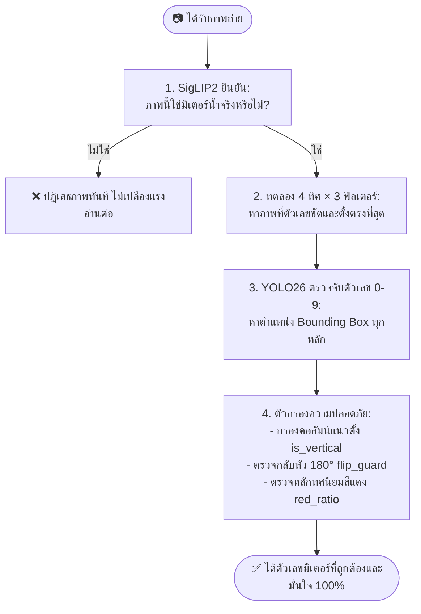

# 📖 คู่มือเรียนรู้: สร้างระบบอ่านเลขมิเตอร์น้ำด้วย AI ฉบับนักศึกษาและมือใหม่
> **เป้าหมาย:** เข้าใจหลักการคิด (Concept), คำศัพท์สำคัญ (Glossary) และลงมือสร้าง AI อ่านมิเตอร์น้ำจริงทีละขั้นตอนแบบไม่หลงทาง

---

## 🧭 สารบัญการเรียนรู้

1. [บทนำ: ปัญหาคืออะไร และ AI มองภาพอย่างไร?](#บทที่-1-ปัญหาคืออะไร-และ-ai-มองภาพอย่างไร)
2. [คำศัพท์เทคนิคเข้าใจง่ายใน 1 นาที (Glossary)](#บทที่-2-คำศัพท์เทคนิคเข้าใจง่ายใน-1-นาที-glossary)
3. [แผนที่การทำงานของระบบ (Mental Model)](#บทที่-3-แผนที่การทำงานของระบบ-mental-model)
4. [เตรียมโต๊ะทำงานด้วย `uv` และ Python 3.11](#บทที่-4-เตรียมโต๊ะทำงานด้วย-uv-และ-python-311)
5. [ผ่าโครงสร้างโค้ดทีละชิ้นส่วน (Step-by-Step Code)](#บทที่-5-ผ่าโครงสร้างโค้ดทีละชิ้นส่วน-step-by-step)
   * 5.1 ตั้งค่าพารามิเตอร์ (Constants)
   * 5.2 โหลดสมอง AI (Lazy Model Loaders)
   * 5.3 จัดการภาพและแปลงพิกัดเรขาคณิต (Image & Geometry)
   * 5.4 ตรวจจับตัวเลขและค้นหามุมที่ดีที่สุด (Detection Engine)
   * 5.5 กฎความปลอดภัยกันอ่านผิด (Safety Guards)
   * 5.6 รวมฟังก์ชันหลักและการเปิดบริการ REST API
6. [คู่มือการแก้ปัญหาเมื่อ AI อ่านผิด (Debugging Guide)](#บทที่-6-คู่มือการแก้ปัญหาเมื่อ-ai-อ่านผิด-debugging-guide)

---

## บทที่ 1: ปัญหาคืออะไร และ AI มองภาพอย่างไร?

การให้คอมพิวเตอร์อ่านเลขมิเตอร์น้ำจริงจากภาพถ่ายมือถือนั้น **ยากกว่าที่คิด** เพราะในชีวิตจริงเราจะเจอปัญหาเหล่านี้:
1. **ภาพถ่ายตะแคงหรือกลับหัว:** คนถ่ายอาจถือกล้องแนวตั้งหรือแนวนอน
2. **แสงสะท้อนและตัวเลขจาง:** มิเตอร์เก่าเป็นรอย มีคราบน้ำ หรืออยู่ในมุมมืด
3. **มีข้อความหลอกบนหน้าปัด:** เช่น วันที่ผลิต, เลขซีเรียลนัมเบอร์ปั๊มแนวดิ่ง, หรือยี่ห้อมิเตอร์
4. **ตัวเลขกลับหัวหลอกตา:** เลข $6$ พลิกหัวเป็น $9$, เลข $2$ พลิกคล้าย $5$, เลข $0, 1, 8$ พลิกแล้วหน้าตาเหมือนเดิม

```
ภาพถ่ายจริงหน้างาน  ──>  [มีแสงสะท้อน / ตะแคง 90° / เลขจาง]
                               ↓
หากใช้ OCR ทั่วไป   ──>  [อ่านไม่ออก หรือ อ่านเลขกลับหัว]
                               ↓
สิ่งที่เราต้องทำ     ──>  [ล้างภาพ + หมุนหาทิศ + AI ตรวจสอบ 4 ชั้น]
```

---

## บทที่ 2: คำศัพท์เทคนิคเข้าใจง่ายใน 1 นาที (Glossary)

ก่อนเริ่มเขียนโค้ด มาทำความเข้าใจคำศัพท์เหล่านี้ด้วยการเปรียบเทียบกับชีวิตประจำวัน:

| คำศัพท์ | ความหมายภาษาคน | เปรียบเหมือนกับ... |
|---|---|---|
| **Python Virtual Environment (`venv`)** | โฟลเดอร์ที่แยกชุดคำสั่งและไลบรารีของโปรเจกต์นี้ไว้ต่างหาก | **กล่องเครื่องมือเฉพาะงาน** เพื่อไม่ให้เครื่องมือปนกับโปรเจกต์อื่น |
| **`uv`** | โปรแกรมจัดการ Python ยุคใหม่ที่เร็วกว่า `pip` 10-100 เท่า | **เครื่องมือช่างความเร็วสูง** ที่ช่วยติดตั้งและรันโปรแกรม |
| **OpenCV (`cv2`)** | ไลบรารีสำหรับจัดการภาพดิจิทัล (ตัด, หมุน, ปรับแสง, แปลงสี) | **แว่นตาและเครื่องมือแต่งภาพ** ที่ช่วยปรับภาพให้ AI มองเห็นชัดที่สุด |
| **Image Preprocessing** | กระบวนการตกแต่งภาพก่อนส่งให้ AI (เช่น ปรับคอนทราสต์) | **การเช็ดกระจกแว่นตา** ให้ใสก่อนจะอ่านหนังสือ |
| **ROI (Region of Interest)** | พื้นที่เฉพาะส่วนที่เราสนใจในภาพ (เช่น กรอบตัวเลขมิเตอร์) | **การเอาปากกาไฮไลต์** ตีกรอบเฉพาะข้อความที่ต้องการอ่าน |
| **Bounding Box (`bbox`)** | พิกัดสี่เหลี่ยม `[x1, y1, x2, y2]` ที่ล้อมรอบวัตถุ | **กรอบสี่เหลี่ยม** ที่ระบุตำแหน่งว่าตัวเลขนั้นอยู่ตรงไหนในภาพ |
| **Model Inference** | การนำภาพส่งเข้าไปให้โมเดล AI ประมวลผลและตอบคำตอบออกมา | **การนำข้อสอบไปให้ผู้เชี่ยวชาญตรวจ** แล้วรอฟังคำตอบ |
| **Zero-Shot Classification** | ความสามารถของ AI ในการจำแนกภาพโดยไม่ต้องเทรนภาพตัวอย่างนั้นมาก่อน | **คนที่รอบรู้รอบตัว** ถามอะไรก็ตอบได้ตามคำอธิบายภาษาธรรมชาติ |
| **IoU (Intersection over Union)** | ค่าอัตราส่วนพื้นที่ทับซ้อนของ 2 กล่อง (ใช้เช็คว่าเจอกล่องซ้ำไหม) | **การดูว่ากระดาษสองแผ่นวางทับซ้อนกันกี่เปอร์เซ็นต์** |

---

## บทที่ 3: แผนที่การทำงานของระบบ (Mental Model)

ระบบของเราแบ่งการทำงานออกเป็น **4 ประตูคัดกรอง** เลียนแบบสายตาและการคิดของมนุษย์:



---

## บทที่ 4: เตรียมโต๊ะทำงานด้วย `uv` และ Python 3.11

> [!IMPORTANT]
> ระบบนี้ทำงานได้ดีที่สุดบน **Python 3.11** เราจะใช้เครื่องมือชื่อ **`uv`** ในการเตรียมสภาพแวดล้อม

### 1. สร้าง Virtual Environment ด้วย Python 3.11
เปิด Terminal (หรือ PowerShell) ในโฟลเดอร์โปรเจกต์:
```powershell
uv venv --python 3.11
```

เปิดใช้งาน Virtual Environment:
* **Windows (PowerShell):** `.venv\Scripts\Activate.ps1`
* **Windows (Command Prompt):** `.venv\Scripts\activate.bat`
* **macOS / Linux:** `source .venv/bin/activate`

### 2. ติดตั้งไลบรารีที่จำเป็นผ่าน `uv`
สร้างไฟล์ `requirements.txt` ที่มีรายการต่อไปนี้:
```text
fastapi>=0.115.0
uvicorn[standard]>=0.34.0
python-multipart>=0.0.20
ultralytics>=8.3.0
transformers>=4.48.0
torch>=2.4.0
torchvision>=0.19.0
opencv-python-headless>=4.10.0
numpy>=1.26.0
pillow>=10.4.0
gradio>=5.0.0
httpx>=0.28.0
```

ติดตั้งลงใน Environment ด้วยคำสั่งเดียว:
```powershell
uv pip install -r requirements.txt
```

---

## บทที่ 5: ผ่าโครงสร้างโค้ดทีละชิ้นส่วน (Step-by-Step)

เราจะเปิดดูและเขียนโค้ดใน `main.py` ทีละส่วน พร้อมอธิบายว่า **ทำไมต้องเขียนบรรทัดนี้**

---

### 5.1 กำหนดค่าคงที่ (Constants) — ควบคุมทุกอย่างจากจุดเดียว

แทนที่จะกระจายตัวเลขไว้ตามฟังก์ชันต่างๆ เราจะรวมค่าคงที่ไว้ที่ส่วนบนสุดของไฟล์:

```python
from __future__ import annotations

import io
from time import perf_counter
from typing import Any

import cv2
import numpy as np
import torch
from fastapi import FastAPI, File, HTTPException, UploadFile
from fastapi.middleware.cors import CORSMiddleware
from PIL import Image
from starlette.concurrency import run_in_threadpool
import uvicorn

# ---------------------------------------------------------
# 1. Device & YOLO Settings
# ---------------------------------------------------------
DEVICE = "cuda" if torch.cuda.is_available() else "cpu"
YOLO_MODEL = "weights/MeterOCR.pt"  # ตำแหน่งไฟล์น้ำหนักโมเดล
YOLO_IMGSZ = 960                   # ปรับขนาดภาพเข้าโมเดล (ภาพชัดขึ้น)
YOLO_CONF = 0.35                   # เกณฑ์ความมั่นใจขั้นต่ำของ YOLO
CONF_RELIABLE = 0.60               # ถ้าความมั่นใจเกิน 0.60 ถือว่าเชื่อถือได้
EXPECTED_MIN_DIGITS = 4            # มิเตอร์น้ำทั่วไปมีอย่างน้อย 4 หลัก
EXPECTED_MAX_DIGITS = 9            # และไม่เกิน 9 หลัก

# ---------------------------------------------------------
# 2. Search Space (การค้นหามุมและฟิลเตอร์)
# ---------------------------------------------------------
ROTATION_ANGLES = (0, 90, 180, 270)       # 4 ทิศทางที่ภาพอาจตะแคง
PREP_LIST = ("orig", "clahe", "histeq")   # ภาพเดิม, ปรับคมเฉพาะจุด, ปรับสว่างทั้งภาพ
CLAHE_CLIP = 2.0
CLAHE_GRID = (8, 8)

# ---------------------------------------------------------
# 3. Safety Guards (ตัวช่วยตรวจจับความปลอดภัย)
# ---------------------------------------------------------
ORIENT_MARGIN = 0.12               # มุมอื่นต้องชนะมุม 0° เกิน 0.12 ถึงจะยอมสลับมุม
FLIP_GUARD_CONF = 0.60             # ถ้าอ่านแบบกลับหัว 180° แล้วได้ความมั่นใจเกินนี้ จะเริ่มตรวจสอบ
FLIP_MAP = {0: 0, 1: 1, 2: 5, 5: 2, 6: 9, 8: 8, 9: 6}  # ตารางเลขสมมาตร
ALIGN_MAX_SPREAD = 0.10            # การเบี่ยงเบนแนวระนาบของตัวเลข
RED_THRESH = 0.08                  # สัดส่วนสีแดงขั้นต่ำ
RED_DOMINANCE = 2.0                # อัตราส่วนความเด่นของสีแดง
MIN_CROP_PX = 4

# ---------------------------------------------------------
# 4. Zero-Shot Verification (SigLIP2)
# ---------------------------------------------------------
SIGLIP_MODEL = "google/siglip2-base-patch16-224"
METER_LABELS = (
    "water meter",
    "electricity meter",
    "gas meter",
    "not a meter",
)
METER_VERIFY_CONF = 0.50
```

---

### 5.2 โหลดสมอง AI (Lazy Loading) — ไม่เปลือง RAM

เราใช้เทคนิค **Lazy Loading** คือ ไม่โหลดโมเดลตอนเปิดโปรแกรม แต่จะโหลดเมื่อมีภาพแรกเข้ามา:

```python
_yolo = None
_siglip = None

def get_yolo() -> Any:
    """โหลดโมเดล YOLO เมื่อถูกเรียกใช้ครั้งแรก พร้อม warm-up ภาพเปล่า 1 ครั้ง"""
    global _yolo
    if _yolo is None:
        from ultralytics import YOLO
        _yolo = YOLO(YOLO_MODEL)
        _yolo.predict(np.zeros((640, 640, 3), dtype=np.uint8), verbose=False)
    return _yolo

def get_siglip() -> tuple[Any, Any]:
    """โหลดโมเดล SigLIP2 (Processor + Model) เข้า GPU/CPU"""
    global _siglip
    if _siglip is None:
        from transformers import AutoModel, AutoProcessor
        processor = AutoProcessor.from_pretrained(SIGLIP_MODEL)
        model = AutoModel.from_pretrained(SIGLIP_MODEL).to(DEVICE).eval()
        _siglip = (processor, model)
    return _siglip
```

---

### 5.3 จัดการภาพและแปลงพิกัดเรขาคณิต (Image & Geometry)

#### ก. การหมุนภาพและปรับคอนทราสต์
```python
def rotate_image(img_bgr: np.ndarray, angle: int) -> np.ndarray:
    """หมุนภาพ 90°, 180°, 270° ตามเข็มนาฬิกา"""
    if angle == 90:
        return cv2.rotate(img_bgr, cv2.ROTATE_90_CLOCKWISE)
    if angle == 180:
        return cv2.rotate(img_bgr, cv2.ROTATE_180)
    if angle == 270:
        return cv2.rotate(img_bgr, cv2.ROTATE_90_COUNTERCLOCKWISE)
    return img_bgr

def apply_prep(img_bgr: np.ndarray, prep: str) -> np.ndarray:
    """ปรับแสง: CLAHE (เพิ่มคอนทราสต์เฉพาะจุด) หรือ HistEq (ปรับเฉลี่ยทั้งภาพ)"""
    if prep == "clahe":
        lab = cv2.cvtColor(img_bgr, cv2.COLOR_BGR2LAB)
        l, a, b = cv2.split(lab)
        l_clahe = cv2.createCLAHE(CLAHE_CLIP, CLAHE_GRID).apply(l)
        return cv2.cvtColor(cv2.merge([l_clahe, a, b]), cv2.COLOR_LAB2BGR)

    if prep == "histeq":
        ycrcb = cv2.cvtColor(img_bgr, cv2.COLOR_BGR2YCrCb)
        y, cr, cb = cv2.split(ycrcb)
        y_eq = cv2.equalizeHist(y)
        return cv2.cvtColor(cv2.merge([y_eq, cr, cb]), cv2.COLOR_YCrCb2BGR)

    return img_bgr
```

#### ข. การแปลงพิกัดจุดเดี่ยว (`remap_point`) และกล่อง (`remap_bbox`)
เมื่อตรวจจับบนภาพที่หมุน 90° พิกัด $(x, y)$ จะเปลี่ยนไป เราต้องมีสูตรแปลงจุดกลับมาที่เดิม:

```python
def remap_point(x: float, y: float, angle: int, w: int, h: int) -> tuple[float, float]:
    """แปลงจุด 1 จุดจากภาพหมุน กลับสู่ภาพตั้งต้น"""
    if angle == 90:  return y, h - x      # แกนสลับ: x กลายเป็น y เดิม
    if angle == 180: return w - x, h - y  # กลับหัวทั้งสองแกน
    if angle == 270: return w - y, x      # แกนสลับตรงกันข้าม
    return x, y

def remap_bbox(bbox: list[float], angle: int, w: int, h: int) -> list[float]:
    """แปลงมุมทั้ง 2 มุมของกล่องสี่เหลี่ยม แล้วหาจุด min/max เพื่อสร้างกรอบที่ถูกต้อง"""
    x1, y1, x2, y2 = bbox
    p1_x, p1_y = remap_point(x1, y1, angle, w, h)
    p2_x, p2_y = remap_point(x2, y2, angle, w, h)
    return [
        min(p1_x, p2_x),
        min(p1_y, p2_y),
        max(p1_x, p2_x),
        max(p1_y, p2_y),
    ]
```

#### ค. ตัดกล่องซ้อน (IoU Dedup) และตรวจสัดส่วนสีแดง (`red_ratio`)
```python
def iou(box1: list[float], box2: list[float]) -> float:
    """คำนวณพื้นที่ทับซ้อนของ 2 กล่อง"""
    x1, y1 = max(box1[0], box2[0]), max(box1[1], box2[1])
    x2, y2 = min(box1[2], box2[2]), min(box1[3], box2[3])
    intersection = max(0, x2 - x1) * max(0, y2 - y1)
    area1 = (box1[2] - box1[0]) * (box1[3] - box1[1])
    area2 = (box2[2] - box2[0]) * (box2[3] - box2[1])
    union = area1 + area2 - intersection
    return (intersection / union) if union > 0 else 0.0

def dedup_detections(dets: list[dict[str, Any]], thresh: float = 0.45) -> list[dict[str, Any]]:
    """ลบกล่องที่ซ้อนทับกันเกิน 45% โดยเก็บกล่องที่มั่นใจสูงสุดไว้"""
    kept: list[dict[str, Any]] = []
    for d in sorted(dets, key=lambda x: x["confidence"], reverse=True):
        if not any(iou(d["bbox"], k["bbox"]) > thresh for k in kept):
            kept.append(d)
    return sorted(kept, key=lambda x: x["center_x"])

def red_ratio(img_bgr: np.ndarray, bbox: list[float]) -> float:
    """คำนวณสัดส่วนสีแดงในกล่องตัวเลข (หลักทศนิยมมิเตอร์น้ำจะเป็นสีแดงและอยู่ขวาสุด)"""
    x1, y1, x2, y2 = [int(v) for v in bbox]
    pad_x = max(1, int((x2 - x1) * 0.15))
    pad_y = max(1, int((y2 - y1) * 0.15))

    crop = img_bgr[
        max(0, y1 + pad_y): min(img_bgr.shape[0], y2 - pad_y),
        max(0, x1 + pad_x): min(img_bgr.shape[1], x2 - pad_x),
    ]
    if crop.size == 0:
        return 0.0

    hsv = cv2.cvtColor(crop, cv2.COLOR_BGR2HSV)
    mask1 = cv2.inRange(hsv, (0, 40, 40), (12, 255, 255))
    mask2 = cv2.inRange(hsv, (165, 40, 40), (180, 255, 255))
    red_mask = mask1 | mask2

    return float(np.mean(red_mask > 0))
```

---

### 5.4 ตรวจจับตัวเลขและค้นหามุมที่ดีที่สุด (Detection Engine)

```python
def detect_digits(img_bgr: np.ndarray) -> list[dict[str, Any]]:
    """ใช้ YOLO หาตัวเลข 0-9 และเรียงลำดับจากซ้ายไปขวา"""
    res = get_yolo().predict(
        img_bgr,
        imgsz=YOLO_IMGSZ,
        conf=YOLO_CONF,
        device=DEVICE,
        verbose=False,
    )
    boxes = []
    for b in res[0].boxes:
        x1, y1, x2, y2 = b.xyxy[0].tolist()
        boxes.append({
            "digit": int(b.cls[0].item()),
            "confidence": float(b.conf[0].item()),
            "bbox": [x1, y1, x2, y2],
            "center_x": (x1 + x2) / 2.0,
            "center_y": (y1 + y2) / 2.0,
        })
    return sorted(boxes, key=lambda d: d["center_x"])

def is_vertical(dets: list[dict[str, Any]], img_w: int, img_h: int) -> dict[str, Any]:
    """ตรวจว่ากล่องเรียงตัวเป็นแนวตั้งหรือไม่ (แถวมิเตอร์แนวนอน width_span ต้องยาวกว่า height_span)"""
    if len(dets) < 2:
        return {"vertical": False}

    xs = [d["center_x"] / img_w for d in dets]
    ys = [d["center_y"] / img_h for d in dets]

    width_span = max(xs) - min(xs)   # ความกว้างของแนวตัวเลข
    height_span = max(ys) - min(ys)  # ความสูงของแนวตัวเลข

    # ถ้าความสูงมากกว่าความกว้าง แสดงว่าเป็นคอลัมน์แนวดิ่ง (เช่น วันที่/รุ่น)
    is_vert = (height_span >= width_span * 0.8) or (width_span <= 0.05 and height_span >= 0.08)
    return {"vertical": is_vert}

def eval_orientation(bgr_img: np.ndarray, angle: int, prep: str) -> dict[str, Any]:
    """ประเมินคะแนนของ 1 มุม × 1 ฟิลเตอร์"""
    rot = rotate_image(bgr_img, angle)
    proc = apply_prep(rot, prep)
    dets = dedup_detections(detect_digits(proc))

    rh, rw = rot.shape[:2]
    vert = is_vertical(dets, rw, rh)
    n = len(dets)

    if not dets or vert["vertical"] or not (EXPECTED_MIN_DIGITS <= n <= EXPECTED_MAX_DIGITS):
        return {"score": 0.0, "dets": dets, "prep": prep, "vert": vert}

    mean_conf = float(np.mean([d["confidence"] for d in dets]))
    score = mean_conf * n

    # กฎสีแดง: หลักทศนิยมสีแดงต้องอยู่ขวาสุดเสมอ
    r_first = red_ratio(proc, dets[0]["bbox"])
    r_last = red_ratio(proc, dets[-1]["bbox"])

    if r_first > RED_THRESH and r_first > r_last * RED_DOMINANCE:
        score *= 0.5   # แดงอยู่ซ้าย -> ภาพน่าจะกลับหัว (ตัดคะแนน)
    elif r_last > RED_THRESH and r_last > r_first * RED_DOMINANCE:
        score *= 1.05  # แดงอยู่ขวา -> ทิศทางถูกต้อง (เพิ่มคะแนน)

    return {"score": score, "dets": dets, "prep": prep, "vert": vert}

def detect_digits_best(rgb_img: np.ndarray) -> tuple[list[dict[str, Any]], dict[str, Any] | None]:
    """ทดลอง 4 ทิศ × 3 ฟิลเตอร์ (12 รูปแบบ) แล้วเลือกชุดที่คะแนนสูงสุด"""
    h, w = rgb_img.shape[:2]
    bgr = cv2.cvtColor(rgb_img, cv2.COLOR_RGB2BGR)

    candidates = {}
    for angle in ROTATION_ANGLES:
        best_in_angle = max(
            [eval_orientation(bgr, angle, prep) for prep in PREP_LIST],
            key=lambda c: c["score"],
        )
        candidates[angle] = best_in_angle

    cand0 = candidates[0]
    best_angle, best_cand = max(
        candidates.items(),
        key=lambda item: item[1]["score"],
    )

    # Margin Rule: มุมอื่นต้องชนะมุม 0° เกินกำหนด จึงยอมสลับมุม (กันพลิกฉิวเฉียด)
    if (
        best_angle != 0
        and cand0["dets"]
        and not cand0["vert"]["vertical"]
        and (best_cand["score"] - cand0["score"] < ORIENT_MARGIN)
    ):
        best_angle, best_cand = 0, cand0

    best_dets = best_cand["dets"]
    best_meta = None

    if best_dets:
        best_meta = {
            "angle": best_angle,
            "prep": best_cand["prep"],
            "clahe": best_cand["prep"] == "clahe",
        }
        for d in best_dets:
            d["bbox"] = remap_bbox(d["bbox"], best_angle, w, h)
            d["center_x"] = (d["bbox"][0] + d["bbox"][2]) / 2.0
            d["center_y"] = (d["bbox"][1] + d["bbox"][3]) / 2.0

    return best_dets, best_meta
```

---

### 5.5 กฎความปลอดภัยกันอ่านผิด (Safety Guards)

```python
@torch.inference_mode()
def check_water_meter(rgb_img: np.ndarray) -> dict[str, Any]:
    """SigLIP2 Zero-shot ตรวจสอบว่าเป็นภาพมิเตอร์น้ำจริงหรือไม่"""
    processor, model = get_siglip()

    inputs = processor(
        text=list(METER_LABELS),
        images=Image.fromarray(rgb_img),
        padding="max_length",
        return_tensors="pt",
    ).to(DEVICE)

    outputs = model(**inputs)
    probs = torch.softmax(outputs.logits_per_image, dim=1)[0].cpu().numpy()
    pred_idx = int(np.argmax(probs))
    pred_label = METER_LABELS[pred_idx]

    return {
        "verified": pred_label == "water meter" and float(probs[0]) >= METER_VERIFY_CONF,
        "predicted_class": pred_label,
        "confidence": float(probs[0]),
    }

def flip_guard(rgb_img: np.ndarray, digits: list[dict[str, Any]], meta: dict[str, Any] | None) -> dict[str, Any]:
    """ตรวจสอบภาพกลับหัวแบบกระจกสะท้อน (Mirror Check เช่น 6<->9, 2<->5)"""
    if not digits or not meta:
        return {"warned": False, "anti_reading": "", "anti_confidence": 0.0}

    anti_angle = (meta["angle"] + 180) % 360
    rot_bgr = rotate_image(cv2.cvtColor(rgb_img, cv2.COLOR_RGB2BGR), anti_angle)
    anti_dets = dedup_detections(detect_digits(apply_prep(rot_bgr, meta["prep"])))

    if not anti_dets:
        return {"warned": False, "anti_reading": "", "anti_confidence": 0.0}

    anti_reading = "".join(str(d["digit"]) for d in anti_dets)
    mean_conf = float(np.mean([d["confidence"] for d in anti_dets]))

    # เปรียบเทียบเลขหัว-ท้ายกับตาราง FLIP_MAP
    digits_rev = [d["digit"] for d in reversed(digits)]
    anti_vals = [d["digit"] for d in anti_dets]

    consistent = (
        len(anti_vals) == len(digits_rev)
        and all(
            FLIP_MAP.get(orig) == anti
            for orig, anti in zip(digits_rev, anti_vals)
            if orig in FLIP_MAP
        )
    )

    return {
        "warned": bool(mean_conf >= FLIP_GUARD_CONF and not consistent),
        "anti_reading": anti_reading,
        "anti_confidence": round(mean_conf, 4),
    }

@torch.inference_mode()
def cross_check_digits(rgb_img: np.ndarray, digits: list[dict[str, Any]], h: int, w: int, angle: int = 0) -> list[dict[str, Any]]:
    """SigLIP2 ตรวจทานเฉพาะหลักที่ YOLO มั่นใจต่ำ (< 0.60)"""
    low_conf = [d for d in digits if d["confidence"] < CONF_RELIABLE]
    if not low_conf:
        return []

    processor, model = get_siglip()
    labels = [str(i) for i in range(10)]
    mismatches = []

    for d in low_conf:
        x1, y1, x2, y2 = [int(v) for v in d["bbox"]]
        crop = rgb_img[max(0, y1): min(h, y2), max(0, x1): min(w, x2)]

        if crop.shape[0] < MIN_CROP_PX or crop.shape[1] < MIN_CROP_PX:
            continue

        if angle != 0:
            crop_bgr = cv2.cvtColor(crop, cv2.COLOR_RGB2BGR)
            crop = cv2.cvtColor(rotate_image(crop_bgr, angle), cv2.COLOR_BGR2RGB)

        inputs = processor(
            text=labels,
            images=Image.fromarray(crop),
            padding="max_length",
            return_tensors="pt",
        ).to(DEVICE)

        outputs = model(**inputs)
        probs = torch.softmax(outputs.logits_per_image, dim=1)[0].cpu().numpy()
        pred = int(np.argmax(probs))

        if pred != d["digit"]:
            mismatches.append({
                "position": d["position"],
                "yolo_digit": d["digit"],
                "siglip_digit": pred,
                "siglip_confidence": float(probs[pred]),
            })

    return mismatches
```

---

### 5.6 รวมฟังก์ชันหลักและการเปิดบริการ REST API (FastAPI)

```python
def read_meter(rgb_img: np.ndarray) -> dict[str, Any]:
    """ไปป์ไลน์หลัก: รับภาพ RGB -> ประมวลผล 4 ขั้นตอน -> ส่งผลลัพธ์พร้อมคำเตือน"""
    t0 = perf_counter()
    h, w = rgb_img.shape[:2]

    # 1. ตรวจสอบว่าใช่มิเตอร์น้ำจริงไหม
    meter = check_water_meter(rgb_img)
    if not meter["verified"]:
        return {
            "reading": "",
            "digits": [],
            "meter_check": meter,
            "processing": None,
            "warnings": [f"ภาพนี้ไม่ใช่มิเตอร์น้ำ ({meter['predicted_class']})"],
            "elapsed_ms": round((perf_counter() - t0) * 1000, 1),
        }

    # 2. ค้นหามุมและอ่านตัวเลข
    dets, meta = detect_digits_best(rgb_img)
    if not dets:
        return {
            "reading": "",
            "digits": [],
            "meter_check": meter,
            "processing": meta,
            "warnings": ["ตรวจไม่พบตัวเลข"],
            "elapsed_ms": round((perf_counter() - t0) * 1000, 1),
        }

    digits = [{
        "position": i,
        "digit": d["digit"],
        "confidence": round(d["confidence"], 4),
        "bbox": d["bbox"],
        "reliable": d["confidence"] >= CONF_RELIABLE,
    } for i, d in enumerate(dets, 1)]
    mean_conf = float(np.mean([d["confidence"] for d in digits]))

    # 3. ตรวจสอบว่าไม่ใช่คอลัมน์แนวตั้ง (เช่น วันที่)
    if meta and meta["angle"] == 0 and is_vertical(dets, w, h)["vertical"]:
        return {
            "reading": "",
            "digits": [],
            "meter_check": meter,
            "processing": meta,
            "warnings": ["กล่องเรียงแนวตั้ง — ไม่ใช่ค่ามิเตอร์"],
            "elapsed_ms": round((perf_counter() - t0) * 1000, 1),
        }

    # 4. ตรวจสอบความถูกต้องและสร้างคำเตือน
    flip = flip_guard(rgb_img, digits, meta)
    align_vals = [
        (d["bbox"][0] + d["bbox"][2]) / (2 * w)
        if meta and meta["angle"] in (90, 270)
        else (d["bbox"][1] + d["bbox"][3]) / (2 * h)
        for d in digits
    ]
    align_ok = float(np.std(align_vals)) <= ALIGN_MAX_SPREAD
    mismatches = cross_check_digits(rgb_img, digits, h, w, meta["angle"] if meta else 0)

    warns = [
        msg
        for cond, msg in [
            (
                not (EXPECTED_MIN_DIGITS <= len(digits) <= EXPECTED_MAX_DIGITS),
                f"จำนวนหลัก {len(digits)} นอกช่วง {EXPECTED_MIN_DIGITS}-{EXPECTED_MAX_DIGITS}",
            ),
            (digits[0]["digit"] == 0, "หลักแรกเป็น 0 — อาจเกินมา 1 หลัก"),
            (mean_conf < CONF_RELIABLE, f"mean conf ต่ำ {mean_conf:.2f} — ภาพอาจเบลอ/เอียง"),
            (
                flip["warned"],
                f"อาจกลับหัว! หมุน 180° ได้ {flip['anti_reading']} ({flip['anti_confidence']:.2f}) — ตรวจภาพก่อนบันทึก",
            ),
            (not align_ok, "กล่องไม่เรียงแนว — อาจเป็นป้าย/วันที่"),
        ]
        if cond
    ]
    warns += [
        f"หลักที่ {d['position']} ({d['digit']}) conf ต่ำ {d['confidence']:.2f} — ควรตรวจด้วยตา"
        for d in digits
        if not d["reliable"]
    ]
    warns += [
        f"หลักที่ {m['position']}: YOLO {m['yolo_digit']} vs SigLIP {m['siglip_digit']} ({m['siglip_confidence']:.2f})"
        for m in mismatches
    ]

    return {
        "reading": "".join(str(d["digit"]) for d in digits),
        "digits": digits,
        "mean_confidence": round(mean_conf, 4),
        "meter_check": meter,
        "processing": {"best": meta},
        "warnings": warns,
        "elapsed_ms": round((perf_counter() - t0) * 1000, 1),
    }

# ---------------------------------------------------------
# FastAPI Web Service
# ---------------------------------------------------------
app = FastAPI(
    title="Meter Reader API",
    version="1.1",
    description="API อ่านเลขมิเตอร์น้ำอัตโนมัติ (Intuitive Functional Pipeline)",
)
app.add_middleware(
    CORSMiddleware,
    allow_origins=["*"],
    allow_methods=["*"],
    allow_headers=["*"],
)
ALLOWED_TYPES = {"image/jpeg", "image/png", "image/webp", "image/bmp"}

@app.get("/api/health")
def health() -> dict[str, Any]:
    return {
        "status": "ok",
        "device": DEVICE,
        "yolo_loaded": _yolo is not None,
        "siglip_loaded": _siglip is not None,
    }

@app.post("/api/read-meter")
async def read_meter_endpoint(file: UploadFile = File(...)) -> dict[str, Any]:
    if file.content_type not in ALLOWED_TYPES:
        raise HTTPException(status_code=415, detail="ชนิดไฟล์ไม่รองรับ")

    data = await file.read()
    try:
        img = Image.open(io.BytesIO(data))
        img.load()
        arr = np.asarray(img.convert("RGB"))
    except Exception:
        raise HTTPException(status_code=422, detail="อ่านไฟล์ภาพไม่ได้")

    return await run_in_threadpool(read_meter, arr)

if __name__ == "__main__":
    uvicorn.run("main:app", host="127.0.0.1", port=8000, reload=True)
```

---

## บทที่ 6: คู่มือการแก้ปัญหาเมื่อ AI อ่านผิด (Debugging Guide)

| อาการที่พบ (Symptom) | สาเหตุที่เป็นไปได้ (Root Cause) | วิธีตรวจสอบและแก้ไข (Solution) |
|---|---|---|
| **ตอบว่า "ภาพนี้ไม่ใช่มิเตอร์น้ำ"** | ถ่ายภาพไกลเกินไป หรือเห็นฉากหลังเยอะกว่าหน้าปัด | ครอปภาพให้เห็นหน้าปัดมิเตอร์ชัดเจนขึ้น หรือปรับลดเกณฑ์ `METER_VERIFY_CONF` ใน `main.py` |
| **ตัวเลขหายไป 1-2 หลัก** | แสงมืดไป หรือหน้าปัดเป็นฝ้า | ระบบจะลองใช้ฟิลเตอร์ `CLAHE` และ `HistEq` ให้อัตโนมัติ หากยังไม่ติด ให้ลองลดค่า `YOLO_CONF` ลงเล็กน้อย เช่น 0.30 |
| **อ่านได้เลขกลับหัว เช่น 9 เป็น 6** | ภาพถ่ายคว่ำ 180° และไม่มีทศนิยมสีแดงให้สังเกต | ดูที่กล่อง `warnings` ระบบจะแจ้งเตือน `⚠️ อาจกลับหัว` เพื่อให้คนตรวจทานก่อนบันทึก |
| **AI ไปอ่านป้ายวันที่ข้างตัวเรือน** | มีตัวเลขพิมพ์ในแนวตั้งบนตัวถังมิเตอร์ | ฟังก์ชัน `is_vertical()` จะตรวจจับ `height_span >= width_span` และตัดทิ้งให้อัตโนมัติ |
