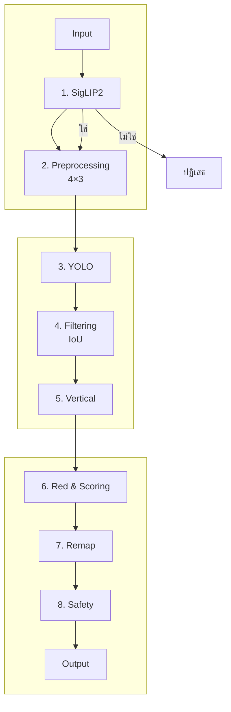
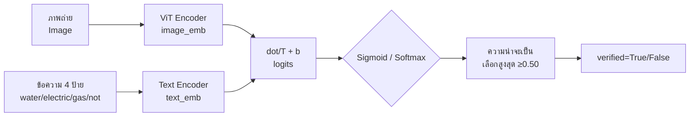
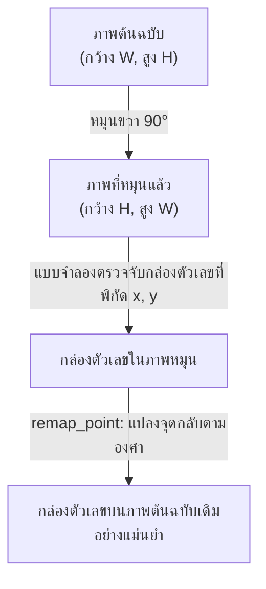
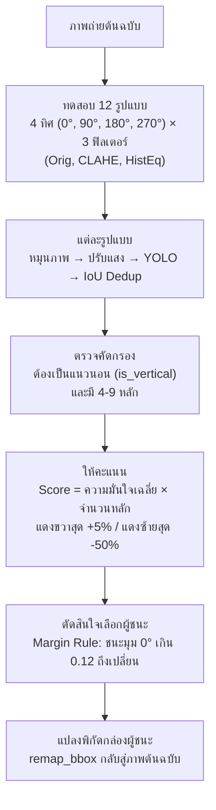
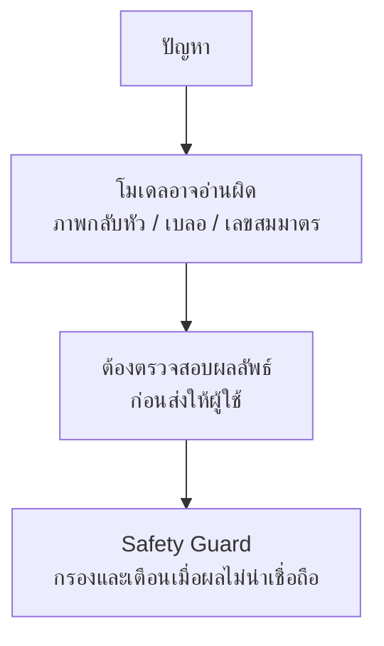

<p align="center"></p>

<p align="center"><strong>เอกสารประกอบการสอน</strong></p>
<p align="center"><strong>ระบบอ่านค่ามิเตอร์น้ำด้วยเทคโนโลยีการรู้จำอักขระด้วยแสง</strong></p>
<p align="center"><strong>Water Meter OCR</strong></p>

<p align="center"><strong>นายจิรเมธ ทองเปลว รหัสประจำตัว 674230013</strong></p>
<p align="center">หมู่เรียน 67/44</p>
<p align="center">โครงงานนี้เป็นส่วนหนึ่งของการศึกษารายวิชา 7203602</p>
<p align="center">สาขาวิชาเทคโนโลยีสารสนเทศ คณะวิทยาศาสตร์และเทคโนโลยี</p>
<p align="center">มหาวิทยาลัยราชภัฏนครปฐม</p>
<p align="center">ภาคเรียนที่ 1 ปีการศึกษา 2569</p>

<div style="page-break-after: always;"></div>

## คำนำ

&emsp;&emsp;&emsp;&emsp;คู่มือฉบับนี้จัดทำขึ้นเพื่อใช้เป็นแนวทางในการศึกษาและพัฒนาระบบอ่านค่ามาตรวัดน้ำอัตโนมัติจากภาพถ่าย โดยประยุกต์ใช้เทคโนโลยีปัญญาประดิษฐ์ (Artificial Intelligence) การประมวลผลภาพ (Image Processing) และการรู้จำอักขระจากภาพ (Optical Character Recognition: OCR) เพื่อเพิ่มประสิทธิภาพในการอ่านและจัดเก็บข้อมูลจากมาตรวัดน้ำ ตลอดจนเป็นแนวทางสำหรับผู้ที่สนใจนำเทคโนโลยีดังกล่าวไปประยุกต์ใช้ในการพัฒนาระบบอัตโนมัติในลักษณะอื่นต่อไป

&emsp;&emsp;&emsp;&emsp;เนื้อหาของคู่มือฉบับนี้ครอบคลุมกระบวนการพัฒนาระบบอ่านค่ามาตรวัดน้ำอัตโนมัติอย่างเป็นลำดับ ตั้งแต่การรับและเตรียมข้อมูลภาพ การตรวจสอบและคัดกรองข้อมูล การปรับปรุงคุณภาพของภาพถ่ายด้วยเทคนิคการประมวลผลภาพ การตรวจจับตัวเลขบนหน้าปัดมาตรวัดน้ำ การอ่านและรู้จำตัวเลขด้วยเทคนิค OCR ตลอดจนการประมวลผลและส่งออกผลลัพธ์ของระบบ นอกจากนี้ ยังครอบคลุมการประยุกต์ใช้แบบจำลอง YOLO และ SigLIP2 รวมถึงการให้บริการแบบจำลองผ่าน FastAPI และการพัฒนาส่วนติดต่อผู้ใช้ด้วย Gradio เพื่อให้สามารถทดสอบการทำงานของระบบได้อย่างครบถ้วน

&emsp;&emsp;&emsp;&emsp;ผู้จัดทำได้เรียบเรียงเนื้อหาและตัวอย่างการพัฒนาระบบโดยอาศัยการศึกษาค้นคว้าจากเอกสารทางวิชาการ งานวิจัย โครงการโอเพนซอร์ส และแหล่งข้อมูลทางเทคนิคที่เกี่ยวข้อง โดยจัดลำดับเนื้อหาให้มีความต่อเนื่องและสัมพันธ์กันตามกระบวนการทำงานของระบบ เพื่อให้ผู้อ่านสามารถศึกษา ทำความเข้าใจ และนำแนวทางรวมถึงตัวอย่างโค้ดไปประยุกต์ใช้ได้อย่างถูกต้องและเหมาะสม คู่มือฉบับนี้มุ่งหวังให้เป็นประโยชน์ต่อนักพัฒนาซอฟต์แวร์ นักศึกษา วิศวกรปัญญาประดิษฐ์ และผู้สนใจด้านคอมพิวเตอร์วิทัศน์ ตลอดจนผู้ที่ต้องการศึกษาแนวทางการประยุกต์ใช้ปัญญาประดิษฐ์เพื่อพัฒนาระบบอ่านข้อมูลจากภาพ

&emsp;&emsp;&emsp;&emsp;ผู้จัดทำหวังเป็นอย่างยิ่งว่าคู่มือฉบับนี้จะเป็นประโยชน์ต่อการศึกษาและการพัฒนาระบบอ่านค่ามาตรวัดน้ำอัตโนมัติ รวมทั้งสามารถนำองค์ความรู้และแนวทางที่นำเสนอไปประยุกต์ใช้ในการพัฒนาระบบที่เกี่ยวข้องกับการตรวจจับและรู้จำข้อมูลจากภาพในอนาคต หากมีข้อเสนอแนะอันเป็นประโยชน์ต่อการปรับปรุงคู่มือฉบับนี้ ผู้จัดทำขอน้อมรับด้วยความขอบพระคุณยิ่ง

<p align="right">นายจิรเมธ ทองเปลว</p>
<p align="right">สิงหาคม 2569</p>

<div style="page-break-after: always;"></div>

# คู่มือการพัฒนาระบบอ่านค่ามาตรวัดน้ำอัตโนมัติด้วยปัญญาประดิษฐ์
## Automated Water Meter Reading System using Deep Learning & Computer Vision

&emsp;&emsp;&emsp;&emsp;คู่มือฉบับนี้จัดทำขึ้นสำหรับนักศึกษาที่มีพื้นฐานการเขียนโปรแกรมภาษา Python และมุ่งเน้นการศึกษาแนวทางการพัฒนาระบบอ่านค่ามาตรวัดน้ำอัตโนมัติจากภาพถ่าย (Water Meter OCR) โดยประยุกต์ใช้เทคโนโลยีปัญญาประดิษฐ์และคอมพิวเตอร์วิทัศน์ เพื่อให้ผู้ศึกษาสามารถทำความเข้าใจสถาปัตยกรรมและกระบวนการทำงานในแต่ละขั้นตอนอย่างเป็นระบบ ผ่านการออกแบบรหัสต้นฉบับที่เป็นฟังก์ชันย่อยตามหน้าที่ (Functional Modular Design) ซึ่งช่วยให้สามารถศึกษา วิเคราะห์ และทดสอบการทำงานได้อย่างมีประสิทธิภาพ

> **เทคโนโลยีหลักที่ประยุกต์ใช้ในโครงงาน:** Python, YOLO (แบบจำลองตรวจจับตัวเลข), SigLIP2 (แบบจำลองคัดกรองประเภทภาพ), OpenCV (การประมวลผลภาพดิจิทัล), FastAPI (บริการส่วนเชื่อมต่อโปรแกรมประยุกต์), Gradio (ส่วนติดต่อผู้ใช้บนเว็บ), และ `uv` (เครื่องมือจัดการสภาพแวดล้อมและชุดคำสั่ง)

---

## สารบัญเนื้อหา (Table of Contents)

- [ข้อแนะนำเบื้องต้นสำหรับการศึกษา ... 3](#ข้อแนะนำเบื้องต้นสำหรับการศึกษา)
- [บทที่ 1: พื้นฐาน การออกแบบ และการประมวลผลภาพ ... 4](#บทที่-1-พื้นฐาน-การออกแบบ-และการประมวลผลภาพ)
  - [1.1 ทฤษฎีและหลักการพื้นฐาน ... 4](#11-ทฤษฎีและหลักการพื้นฐาน)
    - [1.1.1 คอมพิวเตอร์วิทัศน์และการตรวจจับวัตถุ ... 4](#111-คอมพิวเตอร์วิทัศน์และการตรวจจับวัตถุ)
    - [1.1.2 การจำแนกประเภทภาพแบบซีโร่ช็อต (Zero-shot Classification) ... 4](#112-การจำแนกประเภทภาพแบบซีโร่ช็อต-zero-shot-classification)
    - [1.1.3 การประมวลผลภาพดิจิทัล ... 4](#113-การประมวลผลภาพดิจิทัล)
  - [1.2 การฝึกแบบจำลองสำหรับการตรวจจับตัวเลข ... 5](#12-การฝึกแบบจำลองสำหรับการตรวจจับตัวเลข)
    - [1.2.1 การเตรียมชุดข้อมูลจาก Roboflow ... 5](#121-การเตรียมชุดข้อมูลจาก-roboflow)
      - [ขั้นตอนการลงทะเบียน Roboflow และการรับ API Key ... 5](#ขั้นตอนการลงทะเบียน-roboflow-และการรับ-api-key)
    - [1.2.2 การฝึกแบบจำลอง YOLO ... 5](#122-การฝึกแบบจำลอง-yolo)
  - [1.3 สภาพแวดล้อมและการจัดการโครงงานด้วย `uv` ... 6](#13-สภาพแวดล้อมและการจัดการโครงงานด้วย-uv)
    - [1.3.1 โครงสร้างไฟล์ของระบบ ... 6](#131-โครงสร้างไฟล์ของระบบ)
    - [1.3.2 การสร้างสภาพแวดล้อมและการติดตั้งไลบรารี ... 6](#132-การสร้างสภาพแวดล้อมและการติดตั้งไลบรารี)
  - [1.4 การคัดกรองภาพด้วยแบบจำลอง SigLIP2 ... 7](#14-การคัดกรองภาพด้วยแบบจำลอง-siglip2)
  - [1.5 การตรวจจับและอ่านค่าตัวเลขด้วยคอมพิวเตอร์วิทัศน์ ... 7](#15-การตรวจจับและอ่านค่าตัวเลขด้วยคอมพิวเตอร์วิทัศน์)
    - [1. การหมุนภาพและการปรับปรุงคุณภาพภาพ ... 7](#1-การหมุนภาพและการปรับปรุงคุณภาพภาพ)
    - [2. การแปลงพิกัดจุดเดี่ยว (`remap_point`) และกล่องขอบเขต (`remap_bbox`) ... 7](#2-การแปลงพิกัดจุดเดี่ยว-remap_point-และกล่องขอบเขต-remap_bbox)
    - [3. การกรองแถวตัวเลขแนวตั้งด้วยฟังก์ชัน `is_vertical` ... 8](#3-การกรองแถวตัวเลขแนวตั้งด้วยฟังก์ชัน-is_vertical)
    - [4. การค้นหาทิศทางและฟิลเตอร์ที่เหมาะสมด้วยฟังก์ชัน `detect_digits_best` ... 8](#4-การค้นหาทิศทางและฟิลเตอร์ที่เหมาะสมด้วยฟังก์ชัน-detect_digits_best)
- [บทที่ 2: การพัฒนาแอปพลิเคชันและส่วนติดต่อผู้ใช้ ... 10](#บทที่-2-การพัฒนาแอปพลิเคชันและส่วนติดต่อผู้ใช้)
  - [2.1 การบูรณาการระบบประมวลผลหลักและกลไกความปลอดภัย ... 10](#21-การบูรณาการระบบประมวลผลหลักและกลไกความปลอดภัย)
    - [1. การตรวจจับภาพกลับหัวแบบสมมาตรด้วยฟังก์ชัน `flip_guard` ... 10](#1-การตรวจจับภาพกลับหัวแบบสมมาตรด้วยฟังก์ชัน-flip_guard)
    - [2. ฟังก์ชันประมวลผลหลัก `read_meter` ... 10](#2-ฟังก์ชันประมวลผลหลัก-read_meter)
  - [2.2 การพัฒนาส่วนเชื่อมต่อโปรแกรมประยุกต์ด้วย FastAPI ... 11](#22-การพัฒนาส่วนเชื่อมต่อโปรแกรมประยุกต์ด้วย-fastapi)
  - [2.3 การพัฒนาส่วนติดต่อผู้ใช้ด้วย Gradio ... 11](#23-การพัฒนาส่วนติดต่อผู้ใช้ด้วย-gradio)
  - [2.4 การทดสอบระบบและแนวทางการแก้ไขปัญหา ... 12](#24-การทดสอบระบบและแนวทางการแก้ไขปัญหา)
    - [วิธีการสั่งทำงานระบบด้วย `uv` ... 12](#วิธีการสั่งทำงานระบบด้วย-uv)
    - [แนวทางการวิเคราะห์และแก้ไขปัญหา (Debugging Matrix) ... 12](#แนวทางการวิเคราะห์และแก้ไขปัญหา-debugging-matrix)
  - [2.5 ข้อควรพิจารณาสำหรับการนำระบบไปใช้งานจริง ... 13](#25-ข้อควรพิจารณาสำหรับการนำระบบไปใช้งานจริง)
- [อภิธานศัพท์ (Glossary) ... 14](#อภิธานศัพท์-glossary)
  - [1. หมวดปัญญาประดิษฐ์และการเรียนรู้เชิงลึก ... 14](#1-หมวดปัญญาประดิษฐ์และการเรียนรู้เชิงลึก-ai--deep-learning)
  - [2. หมวดการประมวลผลภาพดิจิทัล ... 14](#2-หมวดการประมวลผลภาพดิจิทัล-digital-image-processing--opencv)
  - [3. หมวดสถาปัตยกรรมซอฟต์แวร์และเว็บ ... 14](#3-หมวดสถาปัตยกรรมซอฟต์แวร์และเว็บ-software-architecture--web)
- [บรรณานุกรมและเอกสารอ้างอิง (References) ... 15](#บรรณานุกรมและเอกสารอ้างอิง-references)
- [ภาคผนวก: มาตรการด้านความปลอดภัยและความเสถียรของระบบ ... 16](#ภาคผนวก-มาตรการด้านความปลอดภัยและความเสถียรของระบบ)
  - [ก. มาตรการด้านความปลอดภัยของระบบ ... 16](#ก-มาตรการด้านความปลอดภัยของระบบ)
  - [ข. มาตรการด้านความเสถียรและความน่าเชื่อถือ ... 16](#ข-มาตรการด้านความเสถียรและความน่าเชื่อถือ)
  - [ค. โครงสร้างระบบไฟล์ของโครงงานปัจจุบัน ... 16](#ค-โครงสร้างระบบไฟล์ของโครงงานปัจจุบัน)

---

## ข้อแนะนำเบื้องต้นสำหรับการศึกษา

&emsp;&emsp;&emsp;&emsp;โปรดศึกษาหลักการเบื้องต้นจำนวน 4 ประการดังต่อไปนี้ก่อนเริ่มดำเนินการ เพื่อให้การพัฒนาระบบเป็นไปอย่างราบรื่น:

1. **การใช้งานสภาพแวดล้อมเสมือน (Virtual Environment: `venv`):** ทำหน้าที่แยกสภาพแวดล้อมและไลบรารีของโครงงานออกจากโครงงานอื่น เพื่อป้องกันความขัดแย้งของรุ่นไลบรารี — การลบสภาพแวดล้อมดังกล่าวมิได้ส่งผลกระทบต่อระบบหลัก
2. **การจัดการไลบรารีด้วย `uv`:** คือตัวติดตั้งไลบรารีที่เขียนด้วย Rust ถูกออกแบบมาให้ติดตั้งและจัดการชุดคำสั่งได้อย่างสะดวกรวดเร็ว
3. **ตำแหน่งสำหรับการดำเนินการคำสั่ง:** เปิด Terminal และตรวจสอบว่าอยู่ที่โฟลเดอร์หลัก `meter-reader/` เสมอก่อนดำเนินการสั่งทำงานคำสั่ง `uv run python ...`
4. **การแบ่งรหัสต้นฉบับเป็นฟังก์ชันย่อยตามหน้าที่ (Functional Modular Design):** โครงงานแยกการทำงานออกเป็นฟังก์ชันย่อยที่ชัดเจน เช่น `rotate_image` (หมุนภาพ) → `apply_prep` (ปรับคอนทราสต์แสง) → `detect_digits` (ตรวจจับตัวเลข) ซึ่งแสดงลำดับการทำงานตั้งแต่การหมุนภาพ การปรับปรุงคุณภาพภาพ และการตรวจจับตัวเลขตามลำดับ โดยแต่ละฟังก์ชันมีการรับค่าเข้าและส่งค่าออกที่แน่นอน ช่วยให้การศึกษา ทดสอบ และปรับปรุงแก้ไขสามารถกระทำได้ง่ายเป็นรายส่วน

> **ข้อแนะนำการเรียนรู้:** ผู้ศึกษาสามารถทดลองสั่งทำงานระบบจริงด้วยแบบจำลองสำเร็จรูปก่อนศึกษารหัสต้นฉบับทั้งหมด โดยเปิด Terminal 2 หน้าต่าง — หน้าต่างที่ 1 สั่งทำงาน `uv run python main.py` หน้าต่างที่ 2 สั่งทำงาน `uv run python gradio_app.py` แล้วเปิดเว็บเบราว์เซอร์ที่ http://127.0.0.1:7860 เพื่อทำความเข้าใจภาพรวมการทำงานของระบบ

---

# บทที่ 1: พื้นฐาน การออกแบบ และการประมวลผลภาพ

---

### 1.1 ทฤษฎีและหลักการพื้นฐาน

&emsp;&emsp;&emsp;&emsp;**ปัญหาและความท้าทายในการพัฒนาระบบ:** ภาพถ่ายมาตรวัดน้ำจากการปฏิบัติงานจริงมีความหลากหลายและมีปัจจัยรบกวนสภาพแวดล้อมที่แตกต่างจากห้องปฏิบัติการ โดยมักพบปัญหาสำคัญ 4 ประการดังต่อไปนี้:
* **การถ่ายภาพเอียงหรือกลับหัว:** ผู้ใช้งานอาจถ่ายภาพด้วยอุปกรณ์เคลื่อนที่ในมุมเอียง 90° หรือกลับหัว 180°
* **แสงสะท้อนและตัวเลขเลือนราง:** กระจกหน้าปัดมีแสงสะท้อน คราบน้ำ หรืออยู่ในสภาพแวดล้อมที่มีแสงสว่างน้อย
* **ป้ายข้อมูลอื่นบนตัวเรือน:** ตัวเลขวันที่ผลิตหรือหมายเลขซีเรียลที่พิมพ์ในแนวตั้งบนตัวถังมาตรวัดน้ำ
* **ตัวเลขที่มีลักษณะสมมาตรเมื่อกลับหัว:** กลุ่มตัวเลข $6 \leftrightarrow 9$, $2 \leftrightarrow 5$, และ $0, 1, 8$ ที่อาจทำให้อ่านค่าผิดพลาดเมื่อภาพกลับทิศทาง

> เมื่อศึกษาส่วนนี้แล้ว ผู้ศึกษาจะสามารถอธิบายบทบาทของแต่ละเทคโนโลยีและความสัมพันธ์กับปัญหาที่ต้องการแก้ไขได้

&emsp;&emsp;&emsp;&emsp;ดังภาพที่ 1.1 แสดงภาพรวมการทำงานของระบบตั้งแต่การรับภาพถ่าย การคัดกรองด้วย SigLIP2 การประมวลผล 12 รูปแบบด้วย YOLO จนถึงกลไกความปลอดภัยก่อนส่งออกผลลัพธ์

&emsp;&emsp;&emsp;&emsp;**แผนภาพการทำงานของระบบ (Pipeline Data Flow):**



<details>
<summary> ดูเวอร์ชันข้อความ (fallback)</summary>

```text
[ ภาพถ่ายขาเข้า (Input Image) ]
 │
 ▼
[ 1. SigLIP2 Verification ] ──> ตรวจสอบประเภทของภาพว่าเป็นภาพมาตรวัดน้ำหรือไม่ (หากไม่ใช่ ปฏิเสธทันที)
 │ (ใช่)
 ▼
[ 2. Preprocessing & Search ] ──> ลองหมุน 4 ทิศ (0°, 90°, 180°, 270°) × ปรับแสง 3 แบบ (Orig, CLAHE, HistEq)
 │
 ▼
[ 3. YOLO Digit Detection ] ──> ตรวจหากล่อง Bounding Box ของตัวเลข 0-9 ทุกหลัก
 │
 ▼
[ 4. Candidate Filtering ] ──> ตัดกรอบสี่เหลี่ยมที่ซ้อนทับกันทิ้งด้วย IoU (Dedup)
 │
 ▼
[ 5. Vertical Check ] ──> ตรวจว่าแถวตัวเลขเป็นแนวนอนหรือไม่ (กรองป้ายวันที่ออก)
 │
 ▼
[ 6. Red Digit & Scoring ] ──> ตรวจหลักทศนิยมสีแดง (ต้องอยู่ขวาสุด) + ให้คะแนนเลือกมุมที่ดีที่สุด
 │
 ▼
[ 7. Coordinate Remapping ] ──> แปลงพิกัดกล่องตัวเลขจากภาพหมุน กลับสู่ระนาบภาพต้นฉบับเดิม
 │
 ▼
[ 8. Safety Guards ] ──> ตรวจกลับหัว 180° (flip_guard) + SigLIP2 ตรวจทานหลักที่ไม่มั่นใจ
 │
 ▼
[ ตัวเลขผลลัพธ์ (Final Output) ] ──> ได้ค่าตัวเลข พิกัดกล่อง ค่าความมั่นใจ และรายการคำเตือน
```
</details>

<p align="center"><strong>ภาพที่ 1.1 แผนภาพการทำงานของระบบ (Pipeline Data Flow)</strong></p>

#### 1.1.1 คอมพิวเตอร์วิทัศน์และการตรวจจับวัตถุ

&emsp;&emsp;&emsp;&emsp;**คอมพิวเตอร์วิทัศน์ (Computer Vision)** เป็นศาสตร์ที่มุ่งพัฒนาให้คอมพิวเตอร์สามารถวิเคราะห์และตีความข้อมูลจากภาพถ่ายได้เช่นเดียวกับสายตามนุษย์ ภายในศาสตร์ดังกล่าว **การตรวจจับวัตถุ (Object Detection)** คือภารกิจที่ต้องทำสองอย่างพร้อมกัน ได้แก่ (1) **การระบุตำแหน่ง (Localization)** ว่าวัตถุอยู่ที่ใด และ (2) **การจำแนกประเภท (Classification)** ว่าวัตถุดังกล่าวคืออะไร ส่วน **OCR (Optical Character Recognition)** เป็นการต่อยอดจากการตรวจจับวัตถุ เพื่อแปลงบริเวณตัวเลขในภาพให้เป็นข้อความดิจิทัลที่นำไปคำนวณหรือจัดเก็บได้ต่อไป (Zou et al., 2023)

&emsp;&emsp;&emsp;&emsp;โครงงานนี้ประยุกต์ใช้แบบจำลอง **YOLO (You Only Look Once)** ซึ่งเป็นแบบจำลองปัญญาประดิษฐ์สำหรับการตรวจจับวัตถุที่มีความเร็วระดับเวลาจริง (Real-time Object Detection) โดยมีหลักการ **มองภาพเพียงครั้งเดียวแล้วตอบทันที** แตกต่างจากแบบจำลองสองขั้นตอน (Two-stage) เช่น Faster R-CNN ที่ต้องเสนอพื้นที่ก่อนแล้วจึงจำแนก YOLO แบ่งภาพเป็นกริด ทำนายกรอบและประเภทพร้อมกันในรอบเดียว จึงเร็วและเหมาะกับงานที่ต้องประมวลผลต่อเนื่อง (Jocher et al., 2026; Zou et al., 2023)

&emsp;&emsp;&emsp;&emsp;**YOLO26 คืออะไร — สถาปัตยกรรม 3 ส่วน:** **YOLO26** (Ultralytics, 2025–2026) เป็นรุ่นต่อยอดจาก YOLOv8/YOLO11 ที่ปรับให้เป็น End-to-End Vision Model แบบ Anchor-free ประกอบด้วย (1) **Backbone (CSPDarknet)** ทำหน้าที่สกัดคุณลักษณะภาพหลายระดับ (2) **Neck (PAN-FPN)** ทำหน้าที่รวมคุณลักษณะระดับเล็ก-ใหญ่เพื่อให้เห็นทั้งเลขตัวเล็กและเลขตัวใหญ่ และ (3) **Head แบบ Anchor-free** ทำหน้าที่ทำนาย `bbox` + `confidence` + `class` โดยตรงโดยไม่ต้องพึ่งกล่องต้นแบบ จึงแม่นยำกับวัตถุขนาดเล็กและลดการปรับจูน

&emsp;&emsp;&emsp;&emsp;**ทำไมเลือก YOLO26 Nano (`yolo26n.pt`) สำหรับงานนี้:** โครงงานเลือก **YOLO26 Nano** ซึ่งเป็นรุ่นเล็กที่สุด (~2.6 ล้านพารามิเตอร์) เนื่องจากให้สมดุลระหว่างความแม่นยำและความเร็วที่เหมาะกับข้อจำกัดของงานมิเตอร์น้ำ ดังตารางที่ 1.1

&emsp;&emsp;&emsp;&emsp;**ตารางที่ 1.1 เปรียบเทียบตัวเลือกแบบจำลองสำหรับตรวจจับเลขมิเตอร์**

| ตัวเลือก | พารามิเตอร์ | VRAM ที่ใช้ | ความเร็ว (Tesla T4) | จุดแข็ง | ข้อจำกัดสำหรับงานนี้ |
|---|---|---|---|---|---|
| **YOLO26 Nano (เลือกใช้)** | ~2.6M | ~1.5 GB | ~40–60 ms | เร็วที่สุด เล็กที่สุด รันได้ทั้ง GPU/CPU | mAP ต่ำกว่า S/M เล็กน้อย |
| YOLO26 Small | ~11M | ~3 GB | ~80–110 ms | แม่นขึ้น | ช้ากว่า หนักกว่า |
| YOLO26 Medium | ~20M | ~5 GB | ~130–180 ms | แม่นสุด | ต้อง GPU แรง ไม่เหมาะกับเซิร์ฟเวอร์ขนาดเล็ก |
| Faster R-CNN | ~41M | ~6 GB+ | ~300–500 ms | แม่นกับวัตถุซ้อน | ช้ามาก ไม่ทันเวลาจริง |
| Tesseract OCR | — | ต่ำ | ~100 ms | ใช้ง่าย | ล้มเหลวเมื่อภาพเอียง/เบลอ/แสงสะท้อน — ต้องครอปเลขมาก่อน |

&emsp;&emsp;&emsp;&emsp;จากตาราง YOLO26 Nano ใช้ VRAM น้อยกว่า 2 GB จึงฝึกด้วย `batch=64` ได้บน Tesla T4 และยังประมวลผลบน CPU ได้ภายใน 1–3 วินาทีต่อภาพ แม้ความแม่นจะต่ำกว่ารุ่น Medium เล็กน้อย แต่เพียงพอสำหรับเลข 0–9 ที่มีรูปแบบจำกัด และสามารถชดเชยด้วยกลไก 12 รูปแบบ (หมุน 4 ทิศ × ปรับแสง 3 แบบ) ในระบบนี้

&emsp;&emsp;&emsp;&emsp;**เหตุผล 5 ประการที่ต้องใช้ YOLO26 สำหรับเลขมิเตอร์น้ำ:** (1) **เลขตัวเล็กและหลายหลัก** วางเรียงแนวนอน 5–7 หลัก YOLO26 เห็นวัตถุหลายชิ้นพร้อมกันด้วยกริดเดียว (2) **ภาพเบลอ/แสงสะท้อน/เงา** YOLO26 ทนต่อการบิดเบือนเพราะฝึกด้วย Mosaic/Mixup/HSV (3) **ต้องการความเร็วเวลาจริง** ต้องตอบภายใน 50–150 ms ต่อภาพบนเซิร์ฟเวอร์ภาคสนาม (4) **ต้องให้ค่าความมั่นใจต่อหลัก** เพื่อส่งต่อให้ `flip_guard` และ `cross_check_digits` ตัดสินใจ (5) **ไม่ต้องพึ่งการครอปเลขมาก่อน** ต่างจาก Tesseract ที่ต้องตัดภาพเลขให้ตรงก่อนจึงอ่านได้ — YOLO26 หาเลขจากภาพเต็มได้ทันที

&emsp;&emsp;&emsp;&emsp;คำศัพท์สำคัญ 3 รายการที่ผู้อ่านจะพบตลอดคู่มือ ได้แก่ **Bounding Box (`bbox`)** กรอบสี่เหลี่ยม `[x1, y1, x2, y2]` ที่ระบุตำแหน่งของตัวเลขแต่ละหลัก **Confidence Score** ค่าความเชื่อมั่น 0.00–1.00 ยิ่งใกล้ 1.00 ยิ่งมั่นใจ ใช้ตัดสินว่าหลักใดน่าเชื่อถือ และ **Class** ประเภทที่ตรวจพบ คือเลข 0 ถึง 9

> เมื่อจบหัวข้อนี้ ผู้อ่านจะสามารถอธิบายได้ว่าคอมพิวเตอร์วิทัศน์ครอบคลุมการตรวจจับวัตถุและ OCR อย่างไร YOLO26 มีสถาปัตยกรรม 3 ส่วนและเหตุใดรุ่น Nano จึงเหมาะกับงานตรวจจับเลขมิเตอร์น้ำที่ต้องการความเร็วและความทนทานต่อสภาพภาพจริง

#### 1.1.2 การจำแนกประเภทภาพแบบซีโร่ช็อต (Zero-shot Classification)

&emsp;&emsp;&emsp;&emsp;ตามขั้นตอนทั่วไป การฝึกแบบจำลองปัญญาประดิษฐ์เพื่อจำแนกประเภทภาพ (เช่น มาตรวัดน้ำ มาตรวัดไฟฟ้า หรือภาพทั่วไป) จำเป็นต้องเตรียมชุดข้อมูลตัวอย่างจำนวนมาก อย่างไรก็ตาม ระบบนี้ประยุกต์ใช้ความสามารถของ **SigLIP2** (แบบจำลอง Vision-Language จาก Google) เพื่อคัดกรองภาพได้อย่างมีประสิทธิภาพโดยไม่ต้องฝึกฝนใหม่ (Zhai et al., 2023; Tschannen et al., 2025):

&emsp;&emsp;&emsp;&emsp;**SigLIP2 คืออะไร:** SigLIP2 (Sigmoid Loss for Language Image Pre-training 2) เป็นแบบจำลอง Vision-Language รุ่นต่อยอดจาก CLIP และ SigLIP ที่ใช้ตัวเข้ารหัสภาพ (Vision Encoder: ViT-B/16) และตัวเข้ารหัสข้อความ (Text Encoder: Transformer) แยกกัน ฝึกแบบคู่ภาพ-ข้อความบนข้อมูลเว็บขนาดใหญ่ จุดต่างสำคัญคือการเปลี่ยนฟังก์ชันสูญเสียจาก Softmax Cross-Entropy เป็น **Sigmoid Loss แบบคู่ (pairwise)** จึงรองรับการฝึกแบบกระจายบนแบทช์ขนาดใหญ่และข้อมูลที่ไม่สมดุลได้เสถียรกว่า และให้คุณลักษณะเชิงความหมาย (semantic) ที่แม่นยำยิ่งขึ้นสำหรับการเปรียบเทียบภาพกับข้อความ (Zhai et al., 2023; Tschannen et al., 2025)

&emsp;&emsp;&emsp;&emsp;**Sigmoid เทียบกับ Softmax — เข้าใจง่ายด้วยอุปมา:** ให้นึกถึงการทำข้อสอบสองแบบ **Softmax** เหมือนข้อสอบเลือกตอบที่ต้องเลือกเพียง 1 ข้อและคะแนนรวม 100% — จึงเหมาะเมื่อแต่ละภาพมีคำตอบเดียว ส่วน **Sigmoid** เหมือนการให้คะแนนถูก/ผิดแยกข้อต่อข้อ แต่ละคู่ภาพ-ข้อความได้คะแนน 0–1 อิสระจากข้ออื่น จึงรองรับกรณีที่ภาพอาจตรงกับหลายคำอธิบาย  SigLIP2 เลือก Sigmoid เพราะฝึกแบบคู่ภาพ-ข้อความทีละคู่ ไม่ต้องรวมคะแนนทั้งแบทช์ ทำให้ฝึกบนข้อมูลขนาดใหญ่และไม่สมดุลได้เสถียรกว่า (Zhai et al., 2023)

&emsp;&emsp;&emsp;&emsp;**ตารางที่ 1.1 เปรียบเทียบ Softmax กับ Sigmoid (อ่านง่าย)**

| ประเด็น | Softmax | Sigmoid (ที่ใช้ใน SigLIP2) |
|---|---|---|
| คิดคะแนนอย่างไร | รวมทุกคลาสแล้วหารให้ครบ 100% | คิดแยกคู่ต่อคู่ ไม่ผูกกัน |
| เหมาะกับงานแบบใด | เลือกได้ 1 ป้ายเท่านั้น | เลือกได้หลายป้ายหรือป้ายเดียวก็ได้ |
| ผลรวมความน่าจะเป็น | ต้องรวมกัน = 1 | แต่ละคู่ 0–1 อิสระ |
| ข้อดีในการฝึก | เข้าใจง่าย | ไม่ผูกกับขนาดแบทช์ ทนข้อมูลไม่สมดุล |

&emsp;&emsp;&emsp;&emsp;**สูตรอย่างง่าย:** Sigmoid แปลงค่าคะแนนดิบ $z$ (logit) เป็นความน่าจะเป็นด้วย $\sigma(z)=1/(1+e^{-z})$ — หาก $z=2.0$ ได้ $0.88$ (มั่นใจสูง) หาก $z=0$ ได้ $0.50$ (ก้ำกึ่ง) หาก $z=-1.0$ ได้ $0.27$ (ไม่ตรง) ส่วน Softmax คิด $p_i=e^{z_i}/\sum_j e^{z_j}$ เพื่อบังคับให้รวมกันเป็น 1

&emsp;&emsp;&emsp;&emsp;**การทำ Zero-shot 4 ขั้นในระบบนี้ — แบบลำดับชัด:**

&emsp;&emsp;&emsp;&emsp;**ขั้นที่ 1 เข้ารหัสภาพ:** แปลงภาพถ่ายเป็นเวกเตอร์ `image_emb` ด้วย Vision Encoder (ViT) เปรียบเสมือนการสรุปใจความของภาพเป็นตัวเลขชุดหนึ่ง

&emsp;&emsp;&emsp;&emsp;**ขั้นที่ 2 เข้ารหัสข้อความ:** แปลง 4 ป้าย (`"water meter"`, `"electricity meter"`, `"gas meter"`, `"not a meter"`) เป็น `text_emb` ด้วย Text Encoder — ทำครั้งเดียวแล้วเก็บไว้ใช้ซ้ำได้

&emsp;&emsp;&emsp;&emsp;**ขั้นที่ 3 วัดความคล้าย:** คำนวณ dot product ระหว่าง `image_emb` กับ `text_emb` แต่ละป้าย ปรับด้วยอุณหภูมิ $T$ ได้ค่าคะแนนดิบ $z$ (`logits_per_image`) — ค่ายิ่งสูงยิ่งคล้าย เช่น ภาพมิเตอร์น้ำจริงจะได้ $z$ สูงกับ `"water meter"`

&emsp;&emsp;&emsp;&emsp;**ขั้นที่ 4 แปลงเป็นความน่าจะเป็นและตัดสิน:** แปลง $z$ ด้วย Sigmoid ต่อคู่ หรือ Softmax เมื่อต้องการบังคับให้เลือกเพียง 1 ป้าย แล้วเลือกป้ายที่ได้คะแนนสูงสุด หากเป็น `"water meter"` และความเชื่อมั่น ≥ 0.50 ระบบจะถือว่า `verified=True` โดยไม่ต้องฝึกฝนใหม่แต่อย่างใด

&emsp;&emsp;&emsp;&emsp;**ตัวอย่างตัวเลขจริงที่ผู้อ่านจะเห็นในระบบ:** สมมติภาพมิเตอร์น้ำภาพหนึ่งได้ค่า $z$ ดังนี้

| ป้ายข้อความ | $z$ (logit) | Sigmoid $\sigma(z)$ | Softmax $p_i$ | ความหมาย |
|---|---|---|---|---|
| water meter | 1.8 | 0.86 | **0.71** | สูงสุด → เลือกข้อนี้ |
| electricity meter | -0.2 | 0.45 | 0.10 | ต่ำ |
| gas meter | -0.8 | 0.31 | 0.05 | ต่ำ |
| not a meter | -0.5 | 0.38 | 0.14 | ต่ำ |

&emsp;&emsp;&emsp;&emsp;จากตาราง Sigmoid ให้ $0.86$ สำหรับ `"water meter"` และ Softmax ให้ $0.71$ ซึ่งสูงสุดเช่นกัน ระบบจึงตัดสินว่า `verified=True` ด้วยความเชื่อมั่น $0.71$ (หรือ $0.86$ หากใช้ Sigmoid) ตรงตามเกณฑ์ `METER_VERIFY_CONF = 0.50` ที่กำหนดไว้ใน `main.py`

* **Zero-shot Classification:** ความสามารถในการจำแนกประเภทภาพตาม “คำอธิบายข้อความภาษาธรรมชาติ” โดยไม่ต้องทำการฝึกฝนแบบจำลองใหม่ เพียงกำหนดข้อความเปรียบเทียบ เช่น `"water meter"`, `"electricity meter"`, `"not a meter"` แบบจำลองจะคำนวณความน่าจะเป็นของข้อความที่สอดคล้องกับภาพมากที่สุด จึงเหมาะสมอย่างยิ่งสำหรับใช้เป็นด่านคัดกรองภาพเบื้องต้นก่อนส่งเข้าสู่แบบจำลองหลัก
* **Sigmoid ($\sigma$):** ฟังก์ชัน $\sigma(z)=1/(1+e^{-z})$ แปลง logit เป็นความน่าจะเป็นอิสระต่อคู่ (0–1) ใช้ใน SigLIP2 เพื่อให้แต่ละคู่ภาพ-ข้อความตัดสินใจแยกกัน ไม่ผูกกับผลรวมของคลาสอื่น
* **SigLIP / SigLIP2:** ตระกูลแบบจำลอง Vision-Language จาก Google ที่ฝึกด้วย Sigmoid Loss แทน Softmax (Zhai et al., 2023) โดย SigLIP2 เพิ่มความสามารถหลายภาษาและการเข้าใจเชิงตำแหน่ง/คุณลักษณะหนาแน่นให้แม่นยำยิ่งขึ้น (Tschannen et al., 2025)



> **สรุปเข้าใจง่าย:** เมื่อจบหัวข้อนี้ ผู้อ่านจะสามารถอธิบายได้ว่า SigLIP2 เปรียบเทียบภาพกับข้อความแต่ละคู่แยกกันด้วย Sigmoid (ให้คะแนนอิสระต่อคู่) และเข้าใจขั้นตอน 4 ขั้นของ Zero-shot — ตัวอย่างเช่น เห็นภาพมิเตอร์น้ำ → เทียบ 4 ประโยค → ได้คะแนน `water meter 0.86` สูงสุด → ระบบตัดสินว่า `verified=True` โดยไม่ต้องฝึกใหม่

#### 1.1.3 การประมวลผลภาพดิจิทัล
&emsp;&emsp;&emsp;&emsp;**การเตรียมภาพล่วงหน้า (Image Preprocessing):** เปรียบเสมือนการปรับปรุงคุณภาพและสภาพแสงของภาพให้มีความคมชัด เพื่อช่วยให้แบบจำลองปัญญาประดิษฐ์สามารถตรวจจับตัวเลขที่เลือนรางหรืออยู่ในเงามืดได้อย่างแม่นยำยิ่งขึ้น โดยระบบประยุกต์ใช้ 2 เทคนิคหลักผ่าน OpenCV:

* **CLAHE:** ปรับแสงเฉพาะจุดบนช่องความสว่าง (L) ในระบบสี LAB ดึงรายละเอียดในเงามืดโดยไม่ทำให้ส่วนสว่างจ้าเกินไป — เหมาะกับภาพที่มีเงาตกเป็นหย่อมๆ
* **Histogram Equalization (HistEq):** เกลี่ยความสว่างทั่วทั้งภาพบนช่อง Y ในระบบสี YCrCb — เหมาะกับภาพที่มืดทั้งภาพ

> ** สรุปความเข้าใจส่วนที่ 1.1:**
> * YOLO ทำหน้าที่ตีกรอบและอ่านค่าตัวเลข 0–9
> * SigLIP2 ทำหน้าที่ตรวจสอบว่าภาพเป็นมิเตอร์น้ำจริงหรือไม่
> * OpenCV ทำหน้าที่หมุนภาพและปรับปรุงคุณภาพแสงเพื่อช่วยให้แบบจำลองสามารถตรวจจับตัวเลขได้อย่างแม่นยำ

---

### 1.2 การฝึกแบบจำลองสำหรับการตรวจจับตัวเลข

> [!NOTE]
> **ข้อแนะนำ — มีแบบจำลองพร้อมใช้งานแล้ว:** 
> โครงงานนี้มีไฟล์น้ำหนักแบบจำลอง `weights/MeterOCR.pt` ที่ผ่านการฝึกฝนเสร็จสมบูรณ์แล้ว ผู้ศึกษาสามารถข้ามไปศึกษาหัวข้อ 1.3 เพื่อเริ่มต้นใช้งานได้ทันที โดยเนื้อหาในส่วนนี้มีไว้สำหรับผู้ที่ต้องการศึกษาขั้นตอนการเตรียมชุดข้อมูลและการฝึกฝนแบบจำลองด้วยตนเอง

&emsp;&emsp;&emsp;&emsp;**หลักการฝึกฝนแบบจำลองบนระบบคลาวด์:** การฝึกฝนแบบจำลองการเรียนรู้เชิงลึก (Deep Learning) จำเป็นต้องใช้ทรัพยากรหน่วยประมวลผลกราฟิก (GPU) ประสิทธิภาพสูง จึงแนะนำให้ดำเนินการผ่านแพลตฟอร์มคลาวด์ เช่น Google Colab หรือ Kaggle

#### 1.2.1 การเตรียมชุดข้อมูลจาก Roboflow

&emsp;&emsp;&emsp;&emsp;ระบบใช้ชุดข้อมูล "Utility Meter Reading" จากแพลตฟอร์ม Roboflow ซึ่งประกอบด้วยภาพหน้าปัดมาตรวัดน้ำที่มีการทำเครื่องหมายกำกับพิกัด (Annotation) ในฟอร์แมตที่เข้ากันได้กับ YOLO:

##### ขั้นตอนการลงทะเบียน Roboflow และการรับ API Key

&emsp;&emsp;&emsp;&emsp;1. เปิด [Roboflow](https://app.roboflow.com) แล้วกด **Sign up** สมัครด้วยบัญชี Google, GitHub หรืออีเมล (บัญชีฟรี ไม่ต้องใช้บัตรเครดิต)
&emsp;&emsp;&emsp;&emsp;2. หลังเข้าสู่ระบบ คลิกที่รูปโปรไฟล์ (มุมขวาบน) แล้วเลือก **Settings** หรือเข้าโดยตรงที่ [app.roboflow.com/settings/api](https://app.roboflow.com/settings/api)
&emsp;&emsp;&emsp;&emsp;3. ในหน้า Settings เลื่อนไปที่หัวข้อ **API Key** กดปุ่ม **Copy** เพื่อคัดลอก Key (เป็นตัวอักษรและตัวเลขปนกัน ประมาณ 30–40 หลัก)
&emsp;&emsp;&emsp;&emsp;4. นำ Key ไปวางแทน `YOUR_API_KEY` ในโค้ดด้านล่าง

> **คำเตือน:** API Key เป็นความลับส่วนตัว ห้ามแชร์หรือเผลอ commit ขึ้น Git สาธารณะ สำหรับ Google Colab แนะนำให้เก็บ Key ไว้ใน **Secrets** (ปุ่มรูปกุญแจที่แถบซ้ายของ Colab) แล้วเรียกใช้ด้วยโค้ดต่อไปนี้แทนการพิมพ์ Key ลงใน Notebook โดยตรง:
> ```python
> from google.colab import userdata
> rf = Roboflow(api_key=userdata.get('ROBOFLOW_API_KEY'))
> ```


```python
# train_model_colab.ipynb — ดาวน์โหลดชุดข้อมูลจาก Roboflow
from roboflow import Roboflow

rf = Roboflow(api_key="YOUR_API_KEY")
project = rf.workspace("watermeter-jvlgr").project("utility-meter-reading-dataset-for-automatic-reading-yolo")
version = project.version(1)
dataset = version.download("yolo26")
```

#### 1.2.2 การฝึกแบบจำลอง YOLO

&emsp;&emsp;&emsp;&emsp;ระบบเลือกใช้แบบจำลอง **Ultralytics YOLO26 Nano (`yolo26n.pt`)** (Jocher et al., 2026) ซึ่งเป็นสถาปัตยกรรมแบบ End-to-End Vision Model ที่เบาและเร็วที่สุดในตระกูล YOLO26 เหมาะกับงานตรวจจับตัวเลขบนหน้าปัดที่ต้องรันต่อเนื่องบนทรัพยากรจำกัด (Single GPU / CPU) โดย YOLO มีจุดเด่นคือการมองภาพรวมเพียงครั้งเดียวแล้วระบุตำแหน่งตัวเลขได้ทันทีบน GPU (Tesla T4) แม้รุ่น Nano จะแม่นยำน้อยกว่ารุ่น Medium เล็กน้อย แต่ใช้ VRAM น้อยกว่าและประมวลผลได้เร็วกว่าอย่างมีนัยสำคัญ


```python
# train_model_colab.ipynb — กำหนดพารามิเตอร์และเริ่มกระบวนการเทรน
from ultralytics import YOLO

model = YOLO("yolo26n.pt")
results = model.train(
 data=f"{dataset.location}/data.yaml",
 epochs=100, # จำนวนรอบการฝึกฝนสูงสุด
 patience=30, # กลไกหยุดอัตโนมัติหากค่า mAP ไม่ดีขึ้น
 imgsz=640, # ความละเอียดของภาพ
 batch=64, # ขนาดชุดข้อมูลต่อรอบ (Nano ใช้ VRAM น้อย เพิ่ม batch ได้)
 amp=True, # ใช้ Mixed Precision (FP16) ลดการใช้ VRAM
 optimizer="AdamW", # อัลกอริทึมสำหรับปรับค่าน้ำหนัก
 lr0=0.001, # อัตราการเรียนรู้เริ่มต้น
 mosaic=1.0, # รวม 4 ภาพเพื่อสร้างความหลากหลาย
 mixup=0.15, # ซ้อนทับภาพป้องกัน Overfitting
 degrees=15.0, # หมุนภาพชดเชยมุมเอียง
 hsv_v=0.4, # ปรับความสว่างจำลองสภาพแสงน้อย
)
```

> **หมายเหตุ:** การเปิดใช้งาน `amp=True` (Automatic Mixed Precision) ช่วยลดการใช้ VRAM และเร่งความเร็วการเทรนบนการ์ดจอที่รองรับ

&emsp;&emsp;&emsp;&emsp;**ผลลัพธ์ที่คาดหวัง:** ได้ไฟล์ `best.pt` ใน `runs/detect/train/weights/` — ให้คัดลอกมาวางที่ `weights/MeterOCR.pt` แล้วรันระบบได้ทันทีโดยไม่ต้องแก้โค้ดอื่น

---

### 1.3 สภาพแวดล้อมและการจัดการโครงงานด้วย `uv`

> **หลักการและเหตุผล:** เพื่อเตรียมโฟลเดอร์และติดตั้งไลบรารีให้พร้อม ก่อนเริ่มทดลองระบบจริง

#### 1.3.1 โครงสร้างไฟล์ของระบบ

```text
meter-reader/
├── main.py # โค้ดหลัก: API (FastAPI) และฟังก์ชันประมวลผลทั้งหมด
├── gradio_app.py # หน้าเว็บ UI (Gradio) สำหรับทดสอบระบบ
├── requirements.txt # รายการ Library dependencies
├── weights/
│ └── MeterOCR.pt # ไฟล์โมเดล YOLO สำหรับตรวจจับตัวเลข (พร้อมใช้งาน)
└── training/
 └── yolo_train.py # สคริปต์เทรน YOLO26 (ตาม Guidebook 1.2.3)
```

&emsp;&emsp;&emsp;&emsp;โครงสร้างข้างต้นเป็นแบบเรียบง่ายสำหรับการเรียนรู้ สำหรับโครงสร้างไฟล์แบบเต็มของโครงงานปัจจุบัน โปรดดู **ภาคผนวก ค. โครงสร้างระบบไฟล์ของโครงงานปัจจุบัน**

#### 1.3.2 การสร้างสภาพแวดล้อมและการติดตั้งไลบรารี

&emsp;&emsp;&emsp;&emsp;เปิด Terminal ที่โฟลเดอร์ `meter-reader/` แล้วทำตามลำดับ:

```powershell
# 1. สร้าง Virtual Environment ด้วย Python 3.11
uv venv --python 3.11

# 2. เปิดใช้งาน Virtual Environment
# Windows PowerShell:
.venv\Scripts\Activate.ps1
# macOS / Linux:
# source .venv/bin/activate

# 3. ติดตั้ง Library ทั้งหมดผ่าน uv
uv pip install -r requirements.txt
```

&emsp;&emsp;&emsp;&emsp;**ผลลัพธ์ที่คาดหวัง:** เห็นข้อความ `Installed ... packages` และไม่มี error

&emsp;&emsp;&emsp;&emsp;รายการใน `requirements.txt` (ยึดไฟล์จริงเป็นหลัก):
```text
fastapi>=0.115
uvicorn[standard]>=0.30
python-multipart>=0.0.9
ultralytics>=8.4.0
transformers>=4.52.0
torch>=2.3
gradio>=5.0
httpx>=0.27
pillow>=10.0
opencv-python>=4.9
numpy>=1.26
PyYAML>=6.0
```

---

### 1.4 การคัดกรองภาพด้วยแบบจำลอง SigLIP2

> **หลักการและเหตุผล:** ผู้ใช้งานอาจส่งภาพถ่ายที่ไม่ใช่มาตรวัดน้ำเข้าสู่ระบบ (เช่น มาตรวัดไฟฟ้า เกจวัดแรงดัน หรือภาพถ่ายทั่วไป) หากไม่มีกลไกคัดกรองเบื้องต้น ระบบจะต้องใช้ทรัพยากรในการค้นหาตัวเลขโดยไม่จำเป็นและอาจแสดงผลลัพธ์ที่คลาดเคลื่อน

&emsp;&emsp;&emsp;&emsp;**แนวคิดการทำงาน:** นำแบบจำลอง **SigLIP2** มาเปรียบเทียบภาพถ่ายกับชุดคำอธิบาย 4 ข้อความ หากคำว่า `"water meter"` ได้คะแนนความเชื่อมั่นต่ำกว่าเกณฑ์ `0.50` ระบบจะปฏิเสธภาพและแจ้งเตือนทันทีโดยไม่ต้องทำการฝึกฝนแบบจำลองเพิ่มเติม

&emsp;&emsp;&emsp;&emsp;**สาระสำคัญของกระบวนการ:** สาระสำคัญของกระบวนการนี้คือ การเปรียบเทียบภาพถ่ายกับชุดคำอธิบาย 4 ข้อความ แล้วตรวจสอบว่าข้อความ "water meter" ได้คะแนนความเชื่อมั่นสูงสุดและผ่านเกณฑ์ที่กำหนดหรือไม่

&emsp;&emsp;&emsp;&emsp;**ประเด็นสำคัญทางเทคนิค:** SigLIP2 ทำหน้าที่เป็นด่านคัดกรองภาพเบื้องต้น (Zero-shot Verification) — หากมิใช่ภาพมาตรวัดน้ำ ระบบจะปฏิเสธและแจ้งเตือนทันทีก่อนเข้าสู่แบบจำลองหลัก

&emsp;&emsp;&emsp;&emsp;**รายละเอียดการทำงานของรหัสต้นฉบับ:** โครงสร้างรหัสต้นฉบับใช้กลไก Lazy Loading ผ่านตัวแปร `_siglip` เพื่อชะลอการโหลดแบบจำลองเข้าสู่หน่วยความจำ และประยุกต์ใช้ `torch.softmax` บน `logits_per_image` เพื่อคำนวณความน่าจะเป็นของแต่ละคลาส

&emsp;&emsp;&emsp;&emsp;**หมายเหตุ Sigmoid เทียบ Softmax ในรหัสต้นฉบับ — อ่านง่าย:** SigLIP2 ฝึกด้วย Sigmoid แบบคู่ แต่รหัสต้นฉบับเลือกใช้ `torch.softmax` เพราะงานนี้ต้องการคำตอบเดียวจาก 4 ป้ายที่แยกจากกัน (mutually exclusive) — Softmax บังคับให้รวมกันเป็น 1 จึงเห็นผู้ชนะชัดเจน หากต้องการให้ภาพหนึ่งตรงได้หลายป้าย ให้เปลี่ยนเป็น `torch.sigmoid` ต่อคู่แล้วตรวจแต่ละป้ายด้วยเกณฑ์ `METER_VERIFY_CONF = 0.50` ได้โดยตรง ทั้งสองวิธีให้ผู้ชนะคนเดียวกันในกรณี 4 ป้ายนี้ (Zhai et al., 2023)

&emsp;&emsp;&emsp;&emsp;**ตัวอย่าง:** ลอจิต `[1.8, -0.2, -0.8, -0.5]` → Softmax ได้ `[0.71, 0.10, 0.05, 0.14]` → เลือก `"water meter"` (0.71 ≥ 0.50) → `verified=True` หากใช้ Sigmoid จะได้ `[0.86, 0.45, 0.31, 0.38]` → ป้ายแรกเกิน 0.50 เช่นกัน จึงตัดสินตรงกัน


```python
# main.py — SigLIP2 Zero-shot Verification
SIGLIP_MODEL = "google/siglip2-base-patch16-224"
METER_LABELS = ("water meter", "electricity meter", "gas meter", "not a meter")
METER_VERIFY_CONF = 0.50

_siglip = None

def get_siglip() -> tuple[Any, Any]:
 """โหลดโมเดล SigLIP2 (Processor + Model) เข้า GPU/CPU แบบ Lazy Loading"""
 global _siglip
 if _siglip is None:
 from transformers import AutoModel, AutoProcessor
 processor = AutoProcessor.from_pretrained(SIGLIP_MODEL)
 model = AutoModel.from_pretrained(SIGLIP_MODEL).to(DEVICE).eval()
 _siglip = (processor, model)
 return _siglip

@torch.inference_mode()
def check_water_meter(rgb_img: np.ndarray) -> dict[str, Any]:
 """SigLIP2 ตรวจสอบว่าเป็นภาพมิเตอร์น้ำจริงหรือไม่"""
 processor, model = get_siglip()

 inputs = processor(
 text=list(METER_LABELS),
 images=Image.fromarray(rgb_img),
 padding="max_length",
 return_tensors="pt",
 ).to(DEVICE)

 outputs = model(**inputs)
 probs = torch.softmax(outputs.logits_per_image, dim=1)[0].cpu().numpy()
 pred_idx = int(np.argmax(probs))
 pred_label = METER_LABELS[pred_idx]

 return {
 "verified": pred_label == "water meter" and float(probs[0]) >= METER_VERIFY_CONF,
 "predicted_class": pred_label,
 "confidence": float(probs[0]),
 }
```
&emsp;&emsp;&emsp;&emsp;**ผลลัพธ์ที่คาดหวัง:** ถ้าเป็นมิเตอร์น้ำจริง จะได้ `{"verified": True, "predicted_class": "water meter", "confidence": 0.87}` ถ้าไม่ใช่ จะได้ `verified: False` พร้อมคำเตือนให้ผู้ใช้

---

### 1.5 การตรวจจับและอ่านค่าตัวเลขด้วยคอมพิวเตอร์วิทัศน์

&emsp;&emsp;&emsp;&emsp;กระบวนการอ่านตัวเลขมี 4 ขั้นตอน — แต่ละขั้นตอนแก้ปัญหาคนละแบบ ต่อกันเป็นท่อส่งข้อมูล:

#### 1. การหมุนภาพและการปรับปรุงคุณภาพภาพ
* **ปัญหา:** ภาพถ่ายมีความเอียง ตัวเลขมีความคมชัดต่ำ หรืออยู่ในบริเวณที่มีแสงสว่างไม่เพียงพอ ส่งผลให้ประสิทธิภาพในการตรวจจับตัวเลขของแบบจำลองลดลง
* **แนวคิด:** ดำเนินการทดสอบหมุนภาพ 4 ทิศทาง (0°, 90°, 180°, 270°) ร่วมกับการปรับปรุงคุณภาพแสง 3 รูปแบบ (ภาพต้นฉบับ, CLAHE, HistEq) รวมเป็น 12 รูปแบบการทดสอบ แล้วจึงให้แบบจำลองปัญญาประดิษฐ์ประเมินและคัดเลือกผลลัพธ์ที่มีความชัดเจนและน่าเชื่อถือสูงสุด
* **ทำอย่างไร:** ฟังก์ชัน `rotate_image` หมุนภาพด้วย OpenCV ส่วน `apply_prep` เลือกวิธีปรับแสง — โค้ดสั้นและทดสอบแยกได้

&emsp;&emsp;&emsp;&emsp;**สาระสำคัญของกระบวนการ:** ในขั้นแรก ควรทำความเข้าใจเพียงว่า ระบบจะปรับปรุงคุณภาพและทิศทางของภาพล่วงหน้า เพื่อให้แบบจำลองตรวจจับตัวเลขได้อย่างมีประสิทธิภาพสูงสุด

&emsp;&emsp;&emsp;&emsp;**ประเด็นสำคัญทางเทคนิค:** ระบบจะทดลองหมุนภาพ 4 ทิศทาง ร่วมกับการปรับแสง 3 รูปแบบ แล้วคัดเลือกผลลัพธ์จากรูปแบบที่อ่านค่าได้ชัดเจนและน่าเชื่อถือที่สุด

&emsp;&emsp;&emsp;&emsp;**รายละเอียดการทำงานของรหัสต้นฉบับ:** ฟังก์ชัน `rotate_image` จัดการหมุนภาพด้วย `cv2.rotate` ขณะที่ `apply_prep` ดำเนินการปรับคอนทราสต์บนช่องความสว่าง L (CLAHE ในระบบสี LAB) หรือช่อง Y (Histogram Equalization ในระบบสี YCrCb) ตามประเภทฟิลเตอร์ที่กำหนด


```python
def rotate_image(img_bgr: np.ndarray, angle: int) -> np.ndarray:
 """หมุนภาพ 90°, 180°, 270° ตามเข็มนาฬิกา"""
 if angle == 90:
 return cv2.rotate(img_bgr, cv2.ROTATE_90_CLOCKWISE)
 if angle == 180:
 return cv2.rotate(img_bgr, cv2.ROTATE_180)
 if angle == 270:
 return cv2.rotate(img_bgr, cv2.ROTATE_90_COUNTERCLOCKWISE)
 return img_bgr

def apply_prep(img_bgr: np.ndarray, prep: str) -> np.ndarray:
 """ปรับแสง: CLAHE (บนช่อง L) หรือ HistEq (บนช่อง Y)"""
 if prep == "clahe":
 lab = cv2.cvtColor(img_bgr, cv2.COLOR_BGR2LAB)
 l, a, b = cv2.split(lab)
 l_clahe = cv2.createCLAHE(CLAHE_CLIP, CLAHE_GRID).apply(l)
 return cv2.cvtColor(cv2.merge([l_clahe, a, b]), cv2.COLOR_LAB2BGR)

 if prep == "histeq":
 ycrcb = cv2.cvtColor(img_bgr, cv2.COLOR_BGR2YCrCb)
 y, cr, cb = cv2.split(ycrcb)
 y_eq = cv2.equalizeHist(y)
 return cv2.cvtColor(cv2.merge([y_eq, cr, cb]), cv2.COLOR_YCrCb2BGR)

 return img_bgr
```

---

#### 2. การแปลงพิกัดจุดเดี่ยว (`remap_point`) และกล่องขอบเขต (`remap_bbox`)

&emsp;&emsp;&emsp;&emsp;**หลักการและความจำเป็นของการแปลงพิกัดย้อนกลับ:** โปรดพิจารณาสถานการณ์ที่ผู้อ่านเอียงศีรษะ 90 องศาเพื่ออ่านหนังสือแล้วทำเครื่องหมายเน้นข้อความ เมื่อกลับมาตั้งศีรษะตรง รอยเน้นข้อความจะอยู่ในตำแหน่งที่ไม่ถูกต้อง การทำงานของระบบคอมพิวเตอร์วิทัศน์ก็มีลักษณะเดียวกัน:

1. ระบบหมุนภาพ 90° เพื่อให้แบบจำลองตรวจจับตัวเลขได้สะดวก
2. พิกัดกล่อง `bbox [x1, y1, x2, y2]` ที่ตรวจพบจะอยู่ใน **ระบบพิกัดของภาพที่ผ่านการหมุน**
3. หากต้องการนำพิกัดกล่องไปแสดงผลบน **ภาพต้นฉบับ** จำเป็นต้องแปลงพิกัดย้อนกลับสู่ระนาบเดิมเสมอ ซึ่งเป็นหน้าที่ของฟังก์ชัน `remap_point` และ `remap_bbox`

&emsp;&emsp;&emsp;&emsp;ดังภาพที่ 1.2 แสดงหลักการแปลงพิกัดย้อนกลับเมื่อภาพถูกหมุน 90 องศา เพื่อให้ตำแหน่งกล่องที่ตรวจพบบนภาพหมุนสามารถแสดงผลบนภาพต้นฉบับได้อย่างถูกต้อง



<details>
<summary> ดูเวอร์ชันข้อความ</summary>

```text
[ ภาพต้นฉบับ (กว้าง W, สูง H) ]
 │
 ▼ (หมุนขวา 90°)
[ ภาพที่หมุนแล้ว (กว้าง H, สูง W) ]
 │
 ▼ (แบบจำลองตรวจจับกล่องตัวเลขที่พิกัด x, y)
[ กล่องตัวเลขในภาพหมุน ]
 │
 ▼ (remap_point: แปลงจุดกลับตามองศา)
[ กล่องตัวเลขบนภาพต้นฉบับเดิมอย่างแม่นยำ ]
```
</details>

<p align="center"><strong>ภาพที่ 1.2 หลักการแปลงพิกัดย้อนกลับจากภาพหมุนสู่ภาพต้นฉบับ</strong></p>

&emsp;&emsp;&emsp;&emsp;**หลักการแปลงพิกัดทีละจุด (`remap_point`):** สำหรับการศึกษาในขั้นต้น ให้ทำความเข้าใจหลักการสำคัญเพียงว่า แกนพิกัดจะสลับกันเมื่อมีการหมุนภาพที่มุม 90° หรือ 270°

* **หมุน 90° (ตามเข็ม):** แกนสลับกัน จุด $(x, y)$ บนภาพหมุน จะตรงกับจุด $(y, H - x)$ บนภาพเดิม
* **หมุน 180° (กลับหัว):** จุด $(x, y)$ จะตรงกับจุด $(W - x, H - y)$ บนภาพเดิม
* **หมุน 270° (ทวนเข็ม):** แกนสลับกัน จุด $(x, y)$ จะตรงกับจุด $(W - y, x)$ บนภาพเดิม

> หากยังไม่ชัดเจน ขอให้ทดลองวาดรูปสี่เหลี่ยมบนกระดาษ กำหนดจุดมุม แล้วทดลองหมุนกระดาษ — สูตรด้านล่างคือการถ่ายทอดสิ่งที่สังเกตเห็นให้อยู่ในรูปของรหัสต้นฉบับ

&emsp;&emsp;&emsp;&emsp;**สาระสำคัญของกระบวนการ:** สำหรับการศึกษาในขั้นต้น ให้ทำความเข้าใจหลักการสำคัญเพียงว่า พิกัดกล่องตัวเลขที่ได้จากการตรวจจับบนภาพที่หมุนแล้ว จะต้องได้รับการแปลงย้อนกลับสู่ระบบพิกัดของภาพต้นฉบับเสมอ

&emsp;&emsp;&emsp;&emsp;**ประเด็นสำคัญทางเทคนิค:** การหมุนภาพในแต่ละมุมองศาจะทำให้แกนพิกัดสลับกัน ฟังก์ชัน `remap_point` ทำหน้าที่แปลงพิกัดทีละจุด ส่วน `remap_bbox` นำจุดมุมตรงข้ามมาแปลงพิกัดแล้วหาค่าต่ำสุด-สูงสุด (`min/max`) เพื่อสร้างกรอบ Bounding Box ที่ถูกต้องบนภาพต้นฉบับ

&emsp;&emsp;&emsp;&emsp;**รายละเอียดการทำงานของรหัสต้นฉบับ:** การแปลงพิกัดใช้สูตรทางเรขาคณิตตามมุมการหมุน ได้แก่ `(y, h - x)` สำหรับ 90°, `(w - x, h - y)` สำหรับ 180°, และ `(w - y, x)` สำหรับ 270° โดยอ้างอิงขนาดความกว้าง (`w`) และความสูง (`h`) ของภาพต้นฉบับ ซึ่งตรงกับรหัสต้นฉบับใน `main.py:remap_point()` และ `remap_bbox()` แบบ 1:1


```python
def remap_point(x: float, y: float, angle: int, w: int, h: int) -> tuple[float, float]:
 """แปลงจุด 1 จุดจากภาพหมุน กลับสู่พิกัดภาพเดิมแบบทีละจุด"""
 if angle == 90:
 return y, h - x # หมุนขวา 90° -> แกนสลับ x=y, y=h-x
 if angle == 180:
 return w - x, h - y # กลับหัว 180° -> x=w-x, y=h-y
 if angle == 270:
 return w - y, x # หมุนซ้าย 90° -> แกนสลับ x=w-y, y=x
 return x, y

def remap_bbox(bbox: list[float], angle: int, w: int, h: int) -> list[float]:
 """แปลงจุดมุม 2 จุด แล้วหา min/max เพื่อสร้าง Bounding Box ในพิกัดภาพเดิม"""
 x1, y1, x2, y2 = bbox
 p1_x, p1_y = remap_point(x1, y1, angle, w, h)
 p2_x, p2_y = remap_point(x2, y2, angle, w, h)
 return [
 min(p1_x, p2_x),
 min(p1_y, p2_y),
 max(p1_x, p2_x),
 max(p1_y, p2_y),
 ]
```

&emsp;&emsp;&emsp;&emsp;**ผลลัพธ์ที่คาดหวัง:** ไม่ว่าภาพจะถูกหมุนมุมไหน กล่องที่วาดบนภาพต้นฉบับจะตรงตำแหน่งตัวเลขเสมอ

---

#### 3. การกรองแถวตัวเลขแนวตั้งด้วยฟังก์ชัน `is_vertical`
* **ปัญหา:** ข้างตัวเรือนมิเตอร์มักมีตัวเลขวันที่ผลิต/ซีเรียลปั๊มเป็น **แนวตั้ง** ซึ่งไม่ใช่ค่ามิเตอร์ที่ต้องการอ่าน
* **แนวคิด:** หน้าปัดมิเตอร์จริงเรียงเป็น **แนวนอน** เสมอ — ระยะกว้างของแถวต้องมากกว่าระยะสูง ถ้าเจอแถวที่สูงกว่ากว้าง ให้ตัดทิ้ง
* **ทำอย่างไร:** วัดระยะซ้ายสุด–ขวาสุด (`width_span`) เทียบกับบนสุด–ล่างสุด (`height_span`) แบบ normalize ด้วยขนาดภาพ — ถ้า `height_span` มากกว่า `width_span` แบบมีนัยสำคัญ ถือว่าเป็นคอลัมน์แนวตั้ง

&emsp;&emsp;&emsp;&emsp;**สาระสำคัญของกระบวนการ:** ในขั้นแรก ควรทำความเข้าใจเพียงว่า ตัวเลขบนหน้าปัดมาตรวัดน้ำจริงจะเรียงตัวในแนวนอน หากตรวจพบกลุ่มตัวเลขที่มีความสูงมากกว่าความกว้าง ระบบจะพิจารณาว่าเป็นป้ายกำกับอื่นและตัดทิ้ง

&emsp;&emsp;&emsp;&emsp;**ประเด็นสำคัญทางเทคนิค:** การจัดเรียงตัวของหน้าปัดต้องมีระยะกว้าง (`width_span`) มากกว่าระยะสูง (`height_span`) เสมอ เพื่อคัดกรองตัวเลขที่ไม่ใช่ค่าอ่าน เช่น ตัวเลขวันที่ผลิตหรือหมายเลขซีเรียลที่พิมพ์เป็นแนวตั้ง

&emsp;&emsp;&emsp;&emsp;**รายละเอียดการทำงานของรหัสต้นฉบับ:** ฟังก์ชัน `is_vertical` ปรับขนาดพิกัดจุดศูนย์กลาง `center_x` และ `center_y` ให้อยู่ในรูปสัดส่วนของขนาดภาพ จากนั้นเปรียบเทียบ `height_span` กับ `width_span * 0.8` หรือตรวจสอบเงื่อนไขความกว้างแคบผิดปกติเพื่อจำแนกคอลัมน์แนวตั้ง


```python
def is_vertical(dets: list[dict[str, Any]], img_w: int, img_h: int) -> dict[str, Any]:
 """ตรวจว่าแถวตัวเลขเรียงเป็นแนวตั้งหรือไม่ (แนวนอน width_span ต้องมากกว่า height_span)"""
 if len(dets) < 2:
 return {"vertical": False}

 xs = [d["center_x"] / img_w for d in dets]
 ys = [d["center_y"] / img_h for d in dets]

 width_span = max(xs) - min(xs) # ความกว้างของแนวตัวเลข (ซ้ายสุดไปขวาสุด)
 height_span = max(ys) - min(ys) # ความสูงของแนวตัวเลข (บนสุดไปล่างสุด)

 # ถ้าความสูงมากกว่าความกว้าง แสดงว่าเป็นคอลัมน์แนวดิ่ง (ไม่ใช่แถวหน้าปัดมิเตอร์)
 is_vert = (height_span >= width_span * 0.8) or (width_span <= 0.05 and height_span >= 0.08)
 return {"vertical": is_vert}
```

---

#### 4. การค้นหาทิศทางและฟิลเตอร์ที่เหมาะสมด้วยฟังก์ชัน `detect_digits_best`

&emsp;&emsp;&emsp;&emsp;**การวิเคราะห์ปัญหาและความไม่แน่นอนของข้อมูลภาพ:** ภาพถ่ายนำเข้าจากผู้ใช้งานมีความไม่แน่นอนสูง ทั้งในด้านมุมมองการถ่ายภาพ (0°, 90°, 180°, 270°) และสภาพแสงที่ไม่สม่ำเสมอ (มืด มีเงาบดบัง หรือสว่างจ้าเกินไป) หากระบบประมวลผลเพียงมุมมองเดียวหรือฟิลเตอร์เดียว อาจนำไปสู่ข้อผิดพลาดในการตรวจจับตัวเลขได้

---

&emsp;&emsp;&emsp;&emsp;**แนวคิดการแก้ปัญหา:** ระบบจึงใช้วิธีการทดสอบเชิงครอบคลุมครบ **12 รูปแบบการทดสอบ (4 ทิศทาง × 3 รูปแบบการปรับแสง)** แล้วประเมินให้คะแนนเพื่อคัดเลือกรูปแบบที่ให้ผลการตรวจจับชัดเจนและน่าเชื่อถือสูงสุด ดังภาพที่ 1.3



<details>
<summary> ดูเวอร์ชันข้อความ</summary>

```text
[ ภาพถ่ายต้นฉบับ ]
 │
 ▼
[ ทดสอบ 12 รูปแบบ: 4 ทิศ (0°, 90°, 180°, 270°) × 3 ฟิลเตอร์ (Orig, CLAHE, HistEq) ]
 │
 ▼
[ แต่ละรูปแบบ: หมุนภาพ ──> ปรับแสง ──> YOLO ตรวจจับตัวเลข ──> ตัดกล่องซ้อนด้วย IoU ]
 │
 ▼
[ ตรวจคัดกรอง: ต้องเป็นแนวนอน (is_vertical) และมีจำนวนตัวเลข 4-9 หลัก ]
 │
 ▼
[ ให้คะแนน: Score = ความมั่นใจเฉลี่ย × จำนวนหลัก ]
 - ถ้าหลักทศนิยมสีแดงอยู่ขวาสุด: ได้โบนัส +5% (ทิศทางถูกต้อง)
 - ถ้าหลักทศนิยมสีแดงอยู่ซ้ายสุด: ตัดคะแนน -50% (น่าจะกลับหัว)
 │
 ▼
[ ตัดสินใจเลือกผู้ชนะ + Margin Rule (มุมอื่นต้องชนะมุม 0° เกิน 0.12 ถึงจะยอมเปลี่ยนมุม) ]
 │
 ▼
[ แปลงพิกัดกล่องของมุมที่ชนะ กลับสู่ระนาบภาพต้นฉบับเดิมด้วย remap_bbox ]
```
</details>

<p align="center"><strong>ภาพที่ 1.3 กระบวนการค้นหาทิศทางและฟิลเตอร์ที่เหมาะสมด้วยฟังก์ชัน detect_digits_best (12 รูปแบบ)</strong></p>

---

&emsp;&emsp;&emsp;&emsp;**ความสัมพันธ์ระหว่างฟังก์ชันย่อยกับการแก้ไขปัญหาทางเทคนิค:**

* **หมุน 4 ทิศ (0°/90°/180°/270°)** → แก้ภาพถ่ายเอียงหรือกลับหัว
* **ปรับแสง 3 แบบ (Orig/CLAHE/HistEq)** → แก้เลขจางหรืออยู่ในเงามืด
* **YOLO ตรวจจับ** → หาตำแหน่งเลข 0–9 ทุกหลัก
* **IoU dedup (threshold 0.45)** → ตัดกล่องซ้อนที่ซ้ำกันให้เหลือกล่องเดียว
* **is_vertical** → ตัดป้ายวันที่/ซีเรียลที่เรียงเป็นแนวตั้ง
* **red_ratio + Scoring** → รู้ว่าทิศถูกหรือกลับหัว (แดงต้องอยู่ขวาสุด)
* **Scoring (mean_conf × n)** → เลือกรูปที่มั่นใจและครบหลัก
* **Margin 0.12** → กันสลับมุมเพราะคะแนนสูสี
* **remap_bbox** → วาดกล่องให้ตรงภาพต้นฉบับ

&emsp;&emsp;&emsp;&emsp;**การทำงานแบ่งออกเป็น 3 ฟังก์ชันย่อยตามหน้าที่ (แต่ละฟังก์ชันแก้ปัญหาไหน):**

1. **`red_ratio(img_bgr, bbox)` — ตรวจสีแดงของหลักทศนิยม:**
 * **แก้ปัญหาอะไร:** รู้ว่าภาพกลับหัวหรือไม่ — มิเตอร์น้ำจริงมีเลขทศนิยม **สีแดงอยู่ขวาสุด** เสมอ ถ้าแดงไปอยู่ซ้ายสุด แสดงว่าภาพน่าจะกลับหัว
 * **ทำอย่างไร:** ครอปเฉพาะในกรอบ แปลงเป็น HSV แล้วนับสัดส่วนพิกเซลสีแดง

2. **`eval_orientation(bgr_img, angle, prep)` — ประเมินคะแนนในแต่ละรูปแบบ:**
 * **วัตถุประสงค์:** ตัดสินว่าทิศทางและฟิลเตอร์ใดมีความน่าเชื่อถือสูงสุด และกรองผลการตรวจจับที่คลาดเคลื่อน — โดยต้องเรียงตัวในแนวนอนและมีจำนวนหลัก 4–9 หลักจึงจะได้รับการคำนวณคะแนน
 * **วิธีการทำงาน:** หมุนภาพและปรับคอนทราสต์ตามที่กำหนด → ตรวจจับตัวเลขด้วย YOLO → กำจัดกล่องที่ซ้ำซ้อน (`dedup_detections`) → ตรวจสอบการเรียงตัวแนวนอนและจำนวนหลัก → คำนวณคะแนน $\text{Score} = \text{Mean Confidence} \times \text{จำนวนหลัก}$ พร้อมปรับคะแนนตามตำแหน่งหลักทศนิยมสีแดง

3. **`detect_digits_best(rgb_img)` — คัดเลือกผลลัพธ์ที่ดีที่สุด:**
 * **วัตถุประสงค์:** คัดเลือกรูปแบบที่เหมาะสมที่สุดจาก 12 รูปแบบการทดสอบ โดยมีเกณฑ์ Margin ป้องกันความผันผวนของมุมองศา
 * **ทำอย่างไร:** รัน `eval_orientation` ครบ 12 แบบ เลือกตัวแทนที่ดีที่สุดของแต่ละมุม (4 มุม) → หามุมที่คะแนนสูงสุด (`best_angle`) → ใช้ **Margin Rule** ถ้าชนะมุม 0° ไม่เกิน `ORIENT_MARGIN = 0.12` ให้ยึดมุม 0° ไว้ก่อน → แปลงพิกัดกล่องของมุมที่ชนะกลับสู่ภาพเดิมด้วย `remap_bbox`

&emsp;&emsp;&emsp;&emsp;**สาระสำคัญของกระบวนการ:** หลักการสำคัญของขั้นตอนนี้คือ ระบบจะนำภาพไปทดสอบประมวลผลทั้ง 12 รูปแบบ คำนวณคะแนนความน่าเชื่อถือร่วมกับตำแหน่งของหลักทศนิยมสีแดง แล้วคัดเลือกผลลัพธ์ที่ดีที่สุดโดยใช้เกณฑ์ Margin ป้องกันความผันผวนของมุมองศา คำนวณคะแนนความน่าเชื่อถือร่วมกับตำแหน่งของหลักทศนิยมสีแดง แล้วคัดเลือกผลลัพธ์ที่ดีที่สุดโดยใช้เกณฑ์ Margin ป้องกันความผันผวนของมุมองศา

&emsp;&emsp;&emsp;&emsp;**ประเด็นสำคัญทางเทคนิค:** ตัวแทนที่ผ่านเกณฑ์ต้องเรียงตัวในแนวนอนและมีจำนวนหลักอยู่ในช่วง 4–9 หลัก โดยคะแนนมาจากการคำนวณความเชื่อมั่นเฉลี่ยคูณจำนวนหลัก ร่วมกับการให้โบนัสหรือตัดคะแนนตามตำแหน่งสีแดงของหลักทศนิยม

&emsp;&emsp;&emsp;&emsp;**รายละเอียดการทำงานของรหัสต้นฉบับ:** ฟังก์ชัน `red_ratio` ตรวจวัดสัดส่วนพิกเซลสีแดงในปริภูมิสี HSV, ฟังก์ชัน `eval_orientation` รวมคะแนนและปรับลด 50% หรือเพิ่ม 5% ตามตำแหน่งสีแดง, และฟังก์ชัน `detect_digits_best` คัดเลือกผลลัพธ์ที่ดีที่สุดในแต่ละมุม พร้อมทั้งประยุกต์ใช้เกณฑ์ `ORIENT_MARGIN = 0.12` เพื่อป้องกันการสลับมุมเมื่อคะแนนสูสี

---


```python
def red_ratio(img_bgr: np.ndarray, bbox: list[float]) -> float:
 """คำนวณสัดส่วนสีแดงในกล่องตัวเลข (หลักทศนิยมสีแดงต้องอยู่ขวาสุดของหน้าปัด)"""
 x1, y1, x2, y2 = [int(v) for v in bbox]
 pad_x = max(1, int((x2 - x1) * 0.15))
 pad_y = max(1, int((y2 - y1) * 0.15))

 crop = img_bgr[
 max(0, y1 + pad_y): min(img_bgr.shape[0], y2 - pad_y),
 max(0, x1 + pad_x): min(img_bgr.shape[1], x2 - pad_x),
 ]
 if crop.size == 0:
 return 0.0

 hsv = cv2.cvtColor(crop, cv2.COLOR_BGR2HSV)
 mask1 = cv2.inRange(hsv, (0, 40, 40), (12, 255, 255))
 mask2 = cv2.inRange(hsv, (165, 40, 40), (180, 255, 255))
 return float(np.mean((mask1 | mask2) > 0))

def eval_orientation(bgr_img: np.ndarray, angle: int, prep: str) -> dict[str, Any]:
 """ประเมินผลลัพธ์ของ 1 มุม × 1 ฟิลเตอร์"""
 rot = rotate_image(bgr_img, angle)
 proc = apply_prep(rot, prep)
 dets = dedup_detections(detect_digits(proc))

 rh, rw = rot.shape[:2]
 vert = is_vertical(dets, rw, rh)
 n = len(dets)

 if not dets or vert["vertical"] or not (EXPECTED_MIN_DIGITS <= n <= EXPECTED_MAX_DIGITS):
 return {"score": 0.0, "dets": dets, "prep": prep, "vert": vert}

 score = float(np.mean([d["confidence"] for d in dets])) * n

 # กฎสีแดง: หลักทศนิยมสีแดงต้องอยู่ขวาสุดเสมอ
 r_first = red_ratio(proc, dets[0]["bbox"])
 r_last = red_ratio(proc, dets[-1]["bbox"])

 if r_first > RED_THRESH and r_first > r_last * RED_DOMINANCE:
 score *= 0.5 # แดงอยู่ซ้าย -> น่าจะกลับหัว (ตัดคะแนน)
 elif r_last > RED_THRESH and r_last > r_first * RED_DOMINANCE:
 score *= 1.05 # แดงอยู่ขวา -> ทิศทางถูกต้อง (เพิ่มคะแนน)

 return {"score": score, "dets": dets, "prep": prep, "vert": vert}

def detect_digits_best(rgb_img: np.ndarray) -> tuple[list[dict[str, Any]], dict[str, Any] | None]:
 """ทดลอง 4 ทิศ × 3 ฟิลเตอร์ (12 รูปแบบ) แล้วเลือกชุดที่ได้คะแนนสูงสุด"""
 h, w = rgb_img.shape[:2]
 bgr = cv2.cvtColor(rgb_img, cv2.COLOR_RGB2BGR)

 candidates = {}
 for angle in ROTATION_ANGLES:
 best_in_angle = max(
 [eval_orientation(bgr, angle, prep) for prep in PREP_LIST],
 key=lambda c: c["score"],
 )
 candidates[angle] = best_in_angle

 cand0 = candidates[0]
 best_angle, best_cand = max(candidates.items(), key=lambda item: item[1]["score"])

 # Margin Rule: มุมอื่นต้องชนะมุม 0° เกินกำหนด จึงยอมสลับมุม (กันพลิกฉิวเฉียด)
 if (
 best_angle != 0
 and cand0["dets"]
 and not cand0["vert"]["vertical"]
 and (best_cand["score"] - cand0["score"] < ORIENT_MARGIN)
 ):
 best_angle, best_cand = 0, cand0

 best_dets = best_cand["dets"]
 best_meta = None

 if best_dets:
 best_meta = {
 "angle": best_angle,
 "prep": best_cand["prep"],
 "clahe": best_cand["prep"] == "clahe",
 }
 for d in best_dets:
 d["bbox"] = remap_bbox(d["bbox"], best_angle, w, h)
 d["center_x"] = (d["bbox"][0] + d["bbox"][2]) / 2.0
 d["center_y"] = (d["bbox"][1] + d["bbox"][3]) / 2.0

 return best_dets, best_meta
```

> ** สรุปความเข้าใจส่วนที่ 1.5:**
> * `detect_digits_best` คือ “ลองทุกมุมและทุกฟิลเตอร์ แล้วเลือกแบบที่มั่นใจที่สุด”
> * `remap_bbox` คือ “แปลงกล่องกลับมาวาดบนภาพเดิมให้ตรงที่”
> * เมื่อจบส่วนนี้ ผู้อ่านควรอธิบายได้ว่าทำไมต้องลอง 12 แบบ และคะแนนมาจากไหน

---

# บทที่ 2: การพัฒนาแอปพลิเคชันและส่วนติดต่อผู้ใช้

---

### 2.1 การบูรณาการระบบประมวลผลหลักและกลไกความปลอดภัย

&emsp;&emsp;&emsp;&emsp;ระบบปัญญาประดิษฐ์ที่มีความน่าเชื่อถือสูง ไม่เพียงแต่ต้องสามารถอ่านค่าได้อย่างถูกต้องเท่านั้น แต่ต้องมีกลไกประเมินความเสี่ยงและแจ้งเตือนเมื่อผลลัพธ์มีความไม่แน่นอน ซึ่งทำหน้าที่เป็นกลไกความปลอดภัยในการตรวจสอบผลลัพธ์ (Safety Guards) ก่อนส่งออกข้อมูล ดังภาพที่ 2.1



<details>
<summary> ดูเวอร์ชันข้อความ</summary>

```text
ปัญหา
 ↓
โมเดลอาจอ่านผิดเพราะภาพกลับหัว/เบลอ/เลขสมมาตร
 ↓
ต้องตรวจสอบผลลัพธ์ก่อนส่งให้ผู้ใช้
 ↓
Safety Guard ช่วยกรองและเตือนเมื่อผลไม่น่าเชื่อถือ
```
</details>

<p align="center"><strong>ภาพที่ 2.1 แนวคิดกลไกความปลอดภัย (Safety Guards) สำหรับตรวจสอบผลลัพธ์ก่อนส่งให้ผู้ใช้</strong></p>

#### 1. การตรวจจับภาพกลับหัวแบบสมมาตรด้วยฟังก์ชัน `flip_guard`
* **ปัญหา:** เลขอารบิกบางตัวสมมาตรเมื่อหมุน 180° เช่น $6 \leftrightarrow 9$, $2 \leftrightarrow 5$, $0,1,8$ ทำให้ภาพคว่ำก็ยังอ่านได้แต่เป็นคนละเลข
* **แนวคิด:** ลองหมุนภาพไปอีก 180° แล้วอ่านอีกรอบ ถ้าผลที่ได้ไม่สอดคล้องกับตารางสมมาตร `FLIP_MAP` แสดงว่าผลแรกอาจกลับหัว — ให้เตือนผู้ใช้แทนที่จะส่งเลขผิดไปเลย
* **ทำอย่างไร:** เทียบเลขแบบย้อนกลับ (`reversed`) กับผลจากการหมุน 180° ผ่าน `FLIP_MAP = {0:0, 1:1, 2:5, 5:2, 6:9, 8:8, 9:6}` ถ้าไม่ตรงและอีกฝั่งมั่นใจสูง จะตั้ง `warned = True`

&emsp;&emsp;&emsp;&emsp;**สาระสำคัญของกระบวนการ:** ในขั้นแรก ควรทำความเข้าใจเพียงว่า ระบบมีกลไกตรวจสอบภาพกลับหัว 180 องศา เพื่อป้องกันข้อผิดพลาดจากตัวเลขที่มีความสมมาตร โดยการทดลองหมุนภาพในมุมตรงข้ามและเปรียบเทียบความสอดคล้อง

&emsp;&emsp;&emsp;&emsp;**ประเด็นสำคัญทางเทคนิค:** ตัวเลขที่มีความสมมาตรเมื่อกลับหัว (เช่น 6↔9, 2↔5, 0, 1, 8) อาจทำให้อ่านค่าผิดพลาดได้ หากผลการอ่านจากการหมุน 180 องศาไม่ตรงตามตารางความสัมพันธ์ `FLIP_MAP` ระบบจะสร้างข้อความแจ้งเตือนความเสี่ยง

&emsp;&emsp;&emsp;&emsp;**รายละเอียดการทำงานของรหัสต้นฉบับ:** ฟังก์ชัน `flip_guard` นำลำดับตัวเลขย้อนกลับ (`reversed(digits)`) มาเทียบกับค่าที่อ่านได้จากการหมุน 180 องศา (`anti_dets`) ผ่าน `FLIP_MAP` และฟังก์ชัน `cross_check_digits` นำภาพครอปเฉพาะหลักที่มีความเชื่อมั่นต่ำ (<0.60) ไปตรวจทานซ้ำด้วย SigLIP2


```python
FLIP_MAP = {0: 0, 1: 1, 2: 5, 5: 2, 6: 9, 8: 8, 9: 6}

def flip_guard(rgb_img: np.ndarray, digits: list[dict[str, Any]], meta: dict[str, Any] | None) -> dict[str, Any]:
 """ตรวจสอบความสมมาตร 180° ป้องกันการอ่านกลับหัว (Mirror Check)"""
 if not digits or not meta:
 return {"warned": False, "anti_reading": "", "anti_confidence": 0.0}

 anti_angle = (meta["angle"] + 180) % 360
 rot_bgr = rotate_image(cv2.cvtColor(rgb_img, cv2.COLOR_RGB2BGR), anti_angle)
 anti_dets = dedup_detections(detect_digits(apply_prep(rot_bgr, meta["prep"])))

 if not anti_dets:
 return {"warned": False, "anti_reading": "", "anti_confidence": 0.0}

 anti_reading = "".join(str(d["digit"]) for d in anti_dets)
 mean_conf = float(np.mean([d["confidence"] for d in anti_dets]))

 # เปรียบเทียบเลขหัว-ท้ายแบบกระจกสะท้อนกับตาราง FLIP_MAP
 digits_rev = [d["digit"] for d in reversed(digits)]
 anti_vals = [d["digit"] for d in anti_dets]

 consistent = (
 len(anti_vals) == len(digits_rev)
 and all(
 FLIP_MAP.get(orig) == anti
 for orig, anti in zip(digits_rev, anti_vals)
 if orig in FLIP_MAP
 )
 )

 return {
 "warned": bool(mean_conf >= FLIP_GUARD_CONF and not consistent),
 "anti_reading": anti_reading,
 "anti_confidence": round(mean_conf, 4),
 }

@torch.inference_mode()
def cross_check_digits(rgb_img: np.ndarray, digits: list[dict[str, Any]], h: int, w: int, angle: int = 0) -> list[dict[str, Any]]:
 """SigLIP2 Cross-check ตรวจทานเฉพาะหลักที่ YOLO มั่นใจต่ำ (< 0.60)"""
 low_conf = [d for d in digits if d["confidence"] < CONF_RELIABLE]
 if not low_conf:
 return []

 processor, model = get_siglip()
 labels = [str(i) for i in range(10)]
 mismatches = []

 for d in low_conf:
 x1, y1, x2, y2 = [int(v) for v in d["bbox"]]
 crop = rgb_img[max(0, y1): min(h, y2), max(0, x1): min(w, x2)]

 if crop.shape[0] < MIN_CROP_PX or crop.shape[1] < MIN_CROP_PX:
 continue

 if angle != 0:
 crop_bgr = cv2.cvtColor(crop, cv2.COLOR_RGB2BGR)
 crop = cv2.cvtColor(rotate_image(crop_bgr, angle), cv2.COLOR_BGR2RGB)

 inputs = processor(
 text=labels,
 images=Image.fromarray(crop),
 padding="max_length",
 return_tensors="pt",
 ).to(DEVICE)

 outputs = model(**inputs)
 probs = torch.softmax(outputs.logits_per_image, dim=1)[0].cpu().numpy()
 pred = int(np.argmax(probs))

 if pred != d["digit"]:
 mismatches.append({
 "position": d["position"],
 "yolo_digit": d["digit"],
 "siglip_digit": pred,
 "siglip_confidence": float(probs[pred]),
 })

 return mismatches
```

---

#### 2. ฟังก์ชันประมวลผลหลัก `read_meter`

&emsp;&emsp;&emsp;&emsp;ฟังก์ชันนี้ทำหน้าที่เป็นศูนย์กลางควบคุมกระบวนการประมวลผลหลัก (Main Pipeline Controller) ที่เรียกใช้ฟังก์ชันย่อยตามลำดับขั้นตอน พร้อมทั้งสร้างรายการแจ้งเตือน (`warnings`) เพื่อระบุจุดที่มีความเสี่ยงให้ผู้ใช้งานตรวจสอบเพิ่มเติม:

&emsp;&emsp;&emsp;&emsp;**สาระสำคัญของกระบวนการ:** สาระสำคัญของกระบวนการนี้คือ ฟังก์ชัน `read_meter` ทำหน้าที่เป็นศูนย์กลางควบคุมกระบวนการทั้งหมด 4 ขั้นตอน ตั้งแต่การตรวจสอบประเภทมาตรวัด ค้นหาตัวเลข กรองแถวแนวตั้ง ไปจนถึงการประเมินความปลอดภัยและสร้างรายการแจ้งเตือน ตั้งแต่การตรวจสอบประเภทมาตรวัด ค้นหาตัวเลข กรองแถวแนวตั้ง ไปจนถึงการประเมินความปลอดภัยและสร้างรายการแจ้งเตือน

&emsp;&emsp;&emsp;&emsp;**ประเด็นสำคัญทางเทคนิค:** โครงสร้างการทำงานถูกออกแบบเป็นขั้นตอนที่ต่อเนื่อง ชัดเจน และมีระบบสร้างข้อความแจ้งเตือน (`warnings`) ครอบคลุมทุกกรณีที่มีความเสี่ยง เพื่อให้ผู้ใช้สามารถตรวจสอบความถูกต้องได้

&emsp;&emsp;&emsp;&emsp;**รายละเอียดการทำงานของรหัสต้นฉบับ:** รหัสต้นฉบับประกอบด้วยการคำนวณ `align_ok` (ตรวจสอบความตรงของแนวตัวเลขด้วยค่าเบี่ยงเบนมาตรฐาน), การเรียกใช้ `cross_check_digits` เพื่อหา `mismatches` ร่วมกับ SigLIP2, และการรวบรวมรายการแจ้งเตือน `warns` ตามเงื่อนไขความปลอดภัยที่กำหนด


```python
def read_meter(rgb_img: np.ndarray) -> dict[str, Any]:
 """รับภาพ RGB -> ประมวลผล 4 ขั้นตอน -> คืนค่าตัวเลขและคำเตือน"""
 t0 = perf_counter()
 h, w = rgb_img.shape[:2]

 # ขั้นที่ 1: ตรวจสอบประเภทมิเตอร์ (SigLIP2)
 meter = check_water_meter(rgb_img)
 if not meter["verified"]:
 return {
 "reading": "",
 "digits": [],
 "meter_check": meter,
 "processing": None,
 "warnings": [f"ภาพนี้ไม่ใช่มิเตอร์น้ำ ({meter['predicted_class']})"],
 "elapsed_ms": round((perf_counter() - t0) * 1000, 1),
 }

 # ขั้นที่ 2: ค้นหาทิศและตัวเลขที่ดีที่สุด (YOLO26)
 dets, meta = detect_digits_best(rgb_img)
 if not dets:
 return {
 "reading": "",
 "digits": [],
 "meter_check": meter,
 "processing": meta,
 "warnings": ["ตรวจไม่พบตัวเลข"],
 "elapsed_ms": round((perf_counter() - t0) * 1000, 1),
 }

 digits = [{
 "position": i,
 "digit": d["digit"],
 "confidence": round(d["confidence"], 4),
 "bbox": d["bbox"],
 "reliable": d["confidence"] >= CONF_RELIABLE,
 } for i, d in enumerate(dets, 1)]
 mean_conf = float(np.mean([d["confidence"] for d in digits]))

 # ขั้นที่ 3: กรองคอลัมน์แนวตั้ง
 if meta and meta["angle"] == 0 and is_vertical(dets, w, h)["vertical"]:
 return {
 "reading": "",
 "digits": [],
 "meter_check": meter,
 "processing": meta,
 "warnings": ["กล่องเรียงแนวตั้ง — ไม่ใช่ค่ามิเตอร์"],
 "elapsed_ms": round((perf_counter() - t0) * 1000, 1),
 }

 # ขั้นที่ 4: ตรวจสอบความปลอดภัยและสร้างคำเตือน
 flip = flip_guard(rgb_img, digits, meta)
 align_vals = [
 (d["bbox"][0] + d["bbox"][2]) / (2 * w)
 if meta and meta["angle"] in (90, 270)
 else (d["bbox"][1] + d["bbox"][3]) / (2 * h)
 for d in digits
 ]
 align_ok = float(np.std(align_vals)) <= ALIGN_MAX_SPREAD
 mismatches = cross_check_digits(rgb_img, digits, h, w, meta["angle"] if meta else 0)

 warns = [
 msg
 for cond, msg in [
 (
 not (EXPECTED_MIN_DIGITS <= len(digits) <= EXPECTED_MAX_DIGITS),
 f"จำนวนหลัก {len(digits)} นอกช่วง {EXPECTED_MIN_DIGITS}-{EXPECTED_MAX_DIGITS}",
 ),
 (digits[0]["digit"] == 0, "หลักแรกเป็น 0 — อาจเกินมา 1 หลัก"),
 (mean_conf < CONF_RELIABLE, f"mean conf ต่ำ {mean_conf:.2f} — ภาพอาจเบลอ/เอียง"),
 (
 flip["warned"],
 f"อาจกลับหัว! หมุน 180° ได้ {flip['anti_reading']} ({flip['anti_confidence']:.2f}) — ตรวจภาพก่อนบันทึก",
 ),
 (not align_ok, "กล่องไม่เรียงแนว — อาจเป็นป้าย/วันที่"),
 ]
 if cond
 ]
 warns += [
 f"หลักที่ {d['position']} ({d['digit']}) conf ต่ำ {d['confidence']:.2f} — ควรตรวจด้วยตา"
 for d in digits
 if not d["reliable"]
 ]
 warns += [
 f"หลักที่ {m['position']}: YOLO {m['yolo_digit']} vs SigLIP {m['siglip_digit']} ({m['siglip_confidence']:.2f})"
 for m in mismatches
 ]

 return {
 "reading": "".join(str(d["digit"]) for d in digits),
 "digits": digits,
 "mean_confidence": round(mean_conf, 4),
 "meter_check": meter,
 "processing": {"best": meta},
 "warnings": warns,
 "elapsed_ms": round((perf_counter() - t0) * 1000, 1),
 }
```

&emsp;&emsp;&emsp;&emsp;**ผลลัพธ์ที่คาดหวัง:** ได้ `reading` เป็นสตริงตัวเลข, `digits` พร้อม `bbox` และ `confidence` รายหลัก, `warnings` ที่บอกจุดเสี่ยง, และ `elapsed_ms` สำหรับดูความเร็ว

---

### 2.2 การพัฒนาส่วนเชื่อมต่อโปรแกรมประยุกต์ด้วย FastAPI

> **หลักการและเหตุผล:** เพื่อให้ระบบประยุกต์อื่น (แอปพลิเคชันบนอุปกรณ์เคลื่อนที่ เว็บแอปพลิเคชัน หรือระบบฐานข้อมูล) สามารถส่งไฟล์ภาพมาขอรับบริการอ่านค่าผ่านโพรโทคอล HTTP ได้โดยตรง

&emsp;&emsp;&emsp;&emsp;**ภาพรวมของระบบ:** FastAPI เป็นเว็บเฟรมเวิร์กภาษา Python สำหรับสร้าง REST API ประสิทธิภาพสูง พร้อมระบบสร้างเอกสารทดสอบการทำงานอัตโนมัติ (Interactive Swagger UI) ที่เส้นทาง `/docs`

&emsp;&emsp;&emsp;&emsp;**หลักการทำงานของระบบ:** ให้บริการเซิร์ฟเวอร์ที่ `http://127.0.0.1:8000` โดยส่งคำขอผ่าน `POST /api/read-meter` พร้อมไฟล์ภาพ จะได้รับผลลัพธ์กลับในรูปแบบ JSON มาตรฐาน

&emsp;&emsp;&emsp;&emsp;**สาระสำคัญของกระบวนการ:** หลักการสำคัญของขั้นตอนนี้คือ FastAPI ทำหน้าที่เป็น Web Service ให้บริการ 2 เส้นทางหลัก ได้แก่ การตรวจสอบความพร้อมของระบบ (`/api/health`) และการรับไฟล์ภาพเพื่อประมวลผลอ่านค่า (`/api/read-meter`) ให้บริการ 2 เส้นทางหลัก ได้แก่ การตรวจสอบความพร้อมของระบบ (`/api/health`) และการรับไฟล์ภาพเพื่อประมวลผลอ่านค่า (`/api/read-meter`)

&emsp;&emsp;&emsp;&emsp;**ประเด็นสำคัญทางเทคนิค:** ระบบรับไฟล์ภาพผ่าน HTTP POST ในรูปแบบ `UploadFile` และส่งคืนผลการอ่านค่าพร้อมค่าความเชื่อมั่นและคำเตือนกลับไปในรูปแบบ JSON มาตรฐาน

&emsp;&emsp;&emsp;&emsp;**รายละเอียดการทำงานของรหัสต้นฉบับ:** รหัสต้นฉบับมีการตรวจสอบประเภทไฟล์ด้วย `ALLOWED_TYPES`, การเปิดและตรวจสอบความถูกต้องของไฟล์ภาพด้วย `PIL`, และการประมวลผลแบบ Asynchronous ผ่าน `run_in_threadpool` เพื่อป้องกันมิให้งานประมวลผลภาพที่ใช้ทรัพยากรมากไปปิดกั้น Event Loop ของเซิร์ฟเวอร์


```python
# main.py — FastAPI Application
app = FastAPI(
 title="Meter Reader API",
 version="1.1",
 description="API ระบบอ่านค่ามาตรวัดน้ำอัตโนมัติ (Water Meter OCR Service)",
)

app.add_middleware(
 CORSMiddleware,
 allow_origins=["*"],
 allow_methods=["*"],
 allow_headers=["*"],
)
ALLOWED_TYPES = {"image/jpeg", "image/png", "image/webp", "image/bmp"}

@app.get("/api/health")
def health() -> dict[str, Any]:
 """ตรวจสอบสถานะความพร้อมของระบบและแบบจำลอง"""
 return {
 "status": "ok",
 "device": DEVICE,
 "yolo_loaded": _yolo is not None,
 "siglip_loaded": _siglip is not None,
 }

@app.post("/api/read-meter")
async def read_meter_endpoint(file: UploadFile = File(...)) -> dict[str, Any]:
 """รับไฟล์ภาพมิเตอร์น้ำและประมวลผลผ่าน Threadpool (ไม่บล็อก Event Loop)"""
 if file.content_type not in ALLOWED_TYPES:
 raise HTTPException(status_code=415, detail="ชนิดไฟล์ไม่รองรับ")

 data = await file.read()
 try:
 img = Image.open(io.BytesIO(data))
 img.load()
 arr = np.asarray(img.convert("RGB"))
 except Exception:
 raise HTTPException(status_code=422, detail="อ่านไฟล์ภาพไม่ได้")

 # รันบน Threadpool เพื่อไม่ให้งานประมวลผลภาพบล็อกการทำงานของเซิร์ฟเวอร์
 return await run_in_threadpool(read_meter, arr)

if __name__ == "__main__":
 uvicorn.run("main:app", host="127.0.0.1", port=8000, reload=True)
```

&emsp;&emsp;&emsp;&emsp;**ผลลัพธ์ที่คาดหวัง:** รัน `uv run python main.py` แล้วเข้า http://127.0.0.1:8000/docs จะเห็นหน้า Swagger ให้ลองอัปโหลดภาพได้ทันที

---

### 2.3 การพัฒนาส่วนติดต่อผู้ใช้ด้วย Gradio

> **หลักการและเหตุผล:** เพื่อให้ผู้ใช้งานทั่วไปสามารถทดสอบอัปโหลดภาพและดูผลการประมวลผลได้โดยตรงผ่านส่วนติดต่อผู้ใช้ โดยไม่จำเป็นต้องส่งคำขอผ่าน API ด้วยตนเอง

&emsp;&emsp;&emsp;&emsp;**ภาพรวมของระบบ:** Gradio เป็นไลบรารีสำหรับสร้างส่วนติดต่อผู้ใช้บนเว็บ (Web Interface) เพื่อสาธิตการทำงานของแบบจำลองปัญญาประดิษฐ์ได้อย่างสะดวกรวดเร็ว โดยมีส่วนรับภาพเข้า ปุ่มสั่งการ และพื้นที่แสดงผลลัพธ์อย่างครบถ้วน

&emsp;&emsp;&emsp;&emsp;**หลักการทำงานของระบบ:** เมื่อสั่งทำงาน `gradio_app.py` และเปิดเว็บเบราว์เซอร์ที่ `http://127.0.0.1:7860` จะปรากฏหน้าต่างส่วนติดต่อผู้ใช้ที่มีช่องอัปโหลดภาพ ตารางแสดงผลรายหลัก และกล่องข้อความแจ้งเตือน

&emsp;&emsp;&emsp;&emsp;**สาระสำคัญของกระบวนการ:** สาระสำคัญของกระบวนการนี้คือ Gradio ทำหน้าที่สร้างหน้าต่างส่วนติดต่อผู้ใช้ (Web UI) ที่ช่วยให้ผู้ใช้งานสามารถอัปโหลดภาพและดูผลลัพธ์ผ่านเว็บเบราว์เซอร์ได้อย่างสะดวก ที่ช่วยให้ผู้ใช้งานสามารถอัปโหลดภาพและดูผลลัพธ์ผ่านเว็บเบราว์เซอร์ได้อย่างสะดวก

&emsp;&emsp;&emsp;&emsp;**ประเด็นสำคัญทางเทคนิค:** โครงสร้างหน้าเว็บแบ่งออกเป็นส่วนรับภาพเข้า ปุ่มสั่งการประมวลผล และส่วนแสดงผลลัพธ์ (ค่าตัวเลขที่อ่านได้ ค่าความมั่นใจ และรายการแจ้งเตือน) โดยเชื่อมโยงการทำงานกับ FastAPI Backend ผ่านเครือข่าย

&emsp;&emsp;&emsp;&emsp;**รายละเอียดการทำงานของรหัสต้นฉบับ:** รหัสต้นฉบับจัดการแปลงภาพเป็นไบต์สตรีม JPEG ผ่าน `io.BytesIO`, ส่งคำขอไปยัง API ปลายทางด้วย `httpx.post`, และนำผลลัพธ์ JSON มาจัดรูปแบบเพื่อแสดงบนคอมโพเนนต์ของ Gradio แบบเรียลไทม์


```python
# gradio_app.py — Gradio Web Interface
import io
import cv2
import gradio as gr
import httpx
import numpy as np
from PIL import Image

API_URL = "http://127.0.0.1:8000"
READ_ENDPOINT = f"{API_URL}/api/read-meter"
HEALTH_ENDPOINT = f"{API_URL}/api/health"

def fetch_health() -> str:
 """เช็คสถานะการเชื่อมต่อกับ Backend"""
 try:
 data = httpx.get(HEALTH_ENDPOINT, timeout=10).json()
 return (f"API: ok | device: {data['device']} | "
 f"YOLO: {'พร้อม' if data['yolo_loaded'] else 'ยังไม่โหลด'} | "
 f"SigLIP: {'พร้อม' if data['siglip_loaded'] else 'ยังไม่โหลด'}")
 except Exception as exc:
 return f"API ไม่พร้อม ({exc}) - กรุณารัน `uv run python main.py` ก่อน"

def predict(image: Image.Image | None):
 """ส่งภาพไปยัง API และรับผลลัพธ์มาแสดงผล"""
 if image is None:
 raise gr.Error("กรุณาเลือกภาพมิเตอร์ก่อน")

 buf = io.BytesIO()
 image.convert("RGB").save(buf, format="JPEG", quality=95)
 buf.seek(0)

 try:
 resp = httpx.post(
 READ_ENDPOINT,
 files={"file": ("meter.jpg", buf, "image/jpeg")},
 timeout=180,
 )
 except httpx.HTTPError as exc:
 raise gr.Error(f"เชื่อมต่อ API ไม่ได้: {exc}")

 if resp.status_code != 200:
 raise gr.Error(f"API ตอบกลับ {resp.status_code}: {resp.text}")

 data = resp.json()
 reading = data.get("reading", "")
 mean_conf = data.get("mean_confidence", 0.0)
 warnings = data.get("warnings", [])

 warn_text = "\n".join(f"- ️ {w}" for w in warnings) if warnings else " ไม่พบข้อผิดพลาด"

 return reading, f"{mean_conf:.2%}", warn_text

with gr.Blocks(title="Water Meter Reader") as demo:
 gr.Markdown("# ระบบอ่านค่ามาตรวัดน้ำอัตโนมัติ (Automated Water Meter Reader)")

 with gr.Row():
 status_box = gr.Textbox(value=fetch_health, label="สถานะระบบ", interactive=False)
 refresh_btn = gr.Button(" เช็คสถานะ", size="sm")
 refresh_btn.click(fn=fetch_health, outputs=status_box)

 with gr.Row():
 with gr.Column():
 input_img = gr.Image(type="pil", label="อัปโหลดภาพมิเตอร์น้ำ")
 submit_btn = gr.Button(" ประมวลผลอ่านค่ามาตรวัดน้ำ", variant="primary")

 with gr.Column():
 reading_out = gr.Textbox(label="ตัวเลขที่อ่านได้", scale=2)
 conf_out = gr.Textbox(label="ความมั่นใจเฉลี่ย")
 warn_out = gr.Markdown(label="คำเตือนและการตรวจสอบ")

 submit_btn.click(
 fn=predict,
 inputs=[input_img],
 outputs=[reading_out, conf_out, warn_out],
 )

if __name__ == "__main__":
 demo.launch(server_port=7860)
```

&emsp;&emsp;&emsp;&emsp;**ผลลัพธ์ที่คาดหวัง:** หน้าเว็บแสดงสถานะ `API: ok` อัปโหลดภาพแล้วได้ตัวเลขพร้อมกรอบสีเขียว/ส้มตามความมั่นใจ

---

### 2.4 การทดสอบระบบและแนวทางการแก้ไขปัญหา

#### วิธีการสั่งทำงานระบบด้วย `uv`

1. **เปิด Terminal 1 — รัน FastAPI Backend:**
 ```powershell
 uv run python main.py
 ```
&emsp;&emsp;&emsp;&emsp;**ผลลัพธ์ที่คาดหวัง:** เห็น `Uvicorn running on http://127.0.0.1:8000` และเปิด http://127.0.0.1:8000/docs ได้

2. **เปิด Terminal 2 — รัน Gradio Web UI:**
 ```powershell
 uv run python gradio_app.py
 ```
&emsp;&emsp;&emsp;&emsp;**ผลลัพธ์ที่คาดหวัง:** เห็น `Running on local URL: http://127.0.0.1:7860` เปิดเบราว์เซอร์แล้วใช้งานได้

> **ข้อแนะนำสำคัญ:** จำเป็นต้องเริ่มต้นการทำงานของ Backend ก่อน Frontend เสมอ เนื่องจากส่วนติดต่อผู้ใช้ต้องส่งคำขอเชื่อมต่อกับ API

---

#### แนวทางการวิเคราะห์และแก้ไขปัญหา (Debugging Matrix)

&emsp;&emsp;&emsp;&emsp;ดังตารางที่ 2.1 แสดงแนวทางการวิเคราะห์อาการผิดปกติ สาเหตุที่เกี่ยวข้อง จุดตรวจสอบ และวิธีแก้ไขปัญหา พร้อมผลลัพธ์ที่คาดว่าจะได้รับ

**ตารางที่ 2.1 แนวทางการวิเคราะห์และแก้ไขปัญหา (Debugging Matrix)**

&emsp;&emsp;&emsp;&emsp;อ่านตารางแบบ “อาการ → สาเหตุ → ตรวจตรงไหน → แก้อย่างไร”

| อาการที่พบ (Symptom) | สาเหตุที่เป็นไปได้ (Cause) | สิ่งที่ควรตรวจสอบ (Check) | วิธีแก้ไข (Action) | ผลลัพธ์ที่ควรได้ (Expected) |
|---|---|---|---|---|
| **ตอบว่า "ภาพนี้ไม่ใช่มิเตอร์น้ำ"** | SigLIP2 ให้คะแนนความมั่นใจต่ำกว่า 0.50 | ค่าใน `meter_check.confidence` | ครอปภาพให้เห็นหน้าปัดมิเตอร์ชัดขึ้น หรือปรับลด `METER_VERIFY_CONF = 0.40` ใน `main.py` | AI ยืนยันว่าเป็นมิเตอร์น้ำและเข้าสู่ขั้นตอนอ่านตัวเลข |
| **ตัวเลขหายไปบางหลัก (เช่น 5 หลักอ่านได้ 4 หลัก)** | ตัวเลขจาง แสงสะท้อน หรือโมเดลมั่นใจต่ำกว่า 0.35 | ตรวจดูว่าหลักที่หายไปมีความสว่างน้อยหรือไม่ | ปรับลด `YOLO_CONF = 0.30` หรือทดสอบเปิดฟิลเตอร์ `histeq` | ตรวจพบตัวเลขครบทุกหลักบนหน้าปัด |
| **อ่านได้เลขกลับหัว เช่น 9 เป็น 6** | ภาพถ่ายคว่ำ 180° และไม่มีทศนิยมสีแดงให้สังเกต | ตรวจสอบที่กล่องคำเตือน `warnings` | ระบบจะแจ้งเตือน `️ อาจกลับหัว` เพื่อให้เจ้าหน้าที่ตรวจสอบด้วยตาก่อนบันทึก | มีข้อความแจ้งเตือนความเสี่ยงชัดเจน |
| **AI ไปอ่านป้ายวันที่ข้างตัวเรือน** | มีตัวเลขพิมพ์ในแนวตั้งบนตัวถังมิเตอร์ | ตรวจสอบค่าพิกัด `bbox` ของตัวเลข | ฟังก์ชัน `is_vertical()` จะคำนวณ `height_span >= width_span` และตัดทิ้งให้อัตโนมัติ | อ่านเฉพาะแถวตัวเลขมิเตอร์แนวนอน |
| **หน้าเว็บขึ้น "API ไม่พร้อม"** | Backend ยังไม่ได้เริ่มทำงาน หรือรันผิดพอร์ต | ตรวจดู Terminal 1 ว่า Uvicorn ทำงานอยู่หรือไม่ | รันคำสั่ง `uv run python main.py` ที่เทอร์มินัล 1 | หน้าเว็บขึ้นสถานะ `API: ok` |

> **คำอธิบายพารามิเตอร์สำคัญ:**
> * `YOLO_CONF` (ค่าเริ่มต้น 0.35): เกณฑ์ความมั่นใจขั้นต่ำ — ยิ่งต่ำยิ่งเจอเลขจางง่าย แต่ก็อาจเจอสัญญาณรบกวนเพิ่ม
> * `METER_VERIFY_CONF` (ค่าเริ่มต้น 0.50): เกณฑ์คัดกรองมิเตอร์น้ำ — ถ้าฉากหลังรกและถูกปฏิเสธบ่อย ลองลดเป็น 0.40

---

### 2.5 ข้อควรพิจารณาสำหรับการนำระบบไปใช้งานจริง

&emsp;&emsp;&emsp;&emsp;ก่อนเอาไปใช้หน้างานจริง ควรคิด 3 เรื่องนี้:

1. **สิทธิ์การใช้งาน (License):** YOLO (Ultralytics) ใช้ AGPL-3.0 สำหรับงาน Open Source หรือต้องซื้อ Commercial License สำหรับงานเชิงพาณิชย์, SigLIP2 ใช้ Apache 2.0
2. **ความเป็นส่วนตัวของข้อมูล (PDPA):** ภาพมิเตอร์อาจติดข้อมูลบ้านเรือน ควรกำหนดให้ลบไฟล์ชั่วคราวทันทีหลังประมวลผลเสร็จ
3. **การเร่งความเร็วด้วย GPU:** หากเซิร์ฟเวอร์มีการประมวลผลด้วยการ์ดจอ NVIDIA และสถาปัตยกรรม CUDA เวลาในการประมวลผลจะอยู่ระหว่าง **50–150 มิลลิวินาทีต่อภาพ** ขึ้นอยู่กับรุ่นของการ์ดจอ ขนาดความละเอียดของภาพ และการกำหนดค่า (กรณีประมวลผลบนหน่วยประมวลผลกลางหรือ CPU จะใช้เวลาประมาณ 1–3 วินาทีต่อภาพ ขึ้นอยู่กับคุณลักษณะเฉพาะของระบบคอมพิวเตอร์)

> ** สรุปความเข้าใจส่วนที่ 2:**
> * **FastAPI:** ทำหน้าที่เป็นช่องทางให้บริการและรับส่งข้อมูลผ่านเครือข่าย (REST API Gateway)
> * **Gradio:** ทำหน้าที่เป็นส่วนติดต่อผู้ใช้บนเว็บสำหรับการทดสอบและสาธิตการทำงาน
> * **Safety Guards & Warnings:** ทำหน้าที่เป็นกลไกตรวจสอบความปลอดภัยที่แจ้งเตือนเมื่อผลลัพธ์มีความเสี่ยง เพื่อให้ผู้ใช้ตรวจสอบซ้ำ

---

## อภิธานศัพท์ (Glossary)

&emsp;&emsp;&emsp;&emsp;รวบรวมคำศัพท์ภาษาอังกฤษทางเทคนิคทั้งหมดที่ปรากฏในคู่มือฉบับนี้ พร้อมคำอธิบายที่เข้าใจง่าย:

### 1. หมวดปัญญาประดิษฐ์และการเรียนรู้เชิงลึก (AI & Deep Learning)
* **Annotation (การกำกับข้อมูล):** กระบวนการตีกรอบและระบุค่าของตัวเลขในภาพเพื่อสร้าง Dataset
* **Bounding Box (`bbox`):** กรอบสี่เหลี่ยมพิกัด `[x1, y1, x2, y2]` ล้อมรอบตำแหน่งของตัวเลขแต่ละหลัก
* **CNN (Convolutional Neural Network):** โครงข่ายประสาทเทียมแบบคอนโวลูชันที่ออกแบบมาเพื่อดึงผู้อ่านลักษณะและวิเคราะห์ภาพถ่าย
* **Confidence Score:** ค่าความเชื่อมั่น (0.00 – 1.00) ที่โมเดล AI มั่นใจในคำตอบที่ตรวจพบ
* **Cross-check:** กระบวนการตรวจทานซ้ำข้ามโมเดล (ใช้ SigLIP2 ตรวจทานตัวเลขที่ YOLO มั่นใจต่ำ) เพื่อเพิ่มความแม่นยำ
* **Dataset:** ชุดข้อมูลภาพถ่ายและไฟล์กำกับพิกัดที่ใช้สำหรับการฝึกฝนและประเมินผลโมเดล
* **Heuristic:** กฎการตัดสินใจเชิงตรรกะที่สร้างขึ้นจากพฤติกรรมจริง (เช่น หลักทศนิยมสีแดงต้องอยู่ขวาสุดเสมอ)
* **Intersection over Union (IoU):** อัตราส่วนพื้นที่ทับซ้อนของ 2 กล่อง ใช้สำหรับวัดความแม่นยำและตัดกล่องที่ซ้ำซ้อน
* **Lazy Loading:** เทคนิคการชะลอการโหลดโมเดลเข้าหน่วยความจำจนกว่าจะมีการเรียกใช้งานครั้งแรก เพื่อประหยัด RAM
* **mAP (Mean Average Precision):** ดัชนีชี้วัดความแม่นยำรวมของโมเดล Object Detection
* **Model Inference:** กระบวนการนำภาพส่งเข้าไปให้โมเดล AI ประมวลผลและส่งผลลัพธ์ออกมา
* **Non-Maximum Suppression (NMS / Dedup):** อัลกอริทึมคัดเลือกเฉพาะกล่องตรวจจับที่ดีที่สุด และกำจัดกล่องที่ซ้อนทับกันทิ้ง
* **Object Detection:** งานด้าน Computer Vision ที่ทำทั้งการระบุตำแหน่ง (Localization) และจำแนกประเภท (Classification) ของวัตถุในภาพ
* **OCR (Optical Character Recognition):** เทคโนโลยีการอ่านและแปลงภาพตัวเลขให้ออกมาเป็นข้อความดิจิทัล
* **Roboflow:** แพลตฟอร์มคลาวด์สำหรับจัดการชุดข้อมูลภาพ Computer Vision
* **SigLIP / SigLIP2:** โมเดล Vision-Language ขั้นสูงจาก Google สำหรับทำความเข้าใจภาพคู่กับข้อความ ใช้ในงาน Zero-shot Classification
* **Text Prompt:** ข้อความคำสั่งภาษาธรรมชาติที่ป้อนให้กับโมเดล (เช่น `"water meter"`)
* **YOLO (You Only Look Once):** สถาปัตยกรรมโมเดล Object Detection ความเร็วสูงสำหรับหาตำแหน่งตัวเลข
* **Zero-shot Classification:** การจำแนกประเภทภาพตามคำอธิบายข้อความโดยไม่ต้องฝึกฝนโมเดลด้วยภาพตัวอย่างนั้นมาก่อน

### 2. หมวดการประมวลผลภาพดิจิทัล (Digital Image Processing & OpenCV)
* **CLAHE (Contrast Limited Adaptive Histogram Equalization):** เทคนิคปรับสมดุลแสงเฉพาะจุดเพื่อดึงรายละเอียดในเงามืด
* **Color Spaces (ระบบสี):**
 * **RGB / BGR:** แดง-เขียว-น้ำเงิน (OpenCV เรียงลำดับช่องสีเป็น BGR เป็นค่าเริ่มต้น)
 * **LAB:** แยกช่องความสว่าง (L) ออกจากช่องสี (A, B) เหมาะสำหรับการปรับคอนทราสต์ด้วย CLAHE
 * **YCrCb:** แยกช่องสัญญาณความสว่าง (Y) ออกจากช่องสัญญาณสี (Cr, Cb) เหมาะสำหรับการทำ Histogram Equalization
 * **HSV:** ระบบสี Hue-Saturation-Value เหมาะสำหรับการตรวจจับเฉดสีเฉพาะ เช่น การตรวจหาสีแดงของหลักทศนิยม
* **Coordinate Remapping:** การแปลงพิกัดจุดเรขาคณิต $(X, Y)$ จากภาพที่ผ่านการหมุนกลับสู่ระนาบพิกัดเดิมของภาพต้นฉบับ
* **Histogram Equalization (HistEq):** เทคนิคการเกลี่ยและกระจายค่าความสว่างของภาพให้สมดุลทั่วทั้งภาพ
* **Image Preprocessing:** กระบวนการปรับแต่งภาพเบื้องต้น (เช่น หมุน ปรับแสง) ก่อนส่งให้โมเดล AI
* **Mirror Check (Flip Guard):** กลไกตรวจสอบภาพกลับหัว 180° โดยเปรียบเทียบการสะท้อนของตัวเลขสมมาตร ($6 \leftrightarrow 9, 2 \leftrightarrow 5, 0, 1, 8$)
* **OpenCV (`cv2`):** ไลบรารีมาตรฐานระดับโลกสำหรับการประมวลผลภาพ
* **ROI (Region of Interest):** พื้นที่เป้าหมายเฉพาะส่วนบนภาพที่เราสนใจ (เช่น กรอบตัวเลขมิเตอร์)
* **Span-based Alignment ($\Delta X$ vs $\Delta Y$):** การคำนวณระยะกว้างเทียบกับระยะสูงเพื่อแยกแยะระหว่างแถวแนวนอนและคอลัมน์แนวตั้ง

### 3. หมวดสถาปัตยกรรมซอฟต์แวร์และเว็บ (Software Architecture & Web)
* **CORS (Cross-Origin Resource Sharing):** มาตรการความปลอดภัยของเว็บเบราว์เซอร์ที่ควบคุมการเรียกใช้ API ข้ามโดเมน
* **CUDA / GPU:** สถาปัตยกรรมการประมวลผลแบบขนานบนการ์ดจอ NVIDIA สำหรับเร่งความเร็วโมเดล Deep Learning
* **Endpoint:** จุดเชื่อมต่อ URL ปลายทางของ API สำหรับรับคำขอและส่งข้อมูลกลับ (เช่น `/api/read-meter`)
* **FastAPI:** เว็บเฟรมเวิร์กภาษา Python สำหรับสร้าง REST API ความเร็วสูง
* **Gradio:** ไลบรารีสำหรับสร้างหน้าเว็บส่วนติดต่อผู้ใช้ (Web UI) แบบ Interactive สำหรับโมเดล AI ได้อย่างรวดเร็ว
* **JSON (JavaScript Object Notation):** รูปแบบมาตรฐานในการแลกเปลี่ยนข้อมูลแบบข้อความที่มีโครงสร้าง Key-Value
* **Payload:** ส่วนของข้อมูลสำคัญที่ส่งไปในคำขอหรือตอบกลับมาจาก API
* **PDPA (Personal Data Protection Act):** กฎหมายคุ้มครองข้อมูลส่วนบุคคลที่เกี่ยวข้องกับการจัดเก็บและรักษาความปลอดภัยของภาพถ่าย
* **REST API (Representational State Transfer API):** สถาปัตยกรรมการสื่อสารระหว่างระบบผ่านโปรโตคอล HTTP
* **Threadpool Execution:** การแยกงานประมวลผลหนักไปรันบนเธรดเบื้องหลัง เพื่อไม่ให้บล็อก Event Loop ของ FastAPI
* **`uv`:** เครื่องมือจัดการแพ็กเกจและสภาพแวดล้อม Python ความเร็วสูง พัฒนาด้วยภาษา Rust
* **Virtual Environment (`venv`):** โฟลเดอร์สภาพแวดล้อมเสมือนที่แยกชุดไลบรารีของโครงงานออกจากระบบหลัก

---

## บรรณานุกรมและเอกสารอ้างอิง (References)

&emsp;&emsp;&emsp;&emsp;บรรณานุกรมจัดรูปแบบตาม APA 7th edition ตรวจสอบข้อมูลจาก Google Scholar เรียงตามลำดับตัวอักษรผู้แต่ง (ตรวจสอบซ้ำแล้วไม่พบรายการซ้ำ)

Liang, Y., Liao, Y., Li, S., Wu, W., Qiu, T., & Zhang, W. (2022). Research on water meter reading recognition based on deep learning. *Scientific Reports*, *12*, Article 12861. https://doi.org/10.1038/s41598-022-17255-3

Nguyen Van, B., Nguyen, A., Tran-Trung, K., Ho Huong, T., Duong Thi Hong, H., Nguyen Trung, H., & Truong Hoang, V. (2025). Water meter reading based on text recognition techniques and deep learning. *IEEE Access*, *13*, 41422–41434. https://doi.org/10.1109/ACCESS.2025.3547225

Salomon, G., Laroca, R., & Menotti, D. (2022). Image-based automatic dial meter reading in unconstrained scenarios. *Measurement*, *204*, 112025. https://doi.org/10.1016/j.measurement.2022.112025

Tschannen, M., Gritsenko, A. A., Wang, X., Naeem, M. F., Alabdulmohsin, I., Parthasarathy, N., Evans, T., Beyer, L., Xia, Y., Mustafa, B., Hénaff, O. J., Harmsen, J., Steiner, A., & Zhai, X. (2025). SigLIP 2: Multilingual vision-language encoders with improved semantic understanding, localization, and dense features. *arXiv*. https://doi.org/10.48550/arXiv.2502.14786

Wang, Y., & Xiang, X. (2024). GMS-YOLO: An enhanced algorithm for water meter reading recognition in complex environments. *Journal of Real-Time Image Processing*, *21*(5), 173. https://doi.org/10.1007/s11554-024-01551-4

Zhai, X., Mustafa, B., Kolesnikov, A., & Beyer, L. (2023). Sigmoid loss for language image pre-training. In *Proceedings of the IEEE/CVF International Conference on Computer Vision (ICCV)* (pp. 11975–11986). https://doi.org/10.1109/ICCV51070.2023.01100

Zou, Z., Chen, K., Shi, Z., Guo, Y., & Ye, J. (2023). Object detection in 20 years: A survey. *Proceedings of the IEEE*, *111*(3), 257–276. https://doi.org/10.1109/JPROC.2023.3238524

FastAPI. (2024). *FastAPI framework, high performance, easy to learn, fast to code, ready for production*. https://fastapi.tiangolo.com

Gradio. (2024). *Build and share delightful machine learning apps*. https://gradio.app

Ultralytics. (2024). *YOLOv8 & YOLO11: Real-time object detection and image segmentation*. https://docs.ultralytics.com

---

## ภาคผนวก: มาตรการด้านความปลอดภัยและความเสถียรของระบบ

&emsp;&emsp;&emsp;&emsp;ภาคผนวกนี้สรุปมาตรการด้านความปลอดภัยและความเสถียรที่พึงดำเนินการเมื่อนำระบบอ่านค่ามาตรวัดน้ำไปใช้งานในสภาพแวดล้อมจริง โดยมีวัตถุประสงค์เพื่อป้องกันความเสี่ยงจากการรับข้อมูลที่ไม่พึงประสงค์ รักษาความลับของระบบ และทำให้การให้บริการมีความต่อเนื่อง ตรวจสอบได้ และกู้คืนได้

### ก. มาตรการด้านความปลอดภัยของระบบ

&emsp;&emsp;&emsp;&emsp;**การตรวจสอบและกรองข้อมูลนำเข้า:** ระบบตรวจสอบชนิดไฟล์ตาม `ALLOWED_TYPES` (`image/jpeg`, `image/png`, `image/webp`, `image/bmp`) และปฏิเสธด้วยรหัส `415` หากไม่ตรงตามที่กำหนด พร้อมทั้งตรวจสอบความสามารถในการเปิดไฟล์ด้วย `PIL` และปฏิเสธด้วยรหัส `422` หากอ่านไม่ได้ นอกจากนี้ ควรจำกัดขนาดไฟล์ (เช่น ไม่เกิน 10 MB) และความละเอียดสูงสุดเพื่อป้องกันการโจมตีด้วยไฟล์ขนาดใหญ่

&emsp;&emsp;&emsp;&emsp;**การควบคุมการเข้าถึงและการจำกัดอัตรา:** สำหรับการใช้งานจริง พึงกำหนดการยืนยันตัวตนด้วย API Key หรือ JWT และใช้กลไกจำกัดอัตราการเรียก (Rate Limiting) เพื่อป้องกันการใช้งานเกินควร รวมถึงการบันทึกประวัติการเข้าถึง

&emsp;&emsp;&emsp;&emsp;**การจัดการความลับ:** ค่า `ROBOFLOW_API_KEY` และข้อมูลสำคัญอื่น ๆ มิควรฝังในรหัสต้นฉบับหรือ commit ขึ้น Git สาธารณะ พึงจัดเก็บในตัวแปรสภาพแวดล้อมหรือ `Secrets` ของ Colab/Kaggle และเรียกใช้ผ่าน `userdata.get()` ตามที่ระบุในหัวข้อ 1.2.1

&emsp;&emsp;&emsp;&emsp;**การคุ้มครองข้อมูลส่วนบุคคล (PDPA):** ภาพมาตรวัดน้ำอาจติดข้อมูลระบุตัวตนของครัวเรือน พึงกำหนดนโยบายลบภาพชั่วคราวทันทีหลังประมวลผลเสร็จสิ้น จำกัดการเก็บ log ที่มีภาพ และเข้ารหัสการสื่อสารผ่าน HTTPS

&emsp;&emsp;&emsp;&emsp;**การจัดการช่องโหว่ของไลบรารี:** พึงตรวจสอบไลบรารีตาม `requirements.txt` อย่างสม่ำเสมอด้วยเครื่องมือ `pip-audit` หรือ `dependabot` และปรับรุ่นเมื่อพบช่องโหว่ โดยเฉพาะ `torch`, `transformers`, `ultralytics`, `fastapi`

### ข. มาตรการด้านความเสถียรและความน่าเชื่อถือ

&emsp;&emsp;&emsp;&emsp;**การจัดการข้อผิดพลาดและการตรวจสอบสถานะ:** Endpoint `GET /api/health` รายงาน `device`, `yolo_loaded`, `siglip_loaded` เพื่อตรวจสอบความพร้อมก่อนรับงานจริง ส่วน `POST /api/read-meter` ใช้ `run_in_threadpool` เพื่อป้องกันการบล็อก Event Loop และคืนข้อความผิดพลาดที่ชัดเจน

&emsp;&emsp;&emsp;&emsp;**กลไก Safety Guards และการแจ้งเตือน:** ระบบมี `is_vertical`, `red_ratio`, `flip_guard`, `cross_check_digits` และ `warnings` หลายระดับ (จำนวนหลักนอกช่วง 4–9, หลักแรกเป็น 0, `mean_conf < 0.60`, กล่องไม่เรียงแนว) เพื่อให้ผู้ปฏิบัติงานตรวจสอบด้วยสายตาก่อนบันทึก

&emsp;&emsp;&emsp;&emsp;**การบันทึก การตรวจสอบ และการเฝ้าระวัง:** พึงบันทึก `elapsed_ms`, `processing.best` (มุม/ฟิลเตอร์ที่ชนะ), `meter_check.confidence` และ `warnings` ทุกคำขอ เพื่อให้สามารถตรวจสอบย้อนหลังและวิเคราะห์สาเหตุเมื่อเกิดความคลาดเคลื่อน

&emsp;&emsp;&emsp;&emsp;**การกำหนดรุ่นและการกู้คืน:** ไฟล์น้ำหนัก `weights/MeterOCR.pt` พึงควบคุมรุ่นด้วย Git LFS หรือ Hugging Face พร้อมทั้งสำรอง `best.pt` จาก `runs/detect/train/weights/` ไปยัง Google Drive ตามหัวข้อ 1.2.4 เพื่อป้องกันการสูญหายเมื่อเซสชัน Colab สิ้นสุด

&emsp;&emsp;&emsp;&emsp;**ตารางสรุปมาตรการ:**

| ด้าน | มาตรการ | การดำเนินการในระบบนี้ |
|---|---|---|
| ความปลอดภัย | กรองไฟล์ | `ALLOWED_TYPES` + ตรวจ `PIL` + จำกัดขนาด |
| ความปลอดภัย | ความลับ | `ROBOFLOW_API_KEY` ใน Secrets/ENV |
| ความปลอดภัย | PDPA | ลบภาพหลังประมวลผล, HTTPS |
| ความเสถียร | ตรวจสอบสถานะ | `GET /api/health` |
| ความเสถียร | กันอ่านผิด | `is_vertical`/`red_ratio`/`flip_guard`/`cross_check` |
| ความเสถียร | กู้คืน | สำรอง `best.pt` → Drive/Hugging Face |

&emsp;&emsp;&emsp;&emsp;การดำเนินการตามมาตรการข้างต้นอย่างครบถ้วนจะช่วยให้ระบบสามารถให้บริการได้อย่างปลอดภัย มีเสถียรภาพ และตรวจสอบได้ในสภาพแวดล้อมการใช้งานจริง

### ค. โครงสร้างระบบไฟล์ของโครงงานปัจจุบัน

&emsp;&emsp;&emsp;&emsp;โครงสร้างไฟล์ที่ปรากฏและได้รับการสอนในคู่มือฉบับนี้ ประกอบด้วยเฉพาะไฟล์หลักที่จำเป็นต่อการเรียนรู้และการใช้งานระบบ:

```text
meter-reader/
├── main.py # โค้ดหลัก: API (FastAPI) และฟังก์ชันประมวลผลทั้งหมด
├── gradio_app.py # หน้าเว็บ UI (Gradio) สำหรับทดสอบระบบ
├── requirements.txt # รายการ Library dependencies
├── weights/
│ └── MeterOCR.pt # ไฟล์โมเดล YOLO สำหรับตรวจจับตัวเลข (พร้อมใช้งาน)
└── training/
 └── yolo_train.py # สคริปต์เทรน YOLO26 (ตาม Guidebook 1.2.3)
```
