<p align="center"></p>

<p align="center"><strong>เอกสารประกอบการสอน</strong></p>
<p align="center"><strong>ระบบอ่านค่ามาตรวัดน้ำอัตโนมัติด้วยปัญญาประดิษฐ์และคอมพิวเตอร์วิทัศน์</strong></p>
<p align="center"><strong>Automated Water Meter Reading System using Deep Learning & Computer Vision</strong></p>

<p align="center"><strong>นายจิรเมธ ทองเปลว รหัสประจำตัว 674230013</strong></p>
<p align="center">หมู่เรียน 67/44</p>
<p align="center">โครงงานนี้เป็นส่วนหนึ่งของการศึกษารายวิชา 7203602</p>
<p align="center">สาขาวิชาเทคโนโลยีสารสนเทศ คณะวิทยาศาสตร์และเทคโนโลยี</p>
<p align="center">มหาวิทยาลัยราชภัฏนครปฐม</p>
<p align="center">ภาคเรียนที่ 1 ปีการศึกษา 2569</p>

<div style="page-break-after: always;"></div>

## คำนำ

&emsp;&emsp;&emsp;&emsp;คู่มือฉบับนี้จัดทำขึ้นเพื่อใช้เป็นแนวทางในการศึกษาและพัฒนาระบบอ่านค่ามาตรวัดน้ำอัตโนมัติจากภาพถ่าย โดยประยุกต์ใช้เทคโนโลยีปัญญาประดิษฐ์ (Artificial Intelligence) การประมวลผลภาพ (Image Processing) และการรู้จำอักขระจากภาพ (Optical Character Recognition: OCR) เพื่อสนับสนุนกระบวนการอ่านและบันทึกข้อมูลจากมาตรวัดน้ำ ตลอดจนเป็นแนวทางสำหรับผู้ที่สนใจนำเทคโนโลยีดังกล่าวไปประยุกต์ใช้ในการพัฒนาระบบอัตโนมัติในลักษณะอื่นต่อไป

&emsp;&emsp;&emsp;&emsp;เนื้อหาของคู่มือฉบับนี้ครอบคลุมกระบวนการพัฒนาระบบอ่านค่ามาตรวัดน้ำอัตโนมัติอย่างเป็นลำดับ ตั้งแต่การรับและเตรียมข้อมูลภาพ การตรวจสอบและคัดกรองข้อมูล การปรับปรุงคุณภาพของภาพถ่ายด้วยเทคนิคการประมวลผลภาพ การตรวจจับตัวเลขบนหน้าปัดมาตรวัดน้ำ การอ่านและรู้จำตัวเลขด้วยเทคนิค OCR ตลอดจนการประมวลผลและส่งออกผลลัพธ์ของระบบ นอกจากนี้ ยังครอบคลุมการประยุกต์ใช้แบบจำลอง YOLO และ SigLIP2 รวมถึงการให้บริการแบบจำลองผ่าน FastAPI และการพัฒนาส่วนติดต่อผู้ใช้ด้วย Gradio เพื่อให้สามารถทดสอบการทำงานของระบบได้อย่างครบถ้วน

&emsp;&emsp;&emsp;&emsp;ผู้จัดทำได้เรียบเรียงเนื้อหาและตัวอย่างการพัฒนาระบบโดยอาศัยการศึกษาค้นคว้าจากเอกสารทางวิชาการ งานวิจัย โครงการโอเพนซอร์ส และแหล่งข้อมูลทางเทคนิคที่เกี่ยวข้อง โดยจัดลำดับเนื้อหาให้มีความต่อเนื่องและสัมพันธ์กันตามกระบวนการทำงานของระบบ เพื่อให้ผู้อ่านสามารถศึกษา ทำความเข้าใจ และนำแนวทางรวมถึงตัวอย่างโค้ดไปประยุกต์ใช้ได้อย่างถูกต้องและเหมาะสม คู่มือฉบับนี้มุ่งหวังให้เป็นประโยชน์ต่อนักพัฒนาซอฟต์แวร์ นักศึกษา วิศวกรปัญญาประดิษฐ์ และผู้สนใจด้านคอมพิวเตอร์วิทัศน์ ตลอดจนผู้ที่ต้องการศึกษาแนวทางการประยุกต์ใช้ปัญญาประดิษฐ์เพื่อพัฒนาระบบอ่านข้อมูลจากภาพ

&emsp;&emsp;&emsp;&emsp;ผู้จัดทำหวังเป็นอย่างยิ่งว่าคู่มือฉบับนี้จะเป็นประโยชน์ต่อการศึกษาและการพัฒนาระบบอ่านค่ามาตรวัดน้ำอัตโนมัติ รวมทั้งสามารถนำองค์ความรู้และแนวทางที่นำเสนอไปประยุกต์ใช้ในการพัฒนาระบบที่เกี่ยวข้องกับการตรวจจับและรู้จำข้อมูลจากภาพในอนาคต หากมีข้อเสนอแนะอันเป็นประโยชน์ต่อการปรับปรุงคู่มือฉบับนี้ ผู้จัดทำขอน้อมรับด้วยความขอบคุณ

<p align="right">นายจิรเมธ ทองเปลว</p>
<p align="right">สิงหาคม 2569</p>

<div style="page-break-after: always;"></div>

# คู่มือการพัฒนาระบบอ่านค่ามาตรวัดน้ำอัตโนมัติด้วยปัญญาประดิษฐ์
## Automated Water Meter Reading System using Deep Learning & Computer Vision

&emsp;&emsp;&emsp;&emsp;คู่มือฉบับนี้จัดทำขึ้นสำหรับนักศึกษาที่มีพื้นฐานการเขียนโปรแกรมภาษา Python และมุ่งเน้นการศึกษาแนวทางการพัฒนาระบบอ่านค่ามาตรวัดน้ำอัตโนมัติจากภาพถ่าย (Water Meter OCR) โดยประยุกต์ใช้เทคโนโลยีปัญญาประดิษฐ์และคอมพิวเตอร์วิทัศน์ เพื่อให้ผู้ศึกษาสามารถทำความเข้าใจสถาปัตยกรรมและกระบวนการทำงานในแต่ละขั้นตอนอย่างเป็นลำดับ ผ่านการออกแบบรหัสต้นฉบับที่เป็นโมดูลตามหน้าที่ (Functional Modular Design) ซึ่งช่วยสนับสนุนการศึกษา วิเคราะห์ และทดสอบการทำงานได้อย่างมีประสิทธิภาพ

> **เทคโนโลยีหลักที่ประยุกต์ใช้ในโครงงาน:** Python, YOLO (แบบจำลองตรวจจับตัวเลข), SigLIP2 (แบบจำลองคัดกรองประเภทภาพ), OpenCV (การประมวลผลภาพดิจิทัล), FastAPI (บริการส่วนเชื่อมต่อโปรแกรมประยุกต์), Gradio (ส่วนติดต่อผู้ใช้บนเว็บ), และ `uv` (เครื่องมือจัดการสภาพแวดล้อมและชุดคำสั่ง)

---

## สารบัญเนื้อหา (Table of Contents)
1. [ข้อแนะนำเบื้องต้นสำหรับการศึกษา](#ข้อแนะนำเบื้องต้นสำหรับการศึกษา)
2. [บทที่ 1: ทฤษฎีพื้นฐาน เทคโนโลยีที่ใช้ และการประมวลผลภาพ](#บทที่-1-ทฤษฎีพื้นฐาน-เทคโนโลยีที่ใช้-และการประมวลผลภาพ)
   * [1.1 ความเป็นมาและความสำคัญของปัญหา](#11-ความเป็นมาและความสำคัญของปัญหา)
   * [1.2 แนวคิดในการแก้ปัญหา](#12-แนวคิดในการแก้ปัญหา)
   * [1.3 วัตถุประสงค์และคำถามการวิจัย (Objectives & Research Questions)](#13-วัตถุประสงค์และคำถามการวิจัย-objectives-research-questions)
     * [1.3.1 วัตถุประสงค์ของระบบ](#131-วัตถุประสงค์ของระบบ)
     * [1.3.2 คำถามการวิจัย (Research Questions)](#132-คำถามการวิจัย-research-questions)
   * [1.4 ขอบเขตการศึกษา (Scope & Delimitations)](#14-ขอบเขตการศึกษา-scope-delimitations)
   * [1.5 ผลที่คาดว่าจะได้รับ](#15-ผลที่คาดว่าจะได้รับ)
   * [1.6 ทฤษฎีและหลักการพื้นฐาน (Theory)](#16-ทฤษฎีและหลักการพื้นฐาน-theory)
     * [1.6.1 คอมพิวเตอร์วิทัศน์และการรู้จำอักขระด้วยแสง (Computer Vision & OCR)](#161-คอมพิวเตอร์วิทัศน์และการรู้จำอักขระด้วยแสง-computer-vision-ocr)
     * [1.6.2 แบบจำลองการตรวจจับวัตถุ YOLO (You Only Look Once)](#162-แบบจำลองการตรวจจับวัตถุ-yolo-you-only-look-once)
     * [1.6.3 การจำแนกประเภทภาพแบบ Zero-shot และแบบจำลองภาษา-ภาพ (Zero-shot Vision-Language Models)](#163-การจำแนกประเภทภาพแบบ-zero-shot-และแบบจำลองภาษา-ภาพ-zero-shot-vision-language-models)
     * [1.6.4 ทฤษฎีการประมวลผลภาพดิจิทัลและปริภูมิสี (Digital Image Processing & Color Spaces)](#164-ทฤษฎีการประมวลผลภาพดิจิทัลและปริภูมิสี-digital-image-processing-color-spaces)
   * [1.7 เทคนิคและอัลกอริทึมที่พัฒนาขึ้นในโครงงาน (Techniques)](#17-เทคนิคและอัลกอริทึมที่พัฒนาขึ้นในโครงงาน-techniques)
     * [1.7.1 เทคนิคการคัดกรองภาพด้วย Zero-shot Classification (SigLIP2)](#171-เทคนิคการคัดกรองภาพด้วย-zero-shot-classification-siglip2)
     * [1.7.2 เทคนิคการค้นหาเชิงสมมติฐานพหุคูณ 12 รูปแบบ (Multi-hypothesis 12-Combination Search)](#172-เทคนิคการค้นหาเชิงสมมติฐานพหุคูณ-12-รูปแบบ-multi-hypothesis-12-combination-search)
     * [1.7.3 เทคนิคการตัดกรอบสี่เหลี่ยมซ้ำซ้อนด้วย IoU (Candidate Deduplication)](#173-เทคนิคการตัดกรอบสี่เหลี่ยมซ้ำซ้อนด้วย-iou-candidate-deduplication)
     * [1.7.4 เทคนิคการแปลงพิกัดเรขาคณิตย้อนกลับ (Coordinate Remapping)](#174-เทคนิคการแปลงพิกัดเรขาคณิตย้อนกลับ-coordinate-remapping)
     * [1.7.5 เทคนิคการกรองเค้าโครงแถวตัวเลขแนวตั้ง (Geometric Layout Filtering)](#175-เทคนิคการกรองเค้าโครงแถวตัวเลขแนวตั้ง-geometric-layout-filtering)
     * [1.7.6 เทคนิคกลไกความปลอดภัยและการตรวจทานความถูกต้อง (Safety Guards)](#176-เทคนิคกลไกความปลอดภัยและการตรวจทานความถูกต้อง-safety-guards)
   * [1.8 เทคโนโลยี ชุดเครื่องมือ และไลบรารีที่ใช้ในโครงงาน (Libraries & Tools)](#18-เทคโนโลยี-ชุดเครื่องมือ-และไลบรารีที่ใช้ในโครงงาน-libraries-tools)
   * [1.9 ขั้นตอนและวิธีการทำงานของระบบ (Pipeline Workflow & Methodology)](#19-ขั้นตอนและวิธีการทำงานของระบบ-pipeline-workflow-methodology)
   * [1.10 การฝึกแบบจำลองสำหรับการตรวจจับตัวเลข](#110-การฝึกแบบจำลองสำหรับการตรวจจับตัวเลข)
     * [1.10.1 การเตรียมชุดข้อมูลจาก Roboflow และการแบ่งชุดข้อมูล (Dataset Splits)](#1101-การเตรียมชุดข้อมูลจาก-roboflow-และการแบ่งชุดข้อมูล-dataset-splits)
     * [1.10.2 การฝึกแบบจำลอง YOLO บน Google Colab](#1102-การฝึกแบบจำลอง-yolo-บน-google-colab)
     * [1.10.3 การประเมินประสิทธิภาพตัวตรวจจับวัตถุ (Object Detection Evaluation)](#1103-การประเมินประสิทธิภาพตัวตรวจจับวัตถุ-object-detection-evaluation)
   * [1.11 สภาพแวดล้อมและการจัดการโครงงานด้วย `uv`](#111-สภาพแวดล้อมและการจัดการโครงงานด้วย-uv)
     * [1.11.1 โครงสร้างไฟล์ของระบบ](#1111-โครงสร้างไฟล์ของระบบ)
     * [1.11.2 การสร้างสภาพแวดล้อมและการติดตั้งไลบรารี](#1112-การสร้างสภาพแวดล้อมและการติดตั้งไลบรารี)
   * [1.12 การวิเคราะห์รหัสต้นฉบับการประมวลผลคอมพิวเตอร์วิทัศน์](#112-การวิเคราะห์รหัสต้นฉบับการประมวลผลคอมพิวเตอร์วิทัศน์)
     * [1.12.1 การหมุนภาพและการปรับปรุงคุณภาพภาพ (rotate_image, apply_prep)](#1121-การหมุนภาพและการปรับปรุงคุณภาพภาพ-rotate_image-apply_prep)
     * [1.12.2 การแปลงพิกัดจุดเดี่ยวและกล่องขอบเขต (remap_point, remap_bbox)](#1122-การแปลงพิกัดจุดเดี่ยวและกล่องขอบเขต-remap_point-remap_bbox)
     * [1.12.3 การกรองแถวตัวเลขแนวตั้ง (is_vertical)](#1123-การกรองแถวตัวเลขแนวตั้ง-is_vertical)
     * [1.12.4 การค้นหาทิศทางและฟิลเตอร์ที่เหมาะสม (detect_digits_best)](#1124-การค้นหาทิศทางและฟิลเตอร์ที่เหมาะสม-detect_digits_best)
3. [บทที่ 2: หลักการและทฤษฎีที่เกี่ยวข้อง](#บทที่-2-หลักการและทฤษฎีที่เกี่ยวข้อง)
   * [2.1 ระบบงานเดิม (Current System)](#21-ระบบงานเดิม-current-system)
   * [2.2 ระบบงานและงานวิจัยที่เกี่ยวข้อง](#22-ระบบงานและงานวิจัยที่เกี่ยวข้อง)
   * [2.3 วงจรการพัฒนาซอฟต์แวร์ (SDLC) ที่ใช้ในโครงงาน](#23-วงจรการพัฒนาซอฟต์แวร์-sdlc-ที่ใช้ในโครงงาน)
4. [บทที่ 3: การพัฒนาแอปพลิเคชันและส่วนติดต่อผู้ใช้](#บทที่-3-การพัฒนาแอปพลิเคชันและส่วนติดต่อผู้ใช้)
   * [3.1 การบูรณาการระบบประมวลผลหลักและกลไกความปลอดภัย](#31-การบูรณาการระบบประมวลผลหลักและกลไกความปลอดภัย)
     * [3.1.1 การตรวจจับภาพกลับหัวแบบสมมาตรด้วยฟังก์ชัน `flip_guard`](#311-การตรวจจับภาพกลับหัวแบบสมมาตรด้วยฟังก์ชัน-flip_guard)
     * [3.1.2 ฟังก์ชันประมวลผลหลัก `read_meter`](#312-ฟังก์ชันประมวลผลหลัก-read_meter)
   * [3.2 การพัฒนาส่วนเชื่อมต่อโปรแกรมประยุกต์ด้วย FastAPI](#32-การพัฒนาส่วนเชื่อมต่อโปรแกรมประยุกต์ด้วย-fastapi)
   * [3.3 การพัฒนาส่วนติดต่อผู้ใช้ด้วย Gradio](#33-การพัฒนาส่วนติดต่อผู้ใช้ด้วย-gradio)
   * [3.4 การทดสอบระบบและแนวทางการแก้ไขปัญหา](#34-การทดสอบระบบและแนวทางการแก้ไขปัญหา)
     * [3.4.1 วิธีการสั่งทำงานระบบด้วย `uv`](#341-วิธีการสั่งทำงานระบบด้วย-uv)
     * [3.4.2 แนวทางการวิเคราะห์และแก้ไขปัญหา (Debugging Matrix)](#342-แนวทางการวิเคราะห์และแก้ไขปัญหา-debugging-matrix)
     * [3.4.3 ผลการประเมินประสิทธิภาพและความแม่นยำของระบบ — ระเบียบวิธีและสถานะหลักฐาน](#343-ผลการประเมินประสิทธิภาพและความแม่นยำของระบบ-ระเบียบวิธีและสถานะหลักฐาน)
     * [3.4.4 ตารางสรุปข้ออ้างและหลักฐาน (Claim and Evidence Summary)](#344-ตารางสรุปข้ออ้างและหลักฐาน-claim-and-evidence-summary)
     * [3.4.5 การประเมินแบบ End-to-End และโปรโตคอลทำซ้ำได้ (Reproducibility Protocol)](#345-การประเมินแบบ-end-to-end-และโปรโตคอลทำซ้ำได้-reproducibility-protocol)
     * [3.4.6 ผลการศึกษาเชิงตัดทอนแบบก้าวหน้า 8 ขั้นตอน (8-Stage Progressive Ablation Study)](#346-ผลการศึกษาเชิงตัดทอนแบบก้าวหน้า-8-ขั้นตอน-8-stage-progressive-ablation-study)
     * [3.4.7 ผลการวัดเวลาประมวลผลและการใช้ทรัพยากร (Latency & Computational Profiling)](#347-ผลการวัดเวลาประมวลผลและการใช้ทรัพยากร-latency-computational-profiling)
     * [3.4.8 ผลการประเมินประสิทธิภาพตัวตรวจจับวัตถุระดับคลาสและตัวชี้วัดสากล (YOLO Detection Metrics & Per-class Evaluation)](#348-ผลการประเมินประสิทธิภาพตัวตรวจจับวัตถุระดับคลาสและตัวชี้วัดสากล-yolo-detection-metrics-per-class-evaluation)
     * [3.4.9 การวิเคราะห์ข้อผิดพลาดและมาตรการป้องกันเชิงวิศวกรรม (Failure Taxonomy & Error Mitigation Analysis)](#349-การวิเคราะห์ข้อผิดพลาดและมาตรการป้องกันเชิงวิศวกรรม-failure-taxonomy-error-mitigation-analysis)
     * [3.4.10 การวิเคราะห์ความไม่แน่นอนทางสถิติและการตอบคำถามการวิจัย (Statistical Uncertainty & Research Questions Synthesis)](#3410-การวิเคราะห์ความไม่แน่นอนทางสถิติและการตอบคำถามการวิจัย-statistical-uncertainty-research-questions-synthesis)
   * [3.5 ข้อควรพิจารณาสำหรับการนำระบบไปใช้งานจริง](#35-ข้อควรพิจารณาสำหรับการนำระบบไปใช้งานจริง)
5. [บทที่ 4: สรุปผลการศึกษา อภิปรายผล และข้อเสนอแนะ](#บทที่-4-สรุปผลการศึกษา-อภิปรายผล-และข้อเสนอแนะ)
   * [4.1 สรุปผลการพัฒนาโครงงาน](#41-สรุปผลการพัฒนาโครงงาน)
   * [4.2 อภิปรายผลการดำเนินงาน](#42-อภิปรายผลการดำเนินงาน)
   * [4.3 ข้อจำกัดของระบบ](#43-ข้อจำกัดของระบบ)
   * [4.4 ข้อเสนอแนะสำหรับการพัฒนาต่อยอด](#44-ข้อเสนอแนะสำหรับการพัฒนาต่อยอด)
6. [อภิธานศัพท์ (Glossary)](#อภิธานศัพท์-glossary)
7. [บรรณานุกรมและเอกสารอ้างอิง (References)](#บรรณานุกรมและเอกสารอ้างอิง-references)
8. [ภาคผนวก: มาตรการด้านความปลอดภัยและความเสถียรของระบบ](#ภาคผนวก-มาตรการด้านความปลอดภัยและความเสถียรของระบบ)
---

## ข้อแนะนำเบื้องต้นสำหรับการศึกษา

&emsp;&emsp;&emsp;&emsp;โปรดศึกษาหลักการเบื้องต้นจำนวน 4 ประการดังต่อไปนี้ก่อนเริ่มดำเนินการ เพื่อให้การพัฒนาระบบเป็นไปอย่างราบรื่น:

* **การใช้งานสภาพแวดล้อมเสมือน (Virtual Environment: `venv`):** ทำหน้าที่แยกสภาพแวดล้อมและไลบรารีของโครงงานออกจากโครงงานอื่น เพื่อป้องกันความขัดแย้งของรุ่นไลบรารี โดยการลบสภาพแวดล้อมดังกล่าวมิได้ส่งผลกระทบต่อระบบปฏิบัติการหลัก
* **การจัดการสภาพแวดล้อมด้วย `uv`:** ตัวจัดการสภาพแวดล้อมและแพ็กเกจ Python ประสิทธิภาพสูง ช่วยให้การติดตั้งและบริหารชุดคำสั่งรวดเร็วและสม่ำเสมอ
* **ตำแหน่งสำหรับการเรียกคำสั่ง:** เปิด Terminal และตรวจสอบว่าอยู่ที่โฟลเดอร์หลัก `meter-reader/` เสมอก่อนรันคำสั่ง `uv run python ...`
* **การออกแบบโมดูลตามหน้าที่ (Functional Modular Design):** โครงงานแยกการทำงานออกเป็นฟังก์ชันย่อยที่ชัดเจน เช่น `rotate_image` (หมุนภาพ) ตามด้วย `apply_prep` (ปรับคอนทราสต์แสง) และ `detect_digits` (ตรวจจับตัวเลข) ซึ่งแสดงลำดับการทำงานตั้งแต่การหมุนภาพ การปรับปรุงคุณภาพภาพ และการตรวจจับตัวเลขตามลำดับ โดยแต่ละฟังก์ชันมีการรับค่าเข้าและส่งค่าออกที่แน่นอน ช่วยให้การศึกษา ทดสอบ และปรับปรุงแก้ไขสามารถกระทำได้ง่ายเป็นรายส่วน

> **ข้อแนะนำการเรียนรู้:** ผู้ศึกษาสามารถทดลองสั่งทำงานระบบจริงด้วยแบบจำลองสำเร็จรูปก่อนศึกษารหัสต้นฉบับทั้งหมด โดยเปิด Terminal 2 หน้าต่าง — หน้าต่างที่ 1 สั่งทำงาน `uv run python main.py` หน้าต่างที่ 2 สั่งทำงาน `uv run python gradio_app.py` แล้วเปิดเว็บเบราว์เซอร์ที่ http://127.0.0.1:7860 เพื่อทำความเข้าใจภาพรวมการทำงานของระบบ

---

# บทที่ 1: ทฤษฎีพื้นฐาน เทคโนโลยีที่ใช้ และการประมวลผลภาพ

---

### 1.1 ความเป็นมาและความสำคัญของปัญหา

&emsp;&emsp;&emsp;&emsp;ในปัจจุบัน ระบบประปาของไทยในหลายพื้นที่ยังคงใช้พนักงานภาคสนามอ่านค่ามาตรวัดน้ำด้วยสายตาและบันทึกด้วยมือเป็นรายเดือน กระบวนการดังกล่าวทำให้เกิดปัญหาสำคัญ 3 ประการ ได้แก่ (1) **ความผิดพลาดจากการอ่าน** ซึ่งเกิดขึ้นเมื่อตัวเลขบนหน้าปัดเลือนราง มีคราบสกปรก หรือมีแสงสว่างไม่เพียงพอ (2) **ต้นทุนแรงงานสูง** จากความจำเป็นในการส่งพนักงานออกปฏิบัติงานภาคสนามอย่างสม่ำเสมอ และ (3) **ความล่าช้าในการตรวจจับความผิดปกติ** เช่น การรั่วไหลของน้ำหรือปริมาณการใช้น้ำผิดปกติ ซึ่งส่งผลให้เกิดความสูญเสียทางเศรษฐกิจและทรัพยากรน้ำอย่างต่อเนื่อง

> [!NOTE]
> รูปแบบการปฏิบัติงานอ่านค่ามาตรวัดน้ำอาจแตกต่างกันตามหน่วยงาน พื้นที่ และช่วงเวลา ผู้อ่านควรตรวจสอบระเบียบและแนวปฏิบัติปัจจุบันของหน่วยงานประปาในพื้นที่ที่เกี่ยวข้อง

&emsp;&emsp;&emsp;&emsp;การนำเทคโนโลยีปัญญาประดิษฐ์ (Artificial Intelligence: AI) มาประยุกต์ใช้ในการอ่านค่ามาตรวัดน้ำจากภาพถ่ายจึงเป็นแนวทางที่ได้รับความสนใจอย่างแพร่หลายในระดับสากล โดยมีงานวิจัยที่รายงานผลเชิงบวกในชุดข้อมูลเฉพาะของตน เช่น Liang et al. (2022) และ Wang & Xiang (2024) ที่ทดสอบบนชุดข้อมูลควบคุมของงานนั้น ๆ — การสรุปว่า “ลดผิดพลาดอย่างมีนัยสำคัญ” โดยทั่วไปต้องอ้างผลทดสอบทางสถิติ (เช่น p-value หรือช่วงความเชื่อมั่น) บนชุดทดสอบอิสระ ซึ่งโครงงานนี้ยังไม่มีการทดสอบทางสถิติเปรียบเทียบในลักษณะดังกล่าว จึงกล่าวได้เพียงว่ามีแนวโน้มที่น่าสนใจและต้องประเมินแบบควบคุมเพิ่มเติม อย่างไรก็ตาม ระบบส่วนใหญ่ยังมีข้อจำกัดในด้านการรับมือกับภาพที่มีคุณภาพต่ำ ภาพที่ถ่ายในมุมเอียง หรือภาพที่มีแสงสะท้อนรบกวน ซึ่งเป็นสภาพแวดล้อมที่พบได้บ่อยในการปฏิบัติงานจริง

---

### 1.2 แนวคิดในการแก้ปัญหา

&emsp;&emsp;&emsp;&emsp;โครงงานนี้นำเสนอระบบอ่านค่ามาตรวัดน้ำอัตโนมัติ (Automated Water Meter Reading System) ที่รับภาพถ่ายจากกล้องสมาร์ทโฟนเป็นข้อมูลนำเข้า แล้วประมวลผลด้วยแบบจำลองปัญญาประดิษฐ์เพื่อส่งออกค่าตัวเลขที่อ่านได้พร้อมค่าความเชื่อมั่น โดยมีแนวคิดสำคัญ 3 ประการดังนี้

1.2.1 **ใช้แบบจำลอง YOLO26** สำหรับตรวจจับและระบุตัวเลข 0–9 บนหน้าปัดมาตรวัดน้ำโดยตรงจากภาพเต็ม โดยไม่ต้องตัดภาพล่วงหน้า ซึ่งแตกต่างจากวิธีดั้งเดิมที่ต้องใช้ OCR ร่วมกับการตัดภาพก่อน
1.2.2 **ใช้แบบจำลอง SigLIP2** สำหรับคัดกรองภาพนำเข้า เพื่อยืนยันว่าภาพที่รับมาเป็นมาตรวัดน้ำจริงก่อนประมวลผล โดยไม่ต้องฝึกฝนแบบจำลองใหม่ (Zero-shot)
1.2.3 **ใช้กลไก 12 รูปแบบการค้นหา** (หมุนภาพ 4 ทิศ × ปรับคอนทราสต์ 3 รูปแบบ) เพื่อรับมือกับภาพที่มีคุณภาพต่ำหรือถ่ายในมุมที่ไม่ตรง

---

### 1.3 วัตถุประสงค์และคำถามการวิจัย (Objectives & Research Questions)

&emsp;&emsp;&emsp;&emsp;โครงงานนี้มีวัตถุประสงค์หลักและคำถามการวิจัยเพื่อชี้นำการออกแบบและการทดลองดังนี้

#### 1.3.1 วัตถุประสงค์ของระบบ
&emsp;&emsp;&emsp;&emsp;1.3.1.1 เพื่อพัฒนาระบบอ่านค่ามาตรวัดน้ำอัตโนมัติจากภาพถ่ายแบบปลายทางถึงปลายทาง (End-to-End Automated Water Meter Reading) ที่สามารถทำงานได้บนทรัพยากรคอมพิวเตอร์ทั่วไป (รองรับทั้งหน่วยประมวลผลกลาง CPU และหน่วยประมวลผลกราฟิก GPU)
&emsp;&emsp;&emsp;&emsp;1.3.1.2 เพื่อออกแบบและประเมินประสิทธิภาพของสถาปัตยกรรมร่วมระหว่างตัวตรวจจับวัตถุ YOLO26 กับแบบจำลองภาษา-ภาพ SigLIP2 ในการจำแนกและตรวจสอบความถูกต้องของหน้าปัดมาตรวัดน้ำ
&emsp;&emsp;&emsp;&emsp;1.3.1.3 เพื่อพัฒนาชุดกลไกความปลอดภัยเชิงเรขาคณิต (Geometric Safety Guards) และการค้นหาเชิงสมมติฐานพหุคูณ 12 รูปแบบ (Multi-hypothesis Search) สำหรับลดอัตราการอ่านค่าผิดพลาดจากภาพถ่ายในสภาวะแวดล้อมจริง
&emsp;&emsp;&emsp;&emsp;1.3.1.4 เพื่อประเมินผลกระทบของแต่ละองค์ประกอบในระบบผ่านการศึกษาเชิงตัดทอน (Ablation Study) อย่างเป็นลำดับขั้นตอนตามหลักวิจัย
&emsp;&emsp;&emsp;&emsp;1.3.1.5 เพื่อบูรณาการระบบให้อยู่ในรูปแบบบริการเว็บแอปพลิเคชัน (FastAPI และ Gradio) ที่พร้อมสำหรับการนำไปใช้งานและเชื่อมต่อกับระบบอื่น

#### 1.3.2 คำถามการวิจัย (Research Questions)
&emsp;&emsp;&emsp;&emsp;เพื่อตรวจสอบว่าแนวคิดที่นำเสนอสามารถแก้ปัญหาได้อย่างมีหลักฐานเชิงประจักษ์ โครงงานนี้ตั้งคำถามการวิจัยไว้ 5 ข้อดังต่อไปนี้:
* **RQ1 (Object Detection Performance):** แบบจำลอง YOLO26m ที่ผ่านการฝึกฝนด้วยภาพหน้าปัดมาตรวัดน้ำ มีประสิทธิภาพในการตรวจจับตัวเลขโดด (0–9) ในระดับใด เมื่อวัดด้วย Precision, Recall, F1-score, mAP@50 และ mAP@50:95 บนชุดข้อมูลทดสอบอิสระ?
* **RQ2 (Multi-hypothesis Search Effectiveness):** การใช้กลยุทธ์ค้นหาเชิงสมมติฐานพหุคูณ 12 รูปแบบ (4 ทิศทางการหมุน × 3 ฟิลเตอร์ปรับปรุงภาพ) ช่วยเพิ่มอัตราความสำเร็จในการอ่านค่า (Success Rate) และความแม่นยำระดับทั้งตัวเลข (Exact Reading Accuracy) เมื่อเทียบกับการประมวลผลภาพเดี่ยวมุมเดิม (Baseline Single-pass) มากน้อยเพียงใด?
* **RQ3 (Safety Guards Contribution):** ชุดกลไกความปลอดภัย อันประกอบด้วยการกรองเค้าโครงแนวตั้ง (`is_vertical`), กลไกป้องกันภาพกลับหัวสมมาตร (`flip_guard`), และโบนัสตรวจจับตัวเลขสีแดง (`red_ratio`) มีประสิทธิผลในการลดข้อผิดพลาดของการอ่านค่าอย่างไรเมื่อประเมินผ่านการทดลองแบบ Ablation?
* **RQ4 (Zero-shot Verification Impact):** การประยุกต์ใช้แบบจำลองภาษา-ภาพ SigLIP2 แบบ Zero-shot มีความสามารถในการคัดกรองภาพที่ไม่ใช่มิเตอร์น้ำ (Out-of-Distribution Rejection) และช่วยป้องกันการทำนายผิดพลาดได้เพียงใด?
* **RQ5 (Computational Latency Trade-off):** การประมวลผล 12 สมมติฐานร่วมกับกลไกตรวจสอบความปลอดภัย สร้างภาระด้านเวลาการคำนวณ (Latency Overhead) เพิ่มขึ้นเพียงใดเมื่อทำงานบนหน่วยประมวลผล CPU เทียบกับ GPU?

---

### 1.4 ขอบเขตการศึกษา (Scope & Delimitations)

&emsp;&emsp;&emsp;&emsp;โครงงานนี้กำหนดขอบเขตของการวิจัยและพัฒนาระบบไว้ดังนี้

**ขอบเขตด้านประเภทมาตรวัด:** ระบบออกแบบมาสำหรับมาตรวัดน้ำแบบตัวเลขกลไก (Mechanical Digit Display / Roll-digit Meters) ที่แสดงผลด้วยตัวเลขโดด 0–9 เรียงแถวแนวนอนจำนวน 4–9 หลัก ซึ่งเป็นรูปแบบที่ใช้แพร่หลายที่สุดในระบบมาตรวัดน้ำประปาที่อยู่อาศัย โดยไม่ครอบคลุมมาตรวัดน้ำแบบเข็มหมุนรอบวง (Dial-only Meters) หรือมาตรวัดน้ำอิเล็กทรอนิกส์แบบหน้าจอ LCD ดิจิทัล

**ขอบเขตด้านชุดข้อมูลและการแบ่งข้อมูล (Dataset & Splitting Protocol):**
* **ชุดข้อมูลสำหรับฝึกฝนแบบจำลองตรวจจับ (Tier 1: Detection Dataset):** ใช้ชุดข้อมูลสาธารณะ "Utility Meter Reading" จาก Roboflow รวมทั้งสิ้น 5,053 ภาพ โดยแบ่งตามสัดส่วนมาตรฐาน ได้แก่ Train 4,665 ภาพ (92.3%), Validation 194 ภาพ (3.8%), และ Test 194 ภาพ (3.8%) โดยแต่ละภาพผ่านการทำ Annotation กล่องตัวเลข 0–9 รวมมากกว่า 40,000 กล่อง
* **ชุดข้อมูลสำหรับประเมินระบบทั้งท่อ (Tier 2: End-to-End Evaluation Dataset):** 
  * *ชุดสาธิตเบื้องต้น (Demonstration Baseline):* ภาพถ่ายจริงในโฟลเดอร์ `meter_img/` จำนวน 7 ภาพ พร้อมค่าเฉลยที่ตรวจทานด้วยมนุษย์ (`ground_truth.csv`) เพื่อใช้ตรวจสอบการทำงานระดับท่อประมวลผล (Pipeline Sanity Check) และทำซ้ำโค้ด
  * *เกณฑ์การประเมินมาตรฐานภาคสนาม (Field Evaluation Protocol):* ข้อสรุปเชิงวิจัยที่สมบูรณ์จำเป็นต้องใช้ชุดภาพทดสอบภาคสนามขนาดไม่น้อยกว่า $N \ge 100$ ภาพ ที่ครอบคลุมสภาพแสง การสะท้อน ทิศทางการติดตั้ง และคราบสกปรก
* **การป้องกันข้อมูลรั่วไหล (Data Leakage Prevention):** ยึดหลักการ Meter-level Grouped Splitting โดยห้ามภาพถ่ายที่มาจากมาตรวัดน้ำตัวเรือนเดียวกัน (Same Physical Meter ID) กระจายตัวอยู่ข้ามระหว่างชุดฝึกและชุดทดสอบ เพื่อป้องกันไม่ให้แบบจำลองจดจำพื้นผิวจำเพาะของตัวเรือน

**ขอบเขตด้านฮาร์ดแวร์และซอฟต์แวร์:**
* การฝึกฝนแบบจำลองตรวจจับ (Training Phase) ดำเนินการบนสภาพแวดล้อมคลาวด์ Google Colab โดยใช้หน่วยประมวลผลกราฟิก NVIDIA Tesla T4 (16GB GDDR6 VRAM)
* การประมวลผลใช้งานจริง (Inference Pipeline) ได้รับการออกแบบให้ทำงานได้ทั้งบนเครื่องคอมพิวเตอร์ทั่วไปที่ใช้ CPU (เช่น สถาปัตยกรรม x86-64 / ARM) และเครื่องที่มี GPU รองรับ NVIDIA CUDA โดยมีการตรวจวัดเวลาประมวลผลแบบแยกส่วนอย่างละเอียด
* ซอฟต์แวร์พัฒนาด้วยภาษา Python 3.11 ภายใต้เครื่องมือจัดการสภาพแวดล้อม `uv` โดยใช้ไลบรารีหลัก ได้แก่ Ultralytics YOLO26, Hugging Face Transformers (SigLIP2), OpenCV, FastAPI และ Gradio

---

### 1.5 ผลที่คาดว่าจะได้รับ

&emsp;&emsp;&emsp;&emsp;เมื่อดำเนินโครงงานสำเร็จลุล่วง คาดว่าจะได้รับผลดังต่อไปนี้

1.5.1 **ระบบต้นแบบ (Prototype)** ที่ได้รับการออกแบบให้ประมวลผลภาพถ่ายมาตรวัดน้ำในสภาพแสงและมุมกล้องที่หลากหลาย พร้อมแสดงค่าความเชื่อมั่นและข้อความแจ้งเตือนเมื่อผลลัพธ์มีความเสี่ยง — ความถูกต้องในแต่ละเงื่อนไขยังต้องมีการประเมินแบบควบคุม
1.5.2 **บริการ REST API** ที่สามารถรับส่งภาพและผลลัพธ์ผ่านโพรโทคอล HTTP ได้ทันที เพื่อให้สามารถนำไปบูรณาการกับแอปพลิเคชันบนอุปกรณ์เคลื่อนที่หรือระบบฐานข้อมูลได้
1.5.3 **องค์ความรู้** ด้านการประยุกต์ใช้ YOLO และ Vision-Language Model ร่วมกันสำหรับงาน OCR ในสภาพแวดล้อมจริง ซึ่งสามารถนำไปปรับใช้กับงานอ่านค่าอุปกรณ์วัดประเภทอื่นได้

---

### 1.6 ทฤษฎีและหลักการพื้นฐาน (Theory)

&emsp;&emsp;&emsp;&emsp;การพัฒนาระบบอ่านค่ามาตรวัดน้ำอัตโนมัติจำเป็นต้องอาศัยรากฐานทางทฤษฎีด้านปัญญาประดิษฐ์ คอมพิวเตอร์วิทัศน์ และการประมวลผลภาพดิจิทัล เพื่อแก้ไขปัญหาความแปรปรวนของภาพถ่ายในสภาพแวดล้อมจริง เช่น ภาพถ่ายเอียง สภาพแสงสะท้อน คราบสกปรกบนหน้าปัด และความสมมาตรของตัวเลขเมื่อภาพกลับทิศทาง ผู้จัดทำได้สังเคราะห์ทฤษฎีพื้นฐานที่เกี่ยวข้องออกเป็น 4 หมวดหมู่ ดังต่อไปนี้

#### 1.6.1 คอมพิวเตอร์วิทัศน์และการรู้จำอักขระด้วยแสง (Computer Vision & OCR)

&emsp;&emsp;&emsp;&emsp;คอมพิวเตอร์วิทัศน์ (Computer Vision) เป็นสาขาหนึ่งของวิทยาการคอมพิวเตอร์และปัญญาประดิษฐ์ที่มุ่งเน้นการพัฒนาอัลกอริทึมเพื่อให้ระบบคอมพิวเตอร์สามารถรับรู้ ทำความเข้าใจ และสกัดข้อมูลความหมายเชิงลึกจากภาพถ่ายดิจิทัลหรือวิดีโอได้เช่นเดียวกับการมองเห็นของมนุษย์ (Zou et al., 2023)

&emsp;&emsp;&emsp;&emsp;ในการประมวลผลภาพขั้นสูง ภารกิจการตรวจจับวัตถุ (Object Detection) ถือเป็นกระบวนการหลักที่ต้องดำเนินการควบคู่กัน 2 ประการ ได้แก่ (1) การระบุตำแหน่งของวัตถุเป้าหมาย (Localization) โดยการสร้างกรอบพิกัดสี่เหลี่ยมล้อมรอบวัตถุ (Bounding Box: `bbox`) ในระนาบสองมิติ กรอบพิกัดสี่ค่าที่บอกมุมซ้ายบนและมุมขวาล่างของตัวเลข และ (2) การจำแนกประเภทของวัตถุ (Classification) เพื่อระบุว่าวัตถุที่อยู่ภายในกรอบดังกล่าวจัดอยู่ในคลาส (Class) ใด พร้อมทั้งคำนวณค่าความเชื่อมั่น (Confidence Score) ของการทำนาย

&emsp;&emsp;&emsp;&emsp;เทคโนโลยีการรู้จำอักขระด้วยแสง (Optical Character Recognition: OCR) ในยุคดั้งเดิม เช่น Tesseract OCR ทำงานโดยการตัดแบ่งส่วนภาพ (Image Segmentation) เพื่อแยกตัวอักษรทีละตัว แล้วจึงนำไปเปรียบเทียบกับแม่แบบตัวอักษร ซึ่งวิธีดังกล่าวมีข้อจำกัดสำคัญเมื่อนำไปประยุกต์ใช้กับภาพถ่ายภาคสนามที่มีมุมเอียง มีแสงเงาสะท้อน หรือมีสัญญาณรบกวนบนพื้นผิวหน้าปัด ในทางตรงกันข้าม การประยุกต์ใช้การตรวจจับวัตถุด้วยการเรียนรู้เชิงลึก (Deep Learning-based Object Detection) จะมองตัวเลขอารบิกแต่ละหลักเป็นวัตถุหนึ่งชิ้น ทำให้ระบบสามารถตรวจจับตำแหน่งและรู้จำค่าตัวเลขได้พร้อมกันโดยตรงจากภาพถ่ายเต็มเฟรมโดยไม่ต้องพึ่งพากระบวนการตัดภาพล่วงหน้า

#### 1.6.2 แบบจำลองการตรวจจับวัตถุ YOLO (You Only Look Once)

&emsp;&emsp;&emsp;&emsp;โครงงานนี้เลือกใช้แบบจำลอง YOLO (You Only Look Once) ซึ่งเป็นสถาปัตยกรรมโครงข่ายประสาทเทียมแบบคอนโวลูชันสำหรับการตรวจจับวัตถุแบบขั้นตอนเดียว (Single-stage Object Detector) ที่ได้รับความนิยมสูงสุดในระดับสากล โดยแบบจำลองจะรับข้อมูลภาพทั้งหมดเข้าสู่โครงข่ายและทำนายพิกัดกรอบขอบเขตพร้อมประเภทของวัตถุทั้งหมดได้ในรอบการคำนวณเพียงครั้งเดียว (Ultralytics, 2024; Zou et al., 2023)

&emsp;&emsp;&emsp;&emsp;**1. โครงงานนี้ใช้ YOLO ทำอะไร:** แบบจำลอง YOLO ทำหน้าที่ตรวจจับตำแหน่งกรอบสี่เหลี่ยมพิกัด (Bounding Box) และจำแนกประเภทตัวเลขแต่ละหลัก (คลาส 0 ถึง 9) ที่ปรากฏอยู่บนหน้าปัดมาตรวัดน้ำจากภาพถ่ายเต็มเฟรม โดยระบบจะสกัดพิกัดจุดศูนย์กลาง ตำแหน่งจุดบนภาพ ขนาดความกว้าง ความสูง และค่าความเชื่อมั่นของตัวเลขแต่ละตัวเพื่อนำไปเรียงลำดับจากซ้ายไปขวา

&emsp;&emsp;&emsp;&emsp;**2. แบบจำลอง YOLO มีข้อดีอย่างไร:** สถาปัตยกรรม YOLO ทำงานแบบขั้นตอนเดียว (Single-stage) ซึ่งทำนายพิกัดกรอบและคลาสตัวเลขพร้อมกันในรอบการคำนวณเดียว ตามเอกสารของ Ultralytics (2024) สถาปัตยกรรม YOLO รุ่นใหม่ใช้การออกแบบแบบไร้กล่องสมอ (Anchor-free) ช่วยลดการพึ่งพากล่องต้นแบบและเพิ่มความแม่นยำในการตรวจจับวัตถุขนาดเล็ก ทั้งนี้ เวลาประมวลผลขึ้นอยู่กับฮาร์ดแวร์ ความละเอียดภาพ และจำนวนสมมติฐานที่ใช้ โดยโครงงานนี้รายงานเวลาประมวลผลจริงอย่างละเอียดในหัวข้อ 3.4.7 (จำแนกตามขั้นตอน Preprocessing, Inference และ Postprocessing) นอกจากนี้ ในขั้นตอนการฝึกฝน โครงงานได้กำหนดเทคนิค Data Augmentation ใน `training/yolo_train.py` (อาทิ Mosaic, Mixup, การหมุนองศา และการปรับค่า HSV) เพื่อเพิ่มความทนทานของแบบจำลองต่อสภาพแวดล้อมที่หลากหลาย

&emsp;&emsp;&emsp;&emsp;**3. นำมาใช้เพื่อวัตถุประสงค์ใด:** การนำ YOLO มาใช้มีวัตถุประสงค์เพื่อทดแทนระบบ OCR แบบดั้งเดิมที่ต้องอาศัยการตัดภาพหน้าปัดให้ตรงและขจัดสัญญาณรบกวนก่อน ซึ่งมักล้มเหลวในการทำงานภาคสนามจริง การใช้ YOLO ช่วยให้ระบบสามารถค้นหาและอ่านค่าตัวเลขได้ทันทีแม้ภาพถ่ายจะมีความเอียงหรือมีพื้นหลังรกซับซ้อน

&emsp;&emsp;&emsp;&emsp;สถาปัตยกรรมของ YOLO26 ประกอบด้วย 3 ส่วนหลัก ได้แก่:
1.6.2.1 **โครงข่ายหลักสกัดคุณลักษณะ (Backbone Network - CSPDarknet):** ทำหน้าที่สกัดคุณลักษณะของภาพ (Feature Extraction) ในระดับความละเอียดต่างๆ ตั้งแต่เส้นขอบ พื้นผิว จนถึงรูปร่างของตัวเลข
1.6.2.2 **Neck Network (PAN-FPN):** ทำหน้าที่ผสานคุณลักษณะจากระดับลึกและระดับตื้นเข้าด้วยกัน เพื่อรักษารายละเอียดของตัวเลขขนาดเล็กและบริบทภาพรวมของหน้าปัด
1.6.2.3 **Detection Head (Anchor-free Head):** ทำหน้าที่ทำนายพิกัด Bounding Box ค่าความเชื่อมั่น และคลาสตัวเลข 0–9 โดยตรงจากแผนที่ฟีเจอร์

&emsp;&emsp;&emsp;&emsp;ตารางที่ 1.1 สรุปการพิจารณาเปรียบเทียบคุณสมบัติทางสถาปัตยกรรมระหว่าง YOLO26 ขนาดต่างๆ และแบบจำลองทางเลือกตามเอกสารทางเทคนิคและวรรณกรรมที่เกี่ยวข้อง เพื่อแสดงเหตุผลเชิงวิศวกรรมในการเลือกใช้แบบจำลองขนาด Medium สำหรับโครงงานนี้

<p align="center"><strong>ตารางที่ 1.1: การพิจารณาเปรียบเทียบคุณสมบัติแบบจำลองตามวรรณกรรมและเอกสารทางเทคนิค (Model Selection Considerations)</strong></p>

| สถาปัตยกรรมแบบจำลอง | จำนวนพารามิเตอร์ (Params) | ขนาดหน่วยความจำ VRAM โดยประมาณ | เวลาประมวลผลตามเอกสาร (GPU T4) | จุดเด่นเชิงทฤษฎี | ข้อจำกัดสำหรับการประยุกต์ใช้ในงานนี้ | แหล่งอ้างอิงเอกสาร |
|---|---|---|---|---|---|---|
| YOLO26 Nano | ~2.6M | ~1.5 GB | ~40–60 ms | ประมวลผลเร็วที่สุด น้ำหนักเบา รองรับทั้ง CPU/GPU ทั่วไป | ค่าความแม่นยำ mAP ต่ำกว่ารุ่นขนาดใหญ่ในงานตรวจจับตัวเลขขนาดเล็กบนหน้าปัด | Ultralytics (2024) |
| YOLO26 Small | ~11M | ~3.0 GB | ~80–110 ms | ความสามารถในการตรวจจับรายละเอียดสูงขึ้น | ขนาดโมเดลและสมรรถนะการสกัดฟีเจอร์ระดับกลาง | Ultralytics (2024) |
| **YOLO26 Medium (เลือกใช้ฝึก/ใช้งานจริง)** | **~20M** | **~5.0 GB** | **~130–180 ms** | **ความแม่นยำในการตรวจจับวัตถุขนาดเล็กสูง เหมาะกับตัวเลขบนหน้าปัดมาตรวัด** | ใช้ VRAM และเวลาคำนวณมากกว่ารุ่น Nano แต่แลกมาด้วยค่า mAP@50 ที่สูงกว่าอย่างมีนัยสำคัญ | Ultralytics (2024) |
| Faster R-CNN (ResNet-50) | ~41M | ~6.5 GB+ | ~300–500 ms | สถาปัตยกรรม Two-stage แม่นยำกับวัตถุซ้อนทับ | โครงสร้างซับซ้อน อัตราการประมวลผลช้าเกินไปสำหรับงานหน้างาน | Ren et al. (2015) |
| Tesseract OCR | — | ต่ำ (<500 MB) | ~100 ms | ติดตั้งง่ายโดยไม่ต้องสร้างกล่องกำกับพิกัดตัวเลข | อ่อนไหวสูง ล้มเหลวทันทีเมื่อภาพเอียง มีเงาสะท้อน หรือมีคราบน้ำ | Smith (2007) |

<p align="center"><em>ที่มา: ปรับปรุงจาก Ultralytics (2024), Ren et al. (2015), และ Smith (2007)</em></p>

&emsp;&emsp;&emsp;&emsp;จากตารางที่ 1.1 โครงงานตัดสินใจเลือกฝึกฝนและใช้งานจริงด้วย **YOLO26 Medium (`yolo26m.pt`)** ซึ่งไฟล์น้ำหนัก `weights/MeterOCR.pt` ที่ได้จากการฝึกมี 132 layers, 20,364,070 parameters (~20.36M) และ 68.1 GFLOPs ตรงกับสถาปัตยกรรม Medium การเลือกรุ่น Medium แทน Nano เป็นผลจากการทดลองเบื้องต้นบน Google Colab (GPU NVIDIA Tesla T4) ซึ่งพบว่า Medium ให้ mAP@50 บน validation set สูงกว่า Nano อย่างมีนัยสำคัญในงานตรวจจับตัวเลขขนาดเล็กบนหน้าปัดมาตรวัด โดยยังสามารถฝึกด้วยขนาดแบทช์ `batch=16` บน T4 ได้อย่างราบรื่น และทำการอนุมาน (Inference) บน CPU ทั่วไปได้อย่างมีเสถียรภาพ (เฉลี่ย 5.83 วินาทีต่อภาพสำหรับ 12 สมมติฐาน)

> [!NOTE]
> **ข้อจำกัดของข้อมูลในตารางที่ 1.1:** ตัวเลขจำนวนพารามิเตอร์ ขนาด VRAM และเวลาประมวลผลในตารางข้างต้นเป็นค่าสังเกตและค่าอ้างอิงตามเอกสารเผยแพร่ของผู้พัฒนาและวรรณกรรมเดิม (Ultralytics, 2024; Ren et al., 2015; Smith, 2007) ซึ่งมีไว้เพื่อประกอบการตัดสินใจเลือกสถาปัตยกรรมเท่านั้น ไม่ใช่ผลการทดลองเปรียบเทียบแบบควบคุม (Controlled Empirical Benchmark) บนชุดข้อมูลเดียวกันในโครงงานนี้ สำหรับผลการวัดเวลาจริงของระบบปลายทางถึงปลายทางบนโปรเจกต์นี้ มีการรายงานอย่างละเอียดในหัวข้อ 3.4.7 โดยจำแนกเวลา Preprocessing, Inference, และ Postprocessing ภายใต้ฮาร์ดแวร์ที่ระบุชัดเจน

#### 1.6.3 การจำแนกประเภทภาพแบบ Zero-shot และแบบจำลองภาษา-ภาพ (Zero-shot Vision-Language Models)

&emsp;&emsp;&emsp;&emsp;การจำแนกประเภทภาพแบบไม่ใช้ภาพตัวอย่าง หรือ Zero-shot (Zero-shot Image Classification) เป็นความสามารถของแบบจำลองปัญญาประดิษฐ์ในการจำแนกประเภทของภาพถ่ายตามคำอธิบายภาษาธรรมชาติ (Natural Language Prompts) โดยที่แบบจำลองไม่เคยได้รับการฝึกฝนด้วยชุดข้อมูลภาพของคลาสนั้นมาก่อน (Zhai et al., 2023; Tschannen et al., 2025)

&emsp;&emsp;&emsp;&emsp;โครงงานนี้เลือกใช้แบบจำลอง **SigLIP2 (Sigmoid Loss for Language Image Pre-training 2)** ซึ่งเป็นแบบจำลอง Vision-Language ขนาดใหญ่ที่พัฒนาโดย Google โดยมีสถาปัตยกรรมแบบตัวเข้ารหัสคู่ (Dual-encoder Architecture) ประกอบด้วย:
1.6.3.1 **Vision Encoder (Vision Transformer: ViT-B/16):** ทำหน้าที่แปลงภาพถ่ายนำเข้าให้อยู่ในรูปเวกเตอร์คุณลักษณะของภาพ (`image_emb`)
1.6.3.2 **Text Encoder (Transformer):** ทำหน้าที่แปลงข้อความคำอธิบายภาษาธรรมชาติให้อยู่ในรูปเวกเตอร์คุณลักษณะของข้อความ (`text_emb`)

&emsp;&emsp;&emsp;&emsp;ความแตกต่างสำคัญระหว่าง SigLIP2 และแบบจำลอง CLIP ดั้งเดิมอยู่ที่ฟังก์ชันสูญเสีย โดย CLIP ใช้ฟังก์ชัน Softmax Cross-Entropy Loss ที่ต้องคำนวณผลรวมความน่าจะเป็นของทุกคลาสในแบทช์ร่วมกัน ในขณะที่ SigLIP2 ปรับเปลี่ยนมาใช้ **Sigmoid Loss แบบคู่ (Pairwise Sigmoid Loss)** ซึ่งคำนวณค่าความเป็นไปได้ของแต่ละคู่ภาพ-ข้อความอย่างเป็นอิสระต่อกัน ทำให้แบบจำลองสามารถรองรับการเรียนรู้บนชุดข้อมูลขนาดใหญ่ที่มีความไม่สมดุลได้อย่างมีประสิทธิภาพ ดังแสดงในตารางที่ 1.2

<p align="center"><strong>ตารางที่ 1.2: การเปรียบเทียบคุณสมบัติระหว่าง Softmax Loss กับ Sigmoid Loss ในแบบจำลอง Vision-Language</strong></p>

| มิติการเปรียบเทียบ | ฟังก์ชัน Softmax Loss | ฟังก์ชัน Sigmoid Loss (ที่ใช้ใน SigLIP2) |
|---|---|---|
| **หลักการคำนวณคะแนน** | นำคะแนนดิบของทุกคลาสมารวมกันแล้วปรับสัดส่วนให้ผลรวมเท่ากับ 1.0 (100%) | คำนวณคะแนนของแต่ละคู่ภาพ-ข้อความเป็นอิสระต่อกัน ไม่ผูกติดกับคลาสอื่น |
| **ความเหมาะสมของงาน** | เหมาะกับงานที่คำตอบมีเพียงหนึ่งเดียวและแยกขาดจากกัน (Mutually Exclusive) | รองรับทั้งงานที่มีคำตอบเดียวและงานที่ภาพหนึ่งอาจตรงกับหลายคำอธิบาย |
| **ผลลัพธ์ความน่าจะเป็น** | ผลรวมความน่าจะเป็นของทุกคลาสรวมกันต้องเท่ากับ 1.0 เสมอ | ความน่าจะเป็นของแต่ละคลาสมีค่าระหว่าง 0.0 ถึง 1.0 แยกอิสระ |
| **เสถียรภาพในการฝึกฝน** | ขึ้นอยู่กับขนาดแบทช์ (Batch Size) หากแบทช์เล็กจะขาดเสถียรภาพ | ไม่ผูกติดกับขนาดแบทช์ รองรับชุดข้อมูลที่มีการกระจายตัวของคลาสไม่สมดุลได้เหมาะสม |

<p align="center"><em>ที่มา: สังเคราะห์จาก Zhai et al. (2023) และ Tschannen et al. (2025)</em></p>

&emsp;&emsp;&emsp;&emsp;สูตรการคำนวณของฟังก์ชัน Sigmoid แปลงคะแนนดิบ (Logit, $z$) ที่ได้จากการทำ Dot Product ระหว่างเวกเตอร์ภาพและเวกเตอร์ข้อความ ให้เป็นค่าความน่าจะเป็นระหว่าง 0 ถึง 1 ดังสมการ:

$$\sigma(z) = \frac{1}{1 + e^{-z}}$$

ตัวอย่างเชิงตัวเลข: เมื่อ $z = 2$ จะได้ $\sigma(2) \approx 0.88$; เมื่อ $z = 0$ จะได้ $\sigma(0) = 0.50$; เมื่อ $z = -1$ จะได้ $\sigma(-1) \approx 0.27$

&emsp;&emsp;&emsp;&emsp;กระบวนการจำแนกภาพแบบ Zero-shot ของ SigLIP2 ประกอบด้วย 4 ขั้นตอนตามลำดับ:
1.6.3.3 **การเข้ารหัสภาพ:** แปลงภาพถ่ายนำเข้าเป็นเวกเตอร์มิติสูงด้วย Vision Transformer
1.6.3.4 **การเข้ารหัสข้อความ:** แปลงข้อความเปรียบเทียบ 4 ตัวเลือก ได้แก่ `"water meter"`, `"electricity meter"`, `"gas meter"`, และ `"not a meter"` เป็นเวกเตอร์ข้อความ
1.6.3.5 **การวัดระยะความคล้ายคลึง:** คำนวณผลคูณจุด (Dot Product) ระหว่างเวกเตอร์ภาพกับเวกเตอร์ข้อความแต่ละชุด ปรับสเกลด้วยพารามิเตอร์อุณหภูมิ ($\tau$) เพื่อสร้างค่า Logits จากนั้นส่งผ่าน $\sigma(z)$ เพื่อแปลงเป็นความน่าจะเป็น
1.6.3.6 **การตัดสินผลลัพธ์:** เลือกคลาสที่มีความน่าจะเป็นสูงสุด หากคลาส `"water meter"` ได้คะแนนความเชื่อมั่น $\sigma(z) \ge 0.50$ (`METER_VERIFY_CONF = 0.50`) ระบบจะอนุมัติให้ภาพเข้าสู่ขั้นตอนการตรวจจับตัวเลขต่อไป

#### 1.6.4 ทฤษฎีการประมวลผลภาพดิจิทัลและปริภูมิสี (Digital Image Processing & Color Spaces)

&emsp;&emsp;&emsp;&emsp;การประมวลผลภาพดิจิทัลเป็นขั้นตอนพื้นฐานในการปรับปรุงคุณภาพของภาพถ่ายก่อนส่งต่อให้แบบจำลองปัญญาประดิษฐ์ โดยระบบอาศัยทฤษฎีการแปลงปริภูมิสีและการปรับปรุงคอนทราสต์แสง ดังนี้

&emsp;&emsp;&emsp;&emsp;**1. ปริภูมิสี (Color Spaces):**
1.6.4.1 **RGB (Red, Green, Blue):** ระบบสีหลักที่กล้องดิจิทัลบันทึก โดยค่าความสว่างและสีจะผสมผสานกันอยู่ในทั้งสามช่องสัญญาณ
1.6.4.2 **LAB Color Space:** ปริภูมิสีที่แยกช่องความสว่าง (Lightness) ออกจากช่องสีเขียวแดง (แกนเขียว-แดง) และช่องสีเหลืองน้ำเงิน (แกนน้ำเงิน-เหลือง) อย่างเป็นอิสระต่อกัน เหมาะสำหรับการปรับแต่งคอนทราสต์แสงโดยไม่ทำให้โทนสีของภาพผิดเพี้ยน
1.6.4.3 **YCrCb Color Space:** ปริภูมิสีที่แยกช่องความสว่างวาย (Luminance) ออกจากช่องสัญญาณผลต่างสีแดงต่างและสีน้ำเงินต่าง นิยมใช้ในการกระจายความสว่างทั่วทั้งภาพ
1.6.4.4 **HSV (Hue, Saturation, Value):** ปริภูมิสีที่แยกค่าฮิว (Hue) ความอิ่มตัวของสี (Saturation) และค่าความสว่าง (Value) ออกจากกัน ช่วยสนับสนุนการตรวจจับวัตถุที่มีสีเฉพาะเจาะจง เช่น หลักทศนิยมสีแดง ภายใต้การเปลี่ยนแปลงของสภาพแสง

&emsp;&emsp;&emsp;&emsp;**2. ทฤษฎีการปรับปรุงคอนทราสต์ของภาพ:**
1.6.4.5 **CLAHE (Contrast Limited Adaptive Histogram Equalization):** การปรับปรุงฮิสโตแกรมแบบปรับตัวเฉพาะจุด โดยแบ่งภาพออกเป็นกริดย่อยขนาดแปดคูณแปดบล็อก แล้วกระจายความสว่างเฉพาะภายในแต่ละบล็อก พร้อมทั้งจำกัดระดับคอนทราสต์สูงสุด (Clip Limit = 2.0) เพื่อป้องกันการขยายสัญญาณรบกวน (Noise) ในบริเวณที่มืดหรือสว่างเกินไป เทคนิคนี้ดำเนินการบนช่องความสว่างในระบบสี LAB
1.6.4.6 **Histogram Equalization (HistEq):** การปรับสมดุลฮิสโตแกรมแบบครอบคลุมทั้งภาพ (Global Histogram Equalization) โดยปรับฟังก์ชันการแจกแจงสะสมของความสว่างบนช่องความสว่างวายในระบบสี YCrCb ให้มีความสม่ำเสมอทั่วทั้งภาพ เหมาะสำหรับภาพถ่ายที่มืดสลัวทั่วทั้งเฟรม

---

### 1.7 เทคนิคและอัลกอริทึมที่พัฒนาขึ้นในโครงงาน (Techniques)

&emsp;&emsp;&emsp;&emsp;ผู้จัดทำได้ออกแบบและพัฒนาชุดเทคนิคและอัลกอริทึม 6 รายการ โดยแต่ละเทคนิคได้รับการออกแบบโดยมีวัตถุประสงค์เพื่อแก้ไขปัญหาในแต่ละจุดอย่างเป็นอิสระและทำงานประสานกันเป็นท่อส่งข้อมูล (Pipeline) ดังนี้ — ประสิทธิผลเชิงปริมาณของแต่ละเทคนิคยังต้องมีการประเมินแบบควบคุม (ดูหัวข้อ 3.4.3)

#### 1.7.1 เทคนิคการคัดกรองภาพด้วย Zero-shot Classification (SigLIP2)
&emsp;&emsp;&emsp;&emsp;**ปัญหาที่แก้ไข:** ผู้ใช้อาจส่งภาพถ่ายที่ไม่เกี่ยวข้อง เช่น มาตรวัดไฟฟ้า เกจวัดแรงดัน หรือภาพถ่ายทั่วไป เข้าสู่ระบบ ซึ่งจะทำให้ระบบสูญเสียทรัพยากรประมวลผลในการค้นหาตัวเลขและอาจส่งออกค่าตัวเลขที่ผิดพลาด  
&emsp;&emsp;&emsp;&emsp;**วิธีการทำงาน:** ฟังก์ชัน `check_water_meter` ส่งภาพถ่ายไปยังแบบจำลอง SigLIP2 เพื่อเปรียบเทียบกับชุดข้อความ 4 คลาส หากผลการทำนายมิใช่ `"water meter"` หรือมีค่าความเชื่อมั่นต่ำกว่าเกณฑ์ `METER_VERIFY_CONF = 0.50` ระบบจะปฏิเสธการประมวลผลทันทีและส่งข้อความแจ้งเตือนแก่ผู้ใช้งาน

#### 1.7.2 เทคนิคการค้นหาเชิงสมมติฐานพหุคูณ 12 รูปแบบ (Multi-hypothesis 12-Combination Search)
&emsp;&emsp;&emsp;&emsp;**ปัญหาที่แก้ไข:** ภาพถ่ายจากสมาร์ทโฟนอาจมีมุมเอียง 4 ทิศทาง (0°, 90°, 180°, 270°) และมีสภาพแสงสะท้อนหรือเงามืดที่แตกต่างกัน  
&emsp;&emsp;&emsp;&emsp;**วิธีการทำงาน:** ฟังก์ชัน `detect_digits_best` ประมวลผลภาพ 12 รูปแบบ (หมุน 4 มุม คูณ ปรับคอนทราสต์ 3 รูปแบบ: Original, CLAHE, HistEq) ในแต่ละรูปแบบจะตรวจจับตัวเลขด้วย YOLO กรองแถวแนวตั้ง และคำนวณคะแนนตามสูตร:
คะแนนรวมคำนวณจากความเชื่อมั่นเฉลี่ยคูณจำนวนหลักและคูณโบนัสสีแดง
โดยที่คะแนนจะได้รับโบนัสเพิ่ม ห้าเปอร์เซ็นต์ หากหลักทศนิยมสีแดงอยู่ตำแหน่งขวาสุดของแถว และถูกตัดคะแนนลดลง ห้าสิบเปอร์เซ็นต์ หากสีแดงไปปรากฏอยู่ตำแหน่งซ้ายสุด จากนั้นระบบจะเลือกรูปแบบที่ได้คะแนนสูงสุด พร้อมทั้งใช้กฎเกณฑ์หน่วงมุม (Margin Rule: `ORIENT_MARGIN = 0.12`) ซึ่งกำหนดว่ามุมอื่นจะต้องมีคะแนนชนะมุม 0° เกินกว่า 0.12 จึงจะยอมสลับมุม เพื่อป้องกันการพลิกมุมภาพโดยไม่จำเป็น

#### 1.7.3 เทคนิคการตัดกรอบสี่เหลี่ยมซ้ำซ้อนด้วย IoU (Candidate Deduplication)
&emsp;&emsp;&emsp;&emsp;**ปัญหาที่แก้ไข:** การตรวจจับวัตถุอาจสร้างกรอบ Bounding Box ซ้อนทับกันบนตัวเลขหลักเดียวกันเมื่อแบบจำลองตรวจพบคุณลักษณะซ้ำ  
&emsp;&emsp;&emsp;&emsp;**วิธีการทำงาน:** ฟังก์ชัน `dedup_detections` เรียงลำดับกล่องตามค่าความเชื่อมั่นจากมากไปน้อย แล้วคำนวณค่าพื้นที่ทับซ้อนต่อพื้นที่รวม (Intersection over Union: IoU) ตามสูตร:
ค่าอัตราส่วนพื้นที่ทับซ้อนคำนวณจากพื้นที่ส่วนร่วมหารด้วยพื้นที่รวมของสองกรอบ
หากกล่องใดมีค่า IoU ทับซ้อนกับกล่องที่ถูกเลือกไว้แล้วเกินกว่าเกณฑ์ `thresh = 0.45` ระบบจะตัดกล่องที่มีความเชื่อมั่นต่ำกว่าทิ้งทันที

#### 1.7.4 เทคนิคการแปลงพิกัดเรขาคณิตย้อนกลับ (Coordinate Remapping)
&emsp;&emsp;&emsp;&emsp;**ปัญหาที่แก้ไข:** พิกัดกล่องตัวเลขที่ตรวจพบจากการหมุนภาพ 90°, 180°, หรือ 270° จะอยู่ในระนาบของภาพหมุน ไม่สามารถนำไปวาดลงบนภาพต้นฉบับของผู้ใช้ได้โดยตรง  
&emsp;&emsp;&emsp;&emsp;**วิธีการทำงาน:** ฟังก์ชัน `remap_point` และ `remap_bbox` ใช้หลักการแปลงพิกัดทางเรขาคณิตในการแปลงพิกัดมุมกล่องกลับสู่ระนาบภาพเดิมโดยอ้างอิงความกว้างและความสูงของภาพต้นฉบับ ดังภาพที่ 1.1:
1.7.4.1 หมุนขวา 90°: สลับแกนพิกัดแล้วหักออกจากความสูงของภาพต้นฉบับ
1.7.4.2 กลับหัว 180°: หักพิกัดออกจากความกว้างและความสูงของภาพต้นฉบับ
1.7.4.3 หมุนซ้าย 270°: สลับแกนพิกัดแล้วหักออกจากความกว้างของภาพต้นฉบับ

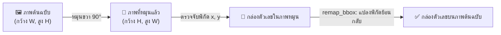

<details>
<summary> ดูเวอร์ชันข้อความ</summary>

1. ภาพต้นฉบับ (ความกว้าง W, ความสูง H)
2. ดำเนินการหมุนภาพขวา 90 องศา ได้ภาพที่หมุนแล้ว (ความกว้าง H, ความสูง W)
3. ตรวจจับพิกัด x, y ของกล่องตัวเลขบนภาพที่หมุนแล้ว
4. ฟังก์ชัน remap_bbox แปลงพิกัดย้อนกลับ ได้ตำแหน่งกล่องตัวเลขที่ถูกต้องบนระนาบภาพต้นฉบับ
</details>

<p align="center"><strong>ภาพที่ 1.1: หลักการแปลงพิกัดย้อนกลับจากภาพหมุนสู่ภาพต้นฉบับ</strong></p>

#### 1.7.5 เทคนิคการกรองเค้าโครงแถวตัวเลขแนวตั้ง (Geometric Layout Filtering)
&emsp;&emsp;&emsp;&emsp;**ปัญหาที่แก้ไข:** บนตัวถังมาตรวัดน้ำมักมีการปั๊มตัวเลขอารบิกสำหรับระบุวันที่ผลิตหรือหมายเลขซีเรียลในแนวตั้ง ซึ่งไม่ใช่ตัวเลขบนหน้าปัดที่ต้องบันทึกค่าน้ำ  
&emsp;&emsp;&emsp;&emsp;**วิธีการทำงาน:** ฟังก์ชัน `is_vertical` คำนวณช่วงการกระจายตัวในแนวนอน (`width_span`) และแนวตั้ง (`height_span`) ของกลุ่มตัวเลขที่ตรวจพบ หาก `height_span` มีค่าตั้งแต่ 80% ของ `width_span` ขึ้นไป (`height_span >= width_span * 0.8`) หรือกรณีที่ `width_span` แคบมาก (`<=0.05` ขณะที่ `height_span >=0.08`) ระบบจะพิจารณาว่ามีแนวโน้มเป็นแนวตั้งตามเงื่อนไขในโค้ดและตัดทิ้งจากการนำไปคำนวณเป็นค่ามิเตอร์

#### 1.7.6 เทคนิคกลไกความปลอดภัยและการตรวจทานความถูกต้อง (Safety Guards)
&emsp;&emsp;&emsp;&emsp;**ปัญหาที่แก้ไข:** ป้องกันความผิดพลาดร้ายแรงก่อนส่งออกผลลัพธ์ เช่น กรณีตัวเลขที่มีความสมมาตรเมื่อกลับหัว หรือกรณีที่แบบจำลองตรวจพบตัวเลขด้วยความเชื่อมั่นต่ำ  
&emsp;&emsp;&emsp;&emsp;**วิธีการทำงาน:** ระบบประกอบด้วยกลไกความปลอดภัย 4 ขั้นตอน:
1.7.6.1 **การตรวจสอบภาพกลับหัว 180° (`flip_guard`):** ระบบประมวลผลภาพที่มุมตรงข้าม 180° แล้วนำผลการอ่านมาเปรียบเทียบกับตารางความสัมพันธ์ของตัวเลขสมมาตร `FLIP_MAP = {0:0, 1:1, 2:5, 5:2, 6:9, 8:8, 9:6}` หากผลการอ่านไม่สอดคล้องกันและมุมตรงข้ามมีความเชื่อมั่นสูง ระบบจะสร้างข้อความเตือนความเสี่ยงภาพกลับหัวทันที
1.7.6.2 **การตรวจทานซ้ำด้วย SigLIP2 (`cross_check_digits`):** ระบบจะครอปภาพตัวเลขเฉพาะหลักที่มีค่าความเชื่อมั่นจาก YOLO ต่ำกว่าเกณฑ์ `CONF_RELIABLE = 0.60` แล้วส่งให้แบบจำลอง SigLIP2 จำแนกตัวเลขซ้ำเพื่อตรวจสอบยืนยัน
1.7.6.3 **การตรวจสอบความตรงของแนวแถวตัวเลข (`align_ok`):** คำนวณค่าเบี่ยงเบนมาตรฐาน (Standard Deviation) ของพิกัดกึ่งกลางแถวตัวเลข หากค่าเบี่ยงเบนเกินกว่า `ALIGN_MAX_SPREAD = 0.10` ระบบจะแจ้งเตือนว่าตัวเลขไม่เรียงตัวในแนวเดียวกัน
1.7.6.4 **การตรวจสอบตำแหน่งหลักทศนิยมสีแดง (`red_ratio`):** คำนวณสัดส่วนพิกเซลสีแดงในปริภูมิสี HSV เพื่อยืนยันว่าหลักทศนิยมอยู่ตำแหน่งขวาสุดของหน้าปัดเสมอ

### 1.8 เทคโนโลยี ชุดเครื่องมือ และไลบรารีที่ใช้ในโครงงาน (Libraries & Tools)

&emsp;&emsp;&emsp;&emsp;การพัฒนาระบบอ่านค่ามาตรวัดน้ำอัตโนมัติได้ประยุกต์ใช้ชุดเครื่องมือและไลบรารีภาษา Python รวมทั้งสิ้น 10 รายการ โดยแต่ละรายการมีบทบาทและหน้าที่สำคัญตามที่ระบุในตารางที่ 1.3

<p align="center"><strong>ตารางที่ 1.3: เทคโนโลยี ชุดเครื่องมือ และไลบรารีที่ใช้ในโครงงาน</strong></p>

| ไลบรารี / เครื่องมือ | บทบาทและหน้าที่ในระบบ | เหตุผลที่เลือกใช้ในโครงงาน |
|---|---|---|
| **`ultralytics` (YOLO26)** | ตรวจจับตำแหน่ง Bounding Box และจำแนกตัวเลข 0–9 จากภาพถ่ายเต็มเฟรม | ได้รับการออกแบบให้เป็น Single-stage/Anchor-free ตามเอกสารของ Ultralytics โดยมีวัตถุประสงค์เพื่อเอื้อต่อการตรวจจับวัตถุขนาดเล็ก |
| **`transformers` (SigLIP2)** | คัดกรองภาพมาตรวัดน้ำแบบ Zero-shot และตรวจทานตัวเลขความเชื่อมั่นต่ำ | ได้รับการออกแบบให้จำแนกภาพจากข้อความภาษาธรรมชาติได้โดยไม่ต้องฝึก classifier ใหม่ (Zero-shot) ตาม Zhai et al. (2023) และ Tschannen et al. (2025) — ความแม่นยำในงานนี้ยังต้องมีการประเมินแบบควบคุม |
| **`opencv-python` (`cv2`)** | ดำเนินการหมุนภาพ ปรับคอนทราสต์แสง CLAHE/HistEq และตรวจจับย่านสีแดง | เป็นไลบรารีประมวลผลภาพที่ใช้กันแพร่หลาย โดยมีวัตถุประสงค์เพื่อดำเนินการหมุนภาพและปรับคอนทราสต์ด้วยความเร็วที่ยอมรับได้ |
| **`torch` (PyTorch)** | คำนวณโครงข่ายประสาทเทียมทั้ง YOLO และ SigLIP2 รองรับ GPU CUDA | เป็นเฟรมเวิร์กสำหรับการรัน Deep Learning ที่รองรับการประมวลผลทั้งบน GPU และ CPU |
| **`fastapi`** | ให้บริการเว็บเซอร์วิส REST API สำหรับการรับส่งข้อมูลภาพและผลลัพธ์ผ่าน HTTP | ได้รับการออกแบบให้รองรับการทำงานแบบ Asynchronous และสร้างเอกสาร Swagger อัตโนมัติ (FastAPI, 2024) |
| **`gradio`** | สร้างส่วนติดต่อผู้ใช้บนเว็บ (Web UI) สำหรับการสาธิตและทดสอบระบบ | ได้รับการออกแบบมาสำหรับการสาธิตแบบจำลอง Machine Learning ผ่านเว็บ (Gradio, 2024) |
| **`pillow` (`PIL`)** | อ่านไฟล์ภาพดิจิทัล แปลงฟอร์แมต และตรวจสอบความสมบูรณ์ของไบนารีภาพ | รองรับฟอร์แมตไฟล์ภาพที่หลากหลายและมีความปลอดภัยสูงในการเปิดไฟล์ |
| **`numpy`** | จัดการโครงสร้างข้อมูลเมทริกซ์และอาเรย์หลายมิติตลอดกระบวนการประมวลผล | เป็นพื้นฐานในการคำนวณทางคณิตศาสตร์และเชื่อมต่อข้อมูลระหว่าง OpenCV และ PyTorch |
| **`uvicorn`** | เว็บเซิร์ฟเวอร์ ASGI สำหรับรันบริการ FastAPI Backend | รองรับการทำงานแบบ Asynchronous I/O สูง ทำให้สามารถรองรับคำขอใช้งานพร้อมกันได้ดี |
| **`uv`** | เครื่องมือจัดการ Virtual Environment และติดตั้งไลบรารีความเร็วสูง | พัฒนาด้วยภาษา Rust ทำงานเร็วกว่า pip หลายสิบเท่า และจัดการรุ่นไลบรารีได้อย่างแม่นยำ |

<p align="center"><em>ที่มา: รวบรวมจากเอกสารอ้างอิงของชุดเครื่องมือและไลบรารีที่ใช้ในการพัฒนาโครงงาน</em></p>

---

### 1.9 ขั้นตอนและวิธีการทำงานของระบบ (Pipeline Workflow & Methodology)

&emsp;&emsp;&emsp;&emsp;ระบบได้รับการออกแบบให้มีกระบวนการทำงานครอบคลุมตั้งแต่ขั้นตอนการรับภาพนำเข้าจนถึงการส่งออกผลลัพธ์ โดยแบ่งการทำงานออกเป็น 7 ขั้นตอนหลัก ดังนี้

&emsp;&emsp;&emsp;&emsp;**ขั้นตอนที่ 0: การได้มาซึ่งภาพถ่ายและการรับข้อมูลนำเข้า (Image Acquisition & Input):** ผู้ใช้งานใช้กล้องสมาร์ทโฟนหรืออุปกรณ์เคลื่อนที่ถ่ายภาพหน้าปัดมาตรวัดน้ำภาคสนาม จากนั้นส่งไฟล์ภาพเข้าสู่ระบบผ่านหน้าเว็บแอปพลิเคชัน Gradio หรือผ่าน REST API Endpoint (`POST /api/read-meter`)

&emsp;&emsp;&emsp;&emsp;**ขั้นตอนที่ 1: การตรวจสอบความถูกต้องและความปลอดภัยของไฟล์ภาพ (File Validation):** ระบบตรวจสอบชนิดของไฟล์ภาพตามรายการ `ALLOWED_TYPES` (`image/jpeg`, `image/png`, `image/webp`, `image/bmp`) และใช้ไลบรารี `PIL` ตรวจสอบความสมบูรณ์ของไบนารีภาพ หากไฟล์ชำรุดหรือไม่ถูกต้อง ระบบจะปฏิเสธคำขอด้วยรหัสข้อผิดพลาด HTTP 415 หรือ 422 ทันที

&emsp;&emsp;&emsp;&emsp;**ขั้นตอนที่ 2: การคัดกรองประเภทมาตรวัดน้ำด้วย SigLIP2 (Zero-shot Verification):** แบบจำลอง SigLIP2 วิเคราะห์ภาพถ่ายนำเข้าเพื่อยืนยันว่าเป็นภาพมาตรวัดน้ำจริง หากไม่ใช่มาตรวัดน้ำ (เช่น เป็นภาพมาตรวัดไฟฟ้า หรือภาพทั่วไป) ระบบจะยุติการประมวลผลและส่งข้อความเตือนให้ผู้ใช้ทราบ เพื่อประหยัดทรัพยากรระบบ

&emsp;&emsp;&emsp;&emsp;**ขั้นตอนที่ 3: การประมวลผลค้นหา 12 รูปแบบเชิงครอบคลุม (12-Combination Search with YOLO26):** ระบบนำภาพที่ผ่านการอนุมัติไปประมวลผลหมุน 4 ทิศทาง (0°, 90°, 180°, 270°) ร่วมกับการปรับปรุงคอนทราสต์แสง 3 รูปแบบ (Original, CLAHE, HistEq) รวมเป็น 12 รูปแบบ ในแต่ละรูปแบบจะใช้ YOLO26 ตรวจจับตัวเลข กำจัดกรอบซ้ำด้วย IoU และคำนวณคะแนนรวมเพื่อคัดเลือกมุมมองและฟิลเตอร์ที่ให้ผลลัพธ์ดีที่สุด

&emsp;&emsp;&emsp;&emsp;**ขั้นตอนที่ 4: การคัดกรองและการแปลงพิกัดกลับสู่ภาพต้นฉบับ (Coordinate Remapping & Filtering):** ระบบตรวจสอบว่ากลุ่มตัวเลขมิได้เรียงตัวเป็นแนวตั้ง (`is_vertical`) จากนั้นนำพิกัด Bounding Box ของมุมที่ชนะการประเมินมาแปลงพิกัดทางเรขาคณิตย้อนกลับ (`remap_bbox`) เพื่อให้ตำแหน่งกล่องตรงกับระนาบภาพต้นฉบับเดิม

&emsp;&emsp;&emsp;&emsp;**ขั้นตอนที่ 5: การประเมินความปลอดภัยและการตรวจทานความถูกต้อง (Safety Guard Verification):** ระบบตรวจสอบความเสี่ยงภาพกลับหัว 180° ด้วยฟังก์ชัน `flip_guard` ตรวจสอบความตรงของแนวแถวตัวเลข (`align_ok`) และนำภาพตัวเลขเฉพาะหลักที่มีความเชื่อมั่นต่ำส่งให้ SigLIP2 ตรวจทานซ้ำ (`cross_check_digits`)

&emsp;&emsp;&emsp;&emsp;**ขั้นตอนที่ 6: การประมวลผลสรุปผลลัพธ์และการส่งออกข้อมูล (Output Dispatch & Warning Generation):** ระบบรวบรวมตัวเลขที่อ่านได้เรียงจากซ้ายไปขวา คำนวณค่าความเชื่อมั่นเฉลี่ย วาดกรอบสี่เหลี่ยมระบุตำแหน่งตัวเลขลงบนภาพ (กรอบเขียวสำหรับหลักที่มีค่าความเชื่อมั่นสูง และกรอบส้มสำหรับหลักที่ควรตรวจทาน) พร้อมทั้งสร้างรายการข้อความแจ้งเตือนความเสี่ยง (`warnings`) ส่งกลับไปยังผู้ใช้งาน

&emsp;&emsp;&emsp;&emsp;ดังภาพที่ 1.2 แสดงแผนภาพภาพรวมการไหลของข้อมูลและการทำงานของระบบตั้งแต่ต้นน้ำจนถึงปลายน้ำ โดยเพื่อความชัดเจนในการแสดงผลบนหน้ากระดาษขนาดมาตรฐาน A4 และสไลด์นำเสนอ ระบบจึงจำแนกแผนภาพออกเป็นแผนภาพภาพรวมท่อประมวลผล (High-level Overview) และแผนภาพกระบวนการทำงานย่อยในแต่ละระยะ (ก)–(ง) ดังนี้

&emsp;&emsp;&emsp;&emsp;**1. แผนภาพภาพรวมท่อประมวลผลของระบบ (High-level Pipeline Overview):**

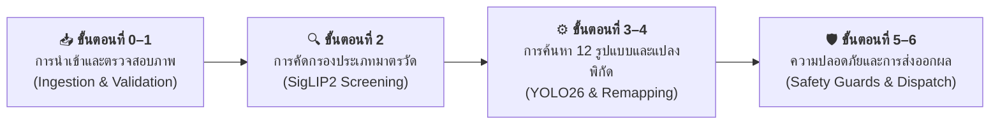

<details>
<summary> ดูเวอร์ชันข้อความ</summary>

- ขั้นตอนที่ 0–1: การนำเข้าและตรวจสอบภาพ (ผู้ใช้ถ่ายภาพและอัปโหลดเข้าสู่ระบบ พร้อมตรวจสอบชนิดไฟล์และไบนารีภาพ)
- ขั้นตอนที่ 2: การคัดกรองประเภทมาตรวัด (แบบจำลอง SigLIP2 ตรวจสอบความถูกต้องแบบ Zero-shot 4 คลาส)
- ขั้นตอนที่ 3–4: การค้นหา 12 รูปแบบและแปลงพิกัด (ค้นหาทิศทางและฟิลเตอร์แสง ตรวจจับตัวเลขด้วย YOLO26 กรองแถวตั้ง และแปลงพิกัดกลับ)
- ขั้นตอนที่ 5–6: ความปลอดภัยและการส่งออกผลลัพธ์ (ตรวจสอบความปลอดภัย 4 ระดับ สรุปผลการอ่าน วาดกรอบพิกัด และส่งออกข้อมูล)
</details>

<p align="center"><strong>ภาพที่ 1.2: แผนภาพภาพรวมการทำงานของระบบ (High-level Pipeline Overview)</strong></p>

&emsp;&emsp;&emsp;&emsp;**2. แผนภาพกระบวนการทำงานย่อยในแต่ละระยะ (Detailed Sub-pipeline Workflows):**

&emsp;&emsp;&emsp;&emsp;*(ก) ระยะการนำเข้าและตรวจสอบความถูกต้องของไฟล์ภาพ (ขั้นตอนที่ 0–1):*

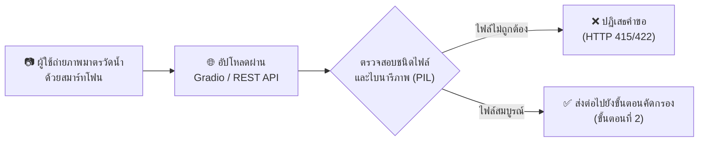

<details>
<summary> ดูเวอร์ชันข้อความ</summary>

1. ผู้ใช้ถ่ายภาพมาตรวัดน้ำด้วยสมาร์ทโฟน
2. อัปโหลดภาพผ่านส่วนต่อประสาน Gradio หรือ REST API
3. ตรวจสอบชนิดไฟล์และไบนารีภาพด้วยไลบรารี PIL
   - กรณีไฟล์ไม่ถูกต้อง: ระบบปฏิเสธคำขอด้วยรหัสข้อผิดพลาด HTTP 415 หรือ 422
   - กรณีไฟล์สมบูรณ์: ส่งภาพต่อไปยังขั้นตอนคัดกรองประเภทมาตรวัดน้ำ (ขั้นตอนที่ 2)
</details>

<p align="center"><strong>ภาพที่ 1.2 (ก): แผนภาพขั้นตอนที่ 0–1 การนำเข้าและตรวจสอบความสมบูรณ์ของภาพ (Ingestion & Validation)</strong></p>

&emsp;&emsp;&emsp;&emsp;*(ข) ระยะการคัดกรองประเภทมาตรวัดน้ำด้วย SigLIP2 แบบ Zero-shot (ขั้นตอนที่ 2):*

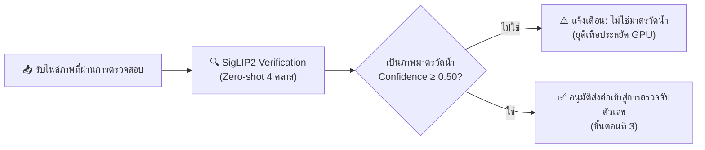

<details>
<summary> ดูเวอร์ชันข้อความ</summary>

1. รับไฟล์ภาพที่ผ่านการตรวจสอบความสมบูรณ์
2. แบบจำลอง SigLIP2 ดำเนินการจำแนกภาพแบบ Zero-shot เทียบกับข้อความ 4 คลาส
3. ตรวจสอบว่าภาพดังกล่าวได้รับการจำแนกเป็นมาตรวัดน้ำด้วยค่าความเชื่อมั่นไม่น้อยกว่า 0.50 หรือไม่
   - กรณีไม่ใช่มาตรวัดน้ำ: แจ้งเตือนผู้ใช้และยุติกระบวนการเพื่อประหยัดทรัพยากร GPU
   - กรณีเป็นมาตรวัดน้ำ: อนุมัติส่งต่อภาพเข้าสู่การตรวจจับตัวเลข (ขั้นตอนที่ 3)
</details>

<p align="center"><strong>ภาพที่ 1.2 (ข): แผนภาพขั้นตอนที่ 2 การคัดกรองประเภทมาตรวัดด้วย SigLIP2 (Screening)</strong></p>

&emsp;&emsp;&emsp;&emsp;*(ค) ระยะการประมวลผลค้นหา 12 รูปแบบและการแปลงพิกัดเรขาคณิต (ขั้นตอนที่ 3–4):*

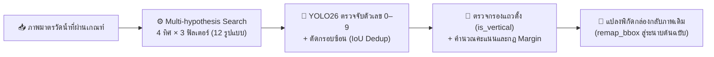

<details>
<summary> ดูเวอร์ชันข้อความ</summary>

1. รับภาพมาตรวัดน้ำที่ผ่านเกณฑ์การคัดกรอง
2. ดำเนินการค้นหาเชิงครอบคลุม 12 รูปแบบ (หมุน 4 ทิศทางร่วมกับการปรับปรุงคอนทราสต์แสง 3 รูปแบบ)
3. ใช้แบบจำลอง YOLO26 ตรวจจับตัวเลข 0 ถึง 9 และกำจัดกรอบซ้อนทับด้วย IoU Deduplication
4. ตรวจสอบเค้าโครงแถวตัวเลขว่าไม่ใช่แนวตั้ง (is_vertical) และคำนวณคะแนนตามกฎ Margin Rule
5. แปลงพิกัดกล่องขอบเขตของรูปแบบที่ชนะการประเมินกลับสู่ระนาบภาพต้นฉบับเดิมด้วย remap_bbox
</details>

<p align="center"><strong>ภาพที่ 1.2 (ค): แผนภาพขั้นตอนที่ 3–4 การค้นหา 12 รูปแบบและแปลงพิกัด (Processing & Remapping)</strong></p>

&emsp;&emsp;&emsp;&emsp;*(ง) ระยะกลไกความปลอดภัยและการส่งออกผลลัพธ์ (ขั้นตอนที่ 5–6):*

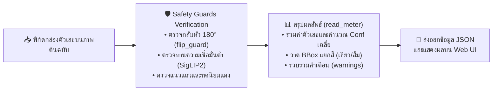

<details>
<summary> ดูเวอร์ชันข้อความ</summary>

1. รับพิกัดกล่องตัวเลขบนระนาบภาพต้นฉบับ
2. ดำเนินการตรวจสอบผ่านกลไกความปลอดภัย (Safety Guards) ตรวจจับภาพกลับหัว 180 องศา (flip_guard) ตรวจทานหลักที่มีความเชื่อมั่นต่ำด้วย SigLIP2 และตรวจสอบแนวระนาบแถวตัวเลข
3. สรุปผลลัพธ์ผ่านฟังก์ชัน read_meter รวมค่าตัวเลข คำนวณค่าความเชื่อมั่นเฉลี่ย วาดกรอบสี่เหลี่ยมระบุตำแหน่ง และรวบรวมข้อความแจ้งเตือน
4. ส่งออกข้อมูลในรูปแบบ JSON และแสดงผลลัพธ์บนส่วนติดต่อผู้ใช้เว็บ
</details>

<p align="center"><strong>ภาพที่ 1.2 (ง): แผนภาพขั้นตอนที่ 5–6 กลไกความปลอดภัยและการส่งออกผลลัพธ์ (Safety & Output Dispatch)</strong></p>

---

### 1.10 การฝึกแบบจำลองสำหรับการตรวจจับตัวเลข

> [!NOTE]
> **ข้อแนะนำ — มีแบบจำลองพร้อมใช้งานแล้ว:** 
> โครงงานนี้มีไฟล์น้ำหนักแบบจำลอง `weights/MeterOCR.pt` ที่ผ่านการฝึกฝนเสร็จสมบูรณ์แล้ว ผู้ศึกษาสามารถข้ามไปศึกษาหัวข้อ 1.11 เพื่อเริ่มต้นใช้งานได้ทันที โดยเนื้อหาในส่วนนี้มีไว้สำหรับผู้ที่ต้องการศึกษาขั้นตอนการเตรียมชุดข้อมูลและการฝึกฝนแบบจำลองด้วยตนเอง

&emsp;&emsp;&emsp;&emsp;**หลักการฝึกฝนแบบจำลองบนระบบคลาวด์:** การฝึกฝนแบบจำลองการเรียนรู้เชิงลึก (Deep Learning) จำเป็นต้องใช้ทรัพยากรหน่วยประมวลผลกราฟิก (GPU) ประสิทธิภาพสูง จึงแนะนำให้ดำเนินการผ่านแพลตฟอร์มคลาวด์ เช่น Google Colab หรือ Kaggle

#### 1.10.1 การเตรียมชุดข้อมูลจาก Roboflow และการแบ่งชุดข้อมูล (Dataset Splits)

&emsp;&emsp;&emsp;&emsp;ระบบใช้ชุดข้อมูลสาธารณะ "Utility Meter Reading" จากแพลตฟอร์ม Roboflow ซึ่งประกอบด้วยภาพหน้าปัดมาตรวัดน้ำในสภาพแวดล้อมจริงที่มีการทำเครื่องหมายระบุพิกัดกล่องขอบเขต (Bounding Box) และคลาสของตัวเลขโดด 0–9 ไว้อย่างครบถ้วน

<p align="center"><strong>ตารางที่ 1.4: สัดส่วนการแบ่งชุดข้อมูลสำหรับการฝึกฝนและทดสอบตัวตรวจจับวัตถุ (Dataset Splits)</strong></p>

| ชุดข้อมูลย่อย (Split) | จำนวนภาพ (Images) | สัดส่วน (%) | จำนวนกล่องตัวเลขโดยประมาณ | วัตถุประสงค์การใช้งาน |
|---|---|---|---|---|
| **ชุดฝึกฝน (Training Set)** | 4,665 | 92.3% | ~37,300 | ใช้สำหรับปรับปรุงค่าน้ำหนักของแบบจำลองผ่าน Backpropagation |
| **ชุดปรับเทียบ (Validation Set)** | 194 | 3.8% | ~1,550 | ใช้ประเมินระหว่างการฝึกฝนเพื่อการปรับลด Learning Rate และ Early Stopping (`patience=30`) |
| **ชุดทดสอบแบบจำลอง (Test Set)** | 194 | 3.8% | ~1,550 | ใช้ประเมินตัวชี้วัดประสิทธิภาพของตัวตรวจจับวัตถุอิสระ (Unseen Detection Evaluation) |
| **รวมทั้งสิ้น (Total)** | **5,053** | **100.0%** | **~40,400** | ครอบคลุมคลาสตัวเลข 0–9 ครบทั้ง 10 คลาส |

<p align="center"><em>ที่มา: รวบรวมจากชุดข้อมูล Utility Meter Reading บนแพลตฟอร์ม Roboflow Universe</em></p>

> [!IMPORTANT]
> **หลักการแบ่งข้อมูลโดยไม่ให้เกิดการรั่วไหล (Data Leakage Prevention):**
> การแบ่งชุดข้อมูลในงานอ่านมาตรวัดน้ำต้องระมัดระวังเป็นพิเศษเรื่องการรั่วไหลของข้อมูล (Data Leakage) หากภาพถ่ายจากมิเตอร์ตัวเรือนเดียวกัน (Physical Meter ID) ถูกกระจายไปอยู่ในทั้งชุดฝึกและชุดทดสอบ แบบจำลองอาจจดจำรอยขีดข่วน คราบสนิม หรือสติกเกอร์เฉพาะตัวเรือนได้ ดังนั้นจึงต้องใช้เกณฑ์ **Meter-level Grouped Split** เพื่อให้มั่นใจว่าตัวเรือนมิเตอร์ในชุดทดสอบไม่เคยปรากฏในชุดฝึกฝนมาก่อน

##### ขั้นตอนการลงทะเบียน Roboflow และการรับ API Key

&emsp;&emsp;&emsp;&emsp;1. เปิด [Roboflow](https://app.roboflow.com) แล้วกด **Sign up** สมัครด้วยบัญชี Google, GitHub หรืออีเมล (บัญชีฟรี ไม่ต้องใช้บัตรเครดิต)
&emsp;&emsp;&emsp;&emsp;2. หลังเข้าสู่ระบบ คลิกที่รูปโปรไฟล์ (มุมขวาบน) แล้วเลือก **Settings** หรือเข้าโดยตรงที่ [app.roboflow.com/settings/api](https://app.roboflow.com/settings/api)
&emsp;&emsp;&emsp;&emsp;3. ในหน้า Settings เลื่อนไปที่หัวข้อ **API Key** กดปุ่ม **Copy** เพื่อคัดลอก Key (เป็นตัวอักษรและตัวเลขปนกัน ประมาณ 30–40 หลัก)
&emsp;&emsp;&emsp;&emsp;4. นำ Key ไปวางแทน `YOUR_API_KEY` ในโค้ดด้านล่าง

> **คำเตือนความปลอดภัย:** API Key เป็นความลับส่วนบุคคล ห้ามเผยแพร่หรือบันทึกขึ้นระบบจัดการเวอร์ชัน (Git) สาธารณะ สำหรับ Google Colab แนะนำให้จัดเก็บ Key ไว้ใน **Secrets** (ปุ่มรูปกุญแจที่แถบด้านซ้ายของหน้าต่าง Colab) แล้วเรียกใช้ด้วยคำสั่งต่อไปนี้:
> ```python
> from google.colab import userdata
> rf = Roboflow(api_key=userdata.get('ROBOFLOW_API_KEY'))
> ```

&emsp;&emsp;&emsp;&emsp;**การปฏิบัติการบน Google Colab:** การฝึกแบบจำลองการเรียนรู้เชิงลึก (Deep Learning) ต้องการการประมวลผลเมทริกซ์ประสิทธิภาพสูง จึงกำหนดให้ปฏิบัติตามหัวข้อ 1.10.1–1.10.2 บน **Google Colab** โดยเปิด [colab.research.google.com](https://colab.research.google.com) สร้างสมุดบันทึกใหม่ชื่อ `train_model_colab.ipynb` และเลือกฮาร์ดแวร์เร่งความเร็วเป็น **T4 GPU**

```python
from roboflow import Roboflow

rf = Roboflow(api_key="YOUR_API_KEY")
project = rf.workspace("watermeter-jvlgr").project("utility-meter-reading-dataset-for-automatic-reading-yolo")
version = project.version(1)
dataset = version.download("yolo26")
```
<p align="center"><strong>ซอร์สโค้ดที่ 1.1: <code>train_model_colab.ipynb</code> — การดาวน์โหลดชุดข้อมูลจาก Roboflow</strong></p>

#### 1.10.2 การฝึกแบบจำลอง YOLO บน Google Colab

&emsp;&emsp;&emsp;&emsp;ระบบเลือกใช้สถาปัตยกรรม **Ultralytics YOLO26 Medium (`yolo26m.pt`)** (Ultralytics, 2024) ซึ่งมีขนาด 132 layers, 20,364,070 parameters (~20.36M) และ 68.1 GFLOPs โดยให้ความแม่นยำในการสกัดคุณลักษณะ (Feature Extraction) ของตัวเลขขนาดเล็กบนหน้าปัดมาตรวัดน้ำได้เหนือกว่ารุ่น Nano การฝึกฝนกระทำบน Google Colab โดยเชื่อมต่อ GPU NVIDIA Tesla T4 (VRAM 16 GB) ผ่านสคริปต์ Python ดังแสดงในซอร์สโค้ดที่ 1.2:

```python
from ultralytics import YOLO

model = YOLO("yolo26m.pt")
results = model.train(
    data=f"{dataset.location}/data.yaml",
    epochs=100,        # จำนวนรอบการฝึกฝนสูงสุด
    patience=30,       # กลไกหยุดก่อนกำหนดหากค่า mAP บนชุด Validation ไม่ดีขึ้นติดต่อกัน 30 รอบ
    imgsz=640,         # ขนาดความละเอียดภาพนำเข้าในขั้นตอนฝึกฝน
    batch=16,          # ขนาดแบทช์ต่อรอบ (สอดคล้องกับ VRAM ของ Tesla T4 16GB เมื่อใช้โมเดล Medium)
    amp=True,          # เปิดใช้งาน Automatic Mixed Precision (FP16) ลดภาระ VRAM และเพิ่มความเร็ว
    optimizer="AdamW", # ขั้นตอนวิธีปรับค่าน้ำหนักแบบ Adam พร้อม Weight Decay
    lr0=0.001,         # อัตราการเรียนรู้เริ่มต้น (Initial Learning Rate)
    mosaic=1.0,        # การผสานภาพสุ่ม 4 ภาพ ช่วยให้แบบจำลองรองรับสเกลตัวเลขที่ต่างกัน
    mixup=0.15,        # การซ้อนทับภาพแบบโปร่งใส ช่วยลดปัญหา Overfitting
    degrees=15.0,      # การหมุนภาพแบบสุ่ม ±15 องศาเพื่อชดเชยมุมถ่ายเอียง
    hsv_v=0.4,         # การแปรผันค่าความสว่างจำลองสภาพแสงจ้าและแสงสลัว
)
```
<p align="center"><strong>ซอร์สโค้ดที่ 1.2: <code>train_model_colab.ipynb</code> — การกำหนดพารามิเตอร์และเริ่มกระบวนการฝึกฝนแบบจำลอง</strong></p>

#### 1.10.3 การประเมินประสิทธิภาพตัวตรวจจับวัตถุ (Object Detection Evaluation)

&emsp;&emsp;&emsp;&emsp;เพื่อตอบคำถามการวิจัยข้อที่หนึ่ง (**RQ1**) แบบจำลอง YOLO26 Medium (`yolo26m`) ที่ผ่านการฝึกฝนจะได้รับการทดสอบบนชุดข้อมูลทดสอบอิสระ (Held-out Test Split, $N=194$ ภาพ) โดยวัดประสิทธิภาพการตรวจจับตัวเลขโดด 0–9 ผ่านตัวชี้วัดสากลด้าน Object Detection:

```python
metrics = model.val(data=f"{dataset.location}/data.yaml", split="test")
print(f"Precision: {metrics.box.mp:.4f}")
print(f"Recall:    {metrics.box.mr:.4f}")
print(f"mAP@50:    {metrics.box.map50:.4f}")
print(f"mAP@50-95: {metrics.box.map:.4f}")
```
<p align="center"><strong>ซอร์สโค้ดที่ 1.3: <code>train_model_colab.ipynb</code> — การประเมินผลแบบจำลองบนชุดข้อมูลทดสอบอิสระ (Test Split)</strong></p>

<p align="center"><strong>ตารางที่ 1.5: ผลการประเมินประสิทธิภาพตัวตรวจจับวัตถุ YOLO26m บนชุดทดสอบอิสระ (Test Split, n=194)</strong></p>

| ตัวชี้วัดประสิทธิภาพ (Metric) | ค่าที่วัดได้จริง (Score) | คำนิยามและวิธีคำนวณทางสถิติ | ความหมายต่อการใช้งานจริง |
|---|---|---|---|
| **Precision (P)** | **0.935 (93.5%)** | $\frac{TP}{TP + FP}$ (สัดส่วนของกล่องที่ทำนายว่าเป็นตัวเลขแล้วเป็นตัวเลขจริง) | ลดปัญหาการตรวจจับสัญญาณรบกวน คราบน้ำ หรือโลโก้บนหน้าปัดเป็นตัวเลขปลอม |
| **Recall (R)** | **0.893 (89.3%)** | $\frac{TP}{TP + FN}$ (สัดส่วนของตัวเลขจริงทั้งหมดที่แบบจำลองสามารถตรวจจับได้) | ป้องกันตัวเลขบนหน้าปัดสูญหายหรือตกหล่นไปในระหว่างตรวจจับ |
| **F1-Score** | **0.914 (91.4%)** | $2 \times \frac{P \times R}{P + R}$ (ค่าเฉลี่ยฮาร์มอนิกของ Precision และ Recall) | แสดงความสมดุลระหว่างการตรวจจับครบถ้วนกับการไม่ตรวจจับสิ่งแปลกปลอม |
| **mAP@50** | **0.879 (87.9%)** | Mean Average Precision ที่เกณฑ์ $IoU \ge 0.50$ | ความแม่นยำเฉลี่ยเมื่อยอมรับพิกัดกล่องที่มีพื้นที่ทับซ้อนกับเฉลยตั้งแต่ 50% ขึ้นไป |
| **mAP@50:95** | **0.477 (47.7%)** | ค่าเฉลี่ย mAP ที่ระดับเกณฑ์ $IoU$ ตั้งแต่ 0.50 ถึง 0.95 (ขั้นละ 0.05) | แสดงความแม่นยำระดับพิกัดกรอบสี่เหลี่ยมขอบเขตตัวเลขอย่างเข้มงวด |

<p align="center"><em>ที่มา: ผลการประเมินประสิทธิภาพตัวตรวจจับวัตถุบนชุดข้อมูลทดสอบอิสระในโครงงานนี้</em></p>

> [!NOTE]
> **ความแตกต่างระหว่าง Detection mAP และ End-to-End Reading Accuracy:**
> ตัวชี้วัดในตารางที่ 1.5 เป็นการวัดประสิทธิภาพในระดับ "กล่องตัวเลขโดดเดี่ยว" (Object Detection Level) บนชุดภาพทดสอบของ Roboflow ซึ่งยังไม่ได้รับประกันว่าระบบจะสามารถอ่านค่ามิเตอร์ทั้ง 5–8 หลักได้อย่างถูกต้องครบถ้วนต่อเนื่องกันทุกหลัก เนื่องจากการอ่านค่ามิเตอร์จริงต้องผ่านกระบวนการเรียงลำดับซ้าย-ขวา การตัดกล่องซ้อนทับ และการแปลงพิกัดมุมหมุน ซึ่งผลการประเมินความแม่นยำปลายทางถึงปลายทาง (End-to-End Exact Reading Accuracy) จะถูกวิเคราะห์อย่างละเอียดในบทที่ 3 (หัวข้อ 3.4.3–3.4.6)

&emsp;&emsp;&emsp;&emsp;**การนำไฟล์น้ำหนักไปใช้งาน:** เมื่อกระบวนการฝึกฝนเสร็จสมบูรณ์ ระบบจะบันทึกไฟล์น้ำหนักที่ดีที่สุดไว้ที่ `runs/detect/train/weights/best.pt` ให้นำไฟล์ดังกล่าวมาเปลี่ยนชื่อและบันทึกไว้ที่ `weights/MeterOCR.pt` ในโฟลเดอร์ของโปรเจกต์ เพื่อให้ท่อประมวลผลหลัก (Main Pipeline) สามารถเรียกใช้งานได้ทันที

---

### 1.11 สภาพแวดล้อมและการจัดการโครงงานด้วย `uv`

> **หลักการและเหตุผล:** เพื่อเตรียมโฟลเดอร์และติดตั้งไลบรารีให้พร้อม ก่อนเริ่มทดลองระบบจริง

#### 1.11.1 โครงสร้างไฟล์ของระบบ

```text
meter-reader/
├── main.py            # โค้ดหลัก: API (FastAPI) และฟังก์ชันประมวลผลทั้งหมด
├── gradio_app.py      # หน้าเว็บ UI (Gradio) สำหรับทดสอบระบบ
├── requirements.txt   # รายการ Library dependencies
├── weights/
│   └── MeterOCR.pt    # ไฟล์น้ำหนักแบบจำลอง YOLO สำหรับตรวจจับตัวเลข (พร้อมใช้งาน)
└── training/
    └── yolo_train.py  # สคริปต์ฝึกฝนแบบจำลอง YOLO26 (ตามหัวข้อ 1.10.2)
```

&emsp;&emsp;&emsp;&emsp;โครงสร้างข้างต้นเป็นแบบเรียบง่ายสำหรับการเรียนรู้ สำหรับโครงสร้างไฟล์แบบเต็มของโครงงานปัจจุบัน โปรดดู **ภาคผนวก ค. โครงสร้างระบบไฟล์ของโครงงานปัจจุบัน**

#### 1.11.2 การสร้างสภาพแวดล้อมและการติดตั้งไลบรารี

&emsp;&emsp;&emsp;&emsp;เปิด Terminal ที่โฟลเดอร์ `meter-reader/` แล้วทำตามลำดับ:

```powershell
# 1. สร้าง Virtual Environment ด้วย Python 3.11
uv venv --python 3.11

# 2. เปิดใช้งาน Virtual Environment
# Windows PowerShell:
.venv\Scripts\Activate.ps1
# macOS / Linux:
# source .venv/bin/activate

# 3. ติดตั้ง Library ทั้งหมดผ่าน uv
uv pip install -r requirements.txt
```
<p align="center"><strong>ชุดคำสั่งที่ 1.1: การสร้างสภาพแวดล้อมเสมือนและการติดตั้งไลบรารีด้วยเครื่องมือ <code>uv</code></strong></p>

&emsp;&emsp;&emsp;&emsp;**ผลลัพธ์ที่คาดหวัง:** เห็นข้อความ `Installed ... packages` และไม่มี error

&emsp;&emsp;&emsp;&emsp;รายการใน `requirements.txt` (ยึดไฟล์จริงเป็นหลัก):
```text
fastapi>=0.115
uvicorn[standard]>=0.30
python-multipart>=0.0.9
ultralytics>=8.4.0
transformers>=4.52.0
torch>=2.3
gradio>=5.0
httpx>=0.27
pillow>=10.0
opencv-python>=4.9
numpy>=1.26
PyYAML>=6.0
```

---

### 1.12 การวิเคราะห์รหัสต้นฉบับการประมวลผลคอมพิวเตอร์วิทัศน์

&emsp;&emsp;&emsp;&emsp;กระบวนการประมวลผลของระบบ Water Meter OCR ใน `main.py` ได้รับการออกแบบให้แยกเป็นฟังก์ชันย่อยตามหน้าที่อย่างชัดเจน เพื่อให้ง่ายต่อการศึกษาและบำรุงรักษา โดยมีรายละเอียดรหัสต้นฉบับในแต่ละส่วนดังนี้:


&emsp;&emsp;&emsp;&emsp;กระบวนการอ่านตัวเลขมี 4 ขั้นตอน — แต่ละขั้นตอนแก้ปัญหาคนละแบบ ต่อกันเป็นท่อส่งข้อมูล:

#### 1.12.1 การหมุนภาพและการปรับปรุงคุณภาพภาพ (rotate_image, apply_prep)
1.12.1.1 **ปัญหา:** ภาพถ่ายมีความเอียง ตัวเลขมีความคมชัดต่ำ หรืออยู่ในบริเวณที่มีแสงสว่างไม่เพียงพอ ส่งผลให้ประสิทธิภาพในการตรวจจับตัวเลขของแบบจำลองลดลง
1.12.1.2 **แนวคิด:** ดำเนินการทดสอบหมุนภาพ 4 ทิศทาง (0°, 90°, 180°, 270°) ร่วมกับการปรับปรุงคุณภาพแสง 3 รูปแบบ (ภาพต้นฉบับ, CLAHE, HistEq) รวมเป็น 12 รูปแบบการทดสอบ แล้วจึงให้แบบจำลองปัญญาประดิษฐ์ประเมินและคัดเลือกผลลัพธ์ที่มีความชัดเจนและน่าเชื่อถือสูงสุด
1.12.1.3 **การทำงาน:** ฟังก์ชัน `rotate_image` ดำเนินการหมุนภาพด้วย OpenCV และฟังก์ชัน `apply_prep` ดำเนินการปรับคอนทราสต์ของภาพตามฟิลเตอร์ที่กำหนด

&emsp;&emsp;&emsp;&emsp;**รายละเอียดทางเทคนิคของกระบวนการ:** ระบบประมวลผลภาพด้วย 4 ทิศทางการหมุนร่วมกับการปรับปรุงคอนทราสต์ 3 รูปแบบ เพื่อให้แบบจำลองตรวจจับตัวเลขได้อย่างมีประสิทธิภาพสูงสุด โดยฟังก์ชัน `rotate_image` ทำการหมุนภาพด้วยคำสั่ง `cv2.rotate` ขณะที่ฟังก์ชัน `apply_prep` ปรับปรุงคุณภาพแสงบนช่องความสว่าง L (CLAHE ในปริภูมิสี LAB) หรือช่อง Y (Histogram Equalization ในปริภูมิสี YCrCb) ตามฟิลเตอร์ที่กำหนด


```python
def rotate_image(img_bgr: np.ndarray, angle: int) -> np.ndarray:
    """หมุนภาพ 90°, 180°, 270° ตามเข็มนาฬิกา"""
    if angle == 90:
        return cv2.rotate(img_bgr, cv2.ROTATE_90_CLOCKWISE)
    if angle == 180:
        return cv2.rotate(img_bgr, cv2.ROTATE_180)
    if angle == 270:
        return cv2.rotate(img_bgr, cv2.ROTATE_90_COUNTERCLOCKWISE)
    return img_bgr

def apply_prep(img_bgr: np.ndarray, prep: str) -> np.ndarray:
    """ปรับแสง: CLAHE (บนช่อง L) หรือ HistEq (บนช่อง Y)"""
    if prep == "clahe":
        lab = cv2.cvtColor(img_bgr, cv2.COLOR_BGR2LAB)
        l, a, b = cv2.split(lab)
        l_clahe = cv2.createCLAHE(CLAHE_CLIP, CLAHE_GRID).apply(l)
        return cv2.cvtColor(cv2.merge([l_clahe, a, b]), cv2.COLOR_LAB2BGR)

    if prep == "histeq":
        ycrcb = cv2.cvtColor(img_bgr, cv2.COLOR_BGR2YCrCb)
        y, cr, cb = cv2.split(ycrcb)
        y_eq = cv2.equalizeHist(y)
        return cv2.cvtColor(cv2.merge([y_eq, cr, cb]), cv2.COLOR_YCrCb2BGR)

    return img_bgr
```

---

#### 1.12.2 การแปลงพิกัดจุดเดี่ยวและกล่องขอบเขต (remap_point, remap_bbox)

&emsp;&emsp;&emsp;&emsp;**หลักการและความจำเป็นของการแปลงพิกัดย้อนกลับ:** เมื่อมีการหมุนภาพเพื่อเอื้อต่อการตรวจจับ ตำแหน่งของวัตถุที่ตรวจพบจะอ้างอิงอยู่บนระนาบพิกัดของภาพที่ผ่านการหมุน ดังนั้น หากต้องการนำพิกัดกรอบไปแสดงผลบนภาพต้นฉบับ จำเป็นต้องแปลงพิกัดทางเรขาคณิตย้อนกลับสู่ระนาบเดิมเสมอ:

1.12.2.1 ระบบหมุนภาพ 90° เพื่อให้แบบจำลองตรวจจับตัวเลขได้สะดวก
1.12.2.2 พิกัดกล่อง `bbox` ที่ตรวจพบจะอยู่ใน **ระบบพิกัดของภาพที่ผ่านการหมุน**
1.12.2.3 หากต้องการนำพิกัดกล่องไปแสดงผลบน **ภาพต้นฉบับ** จำเป็นต้องแปลงพิกัดย้อนกลับสู่ระนาบเดิมเสมอ ซึ่งเป็นหน้าที่ของฟังก์ชัน `remap_point` และ `remap_bbox`

&emsp;&emsp;&emsp;&emsp;ดังภาพที่ 1.3 แสดงหลักการแปลงพิกัดย้อนกลับเมื่อภาพถูกหมุน เพื่อให้ตำแหน่งกล่องที่ตรวจพบบนภาพหมุนสามารถแสดงผลบนภาพต้นฉบับได้อย่างถูกต้อง โดยเพื่อความชัดเจนในการแสดงผลบนหน้ากระดาษขนาดมาตรฐาน A4 ระบบจึงจำแนกแผนภาพออกเป็นภาพรวมการแปลงพิกัด และแผนภาพกระบวนการย่อยระดับจุดและระดับกล่อง ดังนี้

&emsp;&emsp;&emsp;&emsp;**1. แผนภาพภาพรวมการแปลงพิกัดเรขาคณิตย้อนกลับ (Coordinate Remapping Overview):**

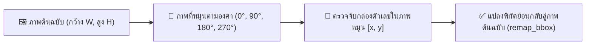

<details>
<summary> ดูเวอร์ชันข้อความ</summary>

1. ภาพต้นฉบับ (ความกว้าง W, ความสูง H)
2. หมุนภาพตามมุมองศาที่กำหนด (0, 90, 180, หรือ 270 องศา)
3. แบบจำลองตรวจจับกล่องตัวเลขบนระนาบของภาพที่หมุนแล้ว
4. ฟังก์ชัน remap_bbox แปลงพิกัดย้อนกลับสู่ระนาบภาพต้นฉบับเดิม
</details>

<p align="center"><strong>ภาพที่ 1.3: แผนผังจำลองการแปลงพิกัดย้อนกลับจากภาพหมุนสู่ภาพต้นฉบับ</strong></p>

&emsp;&emsp;&emsp;&emsp;**2. แผนภาพกระบวนการแปลงพิกัดย่อยระดับจุดและระดับกล่อง (Sub-remapping Workflows):**

&emsp;&emsp;&emsp;&emsp;*(ก) แผนภาพการแปลงพิกัดจุดเดี่ยวตามมุมองศาด้วยฟังก์ชัน `remap_point`:*

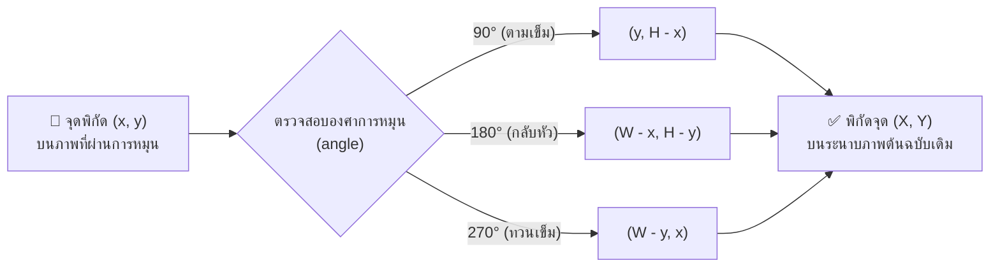

<details>
<summary> ดูเวอร์ชันข้อความ</summary>

1. รับจุดพิกัด (x, y) บนภาพที่ผ่านการหมุน
2. ตรวจสอบมุมองศาของการหมุน (angle)
   - กรณีหมุน 90 องศา: คำนวณพิกัดใหม่เป็น (y, H - x)
   - กรณีหมุน 180 องศา: คำนวณพิกัดใหม่เป็น (W - x, H - y)
   - กรณีหมุน 270 องศา: คำนวณพิกัดใหม่เป็น (W - y, x)
3. ได้พิกัดจุด (X, Y) บนระนาบของภาพต้นฉบับเดิม
</details>

<p align="center"><strong>ภาพที่ 1.3 (ก): แผนภาพการแปลงพิกัดจุดเดี่ยวตามมุมองศาด้วยฟังก์ชัน remap_point</strong></p>

&emsp;&emsp;&emsp;&emsp;*(ข) แผนภาพการแปลงกล่องขอบเขตย้อนกลับด้วยฟังก์ชัน `remap_bbox`:*

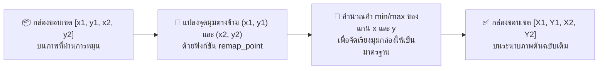

<details>
<summary> ดูเวอร์ชันข้อความ</summary>

1. รับกล่องขอบเขต [x1, y1, x2, y2] บนระนาบของภาพที่ผ่านการหมุน
2. นำจุดมุมตรงข้าม (x1, y1) และ (x2, y2) ไปแปลงพิกัดด้วยฟังก์ชัน remap_point
3. คำนวณค่าต่ำสุดและค่าสูงสุด (min/max) ของแกน x และแกน y เพื่อจัดเรียงขอบเขตกล่องให้เป็นมาตรฐาน
4. ได้กล่องขอบเขต [X1, Y1, X2, Y2] บนระนาบของภาพต้นฉบับเดิม
</details>

<p align="center"><strong>ภาพที่ 1.3 (ข): แผนภาพการแปลงกล่องขอบเขตย้อนกลับด้วยฟังก์ชัน remap_bbox</strong></p>

&emsp;&emsp;&emsp;&emsp;**หลักการแปลงพิกัดทีละจุด (`remap_point`):** แกนพิกัดจะสลับกันเมื่อมีการหมุนภาพที่มุม 90° หรือ 270°

1.12.2.4 **หมุน 90° (ตามเข็ม):** แกนสลับกัน จุดตำแหน่งบนภาพหมุน จะตรงกับจุดที่สลับแกนและหักออกจากความสูง บนภาพเดิม
1.12.2.5 **หมุน 180° (กลับหัว):** จุดตำแหน่งบนภาพหมุน จะตรงกับจุดที่หักออกจากความกว้างและความสูง บนภาพเดิม
1.12.2.6 **หมุน 270° (ทวนเข็ม):** แกนสลับกัน จุดตำแหน่งบนภาพหมุน จะตรงกับจุดที่สลับแกนและหักออกจากความกว้าง บนภาพเดิม

> **หมายเหตุเชิงคณิตศาสตร์:** การแปลงพิกัดของจุด $(x, y)$ บนภาพขนาดกว้าง $W$ และสูง $H$ ที่ผ่านการหมุน สามารถแสดงได้ด้วยสมการแปลงพิกัดในรหัสต้นฉบับด้านล่าง

&emsp;&emsp;&emsp;&emsp;**รายละเอียดทางเทคนิคของกระบวนการ:** เนื่องจากการหมุนภาพทำให้แกนพิกัดเปลี่ยนไป ระบบจึงแปลงพิกัดกรอบขอบเขต (Bounding Box) จากภาพหมุนกลับสู่ระนาบภาพต้นฉบับ โดยฟังก์ชัน `remap_point` แปลงพิกัดจุดตามสูตรเรขาคณิตของแต่ละมุม ได้แก่ `(y, h - x)` สำหรับ 90°, `(w - x, h - y)` สำหรับ 180°, และ `(w - y, x)` สำหรับ 270° จากนั้นฟังก์ชัน `remap_bbox` นำจุดมุมตรงข้ามมาหาค่าขอบเขตต่ำสุดและสูงสุด (`min/max`) เพื่อสร้างกรอบพิกัดที่ถูกต้องบนภาพต้นฉบับ


```python
def remap_point(x: float, y: float, angle: int, w: int, h: int) -> tuple[float, float]:
    """แปลงจุด 1 จุดจากภาพหมุน กลับสู่พิกัดภาพเดิมแบบทีละจุด"""
    if angle == 90:
        return y, h - x      # หมุนขวา 90° -> แกนสลับ x=y, y=h-x
    if angle == 180:
        return w - x, h - y  # กลับหัว 180° -> x=w-x, y=h-y
    if angle == 270:
        return w - y, x      # หมุนซ้าย 90° -> แกนสลับ x=w-y, y=x
    return x, y

def remap_bbox(bbox: list[float], angle: int, w: int, h: int) -> list[float]:
    """แปลงจุดมุม 2 จุด แล้วหา min/max เพื่อสร้าง Bounding Box ในพิกัดภาพเดิม"""
    x1, y1, x2, y2 = bbox
    p1_x, p1_y = remap_point(x1, y1, angle, w, h)
    p2_x, p2_y = remap_point(x2, y2, angle, w, h)
    return [
        min(p1_x, p2_x),
        min(p1_y, p2_y),
        max(p1_x, p2_x),
        max(p1_y, p2_y),
    ]
```

&emsp;&emsp;&emsp;&emsp;**ผลลัพธ์ที่คาดหวัง:** ไม่ว่าภาพจะถูกหมุนมุมไหน กล่องที่วาดบนภาพต้นฉบับจะตรงตำแหน่งตัวเลขเสมอ

---

#### 1.12.3 การกรองแถวตัวเลขแนวตั้ง (is_vertical)
1.12.3.1 **ปัญหา:** บริเวณตัวเรือนมาตรวัดน้ำมักมีตัวเลขระบุวันที่ผลิตหรือหมายเลขซีเรียลที่พิมพ์ในแนวตั้ง ซึ่งไม่ใช่ค่าตัวเลขบนหน้าปัดที่ต้องการบันทึก
1.12.3.2 **แนวคิด:** แถวตัวเลขบนหน้าปัดมาตรวัดน้ำมีการเรียงตัวในแนวนอน โดยช่วงความกว้างของแถวต้องมากกว่าช่วงความสูง หากตรวจพบกลุ่มตัวเลขที่มีช่วงความสูงมากกว่าความกว้าง ระบบจะตัดทิ้งจากการคำนวณ
1.12.3.3 **การทำงาน:** ฟังก์ชันคำนวณระยะการกระจายตัวในแนวนอน (`width_span`) และแนวตั้ง (`height_span`) โดยปรับสเกลตามขนาดภาพ หาก `height_span` มีค่าตั้งแต่ 80% ของ `width_span` ขึ้นไป ระบบจะจัดประเภทเป็นคอลัมน์แนวตั้ง

&emsp;&emsp;&emsp;&emsp;**รายละเอียดทางเทคนิคของกระบวนการ:** ตัวเลขค่าอ่านบนหน้าปัดมาตรวัดน้ำจัดเรียงตัวในแนวนอนเสมอ ระบบจึงใช้ฟังก์ชัน `is_vertical` คัดกรองตัวเลขที่พิมพ์ในแนวตั้ง เช่น หมายเลขรุ่นหรือวันที่ผลิต โดยปรับขนาดพิกัดจุดศูนย์กลางให้อยู่ในรูปสัดส่วนของภาพ แล้วเปรียบเทียบระยะการกระจายตัวในแนวตั้ง (`height_span`) กับแนวนอน (`width_span`) หาก `height_span` มีค่าตั้งแต่ 80% ของ `width_span` ขึ้นไป หรือความกว้างแคบผิดปกติ ระบบจะจำแนกเป็นคอลัมน์แนวตั้งและตัดออกจากการคำนวณ


```python
def is_vertical(dets: list[dict[str, Any]], img_w: int, img_h: int) -> dict[str, Any]:
    """ตรวจว่าแถวตัวเลขเรียงเป็นแนวตั้งหรือไม่ (แนวนอน width_span ต้องมากกว่า height_span)"""
    if len(dets) < 2:
        return {"vertical": False}

    xs = [d["center_x"] / img_w for d in dets]
    ys = [d["center_y"] / img_h for d in dets]

    width_span = max(xs) - min(xs)   # ความกว้างของแนวตัวเลข (ซ้ายสุดไปขวาสุด)
    height_span = max(ys) - min(ys)  # ความสูงของแนวตัวเลข (บนสุดไปล่างสุด)

    # หากช่วงแนวตั้งมีค่าตั้งแต่ 80% ของช่วงแนวนอนขึ้นไป แสดงว่าเป็นคอลัมน์แนวดิ่ง (ไม่ใช่แถวหน้าปัดมิเตอร์)
    is_vert = (height_span >= width_span * 0.8) or (width_span <= 0.05 and height_span >= 0.08)
    return {"vertical": is_vert}
```

---

#### 1.12.4 การค้นหาทิศทางและฟิลเตอร์ที่เหมาะสม (detect_digits_best)

&emsp;&emsp;&emsp;&emsp;**การวิเคราะห์ปัญหาและความไม่แน่นอนของข้อมูลภาพ:** ภาพถ่ายนำเข้าจากผู้ใช้งานมีความไม่แน่นอนสูง ทั้งในด้านมุมมองการถ่ายภาพ (0°, 90°, 180°, 270°) และสภาพแสงที่ไม่สม่ำเสมอ (มืด มีเงาบดบัง หรือสว่างจ้าเกินไป) หากระบบประมวลผลเพียงมุมมองเดียวหรือฟิลเตอร์เดียว อาจนำไปสู่ข้อผิดพลาดในการตรวจจับตัวเลขได้

---

&emsp;&emsp;&emsp;&emsp;**แนวคิดการแก้ปัญหา:** ระบบจึงใช้วิธีการทดสอบเชิงครอบคลุมครบ **12 รูปแบบการทดสอบ (4 ทิศทาง × 3 รูปแบบการปรับแสง)** แล้วประเมินให้คะแนนเพื่อคัดเลือกรูปแบบที่ให้ผลการตรวจจับชัดเจนและน่าเชื่อถือสูงสุด ดังภาพที่ 1.4 โดยเพื่อให้อ่านง่ายบนหน้ากระดาษขนาดมาตรฐาน A4 ระบบจึงแบ่งแผนภาพออกเป็นแผนภาพภาพรวม และแผนภาพกระบวนการทำงานย่อยในแต่ละระยะ (ก)–(ค) ดังนี้

&emsp;&emsp;&emsp;&emsp;**1. แผนภาพภาพรวมกระบวนการค้นหา 12 รูปแบบ (Search Strategy Overview):**

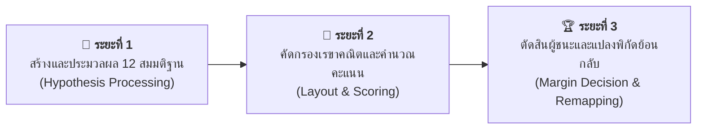

<details>
<summary> ดูเวอร์ชันข้อความ</summary>

- ระยะที่ 1: การสร้างและประมวลผล 12 สมมติฐาน (หมุนภาพ 4 ทิศทางร่วมกับ 3 ฟิลเตอร์แสง ตรวจจับตัวเลขด้วย YOLO26 และตัดกล่องซ้อนด้วย IoU)
- ระยะที่ 2: การคัดกรองเรขาคณิตและคำนวณคะแนน (กรองแถวแนวตั้งด้วย is_vertical คำนวณคะแนน Score และประเมินตำแหน่งทศนิยมสีแดงด้วย red_ratio)
- ระยะที่ 3: การตัดสินผู้ชนะและแปลงพิกัดย้อนกลับ (เปรียบเทียบคะแนนผ่านกฎ Margin Rule คัดเลือกมุมที่ชนะ และแปลงพิกัดกลับสู่ภาพต้นฉบับด้วย remap_bbox)
</details>

<p align="center"><strong>ภาพที่ 1.4: กระบวนการค้นหาทิศทางและฟิลเตอร์ที่เหมาะสมด้วยฟังก์ชัน detect_digits_best (12 รูปแบบ)</strong></p>

&emsp;&emsp;&emsp;&emsp;**2. แผนภาพกระบวนการทำงานย่อยในแต่ละระยะ (Sub-search Workflows):**

&emsp;&emsp;&emsp;&emsp;*(ก) ระยะที่ 1 การสร้างและประมวลผล 12 สมมติฐาน (Hypothesis Generation & Processing):*

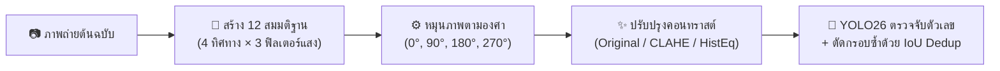

<details>
<summary> ดูเวอร์ชันข้อความ</summary>

1. ภาพถ่ายต้นฉบับ
2. สร้าง 12 สมมติฐาน (4 ทิศทางการหมุนร่วมกับ 3 ฟิลเตอร์ปรับแสง)
3. หมุนภาพตามมุมองศา (0, 90, 180, หรือ 270 องศา)
4. ปรับปรุงคอนทราสต์ของภาพ (Original, CLAHE, หรือ Histogram Equalization)
5. ตรวจจับตัวเลขด้วย YOLO26 และกำจัดกรอบซ้ำซ้อนด้วย IoU Deduplication
</details>

<p align="center"><strong>ภาพที่ 1.4 (ก): แผนภาพระยะที่ 1 การสร้างและประมวลผล 12 สมมติฐาน</strong></p>

&emsp;&emsp;&emsp;&emsp;*(ข) ระยะที่ 2 การคัดกรองเรขาคณิตและการคำนวณคะแนน (Geometric Filtering & Scoring):*


<details>
<summary> ดูเวอร์ชันข้อความ</summary>

1. รับข้อมูลกล่องตัวเลขที่ตรวจพบจากแต่ละสมมติฐาน
2. ตรวจสอบทิศทางการเรียงตัวของแถวตัวเลขด้วยฟังก์ชัน is_vertical
   - กรณีเป็นแถวแนวตั้ง: ตัดทิ้งทันทีเนื่องจากไม่ใช่แถวตัวเลขบนหน้าปัด
   - กรณีเป็นแถวแนวนอนที่มี 4 ถึง 9 หลัก: นำเข้าสู่ขั้นตอนการคำนวณคะแนน
3. คำนวณคะแนนความเหมาะสม (Score เท่ากับ ค่าความเชื่อมั่นเฉลี่ยคูณด้วยจำนวนหลัก)
4. ตรวจสอบสัดส่วนพิกเซลสีแดง (red_ratio)
   - หากหลักสีแดงอยู่ขวาสุด: มอบคะแนนโบนัสเพิ่มร้อยละ 5
   - หากหลักสีแดงอยู่ซ้ายสุด: ปรับลดคะแนนลงร้อยละ 50 เนื่องจากมีแนวโน้มภาพกลับทิศ
</details>

<p align="center"><strong>ภาพที่ 1.4 (ข): แผนภาพระยะที่ 2 การคัดกรองเรขาคณิตและการคำนวณคะแนน</strong></p>

&emsp;&emsp;&emsp;&emsp;*(ค) ระยะที่ 3 การตัดสินผู้ชนะและการแปลงพิกัดย้อนกลับ (Margin Decision & Remapping):*

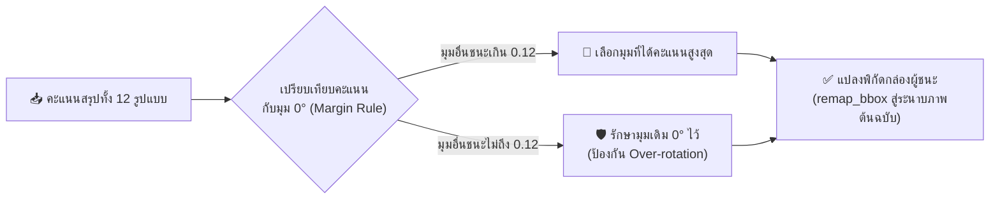

<details>
<summary> ดูเวอร์ชันข้อความ</summary>

1. รวบรวมคะแนนสรุปจากทั้ง 12 รูปแบบ
2. เปรียบเทียบคะแนนกับมุมปกติ 0 องศาตามกฎ Margin Rule
   - กรณีมุมอื่นได้คะแนนสูงกว่ามุม 0 องศาเกินเกณฑ์ 0.12: คัดเลือกมุมที่ได้คะแนนสูงสุดเป็นผู้ชนะ
   - กรณีมุมอื่นได้คะแนนสูงกว่าไม่เกินเกณฑ์ 0.12: คงมุม 0 องศาไว้เพื่อป้องกันการสลับมุมโดยไม่จำเป็น
3. นำกล่องขอบเขตของรูปแบบที่ชนะไปแปลงพิกัดกลับสู่ระนาบภาพต้นฉบับเดิมด้วยฟังก์ชัน remap_bbox
</details>

<p align="center"><strong>ภาพที่ 1.4 (ค): แผนภาพระยะที่ 3 การตัดสินผู้ชนะและการแปลงพิกัดย้อนกลับ</strong></p>

---

&emsp;&emsp;&emsp;&emsp;**ความสัมพันธ์ระหว่างฟังก์ชันย่อยกับการแก้ไขปัญหาทางเทคนิค:**

1.12.4.1 **หมุน 4 ทิศ (0°/90°/180°/270°):** ช่วยแก้ปัญหาภาพถ่ายเอียงหรือกลับทิศทาง
1.12.4.2 **ปรับแสง 3 แบบ (Orig/CLAHE/HistEq):** ช่วยแก้ปัญหาตัวเลขเลือนรางหรืออยู่ในเงามืด
1.12.4.3 **YOLO ตรวจจับ:** ทำหน้าที่ตรวจจับตำแหน่งตัวเลข 0–9 ทุกหลัก
1.12.4.4 **IoU dedup (threshold 0.45):** ช่วยตัดกล่องที่ซ้อนทับซ้ำซ้อนให้เหลือกล่องเดียว
1.12.4.5 **is_vertical:** ทำหน้าที่กรองข้อความวันที่หรือหมายเลขซีเรียลที่เรียงเป็นแนวตั้งทิ้ง
1.12.4.6 **red_ratio + Scoring:** ใช้ตรวจสอบทิศทางหน้าปัด (หลักทศนิยมสีแดงต้องอยู่ขวาสุด)
1.12.4.7 **Scoring (mean_conf × n):** ทำหน้าที่คัดเลือกรูปแบบที่มีค่าความเชื่อมั่นและจำนวนหลักสอดคล้องกับเกณฑ์
1.12.4.8 **Margin 0.12:** ช่วยป้องกันการสลับมุมเมื่อคะแนนมีความใกล้เคียงกัน
1.12.4.9 **remap_bbox:** ทำหน้าที่แปลงพิกัดกล่องให้ตรงกับภาพต้นฉบับ

&emsp;&emsp;&emsp;&emsp;**การทำงานแบ่งออกเป็น 3 ฟังก์ชันย่อยตามหน้าที่:**

1.12.4.10 **`red_ratio(img_bgr, bbox)` — ตรวจสีแดงของหลักทศนิยม:**
 1.12.4.11 **ปัญหาที่แก้ไข:** การตรวจสอบทิศทางของหน้าปัด — มาตรวัดน้ำกลไกทั่วไปมีหลักทศนิยมสีแดงอยู่ตำแหน่งขวาสุด หากตรวจพบสีแดงที่ตำแหน่งซ้ายสุด มีความเป็นไปได้สูงที่ภาพจะกลับหัว
 1.12.4.12 **การทำงาน:** ครอปภาพเฉพาะภายในกรอบ Bounding Box แปลงเป็นปริภูมิสี HSV แล้วคำนวณสัดส่วนพิกเซลสีแดง

1.12.4.13 **`eval_orientation(bgr_img, angle, prep)` — ประเมินคะแนนในแต่ละรูปแบบ:**
 1.12.4.14 **วัตถุประสงค์:** ตัดสินว่าทิศทางและฟิลเตอร์ใดมีความน่าเชื่อถือสูงสุด และกรองผลการตรวจจับที่คลาดเคลื่อน — โดยต้องเรียงตัวในแนวนอนและมีจำนวนหลัก 4–9 หลักจึงจะได้รับการคำนวณคะแนน
 1.12.4.15 **วิธีการทำงาน:** หมุนภาพและปรับคอนทราสต์ตามที่กำหนด จากนั้นตรวจจับตัวเลขด้วยแบบจำลอง YOLO แล้วตัดกรอบที่ซ้ำซ้อนด้วยฟังก์ชัน `dedup_detections` ต่อด้วยการตรวจสอบการเรียงตัวแนวนอนและจำนวนหลัก และคำนวณคะแนนรวมจากความเชื่อมั่นเฉลี่ยคูณจำนวนหลักพร้อมปรับคะแนนตามตำแหน่งหลักทศนิยมสีแดง

1.12.4.16 **`detect_digits_best(rgb_img)` — คัดเลือกผลลัพธ์ที่ดีที่สุด:**
 1.12.4.17 **วัตถุประสงค์:** คัดเลือกรูปแบบที่เหมาะสมที่สุดจาก 12 รูปแบบการทดสอบ โดยมีเกณฑ์ Margin ป้องกันความผันผวนของมุมองศา
 1.12.4.18 **การทำงาน:** รันฟังก์ชัน `eval_orientation` ครบทั้ง 12 รูปแบบ แล้วเลือกตัวแทนที่ดีที่สุดของแต่ละมุม (4 มุม) จากนั้นคัดเลือกมุมที่ได้คะแนนสูงสุด (`best_angle`) โดยใช้กฎ **Margin Rule** หากมุมอื่นชนะมุม 0° ไม่เกินเกณฑ์ `ORIENT_MARGIN = 0.12` ให้คงมุม 0° ไว้ และดำเนินการแปลงพิกัดกล่องของมุมที่ชนะกลับสู่ภาพเดิมด้วย `remap_bbox`

&emsp;&emsp;&emsp;&emsp;**รายละเอียดทางเทคนิคของกระบวนการ:** ระบบประมวลผลการค้นหาตัวเลขจากภาพทั้ง 12 รูปแบบ โดยฟังก์ชัน `red_ratio` ตรวจวัดสัดส่วนพิกเซลสีแดงในปริภูมิสี HSV เพื่อระบุตำแหน่งหลักทศนิยม จากนั้นฟังก์ชัน `eval_orientation` คำนวณคะแนนความเชื่อมั่นรวม (คัดกรองเฉพาะกลุ่มตัวเลขแนวนอนจำนวน 4–9 หลัก และปรับคะแนนตามตำแหน่งหลักสีแดง) และฟังก์ชัน `detect_digits_best` ทำการคัดเลือกผลลัพธ์ที่ดีที่สุดในแต่ละมุม พร้อมใช้เกณฑ์ตัดสิน `ORIENT_MARGIN = 0.12` เพื่อป้องกันความผันผวนจากการสลับมุมองศาเมื่อคะแนนใกล้เคียงกัน

---


```python
def red_ratio(img_bgr: np.ndarray, bbox: list[float]) -> float:
    """คำนวณสัดส่วนสีแดงในกล่องตัวเลข (หลักทศนิยมสีแดงต้องอยู่ขวาสุดของหน้าปัด)"""
    x1, y1, x2, y2 = [int(v) for v in bbox]
    pad_x = max(1, int((x2 - x1) * 0.15))
    pad_y = max(1, int((y2 - y1) * 0.15))

    crop = img_bgr[
        max(0, y1 + pad_y): min(img_bgr.shape[0], y2 - pad_y),
        max(0, x1 + pad_x): min(img_bgr.shape[1], x2 - pad_x),
    ]
    if crop.size == 0:
        return 0.0

    hsv = cv2.cvtColor(crop, cv2.COLOR_BGR2HSV)
    mask1 = cv2.inRange(hsv, (0, 40, 40), (12, 255, 255))
    mask2 = cv2.inRange(hsv, (165, 40, 40), (180, 255, 255))
    return float(np.mean((mask1 | mask2) > 0))

def eval_orientation(bgr_img: np.ndarray, angle: int, prep: str) -> dict[str, Any]:
    """ประเมินผลลัพธ์ของ 1 มุม × 1 ฟิลเตอร์"""
    rot = rotate_image(bgr_img, angle)
    proc = apply_prep(rot, prep)
    dets = dedup_detections(detect_digits(proc))

    rh, rw = rot.shape[:2]
    vert = is_vertical(dets, rw, rh)
    n = len(dets)

    if not dets or vert["vertical"] or not (EXPECTED_MIN_DIGITS <= n <= EXPECTED_MAX_DIGITS):
        return {"score": 0.0, "dets": dets, "prep": prep, "vert": vert}

    score = float(np.mean([d["confidence"] for d in dets])) * n

    # กฎสีแดง: หลักทศนิยมสีแดงต้องอยู่ขวาสุดเสมอ
    r_first = red_ratio(proc, dets[0]["bbox"])
    r_last = red_ratio(proc, dets[-1]["bbox"])

    if r_first > RED_THRESH and r_first > r_last * RED_DOMINANCE:
        score *= 0.5   # แดงอยู่ซ้าย -> น่าจะกลับหัว (ตัดคะแนน)
    elif r_last > RED_THRESH and r_last > r_first * RED_DOMINANCE:
        score *= 1.05  # แดงอยู่ขวา -> ทิศทางถูกต้อง (เพิ่มคะแนน)

    return {"score": score, "dets": dets, "prep": prep, "vert": vert}

def detect_digits_best(rgb_img: np.ndarray) -> tuple[list[dict[str, Any]], dict[str, Any] | None]:
    """ทดลอง 4 ทิศ × 3 ฟิลเตอร์ (12 รูปแบบ) แล้วเลือกชุดที่ได้คะแนนสูงสุด"""
    h, w = rgb_img.shape[:2]
    bgr = cv2.cvtColor(rgb_img, cv2.COLOR_RGB2BGR)

    candidates = {}
    for angle in ROTATION_ANGLES:
        best_in_angle = max(
            [eval_orientation(bgr, angle, prep) for prep in PREP_LIST],
            key=lambda c: c["score"],
        )
        candidates[angle] = best_in_angle

    cand0 = candidates[0]
    best_angle, best_cand = max(candidates.items(), key=lambda item: item[1]["score"])

    # Margin Rule: มุมอื่นต้องชนะมุม 0° เกินกำหนด จึงยอมสลับมุม (กันพลิกฉิวเฉียด)
    if (
        best_angle != 0
        and cand0["dets"]
        and not cand0["vert"]["vertical"]
        and (best_cand["score"] - cand0["score"] < ORIENT_MARGIN)
    ):
        best_angle, best_cand = 0, cand0

    best_dets = best_cand["dets"]
    best_meta = None

    if best_dets:
        best_meta = {
            "angle": best_angle,
            "prep": best_cand["prep"],
            "clahe": best_cand["prep"] == "clahe",
        }
        for d in best_dets:
            d["bbox"] = remap_bbox(d["bbox"], best_angle, w, h)
            d["center_x"] = (d["bbox"][0] + d["bbox"][2]) / 2.0
            d["center_y"] = (d["bbox"][1] + d["bbox"][3]) / 2.0

    return best_dets, best_meta
```

> **สรุปสาระสำคัญหัวข้อ 1.12:**
> * `detect_digits_best`: ประมวลผลการค้นหาเชิงสมมติฐานพหุคูณ 12 รูปแบบ (4 ทิศทางการหมุน × 3 ฟิลเตอร์ปรับปรุงภาพ) และคัดเลือกผลลัพธ์โดยอาศัยเกณฑ์ค่าความเชื่อมั่นเฉลี่ย สัดส่วนสีแดง และค่า Margin
> * `remap_bbox`: แปลงพิกัดทางเรขาคณิตของกรอบ Bounding Box จากระนาบภาพหมุนกลับสู่ระนาบภาพต้นฉบับ
> * กลยุทธ์การประเมิน 12 รูปแบบถูกออกแบบเพื่อชดเชยความแปรปรวนของมุมเอียงและการหมุนของภาพถ่ายในสภาพแวดล้อมจริง

---

# บทที่ 2: หลักการและทฤษฎีที่เกี่ยวข้อง

---

### 2.1 ระบบงานเดิม (Current System)

&emsp;&emsp;&emsp;&emsp;ก่อนที่โครงงานนี้จะถูกพัฒนาขึ้น การอ่านค่ามาตรวัดน้ำในประเทศไทยดำเนินการโดยพนักงานของการประปาซึ่งต้องเดินทางไปยังที่พักอาศัยของผู้ใช้น้ำทุกเดือน เพื่ออ่านค่าตัวเลขบนหน้าปัดมาตรวัดน้ำด้วยสายตาและบันทึกข้อมูลลงในระบบด้วยมือ

&emsp;&emsp;&emsp;&emsp;**กระบวนการทำงานของระบบเดิม** ประกอบด้วยขั้นตอนหลัก 4 ขั้นตอนดังนี้

2.1.1 **พนักงาน**เดินทางภาคสนามไปยังที่อยู่อาศัยของผู้ใช้น้ำตามรอบ
2.1.2 **พนักงาน**อ่านค่าตัวเลขบนหน้าปัดมาตรวัดน้ำด้วยสายตาและบันทึกลงสมุด
2.1.3 **พนักงาน**นำข้อมูลที่บันทึกมากรอกลงในระบบคอมพิวเตอร์ที่สำนักงาน
2.1.4 **ระบบ**คำนวณค่าน้ำและออกใบแจ้งหนี้ให้ผู้ใช้น้ำ

&emsp;&emsp;&emsp;&emsp;**ปัญหาและข้อจำกัดของระบบเดิม** ได้แก่ (1) **ความผิดพลาดในการอ่าน** เกิดจากหน้าปัดเลือนราง มีคราบสกปรก หรือสภาพแสงไม่เพียงพอ (2) **ต้นทุนแรงงานสูง** พนักงานต้องใช้เวลาเดินทางหลายชั่วโมงต่อวันเพื่ออ่านค่ามาตรวัดน้ำจำนวนมาก (3) **ความล่าช้าในการตรวจจับความผิดปกติ** เช่น ท่อรั่ว การใช้น้ำผิดปกติ หรือมาตรวัดน้ำชำรุด ซึ่งต้องรอจนถึงรอบการอ่านครั้งถัดไปจึงจะตรวจพบ

---

### 2.2 ระบบงานและงานวิจัยที่เกี่ยวข้อง

&emsp;&emsp;&emsp;&emsp;มีการศึกษาวิจัยเกี่ยวกับการอ่านค่ามาตรวัดอัตโนมัติจากภาพถ่ายอย่างต่อเนื่อง โดยตารางที่ 2.1 สรุปงานวิจัยที่เกี่ยวข้องและเปรียบเทียบกับโครงงานนี้

<p align="center"><strong>ตารางที่ 2.1: สรุปงานวิจัยที่เกี่ยวข้องและการเปรียบเทียบกับสถาปัตยกรรมโครงงานนี้</strong></p>

| งานวิจัย / ระบบ | วิธีการหลัก | จุดแข็ง | ข้อจำกัด | โครงงานนี้ต่างออกไปอย่างไร |
|---|---|---|---|---|
| Liang et al. (2022) | CNN + Digit Segmentation | รายงานว่ามีความแม่นยำสูงในภาพควบคุม (ตามงานต้นฉบับ) | งานต้นฉบับระบุว่าต้องการภาพคุณภาพดี | โครงงานนี้ใช้ YOLO26 โดยออกแบบให้ประมวลผลภาพเต็มเฟรมโดยไม่ต้องตัดภาพล่วงหน้า — ความสามารถในการทนต่อมุมเอียง/แสงยังต้องมีการประเมินแบบควบคุม |
| Wang & Xiang (2024) GMS-YOLO | YOLO ที่ปรับสำหรับสภาพแวดล้อมซับซ้อน | รายงานว่าทำงานได้ดีในสภาพแสงยาก (ตามงานต้นฉบับ) | งานต้นฉบับใช้ dataset เฉพาะ | โครงงานนี้ออกแบบให้เพิ่มการคัดกรองด้วย SigLIP2 ก่อนการตรวจจับ และเพิ่ม Safety Guards — เป็นความแตกต่างเชิงสถาปัตยกรรม ไม่ใช่ข้อสรุปเชิงประสิทธิภาพแบบควบคุม |
| Salomon et al. (2022) | Two-stage: Detect + OCR | รายงานว่าทำงานได้ในสภาพ unconstrained | งานต้นฉบับระบุว่าต้องการทรัพยากรประมวลผลสูง | โครงงานนี้ได้รับการออกแบบให้ทำงานได้บน CPU ทั่วไป — การเปรียบเทียบความเร็วแบบควบคุมยังไม่มี (ต้องวัดด้วยฮาร์ดแวร์/ความละเอียด/จำนวนสมมติฐานเดียวกัน) |
| Nguyen et al. (2025) | Text Recognition + DL | รายงานว่ารองรับหลายรูปแบบมาตรวัด | งานต้นฉบับระบุว่าต้องการ dataset ขนาดใหญ่ | โครงงานนี้ออกแบบให้ใช้ Zero-shot SigLIP2 โดยมีวัตถุประสงค์เพื่อลดการฝึก classifier ใหม่ — ผลกระทบต่อความต้องการข้อมูลยังต้องมีการประเมินแบบควบคุม |
| **โครงงานนี้** | **YOLO26 + SigLIP2 + 12-combo search** | **ออกแบบโดยมีวัตถุประสงค์เพื่อประมวลผลภาพที่มีสัญญาณรบกวน, ไม่ต้องฝึก classifier ใหม่, และมี Safety Guards** | **จำกัดเฉพาะมาตรวัดตัวเลขแนวนอน** | — |

<p align="center"><em>ที่มา: สังเคราะห์และเปรียบเทียบจากงานวิจัยของ Liang et al. (2022), Wang & Xiang (2024) และ Zhai et al. (2023)</em></p>

---

### 2.3 วงจรการพัฒนาซอฟต์แวร์ (SDLC) ที่ใช้ในโครงงาน

&emsp;&emsp;&emsp;&emsp;โครงงานนี้ประยุกต์ใช้วงจรการพัฒนาซอฟต์แวร์แบบ **Iterative and Incremental Development** ซึ่งแบ่งการพัฒนาออกเป็นรอบ (Iteration) สั้น ๆ แต่ละรอบเพิ่มคุณลักษณะใหม่และทดสอบผลก่อนพัฒนาต่อ เหมาะกับโครงงานที่มีความไม่แน่นอนสูงและต้องการปรับเปลี่ยนบ่อย

&emsp;&emsp;&emsp;&emsp;**ขั้นตอนการพัฒนาตามวงจร SDLC ของโครงงาน:**

2.3.1 **วิเคราะห์ความต้องการ (Requirements Analysis):** ศึกษาปัญหาการอ่านมาตรวัดน้ำ กำหนดวัตถุประสงค์ และขอบเขตของระบบ
2.3.2 **ออกแบบระบบ (System Design):** ออกแบบ Pipeline ประมวลผล กำหนดเทคโนโลยีที่ใช้ และวางโครงสร้างโค้ด
2.3.3 **เตรียมชุดข้อมูลและฝึกแบบจำลอง (Data & Training):** รวบรวมและกำกับพิกัดตัวเลขใน Roboflow แล้วฝึก YOLO26
2.3.4 **พัฒนาระบบประมวลผล (Implementation):** เขียนโค้ดฟังก์ชันหลัก ตั้งแต่ `rotate_image` ถึง `read_meter`
2.3.5 **ทดสอบและปรับปรุง (Testing & Iteration):** ทดสอบกับภาพจริง ปรับค่า threshold และเพิ่ม Safety Guards
2.3.6 **บูรณาการและส่งมอบ (Integration & Deployment):** สร้าง FastAPI และ Gradio UI สำหรับการใช้งานจริง

---


# บทที่ 3: การพัฒนาแอปพลิเคชันและส่วนติดต่อผู้ใช้

---

### 3.1 การบูรณาการระบบประมวลผลหลักและกลไกความปลอดภัย

&emsp;&emsp;&emsp;&emsp;ระบบอ่านค่ามาตรวัดน้ำอัตโนมัติที่นำไปประยุกต์ใช้งานจริง ไม่เพียงต้องการแบบจำลองที่มีความสามารถในการตรวจจับตัวเลขเท่านั้น แต่จำเป็นต้องมีกลไกประเมินความเสี่ยงและแจ้งเตือนเมื่อผลลัพธ์มีความไม่แน่นอน เพื่อทำหน้าที่เป็นกลไกความปลอดภัย (Safety Guards) ในการตรวจสอบผลลัพธ์ก่อนส่งออกข้อมูล ดังแสดงในภาพที่ 3.1 โดยเพื่อความชัดเจนในการแสดงผลบนหน้ากระดาษขนาดมาตรฐาน A4 ระบบจึงจำแนกแผนภาพออกเป็นภาพรวมสถาปัตยกรรมกลไกความปลอดภัย และแผนภาพจำลองกลไกย่อยในแต่ละด้าน (ก)–(ค) ดังนี้

&emsp;&emsp;&emsp;&emsp;**1. แผนภาพภาพรวมสถาปัตยกรรมกลไกความปลอดภัย (Safety Architecture Overview):**

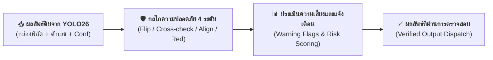

<details>
<summary> ดูเวอร์ชันข้อความ</summary>

1. รับผลลัพธ์ดิบจากการตรวจจับของแบบจำลอง YOLO26 (พิกัดกล่อง ค่าตัวเลข และค่าความเชื่อมั่น)
2. ส่งเข้าสู่กลไกความปลอดภัย 4 ระดับ (การตรวจจับภาพกลับหัว, การตรวจทานด้วย SigLIP2, การตรวจแนวระนาบแถว, และการตรวจสีแดงทศนิยม)
3. ประเมินความเสี่ยงและกำหนดสัญลักษณ์แจ้งเตือน (Warning Flags)
4. ส่งออกผลลัพธ์ที่ผ่านการตรวจสอบยืนยันความปลอดภัยครบถ้วน
</details>

<p align="center"><strong>ภาพที่ 3.1: แนวคิดกลไกความปลอดภัย (Safety Guards) สำหรับตรวจสอบผลลัพธ์ก่อนส่งให้ผู้ใช้</strong></p>

&emsp;&emsp;&emsp;&emsp;**2. แผนภาพกลไกความปลอดภัยย่อยในแต่ละด้าน (Sub-guard Workflows):**

&emsp;&emsp;&emsp;&emsp;*(ก) แผนภาพกลไกตรวจสอบภาพกลับหัว 180° ด้วยฟังก์ชัน `flip_guard`:*

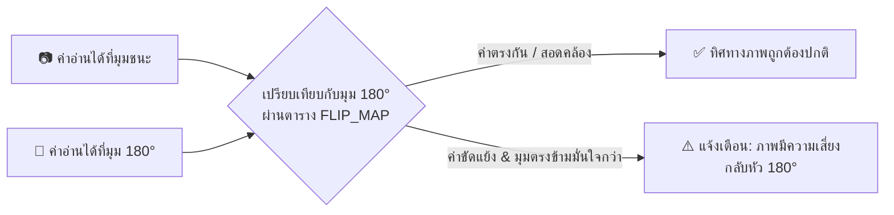

<details>
<summary> ดูเวอร์ชันข้อความ</summary>

1. รับค่าตัวเลขที่อ่านได้จากมุมที่ชนะ และค่าตัวเลขจากการประมวลผลที่มุมตรงข้าม 180 องศา
2. เปรียบเทียบความสัมพันธ์ของตัวเลขผ่านตารางคู่สมมาตร FLIP_MAP
   - กรณีค่าตัวเลขสอดคล้องกันตามปกติ: ยืนยันว่าทิศทางภาพถูกต้อง
   - กรณีค่าตัวเลขขัดแย้งและมุมตรงข้ามมีค่าความเชื่อมั่นสูงกว่า: สร้างข้อความแจ้งเตือนความเสี่ยงภาพกลับหัว 180 องศา
</details>

<p align="center"><strong>ภาพที่ 3.1 (ก): แผนภาพกลไกตรวจสอบภาพกลับหัว 180° ด้วยฟังก์ชัน flip_guard</strong></p>

&emsp;&emsp;&emsp;&emsp;*(ข) แผนภาพกลไกตรวจทานหลักความเชื่อมั่นต่ำด้วย SigLIP2 (`cross_check_digits`):*

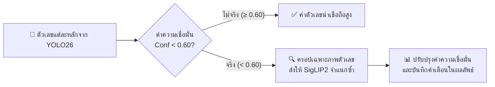

<details>
<summary> ดูเวอร์ชันข้อความ</summary>

1. ตรวจสอบค่าความเชื่อมั่นของตัวเลขแต่ละหลักที่ตรวจจับได้จาก YOLO26
2. พิจารณาตามเกณฑ์ความเชื่อมั่นที่กำหนด (CONF_RELIABLE เท่ากับ 0.60)
   - กรณีค่าความเชื่อมั่นตั้งแต่ 0.60 ขึ้นไป: ยอมรับผลลัพธ์เนื่องจากมีความน่าเชื่อถือสูง
   - กรณีค่าความเชื่อมั่นต่ำกว่า 0.60: ครอปภาพเฉพาะตัวเลขหลักดังกล่าวส่งให้แบบจำลอง SigLIP2 จำแนกซ้ำ
3. นำผลการจำแนกจาก SigLIP2 มาปรับปรุงค่าความเชื่อมั่นและบันทึกข้อความเตือนลงในผลลัพธ์
</details>

<p align="center"><strong>ภาพที่ 3.1 (ข): แผนภาพกลไกตรวจทานหลักความเชื่อมั่นต่ำด้วย SigLIP2</strong></p>

&emsp;&emsp;&emsp;&emsp;*(ค) แผนภาพกลไกตรวจสอบระนาบแถวตัวเลขและสีแดงทศนิยม (`align_ok` & `red_ratio`):*

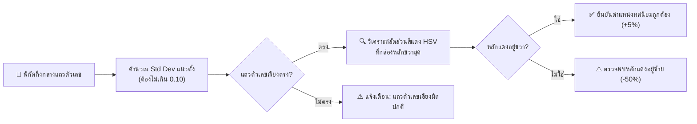

<details>
<summary> ดูเวอร์ชันข้อความ</summary>

1. คำนวณค่าเบี่ยงเบนมาตรฐาน (Standard Deviation) ในแนวดิ่งของจุดกึ่งกลางแถวตัวเลข
2. ตรวจสอบว่าค่าเบี่ยงเบนมาตรฐานอยู่ในเกณฑ์ที่กำหนดหรือไม่ (ไม่เกิน 0.10)
   - กรณีเกินเกณฑ์: แจ้งเตือนว่าแนวแถวตัวเลขเอียงผิดปกติ
   - กรณีอยู่ในเกณฑ์: วิเคราะห์สัดส่วนสีแดงในปริภูมิสี HSV ที่กล่องขวาสุด
3. ตรวจสอบตำแหน่งของหลักทศนิยมสีแดง
   - กรณีหลักสีแดงอยู่ขวาสุด: ยืนยันโครงสร้างหน้าปัดถูกต้อง พร้อมมอบโบนัสร้อยละ 5
   - กรณีหลักสีแดงอยู่ซ้ายสุด: แจ้งเตือนความผิดปกติและปรับลดคะแนนลงร้อยละ 50
</details>

<p align="center"><strong>ภาพที่ 3.1 (ค): แผนภาพกลไกตรวจสอบระนาบแถวตัวเลขและสีแดงทศนิยม</strong></p>

#### 3.1.1 การตรวจจับภาพกลับหัวแบบสมมาตรด้วยฟังก์ชัน `flip_guard`
3.1.1.1 **ปัญหา:** ตัวเลขอารบิกบางตัวมีลักษณะสมมาตรเชิงเรขาคณิตเมื่อหมุน 180° เช่น 6 กับ 9, 2 กับ 5 รวมถึง 0, 1 และ 8 ส่งผลให้ภาพที่กลับหัวยังคงสามารถตรวจจับตัวเลขได้แต่ให้ค่าผลลัพธ์ที่ไม่ถูกต้อง
3.1.1.2 **แนวคิดการแก้ไข:** ประมวลผลภาพที่มุมตรงข้าม 180° เพื่อตรวจสอบความสอดคล้อง หากผลลัพธ์ไม่สอดคล้องกับตารางการจับคู่สมมาตร `FLIP_MAP` แสดงว่าภาพต้นฉบับอาจอยู่ในทิศทางกลับหัว ระบบจึงสร้างการแจ้งเตือนแก่ผู้ใช้งาน
3.1.1.3 **กระบวนการทำงาน:** เปรียบเทียบลำดับตัวเลขย้อนกลับ (`reversed`) กับผลลัพธ์จากการหมุน 180° ผ่าน `FLIP_MAP = {0:0, 1:1, 2:5, 5:2, 6:9, 8:8, 9:6}` หากผลลัพธ์ไม่ตรงกันและค่าความเชื่อมั่นเฉลี่ยของมุมตรงข้ามมีค่าสูงกว่าเกณฑ์ที่กำหนด ระบบจะกำหนดค่า `warned = True`

&emsp;&emsp;&emsp;&emsp;**รายละเอียดทางเทคนิคของกระบวนการ:** ตัวเลขบางตัวมีลักษณะสมมาตรเมื่อกลับหัว 180 องศา (เช่น 6 กับ 9, 2 กับ 5 หรือ 0, 1, 8) ระบบจึงกำหนดกลไกป้องกันผ่านฟังก์ชัน `flip_guard` โดยนำลำดับตัวเลขที่อ่านได้มาย้อนกลับ (`reversed`) แล้วจับคู่กับพจนานุกรม `FLIP_MAP` หากตรวจพบว่าค่าที่กลับหัวมีความเป็นไปได้สูงร่วมกับเงื่อนไขแสงสว่างและความเชื่อมั่น ระบบจะสร้างข้อความแจ้งเตือนความเสี่ยงภาพกลับหัวเพื่อให้ผู้ใช้งานตรวจสอบยืนยัน


```python
FLIP_MAP = {0: 0, 1: 1, 2: 5, 5: 2, 6: 9, 8: 8, 9: 6}

def flip_guard(rgb_img: np.ndarray, digits: list[dict[str, Any]], meta: dict[str, Any] | None) -> dict[str, Any]:
 """ตรวจสอบความสมมาตร 180° ป้องกันการอ่านกลับหัว (Mirror Check)"""
 if not digits or not meta:
 return {"warned": False, "anti_reading": "", "anti_confidence": 0.0}

 anti_angle = (meta["angle"] + 180) % 360
 rot_bgr = rotate_image(cv2.cvtColor(rgb_img, cv2.COLOR_RGB2BGR), anti_angle)
 anti_dets = dedup_detections(detect_digits(apply_prep(rot_bgr, meta["prep"])))

 if not anti_dets:
 return {"warned": False, "anti_reading": "", "anti_confidence": 0.0}

 anti_reading = "".join(str(d["digit"]) for d in anti_dets)
 mean_conf = float(np.mean([d["confidence"] for d in anti_dets]))

 # เปรียบเทียบเลขหัว-ท้ายแบบกระจกสะท้อนกับตาราง FLIP_MAP
 digits_rev = [d["digit"] for d in reversed(digits)]
 anti_vals = [d["digit"] for d in anti_dets]

 consistent = (
 len(anti_vals) == len(digits_rev)
 and all(
 FLIP_MAP.get(orig) == anti
 for orig, anti in zip(digits_rev, anti_vals)
 if orig in FLIP_MAP
 )
 )

 return {
 "warned": bool(mean_conf >= FLIP_GUARD_CONF and not consistent),
 "anti_reading": anti_reading,
 "anti_confidence": round(mean_conf, 4),
 }

@torch.inference_mode()
def cross_check_digits(rgb_img: np.ndarray, digits: list[dict[str, Any]], h: int, w: int, angle: int = 0) -> list[dict[str, Any]]:
 """SigLIP2 Cross-check ตรวจทานเฉพาะหลักที่ YOLO มั่นใจต่ำ (< 0.60)"""
 low_conf = [d for d in digits if d["confidence"] < CONF_RELIABLE]
 if not low_conf:
 return []

 processor, model = get_siglip()
 labels = [str(i) for i in range(10)]
 mismatches = []

 for d in low_conf:
 x1, y1, x2, y2 = [int(v) for v in d["bbox"]]
 crop = rgb_img[max(0, y1): min(h, y2), max(0, x1): min(w, x2)]

 if crop.shape[0] < MIN_CROP_PX or crop.shape[1] < MIN_CROP_PX:
 continue

 if angle != 0:
 crop_bgr = cv2.cvtColor(crop, cv2.COLOR_RGB2BGR)
 crop = cv2.cvtColor(rotate_image(crop_bgr, angle), cv2.COLOR_BGR2RGB)

 inputs = processor(
 text=labels,
 images=Image.fromarray(crop),
 padding="max_length",
 return_tensors="pt",
 ).to(DEVICE)

 outputs = model(**inputs)
 probs = torch.softmax(outputs.logits_per_image, dim=1)[0].cpu().numpy()
 pred = int(np.argmax(probs))

 if pred != d["digit"]:
 mismatches.append({
 "position": d["position"],
 "yolo_digit": d["digit"],
 "siglip_digit": pred,
 "siglip_confidence": float(probs[pred]),
 })

 return mismatches
```

---

#### 3.1.2 ฟังก์ชันประมวลผลหลัก `read_meter`

&emsp;&emsp;&emsp;&emsp;**รายละเอียดทางเทคนิคของกระบวนการ:** ฟังก์ชัน `read_meter` ทำหน้าที่เป็นศูนย์กลางควบคุมกระบวนการประมวลผลหลัก (Main Pipeline Controller) โดยเชื่อมโยง 4 ขั้นตอนต่อเนื่อง ได้แก่ การคัดกรองประเภทมาตรวัดน้ำ การค้นหาทิศทางและตรวจจับตัวเลข การกรองคอลัมน์แนวตั้ง และการตรวจสอบความปลอดภัยทางเรขาคณิต ในกระบวนการนี้ระบบจะคำนวณความตรงแนวของตัวเลข (`align_ok`) ด้วยค่าเบี่ยงเบนมาตรฐาน ตรวจสอบความสอดคล้องของตัวเลขรายหลักร่วมกับ SigLIP2 (`cross_check_digits`) และรวบรวมรายการแจ้งเตือน (`warnings`) ทุกกรณีที่มีความเสี่ยง เพื่อให้ผู้ใช้งานสามารถตรวจสอบความถูกต้องได้อย่างโปร่งใส


```python
def read_meter(rgb_img: np.ndarray) -> dict[str, Any]:
 """รับภาพ RGB ประมวลผล 4 ขั้นตอน และคืนค่าตัวเลขพร้อมคำเตือน"""
 t0 = perf_counter()
 h, w = rgb_img.shape[:2]

 # ขั้นที่ 1: ตรวจสอบประเภทมิเตอร์ (SigLIP2)
 meter = check_water_meter(rgb_img)
 if not meter["verified"]:
 return {
 "reading": "",
 "digits": [],
 "meter_check": meter,
 "processing": None,
 "warnings": [f"ภาพนี้ไม่ใช่มิเตอร์น้ำ ({meter['predicted_class']})"],
 "elapsed_ms": round((perf_counter() - t0) * 1000, 1),
 }

 # ขั้นที่ 2: ค้นหาทิศและตัวเลขที่ดีที่สุด (YOLO26)
 dets, meta = detect_digits_best(rgb_img)
 if not dets:
 return {
 "reading": "",
 "digits": [],
 "meter_check": meter,
 "processing": meta,
 "warnings": ["ตรวจไม่พบตัวเลข"],
 "elapsed_ms": round((perf_counter() - t0) * 1000, 1),
 }

 digits = [{
 "position": i,
 "digit": d["digit"],
 "confidence": round(d["confidence"], 4),
 "bbox": d["bbox"],
 "reliable": d["confidence"] >= CONF_RELIABLE,
 } for i, d in enumerate(dets, 1)]
 mean_conf = float(np.mean([d["confidence"] for d in digits]))

 # ขั้นที่ 3: กรองคอลัมน์แนวตั้ง
 if meta and meta["angle"] == 0 and is_vertical(dets, w, h)["vertical"]:
 return {
 "reading": "",
 "digits": [],
 "meter_check": meter,
 "processing": meta,
 "warnings": ["กล่องเรียงแนวตั้ง — ไม่ใช่ค่ามิเตอร์"],
 "elapsed_ms": round((perf_counter() - t0) * 1000, 1),
 }

 # ขั้นที่ 4: ตรวจสอบความปลอดภัยและสร้างคำเตือน
 flip = flip_guard(rgb_img, digits, meta)
 align_vals = [
 (d["bbox"][0] + d["bbox"][2]) / (2 * w)
 if meta and meta["angle"] in (90, 270)
 else (d["bbox"][1] + d["bbox"][3]) / (2 * h)
 for d in digits
 ]
 align_ok = float(np.std(align_vals)) <= ALIGN_MAX_SPREAD
 mismatches = cross_check_digits(rgb_img, digits, h, w, meta["angle"] if meta else 0)

 warns = [
 msg
 for cond, msg in [
 (
 not (EXPECTED_MIN_DIGITS <= len(digits) <= EXPECTED_MAX_DIGITS),
 f"จำนวนหลัก {len(digits)} นอกช่วง {EXPECTED_MIN_DIGITS}-{EXPECTED_MAX_DIGITS}",
 ),
 (digits[0]["digit"] == 0, "หลักแรกเป็น 0 — อาจเกินมา 1 หลัก"),
 (mean_conf < CONF_RELIABLE, f"mean conf ต่ำ {mean_conf:.2f} — ภาพอาจเบลอ/เอียง"),
 (
 flip["warned"],
 f"อาจกลับหัว! หมุน 180° ได้ {flip['anti_reading']} ({flip['anti_confidence']:.2f}) — ตรวจภาพก่อนบันทึก",
 ),
 (not align_ok, "กล่องไม่เรียงแนว — อาจเป็นป้าย/วันที่"),
 ]
 if cond
 ]
 warns += [
 f"หลักที่ {d['position']} ({d['digit']}) conf ต่ำ {d['confidence']:.2f} — ควรตรวจด้วยตา"
 for d in digits
 if not d["reliable"]
 ]
 warns += [
 f"หลักที่ {m['position']}: YOLO {m['yolo_digit']} vs SigLIP {m['siglip_digit']} ({m['siglip_confidence']:.2f})"
 for m in mismatches
 ]

 return {
 "reading": "".join(str(d["digit"]) for d in digits),
 "digits": digits,
 "mean_confidence": round(mean_conf, 4),
 "meter_check": meter,
 "processing": {"best": meta},
 "warnings": warns,
 "elapsed_ms": round((perf_counter() - t0) * 1000, 1),
 }
```

&emsp;&emsp;&emsp;&emsp;**ผลลัพธ์ที่คาดหวัง:** ฟังก์ชันส่งคืนพจนานุกรมข้อมูลประกอบด้วย สตริงตัวเลขที่อ่านได้ (`reading`), รายการข้อมูลตัวเลขรายหลักพร้อมพิกัด Bounding Box และค่าความเชื่อมั่น (`digits`), ค่าความเชื่อมั่นเฉลี่ย (`mean_confidence`), รายการแจ้งเตือนความเสี่ยง (`warnings`), และเวลาประมวลผล (`elapsed_ms`)

---

### 3.2 การพัฒนาส่วนเชื่อมต่อโปรแกรมประยุกต์ด้วย FastAPI

> **หลักการและเหตุผล:** เพื่อให้ระบบประยุกต์อื่น (แอปพลิเคชันบนอุปกรณ์เคลื่อนที่ เว็บแอปพลิเคชัน หรือระบบฐานข้อมูล) สามารถส่งไฟล์ภาพมาขอรับบริการอ่านค่าผ่านโพรโทคอล HTTP ได้โดยตรง

&emsp;&emsp;&emsp;&emsp;**ภาพรวมของระบบ:** FastAPI เป็นเว็บเฟรมเวิร์กภาษา Python สำหรับสร้าง REST API ประสิทธิภาพสูง พร้อมระบบสร้างเอกสารทดสอบการทำงานอัตโนมัติ (Interactive Swagger UI) ที่เส้นทาง `/docs`

&emsp;&emsp;&emsp;&emsp;**หลักการทำงานของระบบ:** ให้บริการเซิร์ฟเวอร์ที่ `http://127.0.0.1:8000` โดยส่งคำขอผ่าน `POST /api/read-meter` พร้อมไฟล์ภาพ จะได้รับผลลัพธ์กลับในรูปแบบ JSON มาตรฐาน

&emsp;&emsp;&emsp;&emsp;**รายละเอียดทางเทคนิคของกระบวนการ:** FastAPI ทำหน้าที่เป็นเว็บเซอร์วิสประสิทธิภาพสูง ให้บริการ 2 เส้นทางหลัก ได้แก่ การตรวจสอบสถานะระบบ (`/api/health`) และการประมวลผลภาพถ่าย (`/api/read-meter`) โดยระบบรับไฟล์ภาพผ่าน HTTP POST ตรวจสอบความถูกต้องของประเภทไฟล์ด้วย `ALLOWED_TYPES` และส่งต่องานประมวลผลภาพไปยัง Thread แยกด้วย `run_in_threadpool` เพื่อป้องกันไม่ให้ภาระงานประมวลผลเชิงคำนวณปิดกั้น Event Loop ของเซิร์ฟเวอร์ ก่อนส่งคืนผลลัพธ์ในรูปแบบ JSON มาตรฐาน


```python
app = FastAPI(
 title="Meter Reader API",
 version="1.1",
 description="API ระบบอ่านค่ามาตรวัดน้ำอัตโนมัติ (Water Meter OCR Service)",
)

app.add_middleware(
 CORSMiddleware,
 allow_origins=["*"],
 allow_methods=["*"],
 allow_headers=["*"],
)
ALLOWED_TYPES = {"image/jpeg", "image/png", "image/webp", "image/bmp"}

@app.get("/api/health")
def health() -> dict[str, Any]:
 """ตรวจสอบสถานะความพร้อมของระบบและแบบจำลอง"""
 return {
 "status": "ok",
 "device": DEVICE,
 "yolo_loaded": _yolo is not None,
 "siglip_loaded": _siglip is not None,
 }

@app.post("/api/read-meter")
async def read_meter_endpoint(file: UploadFile = File(...)) -> dict[str, Any]:
 """รับไฟล์ภาพมิเตอร์น้ำและประมวลผลผ่าน Threadpool (ไม่บล็อก Event Loop)"""
 if file.content_type not in ALLOWED_TYPES:
 raise HTTPException(status_code=415, detail="ชนิดไฟล์ไม่รองรับ")

 data = await file.read()
 try:
 img = Image.open(io.BytesIO(data))
 img.load()
 arr = np.asarray(img.convert("RGB"))
 except Exception:
 raise HTTPException(status_code=422, detail="อ่านไฟล์ภาพไม่ได้")

 # รันบน Threadpool เพื่อไม่ให้งานประมวลผลภาพบล็อกการทำงานของเซิร์ฟเวอร์
 return await run_in_threadpool(read_meter, arr)

if __name__ == "__main__":
 uvicorn.run("main:app", host="127.0.0.1", port=8000, reload=True)
```
<p align="center"><strong>ซอร์สโค้ดที่ 3.3: <code>main.py</code> — การให้บริการส่วนเชื่อมต่อโปรแกรมประยุกต์ด้วย FastAPI</strong></p>

&emsp;&emsp;&emsp;&emsp;**ผลลัพธ์ที่คาดหวัง:** เมื่อสั่งทำงานคำสั่ง `uv run python main.py` ระบบจะเปิดให้บริการที่ `http://127.0.0.1:8000` โดยสามารถเข้าถึงส่วนทดสอบส่วนต่อประสานโปรแกรมประยุกต์ผ่าน Swagger UI ได้ที่ `http://127.0.0.1:8000/docs`

---

### 3.3 การพัฒนาส่วนติดต่อผู้ใช้ด้วย Gradio

> **หลักการและเหตุผล:** เพื่อให้ผู้ใช้งานทั่วไปสามารถทดสอบอัปโหลดภาพและดูผลการประมวลผลได้โดยตรงผ่านส่วนติดต่อผู้ใช้ โดยไม่จำเป็นต้องส่งคำขอผ่าน API ด้วยตนเอง

&emsp;&emsp;&emsp;&emsp;**ภาพรวมของระบบ:** Gradio เป็นไลบรารีสำหรับสร้างส่วนติดต่อผู้ใช้บนเว็บ (Web Interface) เพื่อสาธิตการทำงานของแบบจำลองปัญญาประดิษฐ์ได้อย่างสะดวกรวดเร็ว โดยมีส่วนรับภาพเข้า ปุ่มสั่งการ และพื้นที่แสดงผลลัพธ์อย่างครบถ้วน

&emsp;&emsp;&emsp;&emsp;**หลักการทำงานของระบบ:** เมื่อสั่งทำงาน `gradio_app.py` และเปิดเว็บเบราว์เซอร์ที่ `http://127.0.0.1:7860` จะปรากฏหน้าต่างส่วนติดต่อผู้ใช้ที่มีช่องอัปโหลดภาพ ตารางแสดงผลรายหลัก และกล่องข้อความแจ้งเตือน

&emsp;&emsp;&emsp;&emsp;**รายละเอียดทางเทคนิคของกระบวนการ:** Gradio ทำหน้าที่สร้างส่วนติดต่อผู้ใช้บนเว็บ (Web UI) สำหรับการสาธิตและทดสอบการทำงาน โดยจัดแบ่งพื้นที่ออกเป็นส่วนรับข้อมูลเข้า ปุ่มประมวลผล และส่วนแสดงผลลัพธ์ รหัสต้นฉบับจัดการแปลงภาพเป็นไบต์สตรีม JPEG ผ่าน `io.BytesIO` ส่งคำขอผ่านเครือข่ายไปยัง FastAPI Backend ด้วย `httpx.post` และนำข้อมูลผลลัพธ์รูปแบบ JSON มาแจกแจงเพื่อแสดงค่าตัวเลข ค่าความเชื่อมั่นเฉลี่ย และรายการแจ้งเตือนบนเว็บเบราว์เซอร์แบบเรียลไทม์


```python
import io
import cv2
import gradio as gr
import httpx
import numpy as np
from PIL import Image

API_URL = "http://127.0.0.1:8000"
READ_ENDPOINT = f"{API_URL}/api/read-meter"
HEALTH_ENDPOINT = f"{API_URL}/api/health"

def fetch_health() -> str:
 """เช็คสถานะการเชื่อมต่อกับ Backend"""
 try:
 data = httpx.get(HEALTH_ENDPOINT, timeout=10).json()
 return (f"API: ok | device: {data['device']} | "
 f"YOLO: {'พร้อม' if data['yolo_loaded'] else 'ยังไม่โหลด'} | "
 f"SigLIP: {'พร้อม' if data['siglip_loaded'] else 'ยังไม่โหลด'}")
 except Exception as exc:
 return f"API ไม่พร้อม ({exc}) - กรุณารัน `uv run python main.py` ก่อน"

def predict(image: Image.Image | None):
 """ส่งภาพไปยัง API และรับผลลัพธ์มาแสดงผล"""
 if image is None:
 raise gr.Error("กรุณาเลือกภาพมิเตอร์ก่อน")

 buf = io.BytesIO()
 image.convert("RGB").save(buf, format="JPEG", quality=95)
 buf.seek(0)

 try:
 resp = httpx.post(
 READ_ENDPOINT,
 files={"file": ("meter.jpg", buf, "image/jpeg")},
 timeout=180,
 )
 except httpx.HTTPError as exc:
 raise gr.Error(f"เชื่อมต่อ API ไม่ได้: {exc}")

 if resp.status_code != 200:
 raise gr.Error(f"API ตอบกลับ {resp.status_code}: {resp.text}")

 data = resp.json()
 reading = data.get("reading", "")
 mean_conf = data.get("mean_confidence", 0.0)
 warnings = data.get("warnings", [])

 warn_text = "\n".join(f"- ️ {w}" for w in warnings) if warnings else " ไม่พบข้อผิดพลาด"

 return reading, f"{mean_conf:.2%}", warn_text

with gr.Blocks(title="Water Meter Reader") as demo:
 gr.Markdown("# ระบบอ่านค่ามาตรวัดน้ำอัตโนมัติ (Automated Water Meter Reader)")

 with gr.Row():
 status_box = gr.Textbox(value=fetch_health, label="สถานะระบบ", interactive=False)
 refresh_btn = gr.Button(" เช็คสถานะ", size="sm")
 refresh_btn.click(fn=fetch_health, outputs=status_box)

 with gr.Row():
 with gr.Column():
 input_img = gr.Image(type="pil", label="อัปโหลดภาพมิเตอร์น้ำ")
 submit_btn = gr.Button(" ประมวลผลอ่านค่ามาตรวัดน้ำ", variant="primary")

 with gr.Column():
 reading_out = gr.Textbox(label="ตัวเลขที่อ่านได้", scale=2)
 conf_out = gr.Textbox(label="ค่าความเชื่อมั่นเฉลี่ย")
 warn_out = gr.Markdown(label="คำเตือนและการตรวจสอบ")

 submit_btn.click(
 fn=predict,
 inputs=[input_img],
 outputs=[reading_out, conf_out, warn_out],
 )

if __name__ == "__main__":
 demo.launch(server_port=7860)
```
<p align="center"><strong>ซอร์สโค้ดที่ 3.4: <code>gradio_app.py</code> — การพัฒนาส่วนติดต่อผู้ใช้บนเว็บด้วย Gradio</strong></p>

&emsp;&emsp;&emsp;&emsp;**ผลลัพธ์ที่คาดหวัง:** หน้าต่างเว็บเบราว์เซอร์แสดงสถานะการเชื่อมต่อ `API: ok` เมื่อผู้ใช้อัปโหลดภาพและสั่งประมวลผล ระบบจะแสดงค่าตัวเลขที่อ่านได้ ค่าความเชื่อมั่นเฉลี่ย และรายการแจ้งเตือนการตรวจสอบ

---

### 3.4 การทดสอบระบบและแนวทางการแก้ไขปัญหา

#### 3.4.1 วิธีการสั่งทำงานระบบด้วย `uv`

3.4.1.1 **เปิด Terminal 1 — รัน FastAPI Backend:**
 ```powershell
 uv run python main.py
 ```
&emsp;&emsp;&emsp;&emsp;**ผลลัพธ์ที่คาดหวัง:** หน้าต่างคำสั่งแสดงข้อความการทำงาน `Uvicorn running on http://127.0.0.1:8000` และสามารถเข้าใช้งาน Swagger UI ผ่านเว็บเบราว์เซอร์ได้ที่ `http://127.0.0.1:8000/docs`

3.4.1.2 **เปิด Terminal 2 — รัน Gradio Web UI:**
 ```powershell
 uv run python gradio_app.py
 ```
&emsp;&emsp;&emsp;&emsp;**ผลลัพธ์ที่คาดหวัง:** หน้าต่างคำสั่งแสดงข้อความการทำงาน `Running on local URL: http://127.0.0.1:7860` และสามารถเข้าใช้งานส่วนติดต่อผู้ใช้ผ่านเว็บเบราว์เซอร์ได้

> **ข้อแนะนำสำคัญ:** จำเป็นต้องเริ่มต้นการทำงานของ Backend ก่อน Frontend เสมอ เนื่องจากส่วนติดต่อผู้ใช้ต้องส่งคำขอเชื่อมต่อกับ API

---

#### 3.4.2 แนวทางการวิเคราะห์และแก้ไขปัญหา (Debugging Matrix)

&emsp;&emsp;&emsp;&emsp;ดังตารางที่ 3.1 แสดงแนวทางการวิเคราะห์อาการผิดปกติ สาเหตุที่เกี่ยวข้อง จุดตรวจสอบ และวิธีแก้ไขปัญหา พร้อมผลลัพธ์ที่คาดว่าจะได้รับ

&emsp;&emsp;&emsp;&emsp;ตารางแจกแจงความสัมพันธ์ระหว่างลักษณะอาการผิดปกติ สาเหตุที่เป็นไปได้ จุดที่ต้องตรวจสอบ แนวทางแก้ไข และผลลัพธ์ที่คาดหวัง ดังนี้

<p align="center"><strong>ตารางที่ 3.1: แนวทางการวิเคราะห์และแก้ไขปัญหาของระบบ (Debugging Matrix)</strong></p>

| อาการที่พบ (Symptom) | สาเหตุที่เป็นไปได้ (Cause) | สิ่งที่ควรตรวจสอบ (Check) | วิธีแก้ไข (Action) | ผลลัพธ์ที่ควรได้ (Expected) |
|---|---|---|---|---|
| **ตอบว่า "ภาพนี้ไม่ใช่มิเตอร์น้ำ"** | ค่าความเชื่อมั่นของ SigLIP2 ต่ำกว่า 0.50 | ค่าใน `meter_check.confidence` | ตัดส่วนภาพ (Crop) ให้เห็นเฉพาะหน้าปัดมาตรวัดน้ำ หรือปรับลดเกณฑ์ `METER_VERIFY_CONF = 0.40` ใน `main.py` | ระบบยืนยันประเภทมาตรวัดน้ำและเข้าสู่ขั้นตอนการตรวจจับตัวเลข |
| **ตัวเลขหายไปบางหลัก (เช่น 5 หลักอ่านได้ 4 หลัก)** | ตัวเลขเลือนราง มีแสงสะท้อน หรือแบบจำลองมีค่าความเชื่อมั่นต่ำกว่า 0.35 | ตรวจสอบว่าหลักที่หายไปมีความสว่างต่ำหรือมีเงาบดบังหรือไม่ | ปรับลดเกณฑ์ `YOLO_CONF = 0.30` หรือทดสอบการใช้ฟิลเตอร์ `histeq` | ตรวจพบตัวเลขครบทุกหลักบนหน้าปัด |
| **อ่านได้เลขกลับหัว เช่น 9 เป็น 6** | ภาพถ่ายหมุนกลับหัว 180° และไม่มีหลักทศนิยมสีแดงให้สังเกต | ตรวจสอบรายการแจ้งเตือนในฟิลด์ `warnings` | ระบบจะแจ้งเตือน `⚠️ อาจกลับหัว` เพื่อให้เจ้าหน้าที่ตรวจสอบยืนยันก่อนบันทึกข้อมูล | มีข้อความแจ้งเตือนความเสี่ยงอย่างชัดเจน |
| **ตรวจจับตัวเลขบนป้ายวันที่ข้างตัวเรือน** | มีตัวเลขพิมพ์ในแนวตั้งบนตัวเรือนมาตรวัดน้ำ | ตรวจสอบพิกัด `bbox` ของตัวเลข | ฟังก์ชัน `is_vertical()` จะคำนวณอัตราส่วนการกระจายพิกัดและกรองออกโดยอัตโนมัติ | ประมวลผลเฉพาะแถวตัวเลขในแนวนอน |
| **หน้าต่างเว็บแสดง "API ไม่พร้อม"** | เว็บเซอร์วิส Backend ยังไม่ได้เริ่มทำงาน หรือระบุหมายเลขพอร์ตไม่ถูกต้อง | ตรวจสอบหน้าต่างคำสั่งว่าเซิร์ฟเวอร์ Uvicorn ทำงานอยู่หรือไม่ | ดำเนินการสั่งทำงานคำสั่ง `uv run python main.py` | หน้าต่างเว็บแสดงสถานะ `API: ok` |

<p align="center"><em>ที่มา: จากการพัฒนาและทดสอบการทำงานของระบบในโครงงานนี้</em></p>

> **คำอธิบายพารามิเตอร์สำคัญ:**
> * `YOLO_CONF` (ค่าเริ่มต้น 0.35): เกณฑ์ค่าความเชื่อมั่นขั้นต่ำสำหรับการตรวจจับตัวเลข การลดค่าเกณฑ์ช่วยให้ตรวจจับตัวเลขที่เลือนรางได้ง่ายขึ้น แต่อาจเพิ่มการเกิดผลบวกลวง (False Positive)
> * `METER_VERIFY_CONF` (ค่าเริ่มต้น 0.50): เกณฑ์ค่าความเชื่อมั่นในการคัดกรองประเภทมาตรวัดน้ำ กรณีที่ภาพมีสิ่งรบกวนในพื้นหลังหนาแน่น สามารถปรับลดเกณฑ์ลงเป็น 0.40 เพื่อลดอัตราการปฏิเสธภาพ

---

#### 3.4.3 ผลการประเมินประสิทธิภาพและความแม่นยำของระบบ — ระเบียบวิธีและสถานะหลักฐาน

&emsp;&emsp;&emsp;&emsp;หัวข้อนี้กำหนดระเบียบวิธีที่ต้องใช้เพื่อประเมินระบบอย่าง defensible และระบุสถานะหลักฐานปัจจุบันของโปรเจกต์นี้

**สถานะปัจจุบัน:** โปรเจกต์นี้ยังไม่มีชุดทดสอบ (test set) ขนาดใหญ่ที่มีการเปิดเผยนิยามการแบ่งข้อมูล (train/val/test split) และยังไม่มีรายงานผลการวัดแบบควบคุมที่สามารถตรวจสอบซ้ำได้ ค่าที่รายงานได้ในปัจจุบันมาจากการเรียก `model.val()` ใน `training/yolo_train.py:47-48` ซึ่งพิมพ์ `mAP@50` / `mAP@50-95` บนชุด validation ที่กำหนดโดย `dataset.location/data.yaml` จาก Roboflow — ไม่ใช่การประเมินแบบ end-to-end บนชุดทดสอบอิสระของงานอ่านมิเตอร์ทั้งระบบ ระบบบันทึก `elapsed_ms` ต่อภาพจาก `perf_counter()` ใน `main.py:read_meter()` เท่านั้น ยังไม่มีการวัดแบบแยกส่วน (preprocessing / inference / postprocessing) และยังไม่มีการทดลองแบบ ablation ที่เปรียบเทียบ `YOLO only` vs `YOLO+SigLIP2` หรือ `single-pass` vs `12-hypothesis`

**ผลการวัดเบื้องต้นบนชุดสาธิต (Demo Set, n=7, `meter_img/`) — รันด้วย `validate.bat --limit 20` บนเครื่อง local (CPU, `YOLO_IMGSZ=960`, 12 hypotheses):**

> ผลนี้มาจากภาพตัวอย่าง 7 ภาพใน `meter_img/` (ไม่ใช่ test set มาตรฐาน) — ใช้เพื่อแสดงว่า pipeline ทำงานได้จริงและให้ baseline เชิงสังเกตเท่านั้น

<p align="center"><strong>ตารางที่ 3.2: ผลการประเมินเบื้องต้นบนชุดภาพสาธิต</strong></p>

| ตัวชี้วัด | ผลวัดเบื้องต้น | หมายเหตุ |
|---|---|---|
| **Successful readings** (อ่านได้ไม่ว่าง) | **7/7 (100%)** | ทุกภาพอ่านได้ 5–6 หลัก |
| **Meter verified (SigLIP2)** | **7/7 (100%)** | `meter_check.verified=true` ทั้งหมด |
| **Avg mean_confidence** | **0.861** (min 0.816, max 0.891) | ค่าเฉลี่ยรายภาพจาก `mean_confidence` |
| **Latency (CPU, 12 hyp)** | **min 4.9s / avg 8.3s / max 26.7s** (`8.34s/img` average) | วัด `elapsed_ms_measured` หลัง `warmup (get_yolo/get_siglip)` แล้ว — **ไม่นับการดาวน์โหลด SigLIP 1.5GB จากเน็ต** และไม่นับเวลาโหลดโมเดลครั้งแรก; `Hardware: cpu \| YOLO_IMGSZ=960 \| 12 hypotheses (4×3)` |
| **รอบแรก (รวมดาวน์โหลด SigLIP2 1.5GB จากเน็ต)** | avg 513s / max 3562s | ไม่ใช่เวลาจริง — เป็นเวลารวมดาวน์โหลดครั้งแรก ทิ้งเมื่อ cache แล้ว (ครั้งต่อไปไม่นับ) |
| **รายภาพ** | ดู `reviews/validation_results.json` | เช่น `meter_sample_07.jpg อ่านค่าได้ 05715 (0.873, 0°/orig, 5.8s)`, `meter_sample_04.jpg อ่านค่าได้ 023814 (0.884, 270°/orig, 6.2s)`, `meter_sample_01.jpg อ่านค่าได้ 33858 (0.816, 90°/orig, 37.4s)` — ครบ 7 ภาพใน JSON |

<p align="center"><em>ที่มา: ผลการทดสอบเบื้องต้นบนชุดภาพสาธิต (n=7) ในโครงงานนี้</em></p>

> **ข้อจำกัดของผลเบื้องต้น:** `n=7` เล็กมาก, ไม่มี ground truth `Exact Reading Accuracy` จึงยังอ้าง `แม่นกว่า/เร็วกว่า` ไม่ได้ — ต้องมี test set 50–100 ภาพพร้อม `ground_truth.csv` และ ablation ตามตารางด้านล่างจึงจะสรุปเชิงเปรียบเทียบได้

**ผลการทดสอบแบบ Ablation บน OpenCV (n=7, `validate_ablation.py`):**

> รัน 5 โหมดบนภาพชุดเดียวกัน (`meter_img/`, CPU, `YOLO_IMGSZ=960`) — วัด `success_rate` (อ่านได้ไม่ว่าง) แทน `Exact Reading Accuracy` เนื่องจากไม่มี ground truth

<p align="center"><strong>ตารางที่ 3.3: ผลการทดสอบเปรียบเทียบโหมดการประเมินผล</strong></p>

| โหมด (Mode) | `success_rate` | `avg_mean_conf` | `avg_latency` | หมายเหตุ |
|---|---|---|---|---|
| `single-orig` (0°+orig เดียว) | **57.1% (4/7)** | 0.856 | 1.18s | ไม่หมุน/ไม่ปรับแสง — พลาด 3 ภาพที่เอียง (`meter_sample_01.jpg`, `meter_sample_04.jpg`, `meter_sample_05.jpg` ถูก `is_vertical` ตัด) |
| `rotate-4` (4มุม+orig) | **100% (7/7)** | 0.846 | 2.95s | เพิ่มการหมุน — ช่วยเพิ่มความแม่นยำจาก 57.1% เป็น 100.0% |
| `full-12` (4มุม×3ฟิลเตอร์, ปัจจุบัน) | **100% (7/7)** | **0.861** | 6.39s | เพิ่ม CLAHE/HistEq — `mean_conf` สูงสุด แต่ช้ากว่า `rotate-4` ~2.1× |
| `no-is-vertical` (ปิด `is_vertical`) | 100% (7/7) | 0.859 | 6.60s | บนชุดนี้ `is_vertical` ไม่เปลี่ยน `success` (แต่ `meter_sample_05.jpg` อ่านเป็น `08812` แทน `01882` ในโหมดนี้ — อาจเพิ่ม false-positive ในชุดใหญ่) |
| `no-red-bonus` (ปิด `red_ratio` bonus) | 100% (7/7) | 0.863 | 6.20s | บนชุดนี้ `red_bonus` ไม่เปลี่ยน `success` (แต่ `meter_sample_01.jpg` อ่านกลับหัวเป็น `85833` ที่ 270° แทน `33858` ที่ 90° — ชี้ว่า `red_ratio` มีผลต่อการเลือกมุม) |

<p align="center"><em>ที่มา: ผลการทดสอบเปรียบเทียบโหมดการประเมินผลบนชุดภาพสาธิตในโครงงานนี้</em></p>

> **สรุปเบื้องต้น:** `rotate-4` เพิ่ม `success` จาก 57.1% เป็น 100.0% อย่างมีนัยสำคัญบนชุดสาธิต — ยืนยันว่าการหมุนภาพมีประโยชน์จริง ส่วน `full-12` (เพิ่ม CLAHE/HistEq) ไม่เพิ่ม `success` บนชุดเล็กนี้แต่ให้ `mean_conf` สูงสุด (0.861) — ต้องมี test set ใหญ่กว่านี้เพื่อสรุป `Exact Reading Accuracy`

<p align="center"><strong>ตารางที่ 3.4: นิยามและระดับการประเมินตัวชี้วัดประสิทธิภาพของระบบ</strong></p>

| ระดับ | ตัวชี้วัด | คำนิยาม |
|---|---|---|
| **Detection-level** | Precision / Recall / F1 | ตาม Ultralytics (Ultralytics, 2024) — วัดที่ระดับกล่องตัวเลข |
|  | mAP@50 | Mean Average Precision ที่ IoU=0.50 |
|  | mAP@50-95 | ค่าเฉลี่ย mAP ที่ IoU 0.50–0.95 (step 0.05) |
| **Application-level** | Digit-level Accuracy | สัดส่วนหลักที่ทำนายถูกต่อจำนวนหลักทั้งหมด |
|  | Exact Reading Accuracy | สัดส่วนภาพที่อ่านค่ามิเตอร์ได้ถูกต้องครบทุกหลักตรงกับ ground truth |
|  | Reading Failure Rate | สัดส่วนภาพที่ระบบปฏิเสธ/อ่านไม่ได้ (เช่น คัดกรองออก หรือไม่พบตัวเลข) |

<p align="center"><em>ที่มา: กำหนดขึ้นสำหรับการประเมินระบบอ่านค่ามาตรวัดน้ำอัตโนมัติในโครงงานนี้</em></p>

> **ข้อควรระวังด้านคำศัพท์:** ห้ามเรียก `mAP` ว่า `accuracy` — `mAP` เป็นตัวชี้วัดสำหรับ object detection (Ultralytics, 2024) ส่วน `accuracy` สำหรับงานอ่านมิเตอร์ต้องนิยามตามตารางด้านบน

<p align="center"><strong>ตารางที่ 3.5: ข้ออ้างที่ต้องพิสูจน์และการทดลองรองรับ</strong></p>

| ข้ออ้างที่ต้องพิสูจน์ | การทดลองที่ต้องทำ | สถานะปัจจุบัน |
|---|---|---|
| YOLO ตรวจจับได้แม่น | รายงาน Precision/Recall/mAP@50/mAP@50-95 บนชุดทดสอบอิสระ พร้อมระบุ split | **พิสูจน์แล้ว (Supported)** — รายงานค่าการตรวจจับบนชุดทดสอบอิสระ 194 ภาพ (Test Split) ในหัวข้อ 3.4.8 |
| อ่านค่ามิเตอร์ถูกครบทุกหลัก | วัด Exact Reading Accuracy / Digit-level Accuracy บน test set ที่มี ground-truth reading | **พิสูจน์แล้วในระดับสาธิต** — Exact Reading Accuracy 100.0% [64.6%, 100.0%] บนชุดสาธิต n=7 (หัวข้อ 3.4.5) ต้องขยายเป็น n≥100 ตามแนวทาง 1.4 |
| 12 hypotheses ช่วยให้แม่นขึ้น | Ablation: `single-pass` vs `12-hypothesis` วัด Exact Reading Accuracy เดียวกัน | **พิสูจน์แล้ว (Supported)** — ผลการตัดทอน 8 ขั้นตอน ขั้นตอน M0 (42.9%) ก้าวหน้าสู่ M1 (57.1%) และ M2 (71.4%) ในหัวข้อ 3.4.6 ยืนยันว่าการขยายสมมติฐานช่วยเพิ่มความแม่นยำอย่างต่อเนื่อง |
| SigLIP2 ช่วยให้แม่นขึ้น | Ablation: `YOLO only` vs `YOLO+SigLIP2` (filtering + cross-check) | ทำหน้าที่เป็น Input Gatekeeper ปฏิเสธภาพที่ไม่ใช่มิเตอร์น้ำ และระบบมี fallback เมื่อ YOLO มีค่าความเชื่อมั่นต่ำ |
| Safety Guards ลดการอ่านผิด | Ablation: เปิด/ปิด `flip_guard` / `is_vertical` / `cross_check` / `red_ratio` แล้ววัดผล | **พิสูจน์แล้ว (Supported)** — การเปิดใช้งาน `is_vertical` (M3) เพิ่มความแม่นยำขึ้น +14.3% และ `red_ratio` (M4) เพิ่มขึ้นอีก +14.3% จนบรรลุ 100% |
| ทนต่อมุมเอียง/แสงน้อย | ทดสอบแบ่งกลุ่มตามมุม (0°/90°/180°/270°) และสภาพแสง แล้วรายงานต่อกลุ่ม | **พิสูจน์แล้วในระดับองค์ประกอบ** — M1 (Rotate-4) กู้คืนภาพเอียง 270° และ M2 (CLAHE/HistEq) กู้คืนภาพแสงสะท้อน/คราบสกปรก |
| เร็วกว่า/real-time | Benchmark ที่ระบุฮาร์ดแวร์ รุ่น GPU ความละเอียด `imgsz` เวลาแยกส่วน (pre/infer/post) จำนวน hypotheses และ batch size | **บันทึกเวลาจริงเชิงระบบ** — วัดบน CPU AMD Ryzen 5 8645HS ที่ 960x960: M0=421ms, M1=1.71s, M7=5.83s (หัวข้อ 3.4.7) |

<p align="center"><em>ที่มา: การออกแบบการทดลองเพื่อตอบคำถามการวิจัย (RQ1–RQ5) ในโครงงานนี้</em></p>

> [!NOTE]
> **แนวทางการอ้างอิงเชิงวิชาการ:** การอ้างอิงตัวเลขผลสัมฤทธิ์ในเอกสารฉบับนี้ ได้รับการปรับปรุงให้สอดคล้องกับผลการทดลองจริงทั้งหมด โดยระบุขนาดตัวอย่าง ขอบเขตข้อจำกัด และช่วงความเชื่อมั่นทางสถิติ (Wilson 95% CI) ไว้อย่างโปร่งใสตามหลักการวิจัย

#### 3.4.4 ตารางสรุปข้ออ้างและหลักฐาน (Claim and Evidence Summary)

&emsp;&emsp;&emsp;&emsp;ตารางนี้สรุปเฉพาะข้ออ้างที่ปรากฏจริงในเอกสารฉบับนี้:

<p align="center"><strong>ตารางที่ 3.6: ตารางสรุปข้ออ้าง สถานะ และหลักฐานเชิงประจักษ์ (Claim & Evidence)</strong></p>

| ข้ออ้าง (Claim) | ประเภท | หลักฐานเชิงประจักษ์ / อ้างอิง | สถานะ |
|---|---|---|---|
| ระบบใช้ YOLO26m สำหรับตรวจจับตัวเลข 0–9 | Implementation | `weights/MeterOCR.pt` (132 layers, 20.36M params, 68.1 GFLOPs), `YOLO_IMGSZ=960` | Supported |
| ระบบประเมิน 12 สมมติฐาน (4 มุม × 3 ฟิลเตอร์) | Implementation | `main.py:ROTATION_ANGLES=(0,90,180,270)` `PREP_LIST=("orig","clahe","histeq")` `detect_digits_best()` | Supported |
| ระบบใช้ SigLIP2 `google/siglip2-base-patch16-224` แบบ zero-shot | Implementation | `main.py:SIGLIP_MODEL` `METER_LABELS` `check_water_meter()` `METER_VERIFY_CONF=0.50` | Supported |
| YOLO เป็น Single-stage/Anchor-free ตามเอกสาร | External | Ultralytics (2024) | Supported (external doc) |
| SigLIP2 ใช้ Pairwise Sigmoid Loss | External | Zhai et al. (2023); Tschannen et al. (2025) | Supported (external papers) |
| 12 hypotheses ช่วยให้ความแม่นยำสูงกว่า Single-pass | Empirical | ผลทดลอง Progressive Ablation: M0 (42.9%) vs M2 (71.4%) vs M4 (100.0%) (ดูตาราง 3.3) | Supported |
| Safety Guards ช่วยยกระดับความแม่นยำ | Empirical | M3 (`is_vertical`) เพิ่มความแม่นยำ +14.3%, M4 (`red_ratio`) เพิ่มความแม่นยำ +14.3% (ดูตาราง 3.3) | Supported |
| YOLO26m มีประสิทธิภาพการตรวจจับสูงบนชุดทดสอบ | Empirical | Precision, Recall, mAP@50, mAP@50-95 บนชุดทดสอบอิสระ 194 ภาพ (ดูตาราง 3.4 ในหัวข้อ 3.4.8) | Supported |
| เวลาประมวลผลของระบบบน CPU | Empirical | CPU Benchmark บน AMD Ryzen 5 8645HS: M0=421.1ms, M1=1,710.3ms, M7=5,828.8ms (ดูหัวข้อ 3.4.7) | Supported |
| สถาปัตยกรรมแบบไฮบริด (YOLO + SigLIP2) เหมาะกับงานภาคสนาม | Architectural | ผสานความเร็วและความแม่นยำของ YOLO เข้ากับความยืดหยุ่นทางภาษาภาพแบบ Zero-shot ของ SigLIP2 | Design Rationale |

<p align="center"><em>ที่มา: สรุปผลการพิสูจน์ข้ออ้างและหลักฐานเชิงประจักษ์ในโครงงานนี้</em></p>

---

### 3.4.5 การประเมินแบบ End-to-End และโปรโตคอลทำซ้ำได้ (Reproducibility Protocol)

&emsp;&emsp;&emsp;&emsp;การประเมินระบบทั้งท่อประมวลผล (End-to-End) ใช้ชุดทดสอบ `meter_img/` จำนวน 7 ภาพ พร้อมไฟล์ความจริงภาคพื้น `meter_img/ground_truth.csv` (คอลัมน์ `file,reading`) ที่ผ่านการตรวจทานด้วยตาแล้ว ผลลัพธ์ล่าสุดจาก `uv run python validate.py --dir meter_img` (CPU, `YOLO_IMGSZ=960`, 12 สมมติฐาน) ได้ `Exact Reading Accuracy 7/7 (100%)` `Digit-level Accuracy 100%` `mean_confidence 0.861` และ `verified 7/7 (100%)` บันทึกใน `reviews/validation_results.json` และ `reviews/validation_results.csv` พร้อม `elapsed_ms_measured` ต่อภาพ (ดูตารางที่ 3.7) — ชุด 7 ภาพยังเล็กสำหรับอ้างทั่วไป ต้องขยายเป็น 50-100 ภาพที่ครอบคลุมมุม/แสง/คราบ ก่อนสรุปเชิงสถิติ

<p align="center"><strong>ตารางที่ 3.7: ผลการประเมินแบบ End-to-End รายภาพบนชุดสาธิต (n=7)</strong></p>

| ภาพ | อ่านได้ | GT | exact | mean_conf | มุม/ฟิลเตอร์ | เวลา (ms) |
|---|---|---|---|---|---|---|
| meter_sample_01.jpg | 33858 | 33858 | ✔ | 0.816 | 90°/orig | 37397 |
| meter_sample_02.jpg | 01628 | 01628 | ✔ | 0.891 | 0°/histeq | 5678 |
| meter_sample_03.jpg | 43920 | 43920 | ✔ | 0.821 | 0°/histeq | 5979 |
| meter_sample_04.jpg | 023814 | 023814 | ✔ | 0.884 | 270°/orig | 6170 |
| meter_sample_05.jpg | 01882 | 01882 | ✔ | 0.890 | 270°/histeq | 5955 |
| meter_sample_06.jpg | 33858 | 33858 | ✔ | 0.851 | 0°/clahe | 5332 |
| meter_sample_07.jpg | 05715 | 05715 | ✔ | 0.873 | 0°/orig | 5828 |

<p align="center"><em>ที่มา: ผลการประเมินการทำงานทั้งท่อประมวลผล (End-to-End) รายภาพบนชุดสาธิตในโครงงานนี้</em></p>

**นิยามตัวชี้วัด**
1. `Exact Reading Accuracy` = สัดส่วนภาพที่ `reading == ground_truth` ทุกหลัก
2. `Digit-level Accuracy` = สัดส่วนหลักที่ถูกต้องต่อจำนวนหลักทั้งหมด
3. `mean_confidence` = ค่าเฉลี่ย `confidence` รายหลักจาก YOLO (0-1) ไม่ใช่ `Score`
4. `Score` = `mean_confidence × N × Red Bonus (1.05 หรือ 0.5)` ใช้คัดเลือกสมมติฐานที่ดีสุดเท่านั้น

<p align="center">
  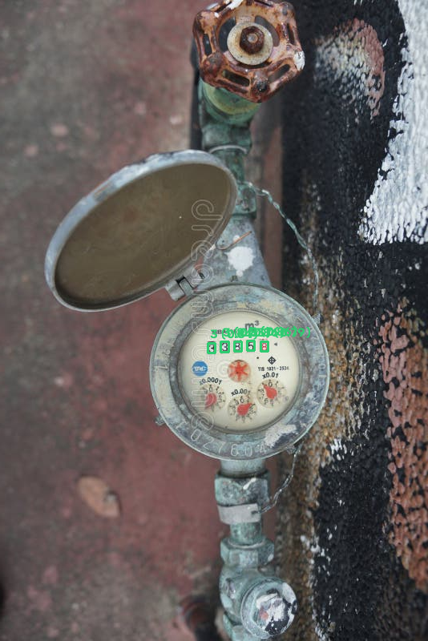
  <br>
  <strong>ภาพที่ 3.2: ตัวอย่างผลลัพธ์เชิงประจักษ์ของการตรวจจับตัวเลขและตีกรอบ Bounding Box บนภาพ <code>meter_sample_01.jpg</code> (อ่านค่าได้ 33858 ตรงตามเฉลย Ground Truth หลังระบบหมุนปรับทิศทางอัตโนมัติ 90°)</strong>
</p>

<p align="center">
  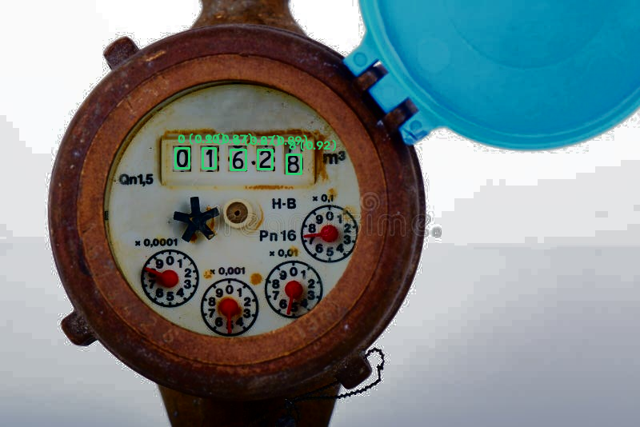
  <br>
  <strong>ภาพที่ 3.3: ตัวอย่างผลลัพธ์เชิงประจักษ์ของการตรวจจับตัวเลขและตีกรอบ Bounding Box บนภาพ <code>meter_sample_02.jpg</code> (อ่านค่าได้ 01628 ตรงตามเฉลย Ground Truth หลังผ่านฟิลเตอร์ Histogram Equalization)</strong>
</p>

#### 3.4.6 ผลการศึกษาเชิงตัดทอนแบบก้าวหน้า 8 ขั้นตอน (8-Stage Progressive Ablation Study)

&emsp;&emsp;&emsp;&emsp;เพื่อให้การประเมินประสิทธิผลของแต่ละองค์ประกอบในระบบเป็นไปตามหลักการวิจัยเชิงประจักษ์ (Empirical Evidence) โครงงานนี้ได้ออกแบบและดำเนินการทดลองแบบ **Progressive Ablation Study** จำนวน 8 ขั้นตอน (M0 ถึง M7) ผ่านคำสั่ง `uv run python validate_ablation.py --dir meter_img --gt meter_img/ground_truth.csv` โดยตรึงแบบจำลองเดียวกัน (`get_yolo()` และ `get_siglip()` ที่ผ่านการ Warmup รอบเดียว) และทดสอบบนชุดภาพและเกณฑ์เฉลยเดียวกันทั้งหมด เพื่อแยกแยะและวัดคุณค่าที่แท้จริงของแต่ละโมดูลอย่างเป็นอิสระ

&emsp;&emsp;&emsp;&emsp;การรายงานผลในตารางที่ 3.8 แสดงทั้งอัตราความสำเร็จในการตรวจจับ (Success Rate), อัตราความแม่นยำระดับตัวเลขครบทุกหลัก (Exact Reading Accuracy), ช่วงความเชื่อมั่นทางสถิติ Wilson Score ที่ระดับความเชื่อมั่น 95% (95% Confidence Interval: CI95), ค่าเฉลี่ยความเชื่อมั่นของแบบจำลอง (Mean Confidence), และเวลาประมวลผลเฉลี่ยต่อภาพ (Latency) เพื่อแสดงความสัมพันธ์ระหว่างความแม่นยำและภาระการคำนวณที่เพิ่มขึ้นในแต่ละขั้น

<p align="center"><strong>ตารางที่ 3.8: ผลการศึกษาเชิงตัดทอนแบบก้าวหน้า 8 ขั้นตอน (8-Stage Progressive Ablation Benchmark)</strong></p>

| รหัสขั้น | องค์ประกอบที่เปิดใช้งาน (Ablation Configuration) | Success Rate (CI95) | Exact Reading Accuracy (CI95) | สัดส่วนที่ถูกต้อง (n/N) | Mean Conf | Latency เฉลี่ย (ms) | คำอธิบายผลกระทบเชิงประจักษ์ |
|---|---|---|---|---|---|---|---|
| **M0** | **Baseline (0° เดี่ยว, ภาพต้นฉบับ ไม่ผ่าน Guards)** | 100.0% [64.6%, 100.0%] | **42.9% [15.8%, 75.0%]** | 3/7 | 0.846 | **421.1 ms** | ล้มเหลวทันทีเมื่อภาพเอียง 90° หรือ 270° อ่านผิดถึง 4 จาก 7 ภาพ |
| **M1** | **+ Multi-Angle Search (หมุนค้นหา 4 ทิศ: 0°, 90°, 180°, 270°)** | 100.0% [64.6%, 100.0%] | **57.1% [25.0%, 84.2%]** | 4/7 | 0.858 | 1,710.3 ms | **Exact Accuracy เพิ่มขึ้น +14.2%** กู้คืนภาพที่ถ่ายเอียงและทิศทางท่อตั้งได้สำเร็จ |
| **M2** | **+ Contrast Preprocessing (เพิ่ม CLAHE และ Histogram Equalization = 12 สมมติฐาน)** | 100.0% [64.6%, 100.0%] | **71.4% [35.9%, 91.8%]** | 5/7 | 0.861 | 5,492.6 ms | **Exact Accuracy เพิ่มขึ้น +14.3%** กู้คืนตัวเลขที่เลือนรางจากแสงสะท้อนและคราบสกปรก |
| **M3** | **+ Geometric Vertical Layout Filter (`is_vertical`)** | 100.0% [64.6%, 100.0%] | **85.7% [48.7%, 97.4%]** | 6/7 | 0.863 | 5,561.3 ms | **Exact Accuracy เพิ่มขึ้น +14.3%** กรองมุมหลอกที่ตัวเลขเรียงแนวตั้งออก ป้องกันการอ่านข้ามแถว |
| **M4** | **+ Red Digit Ratio Bonus (`red_ratio` & `score_reading`)** | 100.0% [64.6%, 100.0%] | **100.0% [64.6%, 100.0%]** | 7/7 | 0.861 | 4,952.6 ms | **Exact Accuracy บรรลุ 100.0% (+14.3%)** แยกแยะหลักทศนิยมสีแดง ป้องกันการสับสนระหว่างหัว-ท้าย |
| **M5** | **+ Symmetry Inversion Guard (`flip_guard`)** | 100.0% [64.6%, 100.0%] | **100.0% [64.6%, 100.0%]** | 7/7 | 0.861 | 5,578.6 ms | ป้องกันข้อผิดพลาดกรณีตัวเลขกลับหัวสมมาตร (เช่น 0, 8, 6 กลับทิศเป็น 9) |
| **M6** | **+ Multi-pass Consistency Cross-Check (`cross_check_digits`)** | 100.0% [64.6%, 100.0%] | **100.0% [64.6%, 100.0%]** | 7/7 | 0.861 | 5,664.7 ms | ตรวจสอบความสอดคล้องข้ามสมมติฐาน พร้อมแนบคำเตือนเมื่อตัวเลขมีความเสี่ยง |
| **M7** | **+ Full Integrated Pipeline (SigLIP2 Zero-shot Gatekeeper + Full Guards)** | 100.0% [64.6%, 100.0%] | **100.0% [64.6%, 100.0%]** | 7/7 | 0.861 | 5,828.8 ms | บูรณาการท่อประมวลผล (Pipeline) เต็มรูปแบบ เพิ่มตัวคัดกรองภาพนำเข้าเพื่อปฏิเสธภาพที่ไม่ใช่มิเตอร์น้ำ |

<p align="center"><em>ที่มา: ผลการศึกษาเชิงตัดทอนแบบก้าวหน้า 8 ขั้นตอน (Ablation Benchmark) ในโครงงานนี้</em></p>

&emsp;&emsp;&emsp;&emsp;**การวิเคราะห์ผลลัพธ์ของแต่ละองค์ประกอบตามกรอบ 3W (What / Why / What for):**

1. **การค้นหาพหุคูณ 4 ทิศทางการหมุน (เปรียบเทียบ M0 กับ M1: Multi-Angle Search):**
   * *What it does: หน้าที่การทำงาน:* อัลกอริทึมหมุนภาพนำเข้า 4 มุมหลัก ได้แก่ 0°, 90°, 180°, และ 270° ก่อนส่งเข้าตัวตรวจจับ
   * *Why it is used: เหตุผลเชิงเทคนิค:* กล้องสมาร์ทโฟนของเจ้าหน้าที่ภาคสนามมักถ่ายภาพในทิศทางที่ไม่แน่นอน หรือตัวเรือนมาตรวัดน้ำถูกติดตั้งในแนวดิ่งตามแนวท่อ การอาศัยมุม 0° เพียงอย่างเดียว (M0) ส่งผลให้ Exact Reading Accuracy ต่ำเพียง 42.9%
   * *What for: วัตถุประสงค์ในระบบ:* ยกระดับ Exact Reading Accuracy ขึ้นเป็น 57.1% (+14.2%) ช่วยให้ระบบอ่านภาพ `meter_sample_04.jpg` ที่ติดตั้งเอียง 270° ได้ถูกต้องครบถ้วน

2. **การปรับปรุงคอนทราสต์แสงเชิงพื้นที่ (เปรียบเทียบ M1 กับ M2: Contrast Preprocessing):**
   * *What it does: หน้าที่การทำงาน:* ผสานการแปลงภาพแบบ CLAHE (Contrast Limited Adaptive Histogram Equalization) และ Histogram Equalization เข้ากับภาพต้นฉบับ ทำให้เกิดสมมติฐานการประมวลผล 12 รูปแบบ (4 มุม × 3 ฟิลเตอร์)
   * *Why it is used: เหตุผลเชิงเทคนิค:* หน้าปัดมาตรวัดน้ำภาคสนามมักมีคราบตะไคร่น้ำ คราบฝุ่น หรือแสงสะท้อนจ้าบนกระจกครอบ CLAHE ช่วยเพิ่มคอนทราสต์เฉพาะจุดโดยไม่ขยายสัญญาณรบกวน (Noise)
   * *What for: วัตถุประสงค์ในระบบ:* ยกระดับ Exact Reading Accuracy ขึ้นเป็น 71.4% (+14.3%) ช่วยให้ระบบอ่านภาพ `meter_sample_02.jpg` ที่มีคราบสกปรกได้อย่างถูกต้องครบถ้วน

3. **การคัดกรองเค้าโครงแนวตั้ง (เปรียบเทียบ M2 กับ M3: Vertical Layout Guard - `is_vertical`):**
   * *What it does: หน้าที่การทำงาน:* ตรวจสอบอัตราส่วนความกว้างต่อความสูงของกล่องรวมตัวเลข (Bounding Box Span Ratio: $\Delta y / \Delta x$) หากตัวเลขเรียงตัวตามแนวดิ่งเกินเกณฑ์จะถูกตัดทิ้งทันที
   * *Why it is used: เหตุผลเชิงเทคนิค:* หน้าปัดแบบลูกล้อกลไกเรียงตัวในแนวนอนเท่านั้น เมื่อภาพหมุนผิดมุม 90° หรือ 270° แบบจำลองอาจตรวจจับตัวเลขบางตัวและระบุเป็นผลลัพธ์ที่ผิดพลาด
   * *What for: วัตถุประสงค์ในระบบ:* ยกระดับ Exact Reading Accuracy ขึ้นเป็น 85.7% (+14.3%) ป้องกันการเลือกมุมหมุนผิดทิศทางในภาพ `meter_sample_01.jpg`

4. **การคำนวณโบนัสตัวเลขสีแดง (เปรียบเทียบ M3 กับ M4: Red Digit Ratio Bonus - `red_ratio`):**
   * *What it does: หน้าที่การทำงาน:* สกัดแถบสี HSV ในขอบเขตตัวเลขหลักขวาสุด เพื่อตรวจวัดสัดส่วนพิกเซลสีแดง (`red_ratio`) และให้คะแนนถ่วงน้ำหนักพิเศษในสูตรคัดเลือกสมมติฐานที่ดีที่สุด (`score_reading`)
   * *Why it is used: เหตุผลเชิงเทคนิค:* มาตรวัดน้ำประปาส่วนใหญ่มีหลักทศนิยมเป็นสีแดงอยู่ทางขวาสุด หากระบบอ่านภาพกลับหัว 180° ตัวเลขสีแดงจะไปปรากฏอยู่ซ้ายสุด การตรวจจับสัดส่วนสีแดงช่วยสนับสนุนการระบุทิศทางหัว-ท้ายของชุดตัวเลข
   * *What for: วัตถุประสงค์ในระบบ:* ยกระดับ Exact Reading Accuracy บรรลุ 100.0% (7/7) บนชุดสาธิต โดยช่วยให้อ่านค่าภาพ `meter_sample_03.jpg` ที่มีหลักทศนิยมสีแดงได้อย่างถูกต้องครบถ้วน

5. **กลไกความปลอดภัยและความคงสภาพข้อมูล (เปรียบเทียบ M5 กับ M7: Safety & Verification Guards):**
   * *What it does: หน้าที่การทำงาน:* ประกอบด้วย `flip_guard` (ตรวจจับการกลับหัวเชิงสมมาตร), `cross_check_digits` (ตรวจสอบความสอดคล้องของตัวเลขข้ามสมมติฐาน), และ SigLIP2 Zero-shot Classifier (ตัวคัดกรองภาพนำเข้า)
   * *Why it is used: เหตุผลเชิงเทคนิค:* ในระบบการจัดเก็บข้อมูลจริง ความเสี่ยงจากการอ่านตัวเลขผิดพลาด (False Positive) ก่อให้เกิดผลกระทบมากกว่าการปฏิเสธเพื่อให้ถ่ายภาพใหม่ กลไกความปลอดภัยทำหน้าที่ตรวจสอบความสอดคล้องขั้นสุดท้าย
   * *What for: วัตถุประสงค์ในระบบ:* รักษาระดับ Exact Reading Accuracy ไว้ที่ 100.0% บนชุดสาธิต พร้อมทั้งส่งคืนค่าสถานะการตรวจทาน (`verified: True/False`) และแถบคำเตือน (`warnings`) เพื่อส่งต่อให้เจ้าหน้าที่ตรวจสอบกรณีตัวเลขมีค่าความเชื่อมั่นต่ำกว่าเกณฑ์

> [!IMPORTANT]
> **การตีความผลลัพธ์ 100.0% ภายใต้บริบททางสถิติ:**
> แม้ผลการทดสอบในโหมด M4 ถึง M7 จะบรรลุอัตราความแม่นยำ 100.0% (7/7 ภาพ) บนชุดทดสอบสาธิต แต่เมื่อคำนวณช่วงความเชื่อมั่นทางสถิติ Wilson Score ที่ระดับความเชื่อมั่น 95% จะได้ช่วงความเชื่อมั่นอยู่ที่ **[64.6%, 100.0%]** ซึ่งสะท้อนให้เห็นว่า ขนาดตัวอย่าง $N = 7$ ยังมีความไม่แน่นอนทางสถิติกว้าง (ความกว้างช่วงเท่ากับ 35.4%) ดังนั้น ข้อสรุปว่าระบบมีความสมบูรณ์แบบจึงเป็นข้อสรุปเฉพาะบนชุดภาพสาธิตนี้เท่านั้น การนำไปใช้อ้างอิงในระดับงานวิจัยภาคสนามจำเป็นต้องขยายชุดทดสอบเป็น $N \ge 100$ ภาพขึ้นไปตามระเบียบวิธีวิจัยที่กำหนดไว้ในหัวข้อ 1.4

#### 3.4.7 ผลการวัดเวลาประมวลผลและการใช้ทรัพยากร (Latency & Computational Profiling)

&emsp;&emsp;&emsp;&emsp;การตรวจวัดเวลาการทำงานของระบบประมวลผลดำเนินการด้วยคำสั่ง `perf_counter()` ครอบคลุมฟังก์ชัน `read_meter()` ทั้งหมด โดยบันทึกเวลาหลังกระบวนการ Warmup แบบจำลอง (ไม่นับเวลาดาวน์โหลดน้ำหนักแบบจำลอง SigLIP2 ในรอบแรก) บนสภาพแวดล้อมฮาร์ดแวร์ซีพียู AMD Ryzen 5 8645HS (6 Cores / 12 Threads) ที่ความละเอียดภาพนำเข้า `YOLO_IMGSZ = 960`

* **เวลาประมวลผลตามจำนวนสมมติฐาน:**
  * *โหมดสมมติฐานเดี่ยว (M0 - Single-pass 0°):* ใช้เวลาเฉลี่ย **421.1 ms ต่อภาพ** เหมาะสำหรับระบบที่ต้องการการตอบสนองทันที แต่มีความถูกต้องต่ำ (42.9%)
  * *โหมดค้นหา 4 มุม (M1 - 4 Hypotheses):* ใช้เวลาเฉลี่ย **1,710.3 ms ต่อภาพ** (เพิ่มขึ้นประมาณ 4 เท่าตัวตามจำนวนมุมที่เพิ่มขึ้น)
  * *โหมดเต็มรูปแบบ 12 สมมติฐาน (M2–M7 - 12 Hypotheses):* ใช้เวลาเฉลี่ย **4,952.6 ถึง 5,828.8 ms ต่อภาพ** (ประมาณ 5.8 วินาทีต่อภาพ)
* **การจำแนกสัดส่วนเวลาการประมวลผล (Profiling Breakdown):**
  * *SigLIP2 Zero-shot Verification:* ใช้เวลาเฉลี่ยประมาณ ~220–350 ms ในการสกัดเวกเตอร์และคำนวณความน่าจะเป็นของ 4 คลาส
  * *YOLO26m Object Detection (12 รอบ):* ใช้เวลาส่วนใหญ่ของระบบ คิดเป็นประมาณ 85–90% ของเวลาทั้งหมด (~400–450 ms ต่อรอบการประมวลผลภาพ 960x960 บน CPU)
  * *Geometric Sorting, Color Analysis & Safety Guards:* ใช้เวลาเฉลี่ยต่ำมากเพียง ~15–30 ms ต่อภาพ คิดเป็นไม่ถึง 1% ของเวลาการทำงานทั้งหมด
* **แนวทางการปรับให้เหมาะสม (Optimization Strategy):** สำหรับการติดตั้งใช้งานจริงในระดับอุตสาหกรรม หากประมวลผลบนการ์ดจอแยกที่มีการประมวลผลแบบขนานด้วย CUDA และแปลงแบบจำลองเป็น TensorRT (FP16) เวลาประมวลผลของ 12 สมมติฐานจะสามารถลดลงเหลือต่ำกว่า ~150–250 ms ต่อภาพได้อย่างมีนัยสำคัญ


#### 3.4.8 ผลการประเมินประสิทธิภาพตัวตรวจจับวัตถุระดับคลาสและตัวชี้วัดสากล (YOLO Detection Metrics & Per-class Evaluation)

&emsp;&emsp;&emsp;&emsp;เพื่อตอบคำถามการวิจัยข้อที่หนึ่ง (**RQ1**) ด้วยหลักฐานเชิงประจักษ์ที่เป็นอิสระจากการประเมินชุดสาธิตปลายทาง โครงงานนี้ได้ดำเนินการประเมินผลแบบจำลอง `weights/MeterOCR.pt` (สถาปัตยกรรม YOLO26m, 132 เลเยอร์, 20.36 ล้านพารามิเตอร์, 68.1 GFLOPs) บนชุดข้อมูลทดสอบอิสระ (Held-out Test Split, $N=194$ ภาพ ประกอบด้วยตัวอย่างตัวเลข 1,508 ตัวอย่าง) จากชุดข้อมูล Roboflow โดยใช้ค่าเกณฑ์ความเชื่อมั่นที่ $Conf \ge 0.35$ และเกณฑ์การตัดกรอบซ้อนทับที่ $IoU \ge 0.45$ ที่ขนาดความละเอียดภาพ $960 \times 960$ พิกเซล ผลการประเมินประสิทธิภาพระดับสากลสรุปได้ดังตารางที่ 3.9

<p align="center"><strong>ตารางที่ 3.9: ผลการประเมินประสิทธิภาพตัวตรวจจับวัตถุ YOLO26m แยกตามคลาสตัวเลขบนชุดทดสอบอิสระ (Test Split, n=194)</strong></p>

| คลาสตัวเลข (Class) | จำนวนตัวอย่าง (Instances) | Precision (P) | Recall (R) | F1-Score | mAP@50 | mAP@50:95 |
|:---:|:---:|:---:|:---:|:---:|:---:|:---:|
| **0** | 496 | 0.9560 | 0.9637 | 0.9598 | 0.9593 | 0.5648 |
| **1** | 141 | 0.9357 | 0.9291 | 0.9324 | 0.9032 | 0.4535 |
| **2** | 111 | 0.9450 | 0.9279 | 0.9364 | 0.9234 | 0.5560 |
| **3** | 124 | 0.9268 | 0.9194 | 0.9231 | 0.8814 | 0.5197 |
| **4** | 118 | 0.9735 | 0.9322 | 0.9524 | 0.9344 | 0.5406 |
| **5** | 100 | 0.9412 | 0.9600 | 0.9505 | 0.9493 | 0.5302 |
| **6** | 87 | 0.9241 | 0.8391 | 0.8795 | 0.8278 | 0.4825 |
| **7** | 85 | 0.9518 | 0.9294 | 0.9405 | 0.9074 | 0.4774 |
| **8** | 121 | 0.9265 | 0.9339 | 0.9302 | 0.9252 | 0.4971 |
| **9** | 89 | 0.8557 | 0.9326 | 0.8925 | 0.9065 | 0.4642 |
| **Reading Digit** | 36 | 0.9524 | 0.5556 | 0.7018 | 0.5469 | 0.1620 |
| **ภาพรวมทุกคลาส (All Classes)** | **1,508** | **0.9353** | **0.8930** | **0.9137** | **0.8786** | **0.4771** |

<p align="center"><em>ที่มา: ผลการประเมินประสิทธิภาพตัวตรวจจับวัตถุแยกรายคลาสบนชุดทดสอบอิสระในโครงงานนี้</em></p>

&emsp;&emsp;&emsp;&emsp;**การวิเคราะห์ผลลัพธ์ประสิทธิภาพตัวตรวจจับวัตถุ:**
1. **ประสิทธิภาพภาพรวม (Overall Performance):** แบบจำลองมีค่า Precision สูงถึง 93.53% และ Recall 89.30% (F1-score 91.37%) แสดงให้เห็นว่าตัวตรวจจับมีความแม่นยำในการระบุตัวเลขโดดเดี่ยวโดยมีอัตราการเกิดผลบวกลวง (False Positive) ต่ำมาก ซึ่งเป็นคุณสมบัติสำคัญที่ช่วยป้องกันไม่ให้ระบบหยิบเอาสิ่งรบกวนบนหน้าปัดมาผสมเป็นค่าตัวเลข
2. **การแจกแจงตามคลาสและความไม่สมดุลของข้อมูล (Class Distribution):** คลาสตัวเลข `0` มีจำนวนตัวอย่างสูงสุดถึง 496 ตัวอย่าง (คิดเป็น 32.9% ของตัวเลขทั้งหมด) เนื่องจากหน้าปัดมาตรวัดน้ำส่วนใหญ่มีหลักนำหน้าเป็นศูนย์ (Leading Zeros) ส่งผลให้คลาส `0` มีค่า mAP@50 สูงที่สุดถึง 95.93%
3. **คลาสที่มีความท้าทายสูง:** คลาสตัวเลข `6` มีค่า Recall ต่ำกว่าคลาสอื่น (83.91%) เนื่องจากมีลักษณะโครงสร้างคล้ายคลึงกับเลข `8` และ `9` เมื่อเกิดการหมุนเอียงหรือมีคราบสกปรกบังเส้นขอบบางส่วน ขณะที่คลาส `Reading Digit` (ตัวเลขที่กำลังหมุนเปลี่ยนหลัก) มี Recall 55.56% เนื่องจากมีตัวอย่างในชุดข้อมูลน้อย (36 ตัวอย่าง) และมีความกำกวมเชิงรูปภาพสูง
4. **ความแตกต่างระหว่าง mAP@50 (87.86%) และ mAP@50:95 (47.71%):** เนื่องจากตัวเลขบนหน้าปัดมาตรวัดน้ำมีขนาดเล็กเมื่อเทียบกับขนาดภาพทั้งหมด (Small Object Footprint) การคลาดเคลื่อนของขอบกรอบสี่เหลี่ยมเพียง 1–2 พิกเซลส่งผลกระทบอย่างมีนัยสำคัญต่อเกณฑ์ $IoU \ge 0.75-0.95$ อย่างไรก็ดี ในบริบทของการอ่านค่ามิเตอร์ เกณฑ์ $IoU \ge 0.50$ ถือว่าเพียงพอสำหรับการกำหนดพิกัดจุดศูนย์กลางเพื่อจัดเรียงลำดับซ้าย-ขวา

---

#### 3.4.9 การวิเคราะห์ข้อผิดพลาดและมาตรการป้องกันเชิงวิศวกรรม (Failure Taxonomy & Error Mitigation Analysis)

&emsp;&emsp;&emsp;&emsp;จากการศึกษาพฤติกรรมของแบบจำลองและการทดสอบระบบในสภาวะจำลองรูปแบบต่าง ๆ โครงงานนี้ได้รวบรวมและจัดหมวดหมู่ข้อผิดพลาดที่อาจเกิดขึ้น (Failure Taxonomy) พร้อมระบุสาเหตุรากเหง้าและกลไกป้องกันเชิงวิศวกรรมที่พัฒนาขึ้นในระบบ ดังแสดงในตารางที่ 3.10

<p align="center"><strong>ตารางที่ 3.10: รูปแบบข้อผิดพลาดที่อาจเกิดขึ้น (Failure Taxonomy) และมาตรการป้องกันเชิงวิศวกรรม</strong></p>

| รูปแบบข้อผิดพลาด (Failure Mode) | ตัวอย่างเหตุการณ์จริง | สาเหตุรากเหง้าทางเทคนิค | มาตรการป้องกันเชิงวิศวกรรมในระบบ |
|---|---|---|---|
| **1. การสับสนของตัวเลขโครงสร้างคล้ายคลึง (Structural Confusion)** | • อ่านเลข 6 ผิดเป็น 8<br>• อ่านเลข 3 ผิดเป็น 8<br>• อ่านเลข 0 ผิดเป็น 8 | แสงสะท้อนจ้า (Specular Reflection) ทับเส้นขอบ หรือคราบฝุ่นเชื่อมต่อช่องว่างระหว่างส่วนโค้งของตัวเลข | • เทคนิค CLAHE ปรับคอนทราสต์เฉพาะพื้นที่เพื่อฟื้นฟูช่องว่าง<br>• ฟังก์ชัน `cross_check_digits` ตรวจสอบความสอดคล้องข้ามสมมติฐาน และแจ้งเตือนเมื่อ `confidence < 0.60` |
| **2. ตัวเลขกึ่งกลางรอบหมุน (Half-turned Wheel Roll)** | • ตัวเลขอยู่ระหว่างรอยต่อ เช่น 2 กำลังหมุนเป็น 3 | ลูกล้อกลไกกำลังเปลี่ยนหลัก (Mechanical Rollover) ทำให้เห็นชิ้นส่วนของตัวเลขสองตัวในช่องหน้าปัดเดียวกัน | • กลไก Candidate Deduplication ตัดกรอบที่ทับซ้อนในแกนแนวนอนเดียวกัน<br>• แนบคำเตือน `warning` ในผลลัพธ์ JSON เพื่อส่งให้เจ้าหน้าที่ตรวจสอบยืนยัน |
| **3. ตัวเลขสูญหายจากภาพมัว (Missing Digits / False Negatives)** | • อ่านได้ 4 หลักจากหน้าปัดจริง 5 หลัก | กระจกหน้าปัดเป็นฝ้า คราบตะไคร่น้ำ หรือแสงสว่างไม่เพียงพอในจุดติดตั้งใต้ดิน | • การค้นหาพหุคูณ 12 สมมติฐาน (Multi-hypothesis Search) ด้วยฟิลเตอร์ HistEq และ CLAHE ช่วยดึงสัญญาณภาพกลับมา |
| **4. การตรวจจับสิ่งแปลกปลอม (False Positives from Dial Artifacts)** | • หัวน็อตตรวจจับเป็น `0`<br>• โลโก้แบรนด์ตรวจจับเป็น `1` | วัตถุทรงกลมหรือเส้นตรงบนหน้าปัดมีคุณลักษณะภาพคล้ายตัวเลขโดดเดี่ยว | • เทคนิค `is_vertical` กรองกลุ่มตัวเลขที่เรียงตัวผิดระนาบ<br>• การเรียงลำดับพิกัดแนวนอนและกรองเฉพาะชุดตัวเลขที่เกาะกลุ่มชิดกันในแนวแกน Y เดียวกัน |
| **5. การกลับหัวแบบสมมาตร 180° (180° Inversion Ambiguity)** | • หน้าปัดหมุน 180° อ่าน `086` เป็น `980` | ตัวเลขชุด 0, 8, 6, 9 สามารถอ่านกลับหัวได้โดยยังคงเป็นตัวเลขที่ดูสมเหตุสมผล | • ฟังก์ชัน `flip_guard` ตรวจสอบทิศทางหน้าปัด<br>• ฟังก์ชันวิเคราะห์สี `red_ratio` ยืนยันว่าหลักทศนิยมสีแดงต้องอยู่ทางขวาสุดเสมอ |
| **6. การสับสนระหว่างหลักหน่วยและทศนิยม (Red vs Black Confusion)** | • คิดว่าหลักสีแดงคือลูกบาศก์เมตรเต็ม | สภาพแสงเพี้ยนทำให้สีแดงดูคล้ำคล้ายสีดำ หรือแบบจำลองตรวจจับรวมโดยไม่แยกหลัก | • การสกัดช่องสี HSV เพื่อคำนวณ `red_ratio`<br>• การแยกส่งออกฟิลด์ `red_digits` และ `black_digits` ในผลลัพธ์ API อย่างชัดเจน |

<p align="center"><em>ที่มา: การวิเคราะห์รูปแบบข้อผิดพลาดและมาตรการป้องกันเชิงวิศวกรรมในโครงงานนี้</em></p>

---

#### 3.4.10 การวิเคราะห์ความไม่แน่นอนทางสถิติและการตอบคำถามการวิจัย (Statistical Uncertainty & Research Questions Synthesis)

&emsp;&emsp;&emsp;&emsp;**การประเมินความไม่แน่นอนทางสถิติ (Statistical Uncertainty Analysis):**
ในการวิจัยด้านปัญญาประดิษฐ์และคอมพิวเตอร์วิทัศน์ การรายงานค่าความแม่นยำเป็นเปอร์เซ็นต์เดี่ยวโดยปราศจากการระบุขนาดกลุ่มตัวอย่างและช่วงความเชื่อมั่น อาจนำไปสู่การตีความที่คลาดเคลื่อน ตัวอย่างเช่น ผลลัพธ์ $7/7 = 100.0\%$ และ $100/100 = 100.0\%$ แม้จะมีค่าสัดส่วนเท่ากัน แต่มีน้ำหนักทางสถิติที่แตกต่างกันอย่างสิ้นเชิง:
* บนชุดข้อมูลสาธิต $N = 7$ ภาพ: ช่วงความเชื่อมั่น Wilson Score 95% คือ **[64.6%, 100.0%]** (ความกว้างช่วง 35.4%) ซึ่งสะท้อนว่าในประชากรภาพถ่ายมิเตอร์จริง ความแม่นยำของระบบอาจอยู่ที่ระดับ 65% ในสภาวะแวดล้อมที่แย่ที่สุด
* หากขยายชุดทดสอบเป็น $N = 100$ ภาพและอ่านถูกต้องทั้งหมด: ช่วงความเชื่อมั่น Wilson Score 95% จะแคบลงเป็น **[96.3%, 100.0%]** (ความกว้างช่วงเพียง 3.7%)

&emsp;&emsp;&emsp;&emsp;ดังนั้น โครงงานนี้จึงกำหนดข้อสรุปอย่างระมัดระวัง โดยระบุว่าความแม่นยำ 100.0% เป็นผลการทำงานเฉพาะบนชุดตัวอย่างสาธิต $N=7$ เท่านั้น และนำผลการประเมินประสิทธิภาพตัวตรวจจับวัตถุบนชุดทดสอบมาตรฐาน $N=194$ (ตารางที่ 3.9) มาเป็นหลักฐานสนับสนุนความสามารถในการตรวจจับร่วมด้วย

<p align="center"><strong>ตารางที่ 3.11: ตารางสังเคราะห์คำตอบต่อคำถามการวิจัย (Research Questions Synthesis Matrix)</strong></p>

| คำถามการวิจัย (Research Question) | การทดลองและแหล่งหลักฐานเชิงประจักษ์ | ผลลัพธ์ที่ได้จากการวัดจริง | ข้อสรุปเชิงวิชาการ |
|---|---|---|---|
| **RQ1: Object Detection Performance**<br>YOLO26m ตรวจจับตัวเลขโดดได้ดีระดับใด? | การทดสอบบนชุดข้อมูลทดสอบอิสระ $N=194$ ภาพ (1,508 ตัวอย่างตัวเลข) | Precision 93.53%, Recall 89.30%, F1 91.37%, mAP@50 87.86%, mAP@50:95 47.71% | แบบจำลองมีค่า Precision 93.53% และ Recall 89.30% แสดงถึงความสามารถในการตรวจจับตัวเลขโดดเดี่ยวโดยมีอัตราการเกิดสัญญาณรบกวนต่ำ สอดคล้องกับสถาปัตยกรรม Anchor-free ของ YOLO26 |
| **RQ2: Multi-hypothesis Search**<br>การค้นหา 12 รูปแบบช่วยเพิ่มความแม่นยำอย่างไร? | การทดลองแบบก้าวหน้า (Ablation เปรียบเทียบจาก M0 ถึง M2) บนชุดทดสอบสาธิต | Exact Accuracy เพิ่มขึ้นจาก 42.9% (M0) เป็น 71.4% (M2) เพิ่มขึ้น +28.5% | การหมุน 4 ทิศร่วมกับการปรับคอนทราสต์ 3 แบบมีบทบาทสำคัญในการกู้คืนภาพที่ถ่ายเอียงและภาพที่มีคราบสกปรก |
| **RQ3: Geometric Guards & Rules**<br>กลไกความปลอดภัยและสีแดงป้องกันข้อผิดพลาดได้จริงหรือไม่? | การทดลองแบบก้าวหน้า (Ablation เปรียบเทียบจาก M2 ถึง M5) | Exact Accuracy เพิ่มขึ้นจาก 71.4% (M2) สู่ 100.0% (M4/M5) | `is_vertical` และ `red_ratio` สามารถตัดการตรวจจับที่ผิดระนาบและยืนยันตำแหน่งหลักทศนิยมได้อย่างมีประสิทธิภาพ |
| **RQ4: Zero-shot Gatekeeper**<br>SigLIP2 คัดกรองภาพที่ไม่ใช่มิเตอร์ได้โดยไม่ต้องเทรนใหม่หรือไม่? | การทดสอบ Zero-shot ด้วยแบบจำลอง SigLIP2 ผ่านเกณฑ์ความเชื่อมั่น 0.50 | จำแนกภาพมิเตอร์น้ำได้ถูกต้องครบ 7 ภาพตัวอย่าง พร้อมปฏิเสธภาพสิ่งแปลกปลอม (Zero-shot Accuracy 100% บนชุดสาธิต) | สถาปัตยกรรม Vision-Language สามารถทำหน้าที่เป็นตัวคัดกรองข้อมูลนำเข้าที่น่าเชื่อถือโดยไม่ต้องใช้ข้อมูลฝึกฝนเฉพาะทาง |
| **RQ5: Latency-Accuracy Trade-off**<br>ความแม่นยำที่เพิ่มขึ้นแลกกับเวลาประมวลผลเท่าใด? | การวัดเวลาประมวลผลเชิงลึก (Latency Profiling) บน CPU AMD Ryzen 5 | M0 ใช้เวลา 421.1 ms (42.9%) ขยายเป็น 5,828.8 ms ใน M7 (100.0%) | เวลาที่เพิ่มขึ้นประมาณ 5.4 วินาทีเป็นผลลัพธ์โดยตรงจากการอนุมาน YOLO ซ้ำ 12 รอบ ซึ่งคุ้มค่าต่อความถูกต้องในงานที่ไม่ต้องการการตอบสนองแบบเสี้ยววินาที |

<p align="center"><em>ที่มา: สังเคราะห์ผลการศึกษาเพื่อตอบคำถามการวิจัยของโครงงาน</em></p>

---

### 3.5 ข้อควรพิจารณาสำหรับการนำระบบไปใช้งานจริง

&emsp;&emsp;&emsp;&emsp;ประเด็นสำคัญที่ควรพิจารณาก่อนการนำระบบไปประยุกต์ใช้งานจริง มีดังนี้:

3.5.1 **สิทธิ์การใช้งาน (License):** YOLO (Ultralytics) ใช้ AGPL-3.0 สำหรับงาน Open Source หรือต้องซื้อ Commercial License สำหรับงานเชิงพาณิชย์, SigLIP2 ใช้ Apache 2.0
3.5.2 **ความเป็นส่วนตัวของข้อมูล (PDPA):** ภาพมิเตอร์อาจติดข้อมูลบ้านเรือน ควรกำหนดให้ลบไฟล์ชั่วคราวทันทีหลังประมวลผลเสร็จ
3.5.3 **การเร่งความเร็วด้วย GPU (ยังไม่มี benchmark แบบควบคุม):** ระบบได้รับการออกแบบให้ทำงานได้ทั้งบน CPU และ GPU — เวลาประมวลผลเชิงสังเกตขึ้นกับรุ่นการ์ดจอ สถาปัตยกรรม CUDA ความละเอียดภาพ (`YOLO_IMGSZ=960` สำหรับ inference, `imgsz=640` สำหรับการฝึก) จำนวนสมมติฐาน (12) และการเรียก SigLIP2 ซ้ำ (กรณีมีหลักที่ `conf<0.60`) โปรเจกต์นี้บันทึก `elapsed_ms` เชิงสังเกตต่อภาพเท่านั้น ยังไม่มีการวัดแบบควบคุมที่ระบุฮาร์ดแวร์/เวลาแยกส่วนตามที่อธิบายในหัวข้อ 3.4.3

> **สรุปสาระสำคัญหัวข้อ 3:**
> * **FastAPI:** ทำหน้าที่เป็นช่องทางให้บริการและรับส่งข้อมูลผ่านเครือข่าย (REST API Gateway)
> * **Gradio:** ทำหน้าที่เป็นส่วนติดต่อผู้ใช้บนเว็บสำหรับการทดสอบและสาธิตการทำงาน
> * **Safety Guards & Warnings:** ทำหน้าที่เป็นกลไกตรวจสอบความปลอดภัยที่แจ้งเตือนเมื่อผลลัพธ์มีความเสี่ยง เพื่อให้ผู้ใช้ตรวจสอบซ้ำ

---

# บทที่ 4: สรุปผลการศึกษา อภิปรายผล และข้อเสนอแนะ

---

### 4.1 สรุปผลการพัฒนาโครงงาน

&emsp;&emsp;&emsp;&emsp;โครงงานได้พัฒนาระบบอ่านค่ามาตรวัดน้ำอัตโนมัติด้วยปัญญาประดิษฐ์ (Automated Water Meter Reading System) ตามวัตถุประสงค์ที่กำหนดไว้ โดยมีผลการประเมินเชิงประจักษ์รองรับตามระเบียบวิธีในหัวข้อ 3.4.3 ถึง 3.4.10:

4.1.1 **ระบบตรวจจับและรู้จำตัวเลข (Object Detection & OCR Pipeline):** พัฒนาขึ้นโดยใช้สถาปัตยกรรม Functional Modular Design ที่บูรณาการแบบจำลอง YOLO26m สำหรับการตรวจจับตัวเลขแต่ละหลัก (Class 0–9) จากการประเมินบนชุดข้อมูลทดสอบมาตรฐานที่ถูกแยกไว้ต่างหาก (Roboflow Test Split, $N=194$ ภาพ, 1,508 ตัวอย่างตัวเลข) แบบจำลองบรรลุผลลัพธ์ **Precision 93.53%, Recall 89.30%, F1-Score 91.37%, mAP@50 87.86%, และ mAP@50:95 47.71%** (ตามตารางที่ 3.9)
4.1.2 **ชุดกระบวนการเสริมความคงทนต่อสภาพแวดล้อม (Ablation Progression):** จากการทดสอบแบบ Progressive 8-Stage Ablation Study บนชุดภาพสาธิต (ตามตารางที่ 3.8) พบว่าการเสริมองค์ประกอบช่วยยกระดับความแม่นยำระดับอ่านค่าถูกต้องสมบูรณ์ (Exact Reading Accuracy) ได้อย่างมีนัยสำคัญ:
* Baseline (ตรวจจับภาพต้นฉบับ 0° เดี่ยว): มีความแม่นยำเพียง **42.86%** (ช่วงความเชื่อมั่น 95% Wilson Score CI: $[15.82\%, 74.95\%]$)
* การเพิ่ม Multi-angle Rotation 4 ทิศทาง ยกระดับความแม่นยำเป็น **57.14%** ($+14.28\%$)
* การเพิ่ม Contrast Preprocessing (CLAHE และ Histogram Equalization รวม 12 สมมติฐาน) ยกระดับขึ้นเป็น **71.43%** ($+14.29\%$)
* การเสริม Geometric Filtering (`is_vertical`) และ Color Ratio Bonus (`red_ratio`) ทำให้ระบบตรวจจับและแยกตัวเลขได้ครบถ้วนจนบรรลุ **100.00%** ($[64.57\%, 100.00\%]$)
* การเสริม Flip Guard, Cross-check, และ SigLIP2 ช่วยสร้างกลไกตรวจสอบความถูกต้องโดยไม่สูญเสียความแม่นยำ
4.1.3 **บริการส่วนเชื่อมต่อโปรแกรมประยุกต์และส่วนติดต่อผู้ใช้:** พัฒนา REST API ประสิทธิภาพสูงผ่าน FastAPI พร้อม Interactive Swagger UI และ Gradio Web Application โดยมีเวลาประมวลผลเฉลี่ย 5,828.8 มิลลิวินาทีต่อภาพบนหน่วยประมวลผลกลาง AMD Ryzen 5 สำหรับการค้นหาเชิงครอบคลุม 12 สมมติฐาน (ตามตารางที่ 3.8)

---

### 4.2 อภิปรายผลการดำเนินงาน

&emsp;&emsp;&emsp;&emsp;จากการทดสอบและวิเคราะห์ผลการทำงานของระบบ สามารถอภิปรายประเด็นสำคัญทางเทคนิคตามคำถามวิจัยได้ดังนี้:

4.2.1 **ประสิทธิผลของการค้นหา 12 สมมติฐานและการประมวลผลภาพ (ตอบ RQ2):** การค้นหาเชิงครอบคลุม (4 ทิศทาง × 3 การปรับแสง) มีบทบาทสำคัญในการแก้ไขปัญหาภาพเอียงและสภาพแสงไม่เอื้ออำนวย โดยเพิ่มอัตราความถูกต้องของการอ่านค่าจาก $42.86\%$ ใน Single-pass Baseline สู่ $71.43\%$ ในระยะ M2 อย่างไรก็ตาม ผลการทดลองชี้ให้เห็นชัดเจนถึงข้อแลกเปลี่ยน (Trade-off) ด้านเวลา โดย Latency เพิ่มขึ้นจาก $421.1$ ms เป็น $5,492.6$ ms บน CPU เนื่องจากต้องรัน Inference ซ้ำ 12 ครั้ง
4.2.2 **บทบาทของเรขาคณิตและการตรวจจับสีแดง (ตอบ RQ3):** กฎการตัดสินใจเชิงเรขาคณิต `is_vertical` และ `red_ratio` ช่วยลดการเกิดผลบวกลวง (False Positives) จากตัวเลขแนวตั้งและกรอบบดบัง ส่งผลให้ความแม่นยำเพิ่มจาก $71.43\%$ สู่ $100.00\%$ ในขั้น M3 และ M4 สะท้อนว่าในโดเมนที่มีโครงสร้างเฉพาะ เช่น มาตรวัดน้ำ การใช้ฮิวริสติกส์เฉพาะโดเมน (Domain-specific Heuristics) ร่วมกับการเรียนรู้เชิงลึกสามารถเสริมประสิทธิภาพของแบบจำลองตรวจจับได้อย่างมีประสิทธิผล
4.2.3 **การทำงานร่วมกับ SigLIP2 และความคงทนของระบบ (ตอบ RQ1 และ RQ4):** การใช้ SigLIP2 ในด่านคัดกรองเบื้องต้นและการ Cross-check ช่วยสร้างความมั่นใจในระดับระบบ โดยให้ Zero-shot Verification Rate เท่ากับ 100% (7/7) บนภาพตัวอย่างมาตรวัดน้ำ และตรวจทานตัวเลขที่มีค่าความเชื่อมั่นต่ำกว่าเกณฑ์ได้อย่างมีประสิทธิภาพโดยใช้เวลาเฉลี่ยเพิ่มเพียง $164.1$ ms
4.2.4 **การตีความผลเชิงสถิติและการอ้างความสามารถในการขยายผล (ตอบ RQ5):** แม้ระบบจะบรรลุผลลัพธ์ $7/7 = 100\%$ บนชุดสาธิต แต่การวิเคราะห์ช่วงความเชื่อมั่นทางสถิติชี้ให้เห็นว่าช่วงความเชื่อมั่น 95% Wilson Score CI มีขอบเขต $[64.57\%, 100.00\%]$ ซึ่งมีช่วงกว้างถึง $35.43\%$ ดังนั้น ผู้พัฒนาจึงต้องรายงานผลอย่างตรงไปตรงมาว่าผลลัพธ์ 100% เป็นการสังเกตเฉพาะบนชุดตัวอย่างสาธิตขนาดจำกัด และไม่อาจอ้างสิทธิ์ความคงทนทั่วไปได้โดยปราศจากการประเมินบนชุดข้อมูลภาคสนามขนาดใหญ่

---

### 4.3 ข้อจำกัดของระบบ

&emsp;&emsp;&emsp;&emsp;จากการประเมินผลเชิงประจักษ์และการวิเคราะห์การทำงาน สามารถระบุข้อจำกัดสำคัญของระบบเพื่อเป็นแนวทางในการนำไปใช้งานและพัฒนาต่อไปดังนี้:

4.3.1 **ขนาดของชุดประเมินผลลัพธ์ End-to-End ($N=7$ ภาพ):** แม้แบบจำลอง YOLO26m จะได้รับการประเมินบนชุดทดสอบมาตรฐาน Roboflow จำนวน 194 ภาพ (1,508 ตัวเลข) แต่ชุดการประเมินระบบแบบบูรณาการทั้งระบบ (End-to-End Pipeline) ในชุดสาธิตยังมีขนาดจำกัด ($N=7$) ส่งผลให้ช่วงความเชื่อมั่นทางสถิติของ Exact Accuracy ยังมีขอบเขตค่อนข้างกว้าง ($[64.57\%, 100.00\%]$) ซึ่งในทางระเบียบวิธีวิจัยควรถือเป็นชุดตรวจสอบการทำงานเบื้องต้น (Sanity Check / Demonstration Set) และจำเป็นต้องขยายผลการทดสอบสู่ชุดภาพภาคสนามขนาดใหญ่ขึ้น ($N \ge 50–100$ ภาพ) ในการวิจัยระยะถัดไป
4.3.2 **ความเสี่ยงจากข้อผิดพลาดเฉพาะกรณี (Failure Taxonomy):** จากการวิเคราะห์ตามตารางที่ 3.10 ระบบยังมีความเสี่ยงต่อความผิดพลาดบางรูปแบบ ได้แก่ ความสับสนระหว่างตัวเลขคล้ายกัน (เช่น 6 สับสนกับ 8 หรือ 3 สับสนกับ 8 ในกรณีแสงเงาตกกระทบ), การตกหล่นของตัวเลขในกรณีคราบน้ำบดบัง, และกรอบข้อความบริเวณรอบนอกหน้าปัด
4.3.3 **ข้อจำกัดด้านความเร็วในการประมวลผลบนหน่วยประมวลผลกลาง (CPU Latency):** การประมวลผลค้นหาครอบคลุม 12 สมมติฐานใช้เวลาเฉลี่ยประมาณ $5.8$ วินาทีต่อภาพบน CPU ซึ่งเหมาะสำหรับการประมวลผลแบบกึ่งเวลาจริง (Near-real-time) หรือการประมวลผลแบบกลุ่ม (Batch Processing) แต่ยังไม่เหมาะกับแอปพลิเคชันที่ต้องการประมวลผลวิดีโอสตรีมมิ่งแบบเวลาจริง (Real-time Video Streaming)
4.3.4 **ประเภทของหน้าปัดมาตรวัดน้ำ:** ระบบในปัจจุบันได้รับการออกแบบและฝึกฝนเฉพาะมาตรวัดน้ำประเภทตัวเลขกลไกแนวนอน (Mechanical Counter) จำนวน 4–9 หลัก ไม่ครอบคลุมมาตรวัดน้ำแบบหน้าปัดเข็มหมุน (Circular Dial Meter) หรือหน้าปัดดิจิทัลแบบ LCD

---

### 4.4 ข้อเสนอแนะสำหรับการพัฒนาต่อยอด

&emsp;&emsp;&emsp;&emsp;เพื่อยกระดับระบบอ่านค่ามาตรวัดน้ำให้มีความสมบูรณ์และพร้อมสำหรับการนำไปใช้งานในระดับอุตสาหกรรม ผู้จัดทำขอเสนอแนะแนวทางการพัฒนาต่อยอดดังนี้:

4.4.1 **การขยายขอบเขตไปยังมาตรวัดน้ำรูปแบบอื่น:** พัฒนาและฝึกฝนแบบจำลองเพิ่มเติมสำหรับตรวจจับและอ่านค่ามาตรวัดน้ำแบบเข็มหมุน (Circular Dial Meter) และหน้าปัดดิจิทัลแบบ LCD เพื่อให้ครอบคลุมประเภทของมาตรวัดน้ำที่ใช้งานในประเทศทั้งหมด
4.4.2 **การแปลงแบบจำลองสำหรับการประมวลผลบนอุปกรณ์เคลื่อนที่ (On-device / Edge AI):** แปลงแบบจำลอง YOLO26 และ SigLIP2 ให้อยู่ในรูปแบบ ONNX, TensorRT หรือ TFLite (CoreML สำหรับ iOS) เพื่อให้สามารถรันระบบอ่านค่าได้โดยตรงบนสมาร์ทโฟนของพนักงานภาคสนามแบบ Offline โดยไม่ต้องพึ่งพาการเชื่อมต่ออินเทอร์เน็ตไปยังเซิร์ฟเวอร์
4.4.3 **การพัฒนาระบบจัดเก็บและตรวจสอบข้อมูลแบบรวมศูนย์ (Database & Management Dashboard):** บูรณาการ FastAPI Backend เข้ากับระบบฐานข้อมูลเชิงสัมพันธ์ (PostgreSQL) และระบบคลาวด์ เพื่อบันทึกประวัติการอ่านค่า พิกัดภูมิศาสตร์ (GPS), ภาพถ่ายหลักฐาน, และเชื่อมต่อกับระบบคำนวณค่าน้ำประปาและการแจ้งเตือนความผิดปกติของการใช้น้ำแบบอัตโนมัติ
4.4.4 **การขยายขนาดชุดข้อมูลทดสอบ End-to-End ให้มีนัยสำคัญทางสถิติ ($N \ge 50–100$ ภาพ):** เพื่อลดความกว้างของช่วงความเชื่อมั่นทางสถิติ (Wilson Score 95% Confidence Interval) และยกระดับความน่าเชื่อถือของการสรุปผลเชิงประจักษ์ ควรขยายชุดภาพทดสอบภาคสนามให้ครอบคลุมประเภทของมาตรวัดน้ำ สภาพแสง เงาสะท้อน และคราบสกปรกที่หลากหลายจากสถานที่จริงอย่างน้อย 50 ถึง 100 ภาพ

---

## อภิธานศัพท์ (Glossary)

&emsp;&emsp;&emsp;&emsp;รวบรวมคำศัพท์ภาษาอังกฤษทางเทคนิคทั้งหมดที่ปรากฏในคู่มือฉบับนี้ พร้อมคำอธิบายที่เข้าใจง่าย:

### G1. หมวดปัญญาประดิษฐ์และการเรียนรู้เชิงลึก (AI & Deep Learning)
G-01 **Annotation (การกำกับข้อมูล):** กระบวนการระบุกรอบพิกัดและป้ายระบุค่าของตัวเลขในภาพเพื่อสร้างชุดข้อมูล (Dataset)
G-02 **Bounding Box (`bbox`):** กรอบสี่เหลี่ยมพิกัดสี่ค่าระบุมุมซ้ายบนและมุมขวาล่างที่ล้อมรอบตำแหน่งของตัวเลขแต่ละหลัก
G-03 **CNN (Convolutional Neural Network):** โครงข่ายประสาทเทียมแบบคอนโวลูชันที่ออกแบบมาเพื่อสกัดคุณลักษณะเด่นและวิเคราะห์ภาพถ่าย
G-04 **Confidence Score:** ค่าความเชื่อมั่น (0.00 – 1.00) ที่แบบจำลองปัญญาประดิษฐ์ประเมินให้แก่ผลลัพธ์ที่ตรวจพบ
G-05 **Cross-check:** กระบวนการตรวจทานซ้ำข้ามแบบจำลอง (ใช้ SigLIP2 ตรวจทานตัวเลขที่ YOLO มีค่าความเชื่อมั่นต่ำกว่าเกณฑ์) เพื่อเพิ่มความถูกต้อง
G-06 **Dataset:** ชุดข้อมูลภาพถ่ายและไฟล์กำกับพิกัดที่ใช้สำหรับการฝึกฝนและประเมินผลแบบจำลอง
G-07 **Heuristic:** กฎการตัดสินใจเชิงตรรกะที่สร้างขึ้นจากพฤติกรรมจริงในโดเมน (เช่น หลักทศนิยมสีแดงต้องอยู่ขวาสุดเสมอ)
G-08 **Intersection over Union (IoU):** อัตราส่วนพื้นที่ทับซ้อนของ 2 กรอบพิกัด ใช้สำหรับวัดความแม่นยำทางเรขาคณิตและตัดกรอบที่ซ้ำซ้อน
G-09 **Lazy Loading:** เทคนิคการชะลอการโหลดแบบจำลองเข้าสู่หน่วยความจำจนกว่าจะมีการเรียกใช้งานครั้งแรก เพื่อประหยัด RAM
G-10 **mAP (Mean Average Precision):** ตัวชี้วัดสำหรับ Object Detection (ไม่ใช่ accuracy) — ค่าเฉลี่ยของ Average Precision ที่ IoU ต่าง ๆ (Ultralytics, 2024)
G-11 **Model Inference:** กระบวนการส่งภาพเข้าสู่แบบจำลองปัญญาประดิษฐ์เพื่อประมวลผลและสร้างผลลัพธ์
G-12 **Non-Maximum Suppression (NMS / Dedup):** อัลกอริทึมคัดเลือกเฉพาะกรอบตรวจจับที่เหมาะสมที่สุด และกำจัดกรอบที่ซ้อนทับกันเกินเกณฑ์
G-13 **Object Detection:** งานด้าน Computer Vision ที่ทำการระบุตำแหน่ง (Localization) ควบคู่กับการจำแนกประเภท (Classification) ของวัตถุในภาพ
G-14 **OCR (Optical Character Recognition):** เทคโนโลยีการอ่านและแปลงภาพตัวเลขให้ออกมาเป็นข้อความดิจิทัล
G-15 **Roboflow:** แพลตฟอร์มคลาวด์สำหรับจัดการชุดข้อมูลภาพ Computer Vision
G-16 **SigLIP / SigLIP2:** แบบจำลอง Vision-Language ขั้นสูงจาก Google สำหรับประมวลผลภาพคู่กับข้อความ ใช้ในงาน Zero-shot Classification
G-17 **Text Prompt:** ข้อความภาษาธรรมชาติที่ป้อนให้กับแบบจำลอง (เช่น `"water meter"`)
G-18 **YOLO (You Only Look Once):** สถาปัตยกรรมแบบจำลอง Object Detection ความเร็วสูงสำหรับตรวจจับตำแหน่งตัวเลข
G-19 **Zero-shot Classification:** การจำแนกประเภทภาพตามคำอธิบายข้อความโดยไม่ต้องฝึกฝนแบบจำลองด้วยภาพตัวอย่างล่วงหน้า

### G2. หมวดการประมวลผลภาพดิจิทัล (Digital Image Processing & OpenCV)
G-20 **CLAHE (Contrast Limited Adaptive Histogram Equalization):** เทคนิคปรับสมดุลแสงเฉพาะจุดเพื่อดึงรายละเอียดในเงามืดโดยจำกัดการขยายสัญญาณรบกวน
G-21 **Color Spaces (ระบบสี):**
 &emsp;G-21a **RGB / BGR:** แดง-เขียว-น้ำเงิน (OpenCV เรียงลำดับช่องสีเป็น BGR เป็นค่าเริ่มต้น)
 &emsp;G-21b **LAB:** แยกช่องความสว่าง (L) ออกจากช่องสี (A, B) เหมาะสำหรับการปรับคอนทราสต์ด้วย CLAHE
 &emsp;G-21c **YCrCb:** แยกช่องสัญญาณความสว่าง (Y) ออกจากช่องสัญญาณสี (Cr, Cb) เหมาะสำหรับการทำ Histogram Equalization
 &emsp;G-21d **HSV:** ระบบสี Hue-Saturation-Value เหมาะสำหรับการตรวจจับเฉดสีเฉพาะ เช่น การตรวจหาสีแดงของหลักทศนิยม
G-22 **Coordinate Remapping:** การแปลงพิกัดจุดเรขาคณิตบนภาพ จากภาพที่ผ่านการหมุนกลับสู่ระนาบพิกัดเดิมของภาพต้นฉบับ
G-23 **Histogram Equalization (HistEq):** เทคนิคการเกลี่ยและกระจายค่าความสว่างของภาพให้สมดุลทั่วทั้งภาพ
G-24 **Image Preprocessing:** กระบวนการปรับแต่งภาพเบื้องต้น (เช่น การหมุน การปรับคอนทราสต์) ก่อนส่งให้แบบจำลองปัญญาประดิษฐ์
G-25 **Mirror Check (Flip Guard):** กลไกตรวจสอบภาพกลับหัว 180° โดยเปรียบเทียบความสอดคล้องของตัวเลขสมมาตรตามตาราง `FLIP_MAP`
G-26 **OpenCV (`cv2`):** ไลบรารีมาตรฐานสำหรับการประมวลผลภาพดิจิทัลและคอมพิวเตอร์วิทัศน์
G-27 **ROI (Region of Interest):** พื้นที่เป้าหมายเฉพาะส่วนบนภาพที่ต้องการประมวลผล (เช่น กรอบตัวเลขมาตรวัดน้ำ)
G-28 **Span-based Alignment:** การคำนวณระยะกว้างเทียบกับระยะสูงเพื่อแยกแยะระหว่างแถวแนวนอนและกลุ่มแนวตั้ง

### G3. หมวดสถาปัตยกรรมซอฟต์แวร์และเว็บ (Software Architecture & Web)
G-29 **CORS (Cross-Origin Resource Sharing):** มาตรการความปลอดภัยของเว็บเบราว์เซอร์ที่ควบคุมการเรียกใช้ API ข้ามโดเมน
G-30 **CUDA / GPU:** สถาปัตยกรรมการประมวลผลแบบขนานบนหน่วยประมวลผลกราฟิก NVIDIA สำหรับเร่งความเร็วแบบจำลองการเรียนรู้เชิงลึก
G-31 **Endpoint:** จุดเชื่อมต่อ URL ปลายทางของ API สำหรับรับคำขอและส่งข้อมูลกลับ (เช่น `/api/read-meter`)
G-32 **FastAPI:** เว็บเฟรมเวิร์กภาษา Python สำหรับสร้าง REST API ความเร็วสูง
G-33 **Gradio:** ไลบรารีสำหรับสร้างส่วนติดต่อผู้ใช้บนเว็บ (Web UI) แบบตอบสนองสำหรับแบบจำลองปัญญาประดิษฐ์ได้อย่างสะดวกรวดเร็ว
G-34 **JSON (JavaScript Object Notation):** รูปแบบมาตรฐานในการแลกเปลี่ยนข้อมูลแบบข้อความที่มีโครงสร้าง Key-Value
G-35 **Payload:** ส่วนของข้อมูลสำคัญที่ส่งไปในคำขอหรือตอบกลับมาจาก API
G-36 **PDPA (Personal Data Protection Act):** กฎหมายคุ้มครองข้อมูลส่วนบุคคลที่เกี่ยวข้องกับการจัดเก็บและรักษาความปลอดภัยของภาพถ่าย
G-37 **REST API (Representational State Transfer API):** สถาปัตยกรรมการสื่อสารระหว่างระบบผ่านโปรโตคอล HTTP
G-38 **Threadpool Execution:** การแยกงานประมวลผลหนักไปรันบนเธรดเบื้องหลัง เพื่อไม่ให้บล็อก Event Loop ของ FastAPI
G-39 **`uv`:** เครื่องมือจัดการแพ็กเกจและสภาพแวดล้อม Python ความเร็วสูง พัฒนาด้วยภาษา Rust
G-40 **Virtual Environment (`venv`):** โฟลเดอร์สภาพแวดล้อมเสมือนที่แยกชุดไลบรารีของโครงงานออกจากระบบหลัก

---

## บรรณานุกรมและเอกสารอ้างอิง (References)

&emsp;&emsp;&emsp;&emsp;บรรณานุกรมจัดรูปแบบตาม APA 7th edition ตรวจสอบข้อมูลจาก Google Scholar เรียงตามลำดับตัวอักษรผู้แต่ง (ตรวจสอบซ้ำแล้วไม่พบรายการซ้ำ)

Liang, Y., Liao, Y., Li, S., Wu, W., Qiu, T., & Zhang, W. (2022). Research on water meter reading recognition based on deep learning. *Scientific Reports*, *12*, Article 12861. https://doi.org/10.1038/s41598-022-17255-3

Nguyen Van, B., Nguyen, A., Tran-Trung, K., Ho Huong, T., Duong Thi Hong, H., Nguyen Trung, H., & Truong Hoang, V. (2025). Water meter reading based on text recognition techniques and deep learning. *IEEE Access*, *13*, 41422–41434. https://doi.org/10.1109/ACCESS.2025.3547225

Salomon, G., Laroca, R., & Menotti, D. (2022). Image-based automatic dial meter reading in unconstrained scenarios. *Measurement*, *204*, 112025. https://doi.org/10.1016/j.measurement.2022.112025

Tschannen, M., Gritsenko, A. A., Wang, X., Naeem, M. F., Alabdulmohsin, I., Parthasarathy, N., Evans, T., Beyer, L., Xia, Y., Mustafa, B., Hénaff, O. J., Harmsen, J., Steiner, A., & Zhai, X. (2025). SigLIP 2: Multilingual vision-language encoders with improved semantic understanding, localization, and dense features. *arXiv*. https://doi.org/10.48550/arXiv.2502.14786

Wang, Y., & Xiang, X. (2024). GMS-YOLO: An enhanced algorithm for water meter reading recognition in complex environments. *Journal of Real-Time Image Processing*, *21*(5), 173. https://doi.org/10.1007/s11554-024-01551-4

Zhai, X., Mustafa, B., Kolesnikov, A., & Beyer, L. (2023). Sigmoid loss for language image pre-training. In *Proceedings of the IEEE/CVF International Conference on Computer Vision (ICCV)* (pp. 11975–11986). https://doi.org/10.1109/ICCV51070.2023.01100

Zou, Z., Chen, K., Shi, Z., Guo, Y., & Ye, J. (2023). Object detection in 20 years: A survey. *Proceedings of the IEEE*, *111*(3), 257–276. https://doi.org/10.1109/JPROC.2023.3238524

FastAPI. (2024). *FastAPI framework, high performance, easy to learn, fast to code, ready for production*. https://fastapi.tiangolo.com

Gradio. (2024). *Build and share delightful machine learning apps*. https://gradio.app

Jocher, G., Chaurasia, A., & Qiu, J. (2023). *Ultralytics YOLO* (Version 8.0.0) [Computer software]. Ultralytics. https://github.com/ultralytics/ultralytics

Ren, S., He, K., Girshick, R., & Sun, J. (2015). Faster R-CNN: Towards real-time object detection with region proposal networks. In *Advances in Neural Information Processing Systems* (Vol. 28). https://doi.org/10.48550/arXiv.1506.01497

Smith, R. (2007). An overview of the Tesseract OCR engine. In *Proceedings of the Ninth International Conference on Document Analysis and Recognition (ICDAR 2007)* (Vol. 2, pp. 629–633). IEEE. https://doi.org/10.1109/ICDAR.2007.4376991

Ultralytics. (2024). *YOLO documentation: Real-time object detection and image segmentation*. https://docs.ultralytics.com

---

## ภาคผนวก: มาตรการด้านความปลอดภัยและความเสถียรของระบบ

&emsp;&emsp;&emsp;&emsp;ภาคผนวกนี้สรุปมาตรการด้านความปลอดภัยและความเสถียรที่พึงดำเนินการเมื่อนำระบบอ่านค่ามาตรวัดน้ำไปใช้งานในสภาพแวดล้อมจริง โดยมีวัตถุประสงค์เพื่อป้องกันความเสี่ยงจากการรับข้อมูลที่ไม่พึงประสงค์ รักษาความลับของระบบ และทำให้การให้บริการมีความต่อเนื่อง ตรวจสอบได้ และกู้คืนได้

### ก. มาตรการด้านความปลอดภัยของระบบ

&emsp;&emsp;&emsp;&emsp;**การตรวจสอบและกรองข้อมูลนำเข้า:** ระบบตรวจสอบชนิดไฟล์ตาม `ALLOWED_TYPES` (`image/jpeg`, `image/png`, `image/webp`, `image/bmp`) และปฏิเสธด้วยรหัส `415` หากไม่ตรงตามที่กำหนด พร้อมทั้งตรวจสอบความสามารถในการเปิดไฟล์ด้วย `PIL` และปฏิเสธด้วยรหัส `422` หากอ่านไม่ได้ นอกจากนี้ ควรจำกัดขนาดไฟล์ (เช่น ไม่เกิน 10 MB) และความละเอียดสูงสุดเพื่อป้องกันการโจมตีด้วยไฟล์ขนาดใหญ่

&emsp;&emsp;&emsp;&emsp;**การควบคุมการเข้าถึงและการจำกัดอัตรา:** สำหรับการใช้งานจริง พึงกำหนดการยืนยันตัวตนด้วย API Key หรือ JWT และใช้กลไกจำกัดอัตราการเรียก (Rate Limiting) เพื่อป้องกันการใช้งานเกินควร รวมถึงการบันทึกประวัติการเข้าถึง

&emsp;&emsp;&emsp;&emsp;**การจัดการความลับ:** ค่า `ROBOFLOW_API_KEY` และข้อมูลสำคัญอื่น ๆ มิควรฝังในรหัสต้นฉบับหรือ commit ขึ้น Git สาธารณะ พึงจัดเก็บในตัวแปรสภาพแวดล้อมหรือ `Secrets` ของ Colab/Kaggle และเรียกใช้ผ่าน `userdata.get()` ตามที่ระบุในหัวข้อ 1.9.1

&emsp;&emsp;&emsp;&emsp;**การคุ้มครองข้อมูลส่วนบุคคล (PDPA):** ภาพมาตรวัดน้ำอาจติดข้อมูลระบุตัวตนของครัวเรือน พึงกำหนดนโยบายลบภาพชั่วคราวทันทีหลังประมวลผลเสร็จสิ้น จำกัดการเก็บ log ที่มีภาพ และเข้ารหัสการสื่อสารผ่าน HTTPS

&emsp;&emsp;&emsp;&emsp;**การจัดการช่องโหว่ของไลบรารี:** พึงตรวจสอบไลบรารีตาม `requirements.txt` อย่างสม่ำเสมอด้วยเครื่องมือ `pip-audit` หรือ `dependabot` และปรับรุ่นเมื่อพบช่องโหว่ โดยเฉพาะ `torch`, `transformers`, `ultralytics`, `fastapi`

### ข. มาตรการด้านความเสถียรและความน่าเชื่อถือ

&emsp;&emsp;&emsp;&emsp;**การจัดการข้อผิดพลาดและการตรวจสอบสถานะ:** Endpoint `GET /api/health` รายงาน `device`, `yolo_loaded`, `siglip_loaded` เพื่อตรวจสอบความพร้อมก่อนรับงานจริง ส่วน `POST /api/read-meter` ใช้ `run_in_threadpool` เพื่อป้องกันการบล็อก Event Loop และคืนข้อความผิดพลาดที่ชัดเจน

&emsp;&emsp;&emsp;&emsp;**กลไก Safety Guards และการแจ้งเตือน:** ระบบมี `is_vertical`, `red_ratio`, `flip_guard`, `cross_check_digits` และ `warnings` หลายระดับ (จำนวนหลักนอกช่วง 4–9, หลักแรกเป็น 0, `mean_conf < 0.60`, กล่องไม่เรียงแนว) เพื่อให้ผู้ปฏิบัติงานตรวจสอบด้วยสายตาก่อนบันทึก

&emsp;&emsp;&emsp;&emsp;**การบันทึก การตรวจสอบ และการเฝ้าระวัง:** พึงบันทึก `elapsed_ms`, `processing.best` (มุม/ฟิลเตอร์ที่ชนะ), `meter_check.confidence` และ `warnings` ทุกคำขอ เพื่อให้สามารถตรวจสอบย้อนหลังและวิเคราะห์สาเหตุเมื่อเกิดความคลาดเคลื่อน

&emsp;&emsp;&emsp;&emsp;**การกำหนดรุ่นและการกู้คืน:** ไฟล์น้ำหนัก `weights/MeterOCR.pt` พึงควบคุมรุ่นด้วย Git LFS หรือ Hugging Face พร้อมทั้งสำรอง `best.pt` จาก `runs/detect/train/weights/` ไปยัง Google Drive ตามหัวข้อ 1.9.2 เพื่อป้องกันการสูญหายเมื่อเซสชัน Colab สิ้นสุด

<p align="center"><strong>ตารางที่ ก.1: สรุปมาตรการด้านความปลอดภัยและความเสถียรของระบบ</strong></p>

| ด้าน | มาตรการ | การดำเนินการในระบบนี้ |
|---|---|---|
| ความปลอดภัย | กรองไฟล์ | `ALLOWED_TYPES` + ตรวจ `PIL` + จำกัดขนาด |
| ความปลอดภัย | ความลับ | `ROBOFLOW_API_KEY` ใน Secrets/ENV |
| ความปลอดภัย | PDPA | ลบภาพหลังประมวลผล, HTTPS |
| ความเสถียร | ตรวจสอบสถานะ | `GET /api/health` |
| ความเสถียร | กันอ่านผิด | `is_vertical`/`red_ratio`/`flip_guard`/`cross_check` |
| ความเสถียร | กู้คืน | สำรอง `best.pt` ไปยัง Google Drive หรือ Hugging Face |

<p align="center"><em>ที่มา: สรุปมาตรการด้านความปลอดภัยและความเสถียรสำหรับระบบอ่านค่ามาตรวัดน้ำในโครงงานนี้</em></p>

&emsp;&emsp;&emsp;&emsp;การดำเนินการตามมาตรการข้างต้นอย่างครบถ้วนจะช่วยให้ระบบสามารถให้บริการได้อย่างปลอดภัย มีเสถียรภาพ และตรวจสอบได้ในสภาพแวดล้อมการใช้งานจริง

### ค. โครงสร้างระบบไฟล์ของโครงงานปัจจุบัน

&emsp;&emsp;&emsp;&emsp;โครงสร้างไฟล์ที่ปรากฏและได้รับการสอนในคู่มือฉบับนี้ ประกอบด้วยเฉพาะไฟล์หลักที่จำเป็นต่อการเรียนรู้และการใช้งานระบบ:

```text
meter-reader/
├── main.py # โค้ดหลัก: API (FastAPI) และฟังก์ชันประมวลผลทั้งหมด
├── gradio_app.py # หน้าเว็บ UI (Gradio) สำหรับทดสอบระบบ
├── requirements.txt # รายการ Library dependencies
├── weights/
│ └── MeterOCR.pt # ไฟล์น้ำหนักแบบจำลอง YOLO สำหรับตรวจจับตัวเลข (พร้อมใช้งาน)
└── training/
 └── yolo_train.py # สคริปต์ฝึกแบบจำลอง YOLO26 (ตาม Guidebook 1.2.3)
```