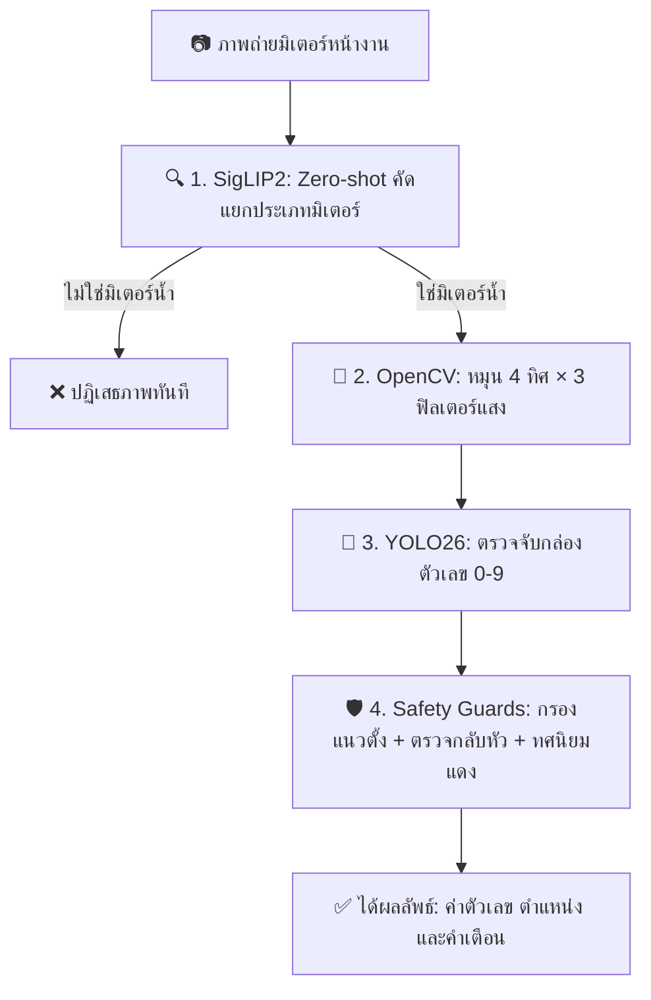

# คู่มือการพัฒนาระบบอ่านค่ามาตรวัดน้ำอัตโนมัติด้วยปัญญาประดิษฐ์
## Automated Water Meter Reading System using Deep Learning & Computer Vision

&emsp;&emsp;คู่มือฉบับนี้จัดทำขึ้นสำหรับนักพัฒนาซอฟต์แวร์ วิศวกร AI นักศึกษา และผู้สนใจด้านคอมพิวเตอร์วิทัศน์ เพื่อใช้เป็นแนวทางมาตรฐานในการศึกษาและพัฒนาระบบอ่านค่ามาตรวัดน้ำอัตโนมัติ (Water Meter OCR) ด้วยสถาปัตยกรรม **Python 3.11, YOLO26, SigLIP2, OpenCV, FastAPI และ Gradio** จัดการสภาพแวดล้อมด้วย **uv** และเขียนด้วยแนวคิด **Pure Functional Pipeline** ที่กระชับและดูแลรักษาง่าย

---

## สารบัญเนื้อหา (Table of Contents)

- [ข้อแนะนำเบื้องต้นสำหรับการศึกษา](#ข้อแนะนำเบื้องต้นสำหรับการศึกษา)
- [บทที่ 1: พื้นฐาน การออกแบบ และการประมวลผลภาพ (Fundamentals, Design, and Image Processing)](#บทที่-1-พื้นฐาน-การออกแบบ-และการประมวลผลภาพ-fundamentals-design-and-image-processing)
  - [1.1 ทฤษฎีและหลักการพื้นฐาน (Theory & Fundamentals)](#11-ทฤษฎีและหลักการพื้นฐาน-theory--fundamentals)
  - [1.2 การฝึกแบบจำลองสำหรับการอ่านตัวเลข (Model Training)](#12-การฝึกแบบจำลองสำหรับการอ่านตัวเลข-model-training)
  - [1.3 สภาพแวดล้อมและการจัดการโปรเจกต์ด้วย uv (Environment & Project Setup)](#13-สภาพแวดล้อมและการจัดการโปรเจกต์ด้วย-uv-environment--project-setup)
  - [1.4 การคัดกรองภาพแบบซีโร่ช็อตด้วย SigLIP2 (Zero-shot Classification)](#14-การคัดกรองภาพแบบซีโร่ช็อตด้วย-siglip2-zero-shot-classification)
  - [1.5 การตรวจจับและอ่านค่าตัวเลข (Computer Vision & Digit Detection Engine)](#15-การตรวจจับและอ่านค่าตัวเลข-computer-vision--digit-detection-engine)
- [บทที่ 2: การพัฒนาแอปพลิเคชันและส่วนติดต่อผู้ใช้ (Application & UI Development)](#บทที่-2-การพัฒนาแอปพลิเคชันและส่วนติดต่อผู้ใช้-application--ui-development)
  - [2.1 การบูรณาการระบบประมวลผลหลักและระบบความปลอดภัย (Core Pipeline & Safety Guards)](#21-การบูรณาการระบบประมวลผลหลักและระบบความปลอดภัย-core-pipeline--safety-guards)
  - [2.2 การพัฒนาส่วนเชื่อมต่อโปรแกรมประยุกต์ด้วย FastAPI (REST API Development)](#22-การพัฒนาส่วนเชื่อมต่อโปรแกรมประยุกต์ด้วย-fastapi-rest-api-development)
  - [2.3 การพัฒนาส่วนติดต่อผู้ใช้ด้วย Gradio (Frontend Development)](#23-การพัฒนาส่วนติดต่อผู้ใช้ด้วย-gradio-frontend-development)
  - [2.4 การรัน ทดสอบ และคู่มือแก้ปัญหา (Testing & Troubleshooting)](#24-การรัน-ทดสอบ-และคู่มือแก้ปัญหา-testing--troubleshooting)
  - [2.5 ข้อควรพิจารณาก่อนการใช้งานจริง (Production Readiness)](#25-ข้อควรพิจารณาก่อนการใช้งานจริง-production-readiness)
- [อภิธานศัพท์ (Glossary)](#อภิธานศัพท์-glossary)
- [บรรณานุกรมและเอกสารอ้างอิง (References)](#บรรณานุกรมและเอกสารอ้างอิง-references)

---

## ข้อแนะนำเบื้องต้นสำหรับการศึกษา

สำหรับผู้ที่เพิ่งเริ่มศึกษาการพัฒนาระบบด้วยไพทอน (Python) และ Computer Vision ขอแนะนำให้ทำความเข้าใจหลักการสำคัญดังนี้:

1. **ทำไมต้องใช้ Python Virtual Environment (`venv`)?:** การสร้างสภาพแวดล้อมเสมือนเปรียบเหมือน "กล่องเครื่องมือเฉพาะงาน" ช่วยแยก Library ของโปรเจกต์นี้ออกจากโปรเจกต์อื่น ป้องกันปัญหาความขัดแย้งของเวอร์ชัน (Dependency Conflicts)
2. **ทำไมต้องใช้ `uv`?:** `uv` เป็นเครื่องมือจัดการ Python ยุคใหม่ที่เขียนด้วยภาษา Rust มีความเร็วในการสร้าง Environment และติดตั้งแพ็กเกจเร็วกว่า `pip` ปกติถึง 10–100 เท่า
3. **การรันคำสั่งที่โฟลเดอร์หลัก (Root Directory):** ในการรันคำสั่งผ่าน Terminal หรือ PowerShell โปรดตรวจสอบว่าอยู่ที่โฟลเดอร์หลักของโปรเจกต์ (`meter-reader/`) เสมอ
4. **การประมวลผลบนสภาพแวดล้อมจริง (Native Execution):** ระบบทำงานบนเครื่องโฮสต์โดยตรง ทำให้เข้าถึง GPU (CUDA) ได้เต็มประสิทธิภาพโดยไม่มี Overhead ของ Container
5. **แนวคิด Pure Functional Pipeline:** โค้ดถูกออกแบบให้เขียนบนลงล่างอย่างเป็นเส้นตรง ฟังก์ชันรับข้อมูลภาพ (Input) -> ประมวลผล -> คืนค่าผลลัพธ์ (Output) โดยไม่มีความซับซ้อนของ Class และ OOP

---

# บทที่ 1: พื้นฐาน การออกแบบ และการประมวลผลภาพ (Fundamentals, Design, and Image Processing)

---

### 1.1 ทฤษฎีและหลักการพื้นฐาน (Theory & Fundamentals)

การทำงานของระบบอ่านเลขมิเตอร์น้ำประกอบด้วย 3 กลไกหลัก:



#### 1.1.1 คอมพิวเตอร์วิทัศน์และการตรวจจับวัตถุ (Computer Vision & Object Detection)
ระบบใช้โมเดล **YOLO (You Only Look Once)** สถาปัตยกรรมล่าสุด (YOLO26 / YOLOv8 architecture) ในการตรวจจับและระบุตำแหน่งตัวเลข (Bounding Box Detection) ซึ่งมีจุดเด่นเรื่องความเร็วในการประมวลผลระดับ Real-time โมเดลจะคืนค่าพิกัด `[x1, y1, x2, y2]` ล้อมรอบตัวเลขแต่ละหลัก พร้อมระบุ Class ค่าตัวเลข $0-9$ และค่าความมั่นใจ (Confidence Score)

#### 1.1.2 การจำแนกภาพแบบซีโร่ช็อต (Zero-shot Image Classification)
แทนที่จะต้องฝึกฝน (Train) โมเดลใหม่ทั้งหมดเพื่อคัดแยกภาพที่ไม่ใช่มิเตอร์น้ำ ระบบเลือกใช้ **SigLIP2** ซึ่งเป็น Vision-Language Model ขนาดใหญ่ที่ผ่านการเทรนด้วยภาพและข้อความนับพันล้านคู่ ทำให้เราสามารถป้อน Text Prompt เช่น `"water meter"`, `"electricity meter"`, `"not a meter"` เพื่อตรวจสอบความถูกต้องของภาพได้ทันทีโดยไม่ต้องเทรนเพิ่ม

#### 1.1.3 การประมวลผลภาพดิจิทัล (Digital Image Processing)
ในสภาพแวดล้อมจริง ภาพถ่ายมิเตอร์มักมีเงา แสงสะท้อนจากกระจก หรือตัวเลขเลือนราง ระบบจึงต้องปรับปรุงคุณภาพภาพ (Image Enhancement) ก่อนส่งเข้าโมเดลเสมอ:
* **CLAHE (Contrast Limited Adaptive Histogram Equalization):** ปรับสมดุลแสงเฉพาะจุดบนช่องความสว่าง (Luminance) ช่วยดึงรายละเอียดตัวเลขในเงามืดโดยไม่ทำให้ส่วนสว่างจ้าเกินไป
* **Histogram Equalization (HistEq):** เกลี่ยความสว่างทั่วทั้งภาพบนช่อง Y (YCrCb) ช่วยให้ภาพที่มีแสงน้อยเห็นตัวเลขคมชัดขึ้น

---

### 1.2 การฝึกแบบจำลองสำหรับการอ่านตัวเลข (Model Training)

> [!NOTE]
> **มีโมเดลสำเร็จรูปพร้อมใช้งานทันที:**  
> หากต้องการใช้งานระบบทันที สามารถใช้โมเดล `weights/MeterOCR.pt` ที่ฝึกเสร็จแล้วได้ทันทีโดยไม่ต้องฝึกใหม่ หากต้องการศึกษาขั้นตอนการเทรนด้วยตนเอง สามารถทำตามขั้นตอนด้านล่างนี้ผ่าน Google Colab หรือ Kaggle

#### 1.2.1 การเตรียมชุดข้อมูลจาก Roboflow
ระบบใช้ชุดข้อมูล "Utility Meter Reading" ซึ่งมีการตีกรอบ Bounding Box ระบุ Class ตัวเลข $0-9$ ในรูปแบบ YOLO Format:

```python
# 📍 train_model_colab.ipynb — ดาวน์โหลดชุดข้อมูลจาก Roboflow
from roboflow import Roboflow

rf = Roboflow(api_key="YOUR_API_KEY")
project = rf.workspace("watermeter-jvlgr").project("utility-meter-reading-dataset-for-automatic-reading-yolo")
version = project.version(1)
dataset = version.download("yolov8")
```

#### 1.2.2 การฝึกโมเดล YOLO
```python
# 📍 train_model_colab.ipynb — ฝึกฝนโมเดล YOLO สำหรับอ่านตัวเลข
from ultralytics import YOLO

# โหลด Base Model
model = YOLO("yolo11n.pt")

# เริ่มต้นการฝึกฝน
results = model.train(
    data=f"{dataset.location}/data.yaml",
    epochs=100,
    imgsz=960,
    batch=16,
    device=0,
    name="meter_ocr_model",
)

# ประเมินผลลัพธ์บน Validation Set
metrics = model.val()
print(f"mAP@50: {metrics.box.map50:.4f}, mAP@50-95: {metrics.box.map:.4f}")
```

---

### 1.3 สภาพแวดล้อมและการจัดการโปรเจกต์ด้วย `uv` (Environment & Project Setup)

> [!IMPORTANT]
> ระบบนี้พัฒนาบน **Python 3.11** และใช้เครื่องมือ **`uv`** เพื่อประสิทธิภาพและความเสถียรสูงสุด

#### 1.3.1 โครงสร้างไฟล์ของระบบ (Project Structure)
```
meter-reader/
├── main.py            # API หลัก (FastAPI) และ Pipeline ประมวลผลภาพ (Pure Functions)
├── gradio_app.py      # หน้าเว็บ UI (Gradio) สำหรับทดสอบระบบ
├── TUTORIAL.md        # คู่มือพัฒนาฉบับสมบูรณ์
├── requirements.txt   # รายการ Library dependencies
├── meter_img/         # ชุดภาพตัวอย่างมิเตอร์น้ำสำหรับทดสอบ (7 ภาพทดสอบ)
└── weights/           # ไฟล์น้ำหนักโมเดล (MeterOCR.pt)
```

#### 1.3.2 การสร้างสภาพแวดล้อมและติดตั้ง Dependencies
เปิด Terminal ในโฟลเดอร์ `meter-reader/` แล้วรันคำสั่ง:

```powershell
# 1. สร้าง Virtual Environment ด้วย Python 3.11
uv venv --python 3.11

# 2. เปิดใช้งาน Virtual Environment
# Windows PowerShell:
.venv\Scripts\Activate.ps1
# macOS / Linux:
# source .venv/bin/activate

# 3. ติดตั้ง Library ทั้งหมดผ่าน uv
uv pip install -r requirements.txt
```

รายการไลบรารีใน `requirements.txt`:
```text
fastapi>=0.115.0
uvicorn[standard]>=0.34.0
python-multipart>=0.0.20
ultralytics>=8.3.0
transformers>=4.48.0
torch>=2.4.0
torchvision>=0.19.0
opencv-python-headless>=4.10.0
numpy>=1.26.0
pillow>=10.4.0
gradio>=5.0.0
httpx>=0.28.0
```

---

### 1.4 การคัดกรองภาพแบบซีโร่ช็อตด้วย SigLIP2 (Zero-shot Classification)

ในการทำงานจริง มีโอกาสที่ผู้ใช้งานจะส่งภาพวัตถุอื่นที่ไม่ใช่มิเตอร์น้ำ (เช่น มิเตอร์ไฟฟ้า เกจวัดแรงดัน หรือภาพถ่ายทั่วไป) เข้ามา ระบบจึงใช้ **SigLIP2** คัดกรองภาพก่อนเป็นด่านแรก:

```python
# 📍 main.py — SigLIP2 Zero-shot Verification
SIGLIP_MODEL = "google/siglip2-base-patch16-224"
METER_LABELS = ("water meter", "electricity meter", "gas meter", "not a meter")
METER_VERIFY_CONF = 0.50

_siglip = None

def get_siglip() -> tuple[Any, Any]:
    """โหลดโมเดล SigLIP2 (Processor + Model) เข้า GPU/CPU แบบ Lazy Loading"""
    global _siglip
    if _siglip is None:
        from transformers import AutoModel, AutoProcessor
        processor = AutoProcessor.from_pretrained(SIGLIP_MODEL)
        model = AutoModel.from_pretrained(SIGLIP_MODEL).to(DEVICE).eval()
        _siglip = (processor, model)
    return _siglip

@torch.inference_mode()
def check_water_meter(rgb_img: np.ndarray) -> dict[str, Any]:
    """SigLIP2 ตรวจสอบว่าเป็นภาพมิเตอร์น้ำจริงหรือไม่"""
    processor, model = get_siglip()

    inputs = processor(
        text=list(METER_LABELS),
        images=Image.fromarray(rgb_img),
        padding="max_length",
        return_tensors="pt",
    ).to(DEVICE)

    outputs = model(**inputs)
    probs = torch.softmax(outputs.logits_per_image, dim=1)[0].cpu().numpy()
    pred_idx = int(np.argmax(probs))
    pred_label = METER_LABELS[pred_idx]

    return {
        "verified": pred_label == "water meter" and float(probs[0]) >= METER_VERIFY_CONF,
        "predicted_class": pred_label,
        "confidence": float(probs[0]),
    }
```

---

### 1.5 การตรวจจับและอ่านค่าตัวเลข (Computer Vision & Digit Detection Engine)

กระบวนการอ่านตัวเลขมิเตอร์น้ำประกอบด้วย 4 ส่วนสำคัญ:

#### 1. การหมุนภาพและปรับคอนทราสต์ (Image Enhancement)
```python
def rotate_image(img_bgr: np.ndarray, angle: int) -> np.ndarray:
    """หมุนภาพ 90°, 180°, 270° ตามเข็มนาฬิกา"""
    if angle == 90:
        return cv2.rotate(img_bgr, cv2.ROTATE_90_CLOCKWISE)
    if angle == 180:
        return cv2.rotate(img_bgr, cv2.ROTATE_180)
    if angle == 270:
        return cv2.rotate(img_bgr, cv2.ROTATE_90_COUNTERCLOCKWISE)
    return img_bgr

def apply_prep(img_bgr: np.ndarray, prep: str) -> np.ndarray:
    """ปรับแสง: CLAHE (บนช่อง L) หรือ HistEq (บนช่อง Y)"""
    if prep == "clahe":
        lab = cv2.cvtColor(img_bgr, cv2.COLOR_BGR2LAB)
        l, a, b = cv2.split(lab)
        l_clahe = cv2.createCLAHE(CLAHE_CLIP, CLAHE_GRID).apply(l)
        return cv2.cvtColor(cv2.merge([l_clahe, a, b]), cv2.COLOR_LAB2BGR)

    if prep == "histeq":
        ycrcb = cv2.cvtColor(img_bgr, cv2.COLOR_BGR2YCrCb)
        y, cr, cb = cv2.split(ycrcb)
        y_eq = cv2.equalizeHist(y)
        return cv2.cvtColor(cv2.merge([y_eq, cr, cb]), cv2.COLOR_YCrCb2BGR)

    return img_bgr
```

#### 2. การแปลงพิกัดจุดเดี่ยว (`remap_point`) และกล่อง (`remap_bbox`)
เมื่อตรวจจับบนภาพที่หมุน พิกัดจะอยู่ในแกนของภาพหมุน เราต้องแปลงพิกัดกลับสู่ระนาบภาพต้นฉบับ:

```python
def remap_point(x: float, y: float, angle: int, w: int, h: int) -> tuple[float, float]:
    """แปลงจุด 1 จุดจากภาพหมุน กลับสู่พิกัดภาพเดิมแบบเห็นภาพชัดเจน"""
    if angle == 90:
        return y, h - x      # หมุนขวา 90° -> แกนสลับ x=y, y=h-x
    if angle == 180:
        return w - x, h - y  # กลับหัว 180° -> x=w-x, y=h-y
    if angle == 270:
        return w - y, x      # หมุนซ้าย 90° -> แกนสลับ x=w-y, y=x
    return x, y

def remap_bbox(bbox: list[float], angle: int, w: int, h: int) -> list[float]:
    """แปลงจุดมุม 2 จุด แล้วหา min/max เพื่อสร้าง Bounding Box ในพิกัดภาพเดิม"""
    x1, y1, x2, y2 = bbox
    p1_x, p1_y = remap_point(x1, y1, angle, w, h)
    p2_x, p2_y = remap_point(x2, y2, angle, w, h)
    return [
        min(p1_x, p2_x),
        min(p1_y, p2_y),
        max(p1_x, p2_x),
        max(p1_y, p2_y),
    ]
```

#### 3. การกรองคอลัมน์แนวตั้ง (`is_vertical`) ด้วยระยะกว้าง vs ระยะสูง
หน้าปัดมิเตอร์น้ำจริงมักมีตัวเลขวันที่หรือซีเรียลนัมเบอร์ปั๊มเป็นแนวตั้ง ตัวเลขหน้าปัดหลักของมิเตอร์น้ำจะต้องเรียงตัวเป็น **แนวนอน** เสมอ ($\text{width\_span} > \text{height\_span}$):

```python
def is_vertical(dets: list[dict[str, Any]], img_w: int, img_h: int) -> dict[str, Any]:
    """ตรวจว่าแถวตัวเลขเรียงเป็นแนวตั้งหรือไม่ (แนวนอน width_span ต้องมากกว่า height_span)"""
    if len(dets) < 2:
        return {"vertical": False}

    xs = [d["center_x"] / img_w for d in dets]
    ys = [d["center_y"] / img_h for d in dets]

    width_span = max(xs) - min(xs)   # ความกว้างของแนวตัวเลข (ซ้ายสุดไปขวาสุด)
    height_span = max(ys) - min(ys)  # ความสูงของแนวตัวเลข (บนสุดไปล่างสุด)

    # ถ้าความสูงมากกว่าความกว้าง แสดงว่าเป็นคอลัมน์แนวดิ่ง (ไม่ใช่แถวหน้าปัดมิเตอร์)
    is_vert = (height_span >= width_span * 0.8) or (width_span <= 0.05 and height_span >= 0.08)
    return {"vertical": is_vert}
```

#### 4. การค้นหา 4 ทิศ × 3 ฟิลเตอร์ และกฎสีแดงของหลักทศนิยม (`detect_digits_best`)
```python
def red_ratio(img_bgr: np.ndarray, bbox: list[float]) -> float:
    """คำนวณสัดส่วนสีแดงในกล่องตัวเลข (หลักทศนิยมสีแดงต้องอยู่ขวาสุดของหน้าปัด)"""
    x1, y1, x2, y2 = [int(v) for v in bbox]
    pad_x = max(1, int((x2 - x1) * 0.15))
    pad_y = max(1, int((y2 - y1) * 0.15))

    crop = img_bgr[
        max(0, y1 + pad_y): min(img_bgr.shape[0], y2 - pad_y),
        max(0, x1 + pad_x): min(img_bgr.shape[1], x2 - pad_x),
    ]
    if crop.size == 0:
        return 0.0

    hsv = cv2.cvtColor(crop, cv2.COLOR_BGR2HSV)
    mask1 = cv2.inRange(hsv, (0, 40, 40), (12, 255, 255))
    mask2 = cv2.inRange(hsv, (165, 40, 40), (180, 255, 255))
    return float(np.mean((mask1 | mask2) > 0))

def eval_orientation(bgr_img: np.ndarray, angle: int, prep: str) -> dict[str, Any]:
    """ประเมินผลลัพธ์ของ 1 มุม × 1 ฟิลเตอร์"""
    rot = rotate_image(bgr_img, angle)
    proc = apply_prep(rot, prep)
    dets = dedup_detections(detect_digits(proc))

    rh, rw = rot.shape[:2]
    vert = is_vertical(dets, rw, rh)
    n = len(dets)

    if not dets or vert["vertical"] or not (EXPECTED_MIN_DIGITS <= n <= EXPECTED_MAX_DIGITS):
        return {"score": 0.0, "dets": dets, "prep": prep, "vert": vert}

    score = float(np.mean([d["confidence"] for d in dets])) * n

    # กฎสีแดง: หลักทศนิยมสีแดงต้องอยู่ขวาสุดเสมอ
    r_first = red_ratio(proc, dets[0]["bbox"])
    r_last = red_ratio(proc, dets[-1]["bbox"])

    if r_first > RED_THRESH and r_first > r_last * RED_DOMINANCE:
        score *= 0.5   # แดงอยู่ซ้าย -> น่าจะกลับหัว (ตัดคะแนน)
    elif r_last > RED_THRESH and r_last > r_first * RED_DOMINANCE:
        score *= 1.05  # แดงอยู่ขวา -> ทิศทางถูกต้อง (เพิ่มคะแนน)

    return {"score": score, "dets": dets, "prep": prep, "vert": vert}

def detect_digits_best(rgb_img: np.ndarray) -> tuple[list[dict[str, Any]], dict[str, Any] | None]:
    """ทดลอง 4 ทิศ × 3 ฟิลเตอร์ (12 รูปแบบ) แล้วเลือกชุดที่ได้คะแนนสูงสุด"""
    h, w = rgb_img.shape[:2]
    bgr = cv2.cvtColor(rgb_img, cv2.COLOR_RGB2BGR)

    candidates = {}
    for angle in ROTATION_ANGLES:
        best_in_angle = max(
            [eval_orientation(bgr, angle, prep) for prep in PREP_LIST],
            key=lambda c: c["score"],
        )
        candidates[angle] = best_in_angle

    cand0 = candidates[0]
    best_angle, best_cand = max(candidates.items(), key=lambda item: item[1]["score"])

    # Margin Rule: มุมอื่นต้องชนะมุม 0° เกินกำหนด จึงยอมสลับมุม (กันพลิกฉิวเฉียด)
    if (
        best_angle != 0
        and cand0["dets"]
        and not cand0["vert"]["vertical"]
        and (best_cand["score"] - cand0["score"] < ORIENT_MARGIN)
    ):
        best_angle, best_cand = 0, cand0

    best_dets = best_cand["dets"]
    best_meta = None

    if best_dets:
        best_meta = {
            "angle": best_angle,
            "prep": best_cand["prep"],
            "clahe": best_cand["prep"] == "clahe",
        }
        for d in best_dets:
            d["bbox"] = remap_bbox(d["bbox"], best_angle, w, h)
            d["center_x"] = (d["bbox"][0] + d["bbox"][2]) / 2.0
            d["center_y"] = (d["bbox"][1] + d["bbox"][3]) / 2.0

    return best_dets, best_meta
```

---

# บทที่ 2: การพัฒนาแอปพลิเคชันและส่วนติดต่อผู้ใช้ (Application & UI Development)

---

### 2.1 การบูรณาการระบบประมวลผลหลักและระบบความปลอดภัย (Core Pipeline & Safety Guards)

#### 1. การตรวจจับภาพกลับหัวแบบกระจกเงา (`flip_guard`)
ตัวเลขในระบบตัวเลขอารบิกมีความสมมาตรเมื่อหมุน 180° ($6 \leftrightarrow 9$, $2 \leftrightarrow 5$, และ $0, 1, 8$) ฟังก์ชัน `flip_guard` จะหมุนภาพไปอีก 180° แล้วเปรียบเทียบผลลัพธ์แบบ Mirror Check:

```python
FLIP_MAP = {0: 0, 1: 1, 2: 5, 5: 2, 6: 9, 8: 8, 9: 6}

def flip_guard(rgb_img: np.ndarray, digits: list[dict[str, Any]], meta: dict[str, Any] | None) -> dict[str, Any]:
    """ตรวจสอบความสมมาตร 180° ป้องกันการอ่านกลับหัว (Mirror Check)"""
    if not digits or not meta:
        return {"warned": False, "anti_reading": "", "anti_confidence": 0.0}

    anti_angle = (meta["angle"] + 180) % 360
    rot_bgr = rotate_image(cv2.cvtColor(rgb_img, cv2.COLOR_RGB2BGR), anti_angle)
    anti_dets = dedup_detections(detect_digits(apply_prep(rot_bgr, meta["prep"])))

    if not anti_dets:
        return {"warned": False, "anti_reading": "", "anti_confidence": 0.0}

    anti_reading = "".join(str(d["digit"]) for d in anti_dets)
    mean_conf = float(np.mean([d["confidence"] for d in anti_dets]))

    # เปรียบเทียบเลขหัว-ท้ายแบบกระจกสะท้อนกับตาราง FLIP_MAP
    digits_rev = [d["digit"] for d in reversed(digits)]
    anti_vals = [d["digit"] for d in anti_dets]

    consistent = (
        len(anti_vals) == len(digits_rev)
        and all(
            FLIP_MAP.get(orig) == anti
            for orig, anti in zip(digits_rev, anti_vals)
            if orig in FLIP_MAP
        )
    )

    return {
        "warned": bool(mean_conf >= FLIP_GUARD_CONF and not consistent),
        "anti_reading": anti_reading,
        "anti_confidence": round(mean_conf, 4),
    }
```

#### 2. ฟังก์ชันประมวลผลหลัก `read_meter(rgb_img)`
```python
def read_meter(rgb_img: np.ndarray) -> dict[str, Any]:
    """รับภาพ RGB -> ประมวลผล 4 ขั้นตอน -> คืนค่าตัวเลขและคำเตือน"""
    t0 = perf_counter()
    h, w = rgb_img.shape[:2]

    # ขั้นที่ 1: ตรวจสอบประเภทมิเตอร์ (SigLIP2)
    meter = check_water_meter(rgb_img)
    if not meter["verified"]:
        return {
            "reading": "",
            "digits": [],
            "meter_check": meter,
            "processing": None,
            "warnings": [f"ภาพนี้ไม่ใช่มิเตอร์น้ำ ({meter['predicted_class']})"],
            "elapsed_ms": round((perf_counter() - t0) * 1000, 1),
        }

    # ขั้นที่ 2: ค้นหาทิศและตัวเลขที่ดีที่สุด (YOLO26)
    dets, meta = detect_digits_best(rgb_img)
    if not dets:
        return {
            "reading": "",
            "digits": [],
            "meter_check": meter,
            "processing": meta,
            "warnings": ["ตรวจไม่พบตัวเลข"],
            "elapsed_ms": round((perf_counter() - t0) * 1000, 1),
        }

    digits = [{
        "position": i,
        "digit": d["digit"],
        "confidence": round(d["confidence"], 4),
        "bbox": d["bbox"],
        "reliable": d["confidence"] >= CONF_RELIABLE,
    } for i, d in enumerate(dets, 1)]
    mean_conf = float(np.mean([d["confidence"] for d in digits]))

    # ขั้นที่ 3: กรองคอลัมน์แนวตั้ง
    if meta and meta["angle"] == 0 and is_vertical(dets, w, h)["vertical"]:
        return {
            "reading": "",
            "digits": [],
            "meter_check": meter,
            "processing": meta,
            "warnings": ["กล่องเรียงแนวตั้ง — ไม่ใช่ค่ามิเตอร์"],
            "elapsed_ms": round((perf_counter() - t0) * 1000, 1),
        }

    # ขั้นที่ 4: ตรวจสอบความปลอดภัยและสร้างคำเตือน
    flip = flip_guard(rgb_img, digits, meta)
    align_vals = [
        (d["bbox"][0] + d["bbox"][2]) / (2 * w)
        if meta and meta["angle"] in (90, 270)
        else (d["bbox"][1] + d["bbox"][3]) / (2 * h)
        for d in digits
    ]
    align_ok = float(np.std(align_vals)) <= ALIGN_MAX_SPREAD
    mismatches = cross_check_digits(rgb_img, digits, h, w, meta["angle"] if meta else 0)

    warns = [
        msg
        for cond, msg in [
            (
                not (EXPECTED_MIN_DIGITS <= len(digits) <= EXPECTED_MAX_DIGITS),
                f"จำนวนหลัก {len(digits)} นอกช่วง {EXPECTED_MIN_DIGITS}-{EXPECTED_MAX_DIGITS}",
            ),
            (digits[0]["digit"] == 0, "หลักแรกเป็น 0 — อาจเกินมา 1 หลัก"),
            (mean_conf < CONF_RELIABLE, f"mean conf ต่ำ {mean_conf:.2f} — ภาพอาจเบลอ/เอียง"),
            (
                flip["warned"],
                f"อาจกลับหัว! หมุน 180° ได้ {flip['anti_reading']} ({flip['anti_confidence']:.2f}) — ตรวจภาพก่อนบันทึก",
            ),
            (not align_ok, "กล่องไม่เรียงแนว — อาจเป็นป้าย/วันที่"),
        ]
        if cond
    ]
    warns += [
        f"หลักที่ {d['position']} ({d['digit']}) conf ต่ำ {d['confidence']:.2f} — ควรตรวจด้วยตา"
        for d in digits
        if not d["reliable"]
    ]
    warns += [
        f"หลักที่ {m['position']}: YOLO {m['yolo_digit']} vs SigLIP {m['siglip_digit']} ({m['siglip_confidence']:.2f})"
        for m in mismatches
    ]

    return {
        "reading": "".join(str(d["digit"]) for d in digits),
        "digits": digits,
        "mean_confidence": round(mean_conf, 4),
        "meter_check": meter,
        "processing": {"best": meta},
        "warnings": warns,
        "elapsed_ms": round((perf_counter() - t0) * 1000, 1),
    }
```

---

### 2.2 การพัฒนาส่วนเชื่อมต่อโปรแกรมประยุกต์ด้วย FastAPI (REST API Development)

เปิดให้บริการผ่าน REST API ด้วย FastAPI เพื่อรองรับการเรียกใช้งานจาก Frontend, Mobile App หรือระบบภายนอก:

```python
# 📍 main.py — FastAPI Application
app = FastAPI(
    title="Meter Reader API",
    version="1.1",
    description="API อ่านเลขมิเตอร์น้ำอัตโนมัติ (Pure Functional Pipeline)",
)

app.add_middleware(
    CORSMiddleware,
    allow_origins=["*"],
    allow_methods=["*"],
    allow_headers=["*"],
)
ALLOWED_TYPES = {"image/jpeg", "image/png", "image/webp", "image/bmp"}

@app.get("/api/health")
def health() -> dict[str, Any]:
    """ตรวจสอบสถานะความพร้อมของระบบและโมเดล AI"""
    return {
        "status": "ok",
        "device": DEVICE,
        "yolo_loaded": _yolo is not None,
        "siglip_loaded": _siglip is not None,
    }

@app.post("/api/read-meter")
async def read_meter_endpoint(file: UploadFile = File(...)) -> dict[str, Any]:
    """รับไฟล์ภาพมิเตอร์น้ำและส่งออกผลการอ่านค่าตัวเลข"""
    if file.content_type not in ALLOWED_TYPES:
        raise HTTPException(status_code=415, detail="ชนิดไฟล์ไม่รองรับ")

    data = await file.read()
    try:
        img = Image.open(io.BytesIO(data))
        img.load()
        arr = np.asarray(img.convert("RGB"))
    except Exception:
        raise HTTPException(status_code=422, detail="อ่านไฟล์ภาพไม่ได้")

    return await run_in_threadpool(read_meter, arr)

if __name__ == "__main__":
    uvicorn.run("main:app", host="127.0.0.1", port=8000, reload=True)
```

---

### 2.3 การพัฒนาส่วนติดต่อผู้ใช้ด้วย Gradio (Frontend Development)

สร้างหน้าเว็บ Interactive Web Interface ในไฟล์ `gradio_app.py`:

```python
# 📍 gradio_app.py — Gradio Web Interface
import io
import cv2
import gradio as gr
import httpx
import numpy as np
from PIL import Image

API_URL = "http://127.0.0.1:8000"
READ_ENDPOINT = f"{API_URL}/api/read-meter"
HEALTH_ENDPOINT = f"{API_URL}/api/health"

def fetch_health() -> str:
    """เช็คสถานะการเชื่อมต่อกับ Backend"""
    try:
        data = httpx.get(HEALTH_ENDPOINT, timeout=10).json()
        return (f"API: ok | device: {data['device']} | "
                f"YOLO: {'พร้อม' if data['yolo_loaded'] else 'ยังไม่โหลด'} | "
                f"SigLIP: {'พร้อม' if data['siglip_loaded'] else 'ยังไม่โหลด'}")
    except Exception as exc:
        return f"API ไม่พร้อม ({exc}) - กรุณารัน `uv run python main.py` ก่อน"

def predict(image: Image.Image | None):
    """ส่งภาพไปยัง API และรับผลลัพธ์มาแสดงผล"""
    if image is None:
        raise gr.Error("กรุณาเลือกภาพมิเตอร์ก่อน")

    buf = io.BytesIO()
    image.convert("RGB").save(buf, format="JPEG", quality=95)
    buf.seek(0)

    try:
        resp = httpx.post(
            READ_ENDPOINT,
            files={"file": ("meter.jpg", buf, "image/jpeg")},
            timeout=180,
        )
    except httpx.HTTPError as exc:
        raise gr.Error(f"เชื่อมต่อ API ไม่ได้: {exc}")

    if resp.status_code != 200:
        raise gr.Error(f"API ตอบกลับ {resp.status_code}: {resp.text}")

    data = resp.json()
    reading = data.get("reading", "")
    mean_conf = data.get("mean_confidence", 0.0)
    warnings = data.get("warnings", [])

    warn_text = "\n".join(f"- ⚠️ {w}" for w in warnings) if warnings else "✅ ไม่พบข้อผิดพลาด"

    return reading, f"{mean_conf:.2%}", warn_text

with gr.Blocks(title="Water Meter Reader") as demo:
    gr.Markdown("# 💧 ระบบอ่านเลขมิเตอร์น้ำอัตโนมัติ (Water Meter Reader)")

    with gr.Row():
        status_box = gr.Textbox(value=fetch_health, label="สถานะระบบ", interactive=False)
        refresh_btn = gr.Button("🔄 เช็คสถานะ", size="sm")
        refresh_btn.click(fn=fetch_health, outputs=status_box)

    with gr.Row():
        with gr.Column():
            input_img = gr.Image(type="pil", label="อัปโหลดภาพมิเตอร์น้ำ")
            submit_btn = gr.Button("🔍 เริ่มอ่านเลขมิเตอร์", variant="primary")

        with gr.Column():
            reading_out = gr.Textbox(label="ตัวเลขที่อ่านได้", scale=2)
            conf_out = gr.Textbox(label="ความมั่นใจเฉลี่ย")
            warn_out = gr.Markdown(label="คำเตือนและการตรวจสอบ")

    submit_btn.click(
        fn=predict,
        inputs=[input_img],
        outputs=[reading_out, conf_out, warn_out],
    )

if __name__ == "__main__":
    demo.launch(server_port=7860)
```

---

### 2.4 การรัน ทดสอบ และคู่มือแก้ปัญหา (Testing & Troubleshooting)

#### 🚀 วิธีการรันระบบด้วย `uv`

1. **รัน FastAPI Backend:**
   ```powershell
   uv run python main.py
   ```
   *เข้าชม Interactive Swagger API Docs ได้ที่ [http://127.0.0.1:8000/docs](http://127.0.0.1:8000/docs)*

2. **รัน Gradio Web UI:**
   ```powershell
   uv run python gradio_app.py
   ```
   *เปิดเบราว์เซอร์ที่ [http://127.0.0.1:7860](http://127.0.0.1:7860)*

---

#### 🛠️ คู่มือวิเคราะห์และแก้ปัญหาเมื่อ AI อ่านผิด (Debugging Matrix)

| ปัญหาที่พบ (Issue) | สาเหตุทางเทคนิค (Root Cause) | แนวทางแก้ไข (Solution) |
|---|---|---|
| **ตอบว่า "ภาพนี้ไม่ใช่มิเตอร์น้ำ"** | SigLIP2 ให้คะแนนความน่าจะเป็นต่ำกว่า `METER_VERIFY_CONF` | ครอปภาพให้เห็นหน้าปัดมิเตอร์ชัดเจนขึ้น หรือปรับลดเกณฑ์ `METER_VERIFY_CONF = 0.40` ใน `main.py` |
| **ตัวเลขหายไป 1-2 หลัก** | แสงสะท้อนหรือตัวเลขจางทำให้ Confidence ต่ำกว่า `YOLO_CONF` | ปรับลด `YOLO_CONF = 0.30` หรือทดสอบเปิดใช้งานฟิลเตอร์ `histeq` |
| **อ่านได้เลขกลับหัว เช่น 9 เป็น 6** | ภาพถ่ายคว่ำ 180° และไม่มีทศนิยมสีแดง | ดูที่กล่องคำเตือน ระบบจะแจ้งเตือน `⚠️ อาจกลับหัว` เพื่อให้เจ้าหน้าที่ตรวจสอบ |
| **AI ไปอ่านป้ายวันที่ข้างตัวเรือน** | มีตัวเลขพิมพ์ในแนวตั้งบนตัวถังมิเตอร์ | ฟังก์ชัน `is_vertical()` จะคำนวณ `height_span >= width_span` และตัดทิ้งให้อัตโนมัติ |
| **เว็บขึ้น "API ไม่พร้อม"** | Backend ยังไม่ได้เริ่มทำงาน | ตรวจสอบว่ารัน `uv run python main.py` เรียบร้อยแล้วหรือไม่ |

---

### 2.5 ข้อควรพิจารณาก่อนการใช้งานจริง (Production Readiness)

1. **สิทธิ์การใช้งาน (License):** YOLO (Ultralytics) ใช้ AGPL-3.0 สำหรับ Open Source หรือ Commercial License สำหรับการค้า, SigLIP2 อยู่ภายใต้ Apache 2.0
2. **ความเป็นส่วนตัวของข้อมูล (PDPA):** ภาพถ่ายมิเตอร์น้ำที่ติดบ้านเรือนหรือเลขทะเบียนผู้ใช้น้ำ ควรกำหนดระยะเวลาลบไฟล์ชั่วคราว (Retention Policy) ทันทีหลังประมวลผลเสร็จ
3. **การประมวลผลบนคลาวด์/เซิร์ฟเวอร์:** หากต้องการความเร็วสูง แนะนำให้ติดตั้งไดรเวอร์ NVIDIA CUDA และรันบน GPU ซึ่งจะใช้เวลาประมวลผลเฉลี่ยเพียง **50–150 ms ต่อภาพ**

---

## อภิธานศัพท์ (Glossary)

* **Bounding Box:** กรอบสี่เหลี่ยมระบุตำแหน่งวัตถุในระบบพิกัด $X, Y$
* **CLAHE:** เทคนิคการปรับสมดุลความคมชัดของภาพเฉพาะจุดเพื่อลดปัญหาแสงสะท้อนและเงามืด
* **Confidence Score:** ค่าความน่าจะเป็น (0.00 – 1.00) ที่โมเดลมั่นใจในคำตอบ
* **Intersection over Union (IoU):** อัตราส่วนพื้นที่ทับซ้อนใช้สำหรับกรองกล่องตรวจจับที่ซ้ำซ้อน
* **Lazy Loading:** การชะลอการโหลดโมเดลเข้าหน่วยความจำจนกว่าจะถูกเรียกใช้งานครั้งแรก
* **Non-Maximum Suppression (NMS):** อัลกอริทึมคัดเลือกกล่องตรวจจับที่ดีที่สุดและกำจัดกล่องซ้ำ
* **Zero-shot Learning:** ความสามารถของโมเดลในการจำแนกประเภทสิ่งที่ไม่เคยเห็นในชุดฝึกมาก่อนผ่านคำอธิบายภาษาธรรมชาติ

---

## บรรณานุกรมและเอกสารอ้างอิง (References)

1. **Tschannen, M., et al. (2025).** *SigLIP 2: Multilingual Vision-Language Encoders with Improved Semantic Understanding.* Google Research.
2. **Li, X., et al. (2020).** *Water Meter Reading Recognition Based on Computer Vision and Deep Learning.* IEEE Access.
3. **Ultralytics (2024).** *YOLOv8 & YOLO11: Real-Time Object Detection and Image Segmentation.* [https://docs.ultralytics.com](https://docs.ultralytics.com)
4. **FastAPI Documentation (2024).** *FastAPI framework, high performance, easy to learn, fast to code.* [https://fastapi.tiangolo.com](https://fastapi.tiangolo.com)
5. **Gradio Documentation (2024).** *Build and Share Delightful Machine Learning Apps.* [https://gradio.app](https://gradio.app)
