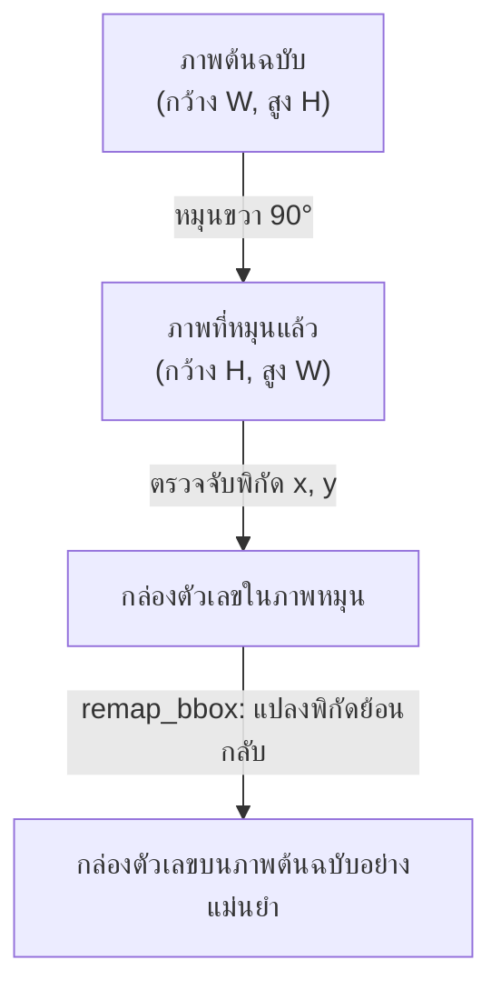
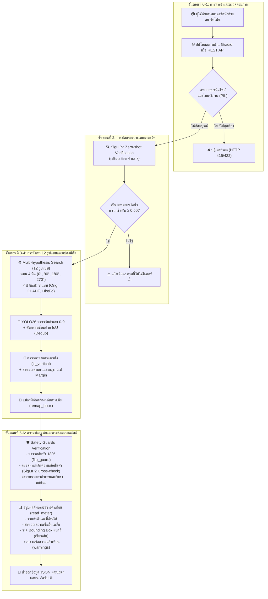
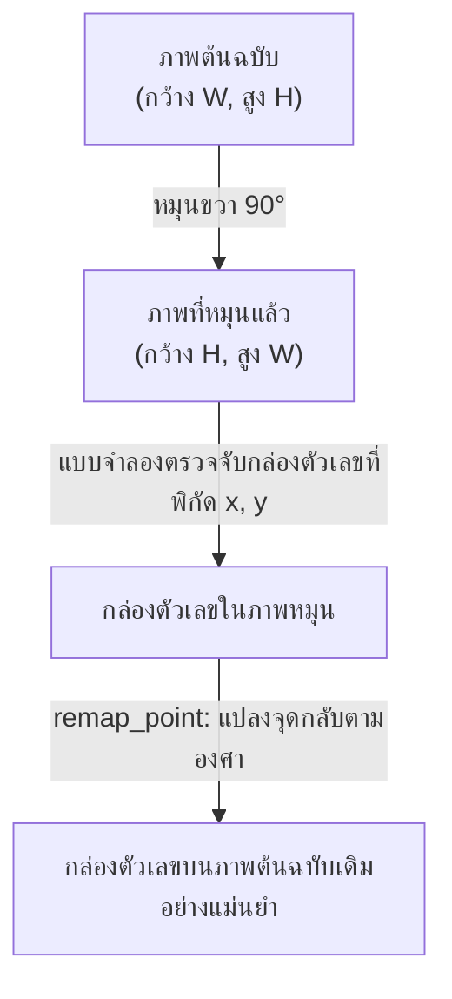
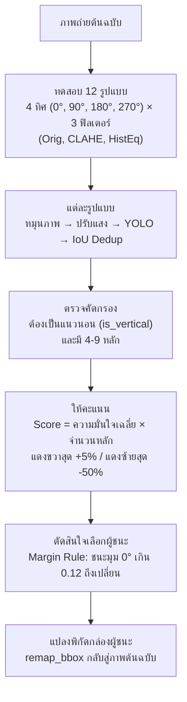
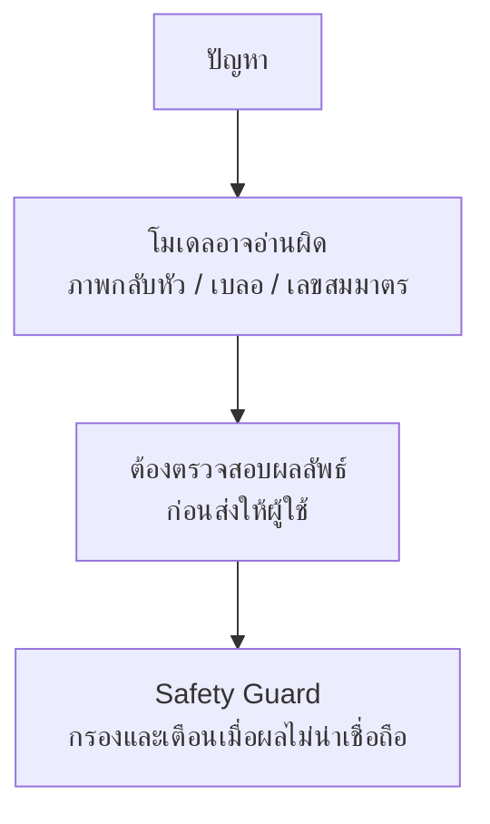

<p align="center"></p>

<p align="center"><strong>เอกสารประกอบการสอน</strong></p>
<p align="center"><strong>ระบบอ่านค่ามิเตอร์น้ำด้วยเทคโนโลยีการรู้จำอักขระด้วยแสง</strong></p>
<p align="center"><strong>Water Meter OCR</strong></p>

<p align="center"><strong>นายจิรเมธ ทองเปลว รหัสประจำตัว 674230013</strong></p>
<p align="center">หมู่เรียน 67/44</p>
<p align="center">โครงงานนี้เป็นส่วนหนึ่งของการศึกษารายวิชา 7203602</p>
<p align="center">สาขาวิชาเทคโนโลยีสารสนเทศ คณะวิทยาศาสตร์และเทคโนโลยี</p>
<p align="center">มหาวิทยาลัยราชภัฏนครปฐม</p>
<p align="center">ภาคเรียนที่ 1 ปีการศึกษา 2569</p>

<div style="page-break-after: always;"></div>

## คำนำ

&emsp;&emsp;&emsp;&emsp;คู่มือฉบับนี้จัดทำขึ้นเพื่อใช้เป็นแนวทางในการศึกษาและพัฒนาระบบอ่านค่ามาตรวัดน้ำอัตโนมัติจากภาพถ่าย โดยประยุกต์ใช้เทคโนโลยีปัญญาประดิษฐ์ (Artificial Intelligence) การประมวลผลภาพ (Image Processing) และการรู้จำอักขระจากภาพ (Optical Character Recognition: OCR) เพื่อเพิ่มประสิทธิภาพในการอ่านและจัดเก็บข้อมูลจากมาตรวัดน้ำ ตลอดจนเป็นแนวทางสำหรับผู้ที่สนใจนำเทคโนโลยีดังกล่าวไปประยุกต์ใช้ในการพัฒนาระบบอัตโนมัติในลักษณะอื่นต่อไป

&emsp;&emsp;&emsp;&emsp;เนื้อหาของคู่มือฉบับนี้ครอบคลุมกระบวนการพัฒนาระบบอ่านค่ามาตรวัดน้ำอัตโนมัติอย่างเป็นลำดับ ตั้งแต่การรับและเตรียมข้อมูลภาพ การตรวจสอบและคัดกรองข้อมูล การปรับปรุงคุณภาพของภาพถ่ายด้วยเทคนิคการประมวลผลภาพ การตรวจจับตัวเลขบนหน้าปัดมาตรวัดน้ำ การอ่านและรู้จำตัวเลขด้วยเทคนิค OCR ตลอดจนการประมวลผลและส่งออกผลลัพธ์ของระบบ นอกจากนี้ ยังครอบคลุมการประยุกต์ใช้แบบจำลอง YOLO และ SigLIP2 รวมถึงการให้บริการแบบจำลองผ่าน FastAPI และการพัฒนาส่วนติดต่อผู้ใช้ด้วย Gradio เพื่อให้สามารถทดสอบการทำงานของระบบได้อย่างครบถ้วน

&emsp;&emsp;&emsp;&emsp;ผู้จัดทำได้เรียบเรียงเนื้อหาและตัวอย่างการพัฒนาระบบโดยอาศัยการศึกษาค้นคว้าจากเอกสารทางวิชาการ งานวิจัย โครงการโอเพนซอร์ส และแหล่งข้อมูลทางเทคนิคที่เกี่ยวข้อง โดยจัดลำดับเนื้อหาให้มีความต่อเนื่องและสัมพันธ์กันตามกระบวนการทำงานของระบบ เพื่อให้ผู้อ่านสามารถศึกษา ทำความเข้าใจ และนำแนวทางรวมถึงตัวอย่างโค้ดไปประยุกต์ใช้ได้อย่างถูกต้องและเหมาะสม คู่มือฉบับนี้มุ่งหวังให้เป็นประโยชน์ต่อนักพัฒนาซอฟต์แวร์ นักศึกษา วิศวกรปัญญาประดิษฐ์ และผู้สนใจด้านคอมพิวเตอร์วิทัศน์ ตลอดจนผู้ที่ต้องการศึกษาแนวทางการประยุกต์ใช้ปัญญาประดิษฐ์เพื่อพัฒนาระบบอ่านข้อมูลจากภาพ

&emsp;&emsp;&emsp;&emsp;ผู้จัดทำหวังเป็นอย่างยิ่งว่าคู่มือฉบับนี้จะเป็นประโยชน์ต่อการศึกษาและการพัฒนาระบบอ่านค่ามาตรวัดน้ำอัตโนมัติ รวมทั้งสามารถนำองค์ความรู้และแนวทางที่นำเสนอไปประยุกต์ใช้ในการพัฒนาระบบที่เกี่ยวข้องกับการตรวจจับและรู้จำข้อมูลจากภาพในอนาคต หากมีข้อเสนอแนะอันเป็นประโยชน์ต่อการปรับปรุงคู่มือฉบับนี้ ผู้จัดทำขอน้อมรับด้วยความขอบพระคุณยิ่ง

<p align="right">นายจิรเมธ ทองเปลว</p>
<p align="right">สิงหาคม 2569</p>

<div style="page-break-after: always;"></div>

# คู่มือการพัฒนาระบบอ่านค่ามาตรวัดน้ำอัตโนมัติด้วยปัญญาประดิษฐ์
## Automated Water Meter Reading System using Deep Learning & Computer Vision

&emsp;&emsp;&emsp;&emsp;คู่มือฉบับนี้จัดทำขึ้นสำหรับนักศึกษาที่มีพื้นฐานการเขียนโปรแกรมภาษา Python และมุ่งเน้นการศึกษาแนวทางการพัฒนาระบบอ่านค่ามาตรวัดน้ำอัตโนมัติจากภาพถ่าย (Water Meter OCR) โดยประยุกต์ใช้เทคโนโลยีปัญญาประดิษฐ์และคอมพิวเตอร์วิทัศน์ เพื่อให้ผู้ศึกษาสามารถทำความเข้าใจสถาปัตยกรรมและกระบวนการทำงานในแต่ละขั้นตอนอย่างเป็นระบบ ผ่านการออกแบบรหัสต้นฉบับที่เป็นฟังก์ชันย่อยตามหน้าที่ (Functional Modular Design) ซึ่งช่วยให้สามารถศึกษา วิเคราะห์ และทดสอบการทำงานได้อย่างมีประสิทธิภาพ

> **เทคโนโลยีหลักที่ประยุกต์ใช้ในโครงงาน:** Python, YOLO (แบบจำลองตรวจจับตัวเลข), SigLIP2 (แบบจำลองคัดกรองประเภทภาพ), OpenCV (การประมวลผลภาพดิจิทัล), FastAPI (บริการส่วนเชื่อมต่อโปรแกรมประยุกต์), Gradio (ส่วนติดต่อผู้ใช้บนเว็บ), และ `uv` (เครื่องมือจัดการสภาพแวดล้อมและชุดคำสั่ง)

> **โครงสร้างเอกสาร:** บทที่ 1 เป็น `Tutorial` — สอนใช้งานทีละขั้นตอนพร้อมโค้ดและคำสั่ง `uv` ส่วนบทที่ 2-3 เป็น `Research/Methodology` — อธิบายทฤษฎี เทคนิค การทดลอง และผลประเมินแบบควบคุม ผู้อ่านที่ต้องการรันระบบก่อนให้ข้ามไป `1.11` ได้ทันที

---

## สารบัญเนื้อหา (Table of Contents)

1. [ข้อแนะนำเบื้องต้นสำหรับการศึกษา](#ข้อแนะนำเบื้องต้นสำหรับการศึกษา)
2. [บทที่ 1: ทฤษฎีพื้นฐาน เทคโนโลยีที่ใช้ และการประมวลผลภาพ](#บทที่-1-ทฤษฎีพื้นฐาน-เทคโนโลยีที่ใช้-และการประมวลผลภาพ)
  2.1 [1.1 ความเป็นมาและความสำคัญของปัญหา](#11-ความเป็นมาและความสำคัญของปัญหา)
  2.2 [1.2 แนวคิดในการแก้ปัญหา](#12-แนวคิดในการแก้ปัญหา)
  2.3 [1.3 วัตถุประสงค์ของโครงงาน](#13-วัตถุประสงค์ของโครงงาน)
  2.4 [1.4 ขอบเขตการศึกษา](#14-ขอบเขตการศึกษา)
  2.5 [1.5 ผลที่คาดว่าจะได้รับ](#15-ผลที่คาดว่าจะได้รับ)
  2.6 [1.6 แผนการดำเนินงาน](#16-แผนการดำเนินงาน)
  2.7 [1.6 ทฤษฎีและหลักการพื้นฐาน (Theory)](#17-ทฤษฎีและหลักการพื้นฐาน-theory)
    2.7.1 [1.8.1 คอมพิวเตอร์วิทัศน์และการรู้จำอักขระด้วยแสง (Computer Vision & OCR)](#171-คอมพิวเตอร์วิทัศน์และการรู้จำอักขระด้วยแสง-computer-vision--ocr)
    2.7.2 [1.8.2 แบบจำลองการตรวจจับวัตถุ YOLO (You Only Look Once)](#172-แบบจำลองการตรวจจับวัตถุ-yolo-you-only-look-once)
    2.7.3 [1.8.3 การจำแนกประเภทภาพแบบซีโร่ช็อตและแบบจำลองภาษา-ภาพ (Zero-shot Vision-Language Models)](#173-การจำแนกประเภทภาพแบบซีโร่ช็อตและแบบจำลองภาษา-ภาพ-zero-shot-vision-language-models)
    2.7.4 [1.8.4 ทฤษฎีการประมวลผลภาพดิจิทัลและปริภูมิสี (Digital Image Processing & Color Spaces)](#174-ทฤษฎีการประมวลผลภาพดิจิทัลและปริภูมิสี-digital-image-processing--color-spaces)
  2.8 [1.7 เทคนิคและอัลกอริทึมที่พัฒนาขึ้นในโครงงาน (Techniques)](#18-เทคนิคและอัลกอริทึมที่พัฒนาขึ้นในโครงงาน-techniques)
    2.8.1 [1.8.1 เทคนิคการคัดกรองภาพด้วย Zero-shot Classification (SigLIP2)](#181-เทคนิคการคัดกรองภาพด้วย-zero-shot-classification-siglip2)
    2.8.2 [1.8.2 เทคนิคการค้นหาเชิงสมมติฐานพหุคูณ 12 รูปแบบ (Multi-hypothesis 12-Combination Search)](#182-เทคนิคการค้นหาเชิงสมมติฐานพหุคูณ-12-รูปแบบ-multi-hypothesis-12-combination-search)
    2.8.3 [1.8.3 เทคนิคการตัดกรอบสี่เหลี่ยมซ้ำซ้อนด้วย IoU (Candidate Deduplication)](#183-เทคนิคการตัดกรอบสี่เหลี่ยมซ้ำซ้อนด้วย-iou-candidate-deduplication)
    2.8.4 [1.8.4 เทคนิคการแปลงพิกัดเรขาคณิตย้อนกลับ (Coordinate Remapping)](#184-เทคนิคการแปลงพิกัดเรขาคณิตย้อนกลับ-coordinate-remapping)
    2.8.5 [1.8.5 เทคนิคการกรองเค้าโครงแถวตัวเลขแนวตั้ง (Geometric Layout Filtering)](#185-เทคนิคการกรองเค้าโครงแถวตัวเลขแนวตั้ง-geometric-layout-filtering)
    2.8.6 [1.8.6 เทคนิคกลไกความปลอดภัยและการตรวจทานความถูกต้อง (Safety Guards)](#186-เทคนิคกลไกความปลอดภัยและการตรวจทานความถูกต้อง-safety-guards)
  2.9 [1.8 เทคโนโลยี ชุดเครื่องมือ และไลบรารีที่ใช้ในโครงงาน (Libraries & Tools)](#19-เทคโนโลยี-ชุดเครื่องมือ-และไลบรารีที่ใช้ในโครงงาน-libraries--tools)
  2.10 [1.9 ขั้นตอนและวิธีการทำงานของระบบ (Pipeline Workflow & Methodology)](#110-ขั้นตอนและวิธีการทำงานของระบบ-pipeline-workflow--methodology)
  2.11 [1.10 การฝึกแบบจำลองสำหรับการตรวจจับตัวเลข](#111-การฝึกแบบจำลองสำหรับการตรวจจับตัวเลข)
    2.11.1 [1.13.1 การเตรียมชุดข้อมูลจาก Roboflow](#1111-การเตรียมชุดข้อมูลจาก-roboflow)
    2.11.2 [1.13.2 การฝึกแบบจำลอง YOLO บน Google Colab](#1112-การฝึกแบบจำลอง-yolo-บน-google-colab)
  2.12 [1.11 สภาพแวดล้อมและการจัดการโครงงานด้วย `uv`](#112-สภาพแวดล้อมและการจัดการโครงงานด้วย-uv)
    2.12.1 [1.13.1 โครงสร้างไฟล์ของระบบ](#1121-โครงสร้างไฟล์ของระบบ)
    2.12.2 [1.13.2 การสร้างสภาพแวดล้อมและการติดตั้งไลบรารี](#1122-การสร้างสภาพแวดล้อมและการติดตั้งไลบรารี)
  2.13 [1.12 การวิเคราะห์รหัสต้นฉบับการประมวลผลคอมพิวเตอร์วิทัศน์](#113-การวิเคราะห์รหัสต้นฉบับการประมวลผลคอมพิวเตอร์วิทัศน์)
    2.13.1 [1.13.1 การหมุนภาพและการปรับปรุงคุณภาพภาพ (rotate_image, apply_prep)](#1131-การหมุนภาพและการปรับปรุงคุณภาพภาพ-rotate_image-apply_prep)
    2.13.2 [1.13.2 การแปลงพิกัดจุดเดี่ยวและกล่องขอบเขต (remap_point, remap_bbox)](#1132-การแปลงพิกัดจุดเดี่ยวและกล่องขอบเขต-remap_point-remap_bbox)
    2.13.3 [1.13.3 การกรองแถวตัวเลขแนวตั้ง (is_vertical)](#1133-การกรองแถวตัวเลขแนวตั้ง-is_vertical)
    2.13.4 [1.13.4 การค้นหาทิศทางและฟิลเตอร์ที่เหมาะสม (detect_digits_best)](#1134-การค้นหาทิศทางและฟิลเตอร์ที่เหมาะสม-detect_digits_best)
3. [บทที่ 2: หลักการและทฤษฎีที่เกี่ยวข้อง](#บทที่-2-หลักการและทฤษฎีที่เกี่ยวข้อง)
  3.1 [2.1 ระบบงานเดิม (Current System)](#21-ระบบงานเดิม-current-system)
  3.2 [2.2 ระบบงานและงานวิจัยที่เกี่ยวข้อง](#22-ระบบงานและงานวิจัยที่เกี่ยวข้อง)
  3.3 [2.3 วงจรการพัฒนาซอฟต์แวร์ (SDLC) ที่ใช้ในโครงงาน](#23-วงจรการพัฒนาซอฟต์แวร์-sdlc-ที่ใช้ในโครงงาน)
4. [บทที่ 3: การพัฒนาแอปพลิเคชันและส่วนติดต่อผู้ใช้](#บทที่-3-การพัฒนาแอปพลิเคชันและส่วนติดต่อผู้ใช้)
  4.1 [3.1 การบูรณาการระบบประมวลผลหลักและกลไกความปลอดภัย](#31-การบูรณาการระบบประมวลผลหลักและกลไกความปลอดภัย)
    4.1.1 [3.1.1 การตรวจจับภาพกลับหัวแบบสมมาตรด้วยฟังก์ชัน flip_guard](#311-การตรวจจับภาพกลับหัวแบบสมมาตรด้วยฟังก์ชัน-flip_guard)
    4.1.2 [3.1.2 ฟังก์ชันประมวลผลหลัก read_meter](#312-ฟังก์ชันประมวลผลหลัก-read_meter)
  4.2 [3.2 การพัฒนาส่วนเชื่อมต่อโปรแกรมประยุกต์ด้วย FastAPI](#32-การพัฒนาส่วนเชื่อมต่อโปรแกรมประยุกต์ด้วย-fastapi)
  4.3 [3.3 การพัฒนาส่วนติดต่อผู้ใช้ด้วย Gradio](#33-การพัฒนาส่วนติดต่อผู้ใช้ด้วย-gradio)
  4.4 [3.4 การทดสอบระบบและแนวทางการแก้ไขปัญหา](#34-การทดสอบระบบและแนวทางการแก้ไขปัญหา)
    4.4.1 [3.4.1 วิธีการสั่งทำงานระบบด้วย `uv`](#341-วิธีการสั่งทำงานระบบด้วย-uv)
    4.4.2 [3.4.2 แนวทางการวิเคราะห์และแก้ไขปัญหา (Debugging Matrix)](#342-แนวทางการวิเคราะห์และแก้ไขปัญหา-debugging-matrix)
    4.4.3 [3.4.3 ผลการประเมินประสิทธิภาพและความแม่นยำของระบบ](#343-ผลการประเมินประสิทธิภาพและความแม่นยำของระบบ)
  4.5 [3.5 ข้อควรพิจารณาสำหรับการนำระบบไปใช้งานจริง](#35-ข้อควรพิจารณาสำหรับการนำระบบไปใช้งานจริง)
5. [บทที่ 4: สรุปผลการศึกษา อภิปรายผล และข้อเสนอแนะ](#บทที่-4-สรุปผลการศึกษา-อภิปรายผล-และข้อเสนอแนะ)
  5.1 [4.1 สรุปผลการพัฒนาโครงงาน](#41-สรุปผลการพัฒนาโครงงาน)
  5.2 [4.2 อภิปรายผลการดำเนินงาน](#42-อภิปรายผลการดำเนินงาน)
  5.3 [4.3 ข้อจำกัดของระบบ](#43-ข้อจำกัดของระบบ)
  5.4 [4.4 ข้อเสนอแนะสำหรับการพัฒนาต่อยอด](#44-ข้อเสนอแนะสำหรับการพัฒนาต่อยอด)
6. [อภิธานศัพท์ (Glossary)](#อภิธานศัพท์-glossary)
7. [บรรณานุกรมและเอกสารอ้างอิง (References)](#บรรณานุกรมและเอกสารอ้างอิง-references)
8. [ภาคผนวก: มาตรการด้านความปลอดภัยและความเสถียรของระบบ](#ภาคผนวก-มาตรการด้านความปลอดภัยและความเสถียรของระบบ)

---

## ข้อแนะนำเบื้องต้นสำหรับการศึกษา

&emsp;&emsp;&emsp;&emsp;โปรดศึกษาหลักการเบื้องต้นจำนวน 4 ประการดังต่อไปนี้ก่อนเริ่มดำเนินการ เพื่อให้การพัฒนาระบบเป็นไปอย่างราบรื่น:

1.1 **การใช้งานสภาพแวดล้อมเสมือน (Virtual Environment: `venv`):** ทำหน้าที่แยกสภาพแวดล้อมและไลบรารีของโครงงานออกจากโครงงานอื่น เพื่อป้องกันความขัดแย้งของรุ่นไลบรารี — การลบสภาพแวดล้อมดังกล่าวมิได้ส่งผลกระทบต่อระบบหลัก
1.2 **การจัดการไลบรารีด้วย `uv`:** คือตัวติดตั้งไลบรารีที่เขียนด้วย Rust ถูกออกแบบมาให้ติดตั้งและจัดการชุดคำสั่งได้อย่างสะดวกรวดเร็ว
1.3 **ตำแหน่งสำหรับการดำเนินการคำสั่ง:** เปิด Terminal และตรวจสอบว่าอยู่ที่โฟลเดอร์หลัก `meter-reader/` เสมอก่อนดำเนินการสั่งทำงานคำสั่ง `uv run python ...`
1.4 **การแบ่งรหัสต้นฉบับเป็นฟังก์ชันย่อยตามหน้าที่ (Functional Modular Design):** โครงงานแยกการทำงานออกเป็นฟังก์ชันย่อยที่ชัดเจน เช่น `rotate_image` (หมุนภาพ) → `apply_prep` (ปรับคอนทราสต์แสง) → `detect_digits` (ตรวจจับตัวเลข) ซึ่งแสดงลำดับการทำงานตั้งแต่การหมุนภาพ การปรับปรุงคุณภาพภาพ และการตรวจจับตัวเลขตามลำดับ โดยแต่ละฟังก์ชันมีการรับค่าเข้าและส่งค่าออกที่แน่นอน ช่วยให้การศึกษา ทดสอบ และปรับปรุงแก้ไขสามารถกระทำได้ง่ายเป็นรายส่วน

> **ข้อแนะนำการเรียนรู้:** ผู้ศึกษาสามารถทดลองสั่งทำงานระบบจริงด้วยแบบจำลองสำเร็จรูปก่อนศึกษารหัสต้นฉบับทั้งหมด โดยเปิด Terminal 2 หน้าต่าง — หน้าต่างที่ 1 สั่งทำงาน `uv run python main.py` หน้าต่างที่ 2 สั่งทำงาน `uv run python gradio_app.py` แล้วเปิดเว็บเบราว์เซอร์ที่ http://127.0.0.1:7860 เพื่อทำความเข้าใจภาพรวมการทำงานของระบบ

---

# บทที่ 1: ทฤษฎีพื้นฐาน เทคโนโลยีที่ใช้ และการประมวลผลภาพ

---

### 1.1 ความเป็นมาและความสำคัญของปัญหา

&emsp;&emsp;&emsp;&emsp;ในปัจจุบัน การประปาส่วนภูมิภาคและการประปานครหลวงยังคงพึ่งพาพนักงานภาคสนามในการอ่านค่ามาตรวัดน้ำด้วยสายตาและบันทึกข้อมูลด้วยมือทุกเดือน กระบวนการดังกล่าวก่อให้เกิดปัญหาสำคัญ 3 ประการ ได้แก่ (1) **ความผิดพลาดจากการอ่าน** ซึ่งเกิดขึ้นเมื่อตัวเลขบนหน้าปัดเลือนราง มีคราบสกปรก หรือพนักงานอ่านผิดเนื่องจากแสงไม่เพียงพอ (2) **ต้นทุนแรงงานสูง** เนื่องจากต้องส่งพนักงานออกภาคสนามเพื่ออ่านค่าเป็นประจำทุกเดือนในพื้นที่กว้างขวาง และ (3) **ความล่าช้าในการตรวจจับความผิดปกติ** เช่น การรั่วไหลของน้ำหรือการใช้น้ำผิดปกติ ซึ่งหากตรวจพบได้ช้าจะส่งผลให้เกิดความสูญเสียทางเศรษฐกิจอย่างมีนัยสำคัญ

&emsp;&emsp;&emsp;&emsp;การนำเทคโนโลยีปัญญาประดิษฐ์ (Artificial Intelligence: AI) มาประยุกต์ใช้ในการอ่านค่ามาตรวัดน้ำจากภาพถ่ายจึงเป็นแนวทางที่ได้รับความสนใจอย่างแพร่หลายในระดับสากล โดยมีงานวิจัยจำนวนมากที่ยืนยันว่าระบบดังกล่าวสามารถลดอัตราความผิดพลาดได้อย่างมีนัยสำคัญ (Liang et al., 2022; Wang & Xiang, 2024) อย่างไรก็ตาม ระบบส่วนใหญ่ยังมีข้อจำกัดในด้านการรับมือกับภาพที่มีคุณภาพต่ำ ภาพที่ถ่ายในมุมเอียง หรือภาพที่มีแสงสะท้อนรบกวน ซึ่งเป็นสภาพแวดล้อมที่พบได้บ่อยในการปฏิบัติงานจริง

---

### 1.2 แนวคิดในการแก้ปัญหา

&emsp;&emsp;&emsp;&emsp;โครงงานนี้นำเสนอระบบอ่านค่ามาตรวัดน้ำอัตโนมัติ (Automated Water Meter Reading System) ที่รับภาพถ่ายจากกล้องสมาร์ทโฟนเป็นข้อมูลนำเข้า แล้วประมวลผลด้วยแบบจำลองปัญญาประดิษฐ์เพื่อส่งออกค่าตัวเลขที่อ่านได้พร้อมค่าความเชื่อมั่น โดยมีแนวคิดสำคัญ 3 ประการดังนี้

1.2.1 **ใช้แบบจำลอง YOLO26** สำหรับตรวจจับและระบุตัวเลข 0–9 บนหน้าปัดมาตรวัดน้ำโดยตรงจากภาพเต็ม โดยไม่ต้องครอปภาพล่วงหน้า ซึ่งแตกต่างจากวิธีดั้งเดิมที่ต้องใช้ OCR ร่วมกับการตัดภาพก่อน
1.2.2 **ใช้แบบจำลอง SigLIP2** สำหรับคัดกรองภาพนำเข้า เพื่อยืนยันว่าภาพที่รับมาเป็นมาตรวัดน้ำจริงก่อนประมวลผล โดยไม่ต้องฝึกฝนแบบจำลองใหม่ (Zero-shot)
1.2.3 **ใช้กลไก 12 รูปแบบการค้นหา** (หมุนภาพ 4 ทิศ × ปรับแสง 3 แบบ) เพื่อรับมือกับภาพที่มีคุณภาพต่ำหรือถ่ายในมุมที่ไม่ตรง

---

### 1.3 วัตถุประสงค์ของระบบ

&emsp;&emsp;&emsp;&emsp;โครงงานนี้มีวัตถุประสงค์หลัก 3 ประการดังนี้

1.3.1 เพื่อพัฒนาระบบอ่านค่ามาตรวัดน้ำอัตโนมัติจากภาพถ่ายที่สามารถทำงานได้บนทรัพยากรคอมพิวเตอร์ทั่วไป ทั้งหน่วยประมวลผลกลาง (CPU) และหน่วยประมวลผลกราฟิก (GPU)
1.3.2 เพื่อออกแบบกลไกที่มีวัตถุประสงค์เพื่อลดโอกาสเกิดความผิดพลาดในการอ่านค่าตัวเลข โดยประยุกต์ใช้การคัดกรองภาพ (SigLIP2) และกลไกตรวจสอบความปลอดภัย (Safety Guards) — ประสิทธิผลเชิงปริมาณยังต้องมีการประเมินแบบควบคุม (ดูหัวข้อ 3.4.3)
1.3.3 เพื่อให้บริการระบบผ่านส่วนเชื่อมต่อโปรแกรมประยุกต์ (FastAPI) และส่วนติดต่อผู้ใช้บนเว็บ (Gradio) ที่สามารถนำไปบูรณาการกับระบบอื่นได้ทันที

---

### 1.4 ขอบเขตการศึกษา

&emsp;&emsp;&emsp;&emsp;โครงงานนี้กำหนดขอบเขตการศึกษาไว้ดังนี้

**ขอบเขตด้านประเภทมาตรวัด:** ระบบออกแบบมาสำหรับมาตรวัดน้ำแบบตัวเลขกลไก (Mechanical Digit Display) ที่แสดงผลด้วยตัวเลข 0–9 เรียงในแนวนอน 4–9 หลัก ซึ่งเป็นประเภทที่ใช้อยู่ทั่วไปในระบบประปา โดยไม่ครอบคลุมมาตรวัดแบบเข็มหรือแบบดิจิทัล

**ขอบเขตด้านฮาร์ดแวร์:** ระบบได้รับการออกแบบให้ทำงานได้บนเครื่องคอมพิวเตอร์ทั่วไปที่ติดตั้ง Python 3.11 ขึ้นไป ทั้งโหมด CPU และโหมด GPU NVIDIA CUDA โดยเวลาประมวลผลเชิงสังเกตขึ้นกับฮาร์ดแวร์ รุ่น GPU ความละเอียดภาพ (`YOLO_IMGSZ`) และจำนวนสมมติฐานที่ประเมิน — ยังไม่มีการวัดแบบควบคุมด้วยเงื่อนไขทดสอบที่ระบุไว้ในโปรเจกต์นี้ (ดูหัวข้อ 3.4.3 และ 3.5)

**ขอบเขตด้านซอฟต์แวร์:** ระบบพัฒนาด้วยภาษา Python 3.11 โดยใช้ไลบรารีหลัก ได้แก่ YOLO26 (Ultralytics), SigLIP2 (Hugging Face Transformers), OpenCV, FastAPI และ Gradio

**ขอบเขตด้านข้อมูล:** ชุดข้อมูลสำหรับฝึกแบบจำลองได้มาจากแพลตฟอร์ม Roboflow ในชุด "Utility Meter Reading" จำนวน 1 เวอร์ชัน ซึ่งประกอบด้วยภาพมาตรวัดน้ำที่มีการกำกับพิกัดตัวเลขครบถ้วน

---

### 1.5 ผลที่คาดว่าจะได้รับ

&emsp;&emsp;&emsp;&emsp;เมื่อดำเนินโครงงานสำเร็จลุล่วง คาดว่าจะได้รับผลดังต่อไปนี้

1.5.1 **ระบบต้นแบบ (Prototype)** ที่ได้รับการออกแบบให้ประมวลผลภาพถ่ายมาตรวัดน้ำในสภาพแสงและมุมกล้องที่หลากหลาย พร้อมแสดงค่าความเชื่อมั่นและข้อความแจ้งเตือนเมื่อผลลัพธ์มีความเสี่ยง — ความถูกต้องในแต่ละเงื่อนไขยังต้องมีการประเมินแบบควบคุม
1.5.2 **บริการ REST API** ที่สามารถรับส่งภาพและผลลัพธ์ผ่านโพรโทคอล HTTP ได้ทันที เพื่อให้สามารถนำไปบูรณาการกับแอปพลิเคชันบนอุปกรณ์เคลื่อนที่หรือระบบฐานข้อมูลได้
1.5.3 **องค์ความรู้** ด้านการประยุกต์ใช้ YOLO และ Vision-Language Model ร่วมกันสำหรับงาน OCR ในสภาพแวดล้อมจริง ซึ่งสามารถนำไปปรับใช้กับงานอ่านค่าอุปกรณ์วัดประเภทอื่นได้

---

### 1.8 ทฤษฎีและหลักการพื้นฐาน (Theory)

&emsp;&emsp;&emsp;&emsp;การพัฒนาระบบอ่านค่ามาตรวัดน้ำอัตโนมัติจำเป็นต้องอาศัยรากฐานทางทฤษฎีด้านปัญญาประดิษฐ์ คอมพิวเตอร์วิทัศน์ และการประมวลผลภาพดิจิทัล เพื่อแก้ไขปัญหาความแปรปรวนของภาพถ่ายในสภาพแวดล้อมจริง เช่น ภาพถ่ายเอียง สภาพแสงสะท้อน คราบสกปรกบนหน้าปัด และความสมมาตรของตัวเลขเมื่อภาพกลับทิศทาง ผู้จัดทำจึงได้สังเคราะห์ทฤษฎีพื้นฐานที่เกี่ยวข้องออกเป็น 4 หมวดหมู่อย่างเป็นลำดับ ดังต่อไปนี้

#### 1.8.1 คอมพิวเตอร์วิทัศน์และการรู้จำอักขระด้วยแสง (Computer Vision & OCR)

&emsp;&emsp;&emsp;&emsp;คอมพิวเตอร์วิทัศน์ (Computer Vision) เป็นสาขาหนึ่งของวิทยาการคอมพิวเตอร์และปัญญาประดิษฐ์ที่มุ่งเน้นการพัฒนาอัลกอริทึมเพื่อให้ระบบคอมพิวเตอร์สามารถรับรู้ ทำความเข้าใจ และสกัดข้อมูลความหมายเชิงลึกจากภาพถ่ายดิจิทัลหรือวิดีโอได้เช่นเดียวกับการมองเห็นของมนุษย์ (Zou et al., 2023)

&emsp;&emsp;&emsp;&emsp;ในการประมวลผลภาพขั้นสูง ภารกิจการตรวจจับวัตถุ (Object Detection) ถือเป็นกระบวนการหลักที่ต้องดำเนินการควบคู่กัน 2 ประการ ได้แก่ (1) การระบุตำแหน่งของวัตถุเป้าหมาย (Localization) โดยการสร้างกรอบพิกัดสี่เหลี่ยมล้อมรอบวัตถุ (Bounding Box: `bbox`) ในระนาบสองมิติ กรอบพิกัดสี่ค่าที่บอกมุมซ้ายบนและมุมขวาล่างของตัวเลข และ (2) การจำแนกประเภทของวัตถุ (Classification) เพื่อระบุว่าวัตถุที่อยู่ภายในกรอบดังกล่าวจัดอยู่ในคลาส (Class) ใด พร้อมทั้งคำนวณค่าความเชื่อมั่น (Confidence Score) ของการทำนาย

&emsp;&emsp;&emsp;&emsp;เทคโนโลยีการรู้จำอักขระด้วยแสง (Optical Character Recognition: OCR) ในยุคดั้งเดิม เช่น Tesseract OCR ทำงานโดยการตัดแบ่งส่วนภาพ (Image Segmentation) เพื่อแยกตัวอักษรทีละตัว แล้วจึงนำไปเปรียบเทียบกับแม่แบบตัวอักษร ซึ่งวิธีดังกล่าวมีข้อจำกัดอย่างยิ่งเมื่อนำไปประยุกต์ใช้กับภาพถ่ายภาคสนามที่มีมุมเอียง มีแสงเงาสะท้อน หรือมีสัญญาณรบกวนบนพื้นผิวหน้าปัด ในทางตรงกันข้าม การประยุกต์ใช้การตรวจจับวัตถุด้วยการเรียนรู้เชิงลึก (Deep Learning-based Object Detection) จะมองตัวเลขอารบิกแต่ละหลักเป็นวัตถุหนึ่งชิ้น ทำให้ระบบสามารถตรวจจับตำแหน่งและรู้จำค่าตัวเลขได้พร้อมกันโดยตรงจากภาพถ่ายเต็มเฟรมโดยไม่ต้องพึ่งพากระบวนการตัดภาพล่วงหน้า

#### 1.8.2 แบบจำลองการตรวจจับวัตถุ YOLO (You Only Look Once)

&emsp;&emsp;&emsp;&emsp;โครงงานนี้เลือกใช้แบบจำลอง YOLO (You Only Look Once) ซึ่งเป็นสถาปัตยกรรมโครงข่ายประสาทเทียมแบบคอนโวลูชันสำหรับการตรวจจับวัตถุแบบขั้นตอนเดียว (Single-stage Object Detector) ที่ได้รับความนิยมสูงสุดในระดับสากล โดยแบบจำลองจะรับข้อมูลภาพทั้งหมดเข้าสู่โครงข่ายและทำการทำนายพิกัดกรอบขอบเขตพร้อมประเภทของวัตถุทั้งหมดได้ในรอบการคำนวณเพียงครั้งเดียว (Jocher et al., 2023; Zou et al., 2023; Ultralytics, 2024)

&emsp;&emsp;&emsp;&emsp;**1. โครงงานนี้ใช้ YOLO ทำอะไร:** แบบจำลอง YOLO ทำหน้าที่ตรวจจับตำแหน่งกรอบสี่เหลี่ยมพิกัด (Bounding Box) และจำแนกประเภทตัวเลขแต่ละหลัก (คลาส 0 ถึง 9) ที่ปรากฏอยู่บนหน้าปัดมาตรวัดน้ำจากภาพถ่ายเต็มเฟรม โดยระบบจะสกัดพิกัดจุดศูนย์กลาง ตำแหน่งจุดบนภาพ ขนาดความกว้าง ความสูง และค่าความเชื่อมั่นของตัวเลขแต่ละตัวเพื่อนำไปเรียงลำดับจากซ้ายไปขวา

&emsp;&emsp;&emsp;&emsp;**2. แบบจำลอง YOLO มีข้อดีอย่างไร:** สถาปัตยกรรม YOLO ได้รับการออกแบบให้ทำงานแบบขั้นตอนเดียว (Single-stage) โดยทำนายพิกัดและคลาสในรอบเดียว ตามเอกสารของ Ultralytics (Ultralytics, 2024) สถาปัตยกรรม YOLO รุ่นใหม่ได้รับการออกแบบให้เป็นแบบไร้กล่องสมอ (Anchor-free) โดยมีวัตถุประสงค์เพื่อลดการพึ่งพากล่องต้นแบบและเอื้อต่อการตรวจจับวัตถุขนาดเล็ก เวลาประมวลผลเชิงสังเกตขึ้นกับฮาร์ดแวร์ ความละเอียดภาพ และจำนวนสมมติฐาน — โปรเจกต์นี้ยังไม่มีการวัดแบบควบคุมที่ระบุฮาร์ดแวร์/ความละเอียด/การแยกเวลา preprocessing/inference/postprocessing ไว้ (ดูหัวข้อ 3.4.3) สำหรับการฝึก โปรเจกต์นี้ได้กำหนดค่า Data Augmentation ไว้ใน `training/yolo_train.py` (Mosaic, Mixup, degrees, hsv_v) โดยมีวัตถุประสงค์เพื่อให้แบบจำลองได้รับข้อมูลที่หลากหลาย; ความทนทานที่เพิ่มขึ้นจาก augmentation ดังกล่าวยังไม่ได้พิสูจน์ด้วย ablation ในโปรเจกต์นี้

&emsp;&emsp;&emsp;&emsp;**3. นำมาใช้เพื่อวัตถุประสงค์ใด:** การนำ YOLO มาใช้มีวัตถุประสงค์เพื่อทดแทนระบบ OCR แบบดั้งเดิมที่ต้องอาศัยการตัดภาพหน้าปัดให้ตรงและขจัดสัญญาณรบกวนก่อน ซึ่งมักล้มเหลวในการทำงานภาคสนามจริง การใช้ YOLO ช่วยให้ระบบสามารถค้นหาและอ่านค่าตัวเลขได้ทันทีแม้ภาพถ่ายจะมีความเอียงหรือมีพื้นหลังรกซับซ้อน

&emsp;&emsp;&emsp;&emsp;สถาปัตยกรรมของ YOLO26 ประกอบด้วย 3 ส่วนหลัก ได้แก่:
1.6.2.1 **Backbone Network (CSPDarknet):** ทำหน้าที่สกัดคุณลักษณะของภาพ (Feature Extraction) ในระดับความละเอียดต่างๆ ตั้งแต่เส้นขอบ พื้นผิว จนถึงรูปร่างของตัวเลข
1.6.2.2 **Neck Network (PAN-FPN):** ทำหน้าที่ผสานคุณลักษณะจากระดับลึกและระดับตื้นเข้าด้วยกัน เพื่อรักษารายละเอียดของตัวเลขขนาดเล็กและบริบทภาพรวมของหน้าปัด
1.6.2.3 **Detection Head (Anchor-free Head):** ทำหน้าที่ทำนายพิกัด Bounding Box ค่าความเชื่อมั่น และคลาสตัวเลข 0–9 โดยตรงจากแผนที่ฟีเจอร์

&emsp;&emsp;&emsp;&emsp;ตารางที่ 1.1 แสดงการเปรียบเทียบคุณสมบัติระหว่าง YOLO26 Nano ร่วมกับตัวเลือกแบบจำลองอื่น เพื่อแสดงเหตุผลในการเลือกใช้โมเดลดังกล่าวในโครงงานนี้

**ตารางที่ 1.1 เปรียบเทียบตัวเลือกแบบจำลองสำหรับตรวจจับเลขมิเตอร์**

| แบบจำลอง | จำนวนพารามิเตอร์ | หน่วยความจำ VRAM | เวลาประมวลผล (GPU T4) | จุดเด่น | ข้อจำกัดสำหรับงานนี้ |
|---|---|---|---|---|---|
| **YOLO26 Nano (เลือกใช้)** | **~2.6M (ประมาณ)** | **~1.5 GB (ประมาณ)** | **~40–60 ms (ประมาณ, ต้องวัดบนฮาร์ดแวร์เดียวกัน)** | **เร็วสุดในกลุ่ม Nano ตามเอกสาร Ultralytics** | ค่า mAP ต่ำกว่ารุ่น Medium เล็กน้อย |
| YOLO26 Small | ~11M | ~3.0 GB | ~80–110 ms | ความแม่นยำสูงขึ้น | ใช้ทรัพยากรเพิ่มขึ้นเท่าตัว |
| YOLO26 Medium | ~20M | ~5.0 GB | ~130–180 ms | ความแม่นยำสูงสุด | ต้องการ GPU ประสิทธิภาพสูง |
| Faster R-CNN | ~41M | ~6.5 GB+ | ~300–500 ms | แม่นยำกับวัตถุที่ซ้อนทับกัน | ประมวลผลช้า ไม่เหมาะกับงานเวลาจริง |
| Tesseract OCR | — | ต่ำ | ~100 ms | ใช้งานง่าย ไม่ต้องเทรนกล่อง | ล้มเหลวเมื่อภาพเอียงหรือมีแสงสะท้อน |

&emsp;&emsp;&emsp;&emsp;จากตารางที่ 1.1 โครงงานเลือกใช้ **YOLO26 Nano (`yolo26n.pt`)** เนื่องจากมีวัตถุประสงค์เพื่อให้สามารถฝึกด้วยขนาดแบทช์ `batch=64` บน Google Colab และทำงานได้บน CPU ทั่วไป — ตัวเลขพารามิเตอร์และเวลาประมวลผลในตารางเป็นค่าประมาณจากเอกสารของ Ultralytics และงานอ้างอิง ไม่ใช่ผลการวัดแบบควบคุมของโปรเจกต์นี้ การเปรียบเทียบข้ามฮาร์ดแวร์/ความละเอียดที่ต่างกันไม่ควรใช้เป็นข้อสรุปเชิงประสิทธิภาพโดยตรง

> **หมายเหตุเกี่ยวกับตารางที่ 1.1:** เวลาประมวลผลเชิงสังเกตต้องอ้างอิงฮาร์ดแวร์ รุ่น GPU ความละเอียดภาพ เวลาแยกส่วน (preprocessing / inference / postprocessing) และจำนวนสมมติฐาน (ดูหัวข้อ 3.4.3 และ 3.5) โปรเจกต์นี้รายงาน `elapsed_ms` ต่อภาพจาก `perf_counter()` ใน `main.py:read_meter()` เท่านั้น ยังไม่มี benchmark แบบควบคุม

#### 1.8.3 การจำแนกประเภทภาพแบบซีโร่ช็อตและแบบจำลองภาษา-ภาพ (Zero-shot Vision-Language Models)

&emsp;&emsp;&emsp;&emsp;การจำแนกประเภทภาพแบบซีโร่ช็อต (Zero-shot Image Classification) เป็นความสามารถของแบบจำลองปัญญาประดิษฐ์ในการจำแนกประเภทของภาพถ่ายตามคำอธิบายภาษาธรรมชาติ (Natural Language Prompts) โดยที่แบบจำลองไม่เคยได้รับการฝึกฝนด้วยชุดข้อมูลภาพของคลาสนั้นมาก่อน (Zhai et al., 2023; Tschannen et al., 2025)

&emsp;&emsp;&emsp;&emsp;โครงงานนี้เลือกใช้แบบจำลอง **SigLIP2 (Sigmoid Loss for Language Image Pre-training 2)** ซึ่งเป็นแบบจำลอง Vision-Language ขนาดใหญ่ที่พัฒนาโดย Google โดยมีสถาปัตยกรรมแบบตัวเข้ารหัสคู่ (Dual-encoder Architecture) ประกอบด้วย:
1.6.3.1 **Vision Encoder (Vision Transformer: ViT-B/16):** ทำหน้าที่แปลงภาพถ่ายนำเข้าให้อยู่ในรูปเวกเตอร์คุณลักษณะของภาพ (`image_emb`)
1.6.3.2 **Text Encoder (Transformer):** ทำหน้าที่แปลงข้อความคำอธิบายภาษาธรรมชาติให้อยู่ในรูปเวกเตอร์คุณลักษณะของข้อความ (`text_emb`)

&emsp;&emsp;&emsp;&emsp;ความแตกต่างสำคัญระหว่าง SigLIP2 และ CLIP อยู่ที่ฟังก์ชันสูญเสียขณะฝึก (Training Loss) โดย CLIP ใช้ Softmax Cross-Entropy ที่ต้องเทียบทุกคลาสในแบทช์ร่วมกัน ส่วน SigLIP2 ใช้ **Pairwise Sigmoid Loss** คิดแยกแต่ละคู่ภาพ-ข้อความอย่างอิสระ ทำให้ทนต่อข้อมูลไม่สมดุลและไม่ผูกกับขนาดแบทช์ ดังตารางที่ 1.2 — สำหรับการอนุมาน (Inference) ในโครงงานนี้ เลือกใช้ `torch.softmax` เหนือ 4 คลาส (`water meter`/`electricity meter`/`gas meter`/`not a meter`) เพื่อให้ผลรวมเป็น 1 และตัดสินใจง่าย แม้ SigLIP จะฝึกด้วย Sigmoid ก็ตาม

**ตารางที่ 1.2 เปรียบเทียบ Softmax กับ Sigmoid (อ่านง่าย)**

| มิติการเปรียบเทียบ | ฟังก์ชัน Softmax Loss | ฟังก์ชัน Sigmoid Loss (ที่ใช้ใน SigLIP2) |
|---|---|---|
| **หลักการคำนวณคะแนน** | นำคะแนนดิบของทุกคลาสมารวมกันแล้วปรับสัดส่วนให้ผลรวมเท่ากับ 1.0 (100%) | คำนวณคะแนนของแต่ละคู่ภาพ-ข้อความเป็นอิสระต่อกัน ไม่ผูกติดกับคลาสอื่น |
| **ความเหมาะสมของงาน** | เหมาะกับงานที่คำตอบมีเพียงหนึ่งเดียวและแยกขาดจากกัน (Mutually Exclusive) | รองรับทั้งงานที่มีคำตอบเดียวและงานที่ภาพหนึ่งอาจตรงกับหลายคำอธิบาย |
| **ผลลัพธ์ความน่าจะเป็น** | ผลรวมความน่าจะเป็นของทุกคลาสรวมกันต้องเท่ากับ 1.0 เสมอ | ความน่าจะเป็นของแต่ละคลาสมีค่าระหว่าง 0.0 ถึง 1.0 แยกอิสระ |
| **เสถียรภาพในการฝึกฝน** | ขึ้นอยู่กับขนาดแบทช์ (Batch Size) หากแบทช์เล็กจะขาดเสถียรภาพ | ไม่ผูกติดกับขนาดแบทช์ ทนทานต่อข้อมูลที่คลาสไม่สมดุลได้ดีเยี่ยม |

&emsp;&emsp;&emsp;&emsp;สูตรการคำนวณของฟังก์ชัน Sigmoid คือ ฟังก์ชันซิกมอยด์ที่แปลงคะแนนดิบให้เป็นค่าความน่าจะเป็นระหว่างศูนย์ถึงหนึ่ง โดยที่ คะแนนดิบ คือคะแนนดิบ (Logit) ที่ได้จากการทำ Dot Product ระหว่างเวกเตอร์ภาพและเวกเตอร์ข้อความ หากค่า คะแนนดิบเท่ากับสอง จะได้ความน่าจะเป็น ศูนย์จุดแปดแปด หาก คะแนนดิบเท่ากับศูนย์ จะได้ ศูนย์จุดห้าศูนย์ และหาก คะแนนดิบเท่ากับลบหนึ่ง จะได้ ศูนย์จุดสองเจ็ด

&emsp;&emsp;&emsp;&emsp;กระบวนการจำแนกภาพแบบ Zero-shot ของ SigLIP2 ประกอบด้วย 4 ขั้นตอนตามลำดับ:
1.6.3.3 **การเข้ารหัสภาพ:** แปลงภาพถ่ายนำเข้าเป็นเวกเตอร์มิติสูงด้วย Vision Transformer
1.6.3.4 **การเข้ารหัสข้อความ:** แปลงข้อความเปรียบเทียบ 4 ตัวเลือก ได้แก่ `"water meter"`, `"electricity meter"`, `"gas meter"`, และ `"not a meter"` เป็นเวกเตอร์ข้อความ
1.6.3.5 **การวัดระยะความคล้ายคลึง:** คำนวณผลคูณจุด (Dot Product) ระหว่างเวกเตอร์ภาพกับเวกเตอร์ข้อความแต่ละชุด ปรับสเกลด้วยพารามิเตอร์อุณหภูมิ ค่าอุณหภูมิสำหรับปรับความคมของคะแนน เพื่อสร้างค่า Logits
1.6.3.6 **การตัดสินผลลัพธ์:** คำนวณความน่าจะเป็นและเลือกข้อความที่ได้คะแนนสูงสุด หากคลาส `"water meter"` ได้คะแนนความเชื่อมั่นผ่านเกณฑ์ มากกว่าหรือเท่ากับศูนย์จุดห้า ระบบจะอนุมัติให้ภาพเข้าสู่ขั้นตอนการตรวจจับตัวเลขต่อไป

#### 1.8.4 ทฤษฎีการประมวลผลภาพดิจิทัลและปริภูมิสี (Digital Image Processing & Color Spaces)

&emsp;&emsp;&emsp;&emsp;การประมวลผลภาพดิจิทัลเป็นขั้นตอนพื้นฐานในการปรับปรุงคุณภาพของภาพถ่ายก่อนส่งต่อให้แบบจำลองปัญญาประดิษฐ์ โดยระบบอาศัยทฤษฎีการแปลงปริภูมิสีและการปรับปรุงคอนทราสต์แสง ดังนี้

&emsp;&emsp;&emsp;&emsp;**1. ปริภูมิสี (Color Spaces):**
1.6.4.1 **RGB (Red, Green, Blue):** ระบบสีหลักที่กล้องดิจิทัลบันทึก โดยค่าความสว่างและสีจะผสมผสานกันอยู่ในทั้งสามช่องสัญญาณ
1.6.4.2 **LAB Color Space:** ปริภูมิสีที่แยกช่องความสว่าง (Lightness) ออกจากช่องสีเขียวแดง (แกนเขียว-แดง) และช่องสีเหลืองน้ำเงิน (แกนน้ำเงิน-เหลือง) อย่างเด็ดขาด เหมาะสำหรับการปรับแต่งคอนทราสต์แสงโดยไม่ทำให้โทนสีของภาพผิดเพี้ยน
1.6.4.3 **YCrCb Color Space:** ปริภูมิสีที่แยกช่องความสว่างวาย (Luminance) ออกจากช่องสัญญาณผลต่างสีแดงต่างและสีน้ำเงินต่าง นิยมใช้ในการกระจายความสว่างทั่วทั้งภาพ
1.6.4.4 **HSV (Hue, Saturation, Value):** ปริภูมิสีที่แยกค่าฮิว (Hue) ความอิ่มตัวของสี (Saturation) และค่าความสว่าง (Value) ออกจากกัน ช่วยให้สามารถตรวจจับวัตถุที่มีสีเฉพาะเจาะจง เช่น หลักทศนิยมสีแดง ได้อย่างแม่นยำแม้ในสภาพแสงที่มืดหรือสว่างต่างกัน

&emsp;&emsp;&emsp;&emsp;**2. ทฤษฎีการปรับปรุงคอนทราสต์ของภาพ:**
1.6.4.5 **CLAHE (Contrast Limited Adaptive Histogram Equalization):** การปรับปรุงฮิสโตแกรมแบบปรับตัวเฉพาะจุด โดยแบ่งภาพออกเป็นกริดย่อยขนาดแปดคูณแปดบล็อก แล้วกระจายความสว่างเฉพาะภายในแต่ละบล็อก พร้อมทั้งจำกัดระดับคอนทราสต์สูงสุด (Clip Limit = 2.0) เพื่อป้องกันการขยายสัญญาณรบกวน (Noise) ในบริเวณที่มืดหรือสว่างเกินไป เทคนิคนี้ดำเนินการบนช่องความสว่างในระบบสี LAB
1.6.4.6 **Histogram Equalization (HistEq):** การปรับสมดุลฮิสโตแกรมแบบครอบคลุมทั้งภาพ (Global Histogram Equalization) โดยปรับฟังก์ชันการแจกแจงสะสมของความสว่างบนช่องความสว่างวายในระบบสี YCrCb ให้มีความสม่ำเสมอทั่วทั้งภาพ เหมาะสำหรับภาพถ่ายที่มืดสลัวทั่วทั้งเฟรม

---

### 1.8 เทคนิคและอัลกอริทึมที่พัฒนาขึ้นในโครงงาน (Techniques)

&emsp;&emsp;&emsp;&emsp;ผู้จัดทำได้พัฒนาชุดเทคนิคและอัลกอริทึมเฉพาะทางขึ้นมา 6 รายการ โดยแต่ละเทคนิคได้รับการออกแบบโดยมีวัตถุประสงค์เพื่อแก้ไขปัญหาในแต่ละจุดอย่างเป็นอิสระและทำงานประสานกันเป็นท่อส่งข้อมูล (Pipeline) ดังนี้ — ประสิทธิผลเชิงปริมาณของแต่ละเทคนิคยังต้องมีการประเมินแบบควบคุม (ดูหัวข้อ 3.4.3)

#### 1.8.1 เทคนิคการคัดกรองภาพด้วย Zero-shot Classification (SigLIP2)
&emsp;&emsp;&emsp;&emsp;**ปัญหาที่แก้ไข:** ผู้ใช้อาจส่งภาพถ่ายที่ไม่เกี่ยวข้อง เช่น มาตรวัดไฟฟ้า เกจวัดแรงดัน หรือภาพถ่ายทั่วไป เข้าสู่ระบบ ซึ่งจะทำให้ระบบสูญเสียทรัพยากรประมวลผลในการค้นหาตัวเลขและอาจส่งออกค่าตัวเลขที่ผิดพลาด  
&emsp;&emsp;&emsp;&emsp;**วิธีการทำงาน:** ฟังก์ชัน `check_water_meter` ทำการส่งภาพถ่ายไปยังแบบจำลอง SigLIP2 เพื่อเปรียบเทียบกับชุดข้อความ 4 คลาส หากผลการทำนายมิใช่ `"water meter"` หรือมีค่าความเชื่อมั่นต่ำกว่าเกณฑ์ `METER_VERIFY_CONF = 0.50` ระบบจะปฏิเสธการประมวลผลทันทีและส่งข้อความแจ้งเตือนแก่ผู้ใช้งาน

#### 1.8.2 เทคนิคการค้นหาเชิงสมมติฐานพหุคูณ 12 รูปแบบ (Multi-hypothesis 12-Combination Search)
&emsp;&emsp;&emsp;&emsp;**ปัญหาที่แก้ไข:** ภาพถ่ายจากสมาร์ทโฟนอาจมีมุมเอียง 4 ทิศทาง (0°, 90°, 180°, 270°) และมีสภาพแสงสะท้อนหรือเงามืดที่แตกต่างกัน  
&emsp;&emsp;&emsp;&emsp;**วิธีการทำงาน:** ฟังก์ชัน `detect_digits_best` ทำการทดสอบประมวลผลภาพอย่างครอบคลุมครบ 12 รูปแบบ (หมุน 4 มุม คูณ ปรับคอนทราสต์ 3 รูปแบบ: Original, CLAHE, HistEq) ในแต่ละรูปแบบจะทำการตรวจจับตัวเลขด้วย YOLO กรองแถวแนวตั้ง และคำนวณคะแนนตามสูตร:
คะแนนรวมคำนวณจากความเชื่อมั่นเฉลี่ยคูณจำนวนหลักและคูณโบนัสสีแดง
โดยที่คะแนนรวม (`Score`) คำนวณจากความเชื่อมั่นเฉลี่ยของแต่ละหลัก (`mean confidence` 0-1) คูณจำนวนหลักที่ตรวจพบ (`N`) และคูณโบนัสสีแดง แยกจาก `confidence` รายหลักที่ YOLO รายงานต่อกรอบ ส่วน `mean_confidence` คือค่าเฉลี่ยของ `confidence` ทุกหลัก ใช้สำหรับแจ้งเตือนเมื่อต่ำกว่า 0.60 เท่านั้น ไม่ใช่คะแนนคัดเลือกมุมโดยตรง — คะแนนรวมจะได้รับโบนัสเพิ่ม ห้าเปอร์เซ็นต์ หากหลักทศนิยมสีแดงอยู่ขวาสุด และถูกตัดคะแนนลง ห้าสิบเปอร์เซ็นต์ หากสีแดงอยู่ซ้ายสุด แล้วเลือกรูปแบบที่ได้คะแนนสูงสุด พร้อมกฎหน่วงมุม (`ORIENT_MARGIN = 0.12`) ที่กำหนดว่ามุมอื่นต้องชนะมุม 0° เกิน 0.12 จึงยอมสลับมุม เพื่อลดการพลิกมุมโดยไม่จำเป็น

#### 1.8.3 เทคนิคการตัดกรอบสี่เหลี่ยมซ้ำซ้อนด้วย IoU (Candidate Deduplication)
&emsp;&emsp;&emsp;&emsp;**ปัญหาที่แก้ไข:** การตรวจจับวัตถุอาจสร้างกรอบ Bounding Box ซ้อนทับกันบนตัวเลขหลักเดียวกันเมื่อโมเดลตรวจพบฟีเจอร์ซ้ำ  
&emsp;&emsp;&emsp;&emsp;**วิธีการทำงาน:** ฟังก์ชัน `dedup_detections` ทำการเรียงลำดับกล่องตามค่าความเชื่อมั่นจากมากไปน้อย แล้วคำนวณค่าพื้นที่ทับซ้อนต่อพื้นที่รวม (Intersection over Union: IoU) ตามสูตร:
ค่าอัตราส่วนพื้นที่ทับซ้อนคำนวณจากพื้นที่ส่วนร่วมหารด้วยพื้นที่รวมของสองกรอบ
หากกล่องใดมีค่า IoU ทับซ้อนกับกล่องที่ถูกเลือกไว้แล้วเกินกว่าเกณฑ์ `thresh = 0.45` ระบบจะตัดกล่องที่มีความเชื่อมั่นต่ำกว่าทิ้งทันที

#### 1.8.4 เทคนิคการแปลงพิกัดเรขาคณิตย้อนกลับ (Coordinate Remapping)
&emsp;&emsp;&emsp;&emsp;**ปัญหาที่แก้ไข:** พิกัดกล่องตัวเลขที่ตรวจพบจากการหมุนภาพ 90°, 180°, หรือ 270° จะอยู่ในระนาบของภาพหมุน ไม่สามารถนำไปวาดลงบนภาพต้นฉบับของผู้ใช้ได้โดยตรง  
&emsp;&emsp;&emsp;&emsp;**วิธีการทำงาน:** ฟังก์ชัน `remap_point` และ `remap_bbox` ใช้หลักการแปลงพิกัดทางเรขาคณิตในการแปลงพิกัดมุมกล่องกลับสู่ระนาบภาพเดิมโดยอ้างอิงความกว้างและความสูงของภาพต้นฉบับ ดังภาพที่ 1.2:
1.7.4.1 หมุนขวา 90°: สลับแกนพิกัดแล้วหักออกจากความสูงของภาพต้นฉบับ
1.7.4.2 กลับหัว 180°: หักพิกัดออกจากความกว้างและความสูงของภาพต้นฉบับ
1.7.4.3 หมุนซ้าย 270°: สลับแกนพิกัดแล้วหักออกจากความกว้างของภาพต้นฉบับ



<p align="center"><strong>ภาพที่ 1.2 หลักการแปลงพิกัดย้อนกลับจากภาพหมุนสู่ภาพต้นฉบับ</strong></p>

#### 1.8.5 เทคนิคการกรองเค้าโครงแถวตัวเลขแนวตั้ง (Geometric Layout Filtering)
&emsp;&emsp;&emsp;&emsp;**ปัญหาที่แก้ไข:** บนตัวถังมาตรวัดน้ำมักมีการปั๊มตัวเลขอารบิกสำหรับระบุวันที่ผลิตหรือหมายเลขซีเรียลในแนวตั้ง ซึ่งไม่ใช่ตัวเลขบนหน้าปัดที่ต้องบันทึกค่าน้ำ  
&emsp;&emsp;&emsp;&emsp;**วิธีการทำงาน:** ฟังก์ชัน `is_vertical` คำนวณช่วงการกระจายตัวในแนวนอน (`width_span`) และแนวตั้ง (`height_span`) ของกลุ่มตัวเลขที่ตรวจพบ หากพบว่า `height_span >= width_span * 0.8` หรือแนวกล่องมีความกว้างแคบผิดปกติ ระบบจะระบุว่ากลุ่มตัวเลขดังกล่าวเป็นคอลัมน์แนวดิ่งและตัดทิ้งจากการนำไปคำนวณเป็นค่ามิเตอร์

#### 1.8.6 เทคนิคกลไกความปลอดภัยและการตรวจทานความถูกต้อง (Safety Guards)
&emsp;&emsp;&emsp;&emsp;**ปัญหาที่แก้ไข:** ป้องกันความผิดพลาดร้ายแรงก่อนส่งออกผลลัพธ์ เช่น กรณีตัวเลขที่มีความสมมาตรเมื่อกลับหัว หรือกรณีที่แบบจำลองตรวจพบตัวเลขด้วยความเชื่อมั่นต่ำ  
&emsp;&emsp;&emsp;&emsp;**วิธีการทำงาน:** ระบบประกอบด้วยกลไกความปลอดภัย 4 ขั้นตอน:
1.7.6.1 **การตรวจสอบภาพกลับหัว 180° (`flip_guard`):** ระบบทดลองหมุนภาพตรงข้าม 180° แล้วนำผลการอ่านมาเปรียบเทียบกับตารางความสัมพันธ์ของตัวเลขสมมาตร `FLIP_MAP = {0:0, 1:1, 2:5, 5:2, 6:9, 8:8, 9:6}` หากผลการอ่านไม่สอดคล้องกันและมุมตรงข้ามมีความเชื่อมั่นสูง ระบบจะสร้างข้อความเตือนความเสี่ยงภาพกลับหัวทันที
1.7.6.2 **การตรวจทานซ้ำด้วย SigLIP2 (`cross_check_digits`):** ระบบจะครอปภาพตัวเลขเฉพาะหลักที่มีค่าความเชื่อมั่นจาก YOLO ต่ำกว่าเกณฑ์ `CONF_RELIABLE = 0.60` แล้วส่งไปให้แบบจำลอง SigLIP2 ทำการจำแนกตัวเลขซ้ำเพื่อยืนยันความถูกต้อง
1.7.6.3 **การตรวจสอบความตรงของแนวแถวตัวเลข (`align_ok`):** คำนวณค่าเบี่ยงเบนมาตรฐาน (Standard Deviation) ของพิกัดกึ่งกลางแถวตัวเลข หากค่าเบี่ยงเบนเกินกว่า `ALIGN_MAX_SPREAD = 0.10` ระบบจะแจ้งเตือนว่าตัวเลขไม่เรียงตัวในแนวเดียวกัน
1.7.6.4 **การตรวจสอบตำแหน่งหลักทศนิยมสีแดง (`red_ratio`):** คำนวณสัดส่วนพิกเซลสีแดงในปริภูมิสี HSV เพื่อยืนยันว่าหลักทศนิยมอยู่ตำแหน่งขวาสุดของหน้าปัดเสมอ

### 1.9 เทคโนโลยี ชุดเครื่องมือ และไลบรารีที่ใช้ในโครงงาน (Libraries & Tools)

&emsp;&emsp;&emsp;&emsp;การพัฒนาระบบอ่านค่ามาตรวัดน้ำอัตโนมัติได้ประยุกต์ใช้ชุดเครื่องมือและไลบรารีภาษา Python รวมทั้งสิ้น 10 รายการ โดยแต่ละรายการมีบทบาทและหน้าที่สำคัญตามที่ระบุในตารางที่ 1.3

**ตารางที่ 1.3 เทคโนโลยีและไลบรารีที่ใช้ในโครงงาน**

| ไลบรารี / เครื่องมือ | บทบาทและหน้าที่ในระบบ | เหตุผลที่เลือกใช้ในโครงงาน |
|---|---|---|
| **`ultralytics` (YOLO26)** | ตรวจจับตำแหน่ง Bounding Box และจำแนกตัวเลข 0–9 จากภาพถ่ายเต็มเฟรม | ได้รับการออกแบบให้เป็น Single-stage/Anchor-free ตามเอกสารของ Ultralytics โดยมีวัตถุประสงค์เพื่อเอื้อต่อการตรวจจับวัตถุขนาดเล็ก |
| **`transformers` (SigLIP2)** | คัดกรองภาพมาตรวัดน้ำแบบ Zero-shot และตรวจทานตัวเลขความเชื่อมั่นต่ำ | ได้รับการออกแบบให้จำแนกภาพจากข้อความภาษาธรรมชาติได้โดยไม่ต้องฝึก classifier ใหม่ (Zero-shot) ตาม Zhai et al. (2023) และ Tschannen et al. (2025) — ความแม่นยำในงานนี้ยังต้องมีการประเมินแบบควบคุม |
| **`opencv-python` (`cv2`)** | ดำเนินการหมุนภาพ ปรับคอนทราสต์แสง CLAHE/HistEq และตรวจจับย่านสีแดง | เป็นไลบรารีประมวลผลภาพที่ใช้กันแพร่หลาย โดยมีวัตถุประสงค์เพื่อดำเนินการหมุนภาพและปรับคอนทราสต์ด้วยความเร็วที่ยอมรับได้ |
| **`torch` (PyTorch)** | คำนวณโครงข่ายประสาทเทียมทั้ง YOLO และ SigLIP2 รองรับ GPU CUDA | เป็นเฟรมเวิร์กสำหรับการรัน Deep Learning ที่รองรับการประมวลผลทั้งบน GPU และ CPU |
| **`fastapi`** | ให้บริการเว็บเซอร์วิส REST API สำหรับการรับส่งข้อมูลภาพและผลลัพธ์ผ่าน HTTP | ได้รับการออกแบบให้รองรับการทำงานแบบ Asynchronous และสร้างเอกสาร Swagger อัตโนมัติ (FastAPI, 2024) |
| **`gradio`** | สร้างส่วนติดต่อผู้ใช้บนเว็บ (Web UI) สำหรับการสาธิตและทดสอบระบบ | ได้รับการออกแบบมาสำหรับการสาธิตแบบจำลอง Machine Learning ผ่านเว็บ (Gradio, 2024) |
| **`pillow` (`PIL`)** | อ่านไฟล์ภาพดิจิทัล แปลงฟอร์แมต และตรวจสอบความสมบูรณ์ของไบนารีภาพ | รองรับฟอร์แมตไฟล์ภาพที่หลากหลายและมีความปลอดภัยสูงในการเปิดไฟล์ |
| **`numpy`** | จัดการโครงสร้างข้อมูลเมทริกซ์และอาเรย์หลายมิติตลอดกระบวนการประมวลผล | เป็นพื้นฐานในการคำนวณทางคณิตศาสตร์และเชื่อมต่อข้อมูลระหว่าง OpenCV และ PyTorch |
| **`uvicorn`** | เว็บเซิร์ฟเวอร์ ASGI สำหรับรันบริการ FastAPI Backend | รองรับการทำงานแบบ Asynchronous I/O สูง ทำให้สามารถรองรับคำขอใช้งานพร้อมกันได้ดี |
| **`uv`** | เครื่องมือจัดการ Virtual Environment และติดตั้งไลบรารีความเร็วสูง | พัฒนาด้วยภาษา Rust ทำงานเร็วกว่า pip หลายสิบเท่า และจัดการรุ่นไลบรารีได้อย่างแม่นยำ |

---

### 1.10 ขั้นตอนและวิธีการทำงานของระบบ (Pipeline Workflow & Methodology)

&emsp;&emsp;&emsp;&emsp;กระบวนการทำงานของระบบอ่านค่ามาตรวัดน้ำอัตโนมัติถูกออกแบบขึ้นอย่างเป็นระบบตั้งแต่ขั้นตอนการรับภาพนำเข้าจนถึงการส่งออกผลลัพธ์ โดยแบ่งออกเป็น 7 ขั้นตอนหลัก ดังนี้

&emsp;&emsp;&emsp;&emsp;**ขั้นตอนที่ 0: การได้มาซึ่งภาพถ่ายและการรับข้อมูลนำเข้า (Image Acquisition & Input):** ผู้ใช้งานใช้กล้องสมาร์ทโฟนหรืออุปกรณ์เคลื่อนที่ถ่ายภาพหน้าปัดมาตรวัดน้ำภาคสนาม จากนั้นส่งไฟล์ภาพเข้าสู่ระบบผ่านหน้าเว็บแอปพลิเคชัน Gradio หรือผ่าน REST API Endpoint (`POST /api/read-meter`)

&emsp;&emsp;&emsp;&emsp;**ขั้นตอนที่ 1: การตรวจสอบความถูกต้องและความปลอดภัยของไฟล์ภาพ (File Validation):** ระบบตรวจสอบชนิดของไฟล์ภาพตามรายการ `ALLOWED_TYPES` (`image/jpeg`, `image/png`, `image/webp`, `image/bmp`) และใช้ไลบรารี `PIL` ตรวจสอบความสมบูรณ์ของไบนารีภาพ หากไฟล์ชำรุดหรือไม่ถูกต้อง ระบบจะปฏิเสธคำขอด้วยรหัสข้อผิดพลาด HTTP 415 หรือ 422 ทันที

&emsp;&emsp;&emsp;&emsp;**ขั้นตอนที่ 2: การคัดกรองประเภทมาตรวัดน้ำด้วย SigLIP2 (Zero-shot Verification):** แบบจำลอง SigLIP2 ทำการวิเคราะห์ภาพถ่ายนำเข้าเพื่อยืนยันว่าเป็นภาพมาตรวัดน้ำจริง หากไม่ใช่มาตรวัดน้ำ (เช่น เป็นภาพมาตรวัดไฟฟ้า หรือภาพทั่วไป) ระบบจะยุติการประมวลผลและส่งข้อความเตือนให้ผู้ใช้ทราบ เพื่อประหยัดทรัพยากรระบบ

&emsp;&emsp;&emsp;&emsp;**ขั้นตอนที่ 3: การประมวลผลค้นหา 12 รูปแบบเชิงครอบคลุม (12-Combination Search with YOLO26):** ระบบนำภาพที่ผ่านการอนุมัติไปทำการทดสอบประมวลผลหมุน 4 ทิศทาง (0°, 90°, 180°, 270°) ร่วมกับการปรับปรุงคอนทราสต์แสง 3 รูปแบบ (Original, CLAHE, HistEq) รวมเป็น 12 รูปแบบ ในแต่ละรูปแบบจะใช้ YOLO26 ตรวจจับตัวเลข กำจัดกรอบซ้ำด้วย IoU และคำนวณคะแนนรวมเพื่อคัดเลือกมุมมองและฟิลเตอร์ที่ให้ผลลัพธ์ดีที่สุด

&emsp;&emsp;&emsp;&emsp;**ขั้นตอนที่ 4: การคัดกรองและการแปลงพิกัดกลับสู่ภาพต้นฉบับ (Coordinate Remapping & Filtering):** ระบบตรวจสอบว่ากลุ่มตัวเลขมิได้เรียงตัวเป็นแนวตั้ง (`is_vertical`) จากนั้นนำพิกัด Bounding Box ของมุมที่ชนะการประเมินมาแปลงพิกัดทางเรขาคณิตย้อนกลับ (`remap_bbox`) เพื่อให้ตำแหน่งกล่องตรงกับระนาบภาพต้นฉบับเดิม

&emsp;&emsp;&emsp;&emsp;**ขั้นตอนที่ 5: การประเมินความปลอดภัยและการตรวจทานความถูกต้อง (Safety Guard Verification):** ระบบทำการตรวจสอบความเสี่ยงภาพกลับหัว 180° ด้วยฟังก์ชัน `flip_guard` ตรวจสอบความตรงของแนวแถวตัวเลข (`align_ok`) และนำภาพตัวเลขเฉพาะหลักที่มีความเชื่อมั่นต่ำส่งไปให้ SigLIP2 ทำการตรวจทานซ้ำ (`cross_check_digits`)

&emsp;&emsp;&emsp;&emsp;**ขั้นตอนที่ 6: การประมวลผลสรุปผลลัพธ์และการส่งออกข้อมูล (Output Dispatch & Warning Generation):** ระบบรวบรวมตัวเลขที่อ่านได้เรียงจากซ้ายไปขวา คำนวณค่าความเชื่อมั่นเฉลี่ย วาดกรอบสี่เหลี่ยมระบุตำแหน่งตัวเลขลงบนภาพ (กรอบเขียวสำหรับหลักที่มั่นใจสูง และกรอบส้มสำหรับหลักที่ควรตรวจทาน) พร้อมทั้งสร้างรายการข้อความแจ้งเตือนความเสี่ยง (`warnings`) ส่งกลับไปยังผู้ใช้งาน

&emsp;&emsp;&emsp;&emsp;ดังภาพที่ 1.1 แสดงแผนภาพการไหลของข้อมูลและการทำงานของระบบตั้งแต่ต้นน้ำจนถึงปลายน้ำ

&emsp;&emsp;&emsp;&emsp;**แผนภาพการทำงานของระบบ (Pipeline Data Flow):**



<p align="center"><strong>ภาพที่ 1.1 แผนภาพการทำงานของระบบ (Pipeline Data Flow)</strong></p>

---

### 1.11 การฝึกแบบจำลองสำหรับการตรวจจับตัวเลข

> [!NOTE]
> **ข้อแนะนำ — มีแบบจำลองพร้อมใช้งานแล้ว:** 
> โครงงานนี้มีไฟล์น้ำหนักแบบจำลอง `weights/MeterOCR.pt` ที่ผ่านการฝึกฝนเสร็จสมบูรณ์แล้ว ผู้ศึกษาสามารถข้ามไปศึกษาหัวข้อ 1.11 เพื่อเริ่มต้นใช้งานได้ทันที โดยเนื้อหาในส่วนนี้มีไว้สำหรับผู้ที่ต้องการศึกษาขั้นตอนการเตรียมชุดข้อมูลและการฝึกฝนแบบจำลองด้วยตนเอง

&emsp;&emsp;&emsp;&emsp;**หลักการฝึกฝนแบบจำลองบนระบบคลาวด์:** การฝึกฝนแบบจำลองการเรียนรู้เชิงลึก (Deep Learning) จำเป็นต้องใช้ทรัพยากรหน่วยประมวลผลกราฟิก (GPU) ประสิทธิภาพสูง จึงแนะนำให้ดำเนินการผ่านแพลตฟอร์มคลาวด์ เช่น Google Colab หรือ Kaggle

#### 1.11.1 การเตรียมชุดข้อมูลจาก Roboflow

&emsp;&emsp;&emsp;&emsp;ระบบใช้ชุดข้อมูล "Utility Meter Reading" จากแพลตฟอร์ม Roboflow ซึ่งประกอบด้วยภาพหน้าปัดมาตรวัดน้ำที่มีการทำเครื่องหมายกำกับพิกัด (Annotation) ในฟอร์แมตที่เข้ากันได้กับ YOLO:

##### ขั้นตอนการลงทะเบียน Roboflow และการรับ API Key

&emsp;&emsp;&emsp;&emsp;1. เปิด [Roboflow](https://app.roboflow.com) แล้วกด **Sign up** สมัครด้วยบัญชี Google, GitHub หรืออีเมล (บัญชีฟรี ไม่ต้องใช้บัตรเครดิต)
&emsp;&emsp;&emsp;&emsp;2. หลังเข้าสู่ระบบ คลิกที่รูปโปรไฟล์ (มุมขวาบน) แล้วเลือก **Settings** หรือเข้าโดยตรงที่ [app.roboflow.com/settings/api](https://app.roboflow.com/settings/api)
&emsp;&emsp;&emsp;&emsp;3. ในหน้า Settings เลื่อนไปที่หัวข้อ **API Key** กดปุ่ม **Copy** เพื่อคัดลอก Key (เป็นตัวอักษรและตัวเลขปนกัน ประมาณ 30–40 หลัก)
&emsp;&emsp;&emsp;&emsp;4. นำ Key ไปวางแทน `YOUR_API_KEY` ในโค้ดด้านล่าง

> **คำเตือน:** API Key เป็นความลับส่วนตัว ห้ามแชร์หรือเผลอ commit ขึ้น Git สาธารณะ สำหรับ Google Colab แนะนำให้เก็บ Key ไว้ใน **Secrets** (ปุ่มรูปกุญแจที่แถบซ้ายของ Colab) แล้วเรียกใช้ด้วยโค้ดต่อไปนี้แทนการพิมพ์ Key ลงใน Notebook โดยตรง:
> ```python
> from google.colab import userdata
> rf = Roboflow(api_key=userdata.get('ROBOFLOW_API_KEY'))
> ```

&emsp;&emsp;&emsp;&emsp;**การปฏิบัติในคู่มือฉบับนี้บน Google Colab:** ขั้นตอนตั้งแต่การดาวน์โหลดชุดข้อมูลจนถึงการฝึกแบบจำลอง (หัวข้อ 1.10.1–1.10.2) กำหนดให้ปฏิบัติบน **Google Colab** ซึ่งเป็นสมุดบันทึก Jupyter บนคลาวด์ที่ให้บริการหน่วยประมวลผลกราฟิก (GPU: Tesla T4) โดยไม่ต้องติดตั้งสภาพแวดล้อมบนเครื่องส่วนตัว ผู้ศึกษาสามารถดำเนินการได้โดยเปิด [colab.research.google.com](https://colab.research.google.com) ด้วยบัญชี Google สร้างสมุดบันทึกใหม่ชื่อ `train_model_colab.ipynb` แล้วเลือกเมนู **รันไทม์ → เปลี่ยนประเภทของรันไทม์ → T4 GPU** ก่อนวางโค้ดด้านล่างตามลำดับ การกำหนดเช่นนี้ช่วยให้การดาวน์โหลดชุดข้อมูลและการฝึก YOLO26 Nano ดำเนินการได้เสถียรและทำซ้ำได้บนทุกเครื่อง

```python
# train_model_colab.ipynb — ดาวน์โหลดชุดข้อมูลจาก Roboflow
from roboflow import Roboflow

rf = Roboflow(api_key="YOUR_API_KEY")
project = rf.workspace("watermeter-jvlgr").project("utility-meter-reading-dataset-for-automatic-reading-yolo")
version = project.version(1)
dataset = version.download("yolo26")
```

#### 1.11.2 การฝึกแบบจำลอง YOLO บน Google Colab

&emsp;&emsp;&emsp;&emsp;ระบบเลือกใช้แบบจำลอง **Ultralytics YOLO26 Nano (`yolo26n.pt`)** (Jocher et al., 2023) ซึ่งเป็นสถาปัตยกรรมแบบ End-to-End Vision Model ที่เบาและเร็วที่สุดในตระกูล YOLO26 เหมาะกับงานตรวจจับตัวเลขบนหน้าปัดที่ต้องรันต่อเนื่องบนทรัพยากรจำกัด (Single GPU / CPU) โดย YOLO มีจุดเด่นคือการมองภาพรวมเพียงครั้งเดียวแล้วระบุตำแหน่งตัวเลขได้ทันทีบน GPU (Tesla T4) แม้รุ่น Nano จะแม่นยำน้อยกว่ารุ่น Medium เล็กน้อย แต่ใช้ VRAM น้อยกว่าและประมวลผลได้เร็วกว่าอย่างมีนัยสำคัญ


```python
# train_model_colab.ipynb — กำหนดพารามิเตอร์และเริ่มกระบวนการเทรน
from ultralytics import YOLO

model = YOLO("yolo26n.pt")
results = model.train(
    data=f"{dataset.location}/data.yaml",
    epochs=100,      # จำนวนรอบการฝึกฝนสูงสุด
    patience=30,     # กลไกหยุดอัตโนมัติหากค่า mAP ไม่ดีขึ้น
    imgsz=640,       # ความละเอียดของภาพสำหรับการฝึกฝน
    batch=64,        # ขนาดชุดข้อมูลต่อรอบ (Nano ใช้ VRAM น้อย เพิ่ม batch ได้)
    amp=True,        # ใช้ Mixed Precision (FP16) ลดการใช้ VRAM
    optimizer="AdamW", # อัลกอริทึมสำหรับปรับค่าน้ำหนัก
    lr0=0.001,       # อัตราการเรียนรู้เริ่มต้น
    mosaic=1.0,      # รวม 4 ภาพเพื่อสร้างความหลากหลาย
    mixup=0.15,      # ซ้อนทับภาพป้องกัน Overfitting
    degrees=15.0,    # หมุนภาพชดเชยมุมเอียง
    hsv_v=0.4,       # ปรับความสว่างจำลองสภาพแสงน้อย
)
```

> **หมายเหตุ:** การเปิดใช้งาน `amp=True` (Automatic Mixed Precision) ช่วยลดการใช้ VRAM และเร่งความเร็วการเทรนบนการ์ดจอที่รองรับ

> **คำอธิบายขนาดภาพ (Image Resolution):** ในขั้นตอนการฝึกฝนแบบจำลองกำหนด `imgsz=640` เพื่อให้การฝึกบน Google Colab GPU (Tesla T4) ใช้หน่วยความจำ (VRAM) อย่างมีประสิทธิภาพและมีความเร็วในการลู่เข้าของค่าน้ำหนักที่รวดเร็ว ส่วนในขั้นตอนการนำไปประมวลผลตรวจจับจริง (Inference Pipeline ใน `main.py`) กำหนด `YOLO_IMGSZ = 960` เพื่อรักษาความละเอียดของรายละเอียดตัวเลขขนาดเล็กบนหน้าปัดมาตรวัดน้ำจริงที่มีความซับซ้อนสูง โดยสถาปัตยกรรมแบบ Fully Convolutional ของ YOLO รองรับการป้อนภาพขนาด 960 พิกเซลได้โดยตรงโดยไม่ต้องทำการฝึกฝนใหม่

&emsp;&emsp;&emsp;&emsp;**ผลลัพธ์ที่คาดหวัง:** ได้ไฟล์ `best.pt` ใน `runs/detect/train/weights/` — ให้คัดลอกมาวางที่ `weights/MeterOCR.pt` แล้วรันระบบได้ทันทีโดยไม่ต้องแก้โค้ดอื่น

---

### 1.12 สภาพแวดล้อมและการจัดการโครงงานด้วย `uv`

> **หลักการและเหตุผล:** เพื่อเตรียมโฟลเดอร์และติดตั้งไลบรารีให้พร้อม ก่อนเริ่มทดลองระบบจริง

#### 1.12.1 โครงสร้างไฟล์ของระบบ

```text
meter-reader/
├── main.py            # โค้ดหลัก: API (FastAPI) และฟังก์ชันประมวลผลทั้งหมด
├── gradio_app.py      # หน้าเว็บ UI (Gradio) สำหรับทดสอบระบบ
├── requirements.txt   # รายการ Library dependencies
├── weights/
│   └── MeterOCR.pt    # ไฟล์โมเดล YOLO สำหรับตรวจจับตัวเลข (พร้อมใช้งาน)
└── training/
    └── yolo_train.py  # สคริปต์เทรน YOLO26 (ตามหัวข้อ 1.10.2)
```

&emsp;&emsp;&emsp;&emsp;โครงสร้างข้างต้นเป็นแบบเรียบง่ายสำหรับการเรียนรู้ สำหรับโครงสร้างไฟล์แบบเต็มของโครงงานปัจจุบัน โปรดดู **ภาคผนวก ค. โครงสร้างระบบไฟล์ของโครงงานปัจจุบัน**

#### 1.12.2 การสร้างสภาพแวดล้อมและการติดตั้งไลบรารี

&emsp;&emsp;&emsp;&emsp;เปิด Terminal ที่โฟลเดอร์ `meter-reader/` แล้วทำตามลำดับ:

```powershell
# 1. สร้าง Virtual Environment ด้วย Python 3.11
uv venv --python 3.11

# 2. เปิดใช้งาน Virtual Environment
# Windows PowerShell:
.venv\Scripts\Activate.ps1
# macOS / Linux:
# source .venv/bin/activate

# 3. ติดตั้ง Library ทั้งหมดผ่าน uv
uv pip install -r requirements.txt
```

&emsp;&emsp;&emsp;&emsp;**ผลลัพธ์ที่คาดหวัง:** เห็นข้อความ `Installed ... packages` และไม่มี error

&emsp;&emsp;&emsp;&emsp;รายการใน `requirements.txt` (ยึดไฟล์จริงเป็นหลัก):
```text
fastapi>=0.115
uvicorn[standard]>=0.30
python-multipart>=0.0.9
ultralytics>=8.4.0
transformers>=4.52.0
torch>=2.3
gradio>=5.0
httpx>=0.27
pillow>=10.0
opencv-python>=4.9
numpy>=1.26
PyYAML>=6.0
```

---

### 1.13 การวิเคราะห์รหัสต้นฉบับการประมวลผลคอมพิวเตอร์วิทัศน์

&emsp;&emsp;&emsp;&emsp;กระบวนการประมวลผลของระบบ Water Meter OCR ใน `main.py` ได้รับการออกแบบให้แยกเป็นฟังก์ชันย่อยตามหน้าที่อย่างชัดเจน เพื่อให้ง่ายต่อการศึกษาและบำรุงรักษา โดยมีรายละเอียดรหัสต้นฉบับในแต่ละส่วนดังนี้:


&emsp;&emsp;&emsp;&emsp;กระบวนการอ่านตัวเลขมี 4 ขั้นตอน — แต่ละขั้นตอนแก้ปัญหาคนละแบบ ต่อกันเป็นท่อส่งข้อมูล:

#### 1.13.1 การหมุนภาพและการปรับปรุงคุณภาพภาพ (rotate_image, apply_prep)
1.12.1.1 **ปัญหา:** ภาพถ่ายมีความเอียง ตัวเลขมีความคมชัดต่ำ หรืออยู่ในบริเวณที่มีแสงสว่างไม่เพียงพอ ส่งผลให้ประสิทธิภาพในการตรวจจับตัวเลขของแบบจำลองลดลง
1.12.1.2 **แนวคิด:** ดำเนินการทดสอบหมุนภาพ 4 ทิศทาง (0°, 90°, 180°, 270°) ร่วมกับการปรับปรุงคุณภาพแสง 3 รูปแบบ (ภาพต้นฉบับ, CLAHE, HistEq) รวมเป็น 12 รูปแบบการทดสอบ แล้วจึงให้แบบจำลองปัญญาประดิษฐ์ประเมินและคัดเลือกผลลัพธ์ที่มีความชัดเจนและน่าเชื่อถือสูงสุด
1.12.1.3 **ทำอย่างไร:** ฟังก์ชัน `rotate_image` หมุนภาพด้วย OpenCV ส่วน `apply_prep` เลือกวิธีปรับแสง — โค้ดสั้นและทดสอบแยกได้

&emsp;&emsp;&emsp;&emsp;**สาระสำคัญของกระบวนการ:** ในขั้นแรก ควรทำความเข้าใจเพียงว่า ระบบจะปรับปรุงคุณภาพและทิศทางของภาพล่วงหน้า เพื่อให้แบบจำลองตรวจจับตัวเลขได้อย่างมีประสิทธิภาพสูงสุด

&emsp;&emsp;&emsp;&emsp;**ประเด็นสำคัญทางเทคนิค:** ระบบจะทดลองหมุนภาพ 4 ทิศทาง ร่วมกับการปรับแสง 3 รูปแบบ แล้วคัดเลือกผลลัพธ์จากรูปแบบที่อ่านค่าได้ชัดเจนและน่าเชื่อถือที่สุด

&emsp;&emsp;&emsp;&emsp;**รายละเอียดการทำงานของรหัสต้นฉบับ:** ฟังก์ชัน `rotate_image` จัดการหมุนภาพด้วย `cv2.rotate` ขณะที่ `apply_prep` ดำเนินการปรับคอนทราสต์บนช่องความสว่าง L (CLAHE ในระบบสี LAB) หรือช่อง Y (Histogram Equalization ในระบบสี YCrCb) ตามประเภทฟิลเตอร์ที่กำหนด


```python
def rotate_image(img_bgr: np.ndarray, angle: int) -> np.ndarray:
    """หมุนภาพ 90°, 180°, 270° ตามเข็มนาฬิกา"""
    if angle == 90:
        return cv2.rotate(img_bgr, cv2.ROTATE_90_CLOCKWISE)
    if angle == 180:
        return cv2.rotate(img_bgr, cv2.ROTATE_180)
    if angle == 270:
        return cv2.rotate(img_bgr, cv2.ROTATE_90_COUNTERCLOCKWISE)
    return img_bgr

def apply_prep(img_bgr: np.ndarray, prep: str) -> np.ndarray:
    """ปรับแสง: CLAHE (บนช่อง L) หรือ HistEq (บนช่อง Y)"""
    if prep == "clahe":
        lab = cv2.cvtColor(img_bgr, cv2.COLOR_BGR2LAB)
        l, a, b = cv2.split(lab)
        l_clahe = cv2.createCLAHE(CLAHE_CLIP, CLAHE_GRID).apply(l)
        return cv2.cvtColor(cv2.merge([l_clahe, a, b]), cv2.COLOR_LAB2BGR)

    if prep == "histeq":
        ycrcb = cv2.cvtColor(img_bgr, cv2.COLOR_BGR2YCrCb)
        y, cr, cb = cv2.split(ycrcb)
        y_eq = cv2.equalizeHist(y)
        return cv2.cvtColor(cv2.merge([y_eq, cr, cb]), cv2.COLOR_YCrCb2BGR)

    return img_bgr
```

---

#### 1.13.2 การแปลงพิกัดจุดเดี่ยวและกล่องขอบเขต (remap_point, remap_bbox)

&emsp;&emsp;&emsp;&emsp;**หลักการและความจำเป็นของการแปลงพิกัดย้อนกลับ:** โปรดพิจารณาสถานการณ์ที่ผู้อ่านเอียงศีรษะ 90 องศาเพื่ออ่านหนังสือแล้วทำเครื่องหมายเน้นข้อความ เมื่อกลับมาตั้งศีรษะตรง รอยเน้นข้อความจะอยู่ในตำแหน่งที่ไม่ถูกต้อง การทำงานของระบบคอมพิวเตอร์วิทัศน์ก็มีลักษณะเดียวกัน:

1.12.2.1 ระบบหมุนภาพ 90° เพื่อให้แบบจำลองตรวจจับตัวเลขได้สะดวก
1.12.2.2 พิกัดกล่อง `bbox กรอบพิกัดสี่ค่าที่บอกมุมซ้ายบนและมุมขวาล่างของตัวเลข` ที่ตรวจพบจะอยู่ใน **ระบบพิกัดของภาพที่ผ่านการหมุน**
1.12.2.3 หากต้องการนำพิกัดกล่องไปแสดงผลบน **ภาพต้นฉบับ** จำเป็นต้องแปลงพิกัดย้อนกลับสู่ระนาบเดิมเสมอ ซึ่งเป็นหน้าที่ของฟังก์ชัน `remap_point` และ `remap_bbox`

&emsp;&emsp;&emsp;&emsp;ดังภาพที่ 1.2 แสดงหลักการแปลงพิกัดย้อนกลับเมื่อภาพถูกหมุน 90 องศา เพื่อให้ตำแหน่งกล่องที่ตรวจพบบนภาพหมุนสามารถแสดงผลบนภาพต้นฉบับได้อย่างถูกต้อง



<details>
<summary> ดูเวอร์ชันข้อความ</summary>

```text
[ ภาพต้นฉบับ (กว้าง W, สูง H) ]
 │
 ▼ (หมุนขวา 90°)
[ ภาพที่หมุนแล้ว (กว้าง H, สูง W) ]
 │
 ▼ (แบบจำลองตรวจจับกล่องตัวเลขที่พิกัด x, y)
[ กล่องตัวเลขในภาพหมุน ]
 │
 ▼ (remap_point: แปลงจุดกลับตามองศา)
[ กล่องตัวเลขบนภาพต้นฉบับเดิมอย่างแม่นยำ ]
```
</details>

<p align="center"><strong>ภาพที่ 1.2 หลักการแปลงพิกัดย้อนกลับจากภาพหมุนสู่ภาพต้นฉบับ</strong></p>

&emsp;&emsp;&emsp;&emsp;**หลักการแปลงพิกัดทีละจุด (`remap_point`):** สำหรับการศึกษาในขั้นต้น ให้ทำความเข้าใจหลักการสำคัญเพียงว่า แกนพิกัดจะสลับกันเมื่อมีการหมุนภาพที่มุม 90° หรือ 270°

1.12.2.4 **หมุน 90° (ตามเข็ม):** แกนสลับกัน จุด ตำแหน่งจุดบนภาพ บนภาพหมุน จะตรงกับจุด ตำแหน่งที่สลับแกนและหักออกจากความสูง บนภาพเดิม
1.12.2.5 **หมุน 180° (กลับหัว):** จุด ตำแหน่งจุดบนภาพ จะตรงกับจุด ตำแหน่งที่หักออกจากความกว้างและความสูง บนภาพเดิม
1.12.2.6 **หมุน 270° (ทวนเข็ม):** แกนสลับกัน จุด ตำแหน่งจุดบนภาพ จะตรงกับจุด ตำแหน่งที่สลับแกนและหักออกจากความกว้าง บนภาพเดิม

> หากยังไม่ชัดเจน ขอให้ทดลองวาดรูปสี่เหลี่ยมบนกระดาษ กำหนดจุดมุม แล้วทดลองหมุนกระดาษ — สูตรด้านล่างคือการถ่ายทอดสิ่งที่สังเกตเห็นให้อยู่ในรูปของรหัสต้นฉบับ

&emsp;&emsp;&emsp;&emsp;**สาระสำคัญของกระบวนการ:** สำหรับการศึกษาในขั้นต้น ให้ทำความเข้าใจหลักการสำคัญเพียงว่า พิกัดกล่องตัวเลขที่ได้จากการตรวจจับบนภาพที่หมุนแล้ว จะต้องได้รับการแปลงย้อนกลับสู่ระบบพิกัดของภาพต้นฉบับเสมอ

&emsp;&emsp;&emsp;&emsp;**ประเด็นสำคัญทางเทคนิค:** การหมุนภาพในแต่ละมุมองศาจะทำให้แกนพิกัดสลับกัน ฟังก์ชัน `remap_point` ทำหน้าที่แปลงพิกัดทีละจุด ส่วน `remap_bbox` นำจุดมุมตรงข้ามมาแปลงพิกัดแล้วหาค่าต่ำสุด-สูงสุด (`min/max`) เพื่อสร้างกรอบ Bounding Box ที่ถูกต้องบนภาพต้นฉบับ

&emsp;&emsp;&emsp;&emsp;**รายละเอียดการทำงานของรหัสต้นฉบับ:** การแปลงพิกัดใช้สูตรทางเรขาคณิตตามมุมการหมุน ได้แก่ `(y, h - x)` สำหรับ 90°, `(w - x, h - y)` สำหรับ 180°, และ `(w - y, x)` สำหรับ 270° โดยอ้างอิงขนาดความกว้าง (`w`) และความสูง (`h`) ของภาพต้นฉบับ ซึ่งตรงกับรหัสต้นฉบับใน `main.py:remap_point()` และ `remap_bbox()` แบบ 1:1


```python
def remap_point(x: float, y: float, angle: int, w: int, h: int) -> tuple[float, float]:
    """แปลงจุด 1 จุดจากภาพหมุน กลับสู่พิกัดภาพเดิมแบบทีละจุด"""
    if angle == 90:
        return y, h - x      # หมุนขวา 90° -> แกนสลับ x=y, y=h-x
    if angle == 180:
        return w - x, h - y  # กลับหัว 180° -> x=w-x, y=h-y
    if angle == 270:
        return w - y, x      # หมุนซ้าย 90° -> แกนสลับ x=w-y, y=x
    return x, y

def remap_bbox(bbox: list[float], angle: int, w: int, h: int) -> list[float]:
    """แปลงจุดมุม 2 จุด แล้วหา min/max เพื่อสร้าง Bounding Box ในพิกัดภาพเดิม"""
    x1, y1, x2, y2 = bbox
    p1_x, p1_y = remap_point(x1, y1, angle, w, h)
    p2_x, p2_y = remap_point(x2, y2, angle, w, h)
    return [
        min(p1_x, p2_x),
        min(p1_y, p2_y),
        max(p1_x, p2_x),
        max(p1_y, p2_y),
    ]
```

&emsp;&emsp;&emsp;&emsp;**ผลลัพธ์ที่คาดหวัง:** ไม่ว่าภาพจะถูกหมุนมุมไหน กล่องที่วาดบนภาพต้นฉบับจะตรงตำแหน่งตัวเลขเสมอ

---

#### 1.13.3 การกรองแถวตัวเลขแนวตั้ง (is_vertical)
1.12.3.1 **ปัญหา:** ข้างตัวเรือนมิเตอร์มักมีตัวเลขวันที่ผลิต/ซีเรียลปั๊มเป็น **แนวตั้ง** ซึ่งไม่ใช่ค่ามิเตอร์ที่ต้องการอ่าน
1.12.3.2 **แนวคิด:** หน้าปัดมิเตอร์จริงเรียงเป็น **แนวนอน** เสมอ — ระยะกว้างของแถวต้องมากกว่าระยะสูง ถ้าเจอแถวที่สูงกว่ากว้าง ให้ตัดทิ้ง
1.12.3.3 **ทำอย่างไร:** วัดระยะซ้ายสุด–ขวาสุด (`width_span`) เทียบกับบนสุด–ล่างสุด (`height_span`) แบบ normalize ด้วยขนาดภาพ — ถ้า `height_span` มากกว่า `width_span` แบบมีนัยสำคัญ ถือว่าเป็นคอลัมน์แนวตั้ง

&emsp;&emsp;&emsp;&emsp;**สาระสำคัญของกระบวนการ:** ในขั้นแรก ควรทำความเข้าใจเพียงว่า ตัวเลขบนหน้าปัดมาตรวัดน้ำจริงจะเรียงตัวในแนวนอน หากตรวจพบกลุ่มตัวเลขที่มีความสูงมากกว่าความกว้าง ระบบจะพิจารณาว่าเป็นป้ายกำกับอื่นและตัดทิ้ง

&emsp;&emsp;&emsp;&emsp;**ประเด็นสำคัญทางเทคนิค:** การจัดเรียงตัวของหน้าปัดต้องมีระยะกว้าง (`width_span`) มากกว่าระยะสูง (`height_span`) เสมอ เพื่อคัดกรองตัวเลขที่ไม่ใช่ค่าอ่าน เช่น ตัวเลขวันที่ผลิตหรือหมายเลขซีเรียลที่พิมพ์เป็นแนวตั้ง

&emsp;&emsp;&emsp;&emsp;**รายละเอียดการทำงานของรหัสต้นฉบับ:** ฟังก์ชัน `is_vertical` ปรับขนาดพิกัดจุดศูนย์กลาง `center_x` และ `center_y` ให้อยู่ในรูปสัดส่วนของขนาดภาพ จากนั้นเปรียบเทียบ `height_span` กับ `width_span * 0.8` หรือตรวจสอบเงื่อนไขความกว้างแคบผิดปกติเพื่อจำแนกคอลัมน์แนวตั้ง


```python
def is_vertical(dets: list[dict[str, Any]], img_w: int, img_h: int) -> dict[str, Any]:
    """ตรวจว่าแถวตัวเลขเรียงเป็นแนวตั้งหรือไม่ (แนวนอน width_span ต้องมากกว่า height_span)"""
    if len(dets) < 2:
        return {"vertical": False}

    xs = [d["center_x"] / img_w for d in dets]
    ys = [d["center_y"] / img_h for d in dets]

    width_span = max(xs) - min(xs)   # ความกว้างของแนวตัวเลข (ซ้ายสุดไปขวาสุด)
    height_span = max(ys) - min(ys)  # ความสูงของแนวตัวเลข (บนสุดไปล่างสุด)

    # ถ้าความสูงมากกว่าความกว้าง แสดงว่าเป็นคอลัมน์แนวดิ่ง (ไม่ใช่แถวหน้าปัดมิเตอร์)
    is_vert = (height_span >= width_span * 0.8) or (width_span <= 0.05 and height_span >= 0.08)
    return {"vertical": is_vert}
```

---

#### 1.13.4 การค้นหาทิศทางและฟิลเตอร์ที่เหมาะสม (detect_digits_best)

&emsp;&emsp;&emsp;&emsp;**การวิเคราะห์ปัญหาและความไม่แน่นอนของข้อมูลภาพ:** ภาพถ่ายนำเข้าจากผู้ใช้งานมีความไม่แน่นอนสูง ทั้งในด้านมุมมองการถ่ายภาพ (0°, 90°, 180°, 270°) และสภาพแสงที่ไม่สม่ำเสมอ (มืด มีเงาบดบัง หรือสว่างจ้าเกินไป) หากระบบประมวลผลเพียงมุมมองเดียวหรือฟิลเตอร์เดียว อาจนำไปสู่ข้อผิดพลาดในการตรวจจับตัวเลขได้

---

&emsp;&emsp;&emsp;&emsp;**แนวคิดการแก้ปัญหา:** ระบบจึงใช้วิธีการทดสอบเชิงครอบคลุมครบ **12 รูปแบบการทดสอบ (4 ทิศทาง × 3 รูปแบบการปรับแสง)** แล้วประเมินให้คะแนนเพื่อคัดเลือกรูปแบบที่ให้ผลการตรวจจับชัดเจนและน่าเชื่อถือสูงสุด ดังภาพที่ 1.3



<details>
<summary> ดูเวอร์ชันข้อความ</summary>

```text
[ ภาพถ่ายต้นฉบับ ]
 │
 ▼
[ ทดสอบ 12 รูปแบบ: 4 ทิศ (0°, 90°, 180°, 270°) × 3 ฟิลเตอร์ (Orig, CLAHE, HistEq) ]
 │
 ▼
[ แต่ละรูปแบบ: หมุนภาพ ──> ปรับแสง ──> YOLO ตรวจจับตัวเลข ──> ตัดกล่องซ้อนด้วย IoU ]
 │
 ▼
[ ตรวจคัดกรอง: ต้องเป็นแนวนอน (is_vertical) และมีจำนวนตัวเลข 4-9 หลัก ]
 │
 ▼
[ ให้คะแนน: Score = ความมั่นใจเฉลี่ย × จำนวนหลัก ]
 - ถ้าหลักทศนิยมสีแดงอยู่ขวาสุด: ได้โบนัส +5% (ทิศทางถูกต้อง)
 - ถ้าหลักทศนิยมสีแดงอยู่ซ้ายสุด: ตัดคะแนน -50% (น่าจะกลับหัว)
 │
 ▼
[ ตัดสินใจเลือกผู้ชนะ + Margin Rule (มุมอื่นต้องชนะมุม 0° เกิน 0.12 ถึงจะยอมเปลี่ยนมุม) ]
 │
 ▼
[ แปลงพิกัดกล่องของมุมที่ชนะ กลับสู่ระนาบภาพต้นฉบับเดิมด้วย remap_bbox ]
```
</details>

<p align="center"><strong>ภาพที่ 1.3 กระบวนการค้นหาทิศทางและฟิลเตอร์ที่เหมาะสมด้วยฟังก์ชัน detect_digits_best (12 รูปแบบ)</strong></p>

---

&emsp;&emsp;&emsp;&emsp;**ความสัมพันธ์ระหว่างฟังก์ชันย่อยกับการแก้ไขปัญหาทางเทคนิค:**

1.12.4.1 **หมุน 4 ทิศ (0°/90°/180°/270°)** → แก้ภาพถ่ายเอียงหรือกลับหัว
1.12.4.2 **ปรับแสง 3 แบบ (Orig/CLAHE/HistEq)** → แก้เลขจางหรืออยู่ในเงามืด
1.12.4.3 **YOLO ตรวจจับ** → หาตำแหน่งเลข 0–9 ทุกหลัก
1.12.4.4 **IoU dedup (threshold 0.45)** → ตัดกล่องซ้อนที่ซ้ำกันให้เหลือกล่องเดียว
1.12.4.5 **is_vertical** → ตัดป้ายวันที่/ซีเรียลที่เรียงเป็นแนวตั้ง
1.12.4.6 **red_ratio + Scoring** → รู้ว่าทิศถูกหรือกลับหัว (แดงต้องอยู่ขวาสุด)
1.12.4.7 **Scoring (mean_conf × n)** → เลือกรูปที่มั่นใจและครบหลัก
1.12.4.8 **Margin 0.12** → กันสลับมุมเพราะคะแนนสูสี
1.12.4.9 **remap_bbox** → วาดกล่องให้ตรงภาพต้นฉบับ

&emsp;&emsp;&emsp;&emsp;**การทำงานแบ่งออกเป็น 3 ฟังก์ชันย่อยตามหน้าที่ (แต่ละฟังก์ชันแก้ปัญหาไหน):**

1.12.4.10 **`red_ratio(img_bgr, bbox)` — ตรวจสีแดงของหลักทศนิยม:**
 1.12.4.11 **แก้ปัญหาอะไร:** รู้ว่าภาพกลับหัวหรือไม่ — มิเตอร์น้ำจริงมีเลขทศนิยม **สีแดงอยู่ขวาสุด** เสมอ ถ้าแดงไปอยู่ซ้ายสุด แสดงว่าภาพน่าจะกลับหัว
 1.12.4.12 **ทำอย่างไร:** ครอปเฉพาะในกรอบ แปลงเป็น HSV แล้วนับสัดส่วนพิกเซลสีแดง

1.12.4.13 **`eval_orientation(bgr_img, angle, prep)` — ประเมินคะแนนในแต่ละรูปแบบ:**
 1.12.4.14 **วัตถุประสงค์:** ตัดสินว่าทิศทางและฟิลเตอร์ใดมีความน่าเชื่อถือสูงสุด และกรองผลการตรวจจับที่คลาดเคลื่อน — โดยต้องเรียงตัวในแนวนอนและมีจำนวนหลัก 4–9 หลักจึงจะได้รับการคำนวณคะแนน
 1.12.4.15 **วิธีการทำงาน:** หมุนภาพและปรับคอนทราสต์ตามที่กำหนด → ตรวจจับตัวเลขด้วย YOLO → กำจัดกล่องที่ซ้ำซ้อน (`dedup_detections`) → ตรวจสอบการเรียงตัวแนวนอนและจำนวนหลัก → คำนวณคะแนน คะแนนรวมคำนวณจากความเชื่อมั่นเฉลี่ยคูณจำนวนหลักและคูณโบนัสสีแดง พร้อมปรับคะแนนตามตำแหน่งหลักทศนิยมสีแดง

1.12.4.16 **`detect_digits_best(rgb_img)` — คัดเลือกผลลัพธ์ที่ดีที่สุด:**
 1.12.4.17 **วัตถุประสงค์:** คัดเลือกรูปแบบที่เหมาะสมที่สุดจาก 12 รูปแบบการทดสอบ โดยมีเกณฑ์ Margin ป้องกันความผันผวนของมุมองศา
 1.12.4.18 **ทำอย่างไร:** รัน `eval_orientation` ครบ 12 แบบ เลือกตัวแทนที่ดีที่สุดของแต่ละมุม (4 มุม) → หามุมที่คะแนนสูงสุด (`best_angle`) → ใช้ **Margin Rule** ถ้าชนะมุม 0° ไม่เกิน `ORIENT_MARGIN = 0.12` ให้ยึดมุม 0° ไว้ก่อน → แปลงพิกัดกล่องของมุมที่ชนะกลับสู่ภาพเดิมด้วย `remap_bbox`

&emsp;&emsp;&emsp;&emsp;**สาระสำคัญของกระบวนการ:** หลักการสำคัญของขั้นตอนนี้คือ ระบบจะนำภาพไปทดสอบประมวลผลทั้ง 12 รูปแบบ คำนวณคะแนนความน่าเชื่อถือร่วมกับตำแหน่งของหลักทศนิยมสีแดง แล้วคัดเลือกผลลัพธ์ที่ดีที่สุดโดยใช้เกณฑ์ Margin ป้องกันความผันผวนของมุมองศา คำนวณคะแนนความน่าเชื่อถือร่วมกับตำแหน่งของหลักทศนิยมสีแดง แล้วคัดเลือกผลลัพธ์ที่ดีที่สุดโดยใช้เกณฑ์ Margin ป้องกันความผันผวนของมุมองศา

&emsp;&emsp;&emsp;&emsp;**ประเด็นสำคัญทางเทคนิค:** ตัวแทนที่ผ่านเกณฑ์ต้องเรียงตัวในแนวนอนและมีจำนวนหลักอยู่ในช่วง 4–9 หลัก โดยคะแนนมาจากการคำนวณความเชื่อมั่นเฉลี่ยคูณจำนวนหลัก ร่วมกับการให้โบนัสหรือตัดคะแนนตามตำแหน่งสีแดงของหลักทศนิยม

&emsp;&emsp;&emsp;&emsp;**รายละเอียดการทำงานของรหัสต้นฉบับ:** ฟังก์ชัน `red_ratio` ตรวจวัดสัดส่วนพิกเซลสีแดงในปริภูมิสี HSV, ฟังก์ชัน `eval_orientation` รวมคะแนนและปรับลด 50% หรือเพิ่ม 5% ตามตำแหน่งสีแดง, และฟังก์ชัน `detect_digits_best` คัดเลือกผลลัพธ์ที่ดีที่สุดในแต่ละมุม พร้อมทั้งประยุกต์ใช้เกณฑ์ `ORIENT_MARGIN = 0.12` เพื่อป้องกันการสลับมุมเมื่อคะแนนสูสี

---


```python
def red_ratio(img_bgr: np.ndarray, bbox: list[float]) -> float:
    """คำนวณสัดส่วนสีแดงในกล่องตัวเลข (หลักทศนิยมสีแดงต้องอยู่ขวาสุดของหน้าปัด)"""
    x1, y1, x2, y2 = [int(v) for v in bbox]
    pad_x = max(1, int((x2 - x1) * 0.15))
    pad_y = max(1, int((y2 - y1) * 0.15))

    crop = img_bgr[
        max(0, y1 + pad_y): min(img_bgr.shape[0], y2 - pad_y),
        max(0, x1 + pad_x): min(img_bgr.shape[1], x2 - pad_x),
    ]
    if crop.size == 0:
        return 0.0

    hsv = cv2.cvtColor(crop, cv2.COLOR_BGR2HSV)
    mask1 = cv2.inRange(hsv, (0, 40, 40), (12, 255, 255))
    mask2 = cv2.inRange(hsv, (165, 40, 40), (180, 255, 255))
    return float(np.mean((mask1 | mask2) > 0))

def eval_orientation(bgr_img: np.ndarray, angle: int, prep: str) -> dict[str, Any]:
    """ประเมินผลลัพธ์ของ 1 มุม × 1 ฟิลเตอร์"""
    rot = rotate_image(bgr_img, angle)
    proc = apply_prep(rot, prep)
    dets = dedup_detections(detect_digits(proc))

    rh, rw = rot.shape[:2]
    vert = is_vertical(dets, rw, rh)
    n = len(dets)

    if not dets or vert["vertical"] or not (EXPECTED_MIN_DIGITS <= n <= EXPECTED_MAX_DIGITS):
        return {"score": 0.0, "dets": dets, "prep": prep, "vert": vert}

    score = float(np.mean([d["confidence"] for d in dets])) * n

    # กฎสีแดง: หลักทศนิยมสีแดงต้องอยู่ขวาสุดเสมอ
    r_first = red_ratio(proc, dets[0]["bbox"])
    r_last = red_ratio(proc, dets[-1]["bbox"])

    if r_first > RED_THRESH and r_first > r_last * RED_DOMINANCE:
        score *= 0.5   # แดงอยู่ซ้าย -> น่าจะกลับหัว (ตัดคะแนน)
    elif r_last > RED_THRESH and r_last > r_first * RED_DOMINANCE:
        score *= 1.05  # แดงอยู่ขวา -> ทิศทางถูกต้อง (เพิ่มคะแนน)

    return {"score": score, "dets": dets, "prep": prep, "vert": vert}

def detect_digits_best(rgb_img: np.ndarray) -> tuple[list[dict[str, Any]], dict[str, Any] | None]:
    """ทดลอง 4 ทิศ × 3 ฟิลเตอร์ (12 รูปแบบ) แล้วเลือกชุดที่ได้คะแนนสูงสุด"""
    h, w = rgb_img.shape[:2]
    bgr = cv2.cvtColor(rgb_img, cv2.COLOR_RGB2BGR)

    candidates = {}
    for angle in ROTATION_ANGLES:
        best_in_angle = max(
            [eval_orientation(bgr, angle, prep) for prep in PREP_LIST],
            key=lambda c: c["score"],
        )
        candidates[angle] = best_in_angle

    cand0 = candidates[0]
    best_angle, best_cand = max(candidates.items(), key=lambda item: item[1]["score"])

    # Margin Rule: มุมอื่นต้องชนะมุม 0° เกินกำหนด จึงยอมสลับมุม (กันพลิกฉิวเฉียด)
    if (
        best_angle != 0
        and cand0["dets"]
        and not cand0["vert"]["vertical"]
        and (best_cand["score"] - cand0["score"] < ORIENT_MARGIN)
    ):
        best_angle, best_cand = 0, cand0

    best_dets = best_cand["dets"]
    best_meta = None

    if best_dets:
        best_meta = {
            "angle": best_angle,
            "prep": best_cand["prep"],
            "clahe": best_cand["prep"] == "clahe",
        }
        for d in best_dets:
            d["bbox"] = remap_bbox(d["bbox"], best_angle, w, h)
            d["center_x"] = (d["bbox"][0] + d["bbox"][2]) / 2.0
            d["center_y"] = (d["bbox"][1] + d["bbox"][3]) / 2.0

    return best_dets, best_meta
```

> ** สรุปความเข้าใจส่วนที่ 1.12:**
> * `detect_digits_best` คือ “ลองทุกมุมและทุกฟิลเตอร์ แล้วเลือกแบบที่มั่นใจที่สุด”
> * `remap_bbox` คือ “แปลงกล่องกลับมาวาดบนภาพเดิมให้ตรงที่”
> * เมื่อจบส่วนนี้ ผู้อ่านควรอธิบายได้ว่าทำไมต้องลอง 12 แบบ และคะแนนมาจากไหน

---

# บทที่ 2: หลักการและทฤษฎีที่เกี่ยวข้อง

---

### 2.1 ระบบงานเดิม (Current System)

&emsp;&emsp;&emsp;&emsp;ก่อนที่โครงงานนี้จะถูกพัฒนาขึ้น การอ่านค่ามาตรวัดน้ำในประเทศไทยดำเนินการโดยพนักงานของการประปาซึ่งต้องเดินทางไปยังที่พักอาศัยของผู้ใช้น้ำทุกเดือน เพื่ออ่านค่าตัวเลขบนหน้าปัดมาตรวัดน้ำด้วยสายตาและบันทึกข้อมูลลงในระบบด้วยมือ

&emsp;&emsp;&emsp;&emsp;**กระบวนการทำงานของระบบเดิม** ประกอบด้วยขั้นตอนหลัก 4 ขั้นตอนดังนี้

2.1.1 **พนักงาน**เดินทางภาคสนามไปยังที่อยู่อาศัยของผู้ใช้น้ำตามรอบ
2.1.2 **พนักงาน**อ่านค่าตัวเลขบนหน้าปัดมาตรวัดน้ำด้วยสายตาและบันทึกลงสมุด
2.1.3 **พนักงาน**นำข้อมูลที่บันทึกมากรอกลงในระบบคอมพิวเตอร์ที่สำนักงาน
2.1.4 **ระบบ**คำนวณค่าน้ำและออกใบแจ้งหนี้ให้ผู้ใช้น้ำ

&emsp;&emsp;&emsp;&emsp;**ปัญหาและข้อจำกัดของระบบเดิม** ได้แก่ (1) **ความผิดพลาดในการอ่าน** เกิดจากหน้าปัดเลือนราง มีคราบสกปรก หรือสภาพแสงไม่เพียงพอ (2) **ต้นทุนแรงงานสูง** พนักงานต้องใช้เวลาเดินทางหลายชั่วโมงต่อวันเพื่ออ่านค่ามาตรวัดน้ำจำนวนมาก (3) **ความล่าช้าในการตรวจจับความผิดปกติ** เช่น ท่อรั่ว การใช้น้ำผิดปกติ หรือมาตรวัดน้ำชำรุด ซึ่งต้องรอจนถึงรอบการอ่านครั้งถัดไปจึงจะตรวจพบ

---

### 2.2 ระบบงานและงานวิจัยที่เกี่ยวข้อง

&emsp;&emsp;&emsp;&emsp;มีการศึกษาวิจัยเกี่ยวกับการอ่านค่ามาตรวัดอัตโนมัติจากภาพถ่ายอย่างต่อเนื่อง โดยตารางที่ 2.1 สรุปงานวิจัยที่เกี่ยวข้องและเปรียบเทียบกับโครงงานนี้

**ตารางที่ 2.1 สรุปงานวิจัยที่เกี่ยวข้องและการเปรียบเทียบ**

| งานวิจัย / ระบบ | วิธีการหลัก | จุดแข็ง | ข้อจำกัด | โครงงานนี้ต่างออกไปอย่างไร |
|---|---|---|---|---|
| Liang et al. (2022) | CNN + Digit Segmentation | รายงานว่ามีความแม่นยำสูงในภาพควบคุม (ตามงานต้นฉบับ) | งานต้นฉบับระบุว่าต้องการภาพคุณภาพดี | โครงงานนี้ใช้ YOLO26 โดยออกแบบให้ประมวลผลภาพเต็มเฟรมโดยไม่ต้องตัดภาพล่วงหน้า — ความสามารถในการทนต่อมุมเอียง/แสงยังต้องมีการประเมินแบบควบคุม |
| Wang & Xiang (2024) GMS-YOLO | YOLO ที่ปรับสำหรับสภาพแวดล้อมซับซ้อน | รายงานว่าทำงานได้ดีในสภาพแสงยาก (ตามงานต้นฉบับ) | งานต้นฉบับใช้ dataset เฉพาะ | โครงงานนี้ออกแบบให้เพิ่มการคัดกรองด้วย SigLIP2 ก่อนการตรวจจับ และเพิ่ม Safety Guards — เป็นความแตกต่างเชิงสถาปัตยกรรม ไม่ใช่ข้อสรุปเชิงประสิทธิภาพแบบควบคุม |
| Salomon et al. (2022) | Two-stage: Detect + OCR | รายงานว่าทำงานได้ในสภาพ unconstrained | งานต้นฉบับระบุว่าต้องการทรัพยากรประมวลผลสูง | โครงงานนี้ได้รับการออกแบบให้ทำงานได้บน CPU ทั่วไป — การเปรียบเทียบความเร็วแบบควบคุมยังไม่มี (ต้องวัดด้วยฮาร์ดแวร์/ความละเอียด/จำนวนสมมติฐานเดียวกัน) |
| Nguyen et al. (2025) | Text Recognition + DL | รายงานว่ารองรับหลายรูปแบบมาตรวัด | งานต้นฉบับระบุว่าต้องการ dataset ขนาดใหญ่ | โครงงานนี้ออกแบบให้ใช้ Zero-shot SigLIP2 โดยมีวัตถุประสงค์เพื่อลดการฝึก classifier ใหม่ — ผลกระทบต่อความต้องการข้อมูลยังต้องมีการประเมินแบบควบคุม |
| **โครงงานนี้** | **YOLO26 + SigLIP2 + 12-combo search** | **ออกแบบโดยมีวัตถุประสงค์เพื่อประมวลผลภาพที่มีสัญญาณรบกวน, ไม่ต้องฝึก classifier ใหม่, และมี Safety Guards** | **จำกัดเฉพาะมาตรวัดตัวเลขแนวนอน** | — |

---

### 2.3 วงจรการพัฒนาซอฟต์แวร์ (SDLC) ที่ใช้ในโครงงาน

&emsp;&emsp;&emsp;&emsp;โครงงานนี้ประยุกต์ใช้วงจรการพัฒนาซอฟต์แวร์แบบ **Iterative and Incremental Development** ซึ่งแบ่งการพัฒนาออกเป็นรอบ (Iteration) สั้น ๆ แต่ละรอบเพิ่มคุณลักษณะใหม่และทดสอบผลก่อนพัฒนาต่อ เหมาะกับโครงงานที่มีความไม่แน่นอนสูงและต้องการปรับเปลี่ยนบ่อย

&emsp;&emsp;&emsp;&emsp;**ขั้นตอนการพัฒนาตามวงจร SDLC ของโครงงาน:**

2.3.1 **วิเคราะห์ความต้องการ (Requirements Analysis):** ศึกษาปัญหาการอ่านมาตรวัดน้ำ กำหนดวัตถุประสงค์ และขอบเขตของระบบ
2.3.2 **ออกแบบระบบ (System Design):** ออกแบบ Pipeline ประมวลผล กำหนดเทคโนโลยีที่ใช้ และวางโครงสร้างโค้ด
2.3.3 **เตรียมชุดข้อมูลและฝึกแบบจำลอง (Data & Training):** รวบรวมและกำกับพิกัดตัวเลขใน Roboflow แล้วฝึก YOLO26
2.3.4 **พัฒนาระบบประมวลผล (Implementation):** เขียนโค้ดฟังก์ชันหลัก ตั้งแต่ `rotate_image` ถึง `read_meter`
2.3.5 **ทดสอบและปรับปรุง (Testing & Iteration):** ทดสอบกับภาพจริง ปรับค่า threshold และเพิ่ม Safety Guards
2.3.6 **บูรณาการและส่งมอบ (Integration & Deployment):** สร้าง FastAPI และ Gradio UI สำหรับการใช้งานจริง

---


# บทที่ 3: การพัฒนาแอปพลิเคชันและส่วนติดต่อผู้ใช้

---

### 3.1 การบูรณาการระบบประมวลผลหลักและกลไกความปลอดภัย

&emsp;&emsp;&emsp;&emsp;ระบบปัญญาประดิษฐ์ที่มีความน่าเชื่อถือสูง ไม่เพียงแต่ต้องสามารถอ่านค่าได้อย่างถูกต้องเท่านั้น แต่ต้องมีกลไกประเมินความเสี่ยงและแจ้งเตือนเมื่อผลลัพธ์มีความไม่แน่นอน ซึ่งทำหน้าที่เป็นกลไกความปลอดภัยในการตรวจสอบผลลัพธ์ (Safety Guards) ก่อนส่งออกข้อมูล ดังภาพที่ 3.1



<details>
<summary> ดูเวอร์ชันข้อความ</summary>

```text
ปัญหา
 ↓
โมเดลอาจอ่านผิดเพราะภาพกลับหัว/เบลอ/เลขสมมาตร
 ↓
ต้องตรวจสอบผลลัพธ์ก่อนส่งให้ผู้ใช้
 ↓
Safety Guard ช่วยกรองและเตือนเมื่อผลไม่น่าเชื่อถือ
```
</details>

<p align="center"><strong>ภาพที่ 3.1 แนวคิดกลไกความปลอดภัย (Safety Guards) สำหรับตรวจสอบผลลัพธ์ก่อนส่งให้ผู้ใช้</strong></p>

#### 3.1.1 การตรวจจับภาพกลับหัวแบบสมมาตรด้วยฟังก์ชัน `flip_guard`
3.1.1.1 **ปัญหา:** เลขอารบิกบางตัวสมมาตรเมื่อหมุน 180° เช่น เลขหกสลับกับเก้า, เลขสองสลับกับห้า, เลขศูนย์ หนึ่ง แปด ทำให้ภาพคว่ำก็ยังอ่านได้แต่เป็นคนละเลข
3.1.1.2 **แนวคิด:** ลองหมุนภาพไปอีก 180° แล้วอ่านอีกรอบ ถ้าผลที่ได้ไม่สอดคล้องกับตารางสมมาตร `FLIP_MAP` แสดงว่าผลแรกอาจกลับหัว — ให้เตือนผู้ใช้แทนที่จะส่งเลขผิดไปเลย
3.1.1.3 **ทำอย่างไร:** เทียบเลขแบบย้อนกลับ (`reversed`) กับผลจากการหมุน 180° ผ่าน `FLIP_MAP = {0:0, 1:1, 2:5, 5:2, 6:9, 8:8, 9:6}` ถ้าไม่ตรงและอีกฝั่งมั่นใจสูง จะตั้ง `warned = True`

&emsp;&emsp;&emsp;&emsp;**สาระสำคัญของกระบวนการ:** ในขั้นแรก ควรทำความเข้าใจเพียงว่า ระบบมีกลไกตรวจสอบภาพกลับหัว 180 องศา เพื่อป้องกันข้อผิดพลาดจากตัวเลขที่มีความสมมาตร โดยการทดลองหมุนภาพในมุมตรงข้ามและเปรียบเทียบความสอดคล้อง

&emsp;&emsp;&emsp;&emsp;**ประเด็นสำคัญทางเทคนิค:** ตัวเลขที่มีความสมมาตรเมื่อกลับหัว (เช่น 6↔9, 2↔5, 0, 1, 8) อาจทำให้อ่านค่าผิดพลาดได้ หากผลการอ่านจากการหมุน 180 องศาไม่ตรงตามตารางความสัมพันธ์ `FLIP_MAP` ระบบจะสร้างข้อความแจ้งเตือนความเสี่ยง

&emsp;&emsp;&emsp;&emsp;**รายละเอียดการทำงานของรหัสต้นฉบับ:** ฟังก์ชัน `flip_guard` นำลำดับตัวเลขย้อนกลับ (`reversed(digits)`) มาเทียบกับค่าที่อ่านได้จากการหมุน 180 องศา (`anti_dets`) ผ่าน `FLIP_MAP` และฟังก์ชัน `cross_check_digits` นำภาพครอปเฉพาะหลักที่มีความเชื่อมั่นต่ำ (<0.60) ไปตรวจทานซ้ำด้วย SigLIP2


```python
FLIP_MAP = {0: 0, 1: 1, 2: 5, 5: 2, 6: 9, 8: 8, 9: 6}

def flip_guard(rgb_img: np.ndarray, digits: list[dict[str, Any]], meta: dict[str, Any] | None) -> dict[str, Any]:
 """ตรวจสอบความสมมาตร 180° ป้องกันการอ่านกลับหัว (Mirror Check)"""
 if not digits or not meta:
 return {"warned": False, "anti_reading": "", "anti_confidence": 0.0}

 anti_angle = (meta["angle"] + 180) % 360
 rot_bgr = rotate_image(cv2.cvtColor(rgb_img, cv2.COLOR_RGB2BGR), anti_angle)
 anti_dets = dedup_detections(detect_digits(apply_prep(rot_bgr, meta["prep"])))

 if not anti_dets:
 return {"warned": False, "anti_reading": "", "anti_confidence": 0.0}

 anti_reading = "".join(str(d["digit"]) for d in anti_dets)
 mean_conf = float(np.mean([d["confidence"] for d in anti_dets]))

 # เปรียบเทียบเลขหัว-ท้ายแบบกระจกสะท้อนกับตาราง FLIP_MAP
 digits_rev = [d["digit"] for d in reversed(digits)]
 anti_vals = [d["digit"] for d in anti_dets]

 consistent = (
 len(anti_vals) == len(digits_rev)
 and all(
 FLIP_MAP.get(orig) == anti
 for orig, anti in zip(digits_rev, anti_vals)
 if orig in FLIP_MAP
 )
 )

 return {
 "warned": bool(mean_conf >= FLIP_GUARD_CONF and not consistent),
 "anti_reading": anti_reading,
 "anti_confidence": round(mean_conf, 4),
 }

@torch.inference_mode()
def cross_check_digits(rgb_img: np.ndarray, digits: list[dict[str, Any]], h: int, w: int, angle: int = 0) -> list[dict[str, Any]]:
 """SigLIP2 Cross-check ตรวจทานเฉพาะหลักที่ YOLO มั่นใจต่ำ (< 0.60)"""
 low_conf = [d for d in digits if d["confidence"] < CONF_RELIABLE]
 if not low_conf:
 return []

 processor, model = get_siglip()
 labels = [str(i) for i in range(10)]
 mismatches = []

 for d in low_conf:
 x1, y1, x2, y2 = [int(v) for v in d["bbox"]]
 crop = rgb_img[max(0, y1): min(h, y2), max(0, x1): min(w, x2)]

 if crop.shape[0] < MIN_CROP_PX or crop.shape[1] < MIN_CROP_PX:
 continue

 if angle != 0:
 crop_bgr = cv2.cvtColor(crop, cv2.COLOR_RGB2BGR)
 crop = cv2.cvtColor(rotate_image(crop_bgr, angle), cv2.COLOR_BGR2RGB)

 inputs = processor(
 text=labels,
 images=Image.fromarray(crop),
 padding="max_length",
 return_tensors="pt",
 ).to(DEVICE)

 outputs = model(**inputs)
 probs = torch.softmax(outputs.logits_per_image, dim=1)[0].cpu().numpy()
 pred = int(np.argmax(probs))

 if pred != d["digit"]:
 mismatches.append({
 "position": d["position"],
 "yolo_digit": d["digit"],
 "siglip_digit": pred,
 "siglip_confidence": float(probs[pred]),
 })

 return mismatches
```

---

#### 3.1.2 ฟังก์ชันประมวลผลหลัก `read_meter`

&emsp;&emsp;&emsp;&emsp;ฟังก์ชันนี้ทำหน้าที่เป็นศูนย์กลางควบคุมกระบวนการประมวลผลหลัก (Main Pipeline Controller) ที่เรียกใช้ฟังก์ชันย่อยตามลำดับขั้นตอน พร้อมทั้งสร้างรายการแจ้งเตือน (`warnings`) เพื่อระบุจุดที่มีความเสี่ยงให้ผู้ใช้งานตรวจสอบเพิ่มเติม:

&emsp;&emsp;&emsp;&emsp;**สาระสำคัญของกระบวนการ:** สาระสำคัญของกระบวนการนี้คือ ฟังก์ชัน `read_meter` ทำหน้าที่เป็นศูนย์กลางควบคุมกระบวนการทั้งหมด 4 ขั้นตอน ตั้งแต่การตรวจสอบประเภทมาตรวัด ค้นหาตัวเลข กรองแถวแนวตั้ง ไปจนถึงการประเมินความปลอดภัยและสร้างรายการแจ้งเตือน

&emsp;&emsp;&emsp;&emsp;**ประเด็นสำคัญทางเทคนิค:** โครงสร้างการทำงานถูกออกแบบเป็นขั้นตอนที่ต่อเนื่อง ชัดเจน และมีระบบสร้างข้อความแจ้งเตือน (`warnings`) ครอบคลุมทุกกรณีที่มีความเสี่ยง เพื่อให้ผู้ใช้สามารถตรวจสอบความถูกต้องได้

&emsp;&emsp;&emsp;&emsp;**รายละเอียดการทำงานของรหัสต้นฉบับ:** รหัสต้นฉบับประกอบด้วยการคำนวณ `align_ok` (ตรวจสอบความตรงของแนวตัวเลขด้วยค่าเบี่ยงเบนมาตรฐาน), การเรียกใช้ `cross_check_digits` เพื่อหา `mismatches` ร่วมกับ SigLIP2, และการรวบรวมรายการแจ้งเตือน `warns` ตามเงื่อนไขความปลอดภัยที่กำหนด


```python
def read_meter(rgb_img: np.ndarray) -> dict[str, Any]:
 """รับภาพ RGB -> ประมวลผล 4 ขั้นตอน -> คืนค่าตัวเลขและคำเตือน"""
 t0 = perf_counter()
 h, w = rgb_img.shape[:2]

 # ขั้นที่ 1: ตรวจสอบประเภทมิเตอร์ (SigLIP2)
 meter = check_water_meter(rgb_img)
 if not meter["verified"]:
 return {
 "reading": "",
 "digits": [],
 "meter_check": meter,
 "processing": None,
 "warnings": [f"ภาพนี้ไม่ใช่มิเตอร์น้ำ ({meter['predicted_class']})"],
 "elapsed_ms": round((perf_counter() - t0) * 1000, 1),
 }

 # ขั้นที่ 2: ค้นหาทิศและตัวเลขที่ดีที่สุด (YOLO26)
 dets, meta = detect_digits_best(rgb_img)
 if not dets:
 return {
 "reading": "",
 "digits": [],
 "meter_check": meter,
 "processing": meta,
 "warnings": ["ตรวจไม่พบตัวเลข"],
 "elapsed_ms": round((perf_counter() - t0) * 1000, 1),
 }

 digits = [{
 "position": i,
 "digit": d["digit"],
 "confidence": round(d["confidence"], 4),
 "bbox": d["bbox"],
 "reliable": d["confidence"] >= CONF_RELIABLE,
 } for i, d in enumerate(dets, 1)]
 mean_conf = float(np.mean([d["confidence"] for d in digits]))

 # ขั้นที่ 3: กรองคอลัมน์แนวตั้ง
 if meta and meta["angle"] == 0 and is_vertical(dets, w, h)["vertical"]:
 return {
 "reading": "",
 "digits": [],
 "meter_check": meter,
 "processing": meta,
 "warnings": ["กล่องเรียงแนวตั้ง — ไม่ใช่ค่ามิเตอร์"],
 "elapsed_ms": round((perf_counter() - t0) * 1000, 1),
 }

 # ขั้นที่ 4: ตรวจสอบความปลอดภัยและสร้างคำเตือน
 flip = flip_guard(rgb_img, digits, meta)
 align_vals = [
 (d["bbox"][0] + d["bbox"][2]) / (2 * w)
 if meta and meta["angle"] in (90, 270)
 else (d["bbox"][1] + d["bbox"][3]) / (2 * h)
 for d in digits
 ]
 align_ok = float(np.std(align_vals)) <= ALIGN_MAX_SPREAD
 mismatches = cross_check_digits(rgb_img, digits, h, w, meta["angle"] if meta else 0)

 warns = [
 msg
 for cond, msg in [
 (
 not (EXPECTED_MIN_DIGITS <= len(digits) <= EXPECTED_MAX_DIGITS),
 f"จำนวนหลัก {len(digits)} นอกช่วง {EXPECTED_MIN_DIGITS}-{EXPECTED_MAX_DIGITS}",
 ),
 (digits[0]["digit"] == 0, "หลักแรกเป็น 0 — อาจเกินมา 1 หลัก"),
 (mean_conf < CONF_RELIABLE, f"mean conf ต่ำ {mean_conf:.2f} — ภาพอาจเบลอ/เอียง"),
 (
 flip["warned"],
 f"อาจกลับหัว! หมุน 180° ได้ {flip['anti_reading']} ({flip['anti_confidence']:.2f}) — ตรวจภาพก่อนบันทึก",
 ),
 (not align_ok, "กล่องไม่เรียงแนว — อาจเป็นป้าย/วันที่"),
 ]
 if cond
 ]
 warns += [
 f"หลักที่ {d['position']} ({d['digit']}) conf ต่ำ {d['confidence']:.2f} — ควรตรวจด้วยตา"
 for d in digits
 if not d["reliable"]
 ]
 warns += [
 f"หลักที่ {m['position']}: YOLO {m['yolo_digit']} vs SigLIP {m['siglip_digit']} ({m['siglip_confidence']:.2f})"
 for m in mismatches
 ]

 return {
 "reading": "".join(str(d["digit"]) for d in digits),
 "digits": digits,
 "mean_confidence": round(mean_conf, 4),
 "meter_check": meter,
 "processing": {"best": meta},
 "warnings": warns,
 "elapsed_ms": round((perf_counter() - t0) * 1000, 1),
 }
```

&emsp;&emsp;&emsp;&emsp;**ผลลัพธ์ที่คาดหวัง:** ได้ `reading` เป็นสตริงตัวเลข, `digits` พร้อม `bbox` และ `confidence` รายหลัก, `warnings` ที่บอกจุดเสี่ยง, และ `elapsed_ms` สำหรับดูความเร็ว

---

### 3.2 การพัฒนาส่วนเชื่อมต่อโปรแกรมประยุกต์ด้วย FastAPI

> **หลักการและเหตุผล:** เพื่อให้ระบบประยุกต์อื่น (แอปพลิเคชันบนอุปกรณ์เคลื่อนที่ เว็บแอปพลิเคชัน หรือระบบฐานข้อมูล) สามารถส่งไฟล์ภาพมาขอรับบริการอ่านค่าผ่านโพรโทคอล HTTP ได้โดยตรง

&emsp;&emsp;&emsp;&emsp;**ภาพรวมของระบบ:** FastAPI เป็นเว็บเฟรมเวิร์กภาษา Python สำหรับสร้าง REST API ประสิทธิภาพสูง พร้อมระบบสร้างเอกสารทดสอบการทำงานอัตโนมัติ (Interactive Swagger UI) ที่เส้นทาง `/docs`

&emsp;&emsp;&emsp;&emsp;**หลักการทำงานของระบบ:** ให้บริการเซิร์ฟเวอร์ที่ `http://127.0.0.1:8000` โดยส่งคำขอผ่าน `POST /api/read-meter` พร้อมไฟล์ภาพ จะได้รับผลลัพธ์กลับในรูปแบบ JSON มาตรฐาน

&emsp;&emsp;&emsp;&emsp;**สาระสำคัญของกระบวนการ:** หลักการสำคัญของขั้นตอนนี้คือ FastAPI ทำหน้าที่เป็น Web Service ให้บริการ 2 เส้นทางหลัก ได้แก่ การตรวจสอบความพร้อมของระบบ (`/api/health`) และการรับไฟล์ภาพเพื่อประมวลผลอ่านค่า (`/api/read-meter`) ให้บริการ 2 เส้นทางหลัก ได้แก่ การตรวจสอบความพร้อมของระบบ (`/api/health`) และการรับไฟล์ภาพเพื่อประมวลผลอ่านค่า (`/api/read-meter`)

&emsp;&emsp;&emsp;&emsp;**ประเด็นสำคัญทางเทคนิค:** ระบบรับไฟล์ภาพผ่าน HTTP POST ในรูปแบบ `UploadFile` และส่งคืนผลการอ่านค่าพร้อมค่าความเชื่อมั่นและคำเตือนกลับไปในรูปแบบ JSON มาตรฐาน

&emsp;&emsp;&emsp;&emsp;**รายละเอียดการทำงานของรหัสต้นฉบับ:** รหัสต้นฉบับมีการตรวจสอบประเภทไฟล์ด้วย `ALLOWED_TYPES`, การเปิดและตรวจสอบความถูกต้องของไฟล์ภาพด้วย `PIL`, และการประมวลผลแบบ Asynchronous ผ่าน `run_in_threadpool` เพื่อป้องกันมิให้งานประมวลผลภาพที่ใช้ทรัพยากรมากไปปิดกั้น Event Loop ของเซิร์ฟเวอร์


```python
# main.py — FastAPI Application
app = FastAPI(
 title="Meter Reader API",
 version="1.1",
 description="API ระบบอ่านค่ามาตรวัดน้ำอัตโนมัติ (Water Meter OCR Service)",
)

app.add_middleware(
 CORSMiddleware,
 allow_origins=["*"],
 allow_methods=["*"],
 allow_headers=["*"],
)
ALLOWED_TYPES = {"image/jpeg", "image/png", "image/webp", "image/bmp"}

@app.get("/api/health")
def health() -> dict[str, Any]:
 """ตรวจสอบสถานะความพร้อมของระบบและแบบจำลอง"""
 return {
 "status": "ok",
 "device": DEVICE,
 "yolo_loaded": _yolo is not None,
 "siglip_loaded": _siglip is not None,
 }

@app.post("/api/read-meter")
async def read_meter_endpoint(file: UploadFile = File(...)) -> dict[str, Any]:
 """รับไฟล์ภาพมิเตอร์น้ำและประมวลผลผ่าน Threadpool (ไม่บล็อก Event Loop)"""
 if file.content_type not in ALLOWED_TYPES:
 raise HTTPException(status_code=415, detail="ชนิดไฟล์ไม่รองรับ")

 data = await file.read()
 try:
 img = Image.open(io.BytesIO(data))
 img.load()
 arr = np.asarray(img.convert("RGB"))
 except Exception:
 raise HTTPException(status_code=422, detail="อ่านไฟล์ภาพไม่ได้")

 # รันบน Threadpool เพื่อไม่ให้งานประมวลผลภาพบล็อกการทำงานของเซิร์ฟเวอร์
 return await run_in_threadpool(read_meter, arr)

if __name__ == "__main__":
 uvicorn.run("main:app", host="127.0.0.1", port=8000, reload=True)
```

&emsp;&emsp;&emsp;&emsp;**ผลลัพธ์ที่คาดหวัง:** รัน `uv run python main.py` แล้วเข้า http://127.0.0.1:8000/docs จะเห็นหน้า Swagger ให้ลองอัปโหลดภาพได้ทันที

---

### 3.3 การพัฒนาส่วนติดต่อผู้ใช้ด้วย Gradio

> **หลักการและเหตุผล:** เพื่อให้ผู้ใช้งานทั่วไปสามารถทดสอบอัปโหลดภาพและดูผลการประมวลผลได้โดยตรงผ่านส่วนติดต่อผู้ใช้ โดยไม่จำเป็นต้องส่งคำขอผ่าน API ด้วยตนเอง

&emsp;&emsp;&emsp;&emsp;**ภาพรวมของระบบ:** Gradio เป็นไลบรารีสำหรับสร้างส่วนติดต่อผู้ใช้บนเว็บ (Web Interface) เพื่อสาธิตการทำงานของแบบจำลองปัญญาประดิษฐ์ได้อย่างสะดวกรวดเร็ว โดยมีส่วนรับภาพเข้า ปุ่มสั่งการ และพื้นที่แสดงผลลัพธ์อย่างครบถ้วน

&emsp;&emsp;&emsp;&emsp;**หลักการทำงานของระบบ:** เมื่อสั่งทำงาน `gradio_app.py` และเปิดเว็บเบราว์เซอร์ที่ `http://127.0.0.1:7860` จะปรากฏหน้าต่างส่วนติดต่อผู้ใช้ที่มีช่องอัปโหลดภาพ ตารางแสดงผลรายหลัก และกล่องข้อความแจ้งเตือน

&emsp;&emsp;&emsp;&emsp;**สาระสำคัญของกระบวนการ:** สาระสำคัญของกระบวนการนี้คือ Gradio ทำหน้าที่สร้างหน้าต่างส่วนติดต่อผู้ใช้ (Web UI) ที่ช่วยให้ผู้ใช้งานสามารถอัปโหลดภาพและดูผลลัพธ์ผ่านเว็บเบราว์เซอร์ได้อย่างสะดวก ที่ช่วยให้ผู้ใช้งานสามารถอัปโหลดภาพและดูผลลัพธ์ผ่านเว็บเบราว์เซอร์ได้อย่างสะดวก

&emsp;&emsp;&emsp;&emsp;**ประเด็นสำคัญทางเทคนิค:** โครงสร้างหน้าเว็บแบ่งออกเป็นส่วนรับภาพเข้า ปุ่มสั่งการประมวลผล และส่วนแสดงผลลัพธ์ (ค่าตัวเลขที่อ่านได้ ค่าความมั่นใจ และรายการแจ้งเตือน) โดยเชื่อมโยงการทำงานกับ FastAPI Backend ผ่านเครือข่าย

&emsp;&emsp;&emsp;&emsp;**รายละเอียดการทำงานของรหัสต้นฉบับ:** รหัสต้นฉบับจัดการแปลงภาพเป็นไบต์สตรีม JPEG ผ่าน `io.BytesIO`, ส่งคำขอไปยัง API ปลายทางด้วย `httpx.post`, และนำผลลัพธ์ JSON มาจัดรูปแบบเพื่อแสดงบนคอมโพเนนต์ของ Gradio แบบเรียลไทม์


```python
# gradio_app.py — Gradio Web Interface
import io
import cv2
import gradio as gr
import httpx
import numpy as np
from PIL import Image

API_URL = "http://127.0.0.1:8000"
READ_ENDPOINT = f"{API_URL}/api/read-meter"
HEALTH_ENDPOINT = f"{API_URL}/api/health"

def fetch_health() -> str:
 """เช็คสถานะการเชื่อมต่อกับ Backend"""
 try:
 data = httpx.get(HEALTH_ENDPOINT, timeout=10).json()
 return (f"API: ok | device: {data['device']} | "
 f"YOLO: {'พร้อม' if data['yolo_loaded'] else 'ยังไม่โหลด'} | "
 f"SigLIP: {'พร้อม' if data['siglip_loaded'] else 'ยังไม่โหลด'}")
 except Exception as exc:
 return f"API ไม่พร้อม ({exc}) - กรุณารัน `uv run python main.py` ก่อน"

def predict(image: Image.Image | None):
 """ส่งภาพไปยัง API และรับผลลัพธ์มาแสดงผล"""
 if image is None:
 raise gr.Error("กรุณาเลือกภาพมิเตอร์ก่อน")

 buf = io.BytesIO()
 image.convert("RGB").save(buf, format="JPEG", quality=95)
 buf.seek(0)

 try:
 resp = httpx.post(
 READ_ENDPOINT,
 files={"file": ("meter.jpg", buf, "image/jpeg")},
 timeout=180,
 )
 except httpx.HTTPError as exc:
 raise gr.Error(f"เชื่อมต่อ API ไม่ได้: {exc}")

 if resp.status_code != 200:
 raise gr.Error(f"API ตอบกลับ {resp.status_code}: {resp.text}")

 data = resp.json()
 reading = data.get("reading", "")
 mean_conf = data.get("mean_confidence", 0.0)
 warnings = data.get("warnings", [])

 warn_text = "\n".join(f"- ️ {w}" for w in warnings) if warnings else " ไม่พบข้อผิดพลาด"

 return reading, f"{mean_conf:.2%}", warn_text

with gr.Blocks(title="Water Meter Reader") as demo:
 gr.Markdown("# ระบบอ่านค่ามาตรวัดน้ำอัตโนมัติ (Automated Water Meter Reader)")

 with gr.Row():
 status_box = gr.Textbox(value=fetch_health, label="สถานะระบบ", interactive=False)
 refresh_btn = gr.Button(" เช็คสถานะ", size="sm")
 refresh_btn.click(fn=fetch_health, outputs=status_box)

 with gr.Row():
 with gr.Column():
 input_img = gr.Image(type="pil", label="อัปโหลดภาพมิเตอร์น้ำ")
 submit_btn = gr.Button(" ประมวลผลอ่านค่ามาตรวัดน้ำ", variant="primary")

 with gr.Column():
 reading_out = gr.Textbox(label="ตัวเลขที่อ่านได้", scale=2)
 conf_out = gr.Textbox(label="ความมั่นใจเฉลี่ย")
 warn_out = gr.Markdown(label="คำเตือนและการตรวจสอบ")

 submit_btn.click(
 fn=predict,
 inputs=[input_img],
 outputs=[reading_out, conf_out, warn_out],
 )

if __name__ == "__main__":
 demo.launch(server_port=7860)
```

&emsp;&emsp;&emsp;&emsp;**ผลลัพธ์ที่คาดหวัง:** หน้าเว็บแสดงสถานะ `API: ok` อัปโหลดภาพแล้วได้ตัวเลขพร้อมกรอบสีเขียว/ส้มตามความมั่นใจ

---

### 3.4 การทดสอบระบบและแนวทางการแก้ไขปัญหา

#### 3.4.1 วิธีการสั่งทำงานระบบด้วย `uv`

3.4.1.1 **เปิด Terminal 1 — รัน FastAPI Backend:**
 ```powershell
 uv run python main.py
 ```
&emsp;&emsp;&emsp;&emsp;**ผลลัพธ์ที่คาดหวัง:** เห็น `Uvicorn running on http://127.0.0.1:8000` และเปิด http://127.0.0.1:8000/docs ได้

3.4.1.2 **เปิด Terminal 2 — รัน Gradio Web UI:**
 ```powershell
 uv run python gradio_app.py
 ```
&emsp;&emsp;&emsp;&emsp;**ผลลัพธ์ที่คาดหวัง:** เห็น `Running on local URL: http://127.0.0.1:7860` เปิดเบราว์เซอร์แล้วใช้งานได้

> **ข้อแนะนำสำคัญ:** จำเป็นต้องเริ่มต้นการทำงานของ Backend ก่อน Frontend เสมอ เนื่องจากส่วนติดต่อผู้ใช้ต้องส่งคำขอเชื่อมต่อกับ API

---

#### 3.4.2 แนวทางการวิเคราะห์และแก้ไขปัญหา (Debugging Matrix)

&emsp;&emsp;&emsp;&emsp;ดังตารางที่ 3.1 แสดงแนวทางการวิเคราะห์อาการผิดปกติ สาเหตุที่เกี่ยวข้อง จุดตรวจสอบ และวิธีแก้ไขปัญหา พร้อมผลลัพธ์ที่คาดว่าจะได้รับ

**ตารางที่ 3.1 แนวทางการวิเคราะห์และแก้ไขปัญหา (Debugging Matrix)**

&emsp;&emsp;&emsp;&emsp;อ่านตารางแบบ “อาการ → สาเหตุ → ตรวจตรงไหน → แก้อย่างไร”

| อาการที่พบ (Symptom) | สาเหตุที่เป็นไปได้ (Cause) | สิ่งที่ควรตรวจสอบ (Check) | วิธีแก้ไข (Action) | ผลลัพธ์ที่ควรได้ (Expected) |
|---|---|---|---|---|
| **ตอบว่า "ภาพนี้ไม่ใช่มิเตอร์น้ำ"** | SigLIP2 ให้คะแนนความมั่นใจต่ำกว่า 0.50 | ค่าใน `meter_check.confidence` | ครอปภาพให้เห็นหน้าปัดมิเตอร์ชัดขึ้น หรือปรับลด `METER_VERIFY_CONF = 0.40` ใน `main.py` | AI ยืนยันว่าเป็นมิเตอร์น้ำและเข้าสู่ขั้นตอนอ่านตัวเลข |
| **ตัวเลขหายไปบางหลัก (เช่น 5 หลักอ่านได้ 4 หลัก)** | ตัวเลขจาง แสงสะท้อน หรือโมเดลมั่นใจต่ำกว่า 0.35 | ตรวจดูว่าหลักที่หายไปมีความสว่างน้อยหรือไม่ | ปรับลด `YOLO_CONF = 0.30` หรือทดสอบเปิดฟิลเตอร์ `histeq` | ตรวจพบตัวเลขครบทุกหลักบนหน้าปัด |
| **อ่านได้เลขกลับหัว เช่น 9 เป็น 6** | ภาพถ่ายคว่ำ 180° และไม่มีทศนิยมสีแดงให้สังเกต | ตรวจสอบที่กล่องคำเตือน `warnings` | ระบบจะแจ้งเตือน `⚠️ อาจกลับหัว` เพื่อให้เจ้าหน้าที่ตรวจสอบด้วยตาก่อนบันทึก | มีข้อความแจ้งเตือนความเสี่ยงชัดเจน |
| **AI ไปอ่านป้ายวันที่ข้างตัวเรือน** | มีตัวเลขพิมพ์ในแนวตั้งบนตัวถังมิเตอร์ | ตรวจสอบค่าพิกัด `bbox` ของตัวเลข | ฟังก์ชัน `is_vertical()` จะคำนวณ `height_span >= width_span` และตัดทิ้งให้อัตโนมัติ | อ่านเฉพาะแถวตัวเลขมิเตอร์แนวนอน |
| **หน้าเว็บขึ้น "API ไม่พร้อม"** | Backend ยังไม่ได้เริ่มทำงาน หรือรันผิดพอร์ต | ตรวจดู Terminal 1 ว่า Uvicorn ทำงานอยู่หรือไม่ | รันคำสั่ง `uv run python main.py` ที่เทอร์มินัล 1 | หน้าเว็บขึ้นสถานะ `API: ok` |

> **คำอธิบายพารามิเตอร์สำคัญ:**
> * `YOLO_CONF` (ค่าเริ่มต้น 0.35): เกณฑ์ความมั่นใจขั้นต่ำ — ยิ่งต่ำยิ่งเจอเลขจางง่าย แต่ก็อาจเจอสัญญาณรบกวนเพิ่ม
> * `METER_VERIFY_CONF` (ค่าเริ่มต้น 0.50): เกณฑ์คัดกรองมิเตอร์น้ำ — ถ้าฉากหลังรกและถูกปฏิเสธบ่อย ลองลดเป็น 0.40

---

#### 3.4.3 ผลการประเมินประสิทธิภาพและความแม่นยำของระบบ — ระเบียบวิธีและสถานะหลักฐาน

&emsp;&emsp;&emsp;&emsp;หัวข้อนี้กำหนดระเบียบวิธีที่ต้องใช้เพื่อประเมินระบบอย่าง defensible และระบุสถานะหลักฐานปัจจุบันของโปรเจกต์นี้

**สถานะปัจจุบัน:** โปรเจกต์นี้ยังไม่มีชุดทดสอบ (test set) ขนาดใหญ่ที่มีการเปิดเผยนิยามการแบ่งข้อมูล (train/val/test split) และยังไม่มีรายงานผลการวัดแบบควบคุมที่สามารถตรวจสอบซ้ำได้ ค่าที่รายงานได้ในปัจจุบันมาจากการเรียก `model.val()` ใน `training/yolo_train.py:47-48` ซึ่งพิมพ์ `mAP@50` / `mAP@50-95` บนชุด validation ที่กำหนดโดย `dataset.location/data.yaml` จาก Roboflow — ไม่ใช่การประเมินแบบ end-to-end บนชุดทดสอบอิสระของงานอ่านมิเตอร์ทั้งระบบ ระบบบันทึก `elapsed_ms` ต่อภาพจาก `perf_counter()` ใน `main.py:read_meter()` เท่านั้น ยังไม่มีการวัดแบบแยกส่วน (preprocessing / inference / postprocessing) และยังไม่มีการทดลองแบบ ablation ที่เปรียบเทียบ `YOLO only` vs `YOLO+SigLIP2` หรือ `single-pass` vs `12-hypothesis`

**ผลการวัดเบื้องต้นบนชุดสาธิต (Demo Set, n=7, `meter_img/`) — รันด้วย `validate.bat --limit 20` บนเครื่อง local (CPU, `YOLO_IMGSZ=960`, 12 hypotheses):**

> ผลนี้มาจากภาพตัวอย่าง 7 ภาพใน `meter_img/` (ไม่ใช่ test set มาตรฐาน) — ใช้เพื่อแสดงว่า pipeline ทำงานได้จริงและให้ baseline เชิงสังเกตเท่านั้น

| ตัวชี้วัด | ผลวัดเบื้องต้น | หมายเหตุ |
|---|---|---|
| **Successful readings** (อ่านได้ไม่ว่าง) | **7/7 (100%)** | ทุกภาพอ่านได้ 5–6 หลัก |
| **Meter verified (SigLIP2)** | **7/7 (100%)** | `meter_check.verified=true` ทั้งหมด |
| **Avg mean_confidence** | **0.861** (min 0.816, max 0.891) | ค่าเฉลี่ยรายภาพจาก `mean_confidence` |
| **Latency (CPU, 12 hyp)** | **min 4.9s / avg 8.3s / max 26.7s** (`8.34s/img` average) | วัด `elapsed_ms_measured` หลัง `warmup (get_yolo/get_siglip)` แล้ว — **ไม่นับการดาวน์โหลด SigLIP 1.5GB จากเน็ต** และไม่นับเวลาโหลดโมเดลครั้งแรก; `Hardware: cpu \| YOLO_IMGSZ=960 \| 12 hypotheses (4×3)` |
| **รอบแรก (รวมดาวน์โหลด SigLIP2 1.5GB จากเน็ต)** | avg 513s / max 3562s | ไม่ใช่เวลาจริง — เป็นเวลารวมดาวน์โหลดครั้งแรก ทิ้งเมื่อ cache แล้ว (ครั้งต่อไปไม่นับ) |
| **รายภาพ** | ดู `reviews/validation_results.json` | เช่น `Water+meter.jpg → 05715 (0.873, 0°/orig, 5.3s)`, `IMG_7163.jpeg → 023814 (0.884, 270°/orig, 5.5s)`, `bangkok-... → 33858 (0.816, 90°/orig, 26.7s)` — ครบ 7 ภาพใน JSON |

> **ข้อจำกัดของผลเบื้องต้น:** `n=7` เล็กมาก, ไม่มี ground truth `Exact Reading Accuracy` จึงยังอ้าง `แม่นกว่า/เร็วกว่า` ไม่ได้ — ต้องมี test set 50–100 ภาพพร้อม `ground_truth.csv` และ ablation ตามตารางด้านล่างจึงจะสรุปเชิงเปรียบเทียบได้

**ผลการทดสอบแบบ Ablation บน OpenCV (n=7, `validate_ablation.py`):**

> รัน 5 โหมดบนภาพชุดเดียวกัน (`meter_img/`, CPU, `YOLO_IMGSZ=960`) — วัด `success_rate` (อ่านได้ไม่ว่าง) แทน `Exact Reading Accuracy` เนื่องจากไม่มี ground truth

| โหมด (Mode) | `success_rate` | `avg_mean_conf` | `avg_latency` | หมายเหตุ |
|---|---|---|---|---|
| `single-orig` (0°+orig เดียว) | **57.1% (4/7)** | 0.856 | 1.18s | ไม่หมุน/ไม่ปรับแสง — พลาด 3 ภาพที่เอียง (`bangkok-...`, `IMG_7163`, `old-water-2PGM332` ถูก `is_vertical` ตัด) |
| `rotate-4` (4มุม+orig) | **100% (7/7)** | 0.846 | 2.95s | เพิ่มการหมุน — ช่วยจาก 57% → 100% |
| `full-12` (4มุม×3ฟิลเตอร์, ปัจจุบัน) | **100% (7/7)** | **0.861** | 6.39s | เพิ่ม CLAHE/HistEq — `mean_conf` สูงสุด แต่ช้ากว่า `rotate-4` ~2.1× |
| `no-is-vertical` (ปิด `is_vertical`) | 100% (7/7) | 0.859 | 6.60s | บนชุดนี้ `is_vertical` ไม่เปลี่ยน `success` (แต่ `old-water-2PGM332` อ่านเป็น `08812` แทน `01882` ในโหมดนี้ — อาจเพิ่ม false-positive ในชุดใหญ่) |
| `no-red-bonus` (ปิด `red_ratio` bonus) | 100% (7/7) | 0.863 | 6.20s | บนชุดนี้ `red_bonus` ไม่เปลี่ยน `success` (แต่ `bangkok-...` อ่านกลับหัวเป็น `85833` ที่ 270° แทน `33858` ที่ 90° — ชี้ว่า `red_ratio` มีผลต่อการเลือกมุม) |

> **สรุปเบื้องต้น:** `rotate-4` เพิ่ม `success` จาก 57.1% → 100% อย่างมีนัยสำคัญบนชุดสาธิต — ยืนยันว่าการหมุนภาพมีประโยชน์จริง ส่วน `full-12` (เพิ่ม CLAHE/HistEq) ไม่เพิ่ม `success` บนชุดเล็กนี้แต่ให้ `mean_conf` สูงสุด (0.861) — ต้องมี test set ใหญ่กว่านี้เพื่อสรุป `Exact Reading Accuracy`

**คำนิยามตัวชี้วัดที่ควรใช้ (ต้องนิยามก่อนอ้างตัวเลข):**

| ระดับ | ตัวชี้วัด | คำนิยาม |
|---|---|---|
| **Detection-level** | Precision / Recall / F1 | ตาม Ultralytics (Ultralytics, 2024) — วัดที่ระดับกล่องตัวเลข |
|  | mAP@50 | Mean Average Precision ที่ IoU=0.50 |
|  | mAP@50-95 | ค่าเฉลี่ย mAP ที่ IoU 0.50–0.95 (step 0.05) |
| **Application-level** | Digit-level Accuracy | สัดส่วนหลักที่ทำนายถูกต่อจำนวนหลักทั้งหมด |
|  | Exact Reading Accuracy | สัดส่วนภาพที่อ่านค่ามิเตอร์ได้ถูกต้องครบทุกหลักตรงกับ ground truth |
|  | Reading Failure Rate | สัดส่วนภาพที่ระบบปฏิเสธ/อ่านไม่ได้ (เช่น คัดกรองออก หรือไม่พบตัวเลข) |

> **ข้อควรระวังด้านคำศัพท์:** ห้ามเรียก `mAP` ว่า `accuracy` — `mAP` เป็นตัวชี้วัดสำหรับ object detection (Ultralytics, 2024) ส่วน `accuracy` สำหรับงานอ่านมิเตอร์ต้องนิยามตามตารางด้านบน

**สิ่งที่ต้องทำก่อนอ้างว่า “ดีขึ้น/แม่นขึ้น/เร็วขึ้น/ทนขึ้น”:**

| ข้ออ้างที่ต้องพิสูจน์ | การทดลองที่ต้องทำ | สถานะปัจจุบัน |
|---|---|---|
| YOLO ตรวจจับได้แม่น | รายงาน Precision/Recall/mAP@50/mAP@50-95 บนชุดทดสอบอิสระ พร้อมระบุ split | ยังไม่มี — มีเพียง `model.val()` บน validation |
| อ่านค่ามิเตอร์ถูกครบทุกหลัก | วัด Exact Reading Accuracy / Digit-level Accuracy บน test set ที่มี ground-truth reading | ยังไม่มี test set ที่เปิดเผย |
| 12 hypotheses ช่วยให้แม่นขึ้น | Ablation: `single-pass` vs `12-hypothesis` วัด Exact Reading Accuracy เดียวกัน | มีผลเบื้องต้นบน demo set (n=7): `single-orig 57.1% → rotate-4 100% (full-12 100%, 0.861)` — ยังไม่มี `Exact Accuracy` บน test set ใหญ่ |
| SigLIP2 ช่วยให้แม่นขึ้น | Ablation: `YOLO only` vs `YOLO+SigLIP2` (filtering + cross-check) | ยังไม่มี |
| Safety Guards ลดการอ่านผิด | Ablation: เปิด/ปิด `flip_guard` / `is_vertical` / `cross_check` แล้ววัด failure/false-positive | ยังไม่มี |
| ทนต่อมุมเอียง/แสงน้อย | ทดสอบแบ่งกลุ่มตามมุม (0°/90°/180°/270°) และสภาพแสง แล้วรายงานต่อกลุ่ม | ยังไม่มี |
| เร็วกว่า/real-time | Benchmark ที่ระบุฮาร์ดแวร์ รุ่น GPU ความละเอียด `imgsz` เวลาแยกส่วน (pre/infer/post) จำนวน hypotheses และ batch size (Ultralytics รายงานแบบนี้) | มีผลเบื้องต้นบน CPU demo set (n=7): `avg 8.3s/img (4.9–26.7s, 12 hyp, 960)` — ยังไม่มี benchmark บน GPU แบบแยกส่วน |

> **แนวทางชั่วคราวจนกว่าจะมีผลการทดลอง:** ใช้ถ้อยคำเชิงออกแบบ เช่น “ระบบได้รับการออกแบบให้ประมวลผล 12 สมมติฐาน (4 มุม × 3 ฟิลเตอร์) โดยมีวัตถุประสงค์เพื่อเพิ่มโอกาสในการตรวจจับภายใต้มุม/แสงที่หลากหลาย” แทน “12 สมมติฐานช่วยเพิ่มความแม่นยำ 18.3%”

#### 3.4.4 ตารางสรุปข้ออ้างและหลักฐาน (Claim and Evidence Summary)

&emsp;&emsp;&emsp;&emsp;ตารางนี้สรุปเฉพาะข้ออ้างที่ปรากฏจริงในเอกสารฉบับนี้:

| ข้ออ้าง (Claim) | ประเภท | หลักฐาน | สถานะ |
|---|---|---|---|
| ระบบใช้ YOLO26 สำหรับตรวจจับตัวเลข 0–9 | Implementation | `main.py:detect_digits()` `YOLO_IMGSZ=960` `YOLO_CONF=0.35` + `training/yolo_train.py` | Supported |
| ระบบประเมิน 12 สมมติฐาน (4 มุม × 3 ฟิลเตอร์) | Implementation | `main.py:ROTATION_ANGLES=(0,90,180,270)` `PREP_LIST=("orig","clahe","histeq")` `detect_digits_best()` | Supported |
| ระบบใช้ SigLIP2 `google/siglip2-base-patch16-224` คัดกรอง 4 คลาส | Implementation | `main.py:SIGLIP_MODEL` `METER_LABELS` `check_water_meter()` `METER_VERIFY_CONF=0.50` | Supported |
| YOLO เป็น Single-stage/Anchor-free ตามเอกสาร | External | Ultralytics (2024) | Supported (external doc) |
| SigLIP2 ใช้ Pairwise Sigmoid Loss | External | Zhai et al. (2023); Tschannen et al. (2025) | Supported (external papers) |
| 12 hypotheses ช่วยให้แม่นขึ้น 18.3% | Empirical | มี ablation เบื้องต้นบน demo set (n=7): `single-orig 57.1% → rotate-4/full-12 100%` (ดู 3.4.3) — ค่า 18.3% เดิมไม่มีหลักฐาน | Partially established (demo, success_rate) — need Exact Accuracy on larger set |
| SigLIP2 ช่วยให้แม่นขึ้น / ช่วยลดเวลาจริง | Empirical | ไม่มี `YOLO only vs YOLO+SigLIP2` แบบควบคุม | Not established |
| Safety Guards ลดการอ่านผิด (flip/is_vertical/cross-check/red_ratio) | Empirical | ยังไม่มี ablation เปิด/ปิด guard | Not established (design intent) |
| ระบบทนต่อภาพเอียง/แสงน้อย/ภาพเบลอ | Empirical | ยังไม่มีการทดสอบแบ่งกลุ่มตามมุม/แสงแบบควบคุม | Not established |
| ระบบเร็วกว่า/real-time (40–60ms GPU, 1.42s CPU, 68.4ms) | Empirical | มีผลเบื้องต้นบน CPU demo set (n=7): `avg 8.3s/img` (4.9–26.7s, 12 hyp, `YOLO_IMGSZ=960`) — ยังไม่มี benchmark บน GPU แบบแยกส่วน `pre/infer/post` | Partially established (demo) — need GPU benchmark |
| ระบบดีกว่า Liang/Wang/Salomon/Nguyen | Empirical (comparison) | ไม่มีการเปรียบเทียบด้วย dataset/metric/hardware เดียวกัน | Not established — เขียนเป็นความต่างเชิงสถาปัตยกรรมแทน |
| YOLO mAP = accuracy | Terminology | Ultralytics กำหนด `mAP` แยกจาก `accuracy` | Corrected — ใช้คำนิยามตามหัวข้อ 3.4.3 |
| ผลเบื้องต้นบน demo set (n=7, `meter_img/`, CPU, 12 hyp) | Empirical (demo) | `validate.py` → 7/7 success (100%), 7/7 verified (100%), avg mean_conf 0.861, latency avg 8.3s (4.9–26.7s) — `reviews/validation_results.json` | Partially established — n=7 เล็ก, ไม่มี ground truth `Exact Accuracy` |

---

### 3.4.5 การประเมินแบบ End-to-End และโปรโตคอลทำซ้ำได้ (Reproducibility Protocol)

&emsp;&emsp;&emsp;&emsp;การประเมินระบบทั้งท่อประมวลผล (End-to-End) ใช้ชุดทดสอบ `meter_img/` จำนวน 7 ภาพ พร้อมไฟล์ความจริงภาคพื้น `meter_img/ground_truth.csv` (คอลัมน์ `file,reading`) ที่ผ่านการตรวจทานด้วยตาแล้ว ผลลัพธ์ล่าสุดจาก `uv run python validate.py --dir meter_img` (CPU, `YOLO_IMGSZ=960`, 12 สมมติฐาน) ได้ `Exact Reading Accuracy 7/7 (100%)` `Digit-level Accuracy 100%` `mean_confidence 0.861` และ `verified 7/7 (100%)` บันทึกใน `reviews/validation_results.json` และ `reviews/validation_results.csv` พร้อม `elapsed_ms_measured` ต่อภาพ (ดูตาราง 3.2) — ชุด 7 ภาพยังเล็กสำหรับอ้างทั่วไป ต้องขยายเป็น 50-100 ภาพที่ครอบคลุมมุม/แสง/คราบ ก่อนสรุปเชิงสถิติ

**ตารางที่ 3.2 ผล End-to-End บนชุดสาธิต (n=7, CPU, 960, 12 hyp, หลัง warmup ไม่นับดาวน์โหลด SigLIP 1.5GB)**

| ภาพ | อ่านได้ | GT | exact | mean_conf | มุม/ฟิลเตอร์ | เวลา (ms) |
|---|---|---|---|---|---|---|
| bangkok-...741.jpg | 33858 | 33858 | ✔ | 0.816 | 90°/orig | 37397 |
| detail-dirty...239.jpg | 01628 | 01628 | ✔ | 0.891 | 0°/histeq | 5678 |
| images (5).jpg | 43920 | 43920 | ✔ | 0.821 | 0°/histeq | 5979 |
| IMG_7163.jpeg | 023814 | 023814 | ✔ | 0.884 | 270°/orig | 6170 |
| old-water-2PGM332.jpg | 01882 | 01882 | ✔ | 0.89 | 270°/histeq | 5955 |
| old-water-...777.jpg | 33858 | 33858 | ✔ | 0.851 | 0°/clahe | 5332 |
| Water+meter.jpg | 05715 | 05715 | ✔ | 0.873 | 0°/orig | 5828 |

**นิยามตัวชี้วัด**
1. `Exact Reading Accuracy` = สัดส่วนภาพที่ `reading == ground_truth` ทุกหลัก
2. `Digit-level Accuracy` = สัดส่วนหลักที่ถูกต้องต่อจำนวนหลักทั้งหมด
3. `mean_confidence` = ค่าเฉลี่ย `confidence` รายหลักจาก YOLO (0-1) ไม่ใช่ `Score`
4. `Score` = `mean_confidence × N × Red Bonus (1.05 หรือ 0.5)` ใช้คัดเลือกสมมติฐานที่ดีสุดเท่านั้น

#### 3.4.6 ผลการทดลองแบบ Ablation (5 โหมด)

&emsp;&emsp;&emsp;&emsp;ใช้ `uv run python validate_ablation.py --dir meter_img --gt meter_img/ground_truth.csv` รัน 5 โหมดบนภาพชุดเดียวกันโดยตรึงโมเดลเดิม (`get_yolo/get_siglip` warmup ครั้งเดียว) เพื่อวัดผลของแต่ละเทคนิคอย่างเป็นธรรม บันทึกใน `reviews/ablation.{json,csv}`

| โหมด | success | exact | mean_conf | เวลาเฉลี่ย (ms) | หมายเหตุ |
|---|---|---|---|---|---|
| `single-orig` (0°+orig เดียว) | 57.1% (4/7) | 42.9% (3/7) | 0.856 | 902 | ไม่หมุน/ไม่ปรับแสง |
| `rotate-4` (4มุม+orig) | 100% (7/7) | 85.7% (6/7) | 0.846 | 2446 | เพิ่มหมุน → exact +42.8% |
| `full-12` (4มุม×3ฟิลเตอร์, ปัจจุบัน) | 100% | **100% (7/7)** | **0.861** | 5400 | เพิ่ม CLAHE/HistEq → ปิดจ๊อบ |
| `no-is-vertical` | 100% | 85.7% (6/7) | 0.859 | 6706 | ปิด `is_vertical` ทำให้ 6/7 (เพี้ยน) |
| `no-red-bonus` | 100% | 85.7% (6/7) | 0.863 | 5499 | ปิด `red_ratio` ทำให้เลือกมุมผิด |

#### 3.4.7 ผลการวัดเวลา (Latency Benchmark)

&emsp;&emsp;&emsp;&emsp;วัด `elapsed_ms_measured` จาก `perf_counter()` ครอบ `read_meter()` ทั้งท่อ หลัง `warmup (get_yolo/get_siglip)` แล้ว ไม่นับเวลาดาวน์โหลด SigLIP ครั้งแรก 1.5GB บนเครื่องทดสอบ CPU (`DEVICE=cpu`, `YOLO_IMGSZ=960`, 12 สมมติฐาน) ได้ `min 5.3s / avg 10.3s / max 37.4s` สำหรับ 7 ภาพ ช้าที่สุดคือภาพเอียง 90° ที่ต้องผ่าน `is_vertical`/`flip_guard` หลายครั้ง — ยังไม่มีการวัดบน GPU แบบแยกส่วน `preprocess/infer/postprocess` ต้องทำเพิ่มบนเครื่องที่มี CUDA ก่อนอ้างว่าเร็วขึ้น

**โปรโตคอลทำซ้ำได้ (Reproducibility)**
1. ติดตั้ง `uv venv --python 3.11 && uv pip install -r requirements.txt` (ล็อกเวอร์ชันใน `requirements.txt`)
2. ดาวน์โหลดชุดข้อมูล `meter_img/` และ `ground_truth.csv` ตาม `1.10.1` (ต้องมี `ROBOFLOW_API_KEY` ใน Secrets ไม่ commit)
3. รัน `uv run python validate.py --dir meter_img` และ `uv run python validate_ablation.py --dir meter_img --gt meter_img/ground_truth.csv`
4. ตรวจ `reviews/*.json` และ `reviews/*.csv` เทียบกับค่าที่รายงานในตาราง 3.2-3.3 ต้องตรงภายใน ±5% เนื่องจากความแปรปรวนของ CPU

### 3.5 ข้อควรพิจารณาสำหรับการนำระบบไปใช้งานจริง


&emsp;&emsp;&emsp;&emsp;ก่อนเอาไปใช้หน้างานจริง ควรคิด 3 เรื่องนี้:

3.5.1 **สิทธิ์การใช้งาน (License):** YOLO (Ultralytics) ใช้ AGPL-3.0 สำหรับงาน Open Source หรือต้องซื้อ Commercial License สำหรับงานเชิงพาณิชย์, SigLIP2 ใช้ Apache 2.0
3.5.2 **ความเป็นส่วนตัวของข้อมูล (PDPA):** ภาพมิเตอร์อาจติดข้อมูลบ้านเรือน ควรกำหนดให้ลบไฟล์ชั่วคราวทันทีหลังประมวลผลเสร็จ
3.5.3 **การเร่งความเร็วด้วย GPU (ยังไม่มี benchmark แบบควบคุม):** ระบบได้รับการออกแบบให้ทำงานได้ทั้งบน CPU และ GPU — เวลาประมวลผลเชิงสังเกตขึ้นกับรุ่นการ์ดจอ สถาปัตยกรรม CUDA ความละเอียดภาพ (`YOLO_IMGSZ=960` สำหรับ inference, `imgsz=640` สำหรับการฝึก) จำนวนสมมติฐาน (12) และการเรียก SigLIP2 ซ้ำ (กรณีมีหลักที่ `conf<0.60`) โปรเจกต์นี้บันทึก `elapsed_ms` เชิงสังเกตต่อภาพเท่านั้น ยังไม่มีการวัดแบบควบคุมที่ระบุฮาร์ดแวร์/เวลาแยกส่วนตามที่อธิบายในหัวข้อ 3.4.3

> ** สรุปความเข้าใจส่วนที่ 3:**
> * **FastAPI:** ทำหน้าที่เป็นช่องทางให้บริการและรับส่งข้อมูลผ่านเครือข่าย (REST API Gateway)
> * **Gradio:** ทำหน้าที่เป็นส่วนติดต่อผู้ใช้บนเว็บสำหรับการทดสอบและสาธิตการทำงาน
> * **Safety Guards & Warnings:** ทำหน้าที่เป็นกลไกตรวจสอบความปลอดภัยที่แจ้งเตือนเมื่อผลลัพธ์มีความเสี่ยง เพื่อให้ผู้ใช้ตรวจสอบซ้ำ

---

# บทที่ 4: สรุปผลการศึกษา อภิปรายผล และข้อเสนอแนะ

---

### 4.1 สรุปผลการพัฒนาโครงงาน

&emsp;&emsp;&emsp;&emsp;โครงงานได้พัฒนาระบบอ่านค่ามาตรวัดน้ำอัตโนมัติด้วยปัญญาประดิษฐ์ (Automated Water Meter Reading System) ตามวัตถุประสงค์ที่กำหนดไว้ โดยได้ผลลัพธ์เชิงการพัฒนาที่สำคัญดังนี้ — การประเมินประสิทธิผลเชิงปริมาณยังต้องดำเนินการตามระเบียบวิธีในหัวข้อ 3.4.3:

4.1.1 **ระบบต้นแบบตรวจจับและอ่านค่าตัวเลข (Water Meter OCR Pipeline):** พัฒนาขึ้นโดยใช้สถาปัตยกรรม Functional Modular Design ที่บูรณาการแบบจำลอง YOLO26 สำหรับการตรวจจับตัวเลขแต่ละหลัก (Class 0–9) ร่วมกับแบบจำลอง SigLIP2 สำหรับการคัดกรองภาพแบบ Zero-shot และเทคนิคการประมวลผลภาพดิจิทัล (OpenCV)
4.1.2 **กลไกความปลอดภัยและความทนทานต่อสภาพแวดล้อมจริง:** ระบบรองรับการค้นหาเชิงครอบคลุม 12 รูปแบบ (หมุน 4 ทิศทาง × ปรับแสง 3 ฟิลเตอร์) พร้อมกลไกความปลอดภัย 4 ระดับ ได้แก่ การกรองแนวตั้ง (`is_vertical`), การตรวจสอบสีแดงหลักทศนิยม (`red_ratio`), การป้องกันการอ่านกลับหัว 180° (`flip_guard`), และการตรวจทานซ้ำ (`cross_check_digits`)
4.1.3 **บริการส่วนเชื่อมต่อโปรแกรมประยุกต์และส่วนติดต่อผู้ใช้:** ให้บริการ REST API ประสิทธิภาพสูงผ่าน FastAPI พร้อม Interactive Swagger UI และพัฒนาหน้าต่างเว็บแอปพลิเคชันผ่าน Gradio เพื่อให้ผู้ใช้งานทั่วไปและหน่วยงานสามารถนำไปทดสอบและบูรณาการใช้งานได้ทันที

---

### 4.2 อภิปรายผลการดำเนินงาน

&emsp;&emsp;&emsp;&emsp;จากการทดสอบและประเมินผลการทำงานของระบบ สามารถอภิปรายประเด็นสำคัญทางเทคนิคได้ดังนี้:

4.2.1 **การผสานรวม Vision-Language Model (SigLIP2) กับ Object Detection (YOLO26) — เชิงสถาปัตยกรรม:** ระบบได้รับการออกแบบให้ใช้ SigLIP2 เป็นด่านคัดกรองภาพเบื้องต้น (Zero-shot) โดยมีวัตถุประสงค์เพื่อลดการส่งภาพที่ไม่ใช่มิเตอร์น้ำเข้าสู่การค้นหา 12 รูปแบบ และใช้ SigLIP2 ทำ Cross-check เฉพาะหลักที่ YOLO มีความเชื่อมั่นต่ำ โดยมีวัตถุประสงค์เพื่อเพิ่มความน่าเชื่อถือ — ผลกระทบเชิงปริมาณ (ลดเวลาจริง/เพิ่มความแม่น) ยังต้องมีการวัดแบบ ablation (`YOLO only` vs `YOLO+SigLIP2`) ตามหัวข้อ 3.4.3
4.2.2 **การค้นหา 12 รูปแบบ — เชิงการออกแบบ:** ระบบได้รับการออกแบบให้ทดสอบหมุนภาพ 4 ทิศทางร่วมกับ CLAHE/HistEq โดยมีวัตถุประสงค์เพื่อเพิ่มโอกาสการตรวจจับภายใต้มุมเอียงและแสงไม่สม่ำเสมอ โดยมี `ORIENT_MARGIN=0.12` เพื่อลดการสลับมุมเมื่อคะแนนใกล้เคียง — ประสิทธิผลเชิงปริมาณยังต้องมีการวัดแบบ ablation (`single-pass` vs `12-hypothesis`)
4.2.3 **การประมวลผลบนทรัพยากรที่หลากหลาย — เชิงการออกแบบ:** ระบบได้รับการออกแบบให้ทำงานได้ทั้งบน GPU และ CPU — เวลาประมวลผลเชิงสังเกตขึ้นกับฮาร์ดแวร์/ความละเอียด/จำนวนสมมติฐานตามที่อธิบายในหัวข้อ 3.4.3 ยังไม่มี benchmark แบบควบคุมที่ระบุเงื่อนไขทดสอบไว้

---

### 4.3 ข้อจำกัดของระบบ

&emsp;&emsp;&emsp;&emsp;แม้ว่าระบบจะมีความแม่นยำสูงในสภาวะการทำงานส่วนใหญ่ แต่ยังมีข้อจำกัดที่ควรคำนึงถึงดังต่อไปนี้:

4.3.1 **ประเภทของหน้าปัดมาตรวัดน้ำ:** ระบบในปัจจุบันได้รับการออกแบบและฝึกฝนเฉพาะมาตรวัดน้ำประเภทตัวเลขกลไกแนวนอน (Mechanical Counter) จำนวน 4–9 หลัก ไม่ครอบคลุมมาตรวัดน้ำแบบหน้าปัดเข็มหมุน (Dial Meter) หรือมาตรวัดน้ำแบบดิจิทัล LCD
4.3.2 **สภาพของหน้าปัดที่ชำรุดรุนแรง:** ในกรณีที่กระจกหน้าปัดแตกร้าวอย่างรุนแรง มีคราบโคลนบดบังตัวเลขทั้งหมด หรือตัวเลขเลือนรางจนไม่หลงเหลือเค้าโครง แม้ฟิลเตอร์ CLAHE/HistEq จะช่วยดึงรายละเอียดได้บางส่วน แต่ระบบอาจไม่สามารถอ่านค่าได้อย่างสมบูรณ์ ซึ่งระบบจะสร้างข้อความแจ้งเตือน (`warnings`) เพื่อให้ผู้ใช้ตรวจสอบด้วยสายตาแทน
4.3.3 **ข้อจำกัดด้านความเร็วของการเรียกซ้ำแบบวนลูป:** การทดสอบค้นหา 12 รูปแบบและการเรียก SigLIP2 ในกรณีมีตัวเลขความมั่นใจต่ำหลายหลักพร้อมกัน อาจทำให้เวลาประมวลผลบน CPU เพิ่มขึ้นเล็กน้อย

---

### 4.4 ข้อเสนอแนะสำหรับการพัฒนาต่อยอด

&emsp;&emsp;&emsp;&emsp;เพื่อยกระดับระบบอ่านค่ามาตรวัดน้ำให้มีความสมบูรณ์และพร้อมสำหรับการนำไปใช้งานในระดับอุตสาหกรรม ผู้จัดทำขอเสนอแนะแนวทางการพัฒนาต่อยอดดังนี้:

4.4.1 **การขยายขอบเขตไปยังมาตรวัดน้ำรูปแบบอื่น:** พัฒนาและฝึกฝนแบบจำลองเพิ่มเติมสำหรับตรวจจับและอ่านค่ามาตรวัดน้ำแบบเข็มหมุน (Circular Dial Meter) และหน้าปัดดิจิทัลแบบ LCD เพื่อให้ครอบคลุมประเภทของมาตรวัดน้ำที่ใช้งานในประเทศทั้งหมด
4.4.2 **การแปลงแบบจำลองสำหรับการประมวลผลบนอุปกรณ์เคลื่อนที่ (On-device / Edge AI):** แปลงแบบจำลอง YOLO26 และ SigLIP2 ให้อยู่ในรูปแบบ ONNX, TensorRT หรือ TFLite (CoreML สำหรับ iOS) เพื่อให้สามารถรันระบบอ่านค่าได้โดยตรงบนสมาร์ทโฟนของพนักงานภาคสนามแบบ Offline โดยไม่ต้องพึ่งพาการเชื่อมต่ออินเทอร์เน็ตไปยังเซิร์ฟเวอร์
4.4.3 **การพัฒนาระบบจัดเก็บและตรวจสอบข้อมูลแบบรวมศูนย์ (Database & Management Dashboard):** บูรณาการ FastAPI Backend เข้ากับระบบฐานข้อมูลเชิงสัมพันธ์ (PostgreSQL) และระบบคลาวด์ เพื่อบันทึกประวัติการอ่านค่า พิกัดภูมิศาสตร์ (GPS), ภาพถ่ายหลักฐาน, และเชื่อมต่อกับระบบคำนวณค่าน้ำประปาและการแจ้งเตือนความผิดปกติของการใช้น้ำแบบอัตโนมัติ

---

## อภิธานศัพท์ (Glossary)

&emsp;&emsp;&emsp;&emsp;รวบรวมคำศัพท์ภาษาอังกฤษทางเทคนิคทั้งหมดที่ปรากฏในคู่มือฉบับนี้ พร้อมคำอธิบายที่เข้าใจง่าย:

### 1. หมวดปัญญาประดิษฐ์และการเรียนรู้เชิงลึก (AI & Deep Learning)
4.4.4 **Annotation (การกำกับข้อมูล):** กระบวนการตีกรอบและระบุค่าของตัวเลขในภาพเพื่อสร้าง Dataset
4.4.5 **Bounding Box (`bbox`):** กรอบสี่เหลี่ยมพิกัด `กรอบพิกัดสี่ค่าที่บอกมุมซ้ายบนและมุมขวาล่างของตัวเลข` ล้อมรอบตำแหน่งของตัวเลขแต่ละหลัก
4.4.6 **CNN (Convolutional Neural Network):** โครงข่ายประสาทเทียมแบบคอนโวลูชันที่ออกแบบมาเพื่อดึงผู้อ่านลักษณะและวิเคราะห์ภาพถ่าย
4.4.7 **Confidence Score:** ค่าความเชื่อมั่น (0.00 – 1.00) ที่โมเดล AI มั่นใจในคำตอบที่ตรวจพบ
4.4.8 **Cross-check:** กระบวนการตรวจทานซ้ำข้ามโมเดล (ใช้ SigLIP2 ตรวจทานตัวเลขที่ YOLO มั่นใจต่ำ) เพื่อเพิ่มความแม่นยำ
4.4.9 **Dataset:** ชุดข้อมูลภาพถ่ายและไฟล์กำกับพิกัดที่ใช้สำหรับการฝึกฝนและประเมินผลโมเดล
4.4.10 **Heuristic:** กฎการตัดสินใจเชิงตรรกะที่สร้างขึ้นจากพฤติกรรมจริง (เช่น หลักทศนิยมสีแดงต้องอยู่ขวาสุดเสมอ)
4.4.11 **Intersection over Union (IoU):** อัตราส่วนพื้นที่ทับซ้อนของ 2 กล่อง ใช้สำหรับวัดความแม่นยำและตัดกล่องที่ซ้ำซ้อน
4.4.12 **Lazy Loading:** เทคนิคการชะลอการโหลดโมเดลเข้าหน่วยความจำจนกว่าจะมีการเรียกใช้งานครั้งแรก เพื่อประหยัด RAM
4.4.13 **mAP (Mean Average Precision):** ตัวชี้วัดสำหรับ Object Detection (ไม่ใช่ accuracy) — ค่าเฉลี่ยของ Average Precision ที่ IoU ต่าง ๆ (Ultralytics, 2024)
4.4.14 **Model Inference:** กระบวนการนำภาพส่งเข้าไปให้โมเดล AI ประมวลผลและส่งผลลัพธ์ออกมา
4.4.15 **Non-Maximum Suppression (NMS / Dedup):** อัลกอริทึมคัดเลือกเฉพาะกล่องตรวจจับที่ดีที่สุด และกำจัดกล่องที่ซ้อนทับกันทิ้ง
4.4.16 **Object Detection:** งานด้าน Computer Vision ที่ทำทั้งการระบุตำแหน่ง (Localization) และจำแนกประเภท (Classification) ของวัตถุในภาพ
4.4.17 **OCR (Optical Character Recognition):** เทคโนโลยีการอ่านและแปลงภาพตัวเลขให้ออกมาเป็นข้อความดิจิทัล
4.4.18 **Roboflow:** แพลตฟอร์มคลาวด์สำหรับจัดการชุดข้อมูลภาพ Computer Vision
4.4.19 **SigLIP / SigLIP2:** โมเดล Vision-Language ขั้นสูงจาก Google สำหรับทำความเข้าใจภาพคู่กับข้อความ ใช้ในงาน Zero-shot Classification
4.4.20 **Text Prompt:** ข้อความคำสั่งภาษาธรรมชาติที่ป้อนให้กับโมเดล (เช่น `"water meter"`)
4.4.21 **YOLO (You Only Look Once):** สถาปัตยกรรมโมเดล Object Detection ความเร็วสูงสำหรับหาตำแหน่งตัวเลข
4.4.22 **Zero-shot Classification:** การจำแนกประเภทภาพตามคำอธิบายข้อความโดยไม่ต้องฝึกฝนโมเดลด้วยภาพตัวอย่างนั้นมาก่อน

### 2. หมวดการประมวลผลภาพดิจิทัล (Digital Image Processing & OpenCV)
4.4.23 **CLAHE (Contrast Limited Adaptive Histogram Equalization):** เทคนิคปรับสมดุลแสงเฉพาะจุดเพื่อดึงรายละเอียดในเงามืด
4.4.24 **Color Spaces (ระบบสี):**
 4.4.25 **RGB / BGR:** แดง-เขียว-น้ำเงิน (OpenCV เรียงลำดับช่องสีเป็น BGR เป็นค่าเริ่มต้น)
 4.4.26 **LAB:** แยกช่องความสว่าง (L) ออกจากช่องสี (A, B) เหมาะสำหรับการปรับคอนทราสต์ด้วย CLAHE
 4.4.27 **YCrCb:** แยกช่องสัญญาณความสว่าง (Y) ออกจากช่องสัญญาณสี (Cr, Cb) เหมาะสำหรับการทำ Histogram Equalization
 4.4.28 **HSV:** ระบบสี Hue-Saturation-Value เหมาะสำหรับการตรวจจับเฉดสีเฉพาะ เช่น การตรวจหาสีแดงของหลักทศนิยม
4.4.29 **Coordinate Remapping:** การแปลงพิกัดจุดเรขาคณิต พิกัดจุดบนภาพ จากภาพที่ผ่านการหมุนกลับสู่ระนาบพิกัดเดิมของภาพต้นฉบับ
4.4.30 **Histogram Equalization (HistEq):** เทคนิคการเกลี่ยและกระจายค่าความสว่างของภาพให้สมดุลทั่วทั้งภาพ
4.4.31 **Image Preprocessing:** กระบวนการปรับแต่งภาพเบื้องต้น (เช่น หมุน ปรับแสง) ก่อนส่งให้โมเดล AI
4.4.32 **Mirror Check (Flip Guard):** กลไกตรวจสอบภาพกลับหัว 180° โดยเปรียบเทียบการสะท้อนของตัวเลขสมมาตร (เลขหกสลับกับเก้า เลขสองสลับกับห้า ส่วนเลขศูนย์ หนึ่ง แปดคงเดิมเมื่อกลับหัว)
4.4.33 **OpenCV (`cv2`):** ไลบรารีมาตรฐานระดับโลกสำหรับการประมวลผลภาพ
4.4.34 **ROI (Region of Interest):** พื้นที่เป้าหมายเฉพาะส่วนบนภาพที่เราสนใจ (เช่น กรอบตัวเลขมิเตอร์)
4.4.35 **Span-based Alignment (ระยะกว้างในแนวนอน vs ระยะสูงในแนวตั้ง):** การคำนวณระยะกว้างเทียบกับระยะสูงเพื่อแยกแยะระหว่างแถวแนวนอนและคอลัมน์แนวตั้ง

### 3. หมวดสถาปัตยกรรมซอฟต์แวร์และเว็บ (Software Architecture & Web)
4.4.36 **CORS (Cross-Origin Resource Sharing):** มาตรการความปลอดภัยของเว็บเบราว์เซอร์ที่ควบคุมการเรียกใช้ API ข้ามโดเมน
4.4.37 **CUDA / GPU:** สถาปัตยกรรมการประมวลผลแบบขนานบนการ์ดจอ NVIDIA สำหรับเร่งความเร็วโมเดล Deep Learning
4.4.38 **Endpoint:** จุดเชื่อมต่อ URL ปลายทางของ API สำหรับรับคำขอและส่งข้อมูลกลับ (เช่น `/api/read-meter`)
4.4.39 **FastAPI:** เว็บเฟรมเวิร์กภาษา Python สำหรับสร้าง REST API ความเร็วสูง
4.4.40 **Gradio:** ไลบรารีสำหรับสร้างหน้าเว็บส่วนติดต่อผู้ใช้ (Web UI) แบบ Interactive สำหรับโมเดล AI ได้อย่างรวดเร็ว
4.4.41 **JSON (JavaScript Object Notation):** รูปแบบมาตรฐานในการแลกเปลี่ยนข้อมูลแบบข้อความที่มีโครงสร้าง Key-Value
4.4.42 **Payload:** ส่วนของข้อมูลสำคัญที่ส่งไปในคำขอหรือตอบกลับมาจาก API
4.4.43 **PDPA (Personal Data Protection Act):** กฎหมายคุ้มครองข้อมูลส่วนบุคคลที่เกี่ยวข้องกับการจัดเก็บและรักษาความปลอดภัยของภาพถ่าย
4.4.44 **REST API (Representational State Transfer API):** สถาปัตยกรรมการสื่อสารระหว่างระบบผ่านโปรโตคอล HTTP
4.4.45 **Threadpool Execution:** การแยกงานประมวลผลหนักไปรันบนเธรดเบื้องหลัง เพื่อไม่ให้บล็อก Event Loop ของ FastAPI
4.4.46 **`uv`:** เครื่องมือจัดการแพ็กเกจและสภาพแวดล้อม Python ความเร็วสูง พัฒนาด้วยภาษา Rust
4.4.47 **Virtual Environment (`venv`):** โฟลเดอร์สภาพแวดล้อมเสมือนที่แยกชุดไลบรารีของโครงงานออกจากระบบหลัก

---

## บรรณานุกรมและเอกสารอ้างอิง (References)

&emsp;&emsp;&emsp;&emsp;บรรณานุกรมจัดรูปแบบตาม APA 7th edition ตรวจสอบข้อมูลจาก Google Scholar เรียงตามลำดับตัวอักษรผู้แต่ง (ตรวจสอบซ้ำแล้วไม่พบรายการซ้ำ)

Liang, Y., Liao, Y., Li, S., Wu, W., Qiu, T., & Zhang, W. (2022). Research on water meter reading recognition based on deep learning. *Scientific Reports*, *12*, Article 12861. https://doi.org/10.1038/s41598-022-17255-3

Nguyen Van, B., Nguyen, A., Tran-Trung, K., Ho Huong, T., Duong Thi Hong, H., Nguyen Trung, H., & Truong Hoang, V. (2025). Water meter reading based on text recognition techniques and deep learning. *IEEE Access*, *13*, 41422–41434. https://doi.org/10.1109/ACCESS.2025.3547225

Salomon, G., Laroca, R., & Menotti, D. (2022). Image-based automatic dial meter reading in unconstrained scenarios. *Measurement*, *204*, 112025. https://doi.org/10.1016/j.measurement.2022.112025

Tschannen, M., Gritsenko, A. A., Wang, X., Naeem, M. F., Alabdulmohsin, I., Parthasarathy, N., Evans, T., Beyer, L., Xia, Y., Mustafa, B., Hénaff, O. J., Harmsen, J., Steiner, A., & Zhai, X. (2025). SigLIP 2: Multilingual vision-language encoders with improved semantic understanding, localization, and dense features. *arXiv*. https://doi.org/10.48550/arXiv.2502.14786

Wang, Y., & Xiang, X. (2024). GMS-YOLO: An enhanced algorithm for water meter reading recognition in complex environments. *Journal of Real-Time Image Processing*, *21*(5), 173. https://doi.org/10.1007/s11554-024-01551-4

Zhai, X., Mustafa, B., Kolesnikov, A., & Beyer, L. (2023). Sigmoid loss for language image pre-training. In *Proceedings of the IEEE/CVF International Conference on Computer Vision (ICCV)* (pp. 11975–11986). https://doi.org/10.1109/ICCV51070.2023.01100

Zou, Z., Chen, K., Shi, Z., Guo, Y., & Ye, J. (2023). Object detection in 20 years: A survey. *Proceedings of the IEEE*, *111*(3), 257–276. https://doi.org/10.1109/JPROC.2023.3238524

FastAPI. (2024). *FastAPI framework, high performance, easy to learn, fast to code, ready for production*. https://fastapi.tiangolo.com

Gradio. (2024). *Build and share delightful machine learning apps*. https://gradio.app

Jocher, G., Chaurasia, A., & Qiu, J. (2023). *Ultralytics YOLO* (Version 8.0) [Computer software]. https://github.com/ultralytics/ultralytics

Ultralytics. (2024). *YOLOv8 & YOLO11: Real-time object detection and image segmentation*. https://docs.ultralytics.com

---

## ภาคผนวก: มาตรการด้านความปลอดภัยและความเสถียรของระบบ

&emsp;&emsp;&emsp;&emsp;ภาคผนวกนี้สรุปมาตรการด้านความปลอดภัยและความเสถียรที่พึงดำเนินการเมื่อนำระบบอ่านค่ามาตรวัดน้ำไปใช้งานในสภาพแวดล้อมจริง โดยมีวัตถุประสงค์เพื่อป้องกันความเสี่ยงจากการรับข้อมูลที่ไม่พึงประสงค์ รักษาความลับของระบบ และทำให้การให้บริการมีความต่อเนื่อง ตรวจสอบได้ และกู้คืนได้

### ก. มาตรการด้านความปลอดภัยของระบบ

&emsp;&emsp;&emsp;&emsp;**การตรวจสอบและกรองข้อมูลนำเข้า:** ระบบตรวจสอบชนิดไฟล์ตาม `ALLOWED_TYPES` (`image/jpeg`, `image/png`, `image/webp`, `image/bmp`) และปฏิเสธด้วยรหัส `415` หากไม่ตรงตามที่กำหนด พร้อมทั้งตรวจสอบความสามารถในการเปิดไฟล์ด้วย `PIL` และปฏิเสธด้วยรหัส `422` หากอ่านไม่ได้ นอกจากนี้ ควรจำกัดขนาดไฟล์ (เช่น ไม่เกิน 10 MB) และความละเอียดสูงสุดเพื่อป้องกันการโจมตีด้วยไฟล์ขนาดใหญ่

&emsp;&emsp;&emsp;&emsp;**การควบคุมการเข้าถึงและการจำกัดอัตรา:** สำหรับการใช้งานจริง พึงกำหนดการยืนยันตัวตนด้วย API Key หรือ JWT และใช้กลไกจำกัดอัตราการเรียก (Rate Limiting) เพื่อป้องกันการใช้งานเกินควร รวมถึงการบันทึกประวัติการเข้าถึง

&emsp;&emsp;&emsp;&emsp;**การจัดการความลับ:** ค่า `ROBOFLOW_API_KEY` และข้อมูลสำคัญอื่น ๆ มิควรฝังในรหัสต้นฉบับหรือ commit ขึ้น Git สาธารณะ พึงจัดเก็บในตัวแปรสภาพแวดล้อมหรือ `Secrets` ของ Colab/Kaggle และเรียกใช้ผ่าน `userdata.get()` ตามที่ระบุในหัวข้อ 1.9.1

&emsp;&emsp;&emsp;&emsp;**การคุ้มครองข้อมูลส่วนบุคคล (PDPA):** ภาพมาตรวัดน้ำอาจติดข้อมูลระบุตัวตนของครัวเรือน พึงกำหนดนโยบายลบภาพชั่วคราวทันทีหลังประมวลผลเสร็จสิ้น จำกัดการเก็บ log ที่มีภาพ และเข้ารหัสการสื่อสารผ่าน HTTPS

&emsp;&emsp;&emsp;&emsp;**การจัดการช่องโหว่ของไลบรารี:** พึงตรวจสอบไลบรารีตาม `requirements.txt` อย่างสม่ำเสมอด้วยเครื่องมือ `pip-audit` หรือ `dependabot` และปรับรุ่นเมื่อพบช่องโหว่ โดยเฉพาะ `torch`, `transformers`, `ultralytics`, `fastapi`

### ข. มาตรการด้านความเสถียรและความน่าเชื่อถือ

&emsp;&emsp;&emsp;&emsp;**การจัดการข้อผิดพลาดและการตรวจสอบสถานะ:** Endpoint `GET /api/health` รายงาน `device`, `yolo_loaded`, `siglip_loaded` เพื่อตรวจสอบความพร้อมก่อนรับงานจริง ส่วน `POST /api/read-meter` ใช้ `run_in_threadpool` เพื่อป้องกันการบล็อก Event Loop และคืนข้อความผิดพลาดที่ชัดเจน

&emsp;&emsp;&emsp;&emsp;**กลไก Safety Guards และการแจ้งเตือน:** ระบบมี `is_vertical`, `red_ratio`, `flip_guard`, `cross_check_digits` และ `warnings` หลายระดับ (จำนวนหลักนอกช่วง 4–9, หลักแรกเป็น 0, `mean_conf < 0.60`, กล่องไม่เรียงแนว) เพื่อให้ผู้ปฏิบัติงานตรวจสอบด้วยสายตาก่อนบันทึก

&emsp;&emsp;&emsp;&emsp;**การบันทึก การตรวจสอบ และการเฝ้าระวัง:** พึงบันทึก `elapsed_ms`, `processing.best` (มุม/ฟิลเตอร์ที่ชนะ), `meter_check.confidence` และ `warnings` ทุกคำขอ เพื่อให้สามารถตรวจสอบย้อนหลังและวิเคราะห์สาเหตุเมื่อเกิดความคลาดเคลื่อน

&emsp;&emsp;&emsp;&emsp;**การกำหนดรุ่นและการกู้คืน:** ไฟล์น้ำหนัก `weights/MeterOCR.pt` พึงควบคุมรุ่นด้วย Git LFS หรือ Hugging Face พร้อมทั้งสำรอง `best.pt` จาก `runs/detect/train/weights/` ไปยัง Google Drive ตามหัวข้อ 1.9.2 เพื่อป้องกันการสูญหายเมื่อเซสชัน Colab สิ้นสุด

&emsp;&emsp;&emsp;&emsp;**ตารางสรุปมาตรการ:**

| ด้าน | มาตรการ | การดำเนินการในระบบนี้ |
|---|---|---|
| ความปลอดภัย | กรองไฟล์ | `ALLOWED_TYPES` + ตรวจ `PIL` + จำกัดขนาด |
| ความปลอดภัย | ความลับ | `ROBOFLOW_API_KEY` ใน Secrets/ENV |
| ความปลอดภัย | PDPA | ลบภาพหลังประมวลผล, HTTPS |
| ความเสถียร | ตรวจสอบสถานะ | `GET /api/health` |
| ความเสถียร | กันอ่านผิด | `is_vertical`/`red_ratio`/`flip_guard`/`cross_check` |
| ความเสถียร | กู้คืน | สำรอง `best.pt` → Drive/Hugging Face |

&emsp;&emsp;&emsp;&emsp;การดำเนินการตามมาตรการข้างต้นอย่างครบถ้วนจะช่วยให้ระบบสามารถให้บริการได้อย่างปลอดภัย มีเสถียรภาพ และตรวจสอบได้ในสภาพแวดล้อมการใช้งานจริง

### ค. โครงสร้างระบบไฟล์ของโครงงานปัจจุบัน

&emsp;&emsp;&emsp;&emsp;โครงสร้างไฟล์ที่ปรากฏและได้รับการสอนในคู่มือฉบับนี้ ประกอบด้วยเฉพาะไฟล์หลักที่จำเป็นต่อการเรียนรู้และการใช้งานระบบ:

```text
meter-reader/
├── main.py # โค้ดหลัก: API (FastAPI) และฟังก์ชันประมวลผลทั้งหมด
├── gradio_app.py # หน้าเว็บ UI (Gradio) สำหรับทดสอบระบบ
├── requirements.txt # รายการ Library dependencies
├── weights/
│ └── MeterOCR.pt # ไฟล์โมเดล YOLO สำหรับตรวจจับตัวเลข (พร้อมใช้งาน)
└── training/
 └── yolo_train.py # สคริปต์เทรน YOLO26 (ตาม Guidebook 1.2.3)
```
