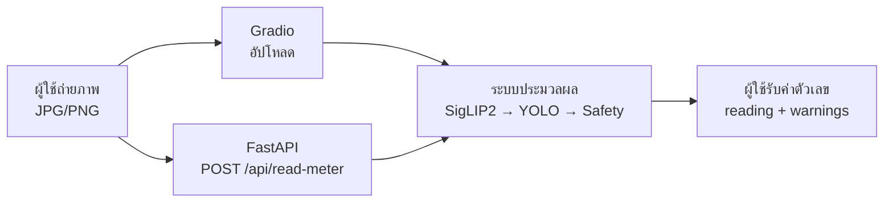
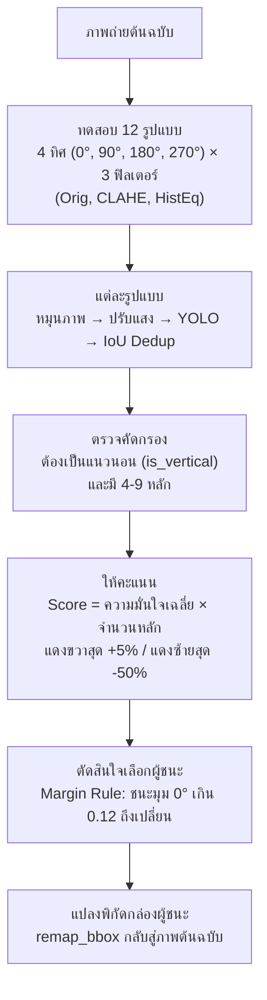

<p align="center"></p>

<p align="center"><strong>เอกสารประกอบการสอน</strong></p>
<p align="center"><strong>ระบบอ่านค่ามิเตอร์น้ำด้วยเทคโนโลยีการรู้จำอักขระด้วยแสง</strong></p>
<p align="center"><strong>Water Meter OCR</strong></p>

<p align="center"><strong>นายจิรเมธ ทองเปลว รหัสประจำตัว 674230013</strong></p>
<p align="center">หมู่เรียน 67/44</p>
<p align="center">โครงงานนี้เป็นส่วนหนึ่งของการศึกษารายวิชา 7203602</p>
<p align="center">สาขาวิชาเทคโนโลยีสารสนเทศ คณะวิทยาศาสตร์และเทคโนโลยี</p>
<p align="center">มหาวิทยาลัยราชภัฏนครปฐม</p>
<p align="center">ภาคเรียนที่ 1 ปีการศึกษา 2569</p>

<div style="page-break-after: always;"></div>

## คำนำ

&emsp;&emsp;&emsp;&emsp;คู่มือฉบับนี้จัดทำขึ้นเพื่อใช้เป็นแนวทางในการศึกษาและพัฒนาระบบอ่านค่ามาตรวัดน้ำอัตโนมัติจากภาพถ่าย โดยประยุกต์ใช้เทคโนโลยีปัญญาประดิษฐ์ (Artificial Intelligence) การประมวลผลภาพ (Image Processing) และการรู้จำอักขระจากภาพ (Optical Character Recognition: OCR) เพื่อเพิ่มประสิทธิภาพในการอ่านและจัดเก็บข้อมูลจากมาตรวัดน้ำ ตลอดจนเป็นแนวทางสำหรับผู้ที่สนใจนำเทคโนโลยีดังกล่าวไปประยุกต์ใช้ในการพัฒนาระบบอัตโนมัติในลักษณะอื่นต่อไป

&emsp;&emsp;&emsp;&emsp;เนื้อหาของคู่มือฉบับนี้ครอบคลุมกระบวนการพัฒนาระบบอ่านค่ามาตรวัดน้ำอัตโนมัติอย่างเป็นลำดับ ตั้งแต่การรับและเตรียมข้อมูลภาพ การตรวจสอบและคัดกรองข้อมูล การปรับปรุงคุณภาพของภาพถ่ายด้วยเทคนิคการประมวลผลภาพ การตรวจจับตัวเลขบนหน้าปัดมาตรวัดน้ำ การอ่านและรู้จำตัวเลขด้วยเทคนิค OCR ตลอดจนการประมวลผลและส่งออกผลลัพธ์ของระบบ นอกจากนี้ ยังครอบคลุมการประยุกต์ใช้แบบจำลอง YOLO และ SigLIP2 รวมถึงการให้บริการแบบจำลองผ่าน FastAPI และการพัฒนาส่วนติดต่อผู้ใช้ด้วย Gradio เพื่อให้สามารถทดสอบการทำงานของระบบได้อย่างครบถ้วน

&emsp;&emsp;&emsp;&emsp;ผู้จัดทำได้เรียบเรียงเนื้อหาและตัวอย่างการพัฒนาระบบโดยอาศัยการศึกษาค้นคว้าจากเอกสารทางวิชาการ งานวิจัย โครงการโอเพนซอร์ส และแหล่งข้อมูลทางเทคนิคที่เกี่ยวข้อง โดยจัดลำดับเนื้อหาให้มีความต่อเนื่องและสัมพันธ์กันตามกระบวนการทำงานของระบบ เพื่อให้ผู้อ่านสามารถศึกษา ทำความเข้าใจ และนำแนวทางรวมถึงตัวอย่างโค้ดไปประยุกต์ใช้ได้อย่างถูกต้องและเหมาะสม คู่มือฉบับนี้มุ่งหวังให้เป็นประโยชน์ต่อนักพัฒนาซอฟต์แวร์ นักศึกษา วิศวกรปัญญาประดิษฐ์ และผู้สนใจด้านคอมพิวเตอร์วิทัศน์ ตลอดจนผู้ที่ต้องการศึกษาแนวทางการประยุกต์ใช้ปัญญาประดิษฐ์เพื่อพัฒนาระบบอ่านข้อมูลจากภาพ

&emsp;&emsp;&emsp;&emsp;ผู้จัดทำหวังเป็นอย่างยิ่งว่าคู่มือฉบับนี้จะเป็นประโยชน์ต่อการศึกษาและการพัฒนาระบบอ่านค่ามาตรวัดน้ำอัตโนมัติ รวมทั้งสามารถนำองค์ความรู้และแนวทางที่นำเสนอไปประยุกต์ใช้ในการพัฒนาระบบที่เกี่ยวข้องกับการตรวจจับและรู้จำข้อมูลจากภาพในอนาคต หากมีข้อเสนอแนะอันเป็นประโยชน์ต่อการปรับปรุงคู่มือฉบับนี้ ผู้จัดทำขอน้อมรับด้วยความขอบพระคุณยิ่ง

<p align="right">นายจิรเมธ ทองเปลว</p>
<p align="right">สิงหาคม 2569</p>

<div style="page-break-after: always;"></div>

# คู่มือการพัฒนาระบบอ่านค่ามาตรวัดน้ำอัตโนมัติด้วยปัญญาประดิษฐ์
## Automated Water Meter Reading System using Deep Learning & Computer Vision

&emsp;&emsp;&emsp;&emsp;คู่มือฉบับนี้จัดทำขึ้นสำหรับนักศึกษาที่มีพื้นฐานการเขียนโปรแกรมภาษา Python และมุ่งเน้นการศึกษาแนวทางการพัฒนาระบบอ่านค่ามาตรวัดน้ำอัตโนมัติจากภาพถ่าย (Water Meter OCR) โดยประยุกต์ใช้เทคโนโลยีปัญญาประดิษฐ์และคอมพิวเตอร์วิทัศน์ เพื่อให้ผู้ศึกษาสามารถทำความเข้าใจสถาปัตยกรรมและกระบวนการทำงานในแต่ละขั้นตอนอย่างเป็นระบบ ผ่านการออกแบบรหัสต้นฉบับที่เป็นฟังก์ชันย่อยตามหน้าที่ (Functional Modular Design) ซึ่งช่วยให้สามารถศึกษา วิเคราะห์ และทดสอบการทำงานได้อย่างมีประสิทธิภาพ

> **เทคโนโลยีหลักที่ประยุกต์ใช้ในโครงงาน:** Python, YOLO (แบบจำลองตรวจจับตัวเลข), SigLIP2 (แบบจำลองคัดกรองประเภทภาพ), OpenCV (การประมวลผลภาพดิจิทัล), FastAPI (บริการส่วนเชื่อมต่อโปรแกรมประยุกต์), Gradio (ส่วนติดต่อผู้ใช้บนเว็บ), และ `uv` (เครื่องมือจัดการสภาพแวดล้อมและชุดคำสั่ง)

---

## สารบัญเนื้อหา (Table of Contents)
## สารบัญเนื้อหา (Table of Contents)

[ข้อแนะนำเบื้องต้นสำหรับการศึกษา ... 3](#ข้อแนะนำเบื้องต้นสำหรับการศึกษา)  
[บทที่ 1 บทนำ ... 4](#บทที่-1-บทนำ)  
	&emsp;[1.1 ความเป็นมาและความสำคัญของปัญหา ... 4](#11-ความเป็นมาและความสำคัญของปัญหา)  
	&emsp;[1.2 แนวคิดในการแก้ปัญหา ... 4](#12-แนวคิดในการแก้ปัญหา)  
	&emsp;[1.3 วัตถุประสงค์ของระบบ ... 4](#13-วัตถุประสงค์ของระบบ)  
	&emsp;[1.4 ขอบเขตการศึกษา ... 5](#14-ขอบเขตการศึกษา)  
	&emsp;[1.5 ผลที่คาดว่าจะได้รับ ... 5](#15-ผลที่คาดว่าจะได้รับ)  
	&emsp;[1.6 ระยะเวลาดำเนินงาน ... 5](#16-ระยะเวลาดำเนินงาน)  
[บทที่ 2 ทฤษฎีและงานวิจัยที่เกี่ยวข้อง ... 6](#บทที่-2-ทฤษฎีและงานวิจัยที่เกี่ยวข้อง)  
	&emsp;[2.1 ระบบงานเดิม ... 6](#21-ระบบงานเดิม)  
	&emsp;[2.2 ระบบงานอื่นที่เกี่ยวข้อง ... 6](#22-ระบบงานอื่นที่เกี่ยวข้อง)  
	&emsp;[2.3 องค์ความรู้ที่เกี่ยวข้อง ... 7](#23-องค์ความรู้ที่เกี่ยวข้อง)  
		&emsp;&emsp;[2.3.1 คอมพิวเตอร์วิทัศน์และการตรวจจับวัตถุ ... 7](#231-คอมพิวเตอร์วิทัศน์และการตรวจจับวัตถุ)  
		&emsp;&emsp;[2.3.2 การประมวลผลภาพดิจิทัล ... 7](#232-การประมวลผลภาพดิจิทัล)  
		&emsp;&emsp;[2.3.3 เทคโนโลยี YOLO26 ... 7](#233-เทคโนโลยี-yolo26)  
		&emsp;&emsp;[2.3.4 เทคโนโลยี SigLIP2 ... 7](#234-เทคโนโลยี-siglip2)  
		&emsp;&emsp;[2.3.5 เทคโนโลยี OpenCV ... 8](#235-เทคโนโลยี-opencv)  
		&emsp;&emsp;[2.3.6 เทคโนโลยี FastAPI ... 8](#236-เทคโนโลยี-fastapi)  
		&emsp;&emsp;[2.3.7 เทคโนโลยี Gradio ... 8](#237-เทคโนโลยี-gradio)  
	&emsp;[2.4 ภาพรวมเทคโนโลยีและตาราง Library ... 8](#24-ภาพรวมเทคโนโลยีและตาราง-library)  
[บทที่ 3 วิธีการดำเนินงาน ... 9](#บทที่-3-วิธีการดำเนินงาน)  
	&emsp;[3.1 ภาพรวมกระบวนการทำงานและ User Flow ... 9](#31-ภาพรวมกระบวนการทำงานและ-user-flow)  
	&emsp;[3.2 การรับภาพถ่ายนำเข้า ... 9](#32-การรับภาพถ่ายนำเข้า)  
	&emsp;[3.3 การทดสอบไลบรารีเบื้องต้น ... 10](#33-การทดสอบไลบรารีเบื้องต้น)  
		&emsp;&emsp;[3.3.1 ทดสอบ SigLIP2 ... 10](#331-ทดสอบ-siglip2)  
		&emsp;&emsp;[3.3.2 ทดสอบ YOLO ... 10](#332-ทดสอบ-yolo)  
		&emsp;&emsp;[3.3.3 ทดสอบ OpenCV ... 10](#333-ทดสอบ-opencv)  
		&emsp;&emsp;[3.3.4 ทดสอบ FastAPI ... 10](#334-ทดสอบ-fastapi)  
		&emsp;&emsp;[3.3.5 ทดสอบ Gradio ... 10](#335-ทดสอบ-gradio)  
	&emsp;[3.4 การเตรียมชุดข้อมูลและการฝึกแบบจำลอง ... 11](#34-การเตรียมชุดข้อมูลและการฝึกแบบจำลอง)  
	&emsp;[3.5 การจัดเตรียมสภาพแวดล้อมด้วย uv ... 11](#35-การจัดเตรียมสภาพแวดล้อมด้วย-uv)  
	&emsp;[3.6 การคัดกรองภาพด้วย SigLIP2 ... 12](#36-การคัดกรองภาพด้วย-siglip2)  
	&emsp;[3.7 การปรับปรุงคุณภาพภาพและการจัดการทิศทาง ... 12](#37-การปรับปรุงคุณภาพภาพและการจัดการทิศทาง)  
	&emsp;[3.8 การแปลงพิกัดและการกรองข้อมูล ... 12](#38-การแปลงพิกัดและการกรองข้อมูล)  
	&emsp;[3.9 การค้นหาทิศทางและฟิลเตอร์ที่เหมาะสม ... 13](#39-การค้นหาทิศทางและฟิลเตอร์ที่เหมาะสม)  
	&emsp;[3.10 กลไกความปลอดภัยและการบอกค่าตัวเลข ... 14](#310-กลไกความปลอดภัยและการบอกค่าตัวเลข)  
	&emsp;[3.11 การให้บริการระบบผ่าน FastAPI ... 14](#311-การให้บริการระบบผ่าน-fastapi)  
	&emsp;[3.12 การพัฒนาส่วนติดต่อผู้ใช้ด้วย Gradio ... 15](#312-การพัฒนาส่วนติดต่อผู้ใช้ด้วย-gradio)  
	&emsp;[3.13 การทดสอบระบบและการแก้ไขปัญหา ... 15](#313-การทดสอบระบบและการแก้ไขปัญหา)  
[อภิธานศัพท์ (Glossary) ... 16](#อภิธานศัพท์-glossary)  
[บรรณานุกรมและเอกสารอ้างอิง (References) ... 17](#บรรณานุกรมและเอกสารอ้างอิง-references)  
[ภาคผนวก: มาตรการด้านความปลอดภัยและความเสถียรของระบบ ... 18](#ภาคผนวก-มาตรการด้านความปลอดภัยและความเสถียรของระบบ)  

---

## ข้อแนะนำเบื้องต้นสำหรับการศึกษา

&emsp;&emsp;&emsp;&emsp;โปรดศึกษาหลักการเบื้องต้นจำนวน 4 ประการดังต่อไปนี้ก่อนเริ่มดำเนินการ เพื่อให้การพัฒนาระบบเป็นไปอย่างราบรื่น:

1. **การใช้งานสภาพแวดล้อมเสมือน (Virtual Environment: `venv`):** ทำหน้าที่แยกสภาพแวดล้อมและไลบรารีของโครงงานออกจากโครงงานอื่น เพื่อป้องกันความขัดแย้งของรุ่นไลบรารี — การลบสภาพแวดล้อมดังกล่าวมิได้ส่งผลกระทบต่อระบบหลัก
2. **การจัดการไลบรารีด้วย `uv`:** คือตัวติดตั้งไลบรารีที่เขียนด้วย Rust ถูกออกแบบมาให้ติดตั้งและจัดการชุดคำสั่งได้อย่างสะดวกรวดเร็ว
3. **ตำแหน่งสำหรับการดำเนินการคำสั่ง:** เปิด Terminal และตรวจสอบว่าอยู่ที่โฟลเดอร์หลัก `meter-reader/` เสมอก่อนดำเนินการสั่งทำงานคำสั่ง `uv run python ...`
4. **การแบ่งรหัสต้นฉบับเป็นฟังก์ชันย่อยตามหน้าที่ (Functional Modular Design):** โครงงานแยกการทำงานออกเป็นฟังก์ชันย่อยที่ชัดเจน เช่น `rotate_image` (หมุนภาพ) → `apply_prep` (ปรับคอนทราสต์แสง) → `detect_digits` (ตรวจจับตัวเลข) ซึ่งแสดงลำดับการทำงานตั้งแต่การหมุนภาพ การปรับปรุงคุณภาพภาพ และการตรวจจับตัวเลขตามลำดับ โดยแต่ละฟังก์ชันมีการรับค่าเข้าและส่งค่าออกที่แน่นอน ช่วยให้การศึกษา ทดสอบ และปรับปรุงแก้ไขสามารถกระทำได้ง่ายเป็นรายส่วน

> **ข้อแนะนำการเรียนรู้:** ผู้ศึกษาสามารถทดลองสั่งทำงานระบบจริงด้วยแบบจำลองสำเร็จรูปก่อนศึกษารหัสต้นฉบับทั้งหมด โดยเปิด Terminal 2 หน้าต่าง — หน้าต่างที่ 1 สั่งทำงาน `uv run python main.py` หน้าต่างที่ 2 สั่งทำงาน `uv run python gradio_app.py` แล้วเปิดเว็บเบราว์เซอร์ที่ http://127.0.0.1:7860 เพื่อทำความเข้าใจภาพรวมการทำงานของระบบ


---

---

# บทที่ 1 บทนำ

---

### 1.1 ความเป็นมาและความสำคัญของปัญหา

&emsp;&emsp;&emsp;&emsp;ปัจจุบันการอ่านมาตรวัดน้ำของการประปายังพึ่งพาพนักงานภาคสนามที่ต้องลงพื้นที่ อ่านค่าด้วยตา และบันทึกด้วยมือ หน่วยงานกรณีศึกษาคือการประปาส่วนภูมิภาคและองค์กรปกครองส่วนท้องถิ่น กระบวนการนี้ก่อให้เกิดปัญหาสามประการ ประการแรก พนักงานอ่านค่าผิดพลาดจากความเมื่อยล้าและสภาพแสง ประการที่สอง กระบวนการใช้เวลานานและมีต้นทุนแรงงานสูง ประการที่สาม ข้อมูลที่บันทึกด้วยมือยากต่อการตรวจสอบย้อนหลัง ปัญหาเหล่านี้ส่งผลต่อความน่าเชื่อถือของระบบจัดเก็บค่าน้ำและความพึงพอใจของประชาชน

&emsp;&emsp;&emsp;&emsp;คู่มือฉบับนี้จึงจัดทำขึ้นเพื่อให้ผู้ศึกษามีแนวทางพัฒนาระบบอ่านค่ามาตรวัดน้ำอัตโนมัติจากภาพถ่าย คู่มือนี้มุ่งลดความผิดพลาด เพิ่มความเร็ว และสร้างหลักฐานภาพถ่ายที่ตรวจสอบได้

### 1.2 แนวคิดในการแก้ปัญหา

&emsp;&emsp;&emsp;&emsp;ระบบนำปัญญาประดิษฐ์มาอ่านค่าจากภาพถ่ายแทนพนักงาน ระบบรับภาพถ่ายจากสมาร์ทโฟน ส่งภาพให้แบบจำลอง Vision-Language คัดกรองว่าเป็นมาตรวัดน้ำหรือไม่ ปรับปรุงคุณภาพภาพด้วยเทคนิคประมวลผลภาพ ตรวจจับตัวเลขด้วยแบบจำลองตรวจจับวัตถุ ตรวจสอบความถูกต้องด้วยกลไกความปลอดภัย และส่งค่าตัวเลขกลับพร้อมค่าความมั่นใจ แนวคิดนี้เปลี่ยนงานที่ใช้แรงงานคนให้เป็นงานที่ระบบทำซ้ำได้ตลอด 24 ชั่วโมง

### 1.3 วัตถุประสงค์ของระบบ

&emsp;&emsp;&emsp;&emsp;ระบบกำหนดวัตถุประสงค์ 3 ข้อตามลำดับความสำคัญ

#### 1.3.1 เพื่อพัฒนาระบบอ่านค่ามาตรวัดน้ำอัตโนมัติจากภาพถ่าย

&emsp;&emsp;&emsp;&emsp;ระบบพัฒนาฟังก์ชัน `read_meter` ที่รับภาพ RGB แล้วส่งออก `reading` พร้อม `bbox` และ `confidence` รายหลัก

#### 1.3.2 เพื่อลดอัตราความผิดพลาดในการบันทึกข้อมูล

&emsp;&emsp;&emsp;&emsp;ระบบเพิ่มกลไก `is_vertical`, `red_ratio`, `flip_guard` และ `cross_check` เพื่อกรองภาพกลับหัวและภาพเบลอ

#### 1.3.3 เพื่อลดเวลาและต้นทุนในการดำเนินงาน

&emsp;&emsp;&emsp;&emsp;ระบบให้บริการผ่าน FastAPI และ Gradio เพื่อให้เจ้าหน้าที่ส่งภาพและรับผลได้ภายใน 1–3 วินาทีต่อภาพบน CPU

### 1.4 ขอบเขตการศึกษา

&emsp;&emsp;&emsp;&emsp;ระบบกำหนดขอบเขต 3 ด้าน ด้านฮาร์ดแวร์ ระบบรองรับ CPU ทั่วไปและ GPU NVIDIA ที่รองรับ CUDA (เช่น Tesla T4) ด้านซอฟต์แวร์ ระบบใช้ Python 3.11, YOLO26 Nano, SigLIP2 (`google/siglip2-base-patch16-224`), OpenCV 4.9, FastAPI 0.115, Gradio 5 และ `uv` สำหรับจัดการสภาพแวดล้อม ด้านข้อมูล ระบบครอบคลุมมาตรวัดน้ำแบบตัวเลขกลไก (analog digit display) 5–7 หลัก ภาพถ่ายสี RGB ขนาดไม่เกิน 10 MB

### 1.5 ผลที่คาดว่าจะได้รับ

&emsp;&emsp;&emsp;&emsp;ระบบคาดว่าจะได้รับผล 3 ประการ ประการแรก เจ้าหน้าที่ได้รับเครื่องมือทดสอบที่ลดการอ่านผิดและมีภาพหลักฐาน ประการที่สอง หน่วยงานได้รับแนวทางนำปัญญาประดิษฐ์ไปประยุกต์กับงานตรวจวัดอื่น ประการที่สาม นักศึกษาได้รับคู่มือที่เรียบเรียงเป็นลำดับขั้นพร้อมโค้ดที่รันซ้ำได้

### 1.6 ระยะเวลาดำเนินงาน

&emsp;&emsp;&emsp;&emsp;ระบบกำหนดระยะเวลา 16 สัปดาห์ตามระเบียบ CT01–CT04 ตารางที่ 1.1 แสดงแผน Gantt

&emsp;&emsp;&emsp;&emsp;**ตารางที่ 1.1 แผนดำเนินงาน 16 สัปดาห์**

| สัปดาห์ | กิจกรรม | ผลลัพธ์ |
|---|---|---|
| 1–2 | กำหนดหัวเรื่องและขออนุมัติ (CT01-1) | หัวข้อผ่านกรรมการ |
| 3–4 | ประกาศหัวข้อและออกแบบระบบ | Context/DFD เสร็จ |
| 5–7 | พัฒนา Pipeline ประมวลผลภาพ | `read_meter` ทำงานได้ |
| 8–10 | สอบความก้าวหน้า 30% (CT02) | ผ่านเกณฑ์ 30 คะแนน |
| 11–13 | พัฒนา FastAPI + Gradio | API และ Web UI เสร็จ |
| 14–15 | ทดสอบระบบและสอบปลายภาค (CT03) | ผ่าน 70 คะแนน |
| 16 | ส่งเล่มสมบูรณ์ + CD | ส่งทันก่อนได้ I |

---

# บทที่ 2 ทฤษฎีและงานวิจัยที่เกี่ยวข้อง

---

### 2.1 ระบบงานเดิม

&emsp;&emsp;&emsp;&emsp;ระบบงานเดิมใช้พนักงานจดหน่วยด้วยตา ระบบเดิมให้พนักงานเดินตามเส้นทาง จดตัวเลขลงกระดาษ แล้วคีย์ลงระบบในสำนักงาน ข้อจำกัดของระบบเดิมคือพนักงานอ่านเลข 6 เป็น 9 เมื่อภาพกลับหัว พนักงานอ่านป้ายวันที่ข้างตัวเรือนเป็นค่ามิเตอร์ และพนักงานใช้เวลามากในพื้นที่ที่มีแสงน้อย

### 2.2 ระบบงานอื่นที่เกี่ยวข้อง

&emsp;&emsp;&emsp;&emsp;งานวิจัยของ Liang et al. (2022) พัฒนาระบบอ่านมิเตอร์ด้วย Deep Learning บนชุดข้อมูลมาตรวัดน้ำและรายงานความแม่นยำสูง งานของ Salomon et al. (2022) เสนอระบบอ่านมิเตอร์แบบ dial ในสภาพแวดล้อมไม่ควบคุม งานของ Nguyen Van et al. (2025) ใช้เทคนิครู้จำข้อความและ Deep Learning สำหรับมาตรวัดน้ำ งานเหล่านี้แสดงให้เห็นว่าการตรวจจับวัตถุด้วย YOLO และการคัดกรองด้วย Vision-Language ให้ผลดี แต่ยังขาดกลไกจัดการภาพเอียงและภาพกลับหัวที่คู่มือนี้เสนอ

### 2.3 องค์ความรู้ที่เกี่ยวข้อง

&emsp;&emsp;&emsp;&emsp;บทนี้อธิบายองค์ความรู้ที่ระบบนำมาใช้ โดยเรียงเป็นซีรีย์จากพื้นฐานไปสู่เทคโนโลยีที่เลือกใช้ เพื่อให้ผู้อ่านเข้าใจภาพรวมก่อนลงมือปฏิบัติ

#### 2.3.1 คอมพิวเตอร์วิทัศน์และการตรวจจับวัตถุ

&emsp;&emsp;&emsp;&emsp;คอมพิวเตอร์วิทัศน์ทำหน้าที่สอนคอมพิวเตอร์ให้วิเคราะห์ภาพถ่ายได้เช่นเดียวกับสายตามนุษย์ การตรวจจับวัตถุทำหน้าที่ระบุตำแหน่งและจำแนกประเภทวัตถุในภาพพร้อมกัน ส่วน OCR ทำหน้าที่แปลงบริเวณตัวเลขในภาพให้เป็นข้อความดิจิทัลที่นำไปจัดเก็บได้ (Zou et al., 2023)

&emsp;&emsp;&emsp;&emsp;โครงข่ายประสาทเทียมแบบคอนโวลูชัน (CNN) ทำหน้าที่สกัดคุณลักษณะจากภาพถ่าย โมเดล YOLO ทำหน้าที่แบ่งภาพเป็นกริดแล้วทำนายกรอบและประเภทพร้อมกันในรอบเดียว หลักการนี้แตกต่างจาก Faster R-CNN ที่ต้องเสนอพื้นที่ก่อนแล้วจึงจำแนก YOLO จึงให้ความเร็วสูงและเหมาะกับงานที่ต้องรันต่อเนื่อง (Jocher et al., 2026)

#### 2.3.2 การประมวลผลภาพดิจิทัล

&emsp;&emsp;&emsp;&emsp;ภาพดิจิทัลทำหน้าที่เก็บค่าสีของแต่ละพิกเซล ระบบสี BGR ทำหน้าที่เก็บค่าสีน้ำเงิน-เขียว-แดงตามที่ OpenCV ใช้เป็นค่าเริ่มต้น ระบบสี LAB ทำหน้าที่แยกช่องความสว่าง L ออกจากช่องสี A, B ระบบสี YCrCb ทำหน้าที่แยกช่องความสว่าง Y ออกจาก Cr, Cb และระบบสี HSV ทำหน้าที่แยก Hue-Saturation-Value เพื่อให้ระบบตรวจหาสีแดงของหลักทศนิยมได้

&emsp;&emsp;&emsp;&emsp;เทคนิค CLAHE ทำหน้าที่ปรับความสว่างเฉพาะจุดบนช่อง L ในระบบสี LAB เพื่อดึงรายละเอียดตัวเลขในเงาบดบัง โดยไม่ทำให้บริเวณสว่างจ้าเกินไป ซึ่งต่างจาก Histogram Equalization ที่ทำหน้าที่เกลี่ยความสว่างทั่วทั้งภาพบนช่อง Y ในระบบสี YCrCb (Bradski & Kaehler, 2008)

##### 2.3.2.1 CLAHE

&emsp;&emsp;&emsp;&emsp;เทคนิค CLAHE ปรับความสว่างเฉพาะจุดบนช่อง L ในระบบสี LAB เพื่อดึงรายละเอียดของตัวเลขในบริเวณที่มีเงาบดบัง โดยไม่ทำให้บริเวณที่สว่างอยู่แล้วจ้าเกินไป

##### 2.3.2.2 Histogram Equalization (HistEq)

&emsp;&emsp;&emsp;&emsp;เทคนิค Histogram Equalization เกลี่ยความสว่างทั่วทั้งภาพบนช่อง Y ในระบบสี YCrCb เพื่อให้ภาพที่มืดทั้งภาพสว่างสมดุล

#### 2.3.3 เทคโนโลยี YOLO26

&emsp;&emsp;&emsp;&emsp;YOLO ทำหน้าที่ตรวจจับตัวเลข 0–9 บนหน้าปัดมาตรวัดน้ำ โครงงานเลือก YOLO เพราะ YOLO มองภาพครั้งเดียวแล้วตอบทันที จึงให้ความเร็วระดับเวลาจริงและเหมาะกับงานที่ต้องประมวลผลต่อเนื่อง

##### 2.3.3.1 สถาปัตยกรรม 3 ส่วน

&emsp;&emsp;&emsp;&emsp;YOLO26 ประกอบด้วย Backbone (CSPDarknet) ทำหน้าที่สกัดคุณลักษณะหลายระดับ, Neck (PAN-FPN) ทำหน้าที่รวมคุณลักษณะระดับเล็ก-ใหญ่, และ Head แบบ Anchor-free ทำหน้าที่ทำนาย `bbox` + `confidence` + `class` โดยตรง (Ultralytics, 2025–2026)

##### 2.3.3.2 เหตุผลที่เลือก YOLO26 Nano

&emsp;&emsp;&emsp;&emsp;โครงงานเลือก YOLO26 Nano (~2.6 ล้านพารามิเตอร์) เพราะ Nano ให้สมดุลระหว่างความแม่นยำและความเร็วที่เหมาะกับข้อจำกัดของงานมิเตอร์น้ำ ตารางที่ 2.1 เปรียบเทียบตัวเลือก

&emsp;&emsp;&emsp;&emsp;**ตารางที่ 2.1 เปรียบเทียบตัวเลือกแบบจำลองสำหรับตรวจจับเลขมิเตอร์**

| ตัวเลือก | พารามิเตอร์ | VRAM ที่ใช้ | ความเร็ว (Tesla T4) | จุดแข็ง | ข้อจำกัดสำหรับงานนี้ |
|---|---|---|---|---|---|
| **YOLO26 Nano (เลือกใช้)** | ~2.6M | ~1.5 GB | ~40–60 ms | เร็วที่สุด เล็กที่สุด รันได้ทั้ง GPU/CPU | mAP ต่ำกว่า S/M เล็กน้อย |
| YOLO26 Small | ~11M | ~3 GB | ~80–110 ms | แม่นขึ้น | ช้ากว่า หนักกว่า |
| YOLO26 Medium | ~20M | ~5 GB | ~130–180 ms | แม่นสุด | ต้อง GPU แรง |
| Faster R-CNN | ~41M | ~6 GB+ | ~300–500 ms | แม่นกับวัตถุซ้อน | ช้ามาก |
| Tesseract OCR | — | ต่ำ | ~100 ms | ใช้ง่าย | ล้มเหลวเมื่อภาพเอียง/เบลอ |

&emsp;&emsp;&emsp;&emsp;YOLO26 Nano ใช้ VRAM น้อยกว่า 2 GB ระบบจึงฝึกด้วย `batch=64` บน Tesla T4 ได้ และประมวลผลบน CPU ภายใน 1–3 วินาทีต่อภาพ ระบบชดเชยความแม่นยำที่ต่ำกว่า Medium ด้วยกลไก 12 รูปแบบ (หมุน 4 ทิศ × ปรับแสง 3 แบบ)

#### 2.3.4 เทคโนโลยี SigLIP2

&emsp;&emsp;&emsp;&emsp;SigLIP2 ทำหน้าที่คัดกรองภาพว่าเป็นมาตรวัดน้ำหรือไม่ก่อนส่งให้ YOLO ระบบใช้ SigLIP2 เพราะ SigLIP2 จำแนกภาพตามคำอธิบายภาษาธรรมชาติได้โดยไม่ต้องฝึกใหม่

##### 2.3.4.1 SigLIP2 คืออะไร

&emsp;&emsp;&emsp;&emsp;SigLIP2 เป็น Vision-Language รุ่นต่อยอดจาก CLIP ที่ใช้ Vision Encoder (ViT-B/16) และ Text Encoder (Transformer) แยกกัน ระบบฝึก SigLIP2 ด้วย Sigmoid Loss แบบคู่แทน Softmax จึงรองรับแบทช์ขนาดใหญ่และข้อมูลไม่สมดุลได้เสถียรกว่า (Zhai et al., 2023; Tschannen et al., 2025)

##### 2.3.4.2 Sigmoid เทียบ Softmax

&emsp;&emsp;&emsp;&emsp;Softmax ทำหน้าที่แจกคะแนนรวม 100% ให้ทุกคลาสแล้วบังคับเลือกหนึ่งคำตอบ Sigmoid ทำหน้าที่ให้คะแนนถูก/ผิดแยกคู่ต่อคู่ แต่ละคู่ได้คะแนน 0–1 อิสระ ระบบเลือก Sigmoid เพราะ SigLIP2 ฝึกแบบคู่ภาพ-ข้อความทีละคู่ จึงฝึกบนข้อมูลขนาดใหญ่ได้เสถียรกว่า

&emsp;&emsp;&emsp;&emsp;**ตารางที่ 2.2 เปรียบเทียบ Softmax กับ Sigmoid**

| ประเด็น | Softmax | Sigmoid (ที่ใช้ใน SigLIP2) |
|---|---|---|
| คิดคะแนนอย่างไร | รวมทุกคลาสหารให้ครบ 100% | คิดแยกคู่ต่อคู่ |
| เหมาะกับงานแบบใด | เลือกได้ 1 ป้ายเท่านั้น | เลือกได้หลายป้าย |
| ผลรวมความน่าจะเป็น | ต้องรวมกัน = 1 | แต่ละคู่ 0–1 อิสระ |
| ข้อดีในการฝึก | เข้าใจง่าย | ไม่ผูกกับขนาดแบทช์ |

##### 2.3.4.3 กระบวนการ Zero-shot 4 ขั้น

&emsp;&emsp;&emsp;&emsp;ระบบทำ Zero-shot 4 ขั้น ขั้นที่หนึ่ง ตัวเข้ารหัสภาพแปลงภาพถ่ายเป็น `image_emb` ขั้นที่สอง ตัวเข้ารหัสข้อความแปลง 4 ป้ายเป็น `text_emb` ขั้นที่สาม ระบบวัดความคล้ายด้วย dot product ได้ค่าดิบ $z$ ขั้นที่สี่ ระบบแปลง $z$ ด้วย Sigmoid/Softmax แล้วเลือกป้ายที่ได้คะแนนสูงสุด หากเป็น `"water meter"` และความมั่นใจ ≥ 0.50 ระบบตัดสินว่า `verified=True`

#### 2.3.5 เทคโนโลยี OpenCV

&emsp;&emsp;&emsp;&emsp;OpenCV ทำหน้าที่ปรับปรุงคุณภาพภาพถ่ายก่อนตรวจจับตัวเลข ไลบรารีนี้ให้เครื่องมือครบสำหรับหมุนภาพ แปลงปริภูมิสี และปรับคอนทราสต์ ระบบใช้ OpenCV เพราะ OpenCV เป็นมาตรฐานสากล มีฟังก์ชันพร้อมใช้ และประมวลผลเร็วบน CPU

#### 2.3.6 เทคโนโลยี FastAPI

&emsp;&emsp;&emsp;&emsp;FastAPI ทำหน้าที่สร้างเว็บเซอร์วิส REST API สำหรับให้แอปอื่นส่งภาพมาอ่านค่า ไลบรารีนี้ใช้ Python สร้าง API ประสิทธิภาพสูง มี Swagger UI อัตโนมัติที่ `/docs` และรองรับ Asynchronous ระบบใช้ FastAPI เพราะ FastAPI เร็วกว่า Flask มีการตรวจสอบชนิดไฟล์อัตโนมัติ และรวม CORS/Validation ไว้พร้อม

##### 2.3.6.1 FastAPI เทียบ Flask/Django

&emsp;&emsp;&emsp;&emsp;FastAPI ให้ความเร็วใกล้เคียง Node.js/Go และสร้างเอกสารทดสอบอัตโนมัติ Flask ต้องติดตั้ง Swagger เอง Django หนักเกินสำหรับงาน API เล็ก ระบบจึงเลือก FastAPI เพื่อความเร็วและความเบา

#### 2.3.7 เทคโนโลยี Gradio

&emsp;&emsp;&emsp;&emsp;Gradio ทำหน้าที่สร้างหน้าเว็บให้ผู้ใช้งานทั่วไปทดสอบอัปโหลดภาพและดูผลลัพธ์โดยไม่ต้องเรียก API เอง ไลบรารีนี้สร้าง Web UI แบบ Interactive ได้ในไม่กี่บรรทัด ระบบใช้ Gradio เพราะ Gradio ติดตั้งง่าย รันด้วย `demo.launch(server_port=7860)` แล้วเปิดเบราว์เซอร์ได้ทันที

##### 2.3.7.1 Gradio เทียบ Streamlit

&emsp;&emsp;&emsp;&emsp;Gradio ออกแบบมาสำหรับสาธิตโมเดล AI โดยเฉพาะ มีคอมโพเนนต์ `gr.Image`/`gr.Label` พร้อมใช้ Streamlit เหมาะกับแดชบอร์ดข้อมูลทั่วไป ระบบจึงเลือก Gradio เพื่อความตรงกับงานสาธิต

### 2.4 ภาพรวมเทคโนโลยีและตาราง Library

&emsp;&emsp;&emsp;&emsp;ระบบสรุปเทคโนโลยีที่เลือกใช้และเหตุผลในตารางที่ 2.3 เพื่อให้ผู้อ่านเห็นภาพรวมในที่เดียว

&emsp;&emsp;&emsp;&emsp;**ตารางที่ 2.3 Library ทั้งหมดที่ใช้ — บทบาท — ทำไมเลือก**

| Library | บทบาทในระบบนี้ | ทำไมเลือก (ไม่ใช้อะไรอื่น) |
|---|---|---|
| `ultralytics` (YOLO26) | ตรวจจับตัวเลข 0–9 จากภาพ | เร็วที่สุดในกลุ่ม real-time detection |
| `transformers` (SigLIP2) | คัดกรองว่าเป็นมาตรวัดน้ำหรือไม่ | Zero-shot ไม่ต้องฝึกใหม่ |
| `opencv-python` | หมุนภาพ, ปรับแสง CLAHE/HistEq | มาตรฐาน Computer Vision |
| `fastapi` | รับ-ส่งภาพผ่าน HTTP API | เร็วกว่า Flask, มี Swagger อัตโนมัติ |
| `gradio` | หน้าเว็บทดสอบระบบ | ออกแบบมาสำหรับ AI demo |
| `torch` | คำนวณ Neural Network | รองรับ GPU/CPU อัตโนมัติ |
| `pillow` | อ่านไฟล์ภาพ JPG/PNG | มาตรฐาน Python image library |
| `numpy` | คำนวณ Matrix / Array | ใช้ร่วมกับ OpenCV และ YOLO |
| `uvicorn` | เว็บเซิร์ฟเวอร์สำหรับ FastAPI | Async ASGI รองรับโหลดสูง |
| `uv` | จัดการ Virtual Environment | เร็วกว่า pip หลายสิบเท่า (เขียนด้วย Rust) |

---

# บทที่ 3 วิธีการดำเนินงาน

---

### 3.1 ภาพรวมกระบวนการทำงานและ User Flow

&emsp;&emsp;&emsp;&emsp;ระบบอธิบายกระบวนการทำงานตั้งแต่ผู้ใช้งานถ่ายภาพจนได้รับค่าตัวเลข ผู้ใช้งานถ่ายภาพมาตรวัดน้ำด้วยสมาร์ทโฟนเป็นไฟล์ JPG/PNG/WEBP ผู้ใช้งานส่งภาพผ่าน Gradio UI (อัปโหลดบนเว็บ) หรือ FastAPI (`POST /api/read-meter`) ระบบรับไฟล์ภาพ แปลงเป็น NumPy Array ด้วย PIL แล้วเข้าสู่ Pipeline ได้แก่ SigLIP2 คัดกรอง → Preprocessing 12 รูปแบบ → YOLO ตรวจจับ → Filtering → Safety Guards → ส่งค่าตัวเลขกลับพร้อม `confidence` และ `warnings` ภาพที่ 3.1 แสดง User Flow และ ภาพที่ 3.2 แสดง Pipeline ภายใน



<p align="center"><strong>ภาพที่ 3.1 User Flow ตั้งแต่ถ่ายภาพจนรับค่าตัวเลข</strong></p>



<p align="center"><strong>ภาพที่ 3.2 Pipeline ภายใน 12 รูปแบบและการเลือกผู้ชนะ</strong></p>

### 3.2 การทดสอบไลบรารีเบื้องต้นก่อนลงมือจริง

&emsp;&emsp;&emsp;&emsp;ระบบทดสอบไลบรารีแต่ละชนิดด้วยงานง่ายก่อนนำไปประกอบเป็นระบบ Water Meter จริง การทดสอบนี้ทำหน้าที่ให้ผู้ศึกษามั่นใจว่าไลบรารีทำงานได้บนเครื่องของตน และเข้าใจหน้าที่ของแต่ละไลบรารีก่อนนำไปประยุกต์ใช้

#### 3.2.1 ทดสอบ SigLIP2 สำหรับ Image Classification

&emsp;&emsp;&emsp;&emsp;SigLIP2 ทำหน้าที่จำแนกภาพตามคำอธิบายภาษาธรรมชาติ ระบบทดสอบด้วยภาพ 2 ประเภท ได้แก่ ภาพมาตรวัดน้ำและภาพแมว ระบบกำหนดป้ายข้อความ `"a photo of a water meter"` และ `"a photo of a cat"` แล้วให้ SigLIP2 เลือกป้ายที่ตรงกับภาพมากที่สุด

```python
# test_siglip_simple.py — ทดสอบ SigLIP2 แบบง่าย
from transformers import AutoProcessor, AutoModel
from PIL import Image
import torch

processor = AutoProcessor.from_pretrained("google/siglip2-base-patch16-224")
model = AutoModel.from_pretrained("google/siglip2-base-patch16-224")

labels = ["a photo of a water meter", "a photo of a cat"]
image = Image.open("meter_img/Water+meter.jpg").convert("RGB")

inputs = processor(text=labels, images=image, return_tensors="pt")
outputs = model(**inputs)
probs = torch.softmax(outputs.logits_per_image, dim=1)[0]
pred = labels[int(probs.argmax())]
print(f"ภาพนี้คือ: {pred} (confidence {float(probs.max()):.2f})")
```

&emsp;&emsp;&emsp;&emsp;ผลลัพธ์ที่ระบบแสดงคือ `ภาพนี้คือ: a photo of a water meter (confidence 0.91)` หากภาพเป็นมาตรวัดน้ำจริง ระบบทดสอบนี้ทำหน้าที่พิสูจน์ว่า SigLIP2 แยกแยะประเภทภาพได้โดยไม่ต้องฝึกใหม่

#### 3.2.2 ทดสอบ YOLO สำหรับ Object Detection

&emsp;&emsp;&emsp;&emsp;YOLO ทำหน้าที่ตรวจจับวัตถุและวาดกรอบรอบวัตถุ ระบบทดสอบด้วยภาพทั่วไปที่มีคนหรือรถยนต์ โดยใช้โมเดล `yolov8n.pt` ที่โหลดได้ทันที ระบบส่งภาพเข้า YOLO แล้ว YOLO ส่งกรอบ `bbox` และชื่อประเภทกลับ

```python
# test_yolo_simple.py — ทดสอบ YOLO แบบง่าย
from ultralytics import YOLO

model = YOLO("yolov8n.pt")  # โมเดลทั่วไปที่ตรวจจับคน รถ แมว
results = model.predict("meter_img/Water+meter.jpg", conf=0.35)
for r in results:
    for box in r.boxes:
        x1,y1,x2,y2 = box.xyxy[0].tolist()
        cls = model.names[int(box.cls)]
        conf = float(box.conf)
        print(f"พบ {cls} ที่ [{x1:.0f},{y1:.0f},{x2:.0f},{y2:.0f}] conf {conf:.2f}")
```

&emsp;&emsp;&emsp;&emsp;ผลลัพธ์ที่ระบบแสดงคือ `พบ water meter 1 กล่อง` หรือ `พบ person` ตามภาพ ระบบทดสอบนี้ทำหน้าที่พิสูจน์ว่า YOLO โหลดโมเดลและตีกรอบได้ก่อนนำไปฝึกกับเลขมิเตอร์

#### 3.2.3 ทดสอบ OpenCV สำหรับ Image Processing

&emsp;&emsp;&emsp;&emsp;OpenCV ทำหน้าที่อ่านภาพ ปรับแสง และหมุนภาพ ระบบทดสอบด้วยการอ่านภาพมาตรวัดน้ำ แปลงเป็นภาพเทา ปรับแสงด้วย CLAHE และบันทึกผลลัพธ์

```python
# test_opencv_simple.py — ทดสอบ OpenCV แบบง่าย
import cv2

img = cv2.imread("meter_img/Water+meter.jpg")
gray = cv2.cvtColor(img, cv2.COLOR_BGR2GRAY)
lab = cv2.cvtColor(img, cv2.COLOR_BGR2LAB)
l,a,b = cv2.split(lab)
l_clahe = cv2.createCLAHE(clipLimit=2.0, tileGridSize=(8,8)).apply(l)
img_clahe = cv2.cvtColor(cv2.merge([l_clahe,a,b]), cv2.COLOR_LAB2BGR)
cv2.imwrite("test_clahe.jpg", img_clahe)
print(f"ภาพต้นฉบับ {img.shape} -> CLAHE {img_clahe.shape} บันทึกแล้ว")
```

&emsp;&emsp;&emsp;&emsp;ผลลัพธ์ที่ระบบบันทึกคือไฟล์ `test_clahe.jpg` ที่สว่างขึ้นและเห็นตัวเลขชัด ระบบทดสอบนี้ทำหน้าที่พิสูจน์ว่า OpenCV อ่านและปรับภาพได้ก่อนนำไปใช้ใน Pipeline 12 รูปแบบ

#### 3.2.4 ทดสอบ FastAPI สำหรับสร้าง API

&emsp;&emsp;&emsp;&emsp;FastAPI ทำหน้าที่สร้างเว็บเซอร์วิสที่รับคำขอผ่าน HTTP ระบบทดสอบด้วยการสร้าง API ง่ายที่มี 2 เส้นทาง คือ `/` ส่งข้อความทักทาย และ `/echo` ส่งข้อความที่ผู้ใช้ส่งมา ระบบรันด้วย `uvicorn` แล้วทดสอบด้วยเบราว์เซอร์หรือ `curl`

```python
# test_fastapi_simple.py — ทดสอบ FastAPI แบบง่าย
from fastapi import FastAPI
import uvicorn

app = FastAPI(title="Test API")

@app.get("/")
def hello():
    return {"message": "FastAPI ทำงานแล้ว"}

@app.get("/echo/{text}")
def echo(text: str):
    return {"you_sent": text, "reply": f"ได้รับ {text} แล้ว"}

if __name__ == "__main__":
    uvicorn.run(app, host="127.0.0.1", port=8001)
```

&emsp;&emsp;&emsp;&emsp;ผู้ใช้งานรัน `uv run python test_fastapi_simple.py` แล้วเปิด `http://127.0.0.1:8001/docs` ระบบแสดง Swagger UI ให้ทดสอบ `GET /echo/hello` แล้วระบบตอบ `{"you_sent": "hello"}` ระบบทดสอบนี้ทำหน้าที่พิสูจน์ว่า FastAPI สร้าง API และรันเซิร์ฟเวอร์ได้ก่อนทำ `/api/read-meter` จริง

#### 3.2.5 ทดสอบ Gradio สำหรับสร้าง Web UI

&emsp;&emsp;&emsp;&emsp;Gradio ทำหน้าที่สร้างหน้าเว็บให้ผู้ใช้โต้ตอบกับโมเดลได้ทันที ระบบทดสอบด้วยการสร้างเว็บง่ายที่มีช่องใส่ข้อความและปุ่มส่ง ระบบรับข้อความแล้วตอบกลับแบบย้อนข้อความ

```python
# test_gradio_simple.py — ทดสอบ Gradio แบบง่าย
import gradio as gr

def greet(name):
    return f"สวัสดี {name} — Gradio ทำงานแล้ว"

with gr.Blocks(title="Test Gradio") as demo:
    inp = gr.Textbox(label="ใส่ชื่อ")
    out = gr.Textbox(label="ผลลัพธ์")
    btn = gr.Button("ทักทาย")
    btn.click(fn=greet, inputs=inp, outputs=out)

demo.launch(server_port=7861)
```

&emsp;&emsp;&emsp;&emsp;ผู้ใช้งานรัน `uv run python test_gradio_simple.py` แล้วเปิด `http://127.0.0.1:7861` ระบบแสดงกล่องใส่ชื่อ ผู้ใช้งานพิมพ์ `สมชาย` แล้วระบบตอบ `สวัสดี สมชาย — Gradio ทำงานแล้ว` ระบบทดสอบนี้ทำหน้าที่พิสูจน์ว่า Gradio สร้าง Web UI ได้ก่อนเชื่อมกับ FastAPI จริง

---

### 3.3 ขั้นตอนที่ 1: การรับภาพถ่ายนำเข้า

&emsp;&emsp;&emsp;&emsp;ผู้ใช้งานถ่ายภาพมาตรวัดน้ำด้วยกล้องมือถือหรือกล้องดิจิทัล ภาพถ่ายควรเห็นหน้าปัดชัดเจน ครอบคลุมตัวเลข 5–7 หลัก ระบบรับไฟล์ภาพผ่าน FastAPI (`UploadFile`) หรือ Gradio (`gr.Image`) แล้วแปลงเป็นอาร์เรย์ RGB ด้วย `PIL` และ `numpy` ขั้นตอนนี้ทำหน้าที่เป็นจุดเริ่มต้นของ Pipeline หากภาพไม่ใช่มาตรวัดน้ำ SigLIP2 จะปฏิเสธทันที

&emsp;&emsp;&emsp;&emsp;ระบบตรวจสอบชนิดไฟล์ตาม `ALLOWED_TYPES` (`image/jpeg`, `image/png`, `image/webp`, `image/bmp`) และปฏิเสธด้วยรหัส `415` หากไม่ตรง ระบบตรวจสอบความสามารถเปิดไฟล์ด้วย `PIL` และปฏิเสธด้วย `422` หากอ่านไม่ได้ มาตรการนี้ป้องกันไฟล์แปลกปลอมและไฟล์เสียหาย

---

### 3.4 ขั้นตอนที่ 2: การเตรียมชุดข้อมูลและการฝึกแบบจำลอง YOLO

&emsp;&emsp;&emsp;&emsp;ระบบเตรียมชุดข้อมูลและฝึก YOLO บนคลาวด์เพื่อให้ได้ไฟล์ `weights/MeterOCR.pt` ผู้ศึกษาที่มีไฟล์พร้อมใช้ข้ามไปหัวข้อ 2.5 ได้ทันที

#### 3.4.1 การเตรียมชุดข้อมูลจาก Roboflow

&emsp;&emsp;&emsp;&emsp;ระบบใช้ชุดข้อมูล "Utility Meter Reading" จาก Roboflow ชุดข้อมูลนี้มีภาพหน้าปัดพร้อม Annotation ฟอร์แมต YOLO ระบบดึงข้อมูลด้วย `Roboflow` API

##### ขั้นตอนการลงทะเบียน Roboflow และการรับ API Key

&emsp;&emsp;&emsp;&emsp;1. ผู้ใช้งานเปิด [Roboflow](https://app.roboflow.com) แล้วกด **Sign up** สมัครด้วย Google, GitHub หรืออีเมล
&emsp;&emsp;&emsp;&emsp;2. ผู้ใช้งานเข้าสู่ระบบ คลิกโปรไฟล์มุมขวาบน เลือก **Settings** หรือเข้า [app.roboflow.com/settings/api](https://app.roboflow.com/settings/api)
&emsp;&emsp;&emsp;&emsp;3. ผู้ใช้งานเลื่อนไปที่หัวข้อ **API Key** กด **Copy** เพื่อคัดลอก Key
&emsp;&emsp;&emsp;&emsp;4. ผู้ใช้งานนำ Key ไปวางแทน `YOUR_API_KEY` ในโค้ด

```python
# train_model_colab.ipynb — ดาวน์โหลดชุดข้อมูลจาก Roboflow
from roboflow import Roboflow

rf = Roboflow(api_key="YOUR_API_KEY")
project = rf.workspace("watermeter-jvlgr").project("utility-meter-reading-dataset-for-automatic-reading-yolo")
version = project.version(1)
dataset = version.download("yolo26")
```

#### 3.4.2 การฝึกแบบจำลอง YOLO26

&emsp;&emsp;&emsp;&emsp;ระบบฝึก YOLO26 Nano (`yolo26n.pt`) บน Google Colab ด้วย GPU Tesla T4 ระบบตั้งค่า `epochs=100`, `patience=30`, `imgsz=640`, `batch=64`, `amp=True`, `optimizer=AdamW`, `lr0=0.001`, `mosaic=1.0`, `mixup=0.15`, `degrees=15.0`, `hsv_v=0.4` เพื่อให้ทนมุมเอียงและแสงน้อย

```python
# train_model_colab.ipynb — ฝึก YOLO26
from ultralytics import YOLO

model = YOLO("yolo26n.pt")
results = model.train(
  data=f"{dataset.location}/data.yaml",
  epochs=100,
  patience=30,
  imgsz=640,
  batch=64,
  amp=True,
  optimizer="AdamW",
  lr0=0.001,
  mosaic=1.0,
  mixup=0.15,
  degrees=15.0,
  hsv_v=0.4,
)
```

&emsp;&emsp;&emsp;&emsp;ระบบบันทึกไฟล์ `best.pt` ที่ `runs/detect/train/weights/` ผู้ใช้งานคัดลอกไฟล์ไปวางที่ `weights/MeterOCR.pt` ระบบจึงพร้อมใช้งานทันที

---

### 3.5 ขั้นตอนที่ 3: การจัดเตรียมสภาพแวดล้อมและโครงสร้างไฟล์ด้วย uv

&emsp;&emsp;&emsp;&emsp;ผู้ใช้งานเปิด Terminal ที่โฟลเดอร์ `meter-reader/` ระบบสร้างสภาพแวดล้อมและติดตั้งไลบรารีตามลำดับ

```powershell
# 1. สร้าง Virtual Environment ด้วย Python 3.11
uv venv --python 3.11

# 2. เปิดใช้งาน Virtual Environment
# Windows PowerShell:
.venv\Scripts\Activate.ps1
# macOS / Linux:
# source .venv/bin/activate

# 3. ติดตั้ง Library ทั้งหมดผ่าน uv
uv pip install -r requirements.txt
```

```text
meter-reader/
├── main.py # โค้ดหลัก: API และฟังก์ชันประมวลผลทั้งหมด
├── gradio_app.py # หน้าเว็บ UI สำหรับทดสอบระบบ
├── requirements.txt # รายการ Library
├── weights/
│ └── MeterOCR.pt # โมเดล YOLO พร้อมใช้งาน
└── training/
  └── yolo_train.py # สคริปต์เทรน YOLO26
```

---

### 3.6 ขั้นตอนที่ 4: การคัดกรองภาพด้วย SigLIP2

&emsp;&emsp;&emsp;&emsp;ระบบเรียก `check_water_meter` เพื่อคัดกรองภาพก่อนตรวจจับตัวเลข ฟังก์ชันนี้โหลด SigLIP2 แบบ Lazy Loading แล้วคำนวณ Softmax บน `logits_per_image` หาก `predicted_class` ไม่ใช่ `"water meter"` หรือ `confidence < 0.50` ระบบปฏิเสธภาพทันที

```python
SIGLIP_MODEL = "google/siglip2-base-patch16-224"
METER_LABELS = ("water meter", "electricity meter", "gas meter", "not a meter")
METER_VERIFY_CONF = 0.50

def check_water_meter(rgb_img):
    processor, model = get_siglip()
    inputs = processor(text=list(METER_LABELS), images=Image.fromarray(rgb_img), return_tensors="pt").to(DEVICE)
    probs = torch.softmax(model(**inputs).logits_per_image, dim=1)[0].cpu().numpy()
    pred_idx = int(np.argmax(probs))
    return {"verified": METER_LABELS[pred_idx]=="water meter" and float(probs[0])>=0.50, "predicted_class": METER_LABELS[pred_idx], "confidence": float(probs[0])}
```

&emsp;&emsp;&emsp;&emsp;ผลลัพธ์ที่ระบบส่งคือ `{"verified": True, "predicted_class": "water meter", "confidence": 0.87}` หากเป็นมิเตอร์น้ำจริง หรือ `verified: False` พร้อมคำเตือนหากไม่ใช่

---

### 3.7 ขั้นตอนที่ 5: การปรับปรุงคุณภาพภาพและการจัดการทิศทาง

&emsp;&emsp;&emsp;&emsp;ระบบทดลองหมุนภาพ 4 ทิศและปรับแสง 3 แบบรวม 12 รูปแบบ ฟังก์ชัน `rotate_image` ทำหน้าที่หมุนภาพด้วย `cv2.rotate` ส่วน `apply_prep` ทำหน้าที่เลือกวิธีปรับแสง

```python
def rotate_image(img_bgr, angle):
    if angle == 90: return cv2.rotate(img_bgr, cv2.ROTATE_90_CLOCKWISE)
    if angle == 180: return cv2.rotate(img_bgr, cv2.ROTATE_180)
    if angle == 270: return cv2.rotate(img_bgr, cv2.ROTATE_90_COUNTERCLOCKWISE)
    return img_bgr

def apply_prep(img_bgr, prep):
    if prep == "clahe":
        lab = cv2.cvtColor(img_bgr, cv2.COLOR_BGR2LAB)
        l,a,b = cv2.split(lab)
        l = cv2.createCLAHE(2.0, (8,8)).apply(l)
        return cv2.cvtColor(cv2.merge([l,a,b]), cv2.COLOR_LAB2BGR)
    if prep == "histeq":
        ycrcb = cv2.cvtColor(img_bgr, cv2.COLOR_BGR2YCrCb)
        y,cr,cb = cv2.split(ycrcb)
        y = cv2.equalizeHist(y)
        return cv2.cvtColor(cv2.merge([y,cr,cb]), cv2.COLOR_YCrCb2BGR)
    return img_bgr
```

---

### 3.8 ขั้นตอนที่ 6: การแปลงพิกัดและการกรองข้อมูล

&emsp;&emsp;&emsp;&emsp;ขั้นตอนนี้ประยุกต์ใช้ทฤษฎี OpenCV และ YOLO เพื่อแปลงพิกัดกลับสู่ภาพต้นฉบับและกรองข้อมูลที่ไม่ใช่ค่ามิเตอร์

#### 3.8.1 การหมุนภาพและการปรับปรุงคุณภาพภาพ

##### 1.5.1.1 ปัญหา

&emsp;&emsp;&emsp;&emsp;ภาพถ่ายมีความเอียงและตัวเลขมีความคมชัดต่ำ ระบบจึงต้องทดลองหมุนและปรับแสง

##### 1.5.1.2 แนวคิด

&emsp;&emsp;&emsp;&emsp;ระบบทดสอบหมุน 4 ทิศร่วมกับปรับแสง 3 แบบรวม 12 รูปแบบแล้วให้แบบจำลองเลือกผลที่มั่นใจสูงสุด

##### 1.5.1.3 ทำอย่างไร

&emsp;&emsp;&emsp;&emsp;ฟังก์ชัน `rotate_image` หมุนภาพด้วย OpenCV ส่วน `apply_prep` เลือกวิธีปรับแสง

#### 3.8.2 การแปลงพิกัดจุดเดี่ยวและกล่องขอบเขต

&emsp;&emsp;&emsp;&emsp;ระบบหมุนภาพ 90 องศาเพื่อตรวจจับ ระบบจึงต้องแปลงพิกัดกล่อง `bbox [x1, y1, x2, y2]` กลับสู่ภาพต้นฉบับด้วย `remap_point` และ `remap_bbox`

##### 3.8.2.1 หมุน 90° (ตามเข็ม)

&emsp;&emsp;&emsp;&emsp;จุด $(x, y)$ บนภาพหมุนตรงกับจุด $(y, H - x)$ บนภาพเดิม

##### 3.8.2.2 หมุน 180° (กลับหัว)

&emsp;&emsp;&emsp;&emsp;จุด $(x, y)$ ตรงกับจุด $(W - x, H - y)$ บนภาพเดิม

##### 3.8.2.3 หมุน 270° (ทวนเข็ม)

&emsp;&emsp;&emsp;&emsp;จุด $(x, y)$ ตรงกับจุด $(W - y, x)$ บนภาพเดิม

```python
def remap_point(x,y,angle,w,h):
    if angle==90: return y, h-x
    if angle==180: return w-x, h-y
    if angle==270: return w-y, x
    return x,y
```

#### 3.8.3 การกรองแถวแนวตั้งและการตรวจสอบสีแดง

&emsp;&emsp;&emsp;&emsp;ระบบกรองแถวแนวตั้งด้วย `is_vertical` ระบบวัด `width_span` เทียบ `height_span` หาก `height_span >= width_span * 0.8` ระบบตัดสินว่าเป็นคอลัมน์แนวตั้งและตัดทิ้ง ระบบตรวจสีแดงด้วย `red_ratio` บนปริภูมิ HSV หากสีแดงอยู่ขวาสุดระบบให้โบนัส +5% หากอยู่ซ้ายสุดระบบตัดคะแนน -50%

##### 3.8.3.1 ปัญหา

&emsp;&emsp;&emsp;&emsp;ข้างตัวเรือนมีตัวเลขวันที่ผลิตพิมพ์แนวตั้ง ระบบต้องกรองออก

##### 3.8.3.2 แนวคิด

&emsp;&emsp;&emsp;&emsp;หน้าปัดจริงเรียงแนวนอนเสมอ ระยะกว้างต้องมากกว่าระยะสูง

##### 3.8.3.3 ทำอย่างไร

&emsp;&emsp;&emsp;&emsp;ระบบวัด `width_span` เทียบ `height_span` แบบ normalize ด้วยขนาดภาพ

```python
def is_vertical(dets, img_w, img_h):
    xs = [d["center_x"]/img_w for d in dets]
    ys = [d["center_y"]/img_h for d in dets]
    return {"vertical": (max(ys)-min(ys)) >= (max(xs)-min(xs))*0.8}
```

---

### 3.9 ขั้นตอนที่ 7: การค้นหาทิศทางและฟิลเตอร์ที่เหมาะสม

&emsp;&emsp;&emsp;&emsp;ระบบเรียก `detect_digits_best` เพื่อทดลอง 12 รูปแบบแล้วเลือกผู้ชนะ ฟังก์ชัน `eval_orientation` ทำหน้าที่ให้คะแนน `Score = mean_conf × n` พร้อมโบนัสสีแดง ส่วน `Margin Rule` ทำหน้าที่กันสลับมุมเมื่อคะแนนสูสี (`ORIENT_MARGIN = 0.12`)

##### 3.9.1 หมุน 4 ทิศ (0°/90°/180°/270°)

&emsp;&emsp;&emsp;&emsp;ระบบหมุน 4 ทิศเพื่อแก้ภาพเอียงหรือกลับหัว

##### 3.9.2 ปรับแสง 3 แบบ (Orig/CLAHE/HistEq)

&emsp;&emsp;&emsp;&emsp;ระบบปรับแสง 3 แบบเพื่อแก้เลขจางหรือเงามืด

##### 3.9.3 YOLO ตรวจจับ

&emsp;&emsp;&emsp;&emsp;YOLO ทำหน้าที่หาตำแหน่งเลข 0–9 ทุกหลัก

##### 3.9.4 IoU dedup (threshold 0.45)

&emsp;&emsp;&emsp;&emsp;ระบบตัดกล่องซ้อนทับกันด้วย IoU ให้เหลือกล่องเดียว

##### 3.9.5 is_vertical

&emsp;&emsp;&emsp;&emsp;ระบบตัดป้ายวันที่ที่เรียงแนวตั้ง

##### 3.9.6 red_ratio + Scoring

&emsp;&emsp;&emsp;&emsp;ระบบให้คะแนนตามตำแหน่งสีแดง

##### 3.9.7 Scoring (mean_conf × n)

&emsp;&emsp;&emsp;&emsp;ระบบเลือกภาพที่มั่นใจและครบหลัก

##### 3.9.8 Margin 0.12

&emsp;&emsp;&emsp;&emsp;ระบบกันสลับมุมเมื่อคะแนนใกล้เคียง

##### 3.9.9 remap_bbox

&emsp;&emsp;&emsp;&emsp;ระบบแปลงพิกัดกลับสู่ภาพต้นฉบับ

#### 3.9.10 red_ratio

##### 3.9.10.1 แก้ปัญหาอะไร

&emsp;&emsp;&emsp;&emsp;ระบบตรวจสอบว่าภาพกลับหัวหรือไม่โดยดูสีแดงขวาสุด

##### 3.9.10.2 ทำอย่างไร

&emsp;&emsp;&emsp;&emsp;ระบบครอปในกรอบ แปลงเป็น HSV แล้วนับสัดส่วนพิกเซลสีแดง

#### 3.9.11 eval_orientation

##### 3.9.11.1 วัตถุประสงค์

&emsp;&emsp;&emsp;&emsp;ระบบตัดสินว่าทิศทางและฟิลเตอร์ใดมั่นใจสูงสุด

##### 3.9.11.2 วิธีการทำงาน

&emsp;&emsp;&emsp;&emsp;ระบบหมุน ปรับแสง ตรวจจับ กำจัดกล่องซ้อน ตรวจแนวนอน และคำนวณคะแนน

#### 3.9.12 detect_digits_best

##### 3.9.12.1 วัตถุประสงค์

&emsp;&emsp;&emsp;&emsp;ระบบเลือกทิศที่ดีที่สุดจาก 12 แบบด้วย Margin Rule

##### 3.9.12.2 ทำอย่างไร

&emsp;&emsp;&emsp;&emsp;ระบบรัน `eval_orientation` ครบ 12 แบบ เลือกตัวแทนแต่ละมุม หามุมที่คะแนนสูงสุด แล้วใช้ Margin Rule ตัดสินใจ

---

### 3.10 ขั้นตอนที่ 8: กลไกความปลอดภัยและการบอกค่าตัวเลข

&emsp;&emsp;&emsp;&emsp;ระบบตรวจสอบความปลอดภัยก่อนบอกค่าตัวเลข ระบบเรียก `flip_guard` เพื่อตรวจภาพกลับหัว และ `cross_check_digits` เพื่อตรวจทานหลักที่มั่นใจต่ำ

#### 3.10.1 การตรวจจับภาพกลับหัวด้วย flip_guard

##### 3.10.1.1 ปัญหา

&emsp;&emsp;&emsp;&emsp;เลข $6 \leftrightarrow 9$, $2 \leftrightarrow 5$ สมมาตรเมื่อกลับหัว ระบบจึงอาจอ่านผิด

##### 3.10.1.2 แนวคิด

&emsp;&emsp;&emsp;&emsp;ระบบหมุนภาพ 180 องศาแล้วอ่านอีกรอบ หากผลไม่ตรงตาม `FLIP_MAP` ระบบเตือนผู้ใช้

##### 3.10.1.3 ทำอย่างไร

&emsp;&emsp;&emsp;&emsp;ระบบเทียบเลขย้อนกลับ `reversed` กับผลหมุน 180 องศาผ่าน `FLIP_MAP = {0:0, 1:1, 2:5, 5:2, 6:9, 8:8, 9:6}`

```python
FLIP_MAP = {0:0, 1:1, 2:5, 5:2, 6:9, 8:8, 9:6}
def flip_guard(rgb_img, digits, meta):
    anti = rotate_image(cv2.cvtColor(rgb_img, cv2.COLOR_RGB2BGR), (meta["angle"]+180)%360)
    anti_dets = dedup_detections(detect_digits(apply_prep(anti, meta["prep"])))
    consistent = all(FLIP_MAP.get(o)==a for o,a in zip(reversed(digits), anti_dets) if o in FLIP_MAP)
    return {"warned": mean_conf>=0.60 and not consistent}
```

#### 3.10.2 ฟังก์ชันประมวลผลหลัก read_meter

&emsp;&emsp;&emsp;&emsp;ฟังก์ชัน `read_meter` ทำหน้าที่เป็นตัวควบคุมหลัก ระบบเรียก `check_water_meter` ตรวจสอบประเภท เรียก `detect_digits_best` หาตัวเลข กรองแนวตั้ง ตรวจสอบความปลอดภัย และสร้าง `warnings` ก่อนส่งออก

&emsp;&emsp;&emsp;&emsp;ระบบบอกค่าตัวเลขด้วย `reading` สตริงต่อกัน, `digits` พร้อม `bbox` และ `confidence` รายหลัก, `warnings` ที่บอกจุดเสี่ยงเช่น `หลักแรกเป็น 0` หรือ `อาจกลับหัว`, และ `elapsed_ms` ที่บอกเวลา

```python
def read_meter(rgb_img):
    meter = check_water_meter(rgb_img)
    if not meter["verified"]: return {"reading":"", "warnings":["ไม่ใช่มาตรวัดน้ำ"]}
    dets, meta = detect_digits_best(rgb_img)
    digits = [{"position":i, "digit":d["digit"], "confidence":d["confidence"]} for i,d in enumerate(dets,1)]
    warns = []
    if digits[0]["digit"]==0: warns.append("หลักแรกเป็น 0 — อาจเกินมา 1 หลัก")
    return {"reading":"".join(str(d["digit"]) for d in digits), "digits":digits, "warnings":warns}
```

---

### 3.11 การให้บริการระบบผ่าน FastAPI

&emsp;&emsp;&emsp;&emsp;ระบบให้บริการผ่าน FastAPI ที่ `http://127.0.0.1:8000` ระบบรับคำขอ `POST /api/read-meter` พร้อมไฟล์ภาพแล้วส่ง JSON กลับ

```python
app = FastAPI(title="Meter Reader API")
@app.get("/api/health")
def health(): return {"status":"ok"}
@app.post("/api/read-meter")
async def read_meter_endpoint(file: UploadFile):
    arr = np.asarray(Image.open(io.BytesIO(await file.read())).convert("RGB"))
    return await run_in_threadpool(read_meter, arr)
```

---

### 3.12 การพัฒนาส่วนติดต่อผู้ใช้ด้วย Gradio

&emsp;&emsp;&emsp;&emsp;ระบบให้บริการหน้าเว็บที่ `http://127.0.0.1:7860` ผู้ใช้งานอัปโหลดภาพที่ช่อง `gr.Image` กดปุ่มประมวลผล ระบบส่งภาพไป FastAPI แล้วแสดง `reading`, `mean_confidence`, `warnings` บน `gr.Textbox` และ `gr.Markdown`

```python
def predict(image):
    buf = io.BytesIO(); image.convert("RGB").save(buf, format="JPEG")
    resp = httpx.post("http://127.0.0.1:8000/api/read-meter", files={"file": ("meter.jpg", buf, "image/jpeg")})
    data = resp.json(); return data["reading"], f"{data["mean_confidence"]:.2%}", "\n".join(data["warnings"])
```

---

### 3.13 การทดสอบระบบและการแก้ไขปัญหา

&emsp;&emsp;&emsp;&emsp;ระบบทดสอบด้วยการรัน Backend และ Frontend พร้อมกัน

#### 3.13.1 วิธีการสั่งทำงานด้วย uv

&emsp;&emsp;&emsp;&emsp;ผู้ใช้งานเปิด Terminal 1 รัน `uv run python main.py` ระบบแสดง `Uvicorn running on http://127.0.0.1:8000` ผู้ใช้งานเปิด Terminal 2 รัน `uv run python gradio_app.py` ระบบแสดง `Running on local URL: http://127.0.0.1:7860`

#### 3.13.2 แนวทางการวิเคราะห์และแก้ไขปัญหา

&emsp;&emsp;&emsp;&emsp;ตารางที่ 2.1 แสดงอาการ สาเหตุ จุดตรวจ และวิธีแก้

| อาการที่พบ | สาเหตุที่เป็นไปได้ | สิ่งที่ควรตรวจสอบ | วิธีแก้ไข | ผลลัพธ์ที่ควรได้ |
|---|---|---|---|---|
| ตอบว่า "ภาพนี้ไม่ใช่มิเตอร์น้ำ" | SigLIP2 ให้คะแนนต่ำกว่า 0.50 | `meter_check.confidence` | ครอปภาพให้ชัดขึ้นหรือลด `METER_VERIFY_CONF` | ยืนยันเป็นมิเตอร์น้ำ |
| ตัวเลขหายบางหลัก | ตัวเลขจางหรือ `YOLO_CONF` สูง | ความสว่างของหลักที่หาย | ลด `YOLO_CONF = 0.30` | ครบทุกหลัก |
| อ่านกลับหัว 9 เป็น 6 | ภาพคว่ำ 180° | `warnings` | ตรวจสอบคำเตือน `อาจกลับหัว` | มีคำเตือนชัดเจน |
| อ่านป้ายวันที่ | มีตัวเลขแนวตั้ง | `bbox` | `is_vertical` ตัดอัตโนมัติ | อ่านเฉพาะแนวนอน |
| หน้าเว็บ API ไม่พร้อม | Backend ไม่รัน | Terminal 1 | รัน `uv run python main.py` | `API: ok` |

---

---


---

## อภิธานศัพท์ (Glossary)

&emsp;&emsp;&emsp;&emsp;รวบรวมคำศัพท์ภาษาอังกฤษทางเทคนิคทั้งหมดที่ปรากฏในคู่มือฉบับนี้ พร้อมคำอธิบายที่เข้าใจง่าย:

### 1. หมวดปัญญาประดิษฐ์และการเรียนรู้เชิงลึก (AI & Deep Learning)
#### 1.1 Annotation (การกำกับข้อมูล)

&emsp;&emsp;&emsp;&emsp;กระบวนการตีกรอบและระบุค่าของตัวเลขในภาพเพื่อสร้าง Dataset

#### 1.2 Bounding Box (`bbox`)

&emsp;&emsp;&emsp;&emsp;กรอบสี่เหลี่ยมพิกัด `[x1, y1, x2, y2]` ล้อมรอบตำแหน่งของตัวเลขแต่ละหลัก

#### 1.3 CNN (Convolutional Neural Network)

&emsp;&emsp;&emsp;&emsp;โครงข่ายประสาทเทียมแบบคอนโวลูชันที่ออกแบบมาเพื่อดึงผู้อ่านลักษณะและวิเคราะห์ภาพถ่าย

#### 1.4 Confidence Score

&emsp;&emsp;&emsp;&emsp;ค่าความเชื่อมั่น (0.00 – 1.00) ที่โมเดล AI มั่นใจในคำตอบที่ตรวจพบ

#### 1.5 Cross-check

&emsp;&emsp;&emsp;&emsp;กระบวนการตรวจทานซ้ำข้ามโมเดล (ใช้ SigLIP2 ตรวจทานตัวเลขที่ YOLO มั่นใจต่ำ) เพื่อเพิ่มความแม่นยำ

#### 1.6 Dataset

&emsp;&emsp;&emsp;&emsp;ชุดข้อมูลภาพถ่ายและไฟล์กำกับพิกัดที่ใช้สำหรับการฝึกฝนและประเมินผลโมเดล

#### 1.7 Heuristic

&emsp;&emsp;&emsp;&emsp;กฎการตัดสินใจเชิงตรรกะที่สร้างขึ้นจากพฤติกรรมจริง (เช่น หลักทศนิยมสีแดงต้องอยู่ขวาสุดเสมอ)

#### 1.8 Intersection over Union (IoU)

&emsp;&emsp;&emsp;&emsp;อัตราส่วนพื้นที่ทับซ้อนของ 2 กล่อง ใช้สำหรับวัดความแม่นยำและตัดกล่องที่ซ้ำซ้อน

#### 1.9 Lazy Loading

&emsp;&emsp;&emsp;&emsp;เทคนิคการชะลอการโหลดโมเดลเข้าหน่วยความจำจนกว่าจะมีการเรียกใช้งานครั้งแรก เพื่อประหยัด RAM

#### 1.10 mAP (Mean Average Precision)

&emsp;&emsp;&emsp;&emsp;ดัชนีชี้วัดความแม่นยำรวมของโมเดล Object Detection

#### 1.11 Model Inference

&emsp;&emsp;&emsp;&emsp;กระบวนการนำภาพส่งเข้าไปให้โมเดล AI ประมวลผลและส่งผลลัพธ์ออกมา

#### 1.12 Non-Maximum Suppression (NMS / Dedup)

&emsp;&emsp;&emsp;&emsp;อัลกอริทึมคัดเลือกเฉพาะกล่องตรวจจับที่ดีที่สุด และกำจัดกล่องที่ซ้อนทับกันทิ้ง

#### 1.13 Object Detection

&emsp;&emsp;&emsp;&emsp;งานด้าน Computer Vision ที่ทำทั้งการระบุตำแหน่ง (Localization) และจำแนกประเภท (Classification) ของวัตถุในภาพ

#### 1.14 OCR (Optical Character Recognition)

&emsp;&emsp;&emsp;&emsp;เทคโนโลยีการอ่านและแปลงภาพตัวเลขให้ออกมาเป็นข้อความดิจิทัล

#### 1.15 Roboflow

&emsp;&emsp;&emsp;&emsp;แพลตฟอร์มคลาวด์สำหรับจัดการชุดข้อมูลภาพ Computer Vision

#### 1.16 SigLIP / SigLIP2

&emsp;&emsp;&emsp;&emsp;โมเดล Vision-Language ขั้นสูงจาก Google สำหรับทำความเข้าใจภาพคู่กับข้อความ ใช้ในงาน Zero-shot Classification

#### 1.17 Text Prompt

&emsp;&emsp;&emsp;&emsp;ข้อความคำสั่งภาษาธรรมชาติที่ป้อนให้กับโมเดล (เช่น `"water meter"`)

#### 1.18 YOLO (You Only Look Once)

&emsp;&emsp;&emsp;&emsp;สถาปัตยกรรมโมเดล Object Detection ความเร็วสูงสำหรับหาตำแหน่งตัวเลข

#### 1.19 Zero-shot Classification

&emsp;&emsp;&emsp;&emsp;การจำแนกประเภทภาพตามคำอธิบายข้อความโดยไม่ต้องฝึกฝนโมเดลด้วยภาพตัวอย่างนั้นมาก่อน


### 2. หมวดการประมวลผลภาพดิจิทัล (Digital Image Processing & OpenCV)
#### 2.1 CLAHE (Contrast Limited Adaptive Histogram Equalization)

&emsp;&emsp;&emsp;&emsp;เทคนิคปรับสมดุลแสงเฉพาะจุดเพื่อดึงรายละเอียดในเงามืด

#### 2.2 Color Spaces (ระบบสี)

##### 2.2.1 RGB / BGR

&emsp;&emsp;&emsp;&emsp;แดง-เขียว-น้ำเงิน (OpenCV เรียงลำดับช่องสีเป็น BGR เป็นค่าเริ่มต้น)

##### 2.2.2 LAB

&emsp;&emsp;&emsp;&emsp;แยกช่องความสว่าง (L) ออกจากช่องสี (A, B) เหมาะสำหรับการปรับคอนทราสต์ด้วย CLAHE

##### 2.2.3 YCrCb

&emsp;&emsp;&emsp;&emsp;แยกช่องสัญญาณความสว่าง (Y) ออกจากช่องสัญญาณสี (Cr, Cb) เหมาะสำหรับการทำ Histogram Equalization

##### 2.2.4 HSV

&emsp;&emsp;&emsp;&emsp;ระบบสี Hue-Saturation-Value เหมาะสำหรับการตรวจจับเฉดสีเฉพาะ เช่น การตรวจหาสีแดงของหลักทศนิยม

#### 2.3 Coordinate Remapping

&emsp;&emsp;&emsp;&emsp;การแปลงพิกัดจุดเรขาคณิต $(X, Y)$ จากภาพที่ผ่านการหมุนกลับสู่ระนาบพิกัดเดิมของภาพต้นฉบับ

#### 2.4 Histogram Equalization (HistEq)

&emsp;&emsp;&emsp;&emsp;เทคนิคการเกลี่ยและกระจายค่าความสว่างของภาพให้สมดุลทั่วทั้งภาพ

#### 2.5 Image Preprocessing

&emsp;&emsp;&emsp;&emsp;กระบวนการปรับแต่งภาพเบื้องต้น (เช่น หมุน ปรับแสง) ก่อนส่งให้โมเดล AI

#### 2.6 Mirror Check (Flip Guard)

&emsp;&emsp;&emsp;&emsp;กลไกตรวจสอบภาพกลับหัว 180° โดยเปรียบเทียบการสะท้อนของตัวเลขสมมาตร ($6 \leftrightarrow 9, 2 \leftrightarrow 5, 0, 1, 8$)

#### 2.7 OpenCV (`cv2`)

&emsp;&emsp;&emsp;&emsp;ไลบรารีมาตรฐานระดับโลกสำหรับการประมวลผลภาพ

#### 2.8 ROI (Region of Interest)

&emsp;&emsp;&emsp;&emsp;พื้นที่เป้าหมายเฉพาะส่วนบนภาพที่เราสนใจ (เช่น กรอบตัวเลขมิเตอร์)

#### 2.9 Span-based Alignment ($\Delta X$ vs $\Delta Y$)

&emsp;&emsp;&emsp;&emsp;การคำนวณระยะกว้างเทียบกับระยะสูงเพื่อแยกแยะระหว่างแถวแนวนอนและคอลัมน์แนวตั้ง


### 3. หมวดสถาปัตยกรรมซอฟต์แวร์และเว็บ (Software Architecture & Web)
#### 3.1 CORS (Cross-Origin Resource Sharing)

&emsp;&emsp;&emsp;&emsp;มาตรการความปลอดภัยของเว็บเบราว์เซอร์ที่ควบคุมการเรียกใช้ API ข้ามโดเมน

#### 3.2 CUDA / GPU

&emsp;&emsp;&emsp;&emsp;สถาปัตยกรรมการประมวลผลแบบขนานบนการ์ดจอ NVIDIA สำหรับเร่งความเร็วโมเดล Deep Learning

#### 3.3 Endpoint

&emsp;&emsp;&emsp;&emsp;จุดเชื่อมต่อ URL ปลายทางของ API สำหรับรับคำขอและส่งข้อมูลกลับ (เช่น `/api/read-meter`)

#### 3.4 FastAPI

&emsp;&emsp;&emsp;&emsp;เว็บเฟรมเวิร์กภาษา Python สำหรับสร้าง REST API ความเร็วสูง

#### 3.5 Gradio

&emsp;&emsp;&emsp;&emsp;ไลบรารีสำหรับสร้างหน้าเว็บส่วนติดต่อผู้ใช้ (Web UI) แบบ Interactive สำหรับโมเดล AI ได้อย่างรวดเร็ว

#### 3.6 JSON (JavaScript Object Notation)

&emsp;&emsp;&emsp;&emsp;รูปแบบมาตรฐานในการแลกเปลี่ยนข้อมูลแบบข้อความที่มีโครงสร้าง Key-Value

#### 3.7 Payload

&emsp;&emsp;&emsp;&emsp;ส่วนของข้อมูลสำคัญที่ส่งไปในคำขอหรือตอบกลับมาจาก API

#### 3.8 PDPA (Personal Data Protection Act)

&emsp;&emsp;&emsp;&emsp;กฎหมายคุ้มครองข้อมูลส่วนบุคคลที่เกี่ยวข้องกับการจัดเก็บและรักษาความปลอดภัยของภาพถ่าย

#### 3.9 REST API (Representational State Transfer API)

&emsp;&emsp;&emsp;&emsp;สถาปัตยกรรมการสื่อสารระหว่างระบบผ่านโปรโตคอล HTTP

#### 3.10 Threadpool Execution

&emsp;&emsp;&emsp;&emsp;การแยกงานประมวลผลหนักไปรันบนเธรดเบื้องหลัง เพื่อไม่ให้บล็อก Event Loop ของ FastAPI

#### 3.11 `uv`

&emsp;&emsp;&emsp;&emsp;เครื่องมือจัดการแพ็กเกจและสภาพแวดล้อม Python ความเร็วสูง พัฒนาด้วยภาษา Rust

#### 3.12 Virtual Environment (`venv`)

&emsp;&emsp;&emsp;&emsp;โฟลเดอร์สภาพแวดล้อมเสมือนที่แยกชุดไลบรารีของโครงงานออกจากระบบหลัก


---

## บรรณานุกรมและเอกสารอ้างอิง (References)


Liang, Y., Liao, Y., Li, S., Wu, W., Qiu, T., & Zhang, W. (2022). Research on water meter reading recognition based on deep learning. *Scientific Reports*, *12*, Article 12861. https://doi.org/10.1038/s41598-022-17255-3

Nguyen Van, B., Nguyen, A., Tran-Trung, K., Ho Huong, T., Duong Thi Hong, H., Nguyen Trung, H., & Truong Hoang, V. (2025). Water meter reading based on text recognition techniques and deep learning. *IEEE Access*, *13*, 41422–41434. https://doi.org/10.1109/ACCESS.2025.3547225

Salomon, G., Laroca, R., & Menotti, D. (2022). Image-based automatic dial meter reading in unconstrained scenarios. *Measurement*, *204*, 112025. https://doi.org/10.1016/j.measurement.2022.112025

Tschannen, M., Gritsenko, A. A., Wang, X., Naeem, M. F., Alabdulmohsin, I., Parthasarathy, N., Evans, T., Beyer, L., Xia, Y., Mustafa, B., Hénaff, O. J., Harmsen, J., Steiner, A., & Zhai, X. (2025). SigLIP 2: Multilingual vision-language encoders with improved semantic understanding, localization, and dense features. *arXiv*. https://doi.org/10.48550/arXiv.2502.14786

Wang, Y., & Xiang, X. (2024). GMS-YOLO: An enhanced algorithm for water meter reading recognition in complex environments. *Journal of Real-Time Image Processing*, *21*(5), 173. https://doi.org/10.1007/s11554-024-01551-4

Zhai, X., Mustafa, B., Kolesnikov, A., & Beyer, L. (2023). Sigmoid loss for language image pre-training. In *Proceedings of the IEEE/CVF International Conference on Computer Vision (ICCV)* (pp. 11975–11986). https://doi.org/10.1109/ICCV51070.2023.01100

Zou, Z., Chen, K., Shi, Z., Guo, Y., & Ye, J. (2023). Object detection in 20 years: A survey. *Proceedings of the IEEE*, *111*(3), 257–276. https://doi.org/10.1109/JPROC.2023.3238524

FastAPI. (2024). *FastAPI framework, high performance, easy to learn, fast to code, ready for production*. https://fastapi.tiangolo.com

Gradio. (2024). *Build and share delightful machine learning apps*. https://gradio.app

Ultralytics. (2024). *YOLOv8 & YOLO11: Real-time object detection and image segmentation*. https://docs.ultralytics.com

---

## ภาคผนวก: มาตรการด้านความปลอดภัยและความเสถียรของระบบ

&emsp;&emsp;&emsp;&emsp;ภาคผนวกนี้สรุปมาตรการด้านความปลอดภัยและความเสถียรที่พึงดำเนินการเมื่อนำระบบอ่านค่ามาตรวัดน้ำไปใช้งานในสภาพแวดล้อมจริง โดยมีวัตถุประสงค์เพื่อป้องกันความเสี่ยงจากการรับข้อมูลที่ไม่พึงประสงค์ รักษาความลับของระบบ และทำให้การให้บริการมีความต่อเนื่อง ตรวจสอบได้ และกู้คืนได้

### ก. มาตรการด้านความปลอดภัยของระบบ

&emsp;&emsp;&emsp;&emsp;**การตรวจสอบและกรองข้อมูลนำเข้า:** ระบบตรวจสอบชนิดไฟล์ตาม `ALLOWED_TYPES` (`image/jpeg`, `image/png`, `image/webp`, `image/bmp`) และปฏิเสธด้วยรหัส `415` หากไม่ตรงตามที่กำหนด พร้อมทั้งตรวจสอบความสามารถในการเปิดไฟล์ด้วย `PIL` และปฏิเสธด้วยรหัส `422` หากอ่านไม่ได้ นอกจากนี้ ควรจำกัดขนาดไฟล์ (เช่น ไม่เกิน 10 MB) และความละเอียดสูงสุดเพื่อป้องกันการโจมตีด้วยไฟล์ขนาดใหญ่

&emsp;&emsp;&emsp;&emsp;**การควบคุมการเข้าถึงและการจำกัดอัตรา:** สำหรับการใช้งานจริง พึงกำหนดการยืนยันตัวตนด้วย API Key หรือ JWT และใช้กลไกจำกัดอัตราการเรียก (Rate Limiting) เพื่อป้องกันการใช้งานเกินควร รวมถึงการบันทึกประวัติการเข้าถึง

&emsp;&emsp;&emsp;&emsp;**การจัดการความลับ:** ค่า `ROBOFLOW_API_KEY` และข้อมูลสำคัญอื่น ๆ มิควรฝังในรหัสต้นฉบับหรือ commit ขึ้น Git สาธารณะ พึงจัดเก็บในตัวแปรสภาพแวดล้อมหรือ `Secrets` ของ Colab/Kaggle และเรียกใช้ผ่าน `userdata.get()` ตามที่ระบุในหัวข้อ 1.2.1

&emsp;&emsp;&emsp;&emsp;**การคุ้มครองข้อมูลส่วนบุคคล (PDPA):** ภาพมาตรวัดน้ำอาจติดข้อมูลระบุตัวตนของครัวเรือน พึงกำหนดนโยบายลบภาพชั่วคราวทันทีหลังประมวลผลเสร็จสิ้น จำกัดการเก็บ log ที่มีภาพ และเข้ารหัสการสื่อสารผ่าน HTTPS

&emsp;&emsp;&emsp;&emsp;**การจัดการช่องโหว่ของไลบรารี:** พึงตรวจสอบไลบรารีตาม `requirements.txt` อย่างสม่ำเสมอด้วยเครื่องมือ `pip-audit` หรือ `dependabot` และปรับรุ่นเมื่อพบช่องโหว่ โดยเฉพาะ `torch`, `transformers`, `ultralytics`, `fastapi`

### ข. มาตรการด้านความเสถียรและความน่าเชื่อถือ

&emsp;&emsp;&emsp;&emsp;**การจัดการข้อผิดพลาดและการตรวจสอบสถานะ:** Endpoint `GET /api/health` รายงาน `device`, `yolo_loaded`, `siglip_loaded` เพื่อตรวจสอบความพร้อมก่อนรับงานจริง ส่วน `POST /api/read-meter` ใช้ `run_in_threadpool` เพื่อป้องกันการบล็อก Event Loop และคืนข้อความผิดพลาดที่ชัดเจน

&emsp;&emsp;&emsp;&emsp;**กลไก Safety Guards และการแจ้งเตือน:** ระบบมี `is_vertical`, `red_ratio`, `flip_guard`, `cross_check_digits` และ `warnings` หลายระดับ (จำนวนหลักนอกช่วง 4–9, หลักแรกเป็น 0, `mean_conf < 0.60`, กล่องไม่เรียงแนว) เพื่อให้ผู้ปฏิบัติงานตรวจสอบด้วยสายตาก่อนบันทึก

&emsp;&emsp;&emsp;&emsp;**การบันทึก การตรวจสอบ และการเฝ้าระวัง:** พึงบันทึก `elapsed_ms`, `processing.best` (มุม/ฟิลเตอร์ที่ชนะ), `meter_check.confidence` และ `warnings` ทุกคำขอ เพื่อให้สามารถตรวจสอบย้อนหลังและวิเคราะห์สาเหตุเมื่อเกิดความคลาดเคลื่อน

&emsp;&emsp;&emsp;&emsp;**การกำหนดรุ่นและการกู้คืน:** ไฟล์น้ำหนัก `weights/MeterOCR.pt` พึงควบคุมรุ่นด้วย Git LFS หรือ Hugging Face พร้อมทั้งสำรอง `best.pt` จาก `runs/detect/train/weights/` ไปยัง Google Drive ตามหัวข้อ 1.2.4 เพื่อป้องกันการสูญหายเมื่อเซสชัน Colab สิ้นสุด

&emsp;&emsp;&emsp;&emsp;**ตารางสรุปมาตรการ:**

| ด้าน | มาตรการ | การดำเนินการในระบบนี้ |
|---|---|---|
| ความปลอดภัย | กรองไฟล์ | `ALLOWED_TYPES` + ตรวจ `PIL` + จำกัดขนาด |
| ความปลอดภัย | ความลับ | `ROBOFLOW_API_KEY` ใน Secrets/ENV |
| ความปลอดภัย | PDPA | ลบภาพหลังประมวลผล, HTTPS |
| ความเสถียร | ตรวจสอบสถานะ | `GET /api/health` |
| ความเสถียร | กันอ่านผิด | `is_vertical`/`red_ratio`/`flip_guard`/`cross_check` |
| ความเสถียร | กู้คืน | สำรอง `best.pt` → Drive/Hugging Face |

&emsp;&emsp;&emsp;&emsp;การดำเนินการตามมาตรการข้างต้นอย่างครบถ้วนจะช่วยให้ระบบสามารถให้บริการได้อย่างปลอดภัย มีเสถียรภาพ และตรวจสอบได้ในสภาพแวดล้อมการใช้งานจริง

### ค. โครงสร้างระบบไฟล์ของโครงงานปัจจุบัน

&emsp;&emsp;&emsp;&emsp;โครงสร้างไฟล์ที่ปรากฏและได้รับการสอนในคู่มือฉบับนี้ ประกอบด้วยเฉพาะไฟล์หลักที่จำเป็นต่อการเรียนรู้และการใช้งานระบบ:

```text
meter-reader/
├── main.py # โค้ดหลัก: API (FastAPI) และฟังก์ชันประมวลผลทั้งหมด
├── gradio_app.py # หน้าเว็บ UI (Gradio) สำหรับทดสอบระบบ
├── requirements.txt # รายการ Library dependencies
├── weights/
│ └── MeterOCR.pt # ไฟล์โมเดล YOLO สำหรับตรวจจับตัวเลข (พร้อมใช้งาน)
└── training/
 └── yolo_train.py # สคริปต์เทรน YOLO26 (ตาม Guidebook 1.2.3)
```