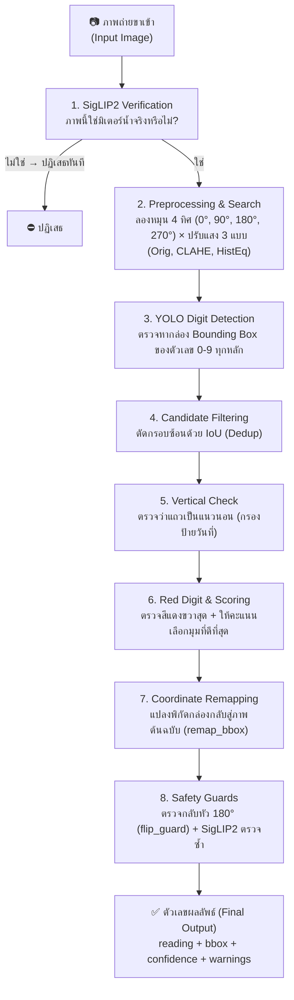
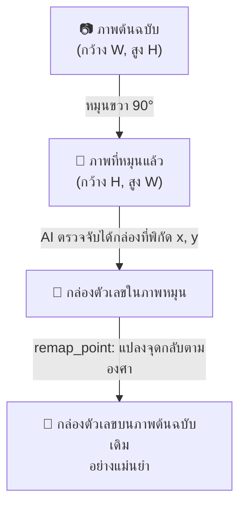
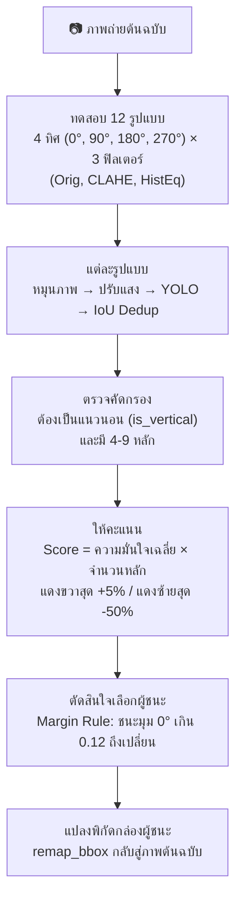
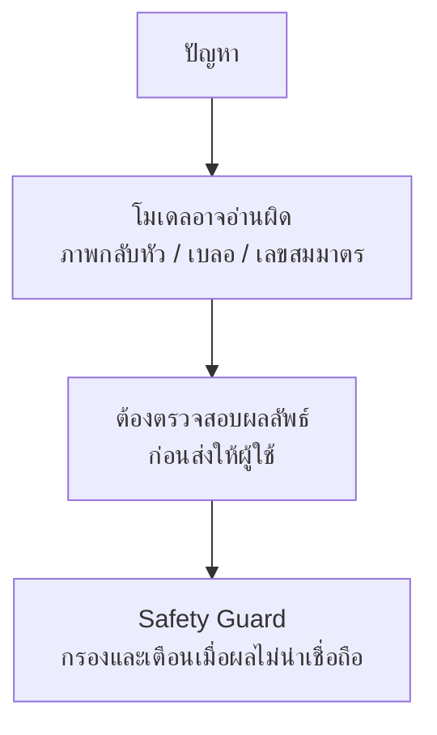

<p align="center"></p>

<p align="center"><strong>เอกสารประกอบการสอน</strong></p>
<p align="center"><strong>ระบบอ่านค่ามิเตอร์น้ำด้วยเทคโนโลยีการรู้จำอักขระด้วยแสง</strong></p>
<p align="center"><strong>Water Meter OCR</strong></p>

<p align="center"><strong>นายจิรเมธ ทองเปลว รหัสประจำตัว 674230013</strong></p>
<p align="center">หมู่เรียน 67/44</p>
<p align="center">โครงงานนี้เป็นส่วนหนึ่งของการศึกษารายวิชา 7203602</p>
<p align="center">สาขาวิชาเทคโนโลยีสารสนเทศ คณะวิทยาศาสตร์และเทคโนโลยี</p>
<p align="center">มหาวิทยาลัยราชภัฏนครปฐม</p>
<p align="center">ภาคเรียนที่ 1 ปีการศึกษา 2569</p>

<div style="page-break-after: always;"></div>

## คำนำ

&emsp;&emsp;คู่มือฉบับนี้จัดทำขึ้นเพื่อใช้เป็นแนวทางในการศึกษาและพัฒนาระบบอ่านค่ามาตรวัดน้ำอัตโนมัติจากภาพถ่าย โดยประยุกต์ใช้เทคโนโลยีปัญญาประดิษฐ์ (Artificial Intelligence) การประมวลผลภาพ (Image Processing) และการรู้จำอักขระจากภาพ (Optical Character Recognition: OCR) เพื่อเพิ่มประสิทธิภาพในการอ่านและจัดเก็บข้อมูลจากมาตรวัดน้ำ ตลอดจนเป็นแนวทางสำหรับผู้ที่สนใจนำเทคโนโลยีดังกล่าวไปประยุกต์ใช้ในการพัฒนาระบบอัตโนมัติในลักษณะอื่นต่อไป

&emsp;&emsp;เนื้อหาของคู่มือฉบับนี้ครอบคลุมกระบวนการพัฒนาระบบอ่านค่ามาตรวัดน้ำอัตโนมัติอย่างเป็นลำดับ ตั้งแต่การรับและเตรียมข้อมูลภาพ การตรวจสอบและคัดกรองข้อมูล การปรับปรุงคุณภาพภาพด้วยเทคนิคการประมวลผลภาพ การตรวจจับตัวเลขบนหน้าปัดมาตรวัดน้ำ การอ่านและรู้จำตัวเลขด้วยเทคนิค OCR ตลอดจนการประมวลผลและส่งออกผลลัพธ์ของระบบ นอกจากนี้ ยังครอบคลุมการประยุกต์ใช้แบบจำลอง YOLO และ SigLIP2 รวมถึงการให้บริการแบบจำลองผ่าน FastAPI และการพัฒนาส่วนติดต่อผู้ใช้ด้วย Gradio เพื่อให้สามารถทดสอบการทำงานของระบบได้อย่างครบถ้วน

&emsp;&emsp;ผู้จัดทำได้เรียบเรียงเนื้อหาและตัวอย่างการพัฒนาระบบโดยอาศัยการศึกษาค้นคว้าจากเอกสารทางวิชาการ งานวิจัย โครงการโอเพนซอร์ส และแหล่งข้อมูลทางเทคนิคที่เกี่ยวข้อง โดยจัดลำดับเนื้อหาให้มีความต่อเนื่องและสัมพันธ์กันตามกระบวนการทำงานของระบบ เพื่อให้ผู้อ่านสามารถศึกษา ทำความเข้าใจ และนำแนวทางรวมถึงตัวอย่างโค้ดไปประยุกต์ใช้ได้อย่างถูกต้องและเหมาะสม คู่มือฉบับนี้มุ่งหวังให้เป็นประโยชน์ต่อนักพัฒนาซอฟต์แวร์ นักศึกษา วิศวกรปัญญาประดิษฐ์ และผู้สนใจด้านคอมพิวเตอร์วิทัศน์ ตลอดจนผู้ที่ต้องการศึกษาแนวทางการประยุกต์ใช้ปัญญาประดิษฐ์เพื่อพัฒนาระบบอ่านข้อมูลจากภาพ

&emsp;&emsp;ผู้จัดทำหวังเป็นอย่างยิ่งว่าคู่มือฉบับนี้จะเป็นประโยชน์ต่อการศึกษาและการพัฒนาระบบอ่านค่ามาตรวัดน้ำอัตโนมัติ รวมทั้งสามารถนำองค์ความรู้และแนวทางที่นำเสนอไปประยุกต์ใช้ในการพัฒนาระบบที่เกี่ยวข้องกับการตรวจจับและรู้จำข้อมูลจากภาพในอนาคต หากมีข้อเสนอแนะอันเป็นประโยชน์ต่อการปรับปรุงคู่มือฉบับนี้ ผู้จัดทำขอน้อมรับด้วยความขอบคุณยิ่ง

<p align="right">นายจิรเมธ ทองเปลว</p>
<p align="right">สิงหาคม 2569</p>

<div style="page-break-after: always;"></div>

# คู่มือการพัฒนาระบบอ่านค่ามาตรวัดน้ำอัตโนมัติด้วยปัญญาประดิษฐ์
## Automated Water Meter Reading System using Deep Learning & Computer Vision

&emsp;&emsp;คู่มือฉบับนี้ออกแบบสำหรับนักศึกษาที่เขียน Python พื้นฐานได้ อยากลองสร้าง **ระบบอ่านตัวเลขมิเตอร์น้ำจากภาพถ่าย (Water Meter OCR)** แบบทำได้จริง — คุณไม่จำเป็นต้องเชี่ยวชาญ AI, YOLO, SigLIP2 หรือ OpenCV มาก่อน เครื่องมือเหล่านี้คือสิ่งที่โปรเจกต์หยิบมาใช้ให้คุณได้ลองเล่น ส่วนหน้าที่ของคุณคือค่อยๆ ทำความเข้าใจทีละขั้นตอนว่าแต่ละส่วนทำงานอย่างไร ผ่านโค้ดที่แบ่งเป็นฟังก์ชันเล็กๆ ตามหน้าที่ อ่านง่าย ทดลองแยกส่วนได้

> **เทคโนโลยีที่โปรเจกต์ใช้ (ไม่ใช่สิ่งที่ต้องรู้ก่อนเริ่ม):** Python • YOLO (ตรวจจับตัวเลข) • SigLIP2 (คัดกรองภาพ) • OpenCV (หมุนภาพ/ปรับแสง) • FastAPI (ทำ API) • Gradio (ทำหน้าเว็บ) • `uv` (ติดตั้งไลบรารีเร็ว) — เอกสารจะพาไปรู้จักแต่ละตัวตอนที่ต้องใช้งานจริง

---

## สารบัญเนื้อหา (Table of Contents)

- [ข้อแนะนำเบื้องต้นสำหรับการศึกษา](#ข้อแนะนำเบื้องต้นสำหรับการศึกษา)
- [บทที่ 1: พื้นฐาน การออกแบบ และการประมวลผลภาพ (Fundamentals, Design, and Image Processing)](#บทที่-1-พื้นฐาน-การออกแบบ-และการประมวลผลภาพ-fundamentals-design-and-image-processing)
  - [1.1 ทฤษฎีและหลักการพื้นฐาน (Theory & Fundamentals)](#11-ทฤษฎีและหลักการพื้นฐาน-theory--fundamentals)
  - [1.2 การฝึกแบบจำลองสำหรับการอ่านตัวเลข (Model Training)](#12-การฝึกแบบจำลองสำหรับการอ่านตัวเลข-model-training)
  - [1.3 สภาพแวดล้อมและการจัดการโปรเจกต์ด้วย uv (Environment & Project Setup)](#13-สภาพแวดล้อมและการจัดการโปรเจกต์ด้วย-uv-environment--project-setup)
  - [1.4 การคัดกรองภาพแบบซีโร่ช็อตด้วย SigLIP2 (Zero-shot Classification)](#14-การคัดกรองภาพแบบซีโร่ช็อตด้วย-siglip2-zero-shot-classification)
  - [1.5 การตรวจจับและอ่านค่าตัวเลข (Computer Vision & Digit Detection Engine)](#15-การตรวจจับและอ่านค่าตัวเลข-computer-vision--digit-detection-engine)
- [บทที่ 2: การพัฒนาแอปพลิเคชันและส่วนติดต่อผู้ใช้ (Application & UI Development)](#บทที่-2-การพัฒนาแอปพลิเคชันและส่วนติดต่อผู้ใช้-application--ui-development)
  - [2.1 การบูรณาการระบบประมวลผลหลักและระบบความปลอดภัย (Core Pipeline & Safety Guards)](#21-การบูรณาการระบบประมวลผลหลักและระบบความปลอดภัย-core-pipeline--safety-guards)
  - [2.2 การพัฒนาส่วนเชื่อมต่อโปรแกรมประยุกต์ด้วย FastAPI (REST API Development)](#22-การพัฒนาส่วนเชื่อมต่อโปรแกรมประยุกต์ด้วย-fastapi-rest-api-development)
  - [2.3 การพัฒนาส่วนติดต่อผู้ใช้ด้วย Gradio (Frontend Development)](#23-การพัฒนาส่วนติดต่อผู้ใช้ด้วย-gradio-frontend-development)
  - [2.4 การรัน ทดสอบ และคู่มือแก้ปัญหา (Testing & Troubleshooting)](#24-การรัน-ทดสอบ-และคู่มือแก้ปัญหา-testing--troubleshooting)
  - [2.5 ข้อควรพิจารณาก่อนการใช้งานจริง (Production Readiness)](#25-ข้อควรพิจารณาก่อนการใช้งานจริง-production-readiness)
- [อภิธานศัพท์ (Glossary)](#อภิธานศัพท์-glossary)
- [บรรณานุกรมและเอกสารอ้างอิง (References)](#บรรณานุกรมและเอกสารอ้างอิง-references)

---

## ข้อแนะนำเบื้องต้นสำหรับการศึกษา

&emsp;&emsp;โปรดศึกษาหลักการเบื้องต้นจำนวน 5 ประการดังต่อไปนี้ก่อนเริ่มดำเนินการ เพื่อให้การพัฒนาระบบเป็นไปอย่างราบรื่น:

1. **ทำไมต้องใช้ Virtual Environment (`venv`)?:** อุปมาเสมือนกล่องเครื่องมือเฉพาะสำหรับโครงการนี้ ทำหน้าที่แยกไลบรารีออกจากโครงการอื่น เพื่อป้องกันปัญหาความขัดแย้งของรุ่นไลบรารี — การลบสภาพแวดล้อมดังกล่าวมิได้ส่งผลกระทบต่อระบบหลัก
2. **ทำไมต้องใช้ `uv`?:** คือตัวติดตั้งไลบรารีที่เขียนด้วย Rust ถูกออกแบบมาให้ติดตั้งและจัดการ dependencies ได้รวดเร็วกว่า workflow แบบ `pip` ในหลายกรณี คำสั่งเหมือนกัน แค่เปลี่ยนเป็น `uv pip install`
3. **รันคำสั่งที่โฟลเดอร์ไหน?:** เปิด Terminal แล้วต้องอยู่ที่โฟลเดอร์หลัก `meter-reader/` เสมอ ก่อนรัน `uv run python ...`
4. **รันแบบ Native:** โปรเจกต์รันบนเครื่องโดยตรง ไม่ได้อยู่ใน Docker จึงเรียก GPU (CUDA) ได้เต็มที่ ถ้ามีการ์ดจอ NVIDIA จะเร็วขึ้นมาก
5. **โค้ดแบ่งเป็นฟังก์ชันเล็กๆ ตามหน้าที่:** แทนที่จะเขียนก้อนใหญ่ๆ โปรเจกต์แยกงานเป็นฟังก์ชันย่อย เช่น `rotate_image` (หมุนภาพ) → `apply_prep` (ปรับแสง) → `detect_digits` (หาตัวเลข) แต่ละฟังก์ชันรับค่าเข้า–ส่งค่าออกชัดเจน ทำให้อ่าน ทดสอบ และแก้ทีละจุดได้ง่าย ไม่ต้องรู้ OOP หรือ Functional Programming ขั้นสูง — แค่เข้าใจว่า “แยกหน้าที่กันทำ” ก็พอ

> **💡 เคล็ดลับการเรียนรู้:** ลองรันระบบจริงด้วยโมเดลสำเร็จรูปก่อนอ่านโค้ดทั้งหมด เปิด Terminal 2 หน้าต่าง — หน้าต่างที่ 1 รัน `uv run python main.py` หน้าต่างที่ 2 รัน `uv run python gradio_app.py` แล้วเปิดเบราว์เซอร์ที่ http://127.0.0.1:7860 คุณจะเห็นภาพรวมก่อนลงรายละเอียด

---

# บทที่ 1: พื้นฐาน การออกแบบ และการประมวลผลภาพ (Fundamentals, Design, and Image Processing)

---

### 1.1 ทฤษฎีและหลักการพื้นฐาน (Theory & Fundamentals)

&emsp;&emsp;**ปัญหาจริงที่ระบบนี้แก้ (The Real-world Problem):**  
ภาพมิเตอร์น้ำจากหน้างานไม่สวยเหมือนในห้องแลป มักเจอ 4 อย่างนี้:
* **ถ่ายเอียงหรือกลับหัว:** ถือมือถือถ่ายเฉียง 90° หรือ 180° เป็นเรื่องปกติ
* **แสงสะท้อน ตัวเลขจาง:** กระจกหน้าปัดมีเงา คราบน้ำ หรือมืด
* **ป้ายหลอกตา:** ตัวเลขวันที่ผลิต/ซีเรียลปั๊มเป็นแนวตั้งข้างตัวเรือน
* **เลขสมมาตรหลอกตา:** $6 \leftrightarrow 9$, $2 \leftrightarrow 5$, $0,1,8$ ที่ดูคล้ายกันเมื่อกลับหัว

> เมื่อจบส่วนนี้ คุณควรเข้าใจว่าแต่ละเทคโนโลยีช่วยแก้ปัญหาไหน

&emsp;&emsp;**แผนภาพการทำงานของระบบ (Pipeline Data Flow):**



<details>
<summary>📄 ดูเวอร์ชันข้อความ (fallback)</summary>

```text
[ 📷 ภาพถ่ายขาเข้า (Input Image) ]
              │
              ▼
[ 1. SigLIP2 Verification ]  ──> ภาพนี้ใช่มิเตอร์น้ำจริงหรือไม่? (ถ้าไม่ใช่ ปฏิเสธทันที)
              │ (ใช่)
              ▼
[ 2. Preprocessing & Search ] ──> ลองหมุน 4 ทิศ (0°, 90°, 180°, 270°) × ปรับแสง 3 แบบ (Orig, CLAHE, HistEq)
              │
              ▼
[ 3. YOLO Digit Detection ]  ──> ตรวจหากล่อง Bounding Box ของตัวเลข 0-9 ทุกหลัก
              │
              ▼
[ 4. Candidate Filtering ]   ──> ตัดกรอบสี่เหลี่ยมที่ซ้อนทับกันทิ้งด้วย IoU (Dedup)
              │
              ▼
[ 5. Vertical Check ]        ──> ตรวจว่าแถวตัวเลขเป็นแนวนอนหรือไม่ (กรองป้ายวันที่ออก)
              │
              ▼
[ 6. Red Digit & Scoring ]   ──> ตรวจหลักทศนิยมสีแดง (ต้องอยู่ขวาสุด) + ให้คะแนนเลือกมุมที่ดีที่สุด
              │
              ▼
[ 7. Coordinate Remapping ]  ──> แปลงพิกัดกล่องตัวเลขจากภาพหมุน กลับสู่ระนาบภาพต้นฉบับเดิม
              │
              ▼
[ 8. Safety Guards ]         ──> ตรวจกลับหัว 180° (flip_guard) + SigLIP2 ตรวจทานหลักที่ไม่มั่นใจ
              │
              ▼
[ ✅ ตัวเลขผลลัพธ์ (Final Output) ] ──> ได้ค่าตัวเลข พิกัดกล่อง ค่าความมั่นใจ และรายการคำเตือน
```
</details>

#### 1.1.1 คอมพิวเตอร์วิทัศน์และการตรวจจับวัตถุ (Computer Vision & Object Detection)
&emsp;&emsp;**คอมพิวเตอร์วิทัศน์ (Computer Vision)** คือการสอนคอมพิวเตอร์ให้ “มองภาพแล้วเข้าใจ” ส่วน **OCR (Optical Character Recognition)** คือการเปลี่ยนตัวเลขในภาพให้เป็นข้อความที่เอาไปใช้งานต่อได้

&emsp;&emsp;โปรเจกต์ใช้ **YOLO (You Only Look Once)** — โมเดลตรวจจับวัตถุที่เร็วระดับ Real-time (สถาปัตยกรรม YOLO26/YOLOv8) — มาหาตำแหน่งตัวเลข 0–9 สามคำที่เจอบ่อย:

* **Bounding Box (`bbox`):** กรอบสี่เหลี่ยม `[x1, y1, x2, y2]` ที่ตีล้อมตัวเลขแต่ละหลัก — บอกว่า “เลขอยู่ตรงไหนในภาพ”
* **Confidence Score:** ค่าความมั่นใจ 0.00–1.00 ยิ่งใกล้ 1.00 ยิ่งมั่นใจ — ใช้ตัดสินใจว่าผลไหนน่าเชื่อถือ
* **Class:** ประเภทที่เจอ คือเลข 0 ถึง 9

> เมื่อจบหัวข้อนี้ คุณจะเข้าใจว่า YOLO มีหน้าที่ “ตีกรอบและบอกว่าแต่ละกรอบคือเลขอะไร”

#### 1.1.2 การจำแนกภาพแบบซีโร่ช็อต (Zero-shot Image Classification)
&emsp;&emsp;ปกติถ้าจะสอน AI แยก “มิเตอร์น้ำ vs มิเตอร์ไฟ vs ภาพทั่วไป” ต้องเตรียมภาพตัวอย่างหลายร้อยภาพ แต่โปรเจกต์ใช้ทางลัดด้วย **SigLIP2** (โมเดล Vision-Language ของ Google):

* **Zero-shot Classification:** คือความสามารถในการจำแนกภาพจาก “คำอธิบายที่เป็นข้อความ” ได้เลย โดยไม่ต้องเทรนใหม่ แค่บอกโมเดลว่าให้เทียบภาพกับคำว่า `"water meter"`, `"electricity meter"`, `"not a meter"` โมเดลจะบอกว่าคำไหนใกล้เคียงภาพที่สุด — เหมาะกับงานคัดกรองภาพก่อนเข้าโมเดลหลัก

#### 1.1.3 การประมวลผลภาพดิจิทัล (Digital Image Processing)
&emsp;&emsp;**Image Preprocessing (การเตรียมภาพก่อนส่งให้ AI)** เหมือนเช็ดแว่นให้ใสก่อนอ่านหนังสือ — ช่วยให้ตัวเลขที่จางหรืออยู่ในเงามืดชัดขึ้น โปรเจกต์ใช้ 2 เทคนิคหลักผ่าน OpenCV:

* **CLAHE:** ปรับแสงเฉพาะจุดบนช่องความสว่าง (L) ในระบบสี LAB ดึงรายละเอียดในเงามืดโดยไม่ทำให้ส่วนสว่างจ้าเกินไป — เหมาะกับภาพที่มีเงาตกเป็นหย่อมๆ
* **Histogram Equalization (HistEq):** เกลี่ยความสว่างทั่วทั้งภาพบนช่อง Y ในระบบสี YCrCb — เหมาะกับภาพที่มืดทั้งภาพ

> **📌 สรุปความเข้าใจส่วนที่ 1.1:**
> * YOLO ทำหน้าที่ตีกรอบและอ่านค่าตัวเลข 0–9
> * SigLIP2 ทำหน้าที่ตรวจสอบว่าภาพเป็นมิเตอร์น้ำจริงหรือไม่
> * OpenCV ทำหน้าที่หมุนภาพและปรับแสงเพื่อช่วยให้ AI อ่านได้ง่ายขึ้น

---

### 1.2 การฝึกแบบจำลองสำหรับการอ่านตัวเลข (Model Training)

> [!NOTE]
> **⚡ ข้ามส่วนนี้ได้ทันที — มีโมเดลพร้อมใช้งานแล้ว:**  
> โปรเจกต์มีไฟล์ `weights/MeterOCR.pt` ที่ฝึกเสร็จแล้วให้ลองรันได้เลย คุณไม่ต้องเทรนใหม่ก่อนเริ่มเรียน ข้ามไปหัวข้อ 1.3 ได้ทันที ส่วนนี้มีไว้สำหรับคนที่อยากเข้าใจหรืออยากฝึกโมเดลของตัวเองต่อ

&emsp;&emsp;**ทำไมต้องเทรนบนคลาวด์ (WHY)?:** การเทรน Deep Learning ใช้การ์ดจอหนักมาก เครื่องทั่วไปอาจช้าหรือนานหลายชั่วโมง จึงแนะนำให้รันบน Google Colab / Kaggle ที่มี GPU ฟรี

#### 1.2.1 การเตรียมชุดข้อมูลจาก Roboflow

&emsp;&emsp;ระบบใช้ชุดข้อมูล "Utility Meter Reading" จากแพลตฟอร์ม Roboflow ซึ่งประกอบด้วยภาพหน้าปัดมาตรวัดน้ำที่มีการทำเครื่องหมายกำกับพิกัด (Annotation) ในฟอร์แมตที่เข้ากันได้กับ YOLO:

```python
# 📍 train_model_colab.ipynb — ดาวน์โหลดชุดข้อมูลจาก Roboflow
from roboflow import Roboflow

rf = Roboflow(api_key="YOUR_API_KEY")
project = rf.workspace("watermeter-jvlgr").project("utility-meter-reading-dataset-for-automatic-reading-yolo")
version = project.version(1)
dataset = version.download("yolo26")
```

#### 1.2.2 การฝึกโมเดล YOLO

&emsp;&emsp;ระบบเลือกใช้แบบจำลอง **Ultralytics YOLO26 Nano (`yolo26n.pt`)** (Jocher et al., 2026) ซึ่งเป็นสถาปัตยกรรมแบบ End-to-End Vision Model ที่เบาและเร็วที่สุดในตระกูล YOLO26 เหมาะกับงานตรวจจับตัวเลขบนหน้าปัดที่ต้องรันต่อเนื่องบนทรัพยากรจำกัด (Single GPU / CPU) โดย YOLO มีจุดเด่นคือการมองภาพรวมเพียงครั้งเดียวแล้วระบุตำแหน่งตัวเลขได้ทันทีบน GPU (Tesla T4) แม้รุ่น Nano จะแม่นยำน้อยกว่ารุ่น Medium เล็กน้อย แต่ใช้ VRAM น้อยกว่าและประมวลผลได้เร็วกว่าอย่างมีนัยสำคัญ

```python
# 📍 train_model_colab.ipynb — กำหนดพารามิเตอร์และเริ่มกระบวนการเทรน
from ultralytics import YOLO

model = YOLO("yolo26n.pt")
results = model.train(
    data=f"{dataset.location}/data.yaml",
    epochs=100,                # จำนวนรอบการฝึกฝนสูงสุด
    patience=30,               # กลไกหยุดอัตโนมัติหากค่า mAP ไม่ดีขึ้น
    imgsz=640,                 # ความละเอียดของภาพ
    batch=64,                  # ขนาดชุดข้อมูลต่อรอบ (Nano ใช้ VRAM น้อย เพิ่ม batch ได้)
    amp=True,                  # ใช้ Mixed Precision (FP16) ลดการใช้ VRAM
    optimizer="AdamW",         # อัลกอริทึมสำหรับปรับค่าน้ำหนัก
    lr0=0.001,                 # อัตราการเรียนรู้เริ่มต้น
    mosaic=1.0,                # รวม 4 ภาพเพื่อสร้างความหลากหลาย
    mixup=0.15,                # ซ้อนทับภาพป้องกัน Overfitting
    degrees=15.0,              # หมุนภาพชดเชยมุมเอียง
    hsv_v=0.4,                 # ปรับความสว่างจำลองสภาพแสงน้อย
)
```

> **หมายเหตุ:** การเปิดใช้งาน `amp=True` (Automatic Mixed Precision) ช่วยลดการใช้ VRAM และเร่งความเร็วการเทรนบนการ์ดจอที่รองรับ

&emsp;&emsp;**ผลลัพธ์ที่คาดหวัง:** ได้ไฟล์ `best.pt` ใน `runs/detect/train/weights/` — ให้คัดลอกมาวางที่ `weights/MeterOCR.pt` แล้วรันระบบได้ทันทีโดยไม่ต้องแก้โค้ดอื่น

---

### 1.3 สภาพแวดล้อมและการจัดการโปรเจกต์ด้วย `uv` (Environment & Project Setup)

> **ทำไมต้องทำ (WHY)?:** เพื่อเตรียมโฟลเดอร์และติดตั้งไลบรารีให้พร้อม ก่อนเริ่มทดลองระบบจริง

#### 1.3.1 โครงสร้างไฟล์ของระบบ (Project Structure)
```text
meter-reader/
├── main.py            # โค้ดหลัก: API (FastAPI) และฟังก์ชันประมวลผลทั้งหมด
├── gradio_app.py      # หน้าเว็บ UI (Gradio) สำหรับทดสอบระบบ
├── TUTORIAL.md        # คู่มือการเรียนรู้ฉบับสมบูรณ์
├── requirements.txt   # รายการ Library dependencies
├── meter_img/         # ชุดภาพถ่ายมิเตอร์น้ำตัวอย่าง 7 ภาพ
└── weights/
    └── MeterOCR.pt    # ไฟล์โมเดล YOLO สำหรับตรวจจับตัวเลข (พร้อมใช้งาน)
```

#### 1.3.2 การสร้างสภาพแวดล้อมและติดตั้ง Dependencies

&emsp;&emsp;เปิด Terminal ที่โฟลเดอร์ `meter-reader/` แล้วทำตามลำดับ:

```powershell
# 1. สร้าง Virtual Environment ด้วย Python 3.11
uv venv --python 3.11

# 2. เปิดใช้งาน Virtual Environment
# Windows PowerShell:
.venv\Scripts\Activate.ps1
# macOS / Linux:
# source .venv/bin/activate

# 3. ติดตั้ง Library ทั้งหมดผ่าน uv
uv pip install -r requirements.txt
```

&emsp;&emsp;**ผลลัพธ์ที่คาดหวัง:** เห็นข้อความ `Installed ... packages` และไม่มี error

&emsp;&emsp;รายการใน `requirements.txt` (ยึดไฟล์จริงเป็นหลัก):
```text
fastapi>=0.115
uvicorn[standard]>=0.30
python-multipart>=0.0.9
ultralytics>=8.4.0
transformers>=4.52.0
torch>=2.3
gradio>=5.0
httpx>=0.27
pillow>=10.0
opencv-python>=4.9
numpy>=1.26
PyYAML>=6.0
```

---

### 1.4 การคัดกรองภาพแบบซีโร่ช็อตด้วย SigLIP2 (Zero-shot Classification)

> **ทำไมต้องทำ (WHY)?:** ผู้ใช้อาจอัปโหลดภาพที่ไม่ใช่มิเตอร์น้ำ (เช่น มิเตอร์ไฟ เกจวัดแรงดัน หรือภาพทั่วไป) ถ้าไม่มีด่านคัดกรอง ระบบจะเสียเวลาหาตัวเลขและอาจให้คำตอบผิด

&emsp;&emsp;**แนวคิดการทำงาน:**  
ให้ **SigLIP2** เทียบภาพกับ 4 คำอธิบาย แล้วดูว่าคำไหนตรงสุด ถ้าคำว่า `"water meter"` ได้คะแนนต่ำกว่า `0.50` จะปฏิเสธภาพทันที — ไม่ต้องเทรนเพิ่ม

&emsp;&emsp;**บทสรุปก่อนศึกษารหัสต้นฉบับ:** โดยสรุปคือการเปรียบเทียบภาพกับคำอธิบาย 4 คำ แล้วพิจารณาว่าคำว่า water meter ได้คะแนนสูงสุดหรือไม่

&emsp;&emsp;**ประเด็นสำคัญที่ควรเข้าใจ:** SigLIP2 ทำหน้าที่เป็นด่านคัดกรองเบื้องต้น — หากมิใช่ภาพมาตรวัดน้ำ ระบบจะปฏิเสธก่อนเข้าสู่แบบจำลองหลัก

&emsp;&emsp;**รายละเอียดเชิงเทคนิค (สำหรับศึกษารอบที่สอง) (เก็บไว้อ่านรอบสอง):** โปรดพิจารณากลไก Lazy Loading ด้วย `_siglip` และการประยุกต์ใช้ `torch.softmax` บน `logits_per_image` เพื่อค้นหาคำที่มีคะแนนสูงสุด

```python
# 📍 main.py — SigLIP2 Zero-shot Verification
SIGLIP_MODEL = "google/siglip2-base-patch16-224"
METER_LABELS = ("water meter", "electricity meter", "gas meter", "not a meter")
METER_VERIFY_CONF = 0.50

_siglip = None

def get_siglip() -> tuple[Any, Any]:
    """โหลดโมเดล SigLIP2 (Processor + Model) เข้า GPU/CPU แบบ Lazy Loading"""
    global _siglip
    if _siglip is None:
        from transformers import AutoModel, AutoProcessor
        processor = AutoProcessor.from_pretrained(SIGLIP_MODEL)
        model = AutoModel.from_pretrained(SIGLIP_MODEL).to(DEVICE).eval()
        _siglip = (processor, model)
    return _siglip

@torch.inference_mode()
def check_water_meter(rgb_img: np.ndarray) -> dict[str, Any]:
    """SigLIP2 ตรวจสอบว่าเป็นภาพมิเตอร์น้ำจริงหรือไม่"""
    processor, model = get_siglip()

    inputs = processor(
        text=list(METER_LABELS),
        images=Image.fromarray(rgb_img),
        padding="max_length",
        return_tensors="pt",
    ).to(DEVICE)

    outputs = model(**inputs)
    probs = torch.softmax(outputs.logits_per_image, dim=1)[0].cpu().numpy()
    pred_idx = int(np.argmax(probs))
    pred_label = METER_LABELS[pred_idx]

    return {
        "verified": pred_label == "water meter" and float(probs[0]) >= METER_VERIFY_CONF,
        "predicted_class": pred_label,
        "confidence": float(probs[0]),
    }
```
&emsp;&emsp;**ผลลัพธ์ที่คาดหวัง:** ถ้าเป็นมิเตอร์น้ำจริง จะได้ `{"verified": True, "predicted_class": "water meter", "confidence": 0.87}` ถ้าไม่ใช่ จะได้ `verified: False` พร้อมคำเตือนให้ผู้ใช้

---

### 1.5 การตรวจจับและอ่านค่าตัวเลข (Computer Vision & Digit Detection Engine)

&emsp;&emsp;กระบวนการอ่านตัวเลขมี 4 ขั้นตอน — แต่ละขั้นตอนแก้ปัญหาคนละแบบ ต่อกันเป็นท่อส่งข้อมูล:

#### 1. การหมุนภาพและปรับคอนทราสต์ (Image Enhancement)
* **ปัญหา:** ภาพเอียง ตัวเลขจาง หรืออยู่ในเงามืด ทำให้ AI มองไม่เห็น
* **แนวคิด:** ลองหมุนภาพ 4 ทิศ (0°, 90°, 180°, 270°) และลองปรับแสง 3 แบบ (ภาพเดิม, CLAHE, HistEq) แล้วค่อยให้ AI เลือกแบบที่อ่านชัดที่สุด
* **ทำอย่างไร:** ฟังก์ชัน `rotate_image` หมุนภาพด้วย OpenCV ส่วน `apply_prep` เลือกวิธีปรับแสง — โค้ดสั้นและทดสอบแยกได้

&emsp;&emsp;**บทสรุปก่อนศึกษารหัสต้นฉบับ:** สรุปคือ “จัดภาพให้ตรงและชัดก่อนให้ AI ดู” — รอบแรกจำแค่นี้พอ

&emsp;&emsp;**ประเด็นสำคัญที่ควรเข้าใจ:** มี 4 มุมให้ลอง และ 3 วิธีปรับแสงให้ลอง ระบบจะเลือกคู่ที่อ่านชัดที่สุด

&emsp;&emsp;**รายละเอียดเชิงเทคนิค (สำหรับศึกษารอบที่สอง) (เก็บไว้อ่านรอบสอง):** `rotate_image` ใช้ `cv2.rotate` ส่วน `apply_prep` เลือกปรับช่อง L (CLAHE) หรือช่อง Y (HistEq) ตามชื่อฟิลเตอร์

```python
def rotate_image(img_bgr: np.ndarray, angle: int) -> np.ndarray:
    """หมุนภาพ 90°, 180°, 270° ตามเข็มนาฬิกา"""
    if angle == 90:
        return cv2.rotate(img_bgr, cv2.ROTATE_90_CLOCKWISE)
    if angle == 180:
        return cv2.rotate(img_bgr, cv2.ROTATE_180)
    if angle == 270:
        return cv2.rotate(img_bgr, cv2.ROTATE_90_COUNTERCLOCKWISE)
    return img_bgr

def apply_prep(img_bgr: np.ndarray, prep: str) -> np.ndarray:
    """ปรับแสง: CLAHE (บนช่อง L) หรือ HistEq (บนช่อง Y)"""
    if prep == "clahe":
        lab = cv2.cvtColor(img_bgr, cv2.COLOR_BGR2LAB)
        l, a, b = cv2.split(lab)
        l_clahe = cv2.createCLAHE(CLAHE_CLIP, CLAHE_GRID).apply(l)
        return cv2.cvtColor(cv2.merge([l_clahe, a, b]), cv2.COLOR_LAB2BGR)

    if prep == "histeq":
        ycrcb = cv2.cvtColor(img_bgr, cv2.COLOR_BGR2YCrCb)
        y, cr, cb = cv2.split(ycrcb)
        y_eq = cv2.equalizeHist(y)
        return cv2.cvtColor(cv2.merge([y_eq, cr, cb]), cv2.COLOR_YCrCb2BGR)

    return img_bgr
```

---

#### 2. การแปลงพิกัดจุดเดี่ยว (`remap_point`) และกล่อง (`remap_bbox`)

&emsp;&emsp;**ทำไมต้องแปลงพิกัดย้อนกลับ? (WHY):**  
โปรดพิจารณาสถานการณ์ที่ผู้อ่านเอียงศีรษะ 90 องศาเพื่ออ่านหนังสือ แล้วใช้ปากกาเน้นข้อความ — เมื่อกลับมาตั้งศีรษะตรง รอยเน้นข้อความจะอยู่ผิดตำแหน่ง

&emsp;&emsp;การทำงานของระบบก็เหมือนกัน:

1. เราหมุนภาพ 90° เพื่อให้ AI หาตัวเลขได้ง่าย
2. พิกัดกล่อง `bbox [x1, y1, x2, y2]` ที่ AI หาได้ จึงอยู่ใน **ระบบพิกัดของภาพที่หมุนแล้ว**
3. ถ้าจะเอากล่องไปวาดบน **ภาพต้นฉบับของผู้ใช้** ต้องแปลงพิกัดกลับก่อนเสมอ — นี่คือหน้าที่ของ `remap_point` / `remap_bbox`



<details>
<summary>📄 ดูเวอร์ชันข้อความ</summary>

```text
[ 📷 ภาพต้นฉบับ (กว้าง W, สูง H) ]
               │
               ▼ (หมุนขวา 90°)
[ 🔄 ภาพที่หมุนแล้ว (กว้าง H, สูง W) ]
               │
               ▼ (AI ตรวจจับได้กล่องที่พิกัด x, y)
[ 🎯 กล่องตัวเลขในภาพหมุน ]
               │
               ▼ (remap_point: แปลงจุดกลับตามองศา)
[ 📍 กล่องตัวเลขบนภาพต้นฉบับเดิมอย่างแม่นยำ ]
```
</details>

&emsp;&emsp;**หลักการแปลงพิกัดทีละจุด (`remap_point`):** ไม่ต้องจำสูตรทั้งหมด แค่เข้าใจว่า “แกนสลับกันเมื่อหมุน 90°/270°”

* **หมุน 90° (ตามเข็ม):** แกนสลับกัน จุด $(x, y)$ บนภาพหมุน จะตรงกับจุด $(y, H - x)$ บนภาพเดิม
* **หมุน 180° (กลับหัว):** จุด $(x, y)$ จะตรงกับจุด $(W - x, H - y)$ บนภาพเดิม
* **หมุน 270° (ทวนเข็ม):** แกนสลับกัน จุด $(x, y)$ จะตรงกับจุด $(W - y, x)$ บนภาพเดิม

> หากยังไม่ชัดเจน ขอให้ทดลองวาดรูปสี่เหลี่ยมบนกระดาษ กำหนดจุดมุม แล้วทดลองหมุนกระดาษ — สูตรด้านล่างคือการถ่ายทอดสิ่งที่ท่านสังเกตเห็นให้อยู่ในรูปของรหัสต้นฉบับ

&emsp;&emsp;**บทสรุปก่อนศึกษารหัสต้นฉบับ:** พิกัดจากภาพหมุนยังวาดบนภาพเดิมไม่ได้ ต้องแปลงกลับก่อน

&emsp;&emsp;**ประเด็นสำคัญที่ควรเข้าใจ:** หมุนมุมไหน ต้องย้อนกลับมุมนั้น — งานของ `remap_point` คือจุดเดียว ส่วน `remap_bbox` คือทำกับมุมสองมุมแล้วหาขอบใหม่

&emsp;&emsp;**รายละเอียดเชิงเทคนิค (สำหรับศึกษารอบที่สอง) (เก็บไว้อ่านรอบสอง):** สูตร `y, h-x` / `w-x, h-y` / `w-y, x` คือการสลับแกนตามองศา โดย `w, h` คือขนาดภาพต้นฉบับ (มุมซ้ายบนเป็น 0,0) และ `remap_bbox` แค่เรียก `remap_point` สองครั้งแล้ว `min/max` — ทั้งสองสูตรตรงกับโค้ดจริงใน `main.py:remap_point()` (บรรทัด 121–129) และ `remap_bbox()` (132–142) แบบ 1:1

```python
def remap_point(x: float, y: float, angle: int, w: int, h: int) -> tuple[float, float]:
    """แปลงจุด 1 จุดจากภาพหมุน กลับสู่พิกัดภาพเดิมแบบทีละจุด"""
    if angle == 90:
        return y, h - x      # หมุนขวา 90° -> แกนสลับ x=y, y=h-x
    if angle == 180:
        return w - x, h - y  # กลับหัว 180° -> x=w-x, y=h-y
    if angle == 270:
        return w - y, x      # หมุนซ้าย 90° -> แกนสลับ x=w-y, y=x
    return x, y

def remap_bbox(bbox: list[float], angle: int, w: int, h: int) -> list[float]:
    """แปลงจุดมุม 2 จุด แล้วหา min/max เพื่อสร้าง Bounding Box ในพิกัดภาพเดิม"""
    x1, y1, x2, y2 = bbox
    p1_x, p1_y = remap_point(x1, y1, angle, w, h)
    p2_x, p2_y = remap_point(x2, y2, angle, w, h)
    return [
        min(p1_x, p2_x),
        min(p1_y, p2_y),
        max(p1_x, p2_x),
        max(p1_y, p2_y),
    ]
```

&emsp;&emsp;**ผลลัพธ์ที่คาดหวัง:** ไม่ว่าภาพจะถูกหมุนมุมไหน กล่องที่วาดบนภาพต้นฉบับจะตรงตำแหน่งตัวเลขเสมอ

---

#### 3. การกรองคอลัมน์แนวตั้ง (`is_vertical`) ด้วยระยะกว้าง vs ระยะสูง
* **ปัญหา:** ข้างตัวเรือนมิเตอร์มักมีตัวเลขวันที่ผลิต/ซีเรียลปั๊มเป็น **แนวตั้ง** ซึ่งไม่ใช่ค่ามิเตอร์ที่ต้องการอ่าน
* **แนวคิด:** หน้าปัดมิเตอร์จริงเรียงเป็น **แนวนอน** เสมอ — ระยะกว้างของแถวต้องมากกว่าระยะสูง ถ้าเจอแถวที่สูงกว่ากว้าง ให้ตัดทิ้ง
* **ทำอย่างไร:** วัดระยะซ้ายสุด–ขวาสุด (`width_span`) เทียบกับบนสุด–ล่างสุด (`height_span`) แบบ normalize ด้วยขนาดภาพ — ถ้า `height_span` มากกว่า `width_span` แบบมีนัยสำคัญ ถือว่าเป็นคอลัมน์แนวตั้ง

&emsp;&emsp;**บทสรุปก่อนศึกษารหัสต้นฉบับ:** ถ้าแถวตั้งสูงกว่ากว้าง ให้ตีว่าไม่ใช่หน้าปัดมิเตอร์

&emsp;&emsp;**ประเด็นสำคัญที่ควรเข้าใจ:** หน้าปัดจริงต้องกว้างกว่าสูง — ถ้าสูงกว่ากว้าง คือป้ายวันที่/ซีเรียลแนวตั้ง

&emsp;&emsp;**รายละเอียดเชิงเทคนิค (สำหรับศึกษารอบที่สอง) (เก็บไว้อ่านรอบสอง):** แปลง `center_x/center_y` เป็นสัดส่วนภาพแล้วเทียบ `width_span` กับ `height_span` ด้วยเกณฑ์ `0.8`

```python
def is_vertical(dets: list[dict[str, Any]], img_w: int, img_h: int) -> dict[str, Any]:
    """ตรวจว่าแถวตัวเลขเรียงเป็นแนวตั้งหรือไม่ (แนวนอน width_span ต้องมากกว่า height_span)"""
    if len(dets) < 2:
        return {"vertical": False}

    xs = [d["center_x"] / img_w for d in dets]
    ys = [d["center_y"] / img_h for d in dets]

    width_span = max(xs) - min(xs)   # ความกว้างของแนวตัวเลข (ซ้ายสุดไปขวาสุด)
    height_span = max(ys) - min(ys)  # ความสูงของแนวตัวเลข (บนสุดไปล่างสุด)

    # ถ้าความสูงมากกว่าความกว้าง แสดงว่าเป็นคอลัมน์แนวดิ่ง (ไม่ใช่แถวหน้าปัดมิเตอร์)
    is_vert = (height_span >= width_span * 0.8) or (width_span <= 0.05 and height_span >= 0.08)
    return {"vertical": is_vert}
```

---

#### 4. การค้นหา 4 ทิศ × 3 ฟิลเตอร์ และกฎสีแดงของหลักทศนิยม (`detect_digits_best`)

&emsp;&emsp;**ทำความเข้าใจปัญหาก่อนเริ่มเขียนโค้ด (The Problem):**  
ภาพจากผู้ใช้มีความไม่แน่นอนสูง:
1. ถ่ายมาได้ทุกมุม (0°, 90°, 180°, 270°)
2. สภาพแสงแต่ละภาพไม่เหมือนกัน (มืด มีเงา สว่างจ้า)

&emsp;&emsp;ถ้าเราลองแค่มุมเดียวหรือฟิลเตอร์เดียวแล้วพลาด ระบบจะอ่านผิดทันที

---

&emsp;&emsp;**แนวคิดการแก้ปัญหา (Solution Idea):**  
แทนที่จะเดา ให้ลอง **ทุกความเป็นไปได้แบบ “12 ผู้ท้าชิง” (4 ทิศ × 3 ฟิลเตอร์)** แล้วให้คะแนนว่าแบบไหนอ่านได้ชัดและน่าเชื่อถือที่สุด



<details>
<summary>📄 ดูเวอร์ชันข้อความ</summary>

```text
[ 📷 ภาพถ่ายต้นฉบับ ]
          │
          ▼
[ ทดสอบ 12 รูปแบบ: 4 ทิศ (0°, 90°, 180°, 270°) × 3 ฟิลเตอร์ (Orig, CLAHE, HistEq) ]
          │
          ▼
[ แต่ละรูปแบบ: หมุนภาพ ──> ปรับแสง ──> YOLO ตรวจจับเลข ──> ตัดกล่องซ้อนด้วย IoU ]
          │
          ▼
[ ตรวจคัดกรอง: ต้องเป็นแนวนอน (is_vertical) และมีจำนวนตัวเลข 4-9 หลัก ]
          │
          ▼
[ ให้คะแนน: Score = ความมั่นใจเฉลี่ย × จำนวนหลัก ]
  - ถ้าหลักทศนิยมสีแดงอยู่ขวาสุด: ได้โบนัส +5% (ทิศทางถูกต้อง)
  - ถ้าหลักทศนิยมสีแดงอยู่ซ้ายสุด: ตัดคะแนน -50% (น่าจะกลับหัว)
          │
          ▼
[ ตัดสินใจเลือกผู้ชนะ + Margin Rule (มุมอื่นต้องชนะมุม 0° เกิน 0.12 ถึงจะยอมเปลี่ยนมุม) ]
          │
          ▼
[ แปลงพิกัดกล่องของมุมที่ชนะ กลับสู่ระนาบภาพต้นฉบับเดิมด้วย remap_bbox ]
```
</details>

---

&emsp;&emsp;**แต่ละขั้นแก้ปัญหาอะไร (ตอบคำถามนี้ก่อนดูโค้ด):**

* **หมุน 4 ทิศ (0°/90°/180°/270°)** → แก้ภาพถ่ายเอียงหรือกลับหัว
* **ปรับแสง 3 แบบ (Orig/CLAHE/HistEq)** → แก้เลขจางหรืออยู่ในเงามืด
* **YOLO ตรวจจับ** → หาตำแหน่งเลข 0–9 ทุกหลัก
* **IoU dedup (threshold 0.45)** → ตัดกล่องซ้อนที่ซ้ำกันให้เหลือกล่องเดียว
* **is_vertical** → ตัดป้ายวันที่/ซีเรียลที่เรียงเป็นแนวตั้ง
* **red_ratio + Scoring** → รู้ว่าทิศถูกหรือกลับหัว (แดงต้องอยู่ขวาสุด)
* **Scoring (mean_conf × n)** → เลือกรูปที่มั่นใจและครบหลัก
* **Margin 0.12** → กันสลับมุมเพราะคะแนนสูสี
* **remap_bbox** → วาดกล่องให้ตรงภาพต้นฉบับ

&emsp;&emsp;**การทำงานแบ่งออกเป็น 3 ฟังก์ชันย่อยตามหน้าที่ (แต่ละฟังก์ชันแก้ปัญหาไหน):**

1. **`red_ratio(img_bgr, bbox)` — ตรวจสีแดงของหลักทศนิยม:**
   * **แก้ปัญหาอะไร:** รู้ว่าภาพกลับหัวหรือไม่ — มิเตอร์น้ำจริงมีเลขทศนิยม **สีแดงอยู่ขวาสุด** เสมอ ถ้าแดงไปอยู่ซ้ายสุด แสดงว่าภาพน่าจะกลับหัว
   * **ทำอย่างไร:** ครอปเฉพาะในกรอบ แปลงเป็น HSV แล้วนับสัดส่วนพิกเซลสีแดง

2. **`eval_orientation(bgr_img, angle, prep)` — ให้คะแนนแต่ละผู้ท้าชิง:**
   * **แก้ปัญหาอะไร:** ตัดสินว่า “มุม+แสง” ไหนน่าเชื่อถือสุด และกรองผลลวง — ต้องเป็นแนวนอนและมี 4–9 หลักถึงจะให้คะแนน
   * **ทำอย่างไร:** หมุน + ปรับแสงตามที่กำหนด → YOLO หาตัวเลข → ตัดกล่องซ้อน (`dedup_detections`) → ตรวจแนวนอน/จำนวนหลัก → คิดคะแนน $\text{Score} = \text{Mean Confidence} \times \text{จำนวนหลัก}$ แล้วบวก/ลบตามตำแหน่งสีแดง

3. **`detect_digits_best(rgb_img)` — เลือกผู้ชนะ:**
   * **แก้ปัญหาอะไร:** เลือก “มุม+แสง” ที่ดีที่สุดจาก 12 ผู้ท้าชิงโดยไม่พลิกไปมาเพราะคะแนนสูสี
   * **ทำอย่างไร:** รัน `eval_orientation` ครบ 12 แบบ เลือกตัวแทนที่ดีที่สุดของแต่ละมุม (4 มุม) → หามุมที่คะแนนสูงสุด (`best_angle`) → ใช้ **Margin Rule** ถ้าชนะมุม 0° ไม่เกิน `ORIENT_MARGIN = 0.12` ให้ยึดมุม 0° ไว้ก่อน → แปลงพิกัดกล่องของมุมที่ชนะกลับสู่ภาพเดิมด้วย `remap_bbox`

&emsp;&emsp;**บทสรุปก่อนศึกษารหัสต้นฉบับ:** ทดสอบครบทั้ง 12 รูปแบบ ให้คะแนนด้วยความเชื่อมั่นเฉลี่ยคูณจำนวนหลักร่วมกับกฎสีแดง แล้วคัดเลือกมุมที่ชนะโดยใช้เกณฑ์ Margin เพื่อป้องกันการเปลี่ยนแปลงผลลัพธ์เนื่องจากคะแนนใกล้เคียงกัน

&emsp;&emsp;**ประเด็นสำคัญที่ควรเข้าใจ:** ผู้ท้าชิงทั้ง 12 รูปแบบจะได้รับการประเมิน โดยผู้ที่ผ่านการตรวจสอบแนวนอนและมีจำนวนหลัก 4–9 หลัก พร้อมทั้งได้คะแนนสูงสุดจะเป็นผู้ชนะ

&emsp;&emsp;**รายละเอียดเชิงเทคนิค (สำหรับศึกษารอบที่สอง) (เก็บไว้อ่านรอบสอง):** โปรดพิจารณาว่า `red_ratio` คำนวณสัดส่วนพิกเซลสีแดงในปริภูมิสี HSV อย่างไร, `eval_orientation` รวมคะแนนและปรับลด 50% หรือเพิ่ม 5% ตามตำแหน่งสีแดงอย่างไร, และ `detect_digits_best` คัดเลือก `best_in_angle` แล้วประยุกต์ใช้ Margin 0.12 อย่างไร

---

```python
def red_ratio(img_bgr: np.ndarray, bbox: list[float]) -> float:
    """คำนวณสัดส่วนสีแดงในกล่องตัวเลข (หลักทศนิยมสีแดงต้องอยู่ขวาสุดของหน้าปัด)"""
    x1, y1, x2, y2 = [int(v) for v in bbox]
    pad_x = max(1, int((x2 - x1) * 0.15))
    pad_y = max(1, int((y2 - y1) * 0.15))

    crop = img_bgr[
        max(0, y1 + pad_y): min(img_bgr.shape[0], y2 - pad_y),
        max(0, x1 + pad_x): min(img_bgr.shape[1], x2 - pad_x),
    ]
    if crop.size == 0:
        return 0.0

    hsv = cv2.cvtColor(crop, cv2.COLOR_BGR2HSV)
    mask1 = cv2.inRange(hsv, (0, 40, 40), (12, 255, 255))
    mask2 = cv2.inRange(hsv, (165, 40, 40), (180, 255, 255))
    return float(np.mean((mask1 | mask2) > 0))

def eval_orientation(bgr_img: np.ndarray, angle: int, prep: str) -> dict[str, Any]:
    """ประเมินผลลัพธ์ของ 1 มุม × 1 ฟิลเตอร์"""
    rot = rotate_image(bgr_img, angle)
    proc = apply_prep(rot, prep)
    dets = dedup_detections(detect_digits(proc))

    rh, rw = rot.shape[:2]
    vert = is_vertical(dets, rw, rh)
    n = len(dets)

    if not dets or vert["vertical"] or not (EXPECTED_MIN_DIGITS <= n <= EXPECTED_MAX_DIGITS):
        return {"score": 0.0, "dets": dets, "prep": prep, "vert": vert}

    score = float(np.mean([d["confidence"] for d in dets])) * n

    # กฎสีแดง: หลักทศนิยมสีแดงต้องอยู่ขวาสุดเสมอ
    r_first = red_ratio(proc, dets[0]["bbox"])
    r_last = red_ratio(proc, dets[-1]["bbox"])

    if r_first > RED_THRESH and r_first > r_last * RED_DOMINANCE:
        score *= 0.5   # แดงอยู่ซ้าย -> น่าจะกลับหัว (ตัดคะแนน)
    elif r_last > RED_THRESH and r_last > r_first * RED_DOMINANCE:
        score *= 1.05  # แดงอยู่ขวา -> ทิศทางถูกต้อง (เพิ่มคะแนน)

    return {"score": score, "dets": dets, "prep": prep, "vert": vert}

def detect_digits_best(rgb_img: np.ndarray) -> tuple[list[dict[str, Any]], dict[str, Any] | None]:
    """ทดลอง 4 ทิศ × 3 ฟิลเตอร์ (12 รูปแบบ) แล้วเลือกชุดที่ได้คะแนนสูงสุด"""
    h, w = rgb_img.shape[:2]
    bgr = cv2.cvtColor(rgb_img, cv2.COLOR_RGB2BGR)

    candidates = {}
    for angle in ROTATION_ANGLES:
        best_in_angle = max(
            [eval_orientation(bgr, angle, prep) for prep in PREP_LIST],
            key=lambda c: c["score"],
        )
        candidates[angle] = best_in_angle

    cand0 = candidates[0]
    best_angle, best_cand = max(candidates.items(), key=lambda item: item[1]["score"])

    # Margin Rule: มุมอื่นต้องชนะมุม 0° เกินกำหนด จึงยอมสลับมุม (กันพลิกฉิวเฉียด)
    if (
        best_angle != 0
        and cand0["dets"]
        and not cand0["vert"]["vertical"]
        and (best_cand["score"] - cand0["score"] < ORIENT_MARGIN)
    ):
        best_angle, best_cand = 0, cand0

    best_dets = best_cand["dets"]
    best_meta = None

    if best_dets:
        best_meta = {
            "angle": best_angle,
            "prep": best_cand["prep"],
            "clahe": best_cand["prep"] == "clahe",
        }
        for d in best_dets:
            d["bbox"] = remap_bbox(d["bbox"], best_angle, w, h)
            d["center_x"] = (d["bbox"][0] + d["bbox"][2]) / 2.0
            d["center_y"] = (d["bbox"][1] + d["bbox"][3]) / 2.0

    return best_dets, best_meta
```

> **📌 สรุปความเข้าใจส่วนที่ 1.5:**
> * `detect_digits_best` คือ “ลองทุกมุมและทุกฟิลเตอร์ แล้วเลือกแบบที่มั่นใจที่สุด”
> * `remap_bbox` คือ “แปลงกล่องกลับมาวาดบนภาพเดิมให้ตรงที่”
> * เมื่อจบส่วนนี้ คุณควรอธิบายได้ว่าทำไมต้องลอง 12 แบบ และคะแนนมาจากไหน

---

# บทที่ 2: การพัฒนาแอปพลิเคชันและส่วนติดต่อผู้ใช้ (Application & UI Development)

---

### 2.1 การบูรณาการระบบประมวลผลหลักและระบบความปลอดภัย (Core Pipeline & Safety Guards)

&emsp;&emsp;ระบบที่ดีไม่ใช่แค่อ่านถูก แต่ต้องรู้ว่าเมื่อไหร่ “ไม่ควรเชื่อคำตอบตัวเอง” — ส่วนนี้คือตาข่ายนิรภัย



<details>
<summary>📄 ดูเวอร์ชันข้อความ</summary>

```text
ปัญหา
  ↓
โมเดลอาจอ่านผิดเพราะภาพกลับหัว/เบลอ/เลขสมมาตร
  ↓
ต้องตรวจสอบผลลัพธ์ก่อนส่งให้ผู้ใช้
  ↓
Safety Guard ช่วยกรองและเตือนเมื่อผลไม่น่าเชื่อถือ
```
</details>

#### 1. การตรวจจับภาพกลับหัวแบบกระจกเงา (`flip_guard`)
* **ปัญหา:** เลขอารบิกบางตัวสมมาตรเมื่อหมุน 180° เช่น $6 \leftrightarrow 9$, $2 \leftrightarrow 5$, $0,1,8$ ทำให้ภาพคว่ำก็ยังอ่านได้แต่เป็นคนละเลข
* **แนวคิด:** ลองหมุนภาพไปอีก 180° แล้วอ่านอีกรอบ ถ้าผลที่ได้ไม่สอดคล้องกับตารางสมมาตร `FLIP_MAP` แสดงว่าผลแรกอาจกลับหัว — ให้เตือนผู้ใช้แทนที่จะส่งเลขผิดไปเลย
* **ทำอย่างไร:** เทียบเลขแบบย้อนกลับ (`reversed`) กับผลจากการหมุน 180° ผ่าน `FLIP_MAP = {0:0, 1:1, 2:5, 5:2, 6:9, 8:8, 9:6}` ถ้าไม่ตรงและอีกฝั่งมั่นใจสูง จะตั้ง `warned = True`

&emsp;&emsp;**บทสรุปก่อนศึกษารหัสต้นฉบับ:** หากภาพกลับหัว ตัวเลขที่อ่านได้จะมีลักษณะสมมาตรแบบกระจกเงา — พึงทดลองหมุนภาพ 180 องศาแล้วเปรียบเทียบผลลัพธ์

&emsp;&emsp;**ประเด็นสำคัญที่ควรเข้าใจ:** กลุ่มตัวเลขที่มีความสมมาตรคือ 6↔9, 2↔5, 0/1/8 — หากผลการหมุนไม่สอดคล้องกับตาราง `FLIP_MAP` พึงแจ้งเตือน

&emsp;&emsp;**รายละเอียดเชิงเทคนิค (สำหรับศึกษารอบที่สอง) (เก็บไว้อ่านรอบสอง):** โปรดพิจารณาการเปรียบเทียบ `reversed(digits)` กับ `anti_dets` และกระบวนการ `cross_check_digits` ที่ใช้ SigLIP2 ตรวจสอบซ้ำเฉพาะหลักที่ YOLO มีความเชื่อมั่นต่ำ (<0.60)

```python
FLIP_MAP = {0: 0, 1: 1, 2: 5, 5: 2, 6: 9, 8: 8, 9: 6}

def flip_guard(rgb_img: np.ndarray, digits: list[dict[str, Any]], meta: dict[str, Any] | None) -> dict[str, Any]:
    """ตรวจสอบความสมมาตร 180° ป้องกันการอ่านกลับหัว (Mirror Check)"""
    if not digits or not meta:
        return {"warned": False, "anti_reading": "", "anti_confidence": 0.0}

    anti_angle = (meta["angle"] + 180) % 360
    rot_bgr = rotate_image(cv2.cvtColor(rgb_img, cv2.COLOR_RGB2BGR), anti_angle)
    anti_dets = dedup_detections(detect_digits(apply_prep(rot_bgr, meta["prep"])))

    if not anti_dets:
        return {"warned": False, "anti_reading": "", "anti_confidence": 0.0}

    anti_reading = "".join(str(d["digit"]) for d in anti_dets)
    mean_conf = float(np.mean([d["confidence"] for d in anti_dets]))

    # เปรียบเทียบเลขหัว-ท้ายแบบกระจกสะท้อนกับตาราง FLIP_MAP
    digits_rev = [d["digit"] for d in reversed(digits)]
    anti_vals = [d["digit"] for d in anti_dets]

    consistent = (
        len(anti_vals) == len(digits_rev)
        and all(
            FLIP_MAP.get(orig) == anti
            for orig, anti in zip(digits_rev, anti_vals)
            if orig in FLIP_MAP
        )
    )

    return {
        "warned": bool(mean_conf >= FLIP_GUARD_CONF and not consistent),
        "anti_reading": anti_reading,
        "anti_confidence": round(mean_conf, 4),
    }

@torch.inference_mode()
def cross_check_digits(rgb_img: np.ndarray, digits: list[dict[str, Any]], h: int, w: int, angle: int = 0) -> list[dict[str, Any]]:
    """SigLIP2 Cross-check ตรวจทานเฉพาะหลักที่ YOLO มั่นใจต่ำ (< 0.60)"""
    low_conf = [d for d in digits if d["confidence"] < CONF_RELIABLE]
    if not low_conf:
        return []

    processor, model = get_siglip()
    labels = [str(i) for i in range(10)]
    mismatches = []

    for d in low_conf:
        x1, y1, x2, y2 = [int(v) for v in d["bbox"]]
        crop = rgb_img[max(0, y1): min(h, y2), max(0, x1): min(w, x2)]

        if crop.shape[0] < MIN_CROP_PX or crop.shape[1] < MIN_CROP_PX:
            continue

        if angle != 0:
            crop_bgr = cv2.cvtColor(crop, cv2.COLOR_RGB2BGR)
            crop = cv2.cvtColor(rotate_image(crop_bgr, angle), cv2.COLOR_BGR2RGB)

        inputs = processor(
            text=labels,
            images=Image.fromarray(crop),
            padding="max_length",
            return_tensors="pt",
        ).to(DEVICE)

        outputs = model(**inputs)
        probs = torch.softmax(outputs.logits_per_image, dim=1)[0].cpu().numpy()
        pred = int(np.argmax(probs))

        if pred != d["digit"]:
            mismatches.append({
                "position": d["position"],
                "yolo_digit": d["digit"],
                "siglip_digit": pred,
                "siglip_confidence": float(probs[pred]),
            })

    return mismatches
```

---

#### 2. ฟังก์ชันประมวลผลหลัก `read_meter(rgb_img)`

&emsp;&emsp;ฟังก์ชันนี้เป็น “ผู้กำกับ” ที่เรียกทุกขั้นตอนตามลำดับ และสร้าง `warnings` เพื่อบอกผู้ใช้ว่าจุดไหนควรตรวจสอบซ้ำ:

&emsp;&emsp;**บทสรุปก่อนศึกษารหัสต้นฉบับ:** `read_meter` ดำเนินการ 4 ขั้นตอนตามลำดับ — ตรวจสอบชนิดมาตรวัด → ตรวจจับตัวเลข → กรองแนวตั้ง → สร้างรายการแจ้งเตือน

&emsp;&emsp;**ประเด็นสำคัญที่ควรเข้าใจ:** การศึกษารหัสต้นฉบับตามลำดับขั้นตอนจะพบว่าทุกกรณีมี `warnings` อธิบายสาเหตุเสมอ — ในการศึกษารอบแรกพึงมุ่งเน้นที่ลำดับขั้นตอนเป็นหลัก

&emsp;&emsp;**รายละเอียดเชิงเทคนิค (สำหรับศึกษารอบที่สอง) (เก็บไว้อ่านรอบสอง):** โปรดพิจารณาการสร้าง `align_ok` (ตรวจสอบความตรงของแถว), `mismatches` (การตรวจสอบซ้ำด้วย SigLIP2) และการรวบรวม `warns` ตามเงื่อนไขต่าง ๆ

```python
def read_meter(rgb_img: np.ndarray) -> dict[str, Any]:
    """รับภาพ RGB -> ประมวลผล 4 ขั้นตอน -> คืนค่าตัวเลขและคำเตือน"""
    t0 = perf_counter()
    h, w = rgb_img.shape[:2]

    # ขั้นที่ 1: ตรวจสอบประเภทมิเตอร์ (SigLIP2)
    meter = check_water_meter(rgb_img)
    if not meter["verified"]:
        return {
            "reading": "",
            "digits": [],
            "meter_check": meter,
            "processing": None,
            "warnings": [f"ภาพนี้ไม่ใช่มิเตอร์น้ำ ({meter['predicted_class']})"],
            "elapsed_ms": round((perf_counter() - t0) * 1000, 1),
        }

    # ขั้นที่ 2: ค้นหาทิศและตัวเลขที่ดีที่สุด (YOLO26)
    dets, meta = detect_digits_best(rgb_img)
    if not dets:
        return {
            "reading": "",
            "digits": [],
            "meter_check": meter,
            "processing": meta,
            "warnings": ["ตรวจไม่พบตัวเลข"],
            "elapsed_ms": round((perf_counter() - t0) * 1000, 1),
        }

    digits = [{
        "position": i,
        "digit": d["digit"],
        "confidence": round(d["confidence"], 4),
        "bbox": d["bbox"],
        "reliable": d["confidence"] >= CONF_RELIABLE,
    } for i, d in enumerate(dets, 1)]
    mean_conf = float(np.mean([d["confidence"] for d in digits]))

    # ขั้นที่ 3: กรองคอลัมน์แนวตั้ง
    if meta and meta["angle"] == 0 and is_vertical(dets, w, h)["vertical"]:
        return {
            "reading": "",
            "digits": [],
            "meter_check": meter,
            "processing": meta,
            "warnings": ["กล่องเรียงแนวตั้ง — ไม่ใช่ค่ามิเตอร์"],
            "elapsed_ms": round((perf_counter() - t0) * 1000, 1),
        }

    # ขั้นที่ 4: ตรวจสอบความปลอดภัยและสร้างคำเตือน
    flip = flip_guard(rgb_img, digits, meta)
    align_vals = [
        (d["bbox"][0] + d["bbox"][2]) / (2 * w)
        if meta and meta["angle"] in (90, 270)
        else (d["bbox"][1] + d["bbox"][3]) / (2 * h)
        for d in digits
    ]
    align_ok = float(np.std(align_vals)) <= ALIGN_MAX_SPREAD
    mismatches = cross_check_digits(rgb_img, digits, h, w, meta["angle"] if meta else 0)

    warns = [
        msg
        for cond, msg in [
            (
                not (EXPECTED_MIN_DIGITS <= len(digits) <= EXPECTED_MAX_DIGITS),
                f"จำนวนหลัก {len(digits)} นอกช่วง {EXPECTED_MIN_DIGITS}-{EXPECTED_MAX_DIGITS}",
            ),
            (digits[0]["digit"] == 0, "หลักแรกเป็น 0 — อาจเกินมา 1 หลัก"),
            (mean_conf < CONF_RELIABLE, f"mean conf ต่ำ {mean_conf:.2f} — ภาพอาจเบลอ/เอียง"),
            (
                flip["warned"],
                f"อาจกลับหัว! หมุน 180° ได้ {flip['anti_reading']} ({flip['anti_confidence']:.2f}) — ตรวจภาพก่อนบันทึก",
            ),
            (not align_ok, "กล่องไม่เรียงแนว — อาจเป็นป้าย/วันที่"),
        ]
        if cond
    ]
    warns += [
        f"หลักที่ {d['position']} ({d['digit']}) conf ต่ำ {d['confidence']:.2f} — ควรตรวจด้วยตา"
        for d in digits
        if not d["reliable"]
    ]
    warns += [
        f"หลักที่ {m['position']}: YOLO {m['yolo_digit']} vs SigLIP {m['siglip_digit']} ({m['siglip_confidence']:.2f})"
        for m in mismatches
    ]

    return {
        "reading": "".join(str(d["digit"]) for d in digits),
        "digits": digits,
        "mean_confidence": round(mean_conf, 4),
        "meter_check": meter,
        "processing": {"best": meta},
        "warnings": warns,
        "elapsed_ms": round((perf_counter() - t0) * 1000, 1),
    }
```

&emsp;&emsp;**ผลลัพธ์ที่คาดหวัง:** ได้ `reading` เป็นสตริงตัวเลข, `digits` พร้อม `bbox` และ `confidence` รายหลัก, `warnings` ที่บอกจุดเสี่ยง, และ `elapsed_ms` สำหรับดูความเร็ว

---

### 2.2 การพัฒนาส่วนเชื่อมต่อโปรแกรมประยุกต์ด้วย FastAPI (REST API Development)

> **ทำไมต้องทำ (WHY)?:** เพื่อให้โปรแกรมอื่น (มือถือ เว็บ ระบบฐานข้อมูล) ส่งภาพมาขออ่านค่าได้ผ่าน HTTP โดยไม่ต้องรันโค้ด Python เอง

&emsp;&emsp;**คืออะไร (WHAT):** FastAPI คือเว็บเฟรมเวิร์กที่สร้าง REST API ได้เร็ว มีหน้าเอกสารให้ทดสอบอัตโนมัติที่ `/docs`

&emsp;&emsp;**ทำอย่างไร (HOW) → ได้อะไร (RESULT):** เปิดเซิร์ฟเวอร์ที่ `http://127.0.0.1:8000` แล้วเรียก `POST /api/read-meter` ด้วยไฟล์ภาพ จะได้ JSON ผลลัพธ์กลับมา

&emsp;&emsp;**บทสรุปก่อนศึกษารหัสต้นฉบับ:** FastAPI เปิดให้บริการ 2 เส้นทาง — `GET /api/health` สำหรับตรวจสอบสถานะ และ `POST /api/read-meter` สำหรับรับภาพ

&emsp;&emsp;**ประเด็นสำคัญที่ควรเข้าใจ:** การส่งภาพในรูปแบบ `UploadFile` จะได้รับผลลัพธ์กลับในรูปแบบ JSON — ในการศึกษาเบื้องต้นพึงมุ่งเน้นที่ 2 เส้นทางดังกล่าว

&emsp;&emsp;**รายละเอียดเชิงเทคนิค (สำหรับศึกษารอบที่สอง) (เก็บไว้อ่านรอบสอง):** โปรดพิจารณาการตรวจสอบ `ALLOWED_TYPES`, การแปลงภาพด้วย `PIL` และการใช้งาน `run_in_threadpool` เพื่อป้องกันการบล็อก Event Loop ของเซิร์ฟเวอร์

```python
# 📍 main.py — FastAPI Application
app = FastAPI(
    title="Meter Reader API",
    version="1.1",
    description="API อ่านเลขมิเตอร์น้ำอัตโนมัติ (Intuitive Functional Pipeline)",
)

app.add_middleware(
    CORSMiddleware,
    allow_origins=["*"],
    allow_methods=["*"],
    allow_headers=["*"],
)
ALLOWED_TYPES = {"image/jpeg", "image/png", "image/webp", "image/bmp"}

@app.get("/api/health")
def health() -> dict[str, Any]:
    """ตรวจสอบสถานะความพร้อมของระบบและโมเดล AI"""
    return {
        "status": "ok",
        "device": DEVICE,
        "yolo_loaded": _yolo is not None,
        "siglip_loaded": _siglip is not None,
    }

@app.post("/api/read-meter")
async def read_meter_endpoint(file: UploadFile = File(...)) -> dict[str, Any]:
    """รับไฟล์ภาพมิเตอร์น้ำและประมวลผลผ่าน Threadpool (ไม่บล็อก Event Loop)"""
    if file.content_type not in ALLOWED_TYPES:
        raise HTTPException(status_code=415, detail="ชนิดไฟล์ไม่รองรับ")

    data = await file.read()
    try:
        img = Image.open(io.BytesIO(data))
        img.load()
        arr = np.asarray(img.convert("RGB"))
    except Exception:
        raise HTTPException(status_code=422, detail="อ่านไฟล์ภาพไม่ได้")

    # รันบน Threadpool เพื่อไม่ให้งานประมวลผลภาพบล็อกการทำงานของเซิร์ฟเวอร์
    return await run_in_threadpool(read_meter, arr)

if __name__ == "__main__":
    uvicorn.run("main:app", host="127.0.0.1", port=8000, reload=True)
```

&emsp;&emsp;**Expected Result:** รัน `uv run python main.py` แล้วเข้า http://127.0.0.1:8000/docs จะเห็นหน้า Swagger ให้ลองอัปโหลดภาพได้ทันที

---

### 2.3 การพัฒนาส่วนติดต่อผู้ใช้ด้วย Gradio (Frontend Development)

> **ทำไมต้องทำ (WHY)?:** เพื่อให้ผู้ใช้ทั่วไป (ไม่ใช่โปรแกรมเมอร์) ทดลองอัปโหลดภาพและเห็นผลลัพธ์ได้ทันที โดยไม่ต้องเรียก API เอง

&emsp;&emsp;**คืออะไร (WHAT):** Gradio คือไลบรารีสร้างหน้าเว็บสำหรับเดโม AI อย่างเร็ว — มีช่องอัปโหลดภาพ ปุ่มกด และกล่องแสดงผลให้พร้อม

&emsp;&emsp;**ทำอย่างไร (HOW) → ได้อะไร (RESULT):** รัน `gradio_app.py` แล้วเปิด http://127.0.0.1:7860 จะได้หน้าเว็บที่มีช่องอัปโหลดภาพ ตารางรายหลัก และคำเตือน

&emsp;&emsp;**บทสรุปก่อนศึกษารหัสต้นฉบับ:** Gradio ทำหน้าที่สร้างส่วนติดต่อผู้ใช้บนเว็บสำหรับอัปโหลดภาพ เรียก API และแสดงผล — โดยไม่จำเป็นต้องเขียนรหัสเรียก API ด้วยตนเอง

&emsp;&emsp;**ประเด็นสำคัญที่ควรเข้าใจ:** ส่วนติดต่อผู้ใช้ประกอบด้วย 3 ส่วนหลัก — พื้นที่อัปโหลดภาพ, ปุ่มอ่านค่า, และพื้นที่แสดงผล — ในการศึกษาเบื้องต้นพึงทำความเข้าใจเพียงประเด็นดังกล่าว

&emsp;&emsp;**รายละเอียดเชิงเทคนิค (สำหรับศึกษารอบที่สอง) (เก็บไว้อ่านรอบสอง):** โปรดพิจารณาการแปลงภาพเป็น JPEG ผ่าน `BytesIO`, การส่งคำขอ `POST` ด้วย `httpx` และการแสดงผล `reading/conf/warn_text`

```python
# 📍 gradio_app.py — Gradio Web Interface
import io
import cv2
import gradio as gr
import httpx
import numpy as np
from PIL import Image

API_URL = "http://127.0.0.1:8000"
READ_ENDPOINT = f"{API_URL}/api/read-meter"
HEALTH_ENDPOINT = f"{API_URL}/api/health"

def fetch_health() -> str:
    """เช็คสถานะการเชื่อมต่อกับ Backend"""
    try:
        data = httpx.get(HEALTH_ENDPOINT, timeout=10).json()
        return (f"API: ok | device: {data['device']} | "
                f"YOLO: {'พร้อม' if data['yolo_loaded'] else 'ยังไม่โหลด'} | "
                f"SigLIP: {'พร้อม' if data['siglip_loaded'] else 'ยังไม่โหลด'}")
    except Exception as exc:
        return f"API ไม่พร้อม ({exc}) - กรุณารัน `uv run python main.py` ก่อน"

def predict(image: Image.Image | None):
    """ส่งภาพไปยัง API และรับผลลัพธ์มาแสดงผล"""
    if image is None:
        raise gr.Error("กรุณาเลือกภาพมิเตอร์ก่อน")

    buf = io.BytesIO()
    image.convert("RGB").save(buf, format="JPEG", quality=95)
    buf.seek(0)

    try:
        resp = httpx.post(
            READ_ENDPOINT,
            files={"file": ("meter.jpg", buf, "image/jpeg")},
            timeout=180,
        )
    except httpx.HTTPError as exc:
        raise gr.Error(f"เชื่อมต่อ API ไม่ได้: {exc}")

    if resp.status_code != 200:
        raise gr.Error(f"API ตอบกลับ {resp.status_code}: {resp.text}")

    data = resp.json()
    reading = data.get("reading", "")
    mean_conf = data.get("mean_confidence", 0.0)
    warnings = data.get("warnings", [])

    warn_text = "\n".join(f"- ⚠️ {w}" for w in warnings) if warnings else "✅ ไม่พบข้อผิดพลาด"

    return reading, f"{mean_conf:.2%}", warn_text

with gr.Blocks(title="Water Meter Reader") as demo:
    gr.Markdown("# 💧 ระบบอ่านเลขมิเตอร์น้ำอัตโนมัติ (Water Meter Reader)")

    with gr.Row():
        status_box = gr.Textbox(value=fetch_health, label="สถานะระบบ", interactive=False)
        refresh_btn = gr.Button("🔄 เช็คสถานะ", size="sm")
        refresh_btn.click(fn=fetch_health, outputs=status_box)

    with gr.Row():
        with gr.Column():
            input_img = gr.Image(type="pil", label="อัปโหลดภาพมิเตอร์น้ำ")
            submit_btn = gr.Button("🔍 เริ่มอ่านเลขมิเตอร์", variant="primary")

        with gr.Column():
            reading_out = gr.Textbox(label="ตัวเลขที่อ่านได้", scale=2)
            conf_out = gr.Textbox(label="ความมั่นใจเฉลี่ย")
            warn_out = gr.Markdown(label="คำเตือนและการตรวจสอบ")

    submit_btn.click(
        fn=predict,
        inputs=[input_img],
        outputs=[reading_out, conf_out, warn_out],
    )

if __name__ == "__main__":
    demo.launch(server_port=7860)
```

&emsp;&emsp;**Expected Result:** หน้าเว็บแสดงสถานะ `API: ok` อัปโหลดภาพแล้วได้ตัวเลขพร้อมกรอบสีเขียว/ส้มตามความมั่นใจ

---

### 2.4 การรัน ทดสอบ และคู่มือแก้ปัญหา (Testing & Troubleshooting)

#### 🚀 วิธีการรันระบบด้วย `uv`

1. **เปิด Terminal 1 — รัน FastAPI Backend:**
   ```powershell
   uv run python main.py
   ```
&emsp;&emsp;**ผลลัพธ์ที่คาดหวัง:** เห็น `Uvicorn running on http://127.0.0.1:8000` และเปิด http://127.0.0.1:8000/docs ได้

2. **เปิด Terminal 2 — รัน Gradio Web UI:**
   ```powershell
   uv run python gradio_app.py
   ```
&emsp;&emsp;**ผลลัพธ์ที่คาดหวัง:** เห็น `Running on local URL: http://127.0.0.1:7860` เปิดเบราว์เซอร์แล้วใช้งานได้

> **ทิป:** ต้องรัน Backend ก่อน Frontend เสมอ เพราะหน้าเว็บต้องเรียก API

---

#### 🛠️ คู่มือวิเคราะห์และแก้ปัญหาเมื่อ AI อ่านผิด (Debugging Matrix)

&emsp;&emsp;อ่านตารางแบบ “อาการ → สาเหตุ → ตรวจตรงไหน → แก้อย่างไร”

| อาการที่พบ (Symptom) | สาเหตุที่เป็นไปได้ (Cause) | สิ่งที่ควรตรวจสอบ (Check) | วิธีแก้ไข (Action) | ผลลัพธ์ที่ควรได้ (Expected) |
|---|---|---|---|---|
| **ตอบว่า "ภาพนี้ไม่ใช่มิเตอร์น้ำ"** | SigLIP2 ให้คะแนนความมั่นใจต่ำกว่า 0.50 | ค่าใน `meter_check.confidence` | ครอปภาพให้เห็นหน้าปัดมิเตอร์ชัดขึ้น หรือปรับลด `METER_VERIFY_CONF = 0.40` ใน `main.py` | AI ยืนยันว่าเป็นมิเตอร์น้ำและเข้าสู่ขั้นตอนอ่านตัวเลข |
| **ตัวเลขหายไปบางหลัก (เช่น 5 หลักอ่านได้ 4 หลัก)** | ตัวเลขจาง แสงสะท้อน หรือโมเดลมั่นใจต่ำกว่า 0.35 | ตรวจดูว่าหลักที่หายไปมีความสว่างน้อยหรือไม่ | ปรับลด `YOLO_CONF = 0.30` หรือทดสอบเปิดฟิลเตอร์ `histeq` | ตรวจพบตัวเลขครบทุกหลักบนหน้าปัด |
| **อ่านได้เลขกลับหัว เช่น 9 เป็น 6** | ภาพถ่ายคว่ำ 180° และไม่มีทศนิยมสีแดงให้สังเกต | ตรวจสอบที่กล่องคำเตือน `warnings` | ระบบจะแจ้งเตือน `⚠️ อาจกลับหัว` เพื่อให้เจ้าหน้าที่ตรวจสอบด้วยตาก่อนบันทึก | มีข้อความแจ้งเตือนความเสี่ยงชัดเจน |
| **AI ไปอ่านป้ายวันที่ข้างตัวเรือน** | มีตัวเลขพิมพ์ในแนวตั้งบนตัวถังมิเตอร์ | ตรวจสอบค่าพิกัด `bbox` ของตัวเลข | ฟังก์ชัน `is_vertical()` จะคำนวณ `height_span >= width_span` และตัดทิ้งให้อัตโนมัติ | อ่านเฉพาะแถวตัวเลขมิเตอร์แนวนอน |
| **หน้าเว็บขึ้น "API ไม่พร้อม"** | Backend ยังไม่ได้เริ่มทำงาน หรือรันผิดพอร์ต | ตรวจดู Terminal 1 ว่า Uvicorn ทำงานอยู่หรือไม่ | รันคำสั่ง `uv run python main.py` ที่เทอร์มินัล 1 | หน้าเว็บขึ้นสถานะ `API: ok` |

> **คำอธิบายพารามิเตอร์สำคัญ:**
> * `YOLO_CONF` (ค่าเริ่มต้น 0.35): เกณฑ์ความมั่นใจขั้นต่ำ — ยิ่งต่ำยิ่งเจอเลขจางง่าย แต่ก็อาจเจอสัญญาณรบกวนเพิ่ม
> * `METER_VERIFY_CONF` (ค่าเริ่มต้น 0.50): เกณฑ์คัดกรองมิเตอร์น้ำ — ถ้าฉากหลังรกและถูกปฏิเสธบ่อย ลองลดเป็น 0.40

---

### 2.5 ข้อควรพิจารณาก่อนการใช้งานจริง (Production Readiness)

&emsp;&emsp;ก่อนเอาไปใช้หน้างานจริง ควรคิด 3 เรื่องนี้:

1. **สิทธิ์การใช้งาน (License):** YOLO (Ultralytics) ใช้ AGPL-3.0 สำหรับงาน Open Source หรือต้องซื้อ Commercial License สำหรับงานเชิงพาณิชย์, SigLIP2 ใช้ Apache 2.0
2. **ความเป็นส่วนตัวของข้อมูล (PDPA):** ภาพมิเตอร์อาจติดข้อมูลบ้านเรือน ควรกำหนดให้ลบไฟล์ชั่วคราวทันทีหลังประมวลผลเสร็จ
3. **การเร่งความเร็วด้วย GPU:** หากเซิร์ฟเวอร์มีการ์ดจอ NVIDIA + CUDA เวลาประมวลผลโดยประมาณอาจอยู่ราว **50–150 มิลลิวินาทีต่อภาพ** ขึ้นกับรุ่น GPU/CPU ขนาดภาพ และการตั้งค่า (บน CPU โดยประมาณ 1–3 วินาทีต่อภาพ ขึ้นกับสเปกเครื่อง) — ตัวเลขเหล่านี้เป็นค่าประมาณ ไม่ใช่ค่าตายตัว

> **📌 สรุปความเข้าใจส่วนที่ 2:**
> * FastAPI = ประตูรับคำขอผ่านเครือข่าย
> * Gradio = หน้าต่างให้คนทั่วไปกดลอง
> * Safety Guards + Warnings = ตาข่ายนิรภัยที่บอกว่าเมื่อไหร่ควรตรวจด้วยตา

---

## อภิธานศัพท์ (Glossary)

&emsp;&emsp;รวบรวมคำศัพท์ภาษาอังกฤษทางเทคนิคทั้งหมดที่ปรากฏในคู่มือฉบับนี้ พร้อมคำอธิบายที่เข้าใจง่าย:

### 1. หมวดปัญญาประดิษฐ์และการเรียนรู้เชิงลึก (AI & Deep Learning)
* **Annotation (การกำกับข้อมูล):** กระบวนการตีกรอบและระบุค่าของตัวเลขในภาพเพื่อสร้าง Dataset
* **Bounding Box (`bbox`):** กรอบสี่เหลี่ยมพิกัด `[x1, y1, x2, y2]` ล้อมรอบตำแหน่งของตัวเลขแต่ละหลัก
* **CNN (Convolutional Neural Network):** โครงข่ายประสาทเทียมแบบคอนโวลูชันที่ออกแบบมาเพื่อดึงคุณลักษณะและวิเคราะห์ภาพถ่าย
* **Confidence Score:** ค่าความเชื่อมั่น (0.00 – 1.00) ที่โมเดล AI มั่นใจในคำตอบที่ตรวจพบ
* **Cross-check:** กระบวนการตรวจทานซ้ำข้ามโมเดล (ใช้ SigLIP2 ตรวจทานตัวเลขที่ YOLO มั่นใจต่ำ) เพื่อเพิ่มความแม่นยำ
* **Dataset:** ชุดข้อมูลภาพถ่ายและไฟล์กำกับพิกัดที่ใช้สำหรับการฝึกฝนและประเมินผลโมเดล
* **Heuristic:** กฎการตัดสินใจเชิงตรรกะที่สร้างขึ้นจากพฤติกรรมจริง (เช่น หลักทศนิยมสีแดงต้องอยู่ขวาสุดเสมอ)
* **Intersection over Union (IoU):** อัตราส่วนพื้นที่ทับซ้อนของ 2 กล่อง ใช้สำหรับวัดความแม่นยำและตัดกล่องที่ซ้ำซ้อน
* **Lazy Loading:** เทคนิคการชะลอการโหลดโมเดลเข้าหน่วยความจำจนกว่าจะมีการเรียกใช้งานครั้งแรก เพื่อประหยัด RAM
* **mAP (Mean Average Precision):** ดัชนีชี้วัดความแม่นยำรวมของโมเดล Object Detection
* **Model Inference:** กระบวนการนำภาพส่งเข้าไปให้โมเดล AI ประมวลผลและส่งผลลัพธ์ออกมา
* **Non-Maximum Suppression (NMS / Dedup):** อัลกอริทึมคัดเลือกเฉพาะกล่องตรวจจับที่ดีที่สุด และกำจัดกล่องที่ซ้อนทับกันทิ้ง
* **Object Detection:** งานด้าน Computer Vision ที่ทำทั้งการระบุตำแหน่ง (Localization) และจำแนกประเภท (Classification) ของวัตถุในภาพ
* **OCR (Optical Character Recognition):** เทคโนโลยีการอ่านและแปลงภาพตัวเลขให้ออกมาเป็นข้อความดิจิทัล
* **Roboflow:** แพลตฟอร์มคลาวด์สำหรับจัดการชุดข้อมูลภาพ Computer Vision
* **SigLIP / SigLIP2:** โมเดล Vision-Language ขั้นสูงจาก Google สำหรับทำความเข้าใจภาพคู่กับข้อความ ใช้ในงาน Zero-shot Classification
* **Text Prompt:** ข้อความคำสั่งภาษาธรรมชาติที่ป้อนให้กับโมเดล (เช่น `"water meter"`)
* **YOLO (You Only Look Once):** สถาปัตยกรรมโมเดล Object Detection ความเร็วสูงสำหรับหาตำแหน่งตัวเลข
* **Zero-shot Classification:** การจำแนกประเภทภาพตามคำอธิบายข้อความโดยไม่ต้องฝึกฝนโมเดลด้วยภาพตัวอย่างนั้นมาก่อน

### 2. หมวดการประมวลผลภาพดิจิทัล (Digital Image Processing & OpenCV)
* **CLAHE (Contrast Limited Adaptive Histogram Equalization):** เทคนิคปรับสมดุลแสงเฉพาะจุดเพื่อดึงรายละเอียดในเงามืด
* **Color Spaces (ระบบสี):**
  * **RGB / BGR:** แดง-เขียว-น้ำเงิน (OpenCV เรียงลำดับช่องสีเป็น BGR เป็นค่าเริ่มต้น)
  * **LAB:** แยกช่องความสว่าง (L) ออกจากช่องสี (A, B) เหมาะสำหรับการปรับคอนทราสต์ด้วย CLAHE
  * **YCrCb:** แยกช่องสัญญาณความสว่าง (Y) ออกจากช่องสัญญาณสี (Cr, Cb) เหมาะสำหรับการทำ Histogram Equalization
  * **HSV:** ระบบสี Hue-Saturation-Value เหมาะสำหรับการตรวจจับเฉดสีเฉพาะ เช่น การตรวจหาสีแดงของหลักทศนิยม
* **Coordinate Remapping:** การแปลงพิกัดจุดเรขาคณิต $(X, Y)$ จากภาพที่ผ่านการหมุนกลับสู่ระนาบพิกัดเดิมของภาพต้นฉบับ
* **Histogram Equalization (HistEq):** เทคนิคการเกลี่ยและกระจายค่าความสว่างของภาพให้สมดุลทั่วทั้งภาพ
* **Image Preprocessing:** กระบวนการปรับแต่งภาพเบื้องต้น (เช่น หมุน ปรับแสง) ก่อนส่งให้โมเดล AI
* **Mirror Check (Flip Guard):** กลไกตรวจสอบภาพกลับหัว 180° โดยเปรียบเทียบการสะท้อนของตัวเลขสมมาตร ($6 \leftrightarrow 9, 2 \leftrightarrow 5, 0, 1, 8$)
* **OpenCV (`cv2`):** ไลบรารีมาตรฐานระดับโลกสำหรับการประมวลผลภาพ
* **ROI (Region of Interest):** พื้นที่เป้าหมายเฉพาะส่วนบนภาพที่เราสนใจ (เช่น กรอบตัวเลขมิเตอร์)
* **Span-based Alignment ($\Delta X$ vs $\Delta Y$):** การคำนวณระยะกว้างเทียบกับระยะสูงเพื่อแยกแยะระหว่างแถวแนวนอนและคอลัมน์แนวตั้ง

### 3. หมวดสถาปัตยกรรมซอฟต์แวร์และเว็บ (Software Architecture & Web)
* **CORS (Cross-Origin Resource Sharing):** มาตรการความปลอดภัยของเว็บเบราว์เซอร์ที่ควบคุมการเรียกใช้ API ข้ามโดเมน
* **CUDA / GPU:** สถาปัตยกรรมการประมวลผลแบบขนานบนการ์ดจอ NVIDIA สำหรับเร่งความเร็วโมเดล Deep Learning
* **Endpoint:** จุดเชื่อมต่อ URL ปลายทางของ API สำหรับรับคำขอและส่งข้อมูลกลับ (เช่น `/api/read-meter`)
* **FastAPI:** เว็บเฟรมเวิร์กภาษา Python สำหรับสร้าง REST API ความเร็วสูง
* **Gradio:** ไลบรารีสำหรับสร้างหน้าเว็บส่วนติดต่อผู้ใช้ (Web UI) แบบ Interactive สำหรับโมเดล AI ได้อย่างรวดเร็ว
* **JSON (JavaScript Object Notation):** รูปแบบมาตรฐานในการแลกเปลี่ยนข้อมูลแบบข้อความที่มีโครงสร้าง Key-Value
* **Payload:** ส่วนของข้อมูลสำคัญที่ส่งไปในคำขอหรือตอบกลับมาจาก API
* **PDPA (Personal Data Protection Act):** กฎหมายคุ้มครองข้อมูลส่วนบุคคลที่เกี่ยวข้องกับการจัดเก็บและรักษาความปลอดภัยของภาพถ่าย
* **REST API (Representational State Transfer API):** สถาปัตยกรรมการสื่อสารระหว่างระบบผ่านโปรโตคอล HTTP
* **Threadpool Execution:** การแยกงานประมวลผลหนักไปรันบนเธรดเบื้องหลัง เพื่อไม่ให้บล็อก Event Loop ของ FastAPI
* **`uv`:** เครื่องมือจัดการแพ็กเกจและสภาพแวดล้อม Python ความเร็วสูง พัฒนาด้วยภาษา Rust
* **Virtual Environment (`venv`):** โฟลเดอร์สภาพแวดล้อมเสมือนที่แยกชุด Library ของโปรเจกต์ออกจากระบบหลัก

---

## บรรณานุกรมและเอกสารอ้างอิง (References)

1. Tschannen, M., Gritsenko, A., Wang, X., Naeem, M. F., Alabdulmohsin, I., Parthasarathy, N., Evans, T., Beyer, L., Xia, Y., Mustafa, B., Hénaff, O., Harmsen, J., Steiner, A., & Zhai, X. (2025). SigLIP 2: Multilingual vision-language encoders with improved semantic understanding, localization, and dense features. *arXiv*. https://doi.org/10.48550/arXiv.2502.14786

2. Li, X., et al. (2020). Water meter reading recognition based on computer vision and deep learning. *IEEE Access*.

3. Ultralytics. (2024). *YOLOv8 & YOLO11: Real-time object detection and image segmentation*. https://docs.ultralytics.com

4. FastAPI. (2024). *FastAPI framework, high performance, easy to learn, fast to code*. https://fastapi.tiangolo.com

5. Gradio. (2024). *Build and share delightful machine learning apps*. https://gradio.app

6. Nguyen Van, B., Nguyen, A., Tran-Trung, K., Ho Huong, T., Duong Thi Hong, H., Nguyen Trung, H., & Truong Hoang, V. (2025). Water meter reading based on text recognition techniques and deep learning. *IEEE Access*, *13*, 41422–41434. https://doi.org/10.1109/ACCESS.2025.3547225

7. Liang, Y., Liao, Y., Li, S., Wu, W., Qiu, T., & Zhang, W. (2022). Research on water meter reading recognition based on deep learning. *Scientific Reports*, *12*, 12861. https://doi.org/10.1038/s41598-022-17255-3

8. Salomon, G., Laroca, R., & Menotti, D. (2022). Image-based automatic dial meter reading in unconstrained scenarios. *Measurement*, *204*, 112025. https://doi.org/10.1016/j.measurement.2022.112025

9. Wang, Y., & Xiang, X. (2024). GMS-YOLO: An enhanced algorithm for water meter reading recognition in complex environments. *Journal of Real-Time Image Processing*, *21*(5), 173. https://doi.org/10.1007/s11554-024-01551-4

10. Zhai, X., Mustafa, B., Kolesnikov, A., & Beyer, L. (2023). Sigmoid loss for language image pre-training. In *Proceedings of the IEEE/CVF International Conference on Computer Vision (ICCV)* (pp. 11941–11952). https://arxiv.org/abs/2303.15343

11. Zou, Z., Chen, K., Shi, Z., Guo, Y., & Ye, J. (2023). Object detection in 20 years: A survey. *Proceedings of the IEEE*, *111*(3), 257–276. https://doi.org/10.1109/JPROC.2023.3238524
